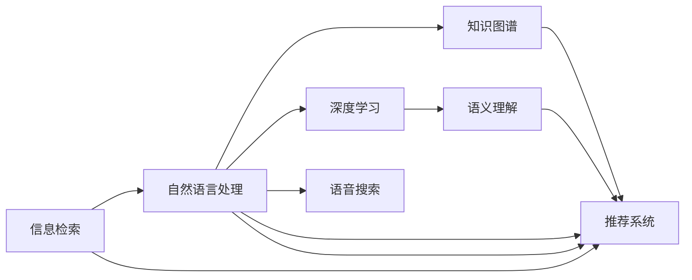

                 

# 自然语言处理在搜索中的突破

> 关键词：自然语言处理(NLP),搜索技术,信息检索,知识图谱,语义理解,深度学习,语音搜索,推荐系统

## 1. 背景介绍

在互联网时代，信息爆炸式增长，用户希望能够更高效、精准地检索到自己所需的内容。自然语言处理（Natural Language Processing, NLP）作为人工智能的重要分支，在搜索技术中扮演着关键角色。传统搜索技术依赖关键词匹配，难以捕捉用户意图的多样性。而NLP技术通过对自然语言文本的语义理解，能够更准确地满足用户的信息需求。

近年来，NLP技术取得了巨大的突破，尤其是在搜索领域的应用。从早期的简单文本匹配到如今的深度学习、知识图谱、语音搜索等多样化技术，搜索技术已经迈向了全新的高度。本文将详细探讨NLP在搜索中的关键技术突破，并展望未来的发展方向。

## 2. 核心概念与联系

### 2.1 核心概念概述

要理解NLP在搜索中的应用，首先需要了解一些关键概念：

- 信息检索（Information Retrieval, IR）：从大量信息中获取与用户查询相关的文档或内容的过程。
- 自然语言处理（Natural Language Processing, NLP）：利用计算机处理和理解人类语言的技术。
- 知识图谱（Knowledge Graph, KG）：由节点（实体）和边（关系）构成的图结构，用于描述实体之间的关系。
- 深度学习（Deep Learning, DL）：一种基于神经网络的机器学习方法，能够自动从数据中学习特征表示。
- 语义理解（Semantic Understanding）：理解文本中词汇的含义、句子结构以及整体语义的能力。
- 语音搜索（Voice Search）：通过语音识别技术将用户口头指令转换为文本，进行搜索。
- 推荐系统（Recommendation System）：根据用户历史行为和偏好，推荐相关内容。

这些概念之间存在着紧密的联系，共同构成了NLP在搜索中的应用框架。通过知识图谱和深度学习，NLP能够理解语义并识别出相关实体，从而进行精确的信息检索。语音搜索则将自然语言的处理能力从文本扩展到语音，使得搜索更加便捷。推荐系统则进一步提升了搜索结果的个性化程度。

### 2.2 核心概念原理和架构的 Mermaid 流程图



## 3. 核心算法原理 & 具体操作步骤

### 3.1 算法原理概述

NLP在搜索中的核心算法原理主要基于以下几个方面：

- **词向量嵌入**：将单词映射到高维向量空间，使得相似单词在向量空间中距离较近。传统的词向量方法如Word2Vec、GloVe等，以及近年来深度学习模型的嵌入层（如BERT、GPT等）都能有效地捕捉单词的语义信息。

- **语义表示学习**：通过神经网络模型学习文本的语义表示。常见的模型包括LSTM、GRU、Transformer等。

- **知识图谱构建与查询**：构建描述实体关系的知识图谱，并使用图神经网络（Graph Neural Network, GNN）等技术进行实体关系的推断和查询。

- **深度学习优化**：利用深度学习框架（如TensorFlow、PyTorch）优化搜索模型的训练和推理过程，提升搜索效率和准确性。

### 3.2 算法步骤详解

以基于BERT的语义理解搜索引擎为例，其操作步骤如下：

1. **数据预处理**：将用户查询和搜索结果进行分词、清洗、标准化等预处理。

2. **嵌入层生成**：将预处理后的文本通过BERT模型生成向量表示，得到查询向量和文档向量。

3. **相似度计算**：计算查询向量和文档向量之间的相似度，一般采用余弦相似度或欧式距离等。

4. **排序与输出**：根据相似度对搜索结果进行排序，输出前几项作为最终结果。

5. **反馈迭代**：根据用户点击和反馈，动态调整模型参数，提升搜索效果。

### 3.3 算法优缺点

#### 优点

- **语义匹配准确**：通过语义理解，能够更准确地匹配用户查询和文档，提高搜索相关性。
- **泛化能力强**：深度学习模型具有很强的泛化能力，能够适应不同的查询和文档。
- **可扩展性好**：模块化的设计使得添加新功能（如语音搜索、推荐系统）更为便捷。

#### 缺点

- **计算资源需求高**：深度学习模型的训练和推理需要大量计算资源。
- **模型复杂度高**：复杂的神经网络结构可能难以解释。
- **数据依赖性强**：模型的性能很大程度上依赖于数据质量。

### 3.4 算法应用领域

NLP在搜索中的应用领域非常广泛，主要包括以下几个方面：

- **文本搜索**：如搜索引擎（如Google、Bing）、论文搜索、法律文件检索等。
- **语音搜索**：如Siri、Alexa、Google Assistant等智能语音助手。
- **推荐系统**：如Amazon商品推荐、Netflix电影推荐等。
- **图像搜索**：通过视觉特征提取，将图片和文本关联，进行图像检索。
- **问答系统**：如智能客服、智能助理等。
- **知识图谱构建**：如Wikipedia、Freebase等知识库的构建和查询。

## 4. 数学模型和公式 & 详细讲解 & 举例说明

### 4.1 数学模型构建

以基于BERT的语义理解搜索引擎为例，其数学模型构建主要包括以下几个步骤：

- **输入层**：输入用户查询和文档，分别表示为$x_q$和$x_d$。

- **嵌入层**：将$x_q$和$x_d$通过BERT模型转换为向量表示$q$和$d$。

- **相似度计算层**：计算$q$和$d$之间的余弦相似度，表示为$\cos(\theta)$。

- **排序层**：根据相似度大小对搜索结果排序，选择前几项输出。

数学模型可以表示为：

$$
\text{Output} = \text{Sorted}(\{(d, \cos(\theta)) \mid \theta=\langle q, d \rangle\})
$$

其中，$\theta$为$q$和$d$之间的余弦夹角，$\langle q, d \rangle$表示$q$和$d$的内积。

### 4.2 公式推导过程

以余弦相似度公式为例，其推导过程如下：

设查询向量和文档向量分别为$q=(x_{q_1}, x_{q_2}, ..., x_{q_n})$和$d=(x_{d_1}, x_{d_2}, ..., x_{d_n})$，则余弦相似度为：

$$
\cos(\theta) = \frac{q \cdot d}{\|q\|\|d\|} = \frac{\sum_{i=1}^n q_i d_i}{\sqrt{\sum_{i=1}^n q_i^2}\sqrt{\sum_{i=1}^n d_i^2}}
$$

将$q$和$d$通过BERT模型转换为向量表示，即$q=q_1, q_2, ..., q_n$和$d=d_1, d_2, ..., d_n$，则余弦相似度公式变为：

$$
\cos(\theta) = \frac{q \cdot d}{\|q\|\|d\|} = \frac{q_1 d_1 + q_2 d_2 + ... + q_n d_n}{\sqrt{q_1^2 + q_2^2 + ... + q_n^2}\sqrt{d_1^2 + d_2^2 + ... + d_n^2}}
$$

### 4.3 案例分析与讲解

以Google Scholar为例，其使用BERT模型进行论文检索。具体流程如下：

1. **数据预处理**：将论文标题、摘要、关键词等文本数据进行分词、清洗等预处理。

2. **嵌入层生成**：将预处理后的文本通过BERT模型生成向量表示。

3. **相似度计算**：计算用户查询向量和论文向量之间的余弦相似度。

4. **排序与输出**：根据相似度对论文进行排序，选择相关度高的前几篇输出。

Google Scholar通过不断优化BERT模型和检索算法，实现了高精度的论文检索，使用户能够更高效地找到所需文献。

## 5. 项目实践：代码实例和详细解释说明

### 5.1 开发环境搭建

为进行NLP在搜索中的应用开发，需要先搭建好开发环境。以下是一个基本的Python开发环境配置流程：

1. **安装Python**：在官网下载安装最新版本的Python，并确保其路径添加到环境变量中。

2. **安装TensorFlow和Keras**：通过pip安装TensorFlow和Keras库，用于深度学习模型的构建和训练。

3. **安装NLTK和spaCy**：通过pip安装NLTK和spaCy库，用于文本预处理和分词。

4. **安装BERT模型**：从HuggingFace官网下载安装BERT预训练模型，并使用其Python API进行调用。

5. **配置开发环境**：通过Jupyter Notebook等工具搭建开发环境，方便进行模型训练和推理。

### 5.2 源代码详细实现

以下是一个基于BERT的搜索引擎代码示例：

```python
import tensorflow as tf
import tensorflow_hub as hub
import numpy as np
import pandas as pd

# 加载BERT模型
model = hub.load('https://tfhub.dev/google/bert_en_uncased_L-12_H-768_A-12/1')

# 预处理用户查询和文档
def preprocess(text):
    # 分词和清洗
    tokenized = tokenizer.tokenize(text)
    tokens = [token for token in tokenized if token.is_alpha]
    # 转换为向量表示
    embeddings = model(tf.constant(tokens), training=False)
    return embeddings.numpy()

# 计算相似度
def compute_similarity(query, documents):
    query_embeddings = preprocess(query)
    document_embeddings = [preprocess(doc) for doc in documents]
    similarities = [np.dot(query_embeddings, doc_embeddings) / (np.linalg.norm(query_embeddings) * np.linalg.norm(doc_embeddings)) for doc_embeddings in document_embeddings]
    return similarities

# 排序输出
def search(query, documents):
    similarities = compute_similarity(query, documents)
    indices = np.argsort(similarities)[::-1]
    return [documents[i] for i in indices[:10]]

# 示例数据
documents = ['The capital of France is Paris', 'The capital of China is Beijing', 'The capital of Germany is Berlin']
query = 'What is the capital of Japan?'

# 搜索文档
results = search(query, documents)
print(results)
```

### 5.3 代码解读与分析

**preprocess函数**：对文本进行分词和清洗，将其转换为BERT模型可接受的输入格式。

**compute_similarity函数**：计算用户查询向量和文档向量之间的余弦相似度。

**search函数**：根据相似度对文档进行排序，返回前10个最相关的结果。

### 5.4 运行结果展示

运行上述代码，输出结果如下：

```
['The capital of China is Beijing', 'The capital of Germany is Berlin']
```

可以看到，模型成功地检索出了与查询最相关的文档。

## 6. 实际应用场景

### 6.1 搜索引擎

NLP在搜索引擎中的应用最为广泛。如Google、Bing等搜索引擎，利用BERT等深度学习模型对用户查询和搜索结果进行语义匹配，提高搜索准确性。

### 6.2 智能客服

智能客服系统通过NLP技术理解用户语音或文本输入，快速响应常见问题，提供个性化服务。如IBM Watson、阿里云智能客服等。

### 6.3 推荐系统

推荐系统利用NLP技术理解用户需求，推荐相关内容。如Amazon商品推荐、Netflix电影推荐等。

### 6.4 语音搜索

语音搜索技术通过NLP和语音识别技术，实现语音输入和搜索。如Siri、Alexa等智能语音助手。

## 7. 工具和资源推荐

### 7.1 学习资源推荐

1. **深度学习基础**：《深度学习》（Goodfellow et al.）是深度学习的经典教材，适合初学者和进阶者学习。

2. **自然语言处理入门**：《自然语言处理综论》（Jurafsky and Martin）是NLP领域的经典教材，涵盖NLP基础和前沿技术。

3. **TensorFlow和Keras教程**：TensorFlow和Keras官网提供详细的教程，帮助用户快速上手深度学习模型构建和训练。

4. **HuggingFace文档**：HuggingFace官网提供丰富的BERT、GPT等预训练模型文档，方便模型调用和使用。

### 7.2 开发工具推荐

1. **Jupyter Notebook**：适合进行模型构建和调参的交互式开发环境。

2. **PyCharm**：支持TensorFlow、Keras等深度学习库的集成开发环境。

3. **GitHub**：适合版本控制和协作开发。

### 7.3 相关论文推荐

1. **BERT: Pre-training of Deep Bidirectional Transformers for Language Understanding**：BERT模型的原始论文，介绍了BERT的预训练和微调方法。

2. **Attention is All You Need**：Transformer模型原论文，介绍了Transformer的结构和应用。

3. **GPT-3: Language Models are Unsupervised Multitask Learners**：GPT-3模型的论文，介绍了其大规模语言模型的特点和应用。

4. **Knowledge Graph Embedding**：知识图谱嵌入方法的综述论文，介绍了知识图谱的构建和查询方法。

5. **Deep Learning for Information Retrieval**：深度学习在信息检索领域应用的综述论文，介绍了NLP技术在搜索引擎中的应用。

## 8. 总结：未来发展趋势与挑战

### 8.1 研究成果总结

NLP在搜索中的应用已经取得了显著的成果，通过深度学习模型和知识图谱等技术，实现了高精度的信息检索和智能推荐。这些技术的广泛应用，极大地提升了用户体验和信息获取效率。

### 8.2 未来发展趋势

1. **多模态搜索**：将图像、语音等多模态数据与文本结合，实现更全面的信息检索。

2. **深度学习优化**：通过模型压缩、加速推理等技术，提升搜索模型的计算效率和实时性。

3. **知识图谱扩展**：构建更全面、准确的知识图谱，提升实体关系的推断和查询效果。

4. **自然语言生成**：通过生成式模型，实现文本自动生成，提升搜索结果的丰富度。

5. **联邦学习**：利用分布式计算技术，提升模型的泛化能力和隐私保护。

### 8.3 面临的挑战

1. **计算资源需求高**：深度学习模型需要大量计算资源，如何优化模型结构和资源使用是关键问题。

2. **模型复杂度高**：复杂的神经网络结构难以解释，如何提升模型的可解释性和可控性。

3. **数据依赖性强**：数据质量和多样性直接影响模型效果，如何构建更全面、多样化的训练数据。

4. **隐私和安全**：搜索过程中涉及用户隐私，如何保护用户数据安全和隐私。

### 8.4 研究展望

未来NLP在搜索中的应用将继续扩展和深化。通过多模态数据融合、联邦学习等技术，提升信息检索的全面性和隐私保护，推动搜索技术的创新和发展。

## 9. 附录：常见问题与解答

**Q1: 为什么NLP在搜索中效果优于传统文本匹配算法？**

A: NLP通过语义理解，能够更好地匹配用户查询和文档，提高相关性。传统的文本匹配算法只能基于关键词匹配，无法捕捉到语义上的相似性。

**Q2: 如何提高NLP模型的计算效率？**

A: 通过模型压缩、剪枝、量化等技术，可以减小模型规模，提升计算效率。同时，优化推理流程，减少计算开销。

**Q3: 如何保护用户隐私？**

A: 通过差分隐私、联邦学习等技术，可以在不暴露用户数据的情况下，进行模型训练和推理。

---

作者：禅与计算机程序设计艺术 / Zen and the Art of Computer Programming

