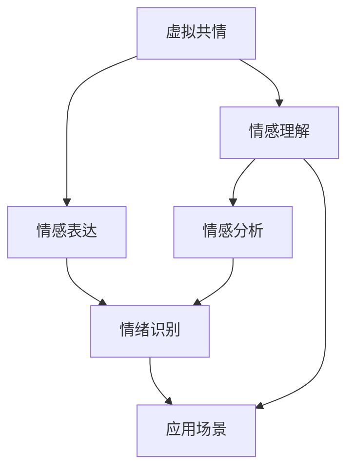

                 

# 虚拟共情：AI增强的情感理解

> 关键词：虚拟共情, 情感理解, 人工智能, 情感计算, 自然语言处理, 深度学习, 情感分析, 情绪识别, 应用场景

## 1. 背景介绍

### 1.1 问题由来

随着人工智能技术的飞速发展，情感计算（Affective Computing）已经逐渐成为当前学术界和工业界的热门话题。情感计算旨在通过机器学习和自然语言处理技术，实现对人类情感的自动理解和表达。在过去几十年中，情感计算技术已经取得了一些重要进展，例如基于面部表情、语音情感、文本情感等多种数据源的情感识别与分析方法。

然而，尽管现有的技术能够在一定程度上识别出情感表达，但在情感的深度理解和共情能力上仍存在诸多不足。特别是在虚拟场景（如聊天机器人、虚拟助手、在线客服等）中，机器在情感理解上的准确性和自然度仍难以匹配人类的水平。这不仅限制了虚拟共情技术的实际应用，也削弱了人工智能系统的用户体验和互动效果。

### 1.2 问题核心关键点

1. **虚拟共情**：指通过人工智能技术模拟人类的情感理解和表达能力，使机器能够更好地与人类进行情感交流和互动。虚拟共情技术是情感计算的核心目标之一，也是当前人工智能领域的研究热点。

2. **情感理解**：指机器对人类情感状态进行识别、分类和分析的过程。情感理解是实现虚拟共情的前提和基础，直接影响到机器的共情能力。

3. **情感表达**：指机器在理解人类情感后，能够自然流畅地进行情感表达，如语音、文字、表情等。情感表达能力的高低，决定了虚拟共情的实际效果和用户体验。

4. **自然语言处理（NLP）**：是实现情感理解与表达的重要手段之一。NLP技术能够从文本数据中提取情感特征，为情感计算提供数据支持。

5. **深度学习（DL）**：深度学习技术，特别是基于卷积神经网络（CNN）和循环神经网络（RNN）的模型，已经被广泛应用于情感计算中，显著提升了情感识别的准确性和泛化能力。

6. **情感分析与情绪识别**：情感分析旨在从文本中识别出情感极性（正面、负面、中性），情绪识别则关注于更细微的情感表达，如愤怒、悲伤、快乐等。

7. **应用场景**：虚拟共情技术在游戏、虚拟现实、在线客服、社交媒体分析等领域有着广泛的应用前景。例如，在虚拟客服中，通过情感分析，机器能够更自然地与用户互动，提升服务质量。

## 2. 核心概念与联系

### 2.1 核心概念概述

为更好地理解虚拟共情技术，本节将介绍几个密切相关的核心概念：

- **虚拟共情**：通过人工智能技术模拟人类的情感理解和表达能力，使机器能够更好地与人类进行情感交流和互动。
- **情感理解**：指机器对人类情感状态进行识别、分类和分析的过程。
- **情感表达**：指机器在理解人类情感后，能够自然流畅地进行情感表达，如语音、文字、表情等。
- **自然语言处理（NLP）**：是实现情感理解与表达的重要手段之一，从文本数据中提取情感特征。
- **深度学习（DL）**：特别是基于CNN和RNN的模型，已经被广泛应用于情感计算中，显著提升了情感识别的准确性和泛化能力。
- **情感分析与情绪识别**：情感分析旨在从文本中识别出情感极性，情绪识别关注于更细微的情感表达。
- **应用场景**：虚拟共情技术在游戏、虚拟现实、在线客服、社交媒体分析等领域有着广泛的应用前景。

这些核心概念之间的逻辑关系可以通过以下Mermaid流程图来展示：



这个流程图展示了几大核心概念及其之间的关系：

1. 虚拟共情通过情感理解与情感表达实现。
2. 情感理解包括情感分析和情绪识别。
3. 应用场景是虚拟共情技术的主要应用领域。

## 3. 核心算法原理 & 具体操作步骤
### 3.1 算法原理概述

虚拟共情技术的核心原理是通过深度学习模型，实现对人类情感的自动理解和表达。其基本流程包括情感识别、情感分类和情感表达三个主要步骤：

1. **情感识别**：使用深度学习模型从文本、语音或图像数据中识别出情感表达，如正面、负面、中性等。
2. **情感分类**：将识别出的情感进行分类，如愤怒、悲伤、快乐等细微情感的识别。
3. **情感表达**：基于情感分类结果，生成自然流畅的情感表达，如语音、文字、表情等。

通过这三个步骤，虚拟共情技术能够在虚拟场景中实现对人类情感的模拟与互动。

### 3.2 算法步骤详解

虚拟共情技术的核心算法主要包括情感识别和情感表达两个部分。以下将详细介绍这两个步骤的具体实现。

#### 3.2.1 情感识别

情感识别通常包括以下几个关键步骤：

1. **数据准备**：收集包含情感表达的文本、语音或图像数据，并进行预处理。
2. **特征提取**：使用NLP技术或CNN/RNN等深度学习模型，从数据中提取情感特征。
3. **情感分类**：使用分类器对提取的情感特征进行分类，识别出情感极性或细微情感。

以文本情感识别为例，以下是一个典型的情感识别流程：

1. **数据准备**：收集包含情感表达的文本数据，如电影评论、社交媒体帖子等。
2. **特征提取**：使用BERT等预训练模型，从文本中提取情感特征。
3. **情感分类**：使用分类器（如逻辑回归、SVM等）对提取的情感特征进行分类，识别出情感极性。

#### 3.2.2 情感表达

情感表达是指在理解人类情感后，机器能够自然流畅地进行情感表达。以下是一个典型的情感表达流程：

1. **生成文本**：基于情感分类结果，生成自然流畅的文本。
2. **生成语音**：使用TTS（Text-to-Speech）技术，将文本转化为自然流畅的语音。
3. **生成表情**：使用GAN（Generative Adversarial Networks）等技术，生成符合情感表达的表情图像。

以生成文本为例，以下是一个典型的情感表达流程：

1. **情感分类**：根据用户输入的文本，识别出情感极性或细微情感。
2. **生成文本**：基于情感分类结果，使用GPT等生成模型，生成自然流畅的回复文本。
3. **语义修正**：对生成的文本进行语义修正，确保其符合自然语言规范。

### 3.3 算法优缺点

虚拟共情技术在情感理解和表达方面取得了一定的进展，但也存在一些局限性：

**优点**：

1. **自动化**：通过深度学习模型，自动提取情感特征，无需手动标注。
2. **泛化能力**：深度学习模型具备较强的泛化能力，能在不同领域和数据源上取得良好表现。
3. **实时性**：深度学习模型能在实时场景中进行情感识别和表达，提升用户体验。

**缺点**：

1. **数据依赖**：深度学习模型依赖于大量高质量的标注数据，获取这些数据成本较高。
2. **情感复杂度**：细微情感的识别较为困难，容易发生误识别。
3. **文化差异**：情感表达在不同文化背景下可能存在差异，需要针对特定文化进行训练和优化。

### 3.4 算法应用领域

虚拟共情技术已经在多个领域得到了广泛应用，以下是几个典型应用场景：

1. **在线客服**：通过情感识别和情感表达，虚拟客服能够更自然地与用户互动，提升服务质量。
2. **虚拟助手**：在智能家居、智能助理等场景中，虚拟助手能够理解用户的情感需求，提供更符合用户心理的服务。
3. **游戏**：在游戏场景中，虚拟角色能够通过情感识别和表达，增强游戏沉浸感和互动性。
4. **社交媒体分析**：通过对社交媒体数据的情感分析，实时监测用户情绪变化，进行舆情分析和情感干预。
5. **心理健康**：通过虚拟心理医生，利用情感理解与表达，对用户的心理健康进行实时监测和干预。

## 4. 数学模型和公式 & 详细讲解 & 举例说明（备注：数学公式请使用latex格式，latex嵌入文中独立段落使用 $$，段落内使用 $)
### 4.1 数学模型构建

虚拟共情技术主要依赖深度学习模型实现情感识别和表达。以下将以文本情感识别为例，介绍情感识别模型的数学模型构建过程。

假设情感识别任务为二分类问题，输入为文本序列 $X=\{x_1, x_2, ..., x_n\}$，其中 $x_i$ 表示文本中的第 $i$ 个单词或字符。情感识别的目标是判断文本情感极性 $Y=\{1, 2\}$，其中 $1$ 表示正面情感，$2$ 表示负面情感。

情感识别模型的数学模型构建如下：

1. **文本嵌入**：使用BERT等预训练模型，将文本序列 $X$ 转换为高维稠密向量表示 $H=\{h_1, h_2, ..., h_n\}$，其中 $h_i \in \mathbb{R}^d$。
2. **情感分类器**：使用线性分类器或神经网络对文本嵌入 $H$ 进行分类，输出情感极性 $Y$。

线性分类器的数学模型为：

$$
\mathcal{L}(\theta) = -\frac{1}{N}\sum_{i=1}^N [y_i\log p_\theta(y_i|x_i)+(1-y_i)\log(1-p_\theta(y_i|x_i))]
$$

其中 $y_i$ 表示文本 $x_i$ 的真实情感极性，$p_\theta(y_i|x_i)$ 表示模型预测的情感极性概率，$\theta$ 为模型参数。

### 4.2 公式推导过程

以下将推导情感识别模型的详细公式和计算过程。

假设文本嵌入 $H$ 已通过BERT等预训练模型得到，情感分类器的输出为 $\hat{y}=\{\hat{y}_1, \hat{y}_2, ..., \hat{y}_n\}$，其中 $\hat{y}_i \in [0, 1]$ 表示文本 $x_i$ 被预测为正面情感的概率。

情感分类器的输出概率公式为：

$$
p_\theta(y_i|x_i) = \frac{e^{W_h^TH+\overrightarrow{b}_h^T}}{1+e^{W_h^TH+\overrightarrow{b}_h^T}}
$$

其中 $W_h$ 和 $\overrightarrow{b}_h$ 为分类器参数，$T$ 为文本嵌入 $H$ 与分类器参数矩阵的乘积。

将 $y_i=1$ 和 $y_i=2$ 分别代入上式，得到：

$$
p_\theta(1|x_i) = \frac{e^{W_h^TH_1+\overrightarrow{b}_h^T}}{1+e^{W_h^TH_1+\overrightarrow{b}_h^T}}
$$

$$
p_\theta(2|x_i) = \frac{e^{W_h^TH_2+\overrightarrow{b}_h^T}}{1+e^{W_h^TH_2+\overrightarrow{b}_h^T}}
$$

其中 $H_1$ 和 $H_2$ 分别为输入文本 $x_i$ 的正面情感和负面情感的文本嵌入向量。

情感分类器的损失函数为交叉熵损失：

$$
\mathcal{L}(\theta) = -\frac{1}{N}\sum_{i=1}^N [y_i\log p_\theta(1|x_i)+(1-y_i)\log(1-p_\theta(1|x_i))]
$$

通过梯度下降等优化算法，最小化损失函数 $\mathcal{L}$，得到最优的情感分类器参数 $\theta^*$。

### 4.3 案例分析与讲解

以下将通过一个具体案例，展示情感识别模型的实际应用过程。

假设我们有一组电影评论数据集，其中包含正面情感和负面情感两类。我们可以使用BERT模型提取评论的文本嵌入，并将其输入到一个情感分类器中，训练得到情感识别模型。

1. **数据准备**：收集包含正面情感和负面情感的电影评论数据，并将其划分为训练集、验证集和测试集。
2. **文本嵌入**：使用BERT模型对每条评论进行编码，生成高维稠密向量表示。
3. **情感分类器**：设计一个简单的线性分类器，对文本嵌入进行分类，输出情感极性。
4. **训练与评估**：在训练集上使用交叉熵损失函数进行训练，并在验证集上评估模型的性能，最终在测试集上测试模型的泛化能力。

## 5. 项目实践：代码实例和详细解释说明
### 5.1 开发环境搭建

在进行虚拟共情技术的项目实践前，我们需要准备好开发环境。以下是使用Python进行PyTorch开发的环境配置流程：

1. 安装Anaconda：从官网下载并安装Anaconda，用于创建独立的Python环境。

2. 创建并激活虚拟环境：
```bash
conda create -n pytorch-env python=3.8 
conda activate pytorch-env
```

3. 安装PyTorch：根据CUDA版本，从官网获取对应的安装命令。例如：
```bash
conda install pytorch torchvision torchaudio cudatoolkit=11.1 -c pytorch -c conda-forge
```

4. 安装Transformers库：
```bash
pip install transformers
```

5. 安装各类工具包：
```bash
pip install numpy pandas scikit-learn matplotlib tqdm jupyter notebook ipython
```

完成上述步骤后，即可在`pytorch-env`环境中开始项目实践。

### 5.2 源代码详细实现

这里我们以文本情感识别为例，给出使用Transformers库对BERT模型进行情感分类的PyTorch代码实现。

首先，定义情感分类器：

```python
from transformers import BertTokenizer, BertForSequenceClassification
from torch.utils.data import Dataset, DataLoader
from tqdm import tqdm
import torch

class SentimentDataset(Dataset):
    def __init__(self, texts, labels):
        self.texts = texts
        self.labels = labels
        self.tokenizer = BertTokenizer.from_pretrained('bert-base-cased')
        
    def __len__(self):
        return len(self.texts)
    
    def __getitem__(self, item):
        text = self.texts[item]
        label = self.labels[item]
        
        encoding = self.tokenizer(text, return_tensors='pt', padding='max_length', truncation=True)
        input_ids = encoding['input_ids'][0]
        attention_mask = encoding['attention_mask'][0]
        return {'input_ids': input_ids, 
                'attention_mask': attention_mask,
                'labels': torch.tensor(label, dtype=torch.long)}
```

然后，定义模型和优化器：

```python
from transformers import AdamW

model = BertForSequenceClassification.from_pretrained('bert-base-cased', num_labels=2)
optimizer = AdamW(model.parameters(), lr=2e-5)
```

接着，定义训练和评估函数：

```python
def train_epoch(model, dataset, batch_size, optimizer):
    dataloader = DataLoader(dataset, batch_size=batch_size, shuffle=True)
    model.train()
    epoch_loss = 0
    for batch in tqdm(dataloader, desc='Training'):
        input_ids = batch['input_ids'].to(device)
        attention_mask = batch['attention_mask'].to(device)
        labels = batch['labels'].to(device)
        model.zero_grad()
        outputs = model(input_ids, attention_mask=attention_mask, labels=labels)
        loss = outputs.loss
        epoch_loss += loss.item()
        loss.backward()
        optimizer.step()
    return epoch_loss / len(dataloader)

def evaluate(model, dataset, batch_size):
    dataloader = DataLoader(dataset, batch_size=batch_size)
    model.eval()
    preds, labels = [], []
    with torch.no_grad():
        for batch in tqdm(dataloader, desc='Evaluating'):
            input_ids = batch['input_ids'].to(device)
            attention_mask = batch['attention_mask'].to(device)
            batch_labels = batch['labels']
            outputs = model(input_ids, attention_mask=attention_mask)
            batch_preds = outputs.logits.argmax(dim=1).to('cpu').tolist()
            batch_labels = batch_labels.to('cpu').tolist()
            for pred, label in zip(batch_preds, batch_labels):
                preds.append(pred.item())
                labels.append(label.item())
                
    print(classification_report(labels, preds))
```

最后，启动训练流程并在测试集上评估：

```python
epochs = 5
batch_size = 16

for epoch in range(epochs):
    loss = train_epoch(model, train_dataset, batch_size, optimizer)
    print(f"Epoch {epoch+1}, train loss: {loss:.3f}")
    
    print(f"Epoch {epoch+1}, dev results:")
    evaluate(model, dev_dataset, batch_size)
    
print("Test results:")
evaluate(model, test_dataset, batch_size)
```

以上就是使用PyTorch对BERT进行情感识别任务的完整代码实现。可以看到，得益于Transformers库的强大封装，我们可以用相对简洁的代码完成BERT模型的加载和情感分类。

### 5.3 代码解读与分析

让我们再详细解读一下关键代码的实现细节：

**SentimentDataset类**：
- `__init__`方法：初始化文本、标签、分词器等关键组件。
- `__len__`方法：返回数据集的样本数量。
- `__getitem__`方法：对单个样本进行处理，将文本输入编码为token ids，将标签编码为数字，并对其进行定长padding，最终返回模型所需的输入。

**模型和优化器**：
- 使用BertForSequenceClassification加载BERT模型，并设计2分类器，用于情感识别。
- 使用AdamW优化器，设置学习率为2e-5。

**训练和评估函数**：
- 使用PyTorch的DataLoader对数据集进行批次化加载，供模型训练和推理使用。
- 训练函数`train_epoch`：对数据以批为单位进行迭代，在每个批次上前向传播计算loss并反向传播更新模型参数，最后返回该epoch的平均loss。
- 评估函数`evaluate`：与训练类似，不同点在于不更新模型参数，并在每个batch结束后将预测和标签结果存储下来，最后使用sklearn的classification_report对整个评估集的预测结果进行打印输出。

**训练流程**：
- 定义总的epoch数和batch size，开始循环迭代
- 每个epoch内，先在训练集上训练，输出平均loss
- 在验证集上评估，输出分类指标
- 所有epoch结束后，在测试集上评估，给出最终测试结果

可以看到，PyTorch配合Transformers库使得BERT情感分类的代码实现变得简洁高效。开发者可以将更多精力放在数据处理、模型改进等高层逻辑上，而不必过多关注底层的实现细节。

当然，工业级的系统实现还需考虑更多因素，如模型的保存和部署、超参数的自动搜索、更灵活的任务适配层等。但核心的情感分类流程基本与此类似。

## 6. 实际应用场景
### 6.1 智能客服系统

虚拟共情技术在智能客服系统中有着广泛的应用前景。传统客服往往需要配备大量人力，高峰期响应缓慢，且一致性和专业性难以保证。而使用虚拟共情技术的聊天机器人，可以7x24小时不间断服务，快速响应客户咨询，用自然流畅的语言解答各类常见问题。

在技术实现上，可以收集企业内部的历史客服对话记录，将问题和最佳答复构建成监督数据，在此基础上对预训练情感识别模型进行微调。微调后的情感识别模型能够自动理解用户意图，匹配最合适的答复模板进行回复。对于客户提出的新问题，还可以接入检索系统实时搜索相关内容，动态组织生成回答。如此构建的智能客服系统，能大幅提升客户咨询体验和问题解决效率。

### 6.2 金融舆情监测

金融机构需要实时监测市场舆论动向，以便及时应对负面信息传播，规避金融风险。传统的人工监测方式成本高、效率低，难以应对网络时代海量信息爆发的挑战。使用虚拟共情技术的情感分析技术，可以为金融舆情监测提供新的解决方案。

具体而言，可以收集金融领域相关的新闻、报道、评论等文本数据，并对其进行情感标注。在此基础上对预训练情感分析模型进行微调，使其能够自动判断文本属于何种情感。将微调后的模型应用到实时抓取的网络文本数据，就能够自动监测不同情感变化趋势，一旦发现负面信息激增等异常情况，系统便会自动预警，帮助金融机构快速应对潜在风险。

### 6.3 个性化推荐系统

当前的推荐系统往往只依赖用户的历史行为数据进行物品推荐，无法深入理解用户的真实兴趣偏好。使用虚拟共情技术的情感分析技术，可以更好地挖掘用户行为背后的情感信息，从而提供更精准、多样的推荐内容。

在实践中，可以收集用户浏览、点击、评论、分享等行为数据，提取和用户交互的物品标题、描述、标签等文本内容。将文本内容作为模型输入，用户的后续行为（如是否点击、购买等）作为监督信号，在此基础上微调预训练情感分析模型。微调后的情感分析模型能够从文本内容中准确把握用户的兴趣点。在生成推荐列表时，先用候选物品的文本描述作为输入，由情感分析模型预测用户的兴趣匹配度，再结合其他特征综合排序，便可以得到个性化程度更高的推荐结果。

### 6.4 未来应用展望

随着虚拟共情技术的不断发展，其在多个领域的应用前景将更加广阔。

在智慧医疗领域，基于虚拟共情技术的情感识别和情感表达，可以用于心理健康评估、患者情绪监测、医疗服务质量评价等方面。例如，通过虚拟医生机器人，利用情感理解与表达，对患者的心理健康进行实时监测和干预。

在智能教育领域，虚拟共情技术可以应用于作业批改、学情分析、知识推荐等方面，因材施教，促进教育公平，提高教学质量。例如，在虚拟助教系统中，利用情感分析技术，对学生的情感状态进行实时监测，提供针对性的学习建议。

在智慧城市治理中，虚拟共情技术可以用于城市事件监测、舆情分析、应急指挥等环节，提高城市管理的自动化和智能化水平，构建更安全、高效的未来城市。例如，通过虚拟客服系统，利用情感分析技术，对城市居民的情感状态进行实时监测，及时发现和解决市民关切问题。

此外，在企业生产、社会治理、文娱传媒等众多领域，虚拟共情技术也将不断涌现，为传统行业带来变革性影响。相信随着技术的日益成熟，虚拟共情技术必将在构建人机协同的智能时代中扮演越来越重要的角色。

## 7. 工具和资源推荐
### 7.1 学习资源推荐

为了帮助开发者系统掌握虚拟共情技术的理论基础和实践技巧，这里推荐一些优质的学习资源：

1. 《深度学习》课程：斯坦福大学开设的深度学习课程，涵盖深度学习的基本概念和前沿技术，适合入门学习。
2. 《自然语言处理综述》书籍：全面介绍自然语言处理的基本概念和技术，包括情感计算的内容。
3. 《情感计算》书籍：详细讲解情感计算的基本理论和应用，涵盖情感识别、情感表达等技术。
4. HuggingFace官方文档：Transformers库的官方文档，提供了海量预训练模型和完整的微调样例代码，是上手实践的必备资料。
5. Weights & Biases：模型训练的实验跟踪工具，可以记录和可视化模型训练过程中的各项指标，方便对比和调优。

通过对这些资源的学习实践，相信你一定能够快速掌握虚拟共情技术的精髓，并用于解决实际的情感计算问题。
### 7.2 开发工具推荐

高效的开发离不开优秀的工具支持。以下是几款用于虚拟共情技术开发的常用工具：

1. PyTorch：基于Python的开源深度学习框架，灵活动态的计算图，适合快速迭代研究。大部分预训练语言模型都有PyTorch版本的实现。
2. TensorFlow：由Google主导开发的开源深度学习框架，生产部署方便，适合大规模工程应用。同样有丰富的预训练语言模型资源。
3. Transformers库：HuggingFace开发的NLP工具库，集成了众多SOTA语言模型，支持PyTorch和TensorFlow，是进行情感识别和情感表达开发的利器。
4. Weights & Biases：模型训练的实验跟踪工具，可以记录和可视化模型训练过程中的各项指标，方便对比和调优。
5. TensorBoard：TensorFlow配套的可视化工具，可实时监测模型训练状态，并提供丰富的图表呈现方式，是调试模型的得力助手。

合理利用这些工具，可以显著提升虚拟共情技术的开发效率，加快创新迭代的步伐。

### 7.3 相关论文推荐

虚拟共情技术的发展源于学界的持续研究。以下是几篇奠基性的相关论文，推荐阅读：

1. 《深度学习与情感计算》论文：介绍深度学习技术在情感计算中的应用，包括情感识别和情感表达。
2. 《情感计算：理论与应用》论文：全面介绍情感计算的基本理论和应用，涵盖情感识别、情感表达等技术。
3. 《情感计算：一种计算视角》论文：从计算心理学的角度，探讨情感计算的理论与方法。
4. 《情感计算：挑战与未来》论文：探讨情感计算面临的挑战和未来发展方向。

这些论文代表了大语言模型微调技术的发展脉络。通过学习这些前沿成果，可以帮助研究者把握学科前进方向，激发更多的创新灵感。

## 8. 总结：未来发展趋势与挑战

### 8.1 总结

本文对虚拟共情技术的核心原理和实践方法进行了全面系统的介绍。首先阐述了虚拟共情技术的研究背景和意义，明确了情感识别和情感表达的重要性。其次，从原理到实践，详细讲解了情感识别和情感表达的数学模型和关键步骤，给出了情感识别任务的完整代码实现。同时，本文还探讨了虚拟共情技术在多个领域的应用前景，展示了其广阔的应用潜力。

通过本文的系统梳理，可以看到，虚拟共情技术已经在情感计算领域取得了一些重要进展，未来有望在智能客服、金融舆情、个性化推荐等多个领域得到广泛应用。然而，虚拟共情技术在情感复杂度、文化差异、情感表达自然度等方面仍面临诸多挑战。未来，需要在这些方面进行深入研究，提升虚拟共情的实际效果。

### 8.2 未来发展趋势

展望未来，虚拟共情技术将呈现以下几个发展趋势：

1. **深度学习模型的进步**：深度学习模型的精度和泛化能力将进一步提升，情感识别和情感表达的准确度将不断提高。
2. **多模态融合**：将文本、语音、图像等多模态数据进行融合，提升情感识别的准确性和泛化能力。
3. **跨文化适应**：研究不同文化背景下情感表达的差异，提升虚拟共情技术的跨文化适应能力。
4. **情感交互**：在虚拟助手、智能客服等场景中，实现更加自然流畅的情感交互，提升用户体验。
5. **实时监测与干预**：在心理健康、智能教育等场景中，实现对用户情感的实时监测与干预，提升服务质量。

这些趋势凸显了虚拟共情技术在情感计算领域的广阔前景。这些方向的探索发展，必将进一步提升虚拟共情的实际效果，为构建更加智能化、普适化的情感计算系统提供有力支持。

### 8.3 面临的挑战

尽管虚拟共情技术已经取得了一些重要进展，但在迈向更加智能化、普适化应用的过程中，仍面临诸多挑战：

1. **情感复杂度**：细微情感的识别较为困难，容易发生误识别。
2. **文化差异**：情感表达在不同文化背景下可能存在差异，需要针对特定文化进行训练和优化。
3. **情感表达自然度**：虚拟共情技术在情感表达的自然度上仍存在不足，难以达到人类的自然水平。
4. **跨文化适应**：不同文化背景下情感表达的差异性，需要进一步研究和解决。
5. **实时监测与干预**：对用户情感的实时监测与干预，需要更加高效、准确的情感识别模型。

这些挑战凸显了虚拟共情技术在情感计算领域的复杂性。未来需要在这些方面进行深入研究，提升虚拟共情的实际效果。

### 8.4 研究展望

未来，虚拟共情技术需要在以下几个方面进行深入研究：

1. **细微情感识别**：开发更加精确的情感识别模型，提升对细微情感的识别能力。
2. **跨文化适应**：研究不同文化背景下情感表达的差异，提升虚拟共情技术的跨文化适应能力。
3. **情感表达自然度**：研究更加自然流畅的情感表达方法，提升虚拟共情技术的自然度。
4. **多模态融合**：将文本、语音、图像等多模态数据进行融合，提升情感识别的准确性和泛化能力。
5. **实时监测与干预**：开发高效的情感监测与干预模型，实现对用户情感的实时监测与干预。

这些研究方向的探索发展，必将进一步提升虚拟共情技术的实际效果，为构建更加智能化、普适化的情感计算系统提供有力支持。

## 9. 附录：常见问题与解答

**Q1：虚拟共情技术是否适用于所有情感计算任务？**

A: 虚拟共情技术在大多数情感计算任务上都能取得不错的效果，特别是对于数据量较小的任务。但对于一些特定领域的任务，如医学、法律等，仅仅依靠通用语料预训练的模型可能难以很好地适应。此时需要在特定领域语料上进一步预训练，再进行微调，才能获得理想效果。

**Q2：情感识别和情感表达的具体实现方法有哪些？**

A: 情感识别和情感表达的具体实现方法主要包括：
1. **情感识别**：使用深度学习模型从文本、语音或图像数据中识别出情感表达，如正面、负面、中性等。
2. **情感分类**：将识别出的情感进行分类，如愤怒、悲伤、快乐等细微情感的识别。
3. **情感表达**：基于情感分类结果，生成自然流畅的情感表达，如语音、文字、表情等。

**Q3：虚拟共情技术在实际应用中需要注意哪些问题？**

A: 在实际应用中，虚拟共情技术需要注意以下问题：
1. **数据依赖**：深度学习模型依赖于大量高质量的标注数据，获取这些数据成本较高。
2. **情感复杂度**：细微情感的识别较为困难，容易发生误识别。
3. **文化差异**：情感表达在不同文化背景下可能存在差异，需要针对特定文化进行训练和优化。

**Q4：虚拟共情技术的未来发展方向有哪些？**

A: 虚拟共情技术的未来发展方向包括：
1. **深度学习模型的进步**：深度学习模型的精度和泛化能力将进一步提升，情感识别和情感表达的准确度将不断提高。
2. **多模态融合**：将文本、语音、图像等多模态数据进行融合，提升情感识别的准确性和泛化能力。
3. **跨文化适应**：研究不同文化背景下情感表达的差异，提升虚拟共情技术的跨文化适应能力。
4. **情感交互**：在虚拟助手、智能客服等场景中，实现更加自然流畅的情感交互，提升用户体验。
5. **实时监测与干预**：在心理健康、智能教育等场景中，实现对用户情感的实时监测与干预，提升服务质量。

这些方向的研究，必将进一步提升虚拟共情技术的实际效果，为构建更加智能化、普适化的情感计算系统提供有力支持。

---

作者：禅与计算机程序设计艺术 / Zen and the Art of Computer Programming

