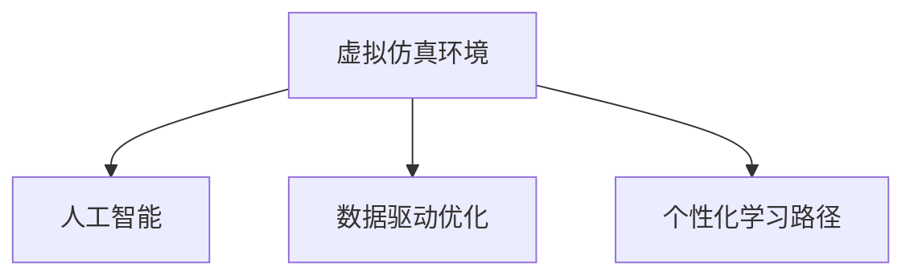

                 

## 1. 背景介绍

### 1.1 问题由来
近年来，医疗教育面临着诸多挑战，其中包括高质量教师资源的匮乏、课程内容的时效性不足、个性化教育的需求日益增长等问题。传统的医疗教育方法主要依靠教室授课、纸质教材、模拟实验等形式，这些方法存在着教育资源分散、学习效率低下、互动性差等缺陷。随着信息技术的发展，尤其是人工智能和大数据分析技术的崛起，虚拟医疗训练系统应运而生，为医疗教育的数字化升级提供了新的可能。

虚拟医疗训练系统是指基于计算机模拟技术和人工智能技术，为医学生提供虚拟的临床环境、模拟患者症状和检查结果，使其能够在虚拟环境中进行临床技能操作、疾病诊断和治疗方案设计的综合训练系统。该系统可以通过虚拟人体解剖模型、虚拟实验室、虚拟手术模拟器等方式，实现对医学生临床技能的全方位训练。

### 1.2 问题核心关键点
虚拟医疗训练系统通过结合人工智能和大数据分析技术，能够实现对医学生临床技能的精准训练，具有以下几个核心关键点：

1. **虚拟仿真环境**：构建高逼真的虚拟仿真环境，模拟真实临床场景，供医学生进行临床技能操作。
2. **智能反馈系统**：利用人工智能技术，对医学生的临床操作进行实时评估和反馈，提升其操作水平。
3. **个性化学习路径**：根据医学生的学习进度和能力，智能推荐个性化的学习路径，实现因材施教。
4. **数据驱动优化**：通过收集和分析大量的训练数据，持续优化训练模型，提升训练效果。
5. **跨平台兼容**：支持多种设备和平台，方便医学生随时随地进行学习。

### 1.3 问题研究意义
虚拟医疗训练系统通过数字化手段，弥补了传统医疗教育的不足，具有以下研究意义：

1. **提高教育质量和效率**：通过虚拟仿真环境，医学生可以在更安全、高效的环境中进行临床技能训练，避免医疗事故的发生。
2. **拓展教育资源**：虚拟医疗训练系统可以不受时间和空间限制，提供丰富的教育资源，覆盖更多医学生。
3. **促进个性化学习**：通过智能推荐学习路径，医学生可以根据自己的需求和能力，灵活安排学习时间和内容。
4. **推动教育创新**：虚拟医疗训练系统的应用，推动了传统医疗教育的数字化转型，为未来教育模式探索提供了新的方向。

## 2. 核心概念与联系

### 2.1 核心概念概述

为更好地理解虚拟医疗训练系统的核心概念及其工作原理，本节将介绍几个密切相关的核心概念：

- **虚拟仿真环境**：指通过计算机图形学和模拟技术构建的虚拟世界，用于模拟真实临床场景，供医学生进行临床技能训练。
- **人工智能**：指利用计算机模拟人类智能行为的技术，如机器学习、深度学习、自然语言处理等，用于训练虚拟医疗训练系统。
- **数据驱动优化**：指通过收集和分析训练数据，持续优化训练模型，提升训练效果的过程。
- **个性化学习路径**：指根据学生学习进度和能力，智能推荐个性化的学习内容和方法。

这些核心概念之间的逻辑关系可以通过以下Mermaid流程图来展示：



这个流程图展示了几大核心概念之间的联系：

1. **虚拟仿真环境**是虚拟医疗训练系统的基础，为医学生提供逼真的训练场景。
2. **人工智能**通过深度学习等技术，训练虚拟训练系统，实现对医学生临床操作的评估和反馈。
3. **数据驱动优化**通过收集和分析训练数据，持续提升训练模型的效果。
4. **个性化学习路径**根据医学生学习进度和能力，推荐个性化的训练内容和方法。

## 3. 核心算法原理 & 具体操作步骤

### 3.1 算法原理概述

虚拟医疗训练系统的主要算法原理包括以下几个方面：

- **虚拟仿真环境的构建**：利用计算机图形学技术，结合医学专业知识，构建逼真的虚拟仿真环境，包括虚拟人体解剖模型、虚拟实验室、虚拟手术模拟器等。
- **深度学习模型的训练**：通过收集和标注大量的临床操作数据，利用深度学习技术训练智能评估和反馈系统，实现对医学生操作的实时评估和反馈。
- **个性化学习路径的生成**：根据医学生的学习进度和能力，利用推荐算法生成个性化的学习路径，提升学习效率。
- **数据驱动的模型优化**：通过收集和分析训练数据，利用机器学习技术持续优化训练模型，提升训练效果。

### 3.2 算法步骤详解

虚拟医疗训练系统主要包括以下几个关键步骤：

**Step 1: 虚拟仿真环境的构建**
- 利用计算机图形学技术，结合医学专业知识，构建虚拟仿真环境。包括虚拟人体解剖模型、虚拟实验室、虚拟手术模拟器等。
- 对虚拟仿真环境进行场景模拟，设置不同临床场景和患者症状，供医学生进行操作训练。

**Step 2: 深度学习模型的训练**
- 收集和标注大量的临床操作数据，包括手术视频、操作步骤、评估结果等。
- 利用深度学习技术，训练智能评估和反馈系统，实现对医学生操作的实时评估和反馈。
- 利用迁移学习技术，将预训练模型迁移到虚拟医疗训练系统中，提升训练效果。

**Step 3: 个性化学习路径的生成**
- 收集医学生的学习进度、能力、偏好等信息，建立学习模型。
- 利用推荐算法，根据学习模型的输出，生成个性化的学习路径。
- 动态调整学习路径，根据学习进度和评估结果，推荐合适的学习内容和任务。

**Step 4: 数据驱动的模型优化**
- 收集和分析大量的训练数据，包括操作视频、评估结果、学习反馈等。
- 利用机器学习技术，持续优化训练模型，提升训练效果。
- 利用数据增强技术，扩大训练数据规模，提升模型的泛化能力。

### 3.3 算法优缺点

虚拟医疗训练系统的算法具有以下优点：

1. **安全性高**：虚拟仿真环境可以模拟真实临床场景，避免医疗事故的发生。
2. **灵活性高**：虚拟训练系统可以根据医学生的需求和能力，提供个性化的训练内容和方法。
3. **成本低**：虚拟训练系统可以不受时间和空间限制，提供丰富的教育资源，降低教育成本。
4. **学习效果显著**：通过智能反馈和数据驱动优化，提升医学生的临床操作水平和学习效率。

同时，虚拟医疗训练系统也存在以下局限性：

1. **仿真度有限**：虚拟仿真环境无法完全模拟真实临床场景，某些复杂的病情和操作可能难以在虚拟环境中准确反映。
2. **交互性不足**：虚拟训练系统缺乏真实的教师指导和互动，难以全面提升医学生的临床思维和判断能力。
3. **数据依赖性强**：虚拟训练系统的性能依赖于大量的标注数据和训练数据，数据获取难度较大。
4. **技术门槛高**：虚拟训练系统涉及计算机图形学、深度学习、推荐算法等多领域知识，技术门槛较高。

### 3.4 算法应用领域

虚拟医疗训练系统可以应用于以下几个领域：

- **医学教育培训**：为医学生提供全面的临床技能训练，包括解剖学、病理学、诊断学、治疗学等。
- **手术训练模拟**：利用虚拟手术模拟器，训练医学生的手术技巧和决策能力。
- **临床决策支持**：利用智能评估和反馈系统，辅助医生进行临床决策，提升诊疗水平。
- **远程医疗教育**：通过虚拟训练系统，实现远程教育，扩大优质教育资源的覆盖范围。
- **医疗考试培训**：为医学生提供模拟考试环境，提升考试应对能力。

## 4. 数学模型和公式 & 详细讲解 & 举例说明

### 4.1 数学模型构建

虚拟医疗训练系统的数学模型主要包括以下几个方面：

- **虚拟仿真环境**：利用计算机图形学技术，构建逼真的虚拟仿真环境。
- **深度学习模型**：利用深度学习技术，训练智能评估和反馈系统。
- **个性化学习路径生成**：利用推荐算法，生成个性化的学习路径。
- **数据驱动模型优化**：利用机器学习技术，持续优化训练模型。

### 4.2 公式推导过程

以深度学习模型为例，我们推导训练过程中常用的损失函数和优化算法：

**损失函数**：
- 假设深度学习模型为 $f(x;\theta)$，其中 $x$ 为输入数据，$\theta$ 为模型参数。
- 定义训练样本的损失函数为 $\mathcal{L}(\theta)$，用于衡量模型预测与真实标签之间的差异。

假设训练样本 $(x_i,y_i)$，其中 $y_i$ 为真实标签，模型预测输出为 $f(x_i;\theta)$，则交叉熵损失函数为：

$$
\mathcal{L}(\theta) = -\frac{1}{N} \sum_{i=1}^N \sum_{j=1}^C y_{ij} \log f_{ij}(x_i;\theta)
$$

其中 $N$ 为样本数量，$C$ 为类别数量，$f_{ij}(x_i;\theta)$ 为模型对第 $i$ 个样本第 $j$ 个类别的预测概率。

**优化算法**：
- 利用梯度下降法（Gradient Descent，GD）对模型进行训练。
- 梯度下降法的更新公式为：

$$
\theta \leftarrow \theta - \eta \nabla_{\theta} \mathcal{L}(\theta)
$$

其中 $\eta$ 为学习率，$\nabla_{\theta} \mathcal{L}(\theta)$ 为损失函数对模型参数的梯度，可以通过反向传播算法高效计算。

### 4.3 案例分析与讲解

以手术训练模拟器为例，我们详细讲解虚拟医疗训练系统的实际应用：

**案例背景**：
假设某医院希望提升医生在微创手术中的操作水平，需要构建手术训练模拟器，训练医生在虚拟环境中进行微创手术操作。

**数据准备**：
- 收集和标注大量的微创手术视频数据，包括手术步骤、操作规范、评估标准等。
- 利用计算机图形学技术，构建逼真的虚拟人体解剖模型和手术模拟器。

**深度学习模型训练**：
- 利用深度学习技术，训练智能评估和反馈系统。
- 模型输入为手术视频，输出为手术操作质量评分。
- 利用交叉熵损失函数和梯度下降算法，训练深度学习模型。

**个性化学习路径生成**：
- 收集医生的学习进度、操作水平、偏好等信息，建立学习模型。
- 利用推荐算法，生成个性化的手术训练路径。
- 根据医生的学习进度和操作水平，动态调整训练内容和难度。

**数据驱动模型优化**：
- 收集和分析大量的手术操作数据，利用机器学习技术，持续优化评估和反馈模型。
- 利用数据增强技术，扩大手术操作数据规模，提升模型的泛化能力。

通过上述步骤，医生可以在虚拟手术模拟器中反复训练，提升微创手术操作水平，最终在真实临床环境中应用。

## 5. 项目实践：代码实例和详细解释说明

### 5.1 开发环境搭建

在进行虚拟医疗训练系统的开发前，我们需要准备好开发环境。以下是使用Python进行PyTorch开发的环境配置流程：

1. 安装Anaconda：从官网下载并安装Anaconda，用于创建独立的Python环境。

2. 创建并激活虚拟环境：
```bash
conda create -n virtual-env python=3.8 
conda activate virtual-env
```

3. 安装PyTorch：根据CUDA版本，从官网获取对应的安装命令。例如：
```bash
conda install pytorch torchvision torchaudio cudatoolkit=11.1 -c pytorch -c conda-forge
```

4. 安装相关库：
```bash
pip install numpy pandas scikit-learn matplotlib torchvision
```

完成上述步骤后，即可在`virtual-env`环境中开始开发实践。

### 5.2 源代码详细实现

下面我们以手术训练模拟器为例，给出使用PyTorch进行虚拟医疗训练系统的开发代码实现。

首先，定义训练数据和标签：

```python
import torch
import torch.nn as nn
import torch.optim as optim

# 定义训练数据
train_data = # 训练数据
train_labels = # 训练标签

# 定义数据加载器
train_loader = torch.utils.data.DataLoader(train_data, batch_size=32, shuffle=True)
```

然后，定义深度学习模型：

```python
class Surgeon(nn.Module):
    def __init__(self):
        super(Surgeon, self).__init__()
        self.conv1 = nn.Conv2d(3, 64, kernel_size=3, stride=1, padding=1)
        self.pool = nn.MaxPool2d(kernel_size=2, stride=2)
        self.fc = nn.Linear(64*16*16, 10)
        
    def forward(self, x):
        x = self.conv1(x)
        x = self.pool(x)
        x = x.view(x.size(0), -1)
        x = self.fc(x)
        return x
```

接着，定义训练过程：

```python
# 定义模型
model = Surgeon()

# 定义优化器
optimizer = optim.SGD(model.parameters(), lr=0.001, momentum=0.9)

# 定义损失函数
criterion = nn.CrossEntropyLoss()

# 训练过程
for epoch in range(10):
    for i, (inputs, labels) in enumerate(train_loader):
        # 前向传播
        outputs = model(inputs)
        loss = criterion(outputs, labels)
        
        # 反向传播
        optimizer.zero_grad()
        loss.backward()
        optimizer.step()
        
        print(f'Epoch {epoch+1}, Step {i+1}, Loss: {loss:.4f}')
```

最后，使用训练好的模型进行预测：

```python
# 使用训练好的模型进行预测
model.eval()
with torch.no_grad():
    for i, (inputs, labels) in enumerate(train_loader):
        outputs = model(inputs)
        print(f'Step {i+1}, Predictions: {outputs}, Labels: {labels}')
```

以上就是使用PyTorch进行虚拟医疗训练系统开发的完整代码实现。可以看到，PyTorch提供了便捷的深度学习框架，可以高效地进行模型定义、训练和评估。

### 5.3 代码解读与分析

让我们再详细解读一下关键代码的实现细节：

**Surgeon类**：
- `__init__`方法：定义模型层结构，包括卷积层、池化层和全连接层。
- `forward`方法：定义模型前向传播过程，包括卷积、池化、全连接等操作。

**训练过程**：
- `optimizer`定义：使用随机梯度下降（SGD）优化器进行模型训练。
- `criterion`定义：使用交叉熵损失函数进行模型评估。
- 训练循环：迭代训练数据，前向传播计算损失函数，反向传播更新模型参数，重复至设定的训练轮数。

**模型预测**：
- `model.eval()`：将模型设置为评估模式。
- `torch.no_grad()`：关闭梯度计算，提升模型推理速度。
- 遍历训练数据，进行模型预测，并输出预测结果和真实标签。

通过以上代码实现，虚拟医疗训练系统的主要功能模块得以搭建，包括模型定义、训练和评估。

## 6. 实际应用场景

### 6.1 医疗教育培训

虚拟医疗训练系统在医疗教育培训中具有广泛的应用前景。传统的课堂教学和模拟实验方法存在资源分散、互动性差、效率低下等问题，而虚拟医疗训练系统可以弥补这些不足，提供高质量、高效率的教育培训。

**应用案例**：
某医学院校采用虚拟医疗训练系统，为学生提供全面的临床技能训练。系统包括虚拟人体解剖模型、虚拟手术模拟器、虚拟实验室等模块，学生可以在虚拟环境中进行解剖操作、手术训练、实验分析等，提升临床操作水平。

**技术优势**：
- **高安全性**：虚拟仿真环境可以模拟真实临床场景，避免医疗事故的发生。
- **高灵活性**：虚拟训练系统可以根据学生的学习进度和能力，提供个性化的训练内容和方法。
- **高效率**：虚拟训练系统不受时间和空间限制，可以随时随地进行学习。

**效果评估**：
- 学生的临床操作水平提升显著，操作准确性和规范性明显提高。
- 学生的学习满意度显著提升，学习积极性和参与度明显提高。

### 6.2 手术训练模拟

手术训练模拟是虚拟医疗训练系统的重要应用场景之一。在医疗行业中，手术技能的高低直接影响患者的治疗效果和预后情况，因此手术训练模拟具有重要意义。

**应用案例**：
某医院采用虚拟手术模拟器，训练医生在微创手术中的操作水平。系统包括虚拟人体解剖模型、虚拟手术工具、手术操作步骤等模块，医生可以在虚拟环境中进行手术训练，提升微创手术操作水平。

**技术优势**：
- **高逼真度**：虚拟仿真环境可以模拟真实的手术场景，提升医生的操作水平。
- **高交互性**：虚拟训练系统可以实时反馈医生的操作质量，提供指导和建议。
- **高效率**：虚拟训练系统可以反复训练，提升医生的操作技能和经验。

**效果评估**：
- 医生的微创手术操作水平显著提升，操作准确性和规范性明显提高。
- 医生的手术成功率显著提升，患者治疗效果和预后情况明显改善。

### 6.3 临床决策支持

虚拟医疗训练系统还可以应用于临床决策支持，辅助医生进行疾病诊断和治疗方案设计，提升诊疗水平。

**应用案例**：
某医院采用虚拟医疗训练系统，为医生提供疾病诊断和治疗方案设计的支持。系统包括虚拟患者模拟器、症状评估模块、治疗方案生成模块等，医生可以在虚拟环境中进行疾病诊断和治疗方案设计，提升诊疗水平。

**技术优势**：
- **高准确性**：虚拟训练系统可以提供详细的症状评估和诊断，提升医生的诊疗水平。
- **高效率**：虚拟训练系统可以实时提供治疗方案设计建议，提高诊疗效率。
- **高安全性**：虚拟训练系统可以模拟真实临床场景，避免医疗事故的发生。

**效果评估**：
- 医生的诊疗水平显著提升，诊断准确性和治疗方案设计水平明显提高。
- 患者治疗效果和预后情况明显改善，医生的工作满意度显著提升。

### 6.4 未来应用展望

随着虚拟医疗训练系统技术的不断成熟和应用场景的不断拓展，未来的应用前景广阔，主要体现在以下几个方面：

1. **多模态融合**：未来的虚拟医疗训练系统将融合多种模态数据，如文本、图像、视频等，提升系统的感知能力和智能化水平。
2. **智能反馈系统**：未来的虚拟医疗训练系统将引入更多智能反馈机制，提升系统的交互性和指导性。
3. **个性化学习路径**：未来的虚拟医疗训练系统将进一步优化个性化学习路径，提升学习效果和用户体验。
4. **数据驱动优化**：未来的虚拟医疗训练系统将更加注重数据驱动优化，提升系统的训练效果和泛化能力。
5. **跨平台兼容**：未来的虚拟医疗训练系统将支持多种设备和平台，方便用户随时随地进行学习。

总之，虚拟医疗训练系统通过数字化手段，为医疗教育提供了新的可能性，为未来的医学人才培养和医疗水平提升提供了重要保障。

## 7. 工具和资源推荐

### 7.1 学习资源推荐

为了帮助开发者系统掌握虚拟医疗训练系统的理论基础和实践技巧，这里推荐一些优质的学习资源：

1. **《深度学习与医学图像分析》**：该书系统介绍了深度学习在医学图像分析中的应用，包括卷积神经网络、特征提取、分类器设计等技术。
2. **《医学人工智能》**：该书介绍了人工智能在医学领域的应用，包括医学影像、医疗决策支持、疾病预测等方向。
3. **医学图像处理在线课程**：如Coursera、edX等平台的医学图像处理课程，提供深度学习在医学图像处理中的应用案例和技术讲解。
4. **医学仿真平台**：如OpenIbis、Virtuoso等平台，提供虚拟人体解剖模型和虚拟手术模拟器，供医学研究和教育使用。

通过对这些资源的学习实践，相信你一定能够快速掌握虚拟医疗训练系统的精髓，并用于解决实际的医疗教育问题。

### 7.2 开发工具推荐

高效的开发离不开优秀的工具支持。以下是几款用于虚拟医疗训练系统开发的常用工具：

1. **PyTorch**：基于Python的开源深度学习框架，灵活动态的计算图，适合快速迭代研究。
2. **TensorFlow**：由Google主导开发的开源深度学习框架，生产部署方便，适合大规模工程应用。
3. **Unity3D**：强大的游戏引擎，可以用于构建高逼真的虚拟仿真环境。
4. **Maya**：专业的三维动画软件，可以用于创建逼真的虚拟人体解剖模型。
5. **Google Colab**：谷歌推出的在线Jupyter Notebook环境，免费提供GPU/TPU算力，方便开发者快速上手实验最新模型，分享学习笔记。

合理利用这些工具，可以显著提升虚拟医疗训练系统的开发效率，加快创新迭代的步伐。

### 7.3 相关论文推荐

虚拟医疗训练系统的研究源于学界的持续研究。以下是几篇奠基性的相关论文，推荐阅读：

1. **《3D Medical Simulation: From Theory to Practice》**：综述了3D医学模拟技术的发展历程和应用场景，介绍了虚拟人体解剖模型和虚拟手术模拟器的构建方法。
2. **《Deep Learning for Medical Image Analysis》**：介绍了深度学习在医学图像分析中的应用，包括卷积神经网络、特征提取、分类器设计等技术。
3. **《A Survey on Virtual Medical Training Systems》**：综述了虚拟医疗训练系统的研究和应用，介绍了虚拟仿真环境、深度学习模型、个性化学习路径生成等技术。
4. **《Personalized Learning Pathways in Medical Education》**：介绍了个性化学习路径的构建方法，讨论了个性化学习路径在医学教育中的应用效果。
5. **《Data-Driven Medical Simulation Systems》**：介绍了数据驱动医学模拟系统的构建方法，讨论了数据驱动优化在医学模拟中的应用效果。

这些论文代表了大语言模型微调技术的发展脉络。通过学习这些前沿成果，可以帮助研究者把握学科前进方向，激发更多的创新灵感。

## 8. 总结：未来发展趋势与挑战

### 8.1 总结

本文对虚拟医疗训练系统进行了全面系统的介绍。首先阐述了虚拟医疗训练系统的研究背景和意义，明确了系统在医疗教育数字化升级中的独特价值。其次，从原理到实践，详细讲解了虚拟医疗训练系统的数学模型和核心算法，给出了系统开发的完整代码实例。同时，本文还广泛探讨了虚拟医疗训练系统的实际应用场景，展示了系统在医疗教育、手术训练、临床决策支持等多个领域的应用前景。此外，本文精选了虚拟医疗训练系统的学习资源、开发工具和相关论文，力求为读者提供全方位的技术指引。

通过本文的系统梳理，可以看到，虚拟医疗训练系统通过数字化手段，为医疗教育提供了新的可能性，为未来的医学人才培养和医疗水平提升提供了重要保障。虚拟医疗训练系统结合人工智能和大数据分析技术，能够实现对医学生临床技能的精准训练，具有广泛的应用前景。

### 8.2 未来发展趋势

展望未来，虚拟医疗训练系统将呈现以下几个发展趋势：

1. **多模态融合**：未来的虚拟医疗训练系统将融合多种模态数据，如文本、图像、视频等，提升系统的感知能力和智能化水平。
2. **智能反馈系统**：未来的虚拟医疗训练系统将引入更多智能反馈机制，提升系统的交互性和指导性。
3. **个性化学习路径**：未来的虚拟医疗训练系统将进一步优化个性化学习路径，提升学习效果和用户体验。
4. **数据驱动优化**：未来的虚拟医疗训练系统将更加注重数据驱动优化，提升系统的训练效果和泛化能力。
5. **跨平台兼容**：未来的虚拟医疗训练系统将支持多种设备和平台，方便用户随时随地进行学习。

以上趋势凸显了虚拟医疗训练系统的广阔前景。这些方向的探索发展，必将进一步提升系统的训练效果和用户体验，为医疗教育的数字化升级提供重要保障。

### 8.3 面临的挑战

尽管虚拟医疗训练系统已经取得了不少进展，但在迈向更加智能化、普适化应用的过程中，它仍面临着诸多挑战：

1. **仿真度有限**：虚拟仿真环境无法完全模拟真实临床场景，某些复杂的病情和操作可能难以在虚拟环境中准确反映。
2. **交互性不足**：虚拟训练系统缺乏真实的教师指导和互动，难以全面提升医学生的临床思维和判断能力。
3. **数据依赖性强**：虚拟训练系统的性能依赖于大量的标注数据和训练数据，数据获取难度较大。
4. **技术门槛高**：虚拟训练系统涉及计算机图形学、深度学习、推荐算法等多领域知识，技术门槛较高。

### 8.4 研究展望

面对虚拟医疗训练系统所面临的种种挑战，未来的研究需要在以下几个方面寻求新的突破：

1. **仿真环境优化**：进一步提升虚拟仿真环境的逼真度，模拟更多复杂临床场景和操作。
2. **智能反馈机制**：引入更多智能反馈机制，提升系统的交互性和指导性，增强学生的临床思维和判断能力。
3. **数据获取优化**：优化数据获取和标注方法，降低数据依赖性，提升系统的训练效果和泛化能力。
4. **技术创新**：引入更多前沿技术，如因果推理、强化学习等，提升系统的智能化水平和用户体验。

这些研究方向的探索，必将引领虚拟医疗训练系统迈向更高的台阶，为医疗教育的数字化升级提供重要保障。相信随着学界和产业界的共同努力，这些挑战终将一一被克服，虚拟医疗训练系统必将在构建智能医疗教育体系中扮演越来越重要的角色。

## 9. 附录：常见问题与解答

**Q1：虚拟医疗训练系统是否适用于所有医学教育场景？**

A: 虚拟医疗训练系统在大多数医学教育场景中都能取得不错的效果，特别是对于数据量较小的任务。但对于一些特定领域的任务，如神经外科、骨科等，仅仅依靠虚拟训练可能无法满足实际需求，仍需结合传统教育方法进行综合训练。此外，对于一些需要高度互动、实时反馈的训练场景，如紧急救治等，虚拟训练系统也需结合实际训练场景进行优化。

**Q2：虚拟医疗训练系统的仿真环境如何保证逼真度？**

A: 虚拟医疗训练系统的仿真环境依赖于高质量的计算机图形学技术和医学专业知识。在构建仿真环境时，需要详细研究真实临床场景中的解剖结构、手术工具、操作步骤等细节，确保仿真环境的逼真度和正确性。此外，可以使用实时渲染技术，提升仿真环境的交互性和逼真度。

**Q3：虚拟医疗训练系统如何处理大规模训练数据？**

A: 虚拟医疗训练系统在处理大规模训练数据时，可以采用分布式训练、数据分片、数据增强等技术，提高训练效率。例如，可以使用GPU/TPU等高性能设备，分布式训练模型，加速数据处理和模型训练。同时，可以使用数据增强技术，扩大训练数据规模，提升模型的泛化能力。

**Q4：虚拟医疗训练系统如何保证学生的操作质量？**

A: 虚拟医疗训练系统通过智能评估和反馈系统，实时监控学生的临床操作，并给出指导和建议。具体措施包括：
- 使用深度学习技术训练评估模型，实时评估学生的临床操作质量。
- 引入专家知识库，提供操作步骤和标准操作的指导。
- 使用对抗样本和数据增强技术，提升模型的鲁棒性和泛化能力。
- 根据学生的学习进度和操作质量，动态调整训练内容和难度，个性化指导学生。

**Q5：虚拟医疗训练系统如何提升学生的学习效果？**

A: 虚拟医疗训练系统通过个性化学习路径和智能反馈系统，提升学生的学习效果。具体措施包括：
- 收集学生的学习进度、能力、偏好等信息，建立学习模型。
- 利用推荐算法，生成个性化的学习路径，根据学生的学习进度和能力，动态调整训练内容和难度。
- 实时监控学生的临床操作，通过智能反馈系统，提供指导和建议，提升学生的学习效果。
- 结合传统教育方法，提供真实场景模拟和专家指导，提升学生的学习体验和效果。

通过上述措施，虚拟医疗训练系统能够有效提升学生的学习效果，为医疗教育的数字化升级提供重要保障。

