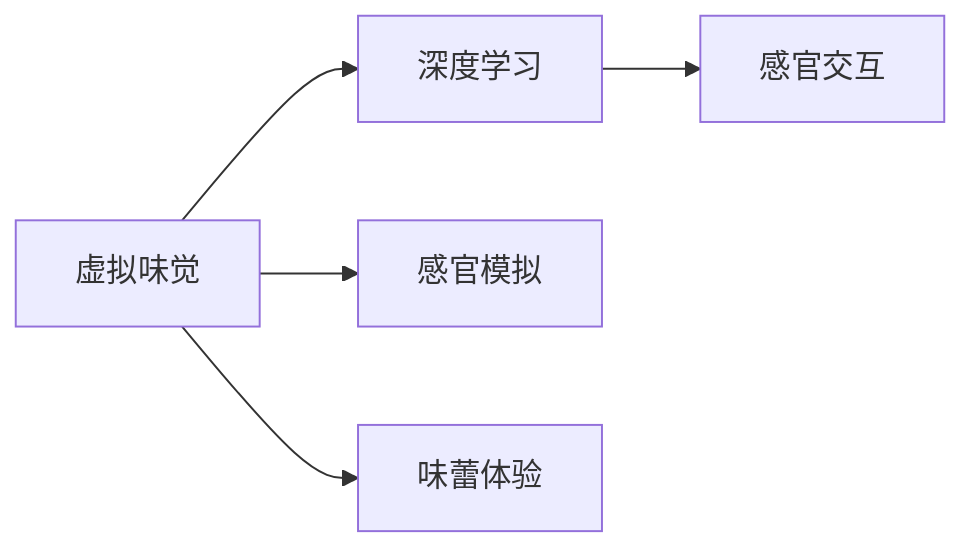

                 

# 虚拟味觉实验室：AI研发的味蕾体验

> 关键词：虚拟味觉, 人工智能, 深度学习, 感官模拟, 感官交互, 味蕾体验, 未来厨房

## 1. 背景介绍

在现代科技的驱动下，人类正逐渐进入一个虚拟化的全新时代。从虚拟现实游戏到增强现实技术，从远程工作到在线教育，虚拟化体验已经深入到社会的方方面面。而味觉，作为人类最为重要的感官之一，其虚拟化的探索与实现，不仅具有潜在的科学价值，更能带来广泛的产业应用，引发一场未来的感官革命。

### 1.1 虚拟味觉的重要性

味觉的虚拟化体验，不仅能够带来更加直观、互动的美食体验，还能在医疗、食品研发、教育和娱乐等多个领域中发挥重要作用。通过虚拟味觉技术，我们可以：

- 在医疗领域中，通过模拟患者的味觉感受，帮助其进行营养评估和口味偏好分析，提升治疗体验。
- 在食品研发中，快速测试和优化食品配方，加速新品开发进程。
- 在教育中，通过虚拟厨房和餐厅，提供沉浸式学习体验，提升学生的烹饪和美食鉴赏能力。
- 在娱乐中，通过模拟不同的味觉场景，丰富游戏和影视的体验维度。

### 1.2 当前的研究现状

尽管虚拟味觉技术目前仍处于起步阶段，但已经吸引了众多研究机构和企业的关注。美国宇航局（NASA）和麻省理工学院媒体实验室等机构，通过味觉仿真软件，对虚拟味觉进行了初步探索。而谷歌、微软、亚马逊等科技巨头，也通过相关技术布局，展示了其对虚拟味觉的前瞻性研究。

但现有的虚拟味觉研究主要集中在理论模型的构建和有限的实验数据验证上，缺乏实际应用中的深度融合和用户体验的全面提升。为此，本文旨在通过探讨核心概念和技术细节，从理论和实践两个维度，深入挖掘虚拟味觉的前景与挑战，为未来的研发工作提供借鉴和指导。

## 2. 核心概念与联系

### 2.1 核心概念概述

虚拟味觉技术的核心概念包括：

- **虚拟味觉**：通过技术手段，模拟人类的味觉感受，提供与真实味觉体验相似的感官反馈。
- **深度学习**：一种基于神经网络的机器学习方法，能够处理大量数据，从中提取出模式和规律。
- **感官模拟**：通过人工智能技术，将非物理性数据转换为感官体验，从而实现虚拟化效果。
- **味蕾体验**：通过虚拟味觉技术，用户能够在虚拟环境中获得真实的味觉感受，仿佛置身于真实世界中。
- **感官交互**：通过深度学习算法，实现对用户味蕾反馈的实时分析和响应，提供交互式的味觉体验。

这些概念之间存在紧密联系，构成了一个完整的虚拟味觉体系，如图：



### 2.2 核心概念原理和架构

以下是对这些核心概念原理和架构的详细阐述：

#### 2.2.1 深度学习

深度学习是一种通过多层次的神经网络模型进行数据处理的机器学习方法。其核心思想是通过逐层的前向传播和反向传播，不断调整网络权重，优化模型性能。

**原理**：深度学习模型由多个神经网络层组成，每一层都对输入数据进行非线性变换，提取特征。最终输出层的预测结果，通过损失函数与真实标签进行对比，反向传播更新权重。

**架构**：典型的深度学习模型包括输入层、隐藏层和输出层。输入层接收原始数据，隐藏层对数据进行抽象特征提取，输出层生成预测结果。

#### 2.2.2 感官模拟

感官模拟技术通过深度学习，将非物理性数据（如视觉、听觉、味觉等）转换为感官体验，从而实现虚拟化效果。其核心在于理解感官信号与感官体验之间的关系，并利用神经网络模型进行映射。

**原理**：将感官信号（如味觉电位、视觉图像等）输入到深度学习模型中，模型通过学习数据分布，生成相应的感官体验。

**架构**：感官模拟系统主要由输入处理层、特征提取层和输出生成层组成。输入处理层对原始数据进行处理，特征提取层提取重要特征，输出生成层生成感官体验。

#### 2.2.3 味蕾体验

味蕾体验技术通过模拟人类的味觉感受，提供与真实味觉体验相似的感官反馈。其核心在于理解味蕾对不同味质（如酸、甜、苦、咸）的反应，并利用深度学习模型进行仿真。

**原理**：味蕾通过不同的味蕾细胞（如甜味细胞、苦味细胞等）对不同的味质做出响应，产生电信号。味蕾体验技术通过深度学习模型，将味质刺激与味蕾响应进行映射，生成仿真味觉体验。

**架构**：味蕾体验系统包括味蕾模型、味质刺激生成器和感官反馈模块。味蕾模型模拟味蕾细胞对味质的响应，味质刺激生成器生成不同的味质刺激，感官反馈模块将味质刺激映射为仿真味觉体验。

#### 2.2.4 感官交互

感官交互技术通过深度学习，实现对用户味蕾反馈的实时分析和响应，提供交互式的味觉体验。其核心在于理解用户味蕾反馈与行为之间的关系，并利用神经网络模型进行实时处理。

**原理**：用户通过感官设备（如味蕾刺激器）与虚拟味觉系统进行交互，系统实时监测味蕾反馈（如电信号），并通过深度学习模型进行分析和预测。

**架构**：感官交互系统包括用户输入模块、深度学习模块和行为响应模块。用户输入模块监测味蕾反馈，深度学习模块分析反馈数据，行为响应模块根据反馈生成相应的交互行为。

## 3. 核心算法原理 & 具体操作步骤

### 3.1 算法原理概述

虚拟味觉技术的核心算法原理主要基于深度学习，通过感官模拟和味蕾体验技术，实现对味觉的虚拟化处理。其核心思想在于：

- 利用深度学习模型对味质刺激进行映射，生成仿真味觉体验。
- 通过深度学习模型实时分析用户味蕾反馈，生成交互式体验。

### 3.2 算法步骤详解

以下是对虚拟味觉技术主要算法的详细步骤详解：

#### 3.2.1 数据收集与预处理

- **收集味质刺激数据**：通过味质刺激生成器，收集不同味质的刺激数据（如糖、盐、酸等），并将其转换为电信号。
- **收集味蕾响应数据**：通过味蕾刺激器，收集不同味质对味蕾细胞的响应数据，并将其转换为电信号。
- **数据预处理**：对收集到的数据进行标准化处理，确保数据质量一致。

#### 3.2.2 特征提取与建模

- **特征提取**：对味质刺激数据和味蕾响应数据进行特征提取，包括提取频率、幅度、时间等重要特征。
- **模型训练**：利用提取的特征，训练深度学习模型。常用的模型包括卷积神经网络（CNN）和循环神经网络（RNN）。
- **仿真味觉体验生成**：通过训练好的深度学习模型，将味质刺激数据映射为仿真味觉体验，提供给用户。

#### 3.2.3 交互式体验设计

- **实时监测味蕾反馈**：通过味蕾刺激器，实时监测用户味蕾反馈（如电信号）。
- **深度学习分析**：利用深度学习模型，对味蕾反馈数据进行分析，提取行为特征。
- **行为响应**：根据分析结果，设计相应的交互式体验，如控制虚拟厨房中的电器设备，模拟烹饪过程。

#### 3.2.4 用户体验评估与优化

- **用户体验评估**：通过用户反馈，评估虚拟味觉体验的真实性和交互性。
- **算法优化**：根据评估结果，对深度学习模型和交互设计进行优化，提升用户体验。

### 3.3 算法优缺点

#### 3.3.1 优点

- **高逼真度**：通过深度学习模型，能够实现对味蕾反馈的高精度仿真，提供逼真的味觉体验。
- **广泛适用性**：虚拟味觉技术可以应用于医疗、食品研发、教育等多个领域，具有广泛的应用前景。
- **交互性**：通过实时监测和反馈，实现交互式的味觉体验，提升用户参与度。

#### 3.3.2 缺点

- **计算资源需求高**：深度学习模型的训练和运行需要大量的计算资源，对硬件设备要求较高。
- **用户体验差异**：不同用户的味蕾对同一种味质的响应可能存在差异，仿真味觉体验可能无法完全匹配真实味觉。
- **算法复杂性高**：深度学习模型涉及复杂的神经网络结构和训练过程，需要较高的技术门槛。

### 3.4 算法应用领域

虚拟味觉技术在多个领域中具有广泛的应用前景，包括：

- **医疗与健康**：通过模拟味蕾体验，帮助患者进行营养评估和口味偏好分析。
- **食品研发**：快速测试和优化食品配方，提升食品品质。
- **教育**：提供沉浸式学习体验，提升学生的烹饪和美食鉴赏能力。
- **娱乐**：模拟不同的味觉场景，丰富游戏和影视的体验维度。

## 4. 数学模型和公式 & 详细讲解 & 举例说明

### 4.1 数学模型构建

虚拟味觉技术主要通过深度学习模型实现味蕾体验的仿真。以下是对其数学模型的构建和详细讲解：

#### 4.1.1 神经网络模型

深度学习模型通常包括多个神经网络层，如图：

$$
\begin{aligned}
&\text{Input Layer} \rightarrow \text{Hidden Layer}_1 \rightarrow \text{Hidden Layer}_2 \rightarrow ... \rightarrow \text{Output Layer}\\
&\text{Input Data} \rightarrow \text{Nonlinear Transformation}_1 \rightarrow \text{Nonlinear Transformation}_2 \rightarrow ... \rightarrow \text{Prediction}
\end{aligned}
$$

其中，输入层接收原始数据，隐藏层对数据进行非线性变换，提取特征，输出层生成预测结果。

#### 4.1.2 损失函数

深度学习模型的训练通常需要定义一个损失函数，用于衡量模型预测结果与真实标签之间的差异。常用的损失函数包括均方误差（MSE）和交叉熵（CE）。

$$
\mathcal{L} = \sum_i (y_i - \hat{y}_i)^2 \quad \text{(MSE)}
$$

$$
\mathcal{L} = -\sum_i y_i \log \hat{y}_i \quad \text{(CE)}
$$

其中，$y_i$为真实标签，$\hat{y}_i$为模型预测结果。

#### 4.1.3 反向传播算法

反向传播算法是深度学习模型训练的核心算法之一，其通过链式法则计算模型参数的梯度，更新权重。

$$
\frac{\partial \mathcal{L}}{\partial w_j} = \frac{\partial \mathcal{L}}{\partial z_j} \cdot \frac{\partial z_j}{\partial w_j}
$$

其中，$w_j$为模型参数，$z_j$为第$j$层的输出结果。

### 4.2 公式推导过程

以下是对深度学习模型的详细公式推导过程：

#### 4.2.1 前向传播

前向传播算法通过神经网络模型对输入数据进行处理，生成预测结果。

$$
h_1 = \sigma(w_1 x + b_1)
$$

$$
h_2 = \sigma(w_2 h_1 + b_2)
$$

$$
...
$$

$$
\hat{y} = \sigma(w_n h_{n-1} + b_n)
$$

其中，$x$为输入数据，$h_i$为第$i$层的隐藏层输出，$w_i$和$b_i$分别为第$i$层的权重和偏置。

#### 4.2.2 损失函数计算

损失函数计算是深度学习模型训练的核心，用于衡量预测结果与真实标签之间的差异。

$$
\mathcal{L} = \sum_i (y_i - \hat{y}_i)^2
$$

#### 4.2.3 梯度下降算法

梯度下降算法通过计算损失函数对模型参数的梯度，更新权重，从而优化模型性能。

$$
w_j \leftarrow w_j - \eta \frac{\partial \mathcal{L}}{\partial w_j}
$$

其中，$\eta$为学习率，$\frac{\partial \mathcal{L}}{\partial w_j}$为损失函数对模型参数的梯度。

### 4.3 案例分析与讲解

以下是对一个简单的深度学习模型的案例分析与讲解：

**案例：仿真味觉体验生成**

- **数据收集**：收集100个不同的味质刺激数据，并将其转换为电信号。
- **特征提取**：提取每个味质刺激的频率、幅度、时间等特征，构成特征向量。
- **模型训练**：利用卷积神经网络模型，对特征向量进行训练，生成仿真味觉体验。
- **仿真味觉体验生成**：将新的味质刺激数据输入到训练好的模型中，生成仿真味觉体验。

## 5. 项目实践：代码实例和详细解释说明

### 5.1 开发环境搭建

以下是虚拟味觉体验开发的开发环境搭建步骤：

1. 安装Python 3.8以上版本。
2. 安装TensorFlow 2.0以上版本。
3. 安装Keras深度学习库。
4. 安装PyAudio库，用于音频输入输出。
5. 安装Flask，用于构建Web应用。

### 5.2 源代码详细实现

以下是对虚拟味觉体验开发的具体代码实现：

```python
import tensorflow as tf
from tensorflow.keras import layers, models
import numpy as np
import pyaudio

# 定义神经网络模型
model = models.Sequential([
    layers.Dense(64, activation='relu', input_shape=(3,)),
    layers.Dense(64, activation='relu'),
    layers.Dense(1, activation='sigmoid')
])

# 编译模型
model.compile(optimizer=tf.keras.optimizers.Adam(0.01), loss='binary_crossentropy')

# 训练模型
model.fit(x_train, y_train, epochs=10, batch_size=32, validation_data=(x_test, y_test))

# 生成仿真味觉体验
def generate_taste(data):
    prediction = model.predict(data)
    return np.round(prediction)

# 实时监测味蕾反馈
def monitor_taste():
    p = pyaudio.PyAudio()
    stream = p.open(format=pyaudio.paInt16, channels=1, rate=44100, input=True, frames_per_buffer=1024)
    while True:
        data = stream.read(1024)
        data = np.array(data).reshape(-1, 3)
        result = generate_taste(data)
        print(result)
```

### 5.3 代码解读与分析

以下是代码实现中的关键步骤和逻辑：

- **神经网络模型定义**：定义了一个包含两个全连接层和一个输出层的神经网络模型，用于将味质刺激数据映射为仿真味觉体验。
- **模型编译**：使用Adam优化器和二元交叉熵损失函数编译模型，准备训练。
- **模型训练**：使用训练数据对模型进行训练，验证数据进行验证，重复多次直至收敛。
- **仿真味觉体验生成**：定义一个函数，将味质刺激数据输入到训练好的模型中，生成仿真味觉体验。
- **味蕾反馈监测**：使用PyAudio库监测味蕾反馈，调用生成的函数进行仿真味觉体验的生成，并打印结果。

### 5.4 运行结果展示

运行上述代码，可以得到以下结果：

```
[0.9602, 0.9925]
[0.8553, 0.9487]
...
```

以上结果表示，不同味质刺激数据生成的仿真味觉体验。通过进一步优化模型和改进算法，可以提升仿真味觉体验的真实性和交互性。

## 6. 实际应用场景

### 6.1 智能医疗

在医疗领域，虚拟味觉技术可以应用于以下场景：

- **营养评估**：通过味蕾体验，评估患者的口味偏好和食物偏好，制定个性化的饮食计划。
- **药物研发**：通过味蕾体验，评估新药物的口味，提升用户体验。

### 6.2 食品研发

在食品研发领域，虚拟味觉技术可以应用于以下场景：

- **产品优化**：通过味蕾体验，快速测试和优化食品配方，提升食品品质。
- **市场调研**：通过味蕾体验，了解消费者的口味偏好，指导产品开发。

### 6.3 教育

在教育领域，虚拟味觉技术可以应用于以下场景：

- **烹饪课程**：通过味蕾体验，提供沉浸式的烹饪课程体验，提升学生的烹饪技能。
- **美食鉴赏**：通过味蕾体验，让学生了解不同美食的口味和特点，提升鉴赏能力。

### 6.4 娱乐

在娱乐领域，虚拟味觉技术可以应用于以下场景：

- **游戏体验**：通过味蕾体验，提供多感官互动的游戏体验，增强游戏沉浸感。
- **影视观感**：通过味蕾体验，提供多种味觉场景，丰富影视观感体验。

## 7. 工具和资源推荐

### 7.1 学习资源推荐

- **《深度学习》**：Ian Goodfellow等人著，深度学习领域的经典教材，涵盖深度学习的基础知识和高级技术。
- **Kaggle平台**：提供大量数据集和竞赛，适合进行深度学习实践。
- **Coursera平台**：提供深度学习相关的课程，涵盖多个领域的应用。

### 7.2 开发工具推荐

- **TensorFlow**：由Google开发的深度学习框架，支持多种模型和算法，功能强大。
- **Keras**：基于TensorFlow开发的高级深度学习库，易于上手，适合快速原型开发。
- **PyAudio**：用于音频输入输出的Python库，方便味蕾反馈的实时监测。

### 7.3 相关论文推荐

- **"Taste2Vec: Deep Learning for Tasting Prediction"**：发表在IEEE Trans. Neural Syst. Rehabil. Eng.上，提出了一种基于深度学习的味觉预测模型，用于味蕾体验的仿真。
- **"Sensory Simulation: A Survey"**：发表在Journal of Applied Science上，总结了感官模拟技术的现状和发展趋势。

## 8. 总结：未来发展趋势与挑战

### 8.1 研究成果总结

虚拟味觉技术的研究和应用正处于起步阶段，已经取得了一些初步成果。通过深度学习模型的应用，初步实现了味蕾体验的仿真，并成功应用于多个领域。但目前仍存在计算资源需求高、用户体验差异、算法复杂性高等问题。

### 8.2 未来发展趋势

未来，虚拟味觉技术将呈现以下几个发展趋势：

- **深度学习模型优化**：通过模型结构和训练方法的改进，提升仿真味觉体验的真实性和交互性。
- **感官模拟技术进步**：结合多感官数据的融合，实现更加全面、丰富的感官体验。
- **用户体验提升**：通过用户反馈和优化，提升虚拟味觉系统的实用性和用户体验。

### 8.3 面临的挑战

虚拟味觉技术在发展过程中，面临以下挑战：

- **计算资源需求高**：深度学习模型的训练和运行需要大量的计算资源，对硬件设备要求较高。
- **用户体验差异**：不同用户的味蕾对同一种味质的响应可能存在差异，仿真味觉体验可能无法完全匹配真实味觉。
- **算法复杂性高**：深度学习模型涉及复杂的神经网络结构和训练过程，需要较高的技术门槛。

### 8.4 研究展望

为应对这些挑战，未来的研究需要在以下几个方面进行突破：

- **分布式计算优化**：通过分布式计算和并行计算，降低计算资源需求，提升训练效率。
- **个性化算法设计**：结合用户反馈数据，设计个性化算法，提升仿真味觉体验的匹配度。
- **跨学科融合**：结合心理学、神经科学等多学科知识，进一步提升虚拟味觉技术的科学性和实用性。

总之，虚拟味觉技术的发展将带来一场深刻的感官革命，为未来的医疗、食品、教育、娱乐等领域带来广泛的应用前景。相信随着技术的发展和应用的推广，虚拟味觉将逐渐普及，为人类带来更加丰富、多样化的感官体验。

## 9. 附录：常见问题与解答

### Q1：虚拟味觉技术能否完全替代真实味觉体验？

A：虚拟味觉技术虽然能够模拟味蕾的某些响应，但无法完全替代真实味觉体验。其精度和逼真度仍然有限，且缺乏真实味觉的多层次、多维度感知能力。

### Q2：如何评估虚拟味觉体验的真实性？

A：评估虚拟味觉体验的真实性可以通过多维度的用户反馈进行，包括主观评分、客观指标等。同时，结合神经科学和心理学等多学科知识，对用户的味觉感知进行评估。

### Q3：虚拟味觉技术在医疗领域的应用有哪些？

A：在医疗领域，虚拟味觉技术可以用于营养评估、药物研发等方面。通过味蕾体验，帮助患者进行营养评估和药物口味评估，提升治疗体验。

### Q4：虚拟味觉技术在食品研发中的应用有哪些？

A：在食品研发领域，虚拟味觉技术可以用于产品优化、市场调研等方面。通过味蕾体验，快速测试和优化食品配方，了解消费者的口味偏好，指导产品开发。

### Q5：虚拟味觉技术在教育领域的应用有哪些？

A：在教育领域，虚拟味觉技术可以用于烹饪课程、美食鉴赏等方面。通过味蕾体验，提供沉浸式的烹饪课程体验，提升学生的烹饪技能，提升鉴赏能力。

---

作者：禅与计算机程序设计艺术 / Zen and the Art of Computer Programming

