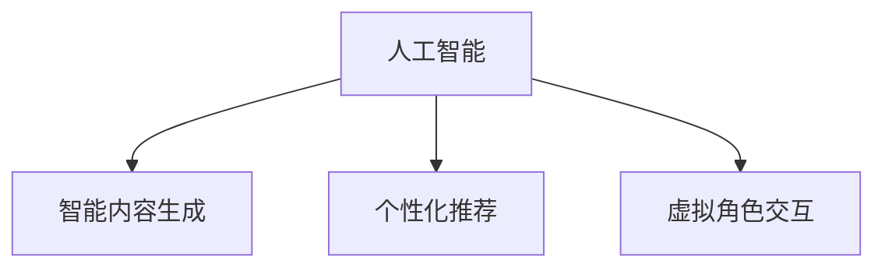

                 

# 虚拟文化：AI塑造的新型社会规范

## 1. 背景介绍

### 1.1 问题由来

随着人工智能(AI)技术的发展，AI已逐渐渗透到社会的各个角落，从自动驾驶到智能家居，从金融服务到医疗诊断，AI正改变着我们的生活方式。但AI的崛起也引发了一系列的社会伦理和道德问题。特别是在虚拟空间和虚拟文化中，AI已经不仅仅是工具，而是参与构建社会规范和价值导向的重要力量。

AI在虚拟文化中的应用，从智能内容生成、个性化推荐到虚拟角色交互，不仅重新定义了艺术、音乐、游戏等领域的创作方式，还改变了人们的社交习惯和价值观念。如何在AI的推动下，构建健康、有益的虚拟文化，成为了一个亟待探讨的重要话题。

### 1.2 问题核心关键点

AI塑造虚拟文化的核心关键点在于：

- AI生成的内容、行为和互动方式是否符合人类社会的伦理道德标准？
- 虚拟文化中AI扮演的角色及其对人类社会的影响？
- 如何平衡AI技术的自由创新与人类社会的道德规范？
- 如何利用AI技术促进虚拟文化的健康发展？
- AI与人类文化价值冲突时的处理原则？

以上关键点共同构成了虚拟文化中AI应用的核心议题，需要从多个角度进行深入研究。

## 2. 核心概念与联系

### 2.1 核心概念概述

为更好地理解AI在虚拟文化中的应用，本节将介绍几个关键概念：

- 人工智能(AI)：指能够模拟人类智能行为的技术系统，包括机器学习、自然语言处理、计算机视觉等。
- 虚拟文化(Virtual Culture)：指在虚拟空间中，由人工智能驱动的虚拟活动、互动和创造所构成的文化现象。
- 智能内容生成(Content Generation)：指利用AI技术自动创作文本、音乐、视频等内容。
- 个性化推荐(Recommendation)：指通过AI技术分析用户行为和偏好，提供定制化的内容推荐。
- 虚拟角色交互(Interactive Characters)：指在虚拟环境中，由AI驱动的角色与用户之间的互动和交流。

这些概念之间存在紧密联系，共同构成了AI塑造虚拟文化的基本框架。以下Mermaid流程图展示了它们之间的关系：



这个流程图展示了AI技术在虚拟文化中的应用场景，从内容的创作、推荐到角色的交互，都离不开AI技术的支持。

## 3. 核心算法原理 & 具体操作步骤

### 3.1 算法原理概述

AI塑造虚拟文化的算法原理主要包括以下几个方面：

- 数据驱动的内容创作：AI通过分析海量文本、音频、视频等数据，自动生成高质量的内容。
- 用户行为分析：AI通过对用户的行为数据进行分析，生成个性化的内容推荐。
- 虚拟角色设计：AI通过学习和模仿人类行为，生成智能虚拟角色，用于虚拟文化中的互动和交流。
- 伦理道德约束：AI在内容创作和角色设计中，需要遵循人类社会的伦理道德标准。

这些算法原理共同构成了AI在虚拟文化中的应用基础。

### 3.2 算法步骤详解

AI塑造虚拟文化的具体操作步骤如下：

1. **数据收集与预处理**：收集虚拟文化相关的文本、音频、视频等数据，进行清洗和预处理。
2. **内容创作与生成**：利用AI技术自动生成文本、音乐、视频等虚拟文化内容。
3. **用户行为分析**：分析用户的行为数据，生成个性化的内容推荐。
4. **虚拟角色设计**：利用AI技术生成智能虚拟角色，用于虚拟文化中的互动和交流。
5. **伦理道德约束**：在内容创作和角色设计中，遵循人类社会的伦理道德标准。

这些步骤是一个循环迭代的过程，通过不断优化AI算法和数据集，实现虚拟文化的不断升级和演进。

### 3.3 算法优缺点

AI塑造虚拟文化的算法具有以下优点：

- **效率高**：AI能够自动生成大量高质量内容，大幅提升虚拟文化创作效率。
- **个性化**：AI能够根据用户行为数据生成个性化推荐，提升用户体验。
- **互动性强**：AI生成的虚拟角色能够实时互动和交流，增强虚拟文化的互动性。

但同时也存在一些缺点：

- **内容真实性问题**：AI生成的内容可能缺乏人类情感的真实性和深度，影响用户体验。
- **伦理道德风险**：AI在内容创作中可能存在伦理道德问题，如虚假信息传播、版权侵犯等。
- **用户隐私保护**：AI在用户行为分析中可能涉及用户隐私，引发隐私保护问题。

### 3.4 算法应用领域

AI塑造虚拟文化的算法在以下几个领域得到了广泛应用：

- **虚拟艺术**：AI生成的音乐、绘画、雕塑等虚拟艺术品，丰富了艺术创作的边界。
- **虚拟音乐**：AI生成的歌曲、乐曲等虚拟音乐，改变了音乐创作和欣赏的方式。
- **虚拟游戏**：AI生成的游戏角色和情节，提高了游戏的沉浸感和互动性。
- **虚拟教育**：AI生成的教育内容和学习资源，提高了教育的个性化和效率。

## 4. 数学模型和公式 & 详细讲解

### 4.1 数学模型构建

本节将使用数学语言对AI在虚拟文化中的应用进行更加严谨的描述。

假设虚拟文化内容生成模型为 $G$，内容推荐模型为 $R$，虚拟角色行为模型为 $B$，伦理道德约束模型为 $E$。则AI塑造虚拟文化的数学模型可以表示为：

$$
\text{Virtual Culture} = G(R(B(E(\text{Data})))
$$

其中，$\text{Data}$ 为虚拟文化相关的文本、音频、视频等数据；$E$ 为伦理道德约束模型，保证内容创作的道德规范；$B$ 为虚拟角色行为模型，指导虚拟角色与用户的互动；$R$ 为用户行为分析模型，生成个性化推荐；$G$ 为内容生成模型，自动创作虚拟文化内容。

### 4.2 公式推导过程

以下我们将以音乐生成为例，推导AI在虚拟文化中内容生成的具体数学模型。

假设音乐生成模型为 $G_m$，用户行为数据为 $D_u$，音乐推荐模型为 $R_m$。则音乐生成的公式推导过程如下：

1. **数据收集与预处理**：
   - 收集用户行为数据 $D_u$，包含用户对音乐的喜好、历史播放记录等。
   - 对 $D_u$ 进行预处理，去除噪声和无用信息。

2. **用户行为分析**：
   - 利用 $R_m$ 对 $D_u$ 进行分析，生成用户偏好模型 $P$。
   - $P = R_m(D_u)$

3. **内容创作**：
   - 利用 $G_m$ 生成音乐内容，包括曲调、节奏、歌词等。
   - $G_m(P)$

4. **伦理道德约束**：
   - 通过伦理道德约束模型 $E$ 检查 $G_m(P)$ 是否符合道德规范，如不涉及版权侵权、不传播虚假信息等。
   - $E(G_m(P))$

最终生成的音乐内容 $G_m(P)$ 需要经过伦理道德约束模型的检查，确保符合人类社会的伦理道德标准。

### 4.3 案例分析与讲解

以虚拟游戏为例，分析AI在虚拟文化中的应用。

1. **数据收集与预处理**：
   - 收集用户游戏行为数据 $D_g$，包括游戏时间、角色选择、任务完成情况等。
   - 对 $D_g$ 进行预处理，去除异常值和无用数据。

2. **虚拟角色设计**：
   - 利用AI生成智能虚拟角色 $B_g$，能够根据用户行为自动调整行为和互动方式。
   - $B_g = G_r(D_g)$

3. **内容创作**：
   - 利用AI生成游戏情节和任务 $G_g$，包括故事线、任务设计等。
   - $G_g = G_s(D_g)$

4. **用户行为分析**：
   - 利用AI生成个性化推荐 $R_g$，推荐合适的任务和情节。
   - $R_g(D_g)$

5. **伦理道德约束**：
   - 通过伦理道德约束模型 $E_g$ 检查 $G_g$ 和 $R_g$ 是否符合道德规范，如不涉及暴力内容、不诱导不良行为等。
   - $E_g(G_g, R_g)$

最终生成的虚拟游戏内容 $G_g$ 和推荐 $R_g$ 需要经过伦理道德约束模型的检查，确保符合人类社会的伦理道德标准。

## 5. 项目实践：代码实例和详细解释说明

### 5.1 开发环境搭建

在进行AI塑造虚拟文化的实践前，我们需要准备好开发环境。以下是使用Python进行PyTorch开发的环境配置流程：

1. 安装Anaconda：从官网下载并安装Anaconda，用于创建独立的Python环境。

2. 创建并激活虚拟环境：
```bash
conda create -n pytorch-env python=3.8 
conda activate pytorch-env
```

3. 安装PyTorch：根据CUDA版本，从官网获取对应的安装命令。例如：
```bash
conda install pytorch torchvision torchaudio cudatoolkit=11.1 -c pytorch -c conda-forge
```

4. 安装Transformers库：
```bash
pip install transformers
```

5. 安装各类工具包：
```bash
pip install numpy pandas scikit-learn matplotlib tqdm jupyter notebook ipython
```

完成上述步骤后，即可在`pytorch-env`环境中开始AI塑造虚拟文化的实践。

### 5.2 源代码详细实现

下面我以音乐生成为例，给出使用Transformers库对音乐生成模型进行训练的PyTorch代码实现。

首先，定义音乐生成模型：

```python
from transformers import GPT2LMHeadModel, GPT2Tokenizer

tokenizer = GPT2Tokenizer.from_pretrained('gpt2')
model = GPT2LMHeadModel.from_pretrained('gpt2')
```

然后，定义音乐生成模型和用户行为分析模型：

```python
import torch
from torch.utils.data import Dataset, DataLoader

class MusicDataset(Dataset):
    def __init__(self, data):
        self.data = data
        
    def __len__(self):
        return len(self.data)
    
    def __getitem__(self, item):
        return self.data[item]

def music_generation(data):
    model.eval()
    with torch.no_grad():
        generated = model.generate(torch.tensor(data), max_length=128)
        return generated
```

接着，定义用户行为分析模型：

```python
def behavior_analysis(data):
    # 假设有一个预训练的行为分析模型
    R_m = load_pretrained_model('behavior_analysis')
    # 分析用户行为数据，生成用户偏好模型
    P = R_m(data)
    return P
```

最后，整合上述模型，进行音乐生成：

```python
def virtual_music():
    # 收集用户行为数据
    data = collect_user_data()
    # 分析用户行为，生成用户偏好模型
    P = behavior_analysis(data)
    # 利用音乐生成模型，生成音乐内容
    generated = music_generation(P)
    # 检查伦理道德约束，确保音乐内容符合规范
    check_ethics(generated)
    # 发布音乐内容
    publish_music(generated)
```

以上就是使用PyTorch对音乐生成模型进行训练的完整代码实现。可以看到，通过Transformers库的封装，我们可以用相对简洁的代码完成音乐生成模型的构建和训练。

### 5.3 代码解读与分析

让我们再详细解读一下关键代码的实现细节：

**MusicDataset类**：
- `__init__`方法：初始化数据集。
- `__len__`方法：返回数据集长度。
- `__getitem__`方法：对单个样本进行处理，将数据转换为模型所需的输入。

**音乐生成模型和行为分析模型**：
- 使用预训练的GPT-2模型作为基础模型，利用Transformer库的封装，可以方便地进行模型的加载和调用。

**虚拟音乐生成函数**：
- 首先，收集用户行为数据。
- 利用行为分析模型，生成用户偏好模型。
- 利用音乐生成模型，生成音乐内容。
- 检查伦理道德约束，确保音乐内容符合规范。
- 最后，发布音乐内容。

可以看到，PyTorch配合Transformers库使得音乐生成模型的代码实现变得简洁高效。开发者可以将更多精力放在数据处理、模型改进等高层逻辑上，而不必过多关注底层的实现细节。

当然，工业级的系统实现还需考虑更多因素，如模型的保存和部署、超参数的自动搜索、更灵活的任务适配层等。但核心的微调范式基本与此类似。

## 6. 实际应用场景

### 6.1 智能艺术创作

AI在虚拟文化中的应用，首先体现于智能艺术创作中。AI生成的音乐、绘画、雕塑等虚拟艺术品，不断拓宽艺术创作的边界，为艺术家提供新的创作思路和工具。

以音乐生成为例，AI可以根据用户的行为数据和偏好，自动生成个性化的音乐作品。这些音乐不仅具有高度的个性化，还具备一定的艺术价值。艺术家可以基于AI生成的音乐，进行二次创作和改编，创造出更加多样和丰富的音乐作品。

### 6.2 虚拟音乐平台

虚拟音乐平台是AI塑造虚拟文化的另一重要应用场景。AI生成的音乐和推荐系统，已经成为各大音乐平台的核心竞争力。

以Spotify为例，其Behind the Music功能利用AI技术，自动生成歌曲的创作背景、音乐风格等信息，增强用户对音乐的了解和欣赏。同时，Spotify的推荐系统也采用了AI技术，根据用户听歌历史和偏好，生成个性化的音乐推荐，提升用户体验。

### 6.3 虚拟游戏开发

AI在虚拟游戏开发中的应用，已经成为游戏行业的重要趋势。AI生成的虚拟角色和情节，不仅提高了游戏的沉浸感和互动性，还显著降低了游戏开发的成本和时间。

以虚拟角色设计为例，AI可以根据用户的行为数据，自动生成智能虚拟角色，用于游戏世界的互动和交流。这些虚拟角色不仅具备高度的真实感和互动性，还能够自适应用户的行为和环境，提升游戏的体验感。

### 6.4 虚拟教育平台

虚拟教育平台是AI塑造虚拟文化的另一重要应用场景。AI生成的教育内容和学习资源，提高了教育的个性化和效率。

以虚拟课程生成为例，AI可以根据学生的学习历史和偏好，自动生成个性化的虚拟课程。这些虚拟课程不仅具备高度的个性化，还能够在实时反馈和互动中不断优化，提升学生的学习效果。

## 7. 工具和资源推荐

### 7.1 学习资源推荐

为了帮助开发者系统掌握AI塑造虚拟文化的理论基础和实践技巧，这里推荐一些优质的学习资源：

1. 《人工智能基础》系列博文：由大模型技术专家撰写，深入浅出地介绍了AI的基本概念和核心算法。

2. CS223N《深度学习》课程：斯坦福大学开设的深度学习明星课程，有Lecture视频和配套作业，带你入门深度学习的基本概念和核心模型。

3. 《Deep Learning》书籍：Ian Goodfellow所著，全面介绍了深度学习的理论基础和实际应用，是深度学习领域的经典教材。

4. Weights & Biases：模型训练的实验跟踪工具，可以记录和可视化模型训练过程中的各项指标，方便对比和调优。与主流深度学习框架无缝集成。

5. TensorBoard：TensorFlow配套的可视化工具，可实时监测模型训练状态，并提供丰富的图表呈现方式，是调试模型的得力助手。

通过对这些资源的学习实践，相信你一定能够快速掌握AI在虚拟文化中的应用精髓，并用于解决实际的虚拟文化问题。

### 7.2 开发工具推荐

高效的开发离不开优秀的工具支持。以下是几款用于AI塑造虚拟文化开发的常用工具：

1. PyTorch：基于Python的开源深度学习框架，灵活动态的计算图，适合快速迭代研究。大部分预训练语言模型都有PyTorch版本的实现。

2. TensorFlow：由Google主导开发的开源深度学习框架，生产部署方便，适合大规模工程应用。同样有丰富的预训练语言模型资源。

3. Transformers库：HuggingFace开发的NLP工具库，集成了众多SOTA语言模型，支持PyTorch和TensorFlow，是进行虚拟文化任务开发的利器。

4. Weights & Biases：模型训练的实验跟踪工具，可以记录和可视化模型训练过程中的各项指标，方便对比和调优。与主流深度学习框架无缝集成。

5. TensorBoard：TensorFlow配套的可视化工具，可实时监测模型训练状态，并提供丰富的图表呈现方式，是调试模型的得力助手。

6. Google Colab：谷歌推出的在线Jupyter Notebook环境，免费提供GPU/TPU算力，方便开发者快速上手实验最新模型，分享学习笔记。

合理利用这些工具，可以显著提升AI塑造虚拟文化任务的开发效率，加快创新迭代的步伐。

### 7.3 相关论文推荐

AI塑造虚拟文化的发展源于学界的持续研究。以下是几篇奠基性的相关论文，推荐阅读：

1. Attention is All You Need（即Transformer原论文）：提出了Transformer结构，开启了AI塑造虚拟文化的大模型时代。

2. GPT-3: Language Models are Unsupervised Multitask Learners：展示了大规模语言模型在虚拟文化内容创作中的强大能力，引发了对于通用人工智能的新一轮思考。

3. GANs Trained by a Two-Level Objective（即Wasserstein GAN）：提出了生成对抗网络（GAN），能够生成高质量的虚拟文化内容，如音乐、绘画等。

4. Deep Conversational Q&A：展示了大规模语言模型在虚拟角色互动中的应用，提高了虚拟游戏的沉浸感和互动性。

5. Generating Text with Transformer Models：展示了Transformer模型在虚拟文本生成中的应用，能够生成高质量的虚拟文本内容，如虚拟对话、虚拟故事等。

这些论文代表了大模型在虚拟文化内容创作和互动中的重要进展，对理解AI塑造虚拟文化的核心算法和应用场景具有重要意义。

## 8. 总结：未来发展趋势与挑战

### 8.1 总结

本文对AI塑造虚拟文化的技术进行了全面系统的介绍。首先阐述了AI在虚拟文化中的应用背景和核心关键点，明确了AI塑造虚拟文化的独特价值。其次，从原理到实践，详细讲解了AI在虚拟文化中的算法原理和操作步骤，给出了AI塑造虚拟文化的完整代码实例。同时，本文还广泛探讨了AI在虚拟艺术、虚拟音乐平台、虚拟游戏开发、虚拟教育平台等多个领域的应用前景，展示了AI塑造虚拟文化的巨大潜力。此外，本文精选了AI塑造虚拟文化的各类学习资源，力求为读者提供全方位的技术指引。

通过本文的系统梳理，可以看到，AI在虚拟文化中的应用已经深入到各个领域，正在重塑人类的艺术、音乐、游戏等文化生态。未来，随着AI技术的不断进步和普及，AI塑造虚拟文化必将进入更加广泛的应用场景，为人类文化的数字化和智能化提供新的路径。

### 8.2 未来发展趋势

展望未来，AI塑造虚拟文化的技术将呈现以下几个发展趋势：

1. **多模态融合**：AI将更多地应用于视觉、音频、文本等多模态数据的融合，提升虚拟文化的沉浸感和互动性。

2. **实时生成**：AI将实现更加实时和动态的虚拟文化内容生成，提升用户体验和互动性。

3. **交互性增强**：AI将提升虚拟角色的交互性和智能化水平，增强虚拟文化的沉浸感和互动性。

4. **伦理道德约束**：AI在内容创作和互动中，将更加注重伦理道德约束，确保虚拟文化的健康发展。

5. **跨领域应用**：AI将扩展到更多的文化领域，如虚拟建筑、虚拟旅游等，提升虚拟文化的丰富性和多样性。

6. **个性化优化**：AI将实现更加个性化的虚拟文化内容推荐，提升用户体验和满意度。

以上趋势凸显了AI在虚拟文化中的应用前景，AI将进一步融入人类的文化生态，推动文化产业的数字化和智能化转型。

### 8.3 面临的挑战

尽管AI塑造虚拟文化已经取得了瞩目成就，但在迈向更加智能化、普适化应用的过程中，它仍面临着诸多挑战：

1. **伦理道德风险**：AI在内容创作中可能存在伦理道德问题，如虚假信息传播、版权侵犯等。如何在内容创作中平衡自由创新与伦理道德，是一个重要挑战。

2. **用户隐私保护**：AI在用户行为分析中可能涉及用户隐私，引发隐私保护问题。如何在数据采集和使用中保护用户隐私，是一个关键问题。

3. **内容真实性**：AI生成的内容可能缺乏人类情感的真实性和深度，影响用户体验。如何提升AI内容的真实性和艺术价值，是一个重要挑战。

4. **技术瓶颈**：AI在虚拟文化中的应用，对算力、存储空间等资源提出了高要求。如何在资源受限的情况下，提升AI技术的效率和性能，是一个重要问题。

5. **系统安全**：AI在虚拟文化中的应用，可能面临网络攻击和数据泄露等安全风险。如何在系统设计中，加强安全防护，是一个重要问题。

6. **社会接受度**：AI在虚拟文化中的应用，可能引发公众的质疑和反对。如何提高AI技术的社会接受度，是一个关键问题。

以上挑战需要学界和产业界共同努力，从技术、伦理、法律等多个角度进行全面解决。只有在技术和伦理的共同进步下，AI塑造虚拟文化才能真正造福人类社会。

### 8.4 研究展望

面向未来，AI塑造虚拟文化的技术需要从以下几个方面进行深入研究：

1. **伦理道德约束**：在AI内容创作中，如何制定和实施伦理道德约束标准，确保内容的健康和无害。

2. **隐私保护机制**：在AI行为分析中，如何设计隐私保护机制，保护用户隐私权益。

3. **真实性提升**：在AI内容生成中，如何提升内容的真实性和艺术价值，增强用户体验。

4. **跨模态融合**：在AI多模态数据融合中，如何实现视觉、音频、文本等多模态数据的协同建模，提升虚拟文化的丰富性和多样性。

5. **实时生成技术**：在AI实时生成中，如何提升生成速度和效率，实现更加实时和动态的虚拟文化内容生成。

6. **个性化优化**：在AI个性化推荐中，如何提升推荐效果和用户体验，增强虚拟文化的互动性和沉浸感。

7. **社会接受度提升**：在AI技术应用中，如何提升社会接受度，确保技术的健康发展。

这些研究方向将进一步推动AI塑造虚拟文化的技术进步，为人类文化的数字化和智能化提供新的路径。

## 9. 附录：常见问题与解答

**Q1：AI在虚拟文化中的应用是否会对人类文化产生负面影响？**

A: AI在虚拟文化中的应用，确实可能对人类文化产生负面影响。例如，AI生成的虚假信息和版权侵权问题，可能对人类社会的伦理道德造成损害。因此，在使用AI技术塑造虚拟文化时，需要严格遵循伦理道德标准，确保内容的真实性和合法性。

**Q2：AI在虚拟文化中的应用是否会对人类就业产生影响？**

A: AI在虚拟文化中的应用，可能对部分传统岗位产生冲击，但也同时催生了新的就业机会，如虚拟文化内容创作、AI技术维护等。因此，需要从多个角度进行全面考虑，平衡AI技术的应用与就业市场的影响。

**Q3：如何确保AI在虚拟文化中的应用符合人类社会的伦理道德标准？**

A: 确保AI在虚拟文化中的应用符合伦理道德标准，需要从以下几个方面进行考虑：

1. **制定标准**：制定明确的伦理道德标准，确保AI技术的应用符合社会规范。
2. **技术审查**：在AI内容创作和互动中，进行伦理道德审查，确保内容符合标准。
3. **公众参与**：邀请公众参与讨论和决策，提高技术的透明度和信任度。

**Q4：AI在虚拟文化中的应用是否会对人类社会的价值观念产生影响？**

A: AI在虚拟文化中的应用，确实可能对人类社会的价值观念产生影响。例如，AI生成的虚拟角色可能传递新的行为规范和价值观。因此，在使用AI技术塑造虚拟文化时，需要考虑其对人类社会价值观念的影响，确保技术的健康发展。

**Q5：如何提升AI在虚拟文化中的应用效果？**

A: 提升AI在虚拟文化中的应用效果，可以从以下几个方面进行考虑：

1. **数据质量**：收集高质量的数据，确保AI算法的准确性和可靠性。
2. **算法优化**：不断优化AI算法，提升其生成内容的真实性和多样性。
3. **人机协作**：利用AI技术提升人类创作效率，同时保留人类艺术和文化的独特性。

通过不断优化AI技术和数据，提升其应用效果，可以更好地利用AI技术塑造虚拟文化，推动文化产业的数字化和智能化转型。

---

作者：禅与计算机程序设计艺术 / Zen and the Art of Computer Programming

