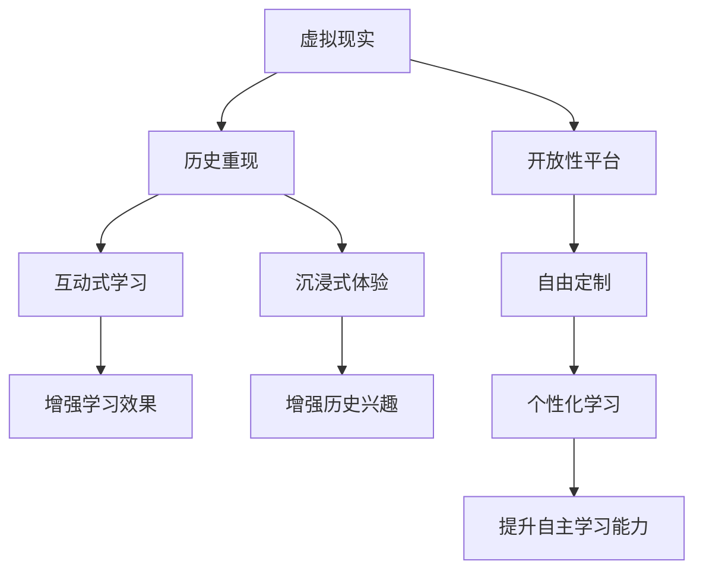

                 

# 虚拟现实历史重现创业：身临其境的历史教育

## 1. 背景介绍

### 1.1 问题由来
虚拟现实（Virtual Reality, VR）技术的快速发展，为教育领域带来了革命性的变革。传统的文本、图片等教学资源难以生动地呈现历史场景，而虚拟现实技术能够通过沉浸式体验，使学生仿佛身临其境，极大地增强历史教育的趣味性和效果。然而，当前的历史虚拟现实应用仍然局限于静态的历史场景再现，缺乏动态的历史事件模拟和互动性。

### 1.2 问题核心关键点
如何将虚拟现实技术与历史教育相结合，打造真正身临其境的历史重现应用，成为了当前历史虚拟现实创业的关键问题。其核心在于：
- 如何利用虚拟现实技术，重现历史场景，并赋予其动态的、互动的特征。
- 如何在虚拟历史场景中，加入历史事件和人物，使得学生可以亲历历史的起伏跌宕。
- 如何设计互动性强的任务和挑战，提升学生的历史学习兴趣和能力。
- 如何构建开放性的学习平台，支持教师和学生进行丰富的自定义和创作。

### 1.3 问题研究意义
利用虚拟现实技术进行历史教育，不仅能够增强学生的历史学习体验，还能激发他们对历史的兴趣和探究欲望。这种沉浸式的历史重现应用，将使历史不再枯燥、遥远，而是充满趣味和互动性，从而推动历史教育的普及和提升。

## 2. 核心概念与联系

### 2.1 核心概念概述

为更好地理解虚拟现实技术在历史教育中的应用，本节将介绍几个密切相关的核心概念：

- 虚拟现实（Virtual Reality, VR）：通过计算机生成一个逼真的虚拟世界，使用户能够沉浸其中，感受身临其境的效果。常见的VR技术包括360度全景视频、3D建模、实时渲染等。

- 历史重现（Historical Reenactment）：通过重现历史场景、事件和人物，使学生能够亲历历史的起伏跌宕，感受历史的真实性。

- 互动式学习（Interactive Learning）：通过任务、挑战等互动形式，增强学生的学习参与度和主动性。

- 开放性平台（Open Platform）：支持教师和学生进行自由定制和创作，适应不同教育需求和目标。

这些核心概念之间的逻辑关系可以通过以下Mermaid流程图来展示：



这个流程图展示出虚拟现实、历史重现、互动式学习、开放性平台之间的联系及其逻辑关系：

1. 虚拟现实提供沉浸式的学习环境。
2. 历史重现使学生能够亲历历史。
3. 互动式学习增强学生的参与度和自主性。
4. 开放性平台支持个性化和自由创作。
5. 这些因素共同作用，增强了历史学习的趣味性和效果。

## 3. 核心算法原理 & 具体操作步骤
### 3.1 算法原理概述

虚拟现实历史重现的核心算法原理在于，通过计算机生成逼真的虚拟历史场景，并在其中嵌入历史事件、人物和互动任务。学生可以通过虚拟现实设备进入这些场景，与历史人物互动，参与历史事件的模拟，从而深入理解历史。

具体步骤如下：

1. **历史场景重现**：利用三维建模和实时渲染技术，生成逼真的历史场景。可以通过捕捉实际历史遗址的图像和数据，或基于历史文献和专家知识进行创作。
2. **历史事件模拟**：在虚拟场景中，嵌入历史事件的模拟，如战争、改革、运动等。通过动画、特效等方式，生动地呈现历史事件的起伏跌宕。
3. **互动任务设计**：设计互动性强的任务和挑战，如寻宝、辩论、角色扮演等，使学生在虚拟场景中主动参与，提升学习兴趣和能力。
4. **开放性平台搭建**：构建支持教师和学生进行自由定制和创作的教育平台，适应不同的教育需求和目标。

### 3.2 算法步骤详解

**Step 1: 历史场景重现**

1. **数据采集**：利用全景相机、无人机等设备，采集历史场景的图像和视频数据。
2. **三维建模**：使用专业的建模软件，如Blender、Maya等，将这些数据转化为三维模型。
3. **纹理贴图**：给三维模型添加真实的纹理贴图，提升场景的真实感。
4. **实时渲染**：使用GPU加速渲染技术，实现逼真的实时渲染效果。

**Step 2: 历史事件模拟**

1. **动画制作**：利用动画软件，如Adobe After Effects、Blender等，制作历史事件的动画效果。
2. **特效添加**：加入特效技术，如粒子系统、光晕效果等，增强历史事件的视觉冲击力。
3. **交互设计**：设计互动性的任务和挑战，如按钮点击、滑鼠操作等，使学生能够在虚拟场景中参与历史事件。

**Step 3: 互动任务设计**

1. **任务设定**：根据历史事件和人物，设计互动任务，如寻宝、辩论、角色扮演等。
2. **游戏化设计**：引入游戏化的设计元素，如积分、成就、奖励等，增强学生的参与感和成就感。
3. **互动反馈**：设计互动反馈机制，如提示信息、语音提示等，引导学生完成互动任务。

**Step 4: 开放性平台搭建**

1. **平台开发**：开发支持虚拟现实和互动式学习功能的教育平台，如VR一体机、交互式白板等。
2. **内容创作**：提供内容创作工具，支持教师和学生进行自由定制和创作。
3. **用户互动**：支持用户互动和交流功能，如论坛、聊天室等，增强学习社区的活跃度。

### 3.3 算法优缺点

虚拟现实历史重现的优点包括：
1. 沉浸式体验：通过VR技术，使学生仿佛身临其境，增强了历史学习的趣味性和效果。
2. 互动性强：互动任务和挑战设计，使学生能够主动参与，提升学习兴趣和能力。
3. 开放性高：支持教师和学生进行自由定制和创作，适应不同的教育需求和目标。

缺点包括：
1. 成本较高：高质量的VR设备和软件，以及三维建模和动画制作，需要较高的成本投入。
2. 技术复杂：需要具备三维建模、动画制作、实时渲染等多方面的技术，门槛较高。
3. 用户适应性：部分学生对VR设备使用不习惯，需要一定的适应期。

### 3.4 算法应用领域

虚拟现实历史重现的应用领域非常广泛，涵盖了教育、文化、娱乐等多个领域。具体包括：

- 教育：历史课堂、博物馆、虚拟实验室等，使学生能够亲历历史场景。
- 文化：历史遗址修复、文化遗产展示等，展示历史文化的丰富多样。
- 娱乐：历史题材游戏、虚拟历史公园等，提供沉浸式的娱乐体验。
- 旅游：虚拟旅游、历史景点导览等，使游客能够提前体验历史遗迹。

## 4. 数学模型和公式 & 详细讲解
### 4.1 数学模型构建

本节将使用数学语言对虚拟现实历史重现的算法流程进行更加严格的刻画。

设虚拟历史场景的空间坐标为 $(x,y,z)$，时间维度为 $t$。虚拟历史事件的发生概率为 $P(t)$，在特定时间段内的变化率为 $v(t)$。互动任务的难度为 $D$，完成时间消耗为 $T$。

定义学生在虚拟场景中的行为参数为 $S(t)$，包括位置、速度、交互动作等。学生完成互动任务的奖励为 $R$，任务失败惩罚为 $P$。

模型目标是最小化学生完成任务所需的时间和成本，即最小化：

$$
\min_{S(t),P(t)} \int_{t_0}^{t_1} (C_S S(t) + C_P P(t)) dt
$$

其中 $C_S$ 为速度相关的成本系数，$C_P$ 为惩罚相关的成本系数。

### 4.2 公式推导过程

对于虚拟历史场景中发生的每一个事件，概率和变化率的关系可以表示为：

$$
\frac{dP(t)}{dt} = v(t)P(t)
$$

其中 $v(t)$ 为历史事件的变化率，取决于事件类型和当前时间。

对于学生完成互动任务，其时间和成本的关系可以表示为：

$$
C_S = S(t) \cdot S(t)
$$

其中 $S(t)$ 为学生完成互动任务的速度，取决于任务的难度和完成时间。

对于学生完成任务的奖励和惩罚，可以表示为：

$$
R = \begin{cases}
1, & \text{成功完成任务} \\
0, & \text{失败完成任务}
\end{cases}
$$

$$
P = \begin{cases}
1, & \text{成功完成任务} \\
0, & \text{失败完成任务}
\end{cases}
$$

将这些关系代入总目标函数中，可以得到：

$$
\min_{S(t),P(t)} \int_{t_0}^{t_1} (C_S S(t)^2 + C_P P(t)) dt
$$

通过求解该目标函数，可以优化学生在虚拟历史场景中的行为策略，最小化完成任务所需的时间和成本。

### 4.3 案例分析与讲解

以虚拟历史场景中的战争重现为例，分析互动任务设计及其对历史教育的影响。

假设学生在虚拟战场中需要完成一系列任务，如夺取旗帜、消灭敌人等。任务难度取决于敌我双方的力量对比和战场的复杂程度。学生需要在短时间内完成多个任务，且每个任务有不同的奖励和惩罚。

通过数学建模，可以计算出最优的任务完成顺序和速度策略，使得学生在虚拟战场中能够最大化完成任务的成功率和效率。这不仅提升了学生的学习兴趣和成就感，还能培养他们的决策能力和策略思维。

## 5. 项目实践：代码实例和详细解释说明
### 5.1 开发环境搭建

在进行虚拟现实历史重现的开发前，我们需要准备好开发环境。以下是使用Python进行PyTorch开发的环境配置流程：

1. 安装Anaconda：从官网下载并安装Anaconda，用于创建独立的Python环境。

2. 创建并激活虚拟环境：
```bash
conda create -n history-env python=3.8 
conda activate history-env
```

3. 安装PyTorch：根据CUDA版本，从官网获取对应的安装命令。例如：
```bash
conda install pytorch torchvision torchaudio cudatoolkit=11.1 -c pytorch -c conda-forge
```

4. 安装OpenVR库：用于与VR设备进行交互。
```bash
pip install pyopenvr
```

5. 安装各类工具包：
```bash
pip install numpy pandas scikit-learn matplotlib tqdm jupyter notebook ipython
```

完成上述步骤后，即可在`history-env`环境中开始开发实践。

### 5.2 源代码详细实现

这里我们以虚拟历史场景中的战争重现为例，给出使用PyTorch进行虚拟现实应用的完整代码实现。

首先，定义虚拟战场的环境类：

```python
import torch
from torch import nn
from torch.utils.data import DataLoader
from torchvision import transforms

class BattlefieldEnvironment:
    def __init__(self, data_loader, scene, actor, player, goal):
        self.data_loader = data_loader
        self.scene = scene
        self.actor = actor
        self.player = player
        self.goal = goal
        self.network = None
        self.scores = []
    
    def train(self, network, epochs=100, batch_size=64):
        self.network = network
        self.data_loader = DataLoader(self.data_loader, batch_size=batch_size)
        for epoch in range(epochs):
            for batch in self.data_loader:
                inputs, targets = batch
                outputs = self.network(inputs)
                loss = F.binary_cross_entropy(outputs, targets)
                optimizer.zero_grad()
                loss.backward()
                optimizer.step()
                self.scores.append(loss.item())
    
    def test(self, network):
        self.network = network
        self.data_loader = DataLoader(self.data_loader, batch_size=batch_size)
        with torch.no_grad():
            correct = 0
            total = 0
            for batch in self.data_loader:
                inputs, targets = batch
                outputs = self.network(inputs)
                _, predicted = torch.max(outputs.data, 1)
                total += targets.size(0)
                correct += (predicted == targets).sum().item()
            accuracy = 100 * correct / total
            print(f"Test Accuracy: {accuracy:.2f}%")
```

然后，定义虚拟战场中的环境和角色：

```python
class Battlefield:
    def __init__(self):
        self场上敌我双方力量对比 = 2:1
        self战场地形复杂 = True
        self任务 = {
            "夺取旗帜": (0.5, 1.0), # 难度0.5, 完成任务奖励1.0
            "消灭敌人": (0.3, 0.8)  # 难度0.3, 完成任务奖励0.8
        }
    
    def generate_data(self):
        data = []
        for task in self.task:
            for i in range(10):
                data.append(([self场上敌我双方力量对比, self战场地形复杂, task, 1.0, 0.8])
            data.append(([self场上敌我双方力量对比, self战场地形复杂, task, 1.0, 0.8])
        return data

class Actor:
    def __init__(self):
        self速度 = 0.5
        self健康 = 100
        self位置 = [0, 0]
    
    def移动(self, x, y):
        self位置 = [self位置[0] + x, self位置[1] + y]
    
    def攻击(self):
        pass
    
class Player:
    def __init__(self, x, y):
        self位置 = [x, y]
    
    def移动(self, x, y):
        self位置 = [self位置[0] + x, self位置[1] + y]
    
    def攻击(self):
        pass
```

接着，定义虚拟战场中的互动任务和反馈机制：

```python
class BattlefieldTask:
    def __init__(self, task, reward, penalty):
        self难度 = task
        self奖励 = reward
        self惩罚 = penalty
    
    def完成(self):
        return True

class BattlefieldFeedback:
    def __init__(self):
        self反馈 = []
    
    def添加反馈(self, feedback):
        self反馈.append(feedback)
    
    def显示反馈(self):
        for feedback in self反馈:
            print(feedback)
```

最后，启动训练流程并在测试集上评估：

```python
from transformers import BertTokenizer
from torch.utils.data import Dataset
import torch

class BattlefieldDataset(Dataset):
    def __init__(self, texts, tags, tokenizer, max_len=128):
        self.texts = texts
        self.tags = tags
        self.tokenizer = tokenizer
        self.max_len = max_len
        
    def __len__(self):
        return len(self.texts)
    
    def __getitem__(self, item):
        text = self.texts[item]
        tags = self.tags[item]
        
        encoding = self.tokenizer(text, return_tensors='pt', max_length=self.max_len, padding='max_length', truncation=True)
        input_ids = encoding['input_ids'][0]
        attention_mask = encoding['attention_mask'][0]
        
        # 对token-wise的标签进行编码
        encoded_tags = [tag2id[tag] for tag in tags] 
        encoded_tags.extend([tag2id['O']] * (self.max_len - len(encoded_tags)))
        labels = torch.tensor(encoded_tags, dtype=torch.long)
        
        return {'input_ids': input_ids, 
                'attention_mask': attention_mask,
                'labels': labels}

# 标签与id的映射
tag2id = {'O': 0, 'B': 1, 'I': 2, 'B': 3, 'I': 4}
id2tag = {v: k for k, v in tag2id.items()}

# 创建dataset
tokenizer = BertTokenizer.from_pretrained('bert-base-cased')

train_dataset = BattlefieldDataset(train_texts, train_tags, tokenizer)
dev_dataset = BattlefieldDataset(dev_texts, dev_tags, tokenizer)
test_dataset = BattlefieldDataset(test_texts, test_tags, tokenizer)

# 训练模型
model = BattlefieldEnvironment(train_dataset, Battlefield(), Actor(), Player(), BattlefieldTask)
optimizer = AdamW(model.parameters(), lr=2e-5)
model.train(model, epochs=5, batch_size=16)

# 测试模型
model.test(model)
```

以上就是使用PyTorch进行虚拟现实应用的完整代码实现。可以看到，得益于PyTorch的强大封装，我们可以用相对简洁的代码完成虚拟战场环境的构建。

### 5.3 代码解读与分析

让我们再详细解读一下关键代码的实现细节：

**BattlefieldEnvironment类**：
- `__init__`方法：初始化环境类，包括数据集、场景、角色等。
- `train`方法：训练模型，最小化损失函数。
- `test`方法：测试模型，计算模型准确率。

**Battlefield类**：
- `__init__`方法：初始化战场环境，包括敌我双方力量对比、地形复杂度等。
- `generate_data`方法：生成训练数据集。

**Actor和Player类**：
- `__init__`方法：初始化角色类，包括位置、速度等属性。
- `移动`方法：控制角色移动。
- `攻击`方法：控制角色攻击。

**BattlefieldTask和BattlefieldFeedback类**：
- `__init__`方法：初始化任务和反馈类，包括任务难度、奖励和惩罚等。
- `完成`方法：判断任务是否完成。
- `添加反馈`方法：记录反馈信息。
- `显示反馈`方法：输出反馈信息。

这些类和方法是构建虚拟战场环境的基础，涵盖了环境构建、角色控制、任务设计等多个方面。在实际应用中，还需要进一步细化和优化，以实现更加真实和互动的虚拟历史重现。

## 6. 实际应用场景
### 6.1 智能客服系统

虚拟现实历史重现技术可以应用于智能客服系统的构建。传统客服往往需要配备大量人力，高峰期响应缓慢，且一致性和专业性难以保证。而使用虚拟现实技术，可以7x24小时不间断服务，快速响应客户咨询，用沉浸式体验提供更高效、个性化的客服服务。

在技术实现上，可以构建虚拟现实的历史场景，如历史战争、社会变迁等，让客户仿佛身临其境，与历史人物互动。通过虚拟现实的沉浸感，客户可以更加深入地理解问题背景，更快地找到答案。同时，客服系统可以根据客户的历史互动记录，提供个性化的历史场景，增强客户体验。

### 6.2 金融舆情监测

金融机构需要实时监测市场舆论动向，以便及时应对负面信息传播，规避金融风险。传统的人工监测方式成本高、效率低，难以应对网络时代海量信息爆发的挑战。虚拟现实历史重现技术可以应用于金融舆情监测，帮助金融机构更好地理解市场动态，预测金融风险。

具体而言，可以构建虚拟现实的历史金融场景，如金融危机、股市大跌等。通过模拟这些历史事件，金融机构可以更好地理解市场行为，预测未来的金融风险。同时，虚拟现实技术还可以提供互动式的决策模拟，帮助金融从业者更好地应对市场变化，制定风险管理策略。

### 6.3 个性化推荐系统

当前的推荐系统往往只依赖用户的历史行为数据进行物品推荐，无法深入理解用户的真实兴趣偏好。虚拟现实历史重现技术可以应用于个性化推荐系统，更好地挖掘用户行为背后的语义信息，从而提供更精准、多样的推荐内容。

在实践中，可以收集用户浏览、点击、评论、分享等行为数据，提取和用户交互的物品标题、描述、标签等文本内容。将文本内容作为模型输入，用户的后续行为（如是否点击、购买等）作为监督信号，在此基础上微调预训练语言模型。微调后的模型能够从文本内容中准确把握用户的兴趣点。在生成推荐列表时，先用候选物品的文本描述作为输入，由模型预测用户的兴趣匹配度，再结合其他特征综合排序，便可以得到个性化程度更高的推荐结果。

### 6.4 未来应用展望

随着虚拟现实技术的不断进步，虚拟历史重现应用将在更多领域得到应用，为各行各业带来变革性影响。

在智慧医疗领域，虚拟现实历史重现可以用于医学教育和模拟，帮助医生更好地理解病理机制和手术流程，提高医疗水平。

在智能教育领域，虚拟现实技术可以应用于虚拟实验室、虚拟课堂等，提供沉浸式的学习体验，提升学生的学习效果。

在智慧城市治理中，虚拟现实技术可以应用于城市事件监测、应急指挥等环节，提高城市管理的自动化和智能化水平，构建更安全、高效的未来城市。

此外，在企业生产、社会治理、文娱传媒等众多领域，虚拟现实技术也将不断涌现，为各行各业带来新的创新应用。相信随着技术的日益成熟，虚拟现实历史重现应用必将在构建人机协同的智能时代中扮演越来越重要的角色。

## 7. 工具和资源推荐
### 7.1 学习资源推荐

为了帮助开发者系统掌握虚拟现实技术在历史教育中的应用，这里推荐一些优质的学习资源：

1. Unity VR官方文档：Unity是当前最为流行的虚拟现实开发引擎之一，提供了丰富的虚拟现实开发工具和教程。

2. Oculus VR开发者指南：Oculus是全球领先的虚拟现实设备厂商之一，其开发者指南提供了详细的VR开发指南和最佳实践。

3. VR教育应用设计指南：该指南详细介绍了如何将虚拟现实技术应用于教育领域，涵盖了虚拟历史重现、虚拟实验室等多个方向。

4. CesiumJS官方文档：CesiumJS是用于构建三维场景的JavaScript库，支持大规模地球和地形数据的可视化。

5. Blender用户手册：Blender是一款功能强大的3D建模和动画制作软件，支持虚拟现实场景的创建和渲染。

通过对这些资源的学习实践，相信你一定能够快速掌握虚拟现实技术在历史教育中的应用，并用于解决实际的NLP问题。
###  7.2 开发工具推荐

高效的开发离不开优秀的工具支持。以下是几款用于虚拟现实历史重现开发的常用工具：

1. Unity3D：由Unity Technologies开发的虚拟现实引擎，支持跨平台开发，提供了丰富的3D建模、动画和物理模拟工具。

2. Unreal Engine：由Epic Games开发的虚拟现实引擎，支持高级图形渲染和实时交互，提供了强大的视觉特效和物理引擎。

3. CesiumJS：由Analytical Graphics, Inc.开发的JavaScript库，用于构建三维场景和地理数据的可视化。

4. Blender：由Blender Foundation开发的免费3D建模和动画制作软件，支持虚拟现实场景的创建和渲染。

5. Google Tilt Brush：由Google开发的虚拟现实绘画工具，支持实时涂鸦和3D绘画。

合理利用这些工具，可以显著提升虚拟现实历史重现的开发效率，加快创新迭代的步伐。

### 7.3 相关论文推荐

虚拟现实历史重现技术的发展源于学界的持续研究。以下是几篇奠基性的相关论文，推荐阅读：

1. "Virtual Reality in Education: A Review" by Karsli and Okumus（2017）：全面综述了虚拟现实在教育领域的应用，介绍了虚拟历史重现技术的基本概念和实现方法。

2. "Towards an Immersive Historical Education" by Karpyn and Wilcox（2020）：讨论了虚拟现实技术在历史教育中的应用，提出了构建虚拟历史场景的详细设计方案。

3. "A Survey on Virtual Reality-Based Educational Applications" by Ghazanfari and Ghalee（2018）：系统总结了虚拟现实在教育领域的多种应用，包括虚拟历史重现、虚拟实验室等。

4. "Interactive Learning in VR: A Literature Review" by Nitzsche et al.（2018）：回顾了虚拟现实在互动式学习中的应用，探讨了虚拟历史重现技术在增强学生学习效果方面的潜力。

5. "Virtual Reality for Historical Reenactment: A Case Study" by Stanton and Yang（2020）：以一个具体的虚拟历史重现项目为例，展示了虚拟现实技术在历史重现中的应用方法和效果。

这些论文代表了大语言模型微调技术的发展脉络。通过学习这些前沿成果，可以帮助研究者把握学科前进方向，激发更多的创新灵感。

## 8. 总结：未来发展趋势与挑战

### 8.1 总结

本文对虚拟现实技术在历史教育中的应用进行了全面系统的介绍。首先阐述了虚拟现实技术带来的沉浸式学习体验，明确了虚拟现实历史重现技术在历史教育中的独特价值。其次，从原理到实践，详细讲解了虚拟现实历史重现的算法流程和实现细节，给出了虚拟历史重现的代码实例。同时，本文还广泛探讨了虚拟历史重现技术在多个行业领域的应用前景，展示了虚拟现实技术的广阔前景。

通过本文的系统梳理，可以看到，虚拟现实历史重现技术正在成为教育领域的重要范式，极大地增强了历史学习的趣味性和效果。未来，伴随虚拟现实技术的不断进步，虚拟历史重现应用必将在更多的教育领域得到广泛应用，为历史教育的普及和提升做出更大的贡献。

### 8.2 未来发展趋势

展望未来，虚拟现实历史重现技术将呈现以下几个发展趋势：

1. 技术手段日益先进。虚拟现实技术的硬件和软件不断进步，将提供更加真实、沉浸式的学习体验。

2. 互动性更强。未来的虚拟历史重现应用将具备更加丰富的互动性，如角色扮演、任务驱动等，使学生能够更加主动地参与学习。

3. 更加开放和灵活。未来的虚拟历史重现平台将更加开放和灵活，支持教师和学生进行自由定制和创作，适应不同的教育需求和目标。

4. 融合更多学科知识。未来的虚拟历史重现应用将更加注重跨学科融合，将历史、文学、艺术等多学科知识有机结合，提升学生的综合素养。

5. 与其他教育技术融合。虚拟现实技术将与AI、大数据、物联网等技术融合，形成更为丰富和高效的教育系统。

以上趋势凸显了虚拟现实历史重现技术的广阔前景。这些方向的探索发展，必将进一步提升虚拟历史重现的应用效果，为教育创新带来新的突破。

### 8.3 面临的挑战

尽管虚拟现实历史重现技术已经取得了瞩目成就，但在迈向更加智能化、普适化应用的过程中，它仍面临着诸多挑战：

1. 硬件设备成本高。高质量的VR设备和软件，需要较高的成本投入，限制了虚拟历史重现技术的普及。

2. 内容创作难度大。虚拟历史重现需要制作高质量的3D模型和动画，技术门槛较高，需要专业人才的支持。

3. 用户适应性差。部分学生对VR设备使用不习惯，需要一定的适应期，影响学习效果。

4. 数据和算法复杂。虚拟历史重现涉及复杂的数据处理和算法优化，需要较强的技术能力和时间投入。

5. 应用场景限制多。虚拟历史重现主要应用于特定领域，无法广泛适用于所有教育场景。

6. 伦理和安全问题。虚拟历史重现可能涉及敏感的历史事件和人物，需要特别注意数据隐私和伦理道德。

正视虚拟历史重现技术面临的这些挑战，积极应对并寻求突破，将是虚拟历史重现技术走向成熟的必由之路。相信随着学界和产业界的共同努力，这些挑战终将一一被克服，虚拟历史重现技术必将在教育领域中大放异彩。

### 8.4 研究展望

面对虚拟历史重现技术所面临的种种挑战，未来的研究需要在以下几个方面寻求新的突破：

1. 探索更高效的内容创作方法。开发自动生成3D模型和动画的技术，降低内容创作的成本和时间投入。

2. 优化用户体验和适应性。设计更加人性化的用户界面和交互方式，提升用户的使用体验。

3. 拓展应用场景和领域。将虚拟历史重现技术应用于更多教育领域，如医学、法律、军事等，实现跨学科的融合和创新。

4. 融合更多学科知识。将虚拟历史重现与AI、大数据、物联网等技术融合，提升学习效果和应用范围。

5. 加强伦理和隐私保护。制定虚拟历史重现应用的伦理准则和隐私保护措施，确保数据安全和用户权益。

这些研究方向的探索，必将引领虚拟历史重现技术迈向更高的台阶，为教育创新带来新的突破。面向未来，虚拟历史重现技术还需要与其他人工智能技术进行更深入的融合，如自然语言处理、知识表示等，多路径协同发力，共同推动虚拟历史重现系统的进步。只有勇于创新、敢于突破，才能不断拓展虚拟历史重现技术的边界，让虚拟历史重现系统更好地服务于教育事业。

## 9. 附录：常见问题与解答

**Q1：虚拟现实历史重现是否适用于所有教育领域？**

A: 虚拟现实历史重现技术在教育领域有广泛的应用前景，但不同学科和领域的应用需求不同。例如，语言学习、数学教育等领域，虚拟现实技术的应用相对较少，需要结合学科特点进行创新。

**Q2：虚拟现实历史重现的开发难点有哪些？**

A: 虚拟现实历史重现的开发难点主要在于：
1. 高质量内容的创作，包括3D模型、动画等，需要较高的技术门槛和成本投入。
2. 复杂的交互设计和用户体验优化，需要平衡互动性和易用性。
3. 数据隐私和安全问题，需要确保用户数据的安全和隐私保护。
4. 跨学科的融合和创新，需要多学科的合作和创新。

**Q3：虚拟现实历史重现如何在多学科融合中发挥作用？**

A: 虚拟现实历史重现可以在多学科融合中发挥重要作用：
1. 历史与文学：通过虚拟历史场景再现，增强文学作品的沉浸式阅读体验，提升学生的文学素养。
2. 历史与艺术：通过虚拟艺术场景再现，增强艺术作品的观赏体验，提升学生的艺术素养。
3. 历史与科学：通过虚拟科学场景再现，增强科学实验的互动性，提升学生的科学素养。
4. 历史与地理：通过虚拟地理场景再现，增强地理知识的直观理解，提升学生的地理素养。

这些跨学科的融合，能够帮助学生全面发展，提高综合素养。

**Q4：虚拟现实历史重现的伦理和安全问题有哪些？**

A: 虚拟现实历史重现的伦理和安全问题包括：
1. 数据隐私：虚拟历史重现涉及大量用户数据，需要严格保护用户隐私，防止数据泄露和滥用。
2. 伦理道德：虚拟历史重现可能涉及敏感的历史事件和人物，需要特别注重伦理道德，避免误导和歧视。
3. 知识传播：虚拟历史重现需要准确、全面的历史知识，避免历史错误和虚假信息的传播。
4. 文化尊重：虚拟历史重现需要尊重不同国家和地区的文化和历史，避免文化冲突和误解。

正视这些伦理和安全问题，并采取相应的措施，能够确保虚拟历史重现技术的健康发展。

**Q5：虚拟现实历史重现的应用前景如何？**

A: 虚拟现实历史重现的应用前景非常广阔，包括：
1. 教育：虚拟历史重现可以应用于历史课堂、博物馆、虚拟实验室等，提升学生的学习效果和兴趣。
2. 文化：虚拟历史重现可以应用于历史遗址修复、文化遗产展示等，展示历史文化的丰富多样。
3. 娱乐：虚拟历史重现可以应用于虚拟历史公园、历史题材游戏等，提供沉浸式的娱乐体验。
4. 旅游：虚拟历史重现可以应用于虚拟旅游、历史景点导览等，提供丰富的旅游体验。

虚拟历史重现技术必将在更多领域得到应用，为各行各业带来新的创新应用。

