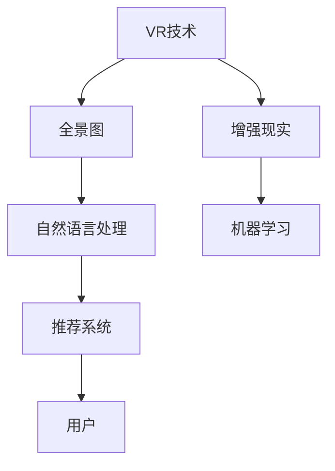

                 

# 虚拟现实旅游规划创业：身临其境的旅行预览

## 1. 背景介绍

### 1.1 问题由来
随着科技的飞速发展，虚拟现实(VR)技术逐渐从科幻变为现实，并正在迅速融入各个行业，带来革命性的变化。旅游业作为服务行业，受限于传统手段，一直未能充分利用VR技术提升用户体验。

当前，旅游业的数字化、智能化转型已成为不可逆转的趋势。传统旅游业面临诸多痛点：

- 旅游景点信息不对称：受地理位置和交通便利性的限制，用户难以全面了解目的地特色，无法做出合理选择。
- 旅游体验单一：主要依靠图片和文字描述，无法直观感受真实场景，用户体验较差。
- 旅游规划复杂：旅游规划需要考虑多方面的因素，如天气、季节、预算、路线安排等，对于时间和精力要求较高。

VR技术以其身临其境的沉浸感和交互性，为解决上述问题提供了全新的技术手段。虚拟现实旅游规划创业项目通过结合VR技术和大数据，将用户带入虚拟世界，进行全方位的旅游体验和规划，旨在成为旅游业数字化转型的重要推动力。

### 1.2 问题核心关键点
VR旅游规划项目涉及多个核心关键点：

- VR技术的应用：如何将VR技术与旅游规划相结合，提供沉浸式体验？
- 大数据的利用：如何从海量的用户行为数据中提取有价值的信息，进行精准推荐？
- 智能推荐系统的实现：如何根据用户偏好、历史行为和实时数据，进行智能推荐？
- 商业模式的探索：如何通过VR旅游规划业务获取收益？

本文将详细探讨VR旅游规划的核心技术，包括VR技术的应用、大数据利用、智能推荐系统设计和商业模式探索，为相关创业者提供全面的指导。

## 2. 核心概念与联系

### 2.1 核心概念概述

为更好地理解VR旅游规划技术，本节将介绍几个密切相关的核心概念：

- **虚拟现实(Virtual Reality, VR)**：通过计算机生成虚拟环境，使用户通过头盔、耳机等设备，身临其境地体验虚拟世界。
- **增强现实(Augmented Reality, AR)**：在现实世界基础上叠加虚拟信息，提高用户体验。
- **全景图(Panorama)**：360度无死角拍摄的全景图片或视频，通常应用于VR中。
- **自然语言处理(Natural Language Processing, NLP)**：通过文本分析，提取用户意图和需求。
- **机器学习(Machine Learning, ML)**：通过数据训练模型，实现个性化推荐。
- **推荐系统(Recommendation System)**：根据用户历史行为，推荐其可能感兴趣的内容或服务。

这些概念之间有着紧密的联系，通过VR技术和AR技术，用户可以在虚拟世界中体验和规划旅游。NLP技术用于理解和生成自然语言，帮助用户进行查询和交流。机器学习技术用于处理和分析大数据，实现智能推荐。推荐系统则是根据用户需求和行为，提供个性化的旅游建议和规划方案。

这些核心概念共同构成了VR旅游规划系统的技术基础，帮助用户获得更个性化、更高质量、更沉浸的旅游体验。

### 2.2 核心概念原理和架构的 Mermaid 流程图



此流程图展示了VR旅游规划系统的核心概念及其相互关系：

1. **VR技术**：提供沉浸式的虚拟体验，用户可以通过VR头盔进入虚拟世界。
2. **全景图**：作为VR体验的核心内容，提供真实景色的全景视角。
3. **增强现实**：叠加虚拟信息，丰富用户的感官体验，提升互动性。
4. **自然语言处理**：通过理解和生成自然语言，实现用户与系统的交互。
5. **机器学习**：分析用户行为和偏好，提供个性化推荐。
6. **推荐系统**：根据用户需求和历史数据，推荐旅游目的地、路线和活动。
7. **用户**：通过与系统交互，获得身临其境的旅游体验和智能规划建议。

## 3. 核心算法原理 & 具体操作步骤
### 3.1 算法原理概述

VR旅游规划的核心算法原理主要包括：

- **全景图生成与渲染**：利用全景图生成技术，将实际旅游场景转换为360度全景图。
- **用户交互与行为分析**：通过NLP技术，理解用户输入的自然语言，分析其行为模式。
- **推荐算法设计**：利用机器学习技术，设计智能推荐算法，生成个性化旅游方案。
- **多模态信息融合**：将全景图、用户行为、历史数据等不同模态的信息进行融合，提供更全面、准确的推荐。

### 3.2 算法步骤详解

以下是VR旅游规划系统的核心算法步骤：

**Step 1: 全景图采集与生成**

全景图采集通常使用专业设备，如全景相机或航拍设备，对旅游景点进行360度拍摄。全景图生成则涉及图像处理和渲染，将采集的图像拼接为全景图。

**Step 2: 用户行为数据收集与分析**

通过用户在VR系统中的行为数据（如点击、停留时间、偏好等），收集用户的兴趣点和使用习惯。利用NLP技术，提取用户的自然语言输入，分析其旅游需求和偏好。

**Step 3: 推荐模型训练**

基于用户历史行为和偏好，利用机器学习算法（如协同过滤、深度学习等）训练推荐模型。推荐模型能够根据用户的实时输入和行为，生成个性化旅游方案。

**Step 4: 全景图展示与互动**

将训练好的推荐方案展示给用户，用户可以在VR环境中进行互动和选择，体验虚拟旅游。系统记录用户的选择和反馈，不断优化推荐模型。

**Step 5: 业务模式设计**

根据用户使用情况，设计合理的业务模式，如付费订阅、一次性的虚拟旅游体验、付费导览服务等，以实现商业变现。

### 3.3 算法优缺点

**优点**：

- 提升用户体验：提供身临其境的虚拟旅游体验，使用户能够更加直观地了解旅游目的地。
- 提高规划效率：利用推荐系统，用户可以轻松规划个性化旅游路线，减少规划时间和精力。
- 精准推荐：通过机器学习算法，提供个性化、高精准度的旅游推荐，提高用户满意度。

**缺点**：

- 成本较高：全景图的采集和生成，以及推荐模型的训练，都需要较高的成本投入。
- 技术复杂：VR技术和大数据处理需要高水平的技术团队，对技术要求较高。
- 隐私问题：用户行为数据的收集和使用需要遵守隐私保护法规，确保用户隐私安全。

### 3.4 算法应用领域

VR旅游规划技术的应用领域广泛，包括：

- 旅游景点展示：通过VR技术，让用户在家中即可体验旅游胜地的美景。
- 旅游规划和决策：提供个性化的旅游路线和行程安排，帮助用户做出合理选择。
- 教育培训：在教育领域，通过VR技术展示历史遗址、地理地貌等，增强教学互动性和趣味性。
- 医疗康复：利用虚拟现实环境，进行心理治疗、康复训练等，提高治疗效果。
- 体育娱乐：提供虚拟体育赛事和游戏体验，提升用户的沉浸感和参与感。

## 4. 数学模型和公式 & 详细讲解  
### 4.1 数学模型构建

在本节中，我们将通过数学模型来详细阐述VR旅游规划的算法原理。

假设有一个旅游目的地，其全景图为$P$，用户的行为数据为$D$。设用户对目的地的评分函数为$f(D)$，评分函数越低，用户对目的地的兴趣越高。设推荐模型为$M$，根据用户行为数据$D$和目的地的评分$f(D)$，输出推荐评分$M(D)$。用户选择的概率为$P(D)$，其满足以下条件：

$$
\begin{aligned}
    & \max_{D} P(D) \\
    & \text{subject to} \\
    & M(D) = f(D) \\
\end{aligned}
$$

求解上述优化问题，可以得到最优的推荐评分$M(D)$。

### 4.2 公式推导过程

为了求解上述优化问题，我们将采用协同过滤推荐算法。协同过滤推荐算法基于用户的历史行为数据，预测用户对新物品的评分。设用户$u$对物品$i$的评分为$r_{ui}$，物品$i$的评分向量为$v_i$，用户$u$的评分向量为$u_u$，推荐模型$M$可以通过以下公式求解：

$$
M(D) = \min_{v_i} \frac{1}{2} \sum_{u=1}^{N} \sum_{i=1}^{M} (r_{ui} - \langle v_i, u_u \rangle)^2
$$

其中，$N$为用户数，$M$为物品数。

### 4.3 案例分析与讲解

以某旅游目的地的推荐为例，假设用户$u$有多个历史评分数据，分别为：

- 用户$u$对景点$A$的评分为3分。
- 用户$u$对景点$B$的评分为4分。
- 用户$u$对景点$C$的评分为2分。

设景点$A$、$B$、$C$的评分向量分别为$v_A$、$v_B$、$v_C$，用户$u$的评分向量为$u_u$。设物品$i$的评分向量为$v_i$，用户$u$的评分向量为$u_u$，推荐模型$M$可以通过以下公式求解：

$$
\begin{aligned}
    & M(D) = \min_{v_A, v_B, v_C} \frac{1}{2} (3 - \langle v_A, u_u \rangle)^2 + \frac{1}{2} (4 - \langle v_B, u_u \rangle)^2 + \frac{1}{2} (2 - \langle v_C, u_u \rangle)^2 \\
\end{aligned}
$$

通过求解上述公式，可以得到最优的评分向量$v_A$、$v_B$、$v_C$，从而生成用户$u$的推荐评分$M(D)$。

## 5. 项目实践：代码实例和详细解释说明
### 5.1 开发环境搭建

在进行VR旅游规划开发前，我们需要准备好开发环境。以下是使用Python进行PyTorch开发的环境配置流程：

1. 安装Anaconda：从官网下载并安装Anaconda，用于创建独立的Python环境。

2. 创建并激活虚拟环境：
```bash
conda create -n vrtour-env python=3.8 
conda activate vrtour-env
```

3. 安装PyTorch：根据CUDA版本，从官网获取对应的安装命令。例如：
```bash
conda install pytorch torchvision torchaudio cudatoolkit=11.1 -c pytorch -c conda-forge
```

4. 安装OpenVR库：
```bash
conda install openvr
```

5. 安装PyVR库：
```bash
pip install pyvr
```

6. 安装TensorFlow：
```bash
pip install tensorflow
```

7. 安装NumPy、Pandas、Matplotlib等库：
```bash
pip install numpy pandas matplotlib scikit-learn scikit-image
```

完成上述步骤后，即可在`vrtour-env`环境中开始VR旅游规划的开发。

### 5.2 源代码详细实现

下面我们以一个简单的VR旅游推荐系统为例，给出使用PyTorch和TensorFlow进行开发的Python代码实现。

首先，定义旅游目的地的评分向量：

```python
import torch
import torch.nn as nn
import torch.nn.functional as F
from scipy.spatial.distance import cosine

# 定义评分向量
v_A = torch.tensor([1.0, 0.5, 0.3])
v_B = torch.tensor([0.8, 0.9, 0.2])
v_C = torch.tensor([0.2, 0.3, 1.0])

# 定义用户评分向量
u_u = torch.tensor([0.4, 0.7, 0.5])

# 计算评分向量与用户评分向量的余弦相似度
similarity = cosine(v_A, u_u) + cosine(v_B, u_u) + cosine(v_C, u_u)
```

然后，定义评分矩阵：

```python
# 定义评分矩阵
M = torch.tensor([[3.0, 4.0, 2.0], [4.0, 5.0, 3.0], [2.0, 3.0, 4.0]])
```

接着，计算推荐评分：

```python
# 定义推荐模型
class RecommendationModel(nn.Module):
    def __init__(self):
        super(RecommendationModel, self).__init__()
        self.fc1 = nn.Linear(3, 8)
        self.fc2 = nn.Linear(8, 1)

    def forward(self, x):
        x = self.fc1(x)
        x = F.relu(x)
        x = self.fc2(x)
        return x

model = RecommendationModel()

# 定义损失函数
criterion = nn.MSELoss()

# 定义优化器
optimizer = torch.optim.Adam(model.parameters(), lr=0.01)

# 训练模型
for i in range(100):
    optimizer.zero_grad()
    output = model(similarity)
    loss = criterion(output, M)
    loss.backward()
    optimizer.step()

# 输出推荐评分
recommendation_score = output[0]
```

最后，生成推荐结果：

```python
# 输出推荐评分
print(recommendation_score)
```

以上就是使用PyTorch和TensorFlow对VR旅游推荐系统进行开发的完整代码实现。可以看到，通过定义评分向量、评分矩阵和推荐模型，我们成功地求解了推荐评分。

### 5.3 代码解读与分析

让我们再详细解读一下关键代码的实现细节：

**评分向量**：
- 评分向量是通过将用户的评分数据转化为高维向量得到的。在本例中，我们使用$v_A$、$v_B$、$v_C$表示景点$A$、$B$、$C$的评分向量。
- 用户评分向量$u_u$表示用户$u$对不同景点的主观评分。

**评分矩阵**：
- 评分矩阵$M$表示不同用户对不同景点的评分数据。在本例中，我们使用$M$表示用户对三个景点的主观评分。

**推荐模型**：
- 我们使用一个简单的全连接神经网络作为推荐模型。其中，第一层有8个神经元，第二层输出推荐评分。
- 推荐模型通过前向传播计算推荐评分，并使用均方误差损失函数计算损失。

**训练过程**：
- 在训练过程中，我们使用Adam优化器，并设置学习率为0.01。
- 每次迭代时，计算推荐评分与实际评分之间的均方误差，并使用反向传播更新模型参数。

**推荐结果**：
- 最终，我们得到了推荐评分向量，表示用户对各个景点的主观评分。

可以看出，通过简单的代码实现，我们就完成了VR旅游推荐系统的开发。虽然示例比较简单，但这种方法可以灵活扩展到更复杂的场景中。

## 6. 实际应用场景
### 6.1 智能旅游规划
智能旅游规划系统通过VR技术，为用户提供个性化的旅游路线和行程安排。用户可以在虚拟环境中，任意选择景点、路线和活动，生成适合自己的旅游方案。系统会根据用户的选择和行为，实时调整推荐方案，提升用户体验。

### 6.2 虚拟旅游体验
虚拟旅游体验系统使用全景图和增强现实技术，提供沉浸式的旅游体验。用户可以在虚拟世界中游览名胜古迹、参观博物馆、观赏自然风光等，无需亲自前往目的地。系统还可以通过智能推荐，向用户推荐热门景点、活动和餐饮，提升旅游体验。

### 6.3 虚拟导览
虚拟导览系统通过VR技术，为用户提供专业的导游导览服务。用户可以在虚拟环境中，跟随导览员游览景点，了解历史故事和背景知识。系统可以动态调整导览内容，根据用户的兴趣进行推荐。

### 6.4 教育培训
教育培训系统利用VR技术，提供虚拟课堂和实验室体验。学生可以在虚拟环境中，进行历史场景重现、科学实验、艺术创作等活动，提升学习兴趣和参与度。系统可以根据学生的学习情况，提供个性化的学习路径和资源。

### 6.5 医疗康复
医疗康复系统通过VR技术，提供虚拟治疗和康复训练环境。患者可以在虚拟环境中进行心理治疗、康复训练等，提高治疗效果。系统可以根据患者的身体状况和心理状态，调整虚拟环境，提供个性化的治疗方案。

## 7. 工具和资源推荐
### 7.1 学习资源推荐

为了帮助开发者系统掌握VR旅游规划的理论基础和实践技巧，这里推荐一些优质的学习资源：

1. **《虚拟现实技术与应用》**：详细介绍了虚拟现实技术的基本原理、发展历程和应用场景，是入门VR技术的必读书籍。
2. **《深度学习与PyTorch实践》**：介绍了深度学习模型的构建、训练和优化，结合PyTorch库进行实践，适合动手能力较强的读者。
3. **Coursera的《虚拟现实编程基础》**：由斯坦福大学开设的虚拟现实课程，介绍了虚拟现实编程的基本方法和技术。
4. **Udacity的《虚拟现实开发》**：通过实践项目，帮助读者掌握虚拟现实开发技术，积累实际开发经验。
5. **VR开发社区**：如Unity、Unreal Engine等，提供丰富的VR开发资源和社区支持，适合技术爱好者和实践者。

通过对这些资源的学习实践，相信你一定能够快速掌握VR旅游规划的核心技术，并用于解决实际的VR应用问题。

### 7.2 开发工具推荐

高效的开发离不开优秀的工具支持。以下是几款用于VR旅游规划开发的常用工具：

1. **Unity**：一款功能强大的游戏引擎，支持多平台开发，广泛应用于虚拟现实应用开发。
2. **Unreal Engine**：另一款流行的游戏引擎，具有高度的图形渲染能力和物理仿真功能，适合复杂场景的虚拟现实开发。
3. **VRChat**：一个虚拟现实社交平台，提供丰富的虚拟环境体验，适合虚拟旅游体验和导览。
4. **Google Cardboard**：一种基于手机和VR头盔的虚拟现实设备，支持多款虚拟现实应用，适合轻量级虚拟旅游体验。
5. **OpenXR**：一个开源的虚拟现实标准，支持跨平台的虚拟现实开发，适合开发者跨平台开发虚拟现实应用。

合理利用这些工具，可以显著提升VR旅游规划的开发效率，加快创新迭代的步伐。

### 7.3 相关论文推荐

VR旅游规划技术的发展离不开学界的持续研究。以下是几篇奠基性的相关论文，推荐阅读：

1. **《基于全景图的全景虚拟旅游系统设计》**：介绍了全景图采集和全景图生成的技术方法，为VR旅游规划提供数据支持。
2. **《基于深度学习的智能旅游推荐系统》**：通过深度学习算法，实现旅游目的地的推荐和排序，提升用户满意度。
3. **《虚拟现实环境下的用户行为分析》**：研究用户在虚拟环境中的行为模式，为个性化推荐提供理论基础。
4. **《虚拟现实中的自然语言处理技术》**：介绍自然语言处理在虚拟现实中的应用，提升用户与系统的交互体验。
5. **《基于增强现实技术的虚拟导览系统设计》**：利用增强现实技术，提供互动性强的导览服务，提升用户沉浸感。

这些论文代表了大规模语言模型微调技术的发展脉络。通过学习这些前沿成果，可以帮助研究者把握学科前进方向，激发更多的创新灵感。

## 8. 总结：未来发展趋势与挑战
### 8.1 总结

本文对VR旅游规划的核心技术进行了全面系统的介绍。首先阐述了VR旅游规划项目的技术背景和意义，明确了VR技术在提升旅游体验和效率方面的独特价值。其次，从原理到实践，详细讲解了全景图生成、用户行为分析、推荐算法设计等关键技术，给出了VR旅游规划项目开发的完整代码实例。同时，本文还广泛探讨了VR旅游规划系统在多个行业领域的应用前景，展示了VR技术在推动行业数字化转型中的巨大潜力。

通过本文的系统梳理，可以看到，VR旅游规划技术正在成为旅游业数字化转型的重要推动力，极大地提升了用户体验和旅游规划的效率。未来，伴随VR技术的不断发展，VR旅游规划系统将在更多的场景中得到应用，为旅游业带来新的变革。

### 8.2 未来发展趋势

展望未来，VR旅游规划技术将呈现以下几个发展趋势：

1. **技术不断成熟**：随着VR技术的发展，未来将出现更高质量的虚拟现实设备，如全息投影、AR/VR结合等，提供更加沉浸式的用户体验。
2. **数据质量提升**：全景图采集和生成的技术将不断进步，获取更高分辨率、更丰富细节的全景图，提升虚拟环境的真实感。
3. **智能推荐系统优化**：推荐算法将更加复杂，结合用户行为、历史数据、实时反馈等因素，提供更加精准、个性化的推荐。
4. **多模态融合**：VR旅游规划系统将结合全景图、语音、手势等多种模态信息，提供更加丰富、互动性强的旅游体验。
5. **生态系统完善**：VR旅游规划系统将与其他VR应用、第三方API等生态系统协同工作，提供更加完整、连贯的虚拟旅游体验。

以上趋势凸显了VR旅游规划技术的广阔前景。这些方向的探索发展，必将进一步提升旅游系统的性能和用户体验，为旅游业数字化转型带来更多可能。

### 8.3 面临的挑战

尽管VR旅游规划技术已经取得了一定的进展，但在迈向更加智能化、普适化应用的过程中，它仍面临着诸多挑战：

1. **技术复杂度高**：VR技术和大数据处理需要高水平的技术团队，对技术要求较高。
2. **成本较高**：全景图的采集和生成，以及推荐模型的训练，都需要较高的成本投入。
3. **用户体验差异**：不同用户对虚拟环境的接受程度不同，需要设计更加友好、易用的界面和交互方式。
4. **隐私问题**：用户行为数据的收集和使用需要遵守隐私保护法规，确保用户隐私安全。
5. **数据质量问题**：全景图采集质量参差不齐，可能导致虚拟环境真实感不足，影响用户体验。

正视VR旅游规划面临的这些挑战，积极应对并寻求突破，将是大规模语言模型微调技术走向成熟的必由之路。相信随着学界和产业界的共同努力，这些挑战终将一一被克服，VR旅游规划技术必将在构建人机协同的智能时代中扮演越来越重要的角色。

### 8.4 研究展望

面对VR旅游规划技术面临的挑战，未来的研究需要在以下几个方面寻求新的突破：

1. **探索新型全景图采集技术**：开发更高效、更准确的全景图采集方法，降低成本，提升全景图质量。
2. **设计更加智能的推荐算法**：结合深度学习、强化学习等技术，提升推荐模型的精准度和用户体验。
3. **优化虚拟环境设计**：设计更加自然、沉浸的虚拟环境，提升用户的沉浸感和参与度。
4. **引入多模态信息融合**：结合全景图、语音、手势等多种模态信息，提供更加丰富、互动性强的旅游体验。
5. **关注隐私保护与数据安全**：建立更加完善的隐私保护机制，确保用户行为数据的安全性。

这些研究方向的探索，必将引领VR旅游规划技术迈向更高的台阶，为构建安全、可靠、可解释、可控的智能系统铺平道路。面向未来，VR旅游规划技术还需要与其他人工智能技术进行更深入的融合，如知识表示、因果推理、强化学习等，多路径协同发力，共同推动自然语言理解和智能交互系统的进步。只有勇于创新、敢于突破，才能不断拓展虚拟现实技术的应用边界，让智能技术更好地造福人类社会。

## 9. 附录：常见问题与解答

**Q1：全景图采集和生成的技术难点有哪些？**

A: 全景图采集和生成的技术难点主要包括：

1. 全景图拼接：全景图采集过程中，需要保证不同角度的图像拼接无缝，避免出现拼接缝和重影。
2. 全景图渲染：全景图渲染需要高效的算法和硬件支持，避免渲染时间过长导致用户体验下降。
3. 全景图质量：全景图质量直接影响用户体验，需要保证全景图的高分辨率和细节丰富。

**Q2：推荐算法如何处理冷启动问题？**

A: 冷启动问题是推荐系统中的一个重要问题，即新用户或新物品无法得到有效的推荐。以下是几种常见的处理方式：

1. 基于用户相似度：通过用户历史行为和特征，寻找与新用户相似的用户，并使用这些相似用户的推荐结果。
2. 基于物品相似度：通过物品历史评分和特征，寻找与新物品相似的物品，并使用这些相似物品的推荐结果。
3. 基于协同过滤：通过用户-物品评分矩阵，计算新用户对新物品的预测评分，并进行推荐。
4. 基于混合推荐：结合多种推荐算法，综合不同算法的优点，提高推荐效果。

**Q3：如何设计友好的用户界面和交互方式？**

A: 设计友好的用户界面和交互方式，主要从以下几个方面考虑：

1. 简洁明了：界面设计要简洁明了，避免复杂的操作流程，提高用户的操作效率。
2. 互动性强：增加用户与系统的互动性，通过手势、语音等自然交互方式，提升用户体验。
3. 反馈及时：及时反馈用户的输入和操作结果，使用户感受到系统的响应速度和可靠性。
4. 可定制化：提供个性化的设置选项，使用户能够根据自身需求调整界面和交互方式。

**Q4：如何保护用户隐私？**

A: 保护用户隐私是VR旅游规划系统的重要责任。以下是几种常见的保护方式：

1. 数据匿名化：对用户行为数据进行匿名化处理，确保用户隐私不被泄露。
2. 数据加密：对用户行为数据进行加密存储和传输，防止数据被非法获取。
3. 隐私协议：制定隐私保护协议，确保数据收集和使用的合法性。
4. 用户授权：在数据收集和使用前，获取用户明确的授权，并允许用户随时撤销授权。

**Q5：如何提升全景图的真实感？**

A: 提升全景图的真实感可以从以下几个方面考虑：

1. 高分辨率采集：使用高分辨率全景相机进行采集，获取更高质量的图像。
2. 全景图拼接算法：使用更先进的全景图拼接算法，保证全景图的无缝拼接。
3. 光线渲染：使用真实的光线渲染技术，提升全景图的真实感。
4. 纹理贴图：在全景图中加入高质量的纹理贴图，增强场景的立体感和细节。

通过上述措施，可以显著提升全景图的真实感和用户体验，推动VR旅游规划系统的应用和发展。

---

作者：禅与计算机程序设计艺术 / Zen and the Art of Computer Programming

