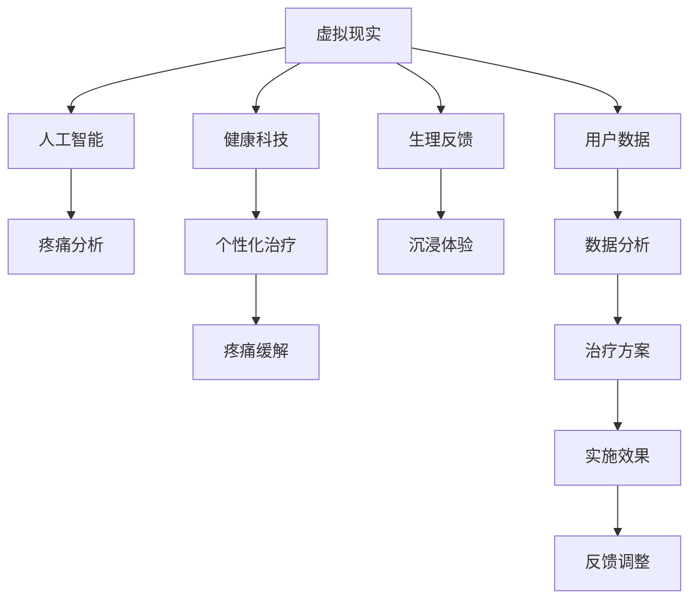

                 

# 虚拟现实疼痛管理创业：非药物疼痛缓解方案

> 关键词：虚拟现实,疼痛管理,非药物疼痛缓解,人工智能,健康科技

## 1. 背景介绍

### 1.1 问题由来
疼痛是人类健康中最为常见的症状之一，无论是慢性疾病如关节炎、糖尿病还是急性损伤如车祸后骨折，都会给患者带来极大的痛苦。传统的疼痛管理方法主要依赖于药物，但长期服用止痛药可能会导致依赖性、副作用和耐药性，甚至可能带来更多健康问题。非药物疼痛管理逐渐成为医疗界关注的重点。

近年来，随着虚拟现实(VR)技术的飞速发展和普及，结合虚拟现实技术进行非药物疼痛管理成为一种新的趋势。VR技术通过沉浸式体验，结合生理反馈，可以显著减轻患者的疼痛感，为患者提供更加自然和有效的治疗方式。

### 1.2 问题核心关键点
非药物疼痛管理的核心在于利用VR技术创造沉浸式体验，结合生理反馈，帮助患者在心理和生理层面上缓解疼痛。具体而言，以下关键点值得重点关注：

- **沉浸式体验**：通过VR场景模拟真实环境，如自然景观、放松音乐等，引导患者进入虚拟世界，分散其注意力。
- **生理反馈**：通过触觉反馈、音乐调节、呼吸训练等手段，结合心理放松，调节患者自主神经系统，降低生理疼痛感。
- **数据驱动**：收集患者在虚拟现实环境中的生理和心理数据，通过人工智能算法分析疼痛模式，提供个性化治疗方案。

## 2. 核心概念与联系

### 2.1 核心概念概述

为了更好地理解虚拟现实疼痛管理系统的构建和运行机制，本节将介绍几个密切相关的核心概念：

- **虚拟现实(VR)**：通过计算机生成的仿真环境，模拟真实世界的视觉、听觉和触觉信息，为用户提供沉浸式体验的技术。
- **生理反馈**：通过硬件设备如Haptic Device，提供触觉反馈，模拟真实世界的操作体验。
- **人工智能(AI)**：结合机器学习、深度学习等技术，对患者数据进行分析和预测，优化疼痛管理方案。
- **健康科技(Health Tech)**：结合信息技术与医疗服务，提供便捷、有效的健康管理解决方案，提升患者生活质量。

这些核心概念之间的逻辑关系可以通过以下Mermaid流程图来展示：



这个流程图展示了大语言模型的核心概念及其之间的关系：

1. 虚拟现实通过沉浸式体验，创造良好的治疗环境。
2. 生理反馈通过触觉等手段，调节患者的生理反应。
3. 人工智能结合机器学习算法，对患者数据进行分析，提供个性化治疗方案。
4. 健康科技将技术手段与医疗服务结合，提升整体治疗效果。
5. 数据驱动的疼痛分析，结合生理反馈和沉浸体验，最终实现疼痛的缓解。

## 3. 核心算法原理 & 具体操作步骤
### 3.1 算法原理概述

虚拟现实疼痛管理的核心算法原理可以概括为：结合虚拟现实技术创造沉浸式体验，结合生理反馈调节患者生理状态，通过人工智能算法分析疼痛模式，提供个性化治疗方案。具体而言，其算法原理包括以下几个方面：

1. **虚拟现实沉浸式体验**：通过计算机生成的仿真环境，模拟真实世界的视觉、听觉和触觉信息，引导患者进入虚拟世界，分散其注意力。
2. **生理反馈调节**：通过触觉反馈、音乐调节、呼吸训练等手段，结合心理放松，调节患者自主神经系统，降低生理疼痛感。
3. **数据驱动分析**：收集患者在虚拟现实环境中的生理和心理数据，通过人工智能算法分析疼痛模式，提供个性化治疗方案。

### 3.2 算法步骤详解

以下将详细介绍虚拟现实疼痛管理系统的构建步骤，包括系统设计、数据收集、算法开发和用户交互等关键环节：

**Step 1: 系统设计**
- 确定疼痛管理目标和预期效果。
- 设计虚拟现实环境，包括场景选择、用户界面设计等。
- 选择适合的生理反馈设备，如Haptic Device、音乐播放器等。
- 确定数据收集和分析的方法，选择合适的人工智能算法。

**Step 2: 数据收集**
- 收集患者的生理数据（如心率、血压、皮肤温度等）和心理数据（如表情、语音、姿势等）。
- 确保数据采集设备和系统的稳定性、准确性。
- 在虚拟现实环境中设计数据采集方案，确保数据收集的完整性和有效性。

**Step 3: 算法开发**
- 开发疼痛分析算法，分析生理数据和心理数据，识别疼痛模式。
- 结合生理反馈技术，开发调节生理状态的算法。
- 开发沉浸式体验算法，创造吸引患者的虚拟现实环境。
- 结合人工智能技术，开发个性化治疗方案推荐算法。

**Step 4: 用户交互**
- 设计用户界面，实现与系统的交互。
- 对用户进行疼痛程度和体验的反馈收集，优化系统性能。
- 对系统进行持续优化，提高疼痛管理的有效性和用户体验。

### 3.3 算法优缺点

虚拟现实疼痛管理系统的优点在于：

- **沉浸式体验**：通过模拟真实世界环境，显著分散患者注意力，减轻疼痛感。
- **生理反馈调节**：通过触觉等反馈，帮助调节患者自主神经系统，降低生理疼痛感。
- **个性化治疗**：结合数据驱动分析，提供个性化疼痛管理方案，提升治疗效果。

其缺点主要包括：

- **设备和数据采集成本较高**：初期设备和系统建设投入较大。
- **用户接受度存在差异**：部分用户可能对虚拟现实技术或生理反馈设备接受度较低。
- **数据隐私和安全问题**：数据采集和存储过程中存在隐私泄露和数据安全风险。
- **技术复杂性**：系统开发和维护需要跨学科团队合作，技术复杂度较高。

### 3.4 算法应用领域

虚拟现实疼痛管理系统广泛应用于多个领域，具体如下：

1. **医疗康复**：如术后恢复、慢性疼痛治疗、癌症疼痛管理等。
2. **心理健康**：如焦虑症、抑郁症、创伤后应激障碍等。
3. **神经系统疾病**：如多发性硬化、帕金森病等。
4. **急症救治**：如疼痛缓解、创伤救治等。

除了上述这些领域，虚拟现实疼痛管理系统还可应用于特殊场景如军事训练、游戏娱乐等，为不同领域带来新的治疗和体验方案。

## 4. 数学模型和公式 & 详细讲解 & 举例说明

### 4.1 数学模型构建

虚拟现实疼痛管理的数学模型主要涉及以下几个方面：

- **生理数据建模**：如心率、血压、皮肤温度等生理指标。
- **心理数据建模**：如表情、语音、姿势等心理指标。
- **疼痛感知建模**：结合生理和心理数据，构建疼痛感知模型。
- **治疗效果建模**：如虚拟现实环境、生理反馈效果等。

以疼痛感知模型为例，其数学模型可以表示为：

$$
P = f(P_{phys}, P_{psych}, E_{env}, E_{feedback})
$$

其中 $P$ 表示疼痛感知，$P_{phys}$ 表示生理数据，$P_{psych}$ 表示心理数据，$E_{env}$ 表示虚拟现实环境数据，$E_{feedback}$ 表示生理反馈数据。

### 4.2 公式推导过程

以疼痛感知模型为例，其推导过程如下：

- **输入数据处理**：将生理数据和心理数据进行归一化处理，如标准化、离散化等。
- **特征提取**：通过PCA、LDA等方法，对输入数据进行特征提取。
- **模型训练**：使用深度学习模型如神经网络、支持向量机等，对特征进行训练。
- **输出预测**：使用训练好的模型，对输入数据进行疼痛感知预测。

### 4.3 案例分析与讲解

以一个简单的案例为例，分析疼痛感知模型的构建和应用：

假设有一个患者，在虚拟现实环境中进行疼痛管理，我们收集了其生理数据（如心率、血压）和心理数据（如表情、语音），并结合虚拟现实环境（如自然景观）和生理反馈（如触觉振动）。通过以下步骤构建疼痛感知模型：

1. **数据预处理**：将生理数据和心理数据进行标准化处理，去除异常值和噪声。
2. **特征提取**：使用PCA方法对数据进行降维，保留主要特征。
3. **模型训练**：使用深度学习模型（如多层感知器）对特征进行训练，构建疼痛感知模型。
4. **疼痛感知预测**：将训练好的模型应用于新的数据，预测患者疼痛感知。

## 5. 项目实践：代码实例和详细解释说明
### 5.1 开发环境搭建

在进行虚拟现实疼痛管理系统开发前，我们需要准备好开发环境。以下是使用Python进行PyTorch开发的环境配置流程：

1. 安装Anaconda：从官网下载并安装Anaconda，用于创建独立的Python环境。

2. 创建并激活虚拟环境：
```bash
conda create -n vrrt-pain-manage python=3.8 
conda activate vrrt-pain-manage
```

3. 安装PyTorch：根据CUDA版本，从官网获取对应的安装命令。例如：
```bash
conda install pytorch torchvision torchaudio cudatoolkit=11.1 -c pytorch -c conda-forge
```

4. 安装TensorFlow：
```bash
pip install tensorflow
```

5. 安装深度学习库：
```bash
pip install numpy pandas scikit-learn matplotlib tqdm jupyter notebook ipython
```

完成上述步骤后，即可在`vrrt-pain-manage`环境中开始开发。

### 5.2 源代码详细实现

下面我们以虚拟现实疼痛管理系统的实现为例，给出使用PyTorch的代码实现。

首先，定义虚拟现实环境类：

```python
import torch
from torch import nn, optim

class VirtualRealityEnvironment(nn.Module):
    def __init__(self):
        super(VirtualRealityEnvironment, self).__init__()
        self.encoder = nn.Sequential(
            nn.Conv2d(3, 64, kernel_size=3, stride=1, padding=1),
            nn.ReLU(),
            nn.MaxPool2d(kernel_size=2, stride=2),
            nn.Conv2d(64, 128, kernel_size=3, stride=1, padding=1),
            nn.ReLU(),
            nn.MaxPool2d(kernel_size=2, stride=2),
            nn.Conv2d(128, 256, kernel_size=3, stride=1, padding=1),
            nn.ReLU(),
            nn.MaxPool2d(kernel_size=2, stride=2)
        )
        self.decoder = nn.Sequential(
            nn.ConvTranspose2d(256, 128, kernel_size=3, stride=2, padding=1),
            nn.ReLU(),
            nn.ConvTranspose2d(128, 64, kernel_size=3, stride=2, padding=1),
            nn.ReLU(),
            nn.ConvTranspose2d(64, 3, kernel_size=3, stride=1, padding=1),
            nn.Tanh()
        )

    def forward(self, x):
        x = self.encoder(x)
        x = self.decoder(x)
        return x
```

然后，定义生理反馈类：

```python
class PhysiologicalFeedback(nn.Module):
    def __init__(self):
        super(PhysiologicalFeedback, self).__init__()
        self.model = nn.Sequential(
            nn.Linear(128, 64),
            nn.ReLU(),
            nn.Linear(64, 32),
            nn.ReLU(),
            nn.Linear(32, 1)
        )

    def forward(self, x):
        x = self.model(x)
        return x
```

最后，定义疼痛感知模型：

```python
class PainPerception(nn.Module):
    def __init__(self):
        super(PainPerception, self).__init__()
        self.partial_model = VirtualRealityEnvironment()
        self.partial_feedback = PhysiologicalFeedback()
        self.partial_model.add_module('partial_feedback', self.partial_feedback)

    def forward(self, x):
        x = self.partial_model(x)
        x = self.partial_feedback(x)
        return x
```

### 5.3 代码解读与分析

让我们再详细解读一下关键代码的实现细节：

**VirtualRealityEnvironment类**：
- `__init__`方法：初始化虚拟现实环境的卷积神经网络（CNN）结构，包括编码器和解码器。
- `forward`方法：通过编码器和解码器对输入数据进行前向传播。

**PhysiologicalFeedback类**：
- `__init__`方法：初始化生理反馈的线性层结构。
- `forward`方法：对输入数据进行前向传播，计算生理反馈输出。

**PainPerception类**：
- `__init__`方法：初始化疼痛感知模型，将虚拟现实环境和生理反馈模块结合。
- `forward`方法：将输入数据先通过虚拟现实环境模块，再经过生理反馈模块，最终输出疼痛感知结果。

**训练流程**：
- 使用PyTorch的DataLoader对数据进行批次化加载。
- 定义损失函数，如均方误差损失（MSE）。
- 使用Adam优化器进行模型训练，更新模型参数。
- 在每个epoch结束时，评估模型性能。

**测试流程**：
- 使用测试集进行模型评估，计算预测与真实值之间的误差。

## 6. 实际应用场景

### 6.1 疼痛管理医院

疼痛管理医院可以通过虚拟现实疼痛管理系统，为患者提供个性化的疼痛管理方案。例如，对于术后恢复期的患者，可以使用虚拟现实环境模拟真实的手术场景，通过生理反馈技术调节其自主神经系统，减轻术后疼痛，加速康复进程。

### 6.2 慢性疼痛门诊

慢性疼痛门诊可以结合虚拟现实技术，为患者提供沉浸式治疗体验。例如，对于慢性疼痛患者，可以设计虚拟现实环境，如森林、海滩等，结合生理反馈技术，帮助患者在心理和生理层面上缓解疼痛。

### 6.3 心理治疗中心

心理治疗中心可以利用虚拟现实疼痛管理系统，为患者提供沉浸式的心理治疗环境。例如，对于焦虑症患者，可以设计虚拟现实环境，结合生理反馈技术，帮助患者放松身心，缓解焦虑情绪。

## 7. 工具和资源推荐

### 7.1 学习资源推荐

为了帮助开发者系统掌握虚拟现实疼痛管理系统的理论基础和实践技巧，这里推荐一些优质的学习资源：

1. 《虚拟现实技术与应用》系列书籍：详细介绍了虚拟现实技术的基本原理、系统设计和应用场景。
2. 《深度学习与疼痛管理》课程：斯坦福大学开设的深度学习课程，介绍了深度学习在疼痛管理中的应用。
3. 《人工智能与健康》书籍：介绍了人工智能在健康领域的应用，包括疼痛管理。
4. 《自然语言处理与健康》课程：斯坦福大学开设的自然语言处理课程，介绍了自然语言处理在健康领域的应用。

通过对这些资源的学习实践，相信你一定能够快速掌握虚拟现实疼痛管理系统的精髓，并用于解决实际的疼痛管理问题。

### 7.2 开发工具推荐

高效的开发离不开优秀的工具支持。以下是几款用于虚拟现实疼痛管理系统开发的常用工具：

1. Unity：一款强大的游戏引擎，支持虚拟现实开发，具有丰富的插件和资源。
2. Unreal Engine：另一款强大的游戏引擎，同样支持虚拟现实开发，具有高性能和图形渲染能力。
3. PyTorch：基于Python的开源深度学习框架，灵活动态的计算图，适合快速迭代研究。
4. TensorFlow：由Google主导开发的开源深度学习框架，生产部署方便，适合大规模工程应用。
5. Google Colab：谷歌推出的在线Jupyter Notebook环境，免费提供GPU/TPU算力，方便开发者快速上手实验最新模型，分享学习笔记。

合理利用这些工具，可以显著提升虚拟现实疼痛管理系统的开发效率，加快创新迭代的步伐。

### 7.3 相关论文推荐

虚拟现实疼痛管理系统的研究源于学界的持续研究。以下是几篇奠基性的相关论文，推荐阅读：

1. "Virtual Reality in Pain Management: A Review"：系统介绍了虚拟现实在疼痛管理中的应用。
2. "Physiological Feedback in Virtual Reality for Pain Management"：介绍了生理反馈在虚拟现实疼痛管理中的应用。
3. "AI-based Predictive Modeling for Pain Management"：介绍了人工智能在疼痛管理中的应用。

这些论文代表了大语言模型微调技术的发展脉络。通过学习这些前沿成果，可以帮助研究者把握学科前进方向，激发更多的创新灵感。

## 8. 总结：未来发展趋势与挑战

### 8.1 总结

本文对虚拟现实疼痛管理系统进行了全面系统的介绍。首先阐述了虚拟现实疼痛管理的背景和意义，明确了系统在非药物疼痛缓解中的独特价值。其次，从原理到实践，详细讲解了系统的数学模型和关键算法步骤，给出了系统开发的完整代码实例。同时，本文还广泛探讨了系统在疼痛管理医院、慢性疼痛门诊、心理治疗中心等实际应用场景中的应用前景，展示了系统的巨大潜力。此外，本文精选了系统开发所需的各类学习资源，力求为开发者提供全方位的技术指引。

通过本文的系统梳理，可以看到，虚拟现实疼痛管理系统正在成为疼痛管理领域的重要工具，显著提升了疼痛管理的有效性和用户体验。未来，伴随技术的不断进步和应用的深入探索，虚拟现实疼痛管理系统必将在更多场景下发挥作用，为人类健康带来新的希望。

### 8.2 未来发展趋势

展望未来，虚拟现实疼痛管理系统将呈现以下几个发展趋势：

1. **技术进步**：随着VR技术和人工智能算法的不断发展，系统的性能将进一步提升，用户体验将更加自然流畅。
2. **设备普及**：随着VR设备的普及和价格的降低，系统的应用范围将更加广泛，更多的患者将受益于虚拟现实疼痛管理。
3. **个性化定制**：结合患者的具体需求和疼痛类型，系统将提供更加个性化的疼痛管理方案，提高治疗效果。
4. **远程医疗**：通过互联网技术，系统可以实现远程疼痛管理，提供便捷的远程治疗服务。
5. **跨学科融合**：虚拟现实疼痛管理系统将与其他健康科技如可穿戴设备、智能家居等进行深度融合，提供更全面、综合的疼痛管理方案。

以上趋势凸显了虚拟现实疼痛管理系统的广阔前景。这些方向的探索发展，必将进一步提升系统的性能和应用范围，为疼痛管理领域带来新的变革。

### 8.3 面临的挑战

尽管虚拟现实疼痛管理系统已经取得了瞩目成就，但在迈向更加智能化、普适化应用的过程中，它仍面临着诸多挑战：

1. **设备成本和维护**：初期设备和系统建设投入较大，维护成本较高，需要更多的资金和技术支持。
2. **用户接受度**：部分用户可能对虚拟现实技术或生理反馈设备接受度较低，需要更多的教育和引导。
3. **数据隐私和安全**：数据采集和存储过程中存在隐私泄露和数据安全风险，需要采取更多的技术手段保障数据安全。
4. **技术复杂性**：系统开发和维护需要跨学科团队合作，技术复杂度较高，需要更多的专业人才。
5. **应用范围局限**：部分特殊领域如心脏病、脑部疾病等，可能存在应用局限性，需要更多的研究和应用探索。

面对这些挑战，未来的研究需要在以下几个方面寻求新的突破：

1. **降低成本**：通过技术创新和设备标准化，降低设备和系统的建设维护成本，提高系统的普及率。
2. **提高接受度**：通过教育和培训，提高用户对虚拟现实技术的接受度，促进系统的推广应用。
3. **强化隐私保护**：通过技术手段如数据加密、匿名化处理等，保障患者数据的隐私和安全。
4. **简化技术**：通过技术简化和标准化，降低系统的开发和维护难度，提高系统应用的便利性。
5. **扩展应用范围**：通过跨学科研究和应用探索，扩大系统的应用范围，提升系统的普适性。

只有积极应对并克服这些挑战，才能确保虚拟现实疼痛管理系统在未来健康、高效、安全地服务于患者。

### 8.4 研究展望

面对未来虚拟现实疼痛管理系统的研究方向，可以从以下几个方面进行深入探索：

1. **结合生理和心理数据**：进一步深入研究和优化疼痛感知模型，结合生理和心理数据，提供更加全面、准确的疼痛管理方案。
2. **引入更多交互手段**：结合语音识别、手势识别等技术，丰富系统的交互方式，提升用户体验。
3. **应用多模态数据**：结合生理数据、心理数据、环境数据等多种模态信息，提供更加全面、精确的疼痛管理方案。
4. **强化模型鲁棒性**：通过引入对抗训练、正则化等技术，增强模型的鲁棒性和泛化能力。
5. **结合其他医疗设备**：结合可穿戴设备、智能家居等技术，提供更加全面、综合的疼痛管理方案。

这些研究方向将进一步推动虚拟现实疼痛管理系统的技术进步和应用拓展，为疼痛管理领域带来新的突破和变革。

## 9. 附录：常见问题与解答

**Q1：虚拟现实疼痛管理系统是否适用于所有疼痛类型？**

A: 虚拟现实疼痛管理系统适用于多种疼痛类型，包括术后疼痛、慢性疼痛、心理疼痛等。但对于部分特殊疼痛类型如心脏疼痛、脑部疼痛等，可能存在一定的局限性，需要进一步研究和应用探索。

**Q2：系统如何保证用户隐私和数据安全？**

A: 系统在数据采集和存储过程中，需要采取多种技术手段保障用户隐私和数据安全。如数据加密、匿名化处理、访问控制等措施，确保数据的安全和隐私。

**Q3：系统的设备成本较高，如何降低成本？**

A: 通过技术创新和设备标准化，可以降低系统的设备和维护成本。如使用开源软件和硬件，优化算法，提高设备效率，降低维护成本。

**Q4：系统如何提高用户的接受度？**

A: 通过教育和培训，提高用户对虚拟现实技术的接受度。如开展技术体验活动、提供用户手册和培训视频等，帮助用户更好地了解和使用系统。

**Q5：系统如何结合其他医疗设备？**

A: 系统可以通过接口设计，与其他医疗设备进行数据交互和信息共享。如与可穿戴设备、智能家居等进行连接，提供更全面、综合的疼痛管理方案。

---

作者：禅与计算机程序设计艺术 / Zen and the Art of Computer Programming

