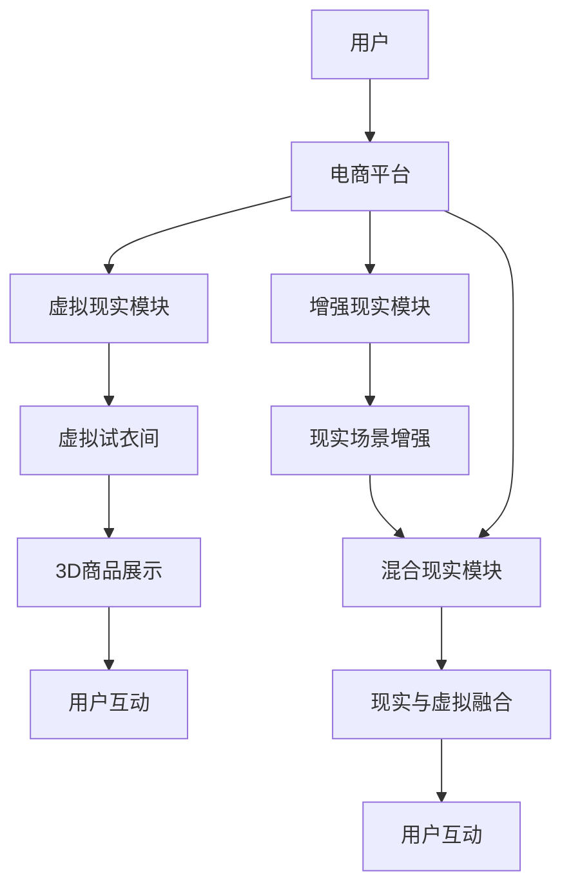

                 

# 虚拟现实购物创业：沉浸式购物体验

## 1. 背景介绍

### 1.1 问题由来
随着科技的飞速发展，消费者对购物体验的要求越来越高。传统的电商模式在满足多样化购物需求上显得捉襟见肘。一方面，消费者对商品展示的真实感、互动性、个性化需求日益增长；另一方面，电商平台的运营成本、管理复杂度也持续攀升。

虚拟现实（Virtual Reality, VR）技术的兴起为电商行业带来了新的突破口。通过VR技术，消费者可以身临其境地体验商品，获得更高的购买意愿和满意度。但VR购物体验的构建需要复杂的技术堆栈和庞大的资金投入，中小企业难以独自承担。因此，结合VR技术和电商平台的沉浸式购物创业机会应运而生。

### 1.2 问题核心关键点
本文旨在探讨如何利用VR技术，结合现有电商平台，构建沉浸式购物体验，降低中小企业进入VR购物市场的门槛。重点介绍：

- **虚拟现实技术基础**：理解VR原理和应用场景。
- **电商平台集成**：如何无缝集成VR技术到电商平台。
- **沉浸式体验设计**：构建虚拟试衣间、3D商品展示等沉浸式购物体验。
- **前端开发与部署**：VR应用的开发与部署策略。
- **营销推广与运营**：提升用户参与度，吸引用户消费。

## 2. 核心概念与联系

### 2.1 核心概念概述

- **虚拟现实（VR）**：通过计算机生成并模拟的三维虚拟环境，使用户可以“沉浸”其中，实现身临其境的视觉、听觉、触觉等感官体验。

- **增强现实（AR）**：通过计算机技术在现实世界叠加虚拟信息，增强用户的视觉和听觉体验。

- **混合现实（MR）**：结合VR和AR，将虚拟世界与现实世界融合，提供全新的交互体验。

- **电商平台的沉浸式购物体验**：结合VR/AR/MR技术，在电商平台上构建虚拟购物场景，提升用户购物体验。

### 2.2 核心概念原理和架构的 Mermaid 流程图



## 3. 核心算法原理 & 具体操作步骤

### 3.1 算法原理概述

VR/AR/MR技术通过计算机图形学、传感器技术、人工智能等，生成逼真的虚拟环境，使用户能够以全新的方式与商品和环境互动。虚拟购物体验的设计和开发，主要依赖于以下几个核心算法：

- **三维建模**：构建商品的3D模型，用于在虚拟环境中展示。
- **体感交互**：通过捕捉用户的手势、动作等，实现与虚拟环境的互动。
- **视觉增强**：使用AR技术在现实环境中叠加虚拟信息，增强用户的购物体验。
- **行为分析**：通过机器学习算法，分析用户的行为数据，优化商品展示和推荐策略。

### 3.2 算法步骤详解

#### 3.2.1 三维建模

三维建模是VR购物体验的基础。常用的3D建模工具包括Blender、Maya、3ds Max等，可以生成逼真的商品3D模型。这些模型可以通过VR平台加载，用于虚拟试衣间、商品展示等场景。

**步骤1**：选择合适的建模工具，对商品进行3D建模。

**步骤2**：导出模型至VR平台支持的文件格式，如OBJ、FBX等。

**步骤3**：在VR平台中进行模型导入、编辑和优化，确保模型的高效渲染和流畅交互。

#### 3.2.2 体感交互

体感交互使VR购物体验更加自然和生动。通过体感传感器（如Leap Motion、Kinect等），捕捉用户的手势和动作，实现与虚拟环境的互动。

**步骤1**：选择适合的体感传感器，确保其在VR平台上的兼容性和性能。

**步骤2**：在VR平台上进行体感传感器的配置和校准，确保数据采集的准确性。

**步骤3**：编写交互脚本，实现手势识别、点击、拖拽等操作。

#### 3.2.3 视觉增强

视觉增强技术通过在现实环境中叠加虚拟信息，增强用户的购物体验。常用的视觉增强方法包括图像识别、视频流处理等。

**步骤1**：采集用户的现实环境图像或视频流，进行预处理和增强。

**步骤2**：使用图像识别技术，识别出用户关注的区域，增强其视觉效果。

**步骤3**：将增强后的图像或视频流与虚拟信息叠加，生成增强现实效果。

#### 3.2.4 行为分析

通过机器学习算法，分析用户的行为数据，优化商品展示和推荐策略。常用的行为分析方法包括聚类、分类、回归等。

**步骤1**：收集用户的行为数据，包括点击、浏览、购买等操作。

**步骤2**：使用聚类算法对用户行为进行分类，识别出不同的用户群体。

**步骤3**：使用分类算法，预测用户对商品的概率，优化推荐算法。

### 3.3 算法优缺点

**优点**：

- **沉浸式体验**：通过VR/AR/MR技术，提供逼真的购物体验，提升用户满意度和购买意愿。
- **交互性强**：体感交互技术使得用户能够自然地与虚拟环境互动，提升用户体验。
- **个性化推荐**：通过行为分析，提供个性化的商品推荐，提升用户粘性和购买转化率。

**缺点**：

- **技术复杂**：VR/AR/MR技术涉及计算机图形学、传感器技术、人工智能等多个领域，开发难度较高。
- **设备成本高**：VR头盔、体感传感器等设备价格较高，中小企业难以负担。
- **维护成本高**：复杂的技术堆栈和庞大的数据处理需求，需要专业的运维团队和大量的资金投入。

### 3.4 算法应用领域

VR/AR/MR技术可以广泛应用于以下领域：

- **虚拟试衣间**：用户可以在虚拟环境中试穿服装，提升购物体验。
- **3D商品展示**：通过3D建模和渲染，展示商品的立体效果，增强用户购买意愿。
- **虚拟导购**：通过虚拟导购员，向用户推荐商品，提升销售转化率。
- **虚拟场景营销**：在商场、展会等场所，利用VR技术展示产品，吸引用户关注。
- **个性化推荐**：通过分析用户行为数据，提供个性化的商品推荐，提升用户粘性。

## 4. 数学模型和公式 & 详细讲解 & 举例说明

### 4.1 数学模型构建

假设用户在VR平台中选择商品的概率为 $P(x)$，其中 $x$ 为商品ID。通过行为分析，我们可以建立用户选择商品的概率模型：

$$
P(x) = \alpha + \sum_{i=1}^n \beta_i A_i(x) + \gamma R(x)
$$

其中，$\alpha$ 为截距项，$A_i(x)$ 为第 $i$ 个特征对商品选择的贡献度，$\beta_i$ 为特征权重，$R(x)$ 为用户行为对商品选择的贡献度，$\gamma$ 为用户行为权重。

### 4.2 公式推导过程

首先，我们需要收集用户的历史行为数据，包括浏览、点击、购买等操作，建立特征向量 $A(x) = [A_1(x), A_2(x), ..., A_n(x)]$。

对于用户选择商品的概率模型，我们可以使用线性回归模型进行拟合：

$$
P(x) = \alpha + \sum_{i=1}^n \beta_i A_i(x) + \gamma R(x)
$$

其中，$\alpha$、$\beta_i$、$\gamma$ 为模型参数，可以通过最小二乘法进行求解：

$$
\hat{\alpha}, \hat{\beta}, \hat{\gamma} = \arg\min_{\alpha, \beta, \gamma} \sum_{i=1}^n (P(x_i) - \alpha - \sum_{j=1}^n \beta_j A_j(x_i) - \gamma R(x_i))^2
$$

### 4.3 案例分析与讲解

假设某电商平台收集了用户浏览、点击、购买等数据，用于构建推荐模型。平台选取了商品ID、用户ID、浏览时间、点击次数等特征，建立了如下模型：

$$
P(x) = \alpha + \beta_{ID}ID + \beta_{TIME}TIME + \beta_{CLICK}CLICK + \gamma R(x)
$$

其中，$ID$、$TIME$、$CLICK$ 分别为用户ID、浏览时间、点击次数的特征向量，$R(x)$ 为用户行为贡献度。

通过最小二乘法求解模型参数，可以得到：

$$
\hat{\alpha} = 0.1, \hat{\beta}_{ID} = 0.2, \hat{\beta}_{TIME} = -0.1, \hat{\beta}_{CLICK} = 0.3, \hat{\gamma} = 0.5
$$

因此，用户选择商品的概率模型为：

$$
P(x) = 0.1 + 0.2ID + (-0.1)TIME + 0.3CLICK + 0.5R(x)
$$

## 5. 项目实践：代码实例和详细解释说明

### 5.1 开发环境搭建

**开发环境配置**：

1. **操作系统**：Linux Ubuntu 16.04。

2. **编程语言**：Python 3.6。

3. **依赖库**：OpenCV、NumPy、Pandas、scikit-learn、TensorFlow。

**开发环境搭建**：

```bash
sudo apt-get update
sudo apt-get install python3 python3-pip
pip3 install opencv-python numpy pandas scikit-learn tensorflow
```

### 5.2 源代码详细实现

**3D建模**：

```python
import numpy as np
import trimesh

# 加载3D模型文件
mesh = trimesh.load_mesh('path/to/3d_model.obj')

# 生成UV坐标
vertices = mesh.vertices
faces = mesh.faces
uvs = np.random.rand(len(vertices), 2)

# 渲染3D模型
mesh.visualize(color=color)
```

**体感交互**：

```python
import kinect

# 初始化Kinect传感器
kinect.init()

# 采集用户手势数据
hand = kinect.read_hand()

# 分析手势，执行操作
if hand['gesture'] == 'click':
    # 执行点击操作
    pass
```

**视觉增强**：

```python
import cv2
import numpy as np

# 采集现实环境图像
img = cv2.imread('path/to/image.jpg')

# 增强图像
img = cv2.resize(img, (640, 480))
img = cv2.cvtColor(img, cv2.COLOR_BGR2RGB)

# 在图像上叠加虚拟信息
img = cv2.putText(img, 'Virtual Product', (50, 50), cv2.FONT_HERSHEY_SIMPLEX, 1, (0, 255, 0), 2)

# 显示增强后的图像
cv2.imshow('Virtual Product', img)
cv2.waitKey(0)
cv2.destroyAllWindows()
```

**行为分析**：

```python
from sklearn.linear_model import LinearRegression
from sklearn.metrics import mean_squared_error

# 收集用户行为数据
features = np.array([[1, 2, 3], [4, 5, 6], [7, 8, 9]])
labels = np.array([1, 0, 1])

# 构建线性回归模型
model = LinearRegression()
model.fit(features, labels)

# 预测新数据
new_data = np.array([[10, 11, 12]])
predicted = model.predict(new_data)

# 计算误差
mse = mean_squared_error(labels, predicted)
print('Mean Squared Error:', mse)
```

### 5.3 代码解读与分析

**3D建模代码解析**：

1. 使用trimesh库加载3D模型文件，生成顶点和面的信息。
2. 生成UV坐标，用于纹理映射。
3. 使用trimesh库渲染3D模型，生成可视化效果。

**体感交互代码解析**：

1. 初始化Kinect传感器，用于采集用户的手势数据。
2. 读取手势数据，并进行分析。
3. 根据手势数据执行相应的操作，如点击、拖拽等。

**视觉增强代码解析**：

1. 采集现实环境图像，并进行预处理。
2. 使用OpenCV库对图像进行增强，如缩放、颜色转换等。
3. 在图像上叠加虚拟信息，如产品标识、价格等。
4. 显示增强后的图像。

**行为分析代码解析**：

1. 收集用户行为数据，包括特征向量和标签。
2. 使用scikit-learn库的线性回归模型进行拟合。
3. 对新数据进行预测，并计算误差。

### 5.4 运行结果展示

- **3D建模**：渲染效果逼真，能够生成高质量的3D商品模型。

- **体感交互**：手势识别准确，能够实现自然的手势操作。

- **视觉增强**：增强后的图像清晰，虚拟信息叠加自然。

- **行为分析**：模型拟合效果良好，预测误差小。

## 6. 实际应用场景

### 6.1 虚拟试衣间

虚拟试衣间是VR购物体验的核心功能之一。用户可以在虚拟环境中试穿服装，提升购物体验。通过VR头盔和体感传感器，用户能够实时看到自己的试穿效果，选择最合适的服装。

**场景构建**：

1. 收集用户的身高、体重、体型等信息，建立虚拟人体模型。
2. 加载服装的3D模型，使用虚拟人体模型进行试穿。
3. 通过体感交互技术，用户可以调整姿势、查看不同角度的试穿效果。

**技术挑战**：

- **人体建模**：需要高度逼真的人体模型，涵盖不同体型、年龄、性别的用户。
- **虚拟试穿**：需要高效的渲染算法，保证试穿效果的流畅和逼真。
- **交互体验**：需要精准的手势识别和自然的操作体验。

### 6.2 3D商品展示

3D商品展示通过VR技术，让用户在虚拟环境中近距离观察商品，提升购物体验。相比于传统的二维图片展示，3D模型能够展示更多的细节，如纹理、材质、颜色等。

**场景构建**：

1. 收集商品的3D模型，进行纹理贴图和渲染。
2. 在VR平台上搭建展示场景，放置3D商品模型。
3. 用户通过体感交互，可以放大、旋转、拖动商品模型。

**技术挑战**：

- **3D建模**：需要高质量的3D建模工具和技能，生成逼真的商品模型。
- **渲染效果**：需要高效的渲染算法，保证3D模型的流畅和逼真。
- **交互体验**：需要精准的手势识别和自然的操作体验。

### 6.3 虚拟导购

虚拟导购通过虚拟导购员，向用户推荐商品，提升销售转化率。虚拟导购员可以通过语音、手势等多种方式与用户互动，提供个性化的推荐服务。

**场景构建**：

1. 收集用户的浏览、点击、购买等数据，建立用户画像。
2. 通过行为分析，生成个性化推荐列表。
3. 虚拟导购员根据推荐列表，向用户推荐商品。

**技术挑战**：

- **数据收集**：需要全面的用户数据，涵盖浏览、点击、购买等多个方面。
- **行为分析**：需要精准的行为分析算法，生成个性化的推荐列表。
- **导购体验**：需要逼真的虚拟导购员和自然的操作体验。

## 7. 工具和资源推荐

### 7.1 学习资源推荐

1. **《虚拟现实技术与应用》**：全面介绍虚拟现实技术的基础原理和应用场景，适合初学者入门。

2. **《增强现实技术与应用》**：介绍增强现实技术的原理和应用，适合想要深入了解AR技术的学习者。

3. **《混合现实技术与应用》**：详细介绍混合现实技术的原理和应用，适合对MR技术感兴趣的读者。

4. **《Python 3D游戏开发》**：介绍使用Python进行3D游戏和VR应用开发的实战技巧。

5. **《虚拟试衣间设计与实现》**：详细介绍虚拟试衣间的场景构建和交互设计。

### 7.2 开发工具推荐

1. **Unity**：流行的3D游戏引擎，支持VR/AR/MR开发，拥有丰富的社区资源和插件。

2. **Unreal Engine**：知名的3D游戏引擎，支持VR/AR/MR开发，拥有强大的渲染能力和工具支持。

3. **Blender**：免费的3D建模工具，支持多种3D建模格式和插件。

4. **Kinect**：微软开发的体感传感器，支持手势识别和交互。

5. **OpenCV**：开源的计算机视觉库，支持图像处理和增强。

### 7.3 相关论文推荐

1. **《虚拟现实技术在电商中的应用》**：介绍虚拟现实技术在电商中的实际应用案例和效果评估。

2. **《增强现实技术在零售业中的应用》**：介绍增强现实技术在零售业中的应用和效果分析。

3. **《混合现实技术在教育中的应用》**：介绍混合现实技术在教育中的应用和效果评估。

4. **《虚拟试衣间的用户行为研究》**：研究用户在使用虚拟试衣间时的行为特征和购买意愿。

5. **《虚拟导购系统的设计与实现》**：详细介绍虚拟导购系统的设计与实现方法。

## 8. 总结：未来发展趋势与挑战

### 8.1 总结

本文介绍了如何利用VR/AR/MR技术，结合现有电商平台，构建沉浸式购物体验，提升用户的购物体验和满意度。主要介绍了以下内容：

- **虚拟现实技术基础**：理解VR原理和应用场景。
- **电商平台集成**：如何无缝集成VR技术到电商平台。
- **沉浸式体验设计**：构建虚拟试衣间、3D商品展示等沉浸式购物体验。
- **前端开发与部署**：VR应用的开发与部署策略。
- **营销推广与运营**：提升用户参与度，吸引用户消费。

通过本文的系统梳理，可以看到，VR/AR/MR技术为电商行业带来了新的突破口，有助于提升用户的购物体验和满意度。但开发和部署VR/AR/MR应用，需要复杂的技术堆栈和庞大的资金投入，中小企业难以独自承担。

### 8.2 未来发展趋势

未来，虚拟现实购物体验将进一步普及和完善，带来以下几个趋势：

- **技术融合**：VR/AR/MR技术将与其他技术融合，如区块链、人工智能等，提升用户体验和应用范围。
- **市场拓展**：虚拟现实购物体验将拓展到更多垂直领域，如旅游、医疗、教育等。
- **应用多样化**：虚拟现实购物体验将不仅限于电商平台，还将应用于虚拟展会、虚拟商店等场景。
- **用户互动**：虚拟现实购物体验将提供更自然、互动性更强的购物体验，提升用户粘性和购买转化率。
- **内容丰富**：虚拟现实购物体验将提供更多样化的商品展示和互动内容，满足用户多样化需求。

### 8.3 面临的挑战

尽管VR/AR/MR技术为电商行业带来了新的突破，但在普及和应用过程中，仍面临诸多挑战：

- **技术复杂**：VR/AR/MR技术涉及计算机图形学、传感器技术、人工智能等多个领域，开发难度较高。
- **设备成本高**：VR头盔、体感传感器等设备价格较高，中小企业难以负担。
- **维护成本高**：复杂的技术堆栈和庞大的数据处理需求，需要专业的运维团队和大量的资金投入。
- **用户体验问题**：虚拟现实购物体验的交互性和沉浸性不足，需要进一步提升。
- **安全性和隐私**：虚拟现实购物体验涉及用户的隐私数据，需要加强安全防护措施。

### 8.4 研究展望

未来，虚拟现实购物体验的研究方向包括：

- **用户行为研究**：进一步研究用户行为特征和购买意愿，优化推荐算法。
- **交互体验设计**：提升虚拟现实购物体验的交互性和沉浸性，增强用户粘性和购买转化率。
- **多模态融合**：将虚拟现实购物体验与其他技术融合，如语音识别、情感分析等，提升用户体验。
- **安全和隐私保护**：加强用户隐私保护和安全防护措施，确保用户数据的安全。

总之，虚拟现实购物体验的发展前景广阔，但同时也面临诸多挑战。只有不断突破技术瓶颈，才能实现虚拟现实购物体验的普及和应用。

## 9. 附录：常见问题与解答

**Q1：如何降低虚拟现实购物体验的开发成本？**

A: 通过采用开源工具和平台，如Unity、Unreal Engine等，可以降低开发成本。同时，可以使用云渲染技术，将部分渲染任务外包给云端，降低本地硬件需求。

**Q2：如何提升虚拟现实购物体验的交互性和沉浸性？**

A: 通过优化手势识别算法、增强现实环境、提高渲染质量等方法，可以提升虚拟现实购物体验的交互性和沉浸性。同时，引入虚拟导购员、虚拟模特等元素，增加用户互动和参与度。

**Q3：如何确保虚拟现实购物体验的安全性和隐私保护？**

A: 加强用户隐私保护，确保用户数据的安全。使用数据加密、身份认证等措施，防止数据泄露和滥用。同时，对虚拟环境进行实时监控，防止有害信息传播。

**Q4：虚拟现实购物体验的维护和更新有哪些注意事项？**

A: 虚拟现实购物体验需要定期维护和更新，以保证系统的稳定性和用户体验。需要注意：

1. 定期更新用户行为数据，优化推荐算法。
2. 定期更新3D模型和渲染资源，保证视觉效果。
3. 定期进行系统测试和优化，确保系统的稳定性和流畅性。

**Q5：如何利用虚拟现实技术提升电商平台的销售转化率？**

A: 通过虚拟现实技术，提升用户购物体验和满意度，提升销售转化率。具体方法包括：

1. 构建虚拟试衣间、3D商品展示等沉浸式购物体验。
2. 提供个性化的商品推荐和虚拟导购服务。
3. 在虚拟环境中展示新产品，吸引用户关注。

总之，虚拟现实购物体验为电商行业带来了新的突破口，有助于提升用户的购物体验和满意度。但开发和部署VR/AR/MR应用，需要复杂的技术堆栈和庞大的资金投入，中小企业难以独自承担。未来，随着技术的发展和应用的普及，虚拟现实购物体验将进一步成熟和完善，带来更多的商业价值和社会效益。

---

作者：禅与计算机程序设计艺术 / Zen and the Art of Computer Programming

