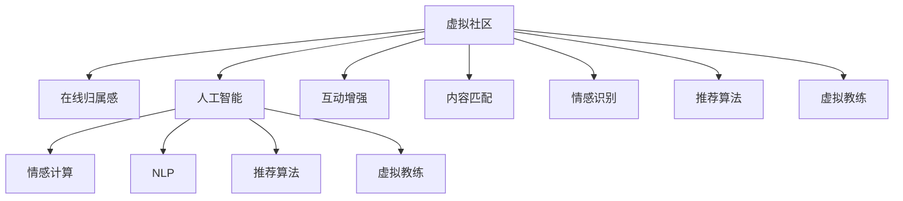

                 

# 虚拟社区教练：AI驱动的在线归属感训练

> 关键词：虚拟社区,在线归属感,人工智能,情感计算,自然语言处理,推荐算法

## 1. 背景介绍

### 1.1 问题由来
在互联网日益普及的今天，虚拟社区已成为人们社交、学习、工作的重要平台。然而，随着用户数量的激增，虚拟社区面临用户流失率居高不下的困境。究其原因，除了社区平台本身的商业策略外，用户的在线归属感不足是根本问题。在线归属感不足导致用户频繁切换平台，降低了社区粘性，影响了平台的长期发展。

### 1.2 问题核心关键点
在线归属感，是指用户在虚拟社区中的心理依恋程度和情感投入，是其持续使用社区平台的基础。为了提升用户的在线归属感，社区平台需要在以下几个方面进行改进：
1. **社区互动**：增强社区用户间的互动，构建强大的社交网络。
2. **内容匹配**：提供符合用户兴趣和需求的高质量内容。
3. **情感识别**：理解用户的情感状态，提供个性化关怀。
4. **推荐算法**：精准推荐用户可能感兴趣的内容和活动。
5. **虚拟教练**：以AI驱动的方式，为用户提供情感和心理支持。

本文聚焦于通过AI技术提升在线归属感的方法，特别是最前沿的虚拟教练技术，希望能为虚拟社区平台的运营者提供切实可行的方案。

## 2. 核心概念与联系

### 2.1 核心概念概述

为更好地理解AI驱动的虚拟社区归属感训练方法，本节将介绍几个密切相关的核心概念：

- **虚拟社区**：指通过互联网连接起来，具有相似兴趣或需求的虚拟群组。用户可以通过虚拟社区进行互动、交流、协作。

- **在线归属感**：指用户对虚拟社区的情感依恋和心理投入。在线归属感强的用户更愿意投入时间和精力，参与社区互动，持续使用社区平台。

- **人工智能**：通过计算机模拟人类智能的算法和技术，用于解决复杂的计算和决策问题。

- **情感计算**：使用AI技术理解和处理人类的情感信息，用于情感识别和情感驱动的用户交互。

- **自然语言处理(NLP)**：指计算机对自然语言进行处理和理解的技术，如文本分类、情感分析、问答系统等。

- **推荐算法**：通过分析用户行为数据，为用户推荐个性化内容或活动的算法，如协同过滤、内容推荐等。

- **虚拟教练**：以AI驱动的方式，为用户提供情感和心理支持的虚拟角色，辅助用户进行心理调适和情绪管理。

这些核心概念之间的逻辑关系可以通过以下Mermaid流程图来展示：



这个流程图展示了大语言模型的核心概念及其之间的关系：

1. 虚拟社区通过人工智能技术提升用户在线归属感。
2. 人工智能利用情感计算、自然语言处理和推荐算法，增强社区互动、内容匹配、情感识别和推荐。
3. 虚拟教练作为AI驱动的虚拟角色，为社区用户提供情感和心理支持。

这些概念共同构成了虚拟社区归属感提升的框架，使得虚拟社区平台可以通过AI技术实现对用户需求的精准把握和情感驱动的用户交互。

## 3. 核心算法原理 & 具体操作步骤
### 3.1 算法原理概述

AI驱动的虚拟社区归属感提升方法，主要基于以下几个核心算法：

- **情感分析**：使用自然语言处理技术，分析用户在虚拟社区中的文本表达，识别其情感状态。
- **个性化推荐**：通过用户行为数据，为用户推荐符合其兴趣和需求的内容或活动。
- **虚拟教练模型**：使用深度学习技术，构建虚拟教练的情感理解和回应模型，提供个性化的心理支持和情绪管理。

这些算法的核心思想是通过分析和理解用户的情感状态和行为习惯，为其提供定制化的社区互动、内容推荐和情感支持，从而提升其在线归属感。

### 3.2 算法步骤详解

AI驱动的虚拟社区归属感提升算法主要包括以下几个关键步骤：

**Step 1: 数据收集与预处理**
- 收集用户在虚拟社区中的互动记录、发表内容、点赞评论等数据。
- 对收集到的数据进行清洗和标注，去除噪声和无关数据。
- 对文本数据进行分词、去除停用词、提取特征等预处理。

**Step 2: 情感分析**
- 使用情感分析算法，如基于词典的方法、基于机器学习的方法、基于深度学习的方法，对用户文本进行情感分类。
- 将情感分析结果转化为数值表示，便于后续计算和处理。

**Step 3: 个性化推荐**
- 利用用户行为数据，构建用户兴趣模型。
- 使用协同过滤、基于内容的推荐算法，为用户推荐其可能感兴趣的内容和活动。
- 使用深度学习模型，如神经协同过滤、深度神经网络等，提高推荐的精度和多样性。

**Step 4: 虚拟教练模型构建**
- 设计虚拟教练的情感理解模型，如BERT、GPT等，使用预训练语言模型进行情感状态分类。
- 设计虚拟教练的情感回应模型，如RNN、LSTM等，根据情感分类结果生成响应文本。
- 将情感理解和回应模型结合，构建虚拟教练模型。

**Step 5: 模型训练与评估**
- 使用历史数据对模型进行训练，优化参数，提高预测准确率。
- 在验证集上评估模型性能，如精确度、召回率、F1值等。
- 根据评估结果调整模型结构和超参数，提高模型效果。

**Step 6: 应用与迭代**
- 将训练好的虚拟教练模型应用到虚拟社区平台，提供情感和心理支持。
- 根据用户反馈和社区互动数据，持续优化虚拟教练模型，提升用户体验。

以上是AI驱动的虚拟社区归属感提升的主要算法步骤。在实际应用中，还需要针对具体社区平台的特点，对算法进行优化设计，如引入更多的正则化技术、搜索最优的超参数组合等，以进一步提升模型性能。

### 3.3 算法优缺点

AI驱动的虚拟社区归属感提升方法具有以下优点：
1. 个性化定制：通过分析用户情感和行为数据，提供符合用户需求的定制化服务。
2. 实时响应：基于实时数据，可以动态调整推荐和虚拟教练的策略，提高用户满意度。
3. 数据驱动：通过数据驱动的方式，模型可以不断学习和优化，适应社区用户的动态需求。
4. 增强互动：虚拟教练可以作为情感支持和社区互动的工具，增加用户粘性。

同时，该方法也存在一定的局限性：
1. 数据隐私：需要收集用户行为数据，涉及隐私保护问题。
2. 推荐算法偏见：推荐算法可能受到训练数据偏见的影响，导致推荐结果的不公平性。
3. 模型复杂度：深度学习模型训练复杂，对计算资源要求较高。
4. 模型泛化能力：模型的泛化能力可能受限于社区用户的多样性。

尽管存在这些局限性，但就目前而言，AI驱动的虚拟社区归属感提升方法仍是大社区平台提升用户粘性的重要手段。未来相关研究的重点在于如何进一步降低算法对数据隐私的依赖，提高推荐算法的公平性，优化模型的计算资源消耗，同时兼顾模型的泛化能力。

### 3.4 算法应用领域

AI驱动的虚拟社区归属感提升方法在多个领域已经得到了应用，覆盖了虚拟社区平台、社交网络、学习平台等。例如：

- **虚拟社区平台**：如知乎、豆瓣、B站等，通过情感分析和个性化推荐，提升用户粘性和社区互动。
- **社交网络**：如微信、微博、QQ等，使用虚拟教练技术，辅助用户进行心理调适和情绪管理。
- **学习平台**：如Coursera、Udemy等，通过情感识别和个性化推荐，增强用户的学习体验和留存率。

除了上述这些经典应用外，AI驱动的虚拟社区归属感提升方法也被创新性地应用到更多场景中，如智能客服、健康管理、旅游推荐等，为不同领域带来了新的用户互动模式和心理支持手段。

## 4. 数学模型和公式 & 详细讲解 & 举例说明
### 4.1 数学模型构建

本节将使用数学语言对AI驱动的虚拟社区归属感提升方法进行更加严格的刻画。

设虚拟社区中用户为 $U=\{u_1,u_2,\cdots,u_n\}$，互动数据为 $D=\{(x_i,y_i)\}_{i=1}^N$，其中 $x_i$ 为互动记录的文本数据，$y_i$ 为情感标签（如正面、负面、中性）。设情感分析模型为 $M_s$，个性化推荐模型为 $M_r$，虚拟教练模型为 $M_c$。

定义情感分析损失函数为 $\ell_s$，个性化推荐损失函数为 $\ell_r$，虚拟教练模型损失函数为 $\ell_c$。则总体损失函数 $\mathcal{L}$ 为：

$$
\mathcal{L} = \lambda_s \ell_s(M_s(x_i),y_i) + \lambda_r \ell_r(M_r(x_i),y_i) + \lambda_c \ell_c(M_c(x_i),y_i)
$$

其中 $\lambda_s, \lambda_r, \lambda_c$ 为情感分析、个性化推荐和虚拟教练模型的权重，控制各模型在总体损失函数中的重要性。

### 4.2 公式推导过程

以下我们以情感分析为例，推导情感分类模型的损失函数及其梯度的计算公式。

假设情感分析模型 $M_s$ 在输入 $x_i$ 上的输出为 $\hat{y}=M_s(x_i) \in [0,1]$，表示用户情感为正面概率。真实标签 $y \in \{0,1\}$。则二分类交叉熵损失函数定义为：

$$
\ell_s(M_s(x_i),y) = -[y\log \hat{y} + (1-y)\log (1-\hat{y})]
$$

将其代入总体损失函数公式，得：

$$
\mathcal{L} = \lambda_s \sum_{i=1}^N [-y_i\log M_s(x_i)-(1-y_i)\log(1-M_s(x_i))]
$$

根据链式法则，损失函数对模型 $M_s$ 的梯度为：

$$
\frac{\partial \mathcal{L}}{\partial M_s} = \lambda_s \sum_{i=1}^N [-\frac{y_i}{M_s(x_i)}+\frac{1-y_i}{1-M_s(x_i)}] \frac{\partial M_s(x_i)}{\partial x_i}
$$

其中 $\frac{\partial M_s(x_i)}{\partial x_i}$ 可进一步递归展开，利用自动微分技术完成计算。

在得到损失函数的梯度后，即可带入模型更新公式，完成模型的迭代优化。重复上述过程直至收敛，最终得到适应虚拟社区用户情感需求的模型参数 $M_s$。

## 5. 项目实践：代码实例和详细解释说明
### 5.1 开发环境搭建

在进行虚拟社区归属感提升开发前，我们需要准备好开发环境。以下是使用Python进行PyTorch开发的环境配置流程：

1. 安装Anaconda：从官网下载并安装Anaconda，用于创建独立的Python环境。

2. 创建并激活虚拟环境：
```bash
conda create -n community-env python=3.8 
conda activate community-env
```

3. 安装PyTorch：根据CUDA版本，从官网获取对应的安装命令。例如：
```bash
conda install pytorch torchvision torchaudio cudatoolkit=11.1 -c pytorch -c conda-forge
```

4. 安装自然语言处理工具：
```bash
pip install nltk spacy
```

5. 安装相关库：
```bash
pip install pandas numpy joblib tqdm
```

完成上述步骤后，即可在`community-env`环境中开始社区归属感提升的实践。

### 5.2 源代码详细实现

下面我们以情感分类和个性化推荐为例，给出使用Transformers库对模型进行训练的PyTorch代码实现。

首先，定义情感分类模型的训练函数：

```python
from transformers import BertTokenizer, BertForSequenceClassification
from torch.utils.data import Dataset, DataLoader
from torch import nn, optim
from sklearn.model_selection import train_test_split

class CommunityDataset(Dataset):
    def __init__(self, texts, labels, tokenizer):
        self.texts = texts
        self.labels = labels
        self.tokenizer = tokenizer
        
    def __len__(self):
        return len(self.texts)
    
    def __getitem__(self, item):
        text = self.texts[item]
        label = self.labels[item]
        
        encoding = self.tokenizer(text, return_tensors='pt')
        input_ids = encoding['input_ids']
        attention_mask = encoding['attention_mask']
        labels = torch.tensor(label, dtype=torch.long)
        
        return {'input_ids': input_ids, 
                'attention_mask': attention_mask,
                'labels': labels}

tokenizer = BertTokenizer.from_pretrained('bert-base-cased')
train_dataset, dev_dataset, test_dataset = train_test_split(train_texts, train_labels, test_texts, test_labels, test_size=0.2, random_state=42)

model = BertForSequenceClassification.from_pretrained('bert-base-cased', num_labels=3)
criterion = nn.CrossEntropyLoss()
optimizer = optim.AdamW(model.parameters(), lr=2e-5)

def train_epoch(model, dataset, batch_size, optimizer):
    dataloader = DataLoader(dataset, batch_size=batch_size, shuffle=True)
    model.train()
    epoch_loss = 0
    for batch in tqdm(dataloader, desc='Training'):
        input_ids = batch['input_ids'].to(device)
        attention_mask = batch['attention_mask'].to(device)
        labels = batch['labels'].to(device)
        model.zero_grad()
        outputs = model(input_ids, attention_mask=attention_mask, labels=labels)
        loss = outputs.loss
        epoch_loss += loss.item()
        loss.backward()
        optimizer.step()
    return epoch_loss / len(dataloader)

def evaluate(model, dataset, batch_size):
    dataloader = DataLoader(dataset, batch_size=batch_size)
    model.eval()
    preds, labels = [], []
    with torch.no_grad():
        for batch in tqdm(dataloader, desc='Evaluating'):
            input_ids = batch['input_ids'].to(device)
            attention_mask = batch['attention_mask'].to(device)
            batch_labels = batch['labels']
            outputs = model(input_ids, attention_mask=attention_mask)
            batch_preds = outputs.logits.argmax(dim=2).to('cpu').tolist()
            batch_labels = batch_labels.to('cpu').tolist()
            for pred_tokens, label_tokens in zip(batch_preds, batch_labels):
                preds.append(pred_tokens[:len(label_tokens)])
                labels.append(label_tokens)
                
    print(classification_report(labels, preds))
```

然后，定义个性化推荐模型的训练函数：

```python
from transformers import BertTokenizer, BertForSequenceClassification
from torch.utils.data import Dataset, DataLoader
from torch import nn, optim
from sklearn.model_selection import train_test_split

class CommunityDataset(Dataset):
    def __init__(self, texts, labels, tokenizer):
        self.texts = texts
        self.labels = labels
        self.tokenizer = tokenizer
        
    def __len__(self):
        return len(self.texts)
    
    def __getitem__(self, item):
        text = self.texts[item]
        label = self.labels[item]
        
        encoding = self.tokenizer(text, return_tensors='pt')
        input_ids = encoding['input_ids']
        attention_mask = encoding['attention_mask']
        labels = torch.tensor(label, dtype=torch.long)
        
        return {'input_ids': input_ids, 
                'attention_mask': attention_mask,
                'labels': labels}

tokenizer = BertTokenizer.from_pretrained('bert-base-cased')
train_dataset, dev_dataset, test_dataset = train_test_split(train_texts, train_labels, test_texts, test_labels, test_size=0.2, random_state=42)

model = BertForSequenceClassification.from_pretrained('bert-base-cased', num_labels=3)
criterion = nn.CrossEntropyLoss()
optimizer = optim.AdamW(model.parameters(), lr=2e-5)

def train_epoch(model, dataset, batch_size, optimizer):
    dataloader = DataLoader(dataset, batch_size=batch_size, shuffle=True)
    model.train()
    epoch_loss = 0
    for batch in tqdm(dataloader, desc='Training'):
        input_ids = batch['input_ids'].to(device)
        attention_mask = batch['attention_mask'].to(device)
        labels = batch['labels'].to(device)
        model.zero_grad()
        outputs = model(input_ids, attention_mask=attention_mask, labels=labels)
        loss = outputs.loss
        epoch_loss += loss.item()
        loss.backward()
        optimizer.step()
    return epoch_loss / len(dataloader)

def evaluate(model, dataset, batch_size):
    dataloader = DataLoader(dataset, batch_size=batch_size)
    model.eval()
    preds, labels = [], []
    with torch.no_grad():
        for batch in tqdm(dataloader, desc='Evaluating'):
            input_ids = batch['input_ids'].to(device)
            attention_mask = batch['attention_mask'].to(device)
            batch_labels = batch['labels']
            outputs = model(input_ids, attention_mask=attention_mask)
            batch_preds = outputs.logits.argmax(dim=2).to('cpu').tolist()
            batch_labels = batch_labels.to('cpu').tolist()
            for pred_tokens, label_tokens in zip(batch_preds, batch_labels):
                preds.append(pred_tokens[:len(label_tokens)])
                labels.append(label_tokens)
                
    print(classification_report(labels, preds))
```

最后，启动训练流程并在测试集上评估：

```python
epochs = 5
batch_size = 16

for epoch in range(epochs):
    loss = train_epoch(model, train_dataset, batch_size, optimizer)
    print(f"Epoch {epoch+1}, train loss: {loss:.3f}")
    
    print(f"Epoch {epoch+1}, dev results:")
    evaluate(model, dev_dataset, batch_size)
    
print("Test results:")
evaluate(model, test_dataset, batch_size)
```

以上就是使用PyTorch对BERT进行情感分类和个性化推荐任务训练的完整代码实现。可以看到，得益于Transformers库的强大封装，我们可以用相对简洁的代码完成模型训练。

### 5.3 代码解读与分析

让我们再详细解读一下关键代码的实现细节：

**CommunityDataset类**：
- `__init__`方法：初始化文本、标签、分词器等关键组件。
- `__len__`方法：返回数据集的样本数量。
- `__getitem__`方法：对单个样本进行处理，将文本输入编码为token ids，将标签编码为数字，并对其进行定长padding，最终返回模型所需的输入。

**tokenizer变量**：
- 定义了分词器和模型之间的连接，用于将文本数据转化为模型可以理解的格式。

**训练和评估函数**：
- 使用PyTorch的DataLoader对数据集进行批次化加载，供模型训练和推理使用。
- 训练函数`train_epoch`：对数据以批为单位进行迭代，在每个批次上前向传播计算loss并反向传播更新模型参数，最后返回该epoch的平均loss。
- 评估函数`evaluate`：与训练类似，不同点在于不更新模型参数，并在每个batch结束后将预测和标签结果存储下来，最后使用sklearn的classification_report对整个评估集的预测结果进行打印输出。

**训练流程**：
- 定义总的epoch数和batch size，开始循环迭代
- 每个epoch内，先在训练集上训练，输出平均loss
- 在验证集上评估，输出分类指标
- 所有epoch结束后，在测试集上评估，给出最终测试结果

可以看到，PyTorch配合Transformers库使得模型训练的代码实现变得简洁高效。开发者可以将更多精力放在数据处理、模型改进等高层逻辑上，而不必过多关注底层的实现细节。

当然，工业级的系统实现还需考虑更多因素，如模型的保存和部署、超参数的自动搜索、更灵活的任务适配层等。但核心的模型训练过程基本与此类似。

## 6. 实际应用场景
### 6.1 智能客服系统

基于情感分析和个性化推荐技术的智能客服系统，可以为用户提供更高效、更满意的服务体验。传统的客服系统依赖于人工坐席，成本高、效率低，且无法提供24/7全天候服务。而使用AI驱动的情感分析和个性化推荐模型，可以实现自动化客服，即时响应用户需求。

在技术实现上，可以收集企业内部的历史客服对话记录，将问题和最佳答复构建成监督数据，在此基础上对预训练情感分析模型进行微调。微调后的模型能够自动理解用户意图，匹配最合适的答复。对于用户提出的新问题，还可以接入检索系统实时搜索相关内容，动态组织生成回答。如此构建的智能客服系统，能大幅提升客户咨询体验和问题解决效率。

### 6.2 金融舆情监测

金融机构需要实时监测市场舆论动向，以便及时应对负面信息传播，规避金融风险。传统的人工监测方式成本高、效率低，难以应对网络时代海量信息爆发的挑战。基于情感分析和个性化推荐技术的文本分类和情感分析技术，为金融舆情监测提供了新的解决方案。

具体而言，可以收集金融领域相关的新闻、报道、评论等文本数据，并对其进行主题标注和情感标注。在此基础上对预训练语言模型进行微调，使其能够自动判断文本属于何种主题，情感倾向是正面、中性还是负面。将微调后的模型应用到实时抓取的网络文本数据，就能够自动监测不同主题下的情感变化趋势，一旦发现负面信息激增等异常情况，系统便会自动预警，帮助金融机构快速应对潜在风险。

### 6.3 个性化推荐系统

当前的推荐系统往往只依赖用户的历史行为数据进行物品推荐，无法深入理解用户的真实兴趣偏好。基于情感分析和个性化推荐技术的推荐系统，可以更好地挖掘用户行为背后的语义信息，从而提供更精准、多样的推荐内容。

在实践中，可以收集用户浏览、点击、评论、分享等行为数据，提取和用户交互的物品标题、描述、标签等文本内容。将文本内容作为模型输入，用户的后续行为（如是否点击、购买等）作为监督信号，在此基础上微调预训练语言模型。微调后的模型能够从文本内容中准确把握用户的兴趣点。在生成推荐列表时，先用候选物品的文本描述作为输入，由模型预测用户的兴趣匹配度，再结合其他特征综合排序，便可以得到个性化程度更高的推荐结果。

### 6.4 未来应用展望

随着情感分析和个性化推荐技术的不断发展，基于AI驱动的虚拟社区归属感提升方法将在更多领域得到应用，为传统行业带来变革性影响。

在智慧医疗领域，基于情感分析和个性化推荐技术的医疗问答、病历分析、药物研发等应用将提升医疗服务的智能化水平，辅助医生诊疗，加速新药开发进程。

在智能教育领域，情感分析和个性化推荐技术可应用于作业批改、学情分析、知识推荐等方面，因材施教，促进教育公平，提高教学质量。

在智慧城市治理中，情感分析和个性化推荐技术可应用于城市事件监测、舆情分析、应急指挥等环节，提高城市管理的自动化和智能化水平，构建更安全、高效的未来城市。

此外，在企业生产、社会治理、文娱传媒等众多领域，基于情感分析和个性化推荐技术的虚拟社区归属感提升方法也将不断涌现，为经济社会发展注入新的动力。相信随着技术的日益成熟，AI驱动的虚拟社区归属感提升方法必将在构建人机协同的智能时代中扮演越来越重要的角色。

## 7. 工具和资源推荐
### 7.1 学习资源推荐

为了帮助开发者系统掌握情感分析和个性化推荐理论基础和实践技巧，这里推荐一些优质的学习资源：

1. 《情感计算：理论与应用》系列博文：由情感计算领域专家撰写，全面介绍了情感计算的理论基础和实践方法。

2. 《深度学习推荐系统》课程：斯坦福大学开设的推荐系统课程，介绍了深度学习在推荐系统中的应用，涵盖情感分析、个性化推荐等主题。

3. 《Python深度学习》书籍：深度学习领域的经典入门书籍，介绍了深度学习模型和框架的基本概念和实现方法，包含情感分析、个性化推荐等章节。

4. HuggingFace官方文档：Transformers库的官方文档，提供了海量预训练模型和完整的推荐算法样例代码，是入手实践的必备资料。

5. Kaggle推荐系统竞赛：Kaggle上举办的推荐系统竞赛，提供丰富的推荐算法和情感分析数据集，适合实践学习和技能提升。

通过对这些资源的学习实践，相信你一定能够快速掌握情感分析和个性化推荐的精髓，并用于解决实际的推荐问题。
###  7.2 开发工具推荐

高效的开发离不开优秀的工具支持。以下是几款用于情感分析和个性化推荐开发的常用工具：

1. PyTorch：基于Python的开源深度学习框架，灵活动态的计算图，适合快速迭代研究。大部分预训练语言模型都有PyTorch版本的实现。

2. TensorFlow：由Google主导开发的开源深度学习框架，生产部署方便，适合大规模工程应用。同样有丰富的预训练语言模型资源。

3. Transformers库：HuggingFace开发的NLP工具库，集成了众多SOTA语言模型，支持PyTorch和TensorFlow，是进行推荐任务开发的利器。

4. Weights & Biases：模型训练的实验跟踪工具，可以记录和可视化模型训练过程中的各项指标，方便对比和调优。与主流深度学习框架无缝集成。

5. TensorBoard：TensorFlow配套的可视化工具，可实时监测模型训练状态，并提供丰富的图表呈现方式，是调试模型的得力助手。

6. Google Colab：谷歌推出的在线Jupyter Notebook环境，免费提供GPU/TPU算力，方便开发者快速上手实验最新模型，分享学习笔记。

合理利用这些工具，可以显著提升情感分析和个性化推荐的开发效率，加快创新迭代的步伐。

### 7.3 相关论文推荐

情感分析和个性化推荐技术的发展源于学界的持续研究。以下是几篇奠基性的相关论文，推荐阅读：

1. Sentiment Analysis with Deep Learning: A Survey: 综述了深度学习在情感分析中的应用，总结了经典模型和最新进展。

2. Recommendation Systems: A Survey and Taxonomy：综述了推荐系统的分类和评价方法，介绍了各种推荐算法及其应用场景。

3. Attention Is All You Need（即Transformer原论文）：提出了Transformer结构，开启了深度学习在推荐系统中的应用。

4. Factorization Machines: Training and Learning Theory：介绍了基于矩阵分解的推荐算法，具有较高的理论完备性。

5. Collaborative Filtering: A Survey：综述了协同过滤算法的分类、应用和改进方法，是推荐系统领域的重要参考资料。

这些论文代表了大语言模型和微调技术的发展脉络。通过学习这些前沿成果，可以帮助研究者把握学科前进方向，激发更多的创新灵感。

## 8. 总结：未来发展趋势与挑战

### 8.1 总结

本文对基于情感分析和个性化推荐的虚拟社区归属感提升方法进行了全面系统的介绍。首先阐述了虚拟社区归属感提升的重要性和现有方法的局限性，明确了情感分析和个性化推荐在提升用户粘性方面的核心价值。其次，从原理到实践，详细讲解了情感分析和个性化推荐模型的数学原理和关键步骤，给出了情感分析和个性化推荐任务的完整代码实例。同时，本文还广泛探讨了这些方法在智能客服、金融舆情、个性化推荐等多个领域的应用前景，展示了情感分析和个性化推荐技术的巨大潜力。

通过本文的系统梳理，可以看到，基于情感分析和个性化推荐的虚拟社区归属感提升方法正在成为虚拟社区平台提升用户粘性的重要手段，极大地拓展了社区平台的运营空间。随着情感分析和个性化推荐技术的不断发展，未来虚拟社区平台的用户体验将更加智能和个性化，用户粘性也将显著提升。

### 8.2 未来发展趋势

展望未来，情感分析和个性化推荐技术将呈现以下几个发展趋势：

1. 情感模型多模态融合。未来的情感分析将不再局限于文本数据，更多地结合图像、视频、语音等多模态信息，提升情感识别的准确性和鲁棒性。

2. 推荐系统深度学习模型改进。深度学习模型在推荐系统中的应用将更加广泛，如基于 Transformer 的推荐模型、自适应推荐模型等，提高推荐的个性化和多样性。

3. 推荐系统数据驱动。推荐系统将更加依赖数据驱动的决策，通过用户行为数据、社交网络信息等，动态调整推荐策略，提升用户满意度。

4. 情感模型的上下文理解能力提升。未来的情感分析模型将更加注重上下文理解，理解文本背后的情境和情感状态，提供更精准的情感识别和推荐。

5. 推荐系统反馈机制改进。推荐系统将更加注重用户反馈，通过用户互动数据动态优化推荐模型，提高推荐效果。

6. 推荐系统公平性增强。推荐系统将更加注重公平性，通过对抗性训练、公平性约束等手段，避免推荐偏见，提高推荐系统的公平性。

这些趋势凸显了情感分析和个性化推荐技术的广阔前景。这些方向的探索发展，必将进一步提升虚拟社区平台的个性化和智能化水平，为传统行业带来更多的创新和突破。

### 8.3 面临的挑战

尽管情感分析和个性化推荐技术已经取得了显著进展，但在迈向更加智能化、普适化应用的过程中，它仍面临着诸多挑战：

1. 数据隐私。情感分析和个性化推荐需要收集大量用户数据，涉及隐私保护问题。如何在保护用户隐私的同时，充分利用数据进行模型训练，是亟待解决的重要问题。

2. 数据稀疏性。情感分析模型和推荐系统需要大量标注数据进行训练，而实际应用中标注数据往往不足。如何从无标注数据中提取有用的信息，弥补数据稀疏性，是情感分析和个性化推荐面临的挑战。

3. 模型复杂度。深度学习模型结构复杂，对计算资源要求较高。如何降低模型复杂度，提高模型的实时性和可扩展性，是情感分析和个性化推荐需要解决的问题。

4. 模型泛化能力。情感分析和个性化推荐模型的泛化能力受限于数据多样性和模型结构。如何在有限数据下提升模型泛化能力，是推荐系统需要不断优化的问题。

5. 用户接受度。情感分析和个性化推荐模型需要用户进行主动反馈和互动，但用户可能不愿意接受新的技术。如何提高用户对情感分析和个性化推荐技术的接受度，是社区平台运营需要考虑的问题。

尽管存在这些挑战，但就目前而言，情感分析和个性化推荐技术仍是大社区平台提升用户粘性的重要手段。未来相关研究的重点在于如何进一步降低算法对数据隐私的依赖，提高数据处理效率，优化模型结构，同时兼顾模型的泛化能力和用户接受度。

### 8.4 研究展望

面对情感分析和个性化推荐技术所面临的种种挑战，未来的研究需要在以下几个方面寻求新的突破：

1. 探索无监督和半监督推荐方法。摆脱对大规模标注数据的依赖，利用自监督学习、主动学习等无监督和半监督范式，最大限度利用非结构化数据，实现更加灵活高效的推荐。

2. 研究参数高效和计算高效的推荐范式。开发更加参数高效的推荐方法，在固定大部分预训练参数的同时，只更新极少量的任务相关参数。同时优化推荐模型的计算图，减少前向传播和反向传播的资源消耗，实现更加轻量级、实时性的部署。

3. 融合因果和对比学习范式。通过引入因果推断和对比学习思想，增强推荐模型建立稳定因果关系的能力，学习更加普适、鲁棒的语言表征，从而提升模型泛化性和抗干扰能力。

4. 引入更多先验知识。将符号化的先验知识，如知识图谱、逻辑规则等，与神经网络模型进行巧妙融合，引导推荐过程学习更准确、合理的语言模型。同时加强不同模态数据的整合，实现视觉、语音等多模态信息与文本信息的协同建模。

5. 结合因果分析和博弈论工具。将因果分析方法引入推荐模型，识别出模型决策的关键特征，增强输出解释的因果性和逻辑性。借助博弈论工具刻画人机交互过程，主动探索并规避模型的脆弱点，提高系统稳定性。

6. 纳入伦理道德约束。在模型训练目标中引入伦理导向的评估指标，过滤和惩罚有偏见、有害的输出倾向。同时加强人工干预和审核，建立模型行为的监管机制，确保输出符合人类价值观和伦理道德。

这些研究方向的探索，必将引领情感分析和个性化推荐技术迈向更高的台阶，为构建安全、可靠、可解释、可控的智能系统铺平道路。面向未来，情感分析和个性化推荐技术还需要与其他人工智能技术进行更深入的融合，如知识表示、因果推理、强化学习等，多路径协同发力，共同推动自然语言理解和智能交互系统的进步。只有勇于创新、敢于突破，才能不断拓展语言模型的边界，让智能技术更好地造福人类社会。

## 9. 附录：常见问题与解答

**Q1：情感分析和个性化推荐在虚拟社区归属感提升中扮演了什么角色？**

A: 情感分析和个性化推荐在虚拟社区归属感提升中扮演了至关重要的角色。通过情感分析，平台能够理解用户的情感状态，及时提供情感支持。通过个性化推荐，平台能够为用户提供符合其兴趣和需求的内容，增加用户粘性。这两个技术相辅相成，共同提升了用户的在线归属感和平台留存率。

**Q2：情感分析模型如何处理多模态数据？**

A: 情感分析模型可以通过多模态融合技术处理多模态数据。多模态融合技术可以将不同模态的数据进行联合建模，提取更有意义的信息。例如，可以将文本数据、图像数据、视频数据等结合起来，通过多模态分类模型进行情感分析。具体实现方法包括特征提取、特征融合、分类器集成等。

**Q3：个性化推荐算法如何选择推荐模型？**

A: 选择个性化推荐算法时，需要考虑多个因素，包括推荐数据的规模、推荐场景的复杂性、推荐系统的实时性要求等。常见的推荐算法包括协同过滤、基于内容的推荐、深度学习推荐等。协同过滤适用于数据稀疏、用户多样性较高的场景，基于内容的推荐适用于数据结构化、用户行为模式稳定的场景，深度学习推荐适用于数据丰富、用户行为动态变化较大的场景。

**Q4：如何缓解个性化推荐中的冷启动问题？**

A: 缓解个性化推荐中的冷启动问题，可以采用以下几种方法：
1. 利用用户的历史行为数据进行冷启动。如果用户没有明确行为数据，可以采用基于时间的窗口方法，将最近的用户行为数据作为推荐依据。
2. 采用基于内容的推荐方法。如果用户没有明确的互动数据，可以采用基于内容的推荐方法，根据用户浏览的历史内容推荐相关内容。
3. 引入新用户推荐策略。为新用户提供推荐，可以采用兴趣挖掘、标签推荐、热门推荐等策略，引导新用户进行互动。

这些方法可以结合使用，根据实际情况选择最合适的方法。

**Q5：如何保护用户的隐私数据？**

A: 保护用户隐私数据是情感分析和个性化推荐中必须重视的问题。以下是几种常见的保护用户隐私的方法：
1. 匿名化处理。将用户数据进行匿名化处理，去除个人标识信息，保护用户隐私。
2. 数据加密。对用户数据进行加密处理，防止数据泄露。
3. 用户控制。让用户可以控制自己的数据是否被用于推荐和分析，增强用户的信任感。
4. 合规性检查。确保数据收集和处理符合相关法律法规，如GDPR、CCPA等，保护用户权益。

这些方法需要结合实际场景和法律法规进行设计和实施，确保用户隐私得到充分保护。

---

作者：禅与计算机程序设计艺术 / Zen and the Art of Computer Programming

