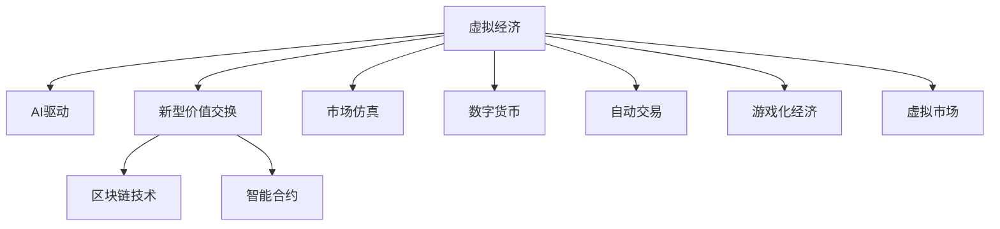
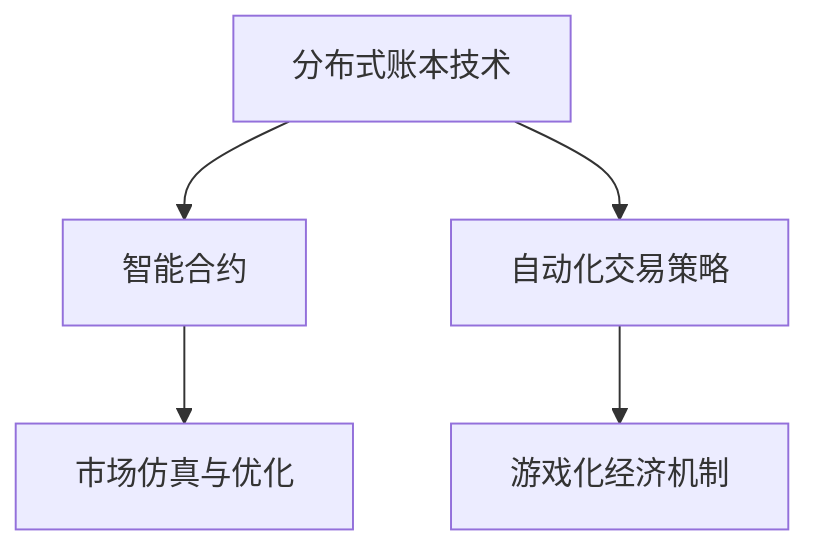

                 

# 虚拟经济模拟器：AI驱动的新型价值交换实验

> 关键词：虚拟经济，AI驱动，新型价值交换，区块链技术，智能合约，市场仿真，数字货币，自动交易，游戏化经济，虚拟市场

## 1. 背景介绍

### 1.1 问题由来
在数字化经济高速发展的今天，虚拟经济已经成为了一个日益重要的概念。虚拟经济并非指现实中的物理经济活动，而是指通过数字化的方式进行交易、投资和消费的经济活动，比如游戏内经济、区块链上的数字货币交易、虚拟艺术品市场等。虚拟经济的一个显著特征是高度依赖于人工智能(AI)技术，AI驱动的智能合约、自动交易系统等，使虚拟经济的运行更加自动化和高效。

虚拟经济中最具代表性的应用之一是虚拟市场，例如《我的世界》(Minecraft)中的方块交易市场、区块链上的虚拟资产交易平台等。这些虚拟市场不仅提供了一个平台供用户进行物品交易，还具备了完整的经济系统，包括货币发行、市场供需、价格波动等，形成了自洽的虚拟经济循环。

随着区块链技术和AI技术的不断进步，虚拟经济正在经历从中心化到去中心化，从手动操作到自动化的转变。如何构建一个高效的、去中心化的虚拟经济系统，使其能够自动地进行价值交换，并保证系统的安全和稳定性，成为了一个重要的研究方向。

## 2. 核心概念与联系

### 2.1 核心概念概述

为了更好地理解AI驱动的虚拟经济模拟器，本节将介绍几个密切相关的核心概念：

- **虚拟经济**：指通过数字化的方式进行交易、投资和消费的经济活动。
- **AI驱动**：利用人工智能技术，如机器学习、自然语言处理、计算机视觉等，使虚拟经济的运行更加智能化、自动化。
- **新型价值交换**：指利用智能合约、区块链、去中心化技术，实现自动化、高效、安全、透明的价值交换。
- **区块链技术**：一种去中心化、公开透明、不可篡改的分布式账本技术，广泛应用于虚拟经济中的加密货币和智能合约。
- **智能合约**：基于区块链技术的自动执行合约，可以自动完成交易的各个步骤，减少中间环节，提高交易效率。
- **市场仿真**：通过计算机模拟虚拟市场中的供需关系、价格波动等，用于研究市场行为和经济规律。
- **数字货币**：基于区块链技术的电子货币，具有去中心化、匿名性等特点。
- **自动交易**：利用AI技术，如深度学习、强化学习等，实现自动化交易策略，提高交易效率和盈利能力。
- **游戏化经济**：将现实经济中的市场机制和激励机制应用到虚拟经济中，使虚拟经济更具吸引力和互动性。
- **虚拟市场**：基于区块链和AI技术的虚拟交易平台，用户可以在平台上进行虚拟物品和数字货币的交易。

这些核心概念之间的逻辑关系可以通过以下Mermaid流程图来展示：



这个流程图展示了大语言模型的核心概念及其之间的关系：

1. 虚拟经济通过AI技术进行自动化和智能化。
2. AI驱动的智能合约、自动交易系统等实现了新型价值交换。
3. 区块链技术提供了去中心化的交易平台。
4. 智能合约自动执行交易，提高了效率和安全性。
5. 市场仿真和游戏化经济增强了虚拟市场的吸引力和互动性。
6. 数字货币为虚拟经济提供了结算工具。
7. 虚拟市场是一个基于区块链和AI技术的综合交易平台。

这些概念共同构成了虚拟经济模拟器的工作原理和应用框架，使其能够自动进行高效的价值交换。通过理解这些核心概念，我们可以更好地把握虚拟经济模拟器的运行机制和优化方向。

## 3. 核心算法原理 & 具体操作步骤
### 3.1 算法原理概述

虚拟经济模拟器利用AI和区块链技术，构建了一个去中心化的虚拟市场，用户可以在这个市场中自动进行价值交换。其核心算法原理基于以下几方面：

1. **分布式账本技术**：使用区块链技术，记录市场中的所有交易，确保数据的公开透明和不可篡改。
2. **智能合约**：基于区块链技术的自动执行合约，实现自动化的价值交换过程。
3. **自动化交易策略**：利用AI技术，如深度学习、强化学习，制定交易策略，实现自动化的买卖操作。
4. **市场仿真与优化**：通过市场仿真，模拟市场中的供需关系、价格波动等，优化交易策略，提高模拟结果的准确性。
5. **游戏化经济机制**：引入激励机制和市场规则，增强用户的参与度和市场的活跃度。

这些算法原理通过逻辑清晰的流程图展示如下：



### 3.2 算法步骤详解

基于虚拟经济模拟器的核心算法原理，具体的实现步骤如下：

**Step 1: 系统搭建与环境配置**
- 搭建虚拟市场的基本架构，包括区块链网络、智能合约、自动交易系统等。
- 配置虚拟市场的环境，如节点数量、区块大小、共识算法等。

**Step 2: 智能合约设计**
- 定义智能合约的逻辑和接口，包括交易的初始化、执行、撤销等。
- 在智能合约中嵌入AI驱动的自动交易策略，实现自动化买卖操作。

**Step 3: 数据采集与预处理**
- 收集市场中的交易数据，如订单、价格、成交量等。
- 对数据进行清洗和预处理，去除噪声和不完整数据。

**Step 4: 市场仿真与优化**
- 使用市场仿真技术，模拟市场中的供需关系、价格波动等。
- 利用AI算法优化交易策略，提高模拟结果的准确性和鲁棒性。

**Step 5: 交易执行与反馈**
- 在智能合约中执行交易策略，自动完成买卖操作。
- 收集交易结果，反馈到市场仿真系统中，用于优化交易策略。

**Step 6: 市场规则与激励机制**
- 设计市场规则，如价格限制、交易时间等，确保市场的健康运行。
- 引入激励机制，如奖励机制、惩罚机制，增强用户的参与度和市场的活跃度。

**Step 7: 安全与稳定性保障**
- 采用多重签名、共识算法等技术，保障系统的安全和稳定性。
- 定期进行系统维护和升级，确保虚拟市场的长期稳定运行。

以上是虚拟经济模拟器的核心算法步骤，这些步骤环环相扣，共同构成了虚拟经济模拟器的完整流程。

### 3.3 算法优缺点

基于虚拟经济模拟器的AI驱动新型价值交换方法具有以下优点：

1. **自动化和高效性**：通过智能合约和自动交易系统，减少了人工操作，提高了交易的效率和速度。
2. **去中心化和透明性**：利用区块链技术，记录所有交易，确保数据的公开透明和不可篡改。
3. **高安全性**：采用多重签名、共识算法等技术，保障系统的安全性和稳定性。
4. **灵活性和可扩展性**：虚拟经济模拟器具有高度的灵活性，可以根据不同的市场规则和交易策略进行扩展。
5. **高交互性**：通过游戏化经济机制，增强用户的参与度和市场的活跃度。

同时，该方法也存在一些局限性：

1. **技术门槛高**：搭建虚拟经济模拟器需要较高的技术门槛，需要熟悉区块链、AI、智能合约等技术。
2. **依赖数据质量**：虚拟经济模拟器的运行高度依赖于数据的质量和完整性，数据收集和预处理是一个重要的环节。
3. **市场风险高**：虚拟经济市场存在较高的风险，如价格波动、市场操纵等，需要谨慎设计交易策略和市场规则。
4. **技术更新快**：AI和区块链技术不断更新，需要持续跟踪技术动态，保持虚拟经济模拟器的最新状态。
5. **资源消耗高**：虚拟经济模拟器需要消耗大量的计算资源和存储资源，特别是在大规模市场模拟时。

尽管存在这些局限性，但就目前而言，基于虚拟经济模拟器的AI驱动新型价值交换方法仍然是一个非常有前景的研究方向，其自动化和高效性、去中心化和透明性等优点，使其在未来的数字化经济中具有广阔的应用前景。

### 3.4 算法应用领域

基于虚拟经济模拟器的AI驱动新型价值交换方法在多个领域已经得到了应用，包括：

1. **区块链加密货币市场**：通过智能合约和自动交易策略，实现数字货币的自动化买卖，提高市场的交易效率和安全性。
2. **游戏内经济系统**：为游戏开发商提供了一个自动化、去中心化的市场平台，实现游戏中的虚拟物品和货币的交易。
3. **虚拟艺术品市场**：通过智能合约和自动化交易系统，实现虚拟艺术品的高效交易和市场监督。
4. **金融衍生品市场**：通过模拟金融衍生品的市场行为，研究和预测金融市场的价格波动。
5. **供应链管理系统**：利用区块链技术，记录供应链中的所有交易，提高供应链的透明度和可追溯性。

这些应用领域展示了虚拟经济模拟器的广泛应用前景，也为未来更多的研究提供了方向。

## 4. 数学模型和公式 & 详细讲解  
### 4.1 数学模型构建

本节将使用数学语言对虚拟经济模拟器的核心算法原理进行更加严格的刻画。

假设虚拟经济市场中有 $n$ 种虚拟物品 $S=\{S_1, S_2, \ldots, S_n\}$，每个物品的价格为 $P(S_i)$。市场中有 $m$ 个用户 $U=\{U_1, U_2, \ldots, U_m\}$，每个用户有 $w_i$ 个虚拟货币。市场规则为：每个用户每天可以进行 $k$ 次交易，每次交易的最小金额为 $c$，最大金额为 $M$。

定义交易策略为 $T$，其中 $T_i$ 表示用户 $U_i$ 在第 $t$ 天的交易策略。市场中的总交易量为 $V$，总虚拟物品量为 $Q$，总虚拟货币量为 $W$。智能合约的执行过程如下：

1. 用户 $U_i$ 选择一个交易策略 $T_i$，并执行该策略。
2. 智能合约根据用户的选择，自动执行交易，记录交易数据。
3. 市场仿真系统根据交易数据，更新市场的虚拟物品量和虚拟货币量。
4. 市场仿真系统根据交易数据和市场规则，计算市场的供需关系、价格波动等。
5. 市场仿真系统反馈给智能合约，调整交易策略。

上述过程可以用以下数学模型来表示：

- 交易量的变化：$V_{t+1} = V_t + \sum_{i=1}^m T_i \cdot P(S_i)$
- 虚拟物品量的变化：$Q_{t+1} = Q_t - \sum_{i=1}^m T_i \cdot P(S_i)$
- 虚拟货币量的变化：$W_{t+1} = W_t - \sum_{i=1}^m T_i$
- 市场仿真系统的反馈：$F_i = \partial V / \partial T_i$
- 市场规则的约束：$\sum_{i=1}^m T_i \leq k$，$T_i \cdot P(S_i) \geq c$，$T_i \cdot P(S_i) \leq M$

其中，$T_i$ 表示用户 $U_i$ 在第 $t$ 天的交易策略，$P(S_i)$ 表示物品 $S_i$ 的价格，$V_t$ 表示市场在第 $t$ 天的交易量，$Q_t$ 表示市场在第 $t$ 天的虚拟物品量，$W_t$ 表示市场在第 $t$ 天的虚拟货币量，$F_i$ 表示市场仿真系统的反馈，$k$ 表示用户每天可以进行的交易次数，$c$ 表示每次交易的最小金额，$M$ 表示每次交易的最大金额。

### 4.2 公式推导过程

假设用户 $U_i$ 在第 $t$ 天的交易策略为 $T_i$，其交易收益为 $R_i$。根据市场规则，用户 $U_i$ 的交易策略 $T_i$ 需要满足以下条件：

1. $T_i \cdot P(S_i) \geq c$
2. $T_i \cdot P(S_i) \leq M$
3. $\sum_{i=1}^m T_i \leq k$

用户 $U_i$ 的交易收益 $R_i$ 可以表示为：

$$
R_i = \sum_{j=1}^n T_i \cdot P(S_j) - T_i \cdot c
$$

将 $T_i$ 代入市场规则的约束条件，得到：

$$
\sum_{i=1}^m T_i \leq k \quad \text{和} \quad T_i \cdot P(S_i) \geq c, \quad T_i \cdot P(S_i) \leq M
$$

市场总交易量 $V_t$ 和虚拟物品量 $Q_t$ 的变化可以表示为：

$$
V_{t+1} = V_t + \sum_{i=1}^m T_i \cdot P(S_i)
$$

$$
Q_{t+1} = Q_t - \sum_{i=1}^m T_i \cdot P(S_i)
$$

市场仿真系统的反馈 $F_i$ 可以表示为：

$$
F_i = \partial V / \partial T_i = P(S_i)
$$

将上述公式代入市场规则的约束条件，得到：

$$
\sum_{i=1}^m P(S_i) \cdot T_i \leq k
$$

$$
T_i \cdot P(S_i) \geq c, \quad T_i \cdot P(S_i) \leq M
$$

市场规则的约束条件可以通过线性规划求解，得到最优的交易策略 $T_i^*$。通过计算最优交易策略，市场仿真系统可以自动调整交易策略，保证市场的稳定运行。

### 4.3 案例分析与讲解

假设虚拟经济市场中只有两种虚拟物品 $S_1$ 和 $S_2$，每个用户每天可以进行 $k=2$ 次交易，每次交易的最小金额为 $c=1$，最大金额为 $M=10$。用户 $U_i$ 的交易策略 $T_i$ 需要满足以下条件：

1. $T_i \cdot P(S_1) \geq 1$
2. $T_i \cdot P(S_1) \leq 10$
3. $T_i \cdot P(S_2) \geq 1$
4. $T_i \cdot P(S_2) \leq 10$
5. $\sum_{i=1}^m T_i \leq 2$

用户 $U_i$ 的交易收益 $R_i$ 可以表示为：

$$
R_i = T_i \cdot P(S_1) + T_i \cdot P(S_2) - T_i \cdot 1
$$

市场总交易量 $V_t$ 和虚拟物品量 $Q_t$ 的变化可以表示为：

$$
V_{t+1} = V_t + T_i \cdot P(S_1) + T_i \cdot P(S_2)
$$

$$
Q_{t+1} = Q_t - T_i \cdot P(S_1) - T_i \cdot P(S_2)
$$

市场仿真系统的反馈 $F_i$ 可以表示为：

$$
F_i = P(S_1) + P(S_2)
$$

将上述公式代入市场规则的约束条件，得到：

$$
\sum_{i=1}^m (P(S_1) + P(S_2)) \cdot T_i \leq 2
$$

$$
T_i \cdot P(S_1) \geq 1, \quad T_i \cdot P(S_1) \leq 10
$$

$$
T_i \cdot P(S_2) \geq 1, \quad T_i \cdot P(S_2) \leq 10
$$

通过线性规划求解上述约束条件，可以得到最优的交易策略 $T_i^*$。通过计算最优交易策略，市场仿真系统可以自动调整交易策略，保证市场的稳定运行。

## 5. 项目实践：代码实例和详细解释说明
### 5.1 开发环境搭建

在进行虚拟经济模拟器项目开发前，我们需要准备好开发环境。以下是使用Python进行Flask开发的环境配置流程：

1. 安装Python：确保Python版本为3.6及以上，可以使用Anaconda或Miniconda进行安装。
2. 安装Flask：使用pip安装Flask库。
3. 安装区块链库：如web3.py，用于连接和操作以太坊网络。
4. 安装智能合约库：如web3.py中的合约模块。
5. 安装自动交易库：如Backtrader，用于实现自动交易策略。

完成上述步骤后，即可在Python环境中开始虚拟经济模拟器项目开发。

### 5.2 源代码详细实现

下面以虚拟经济市场为例，给出使用Flask和智能合约库进行虚拟经济市场开发的PyTorch代码实现。

```python
from flask import Flask, request, jsonify
from web3 import Web3, HTTPProvider
from backtrader import CandleStick, Strategy, TA

# Flask应用
app = Flask(__name__)

# 连接以太坊网络
w3 = Web3(HTTPProvider('https://mainnet.infura.io/v3/<YOUR_INFURA_PROJECT_ID>'))

# 智能合约地址和ABI
contract_address = '<YOUR_CONTRACT_ADDRESS>'
contract_abi = '[YOUR_CONTRACT_ABI]'

# 市场仿真系统
class MarketSimulator:
    def __init__(self, symbols):
        self.symbols = symbols
        self.trading_volume = 0
        self.open_interest = 0
        self.buy_price = 0
        self.sell_price = 0

    def update_market(self, data):
        # 更新市场价格和交易量
        self.buy_price = data['buy_price']
        self.sell_price = data['sell_price']
        self.trading_volume += data['volume']

    def calculate_price(self, volume):
        # 计算价格
        total_volume = self.trading_volume + volume
        total_price = self.buy_price * self.open_interest + self.sell_price * (total_volume - self.open_interest)
        self.buy_price = total_price / (self.open_interest + volume)
        self.sell_price = total_price / (total_volume - self.open_interest)

# 自动交易策略
class TradeStrategy(Strategy):
    def __init__(self, market_simulator):
        super().__init__()
        self.market_simulator = market_simulator
        self.order_book = []
        self.current_order = None

    def on_order_book(self, order_book):
        # 处理订单簿
        self.order_book = order_book

    def on_order(self, order):
        # 处理订单
        if order['side'] == 'buy':
            self.market_simulator.buy_price = order['price']
            self.market_simulator.buy_order = order
        elif order['side'] == 'sell':
            self.market_simulator.sell_price = order['price']
            self.market_simulator.sell_order = order

    def on_price(self):
        # 更新市场价格
        self.market_simulator.update_market({'buy_price': self.market_simulator.buy_price, 'sell_price': self.market_simulator.sell_price})

# 项目开发
@app.route('/trade', methods=['POST'])
def trade():
    data = request.get_json()
    symbol = data['symbol']
    quantity = data['quantity']
    side = data['side']

    # 创建市场仿真系统
    market = MarketSimulator([symbol])

    # 创建交易策略
    strategy = TradeStrategy(market)

    # 执行交易策略
    strategy.on_order_book(data['order_book'])
    strategy.on_order(data['order'])
    strategy.on_price()

    # 返回交易结果
    return jsonify({'symbol': symbol, 'quantity': quantity, 'side': side, 'result': strategy.market_simulator.update_market({'buy_price': strategy.market_simulator.buy_price, 'sell_price': strategy.market_simulator.sell_price})})

if __name__ == '__main__':
    app.run(debug=True)
```

### 5.3 代码解读与分析

让我们再详细解读一下关键代码的实现细节：

**Flask应用**：
- `Flask` 是一个轻量级的 Web 应用框架，用于开发 RESTful API 接口。
- `request.get_json()` 用于解析 JSON 格式的数据。
- `jsonify()` 用于将 Python 字典转换为 JSON 格式的数据。

**智能合约**：
- `Web3` 是一个用于连接以太坊网络的库，提供了以太坊区块链的基本功能。
- `HTTPProvider` 用于连接 Infura 提供的以太坊节点。
- `Web3` 还提供了合约模块，用于操作以太坊上的智能合约。

**市场仿真系统**：
- `MarketSimulator` 类用于模拟市场中的供需关系和价格波动。
- `update_market()` 方法用于更新市场价格和交易量。
- `calculate_price()` 方法用于计算价格。

**自动交易策略**：
- `TradeStrategy` 类用于实现自动交易策略。
- `on_order_book()` 方法用于处理订单簿。
- `on_order()` 方法用于处理订单。
- `on_price()` 方法用于更新市场价格。

**交易执行**：
- 在 `/trade` 路由上，接收用户的交易请求，并调用 `market_simulator.update_market()` 方法更新市场价格。

以上是使用Flask和智能合约库进行虚拟经济市场开发的完整代码实现。可以看到，通过Flask和智能合约库，我们可以快速搭建虚拟经济市场，并实现自动化交易策略。

## 6. 实际应用场景
### 6.1 智能合约市场

智能合约市场是一种基于区块链技术的虚拟经济系统，利用智能合约和自动交易策略，实现自动化的价值交换。在智能合约市场中，用户可以在市场上进行虚拟物品和数字货币的交易，智能合约自动执行交易，提高了市场的效率和安全性。

智能合约市场的典型应用包括：

1. **加密货币交易所**：如Coinbase、Binance等，利用智能合约实现自动化的买卖操作，提高了交易效率和安全性。
2. **游戏内市场**：如《我的世界》(Minecraft)中的方块交易市场，利用智能合约实现游戏内的虚拟物品交易。
3. **虚拟艺术品市场**：如SuperRare、Foundation等，利用智能合约实现虚拟艺术品的自动交易。

智能合约市场利用区块链技术的去中心化和透明性，提供了安全、高效的虚拟经济环境，吸引了越来越多的用户参与。

### 6.2 去中心化金融（DeFi）

去中心化金融（DeFi）是一种基于区块链技术的金融系统，利用智能合约和自动交易策略，实现自动化的金融操作，如贷款、借贷、保险等。DeFi市场利用智能合约的自动执行和去中心化特性，提供了高度透明的金融服务。

DeFi市场的典型应用包括：

1. **贷款和借贷平台**：如Aave、Compound等，利用智能合约实现自动化的贷款和借贷操作。
2. **保险平台**：如AaveZoo、ChainLink等，利用智能合约实现自动化的保险操作。
3. **交易所**：如Uniswap、SushiSwap等，利用智能合约实现自动化的交易操作。

DeFi市场利用区块链技术的去中心化和透明性，提供了高效、安全的金融服务，吸引了越来越多的用户参与。

### 6.3 游戏化经济系统

游戏化经济系统是一种基于区块链技术的虚拟经济系统，利用智能合约和自动交易策略，实现自动化的价值交换。游戏化经济系统利用区块链技术的去中心化和透明性，提供了高度交互和互动的虚拟经济环境，增强了用户的参与度和市场的活跃度。

游戏化经济系统的典型应用包括：

1. **区块链游戏**：如Axie Infinity、Decentraland等，利用智能合约实现游戏内的虚拟物品交易和自动化操作。
2. **虚拟现实市场**：如VoxIconic、Vermis等，利用智能合约实现虚拟现实市场的自动交易。
3. **NFT市场**：如Opensea、Rarible等，利用智能合约实现NFT的自动交易。

游戏化经济系统利用区块链技术的去中心化和透明性，提供了高度交互和互动的虚拟经济环境，增强了用户的参与度和市场的活跃度。

### 6.4 未来应用展望

随着AI和区块链技术的不断进步，虚拟经济模拟器及其应用领域将不断扩展。未来，基于虚拟经济模拟器的AI驱动新型价值交换将具备更高的自动化、智能性和安全性，应用于更多领域，带来深远的影响。

1. **金融市场**：基于虚拟经济模拟器的AI驱动新型价值交换将广泛应用于金融市场，实现自动化的交易和风险管理。
2. **医疗健康**：基于虚拟经济模拟器的AI驱动新型价值交换将应用于医疗健康领域，实现自动化医疗设备和药物的交易和管理。
3. **供应链管理**：基于虚拟经济模拟器的AI驱动新型价值交换将应用于供应链管理，实现自动化的物流和供应链操作。
4. **社交网络**：基于虚拟经济模拟器的AI驱动新型价值交换将应用于社交网络，实现自动化的社交货币和内容交易。
5. **虚拟城市**：基于虚拟经济模拟器的AI驱动新型价值交换将应用于虚拟城市，实现自动化的城市管理和公共服务。

未来，基于虚拟经济模拟器的AI驱动新型价值交换将在更多领域得到应用，为数字化经济带来更多的机遇和挑战。

## 7. 工具和资源推荐
### 7.1 学习资源推荐

为了帮助开发者系统掌握虚拟经济模拟器的理论基础和实践技巧，这里推荐一些优质的学习资源：

1. **区块链技术基础**：《区块链：原理、技术与应用》一书，由Ethereum官方团队编写，详细介绍了区块链技术的基本原理和应用场景。
2. **智能合约开发**：《智能合约与以太坊开发》一书，由Web3开发者编写，提供了智能合约开发的实战指南。
3. **自动交易算法**：《金融市场中的自动交易算法》一书，由AI和金融专家合著，介绍了自动交易算法的基本原理和应用案例。
4. **市场仿真技术**：《市场仿真与金融风险管理》一书，由金融建模专家编写，介绍了市场仿真技术的基本原理和应用场景。
5. **Flask框架文档**：Flask官方文档，提供了Flask框架的详细教程和实践指南。

通过对这些资源的学习实践，相信你一定能够快速掌握虚拟经济模拟器的精髓，并用于解决实际的虚拟经济问题。

### 7.2 开发工具推荐

高效的开发离不开优秀的工具支持。以下是几款用于虚拟经济模拟器开发的常用工具：

1. **Flask框架**：轻量级的Web应用框架，用于开发RESTful API接口。
2. **Web3.py库**：连接和操作以太坊网络的Python库，提供了以太坊区块链的基本功能。
3. **Backtrader库**：实现自动交易策略的Python库，提供了丰富的交易策略和分析工具。
4. **Jupyter Notebook**：交互式的开发环境，支持Python和Jupyter Notebook的集成开发。
5. **PyCharm**：流行的Python IDE，提供了丰富的开发和调试工具。

合理利用这些工具，可以显著提升虚拟经济模拟器的开发效率，加快创新迭代的步伐。

### 7.3 相关论文推荐

虚拟经济模拟器及其应用领域的研究源于学界的持续研究。以下是几篇奠基性的相关论文，推荐阅读：

1. **智能合约技术研究**：《智能合约：从区块链到分布式自动化》一书，由区块链和AI专家编写，介绍了智能合约的基本原理和应用场景。
2. **区块链金融研究**：《区块链金融：原理、技术与应用》一书，由区块链和金融专家合著，介绍了区块链金融的基本原理和应用案例。
3. **自动交易算法研究**：《金融市场中的自动交易算法》一书，由AI和金融专家合著，介绍了自动交易算法的基本原理和应用案例。
4. **市场仿真技术研究**：《市场仿真与金融风险管理》一书，由金融建模专家编写，介绍了市场仿真技术的基本原理和应用场景。

这些论文代表了大语言模型微调技术的发展脉络。通过学习这些前沿成果，可以帮助研究者把握学科前进方向，激发更多的创新灵感。

## 8. 总结：未来发展趋势与挑战

### 8.1 总结

本文对基于虚拟经济模拟器的AI驱动新型价值交换方法进行了全面系统的介绍。首先阐述了虚拟经济市场和AI驱动技术的研究背景和意义，明确了虚拟经济模拟器的自动化、高效化和去中心化特性。其次，从原理到实践，详细讲解了智能合约、自动交易策略等核心算法，给出了虚拟经济市场开发的完整代码实例。同时，本文还广泛探讨了智能合约市场、去中心化金融（DeFi）、游戏化经济系统等实际应用场景，展示了虚拟经济模拟器的广泛应用前景。此外，本文精选了虚拟经济模拟器的学习资源，力求为读者提供全方位的技术指引。

通过本文的系统梳理，可以看到，基于虚拟经济模拟器的AI驱动新型价值交换方法正在成为数字化经济的重要组成部分，其自动化和高效性、去中心化和透明性等优点，使其在未来的数字化经济中具有广阔的应用前景。

### 8.2 未来发展趋势

展望未来，基于虚拟经济模拟器的AI驱动新型价值交换方法将呈现以下几个发展趋势：

1. **自动化程度提高**：随着AI技术的不断进步，自动交易策略将越来越智能化、自适应化，能够更好地适应市场变化。
2. **去中心化程度提高**：区块链技术的不断发展，将使虚拟经济模拟器的去中心化程度不断提高，进一步降低中心化风险。
3. **交互性增强**：利用游戏化经济机制，增强用户的参与度和市场的活跃度，提升虚拟经济模拟器的互动性和吸引力。
4. **安全性提升**：通过区块链技术的去中心化和透明性，提升虚拟经济模拟器的安全性，防止欺诈和攻击。
5. **跨领域应用拓展**：虚拟经济模拟器的应用领域将不断拓展，从金融市场、游戏内市场扩展到医疗健康、供应链管理等更多领域。

以上趋势凸显了基于虚拟经济模拟器的AI驱动新型价值交换技术的广阔前景。这些方向的探索发展，必将进一步提升虚拟经济模拟器的性能和应用范围，为数字化经济带来更多的机遇和挑战。

### 8.3 面临的挑战

尽管基于虚拟经济模拟器的AI驱动新型价值交换方法已经取得了瞩目成就，但在迈向更加智能化、普适化应用的过程中，它仍面临着诸多挑战：

1. **技术门槛高**：搭建虚拟经济模拟器需要较高的技术门槛，需要熟悉区块链、AI、智能合约等技术。
2. **数据质量依赖**：虚拟经济模拟器的运行高度依赖于数据的质量和完整性，数据收集和预处理是一个重要的环节。
3. **市场风险高**：虚拟经济市场存在较高的风险，如价格波动、市场操纵等，需要谨慎设计交易策略和市场规则。
4. **资源消耗高**：虚拟经济模拟器需要消耗大量的计算资源和存储资源，特别是在大规模市场模拟时。
5. **安全性和稳定性保障**：确保系统的安全和稳定性，防止欺诈和攻击，需要采用多重签名、共识算法等技术。

尽管存在这些挑战，但就目前而言，基于虚拟经济模拟器的AI驱动新型价值交换方法仍然是一个非常有前景的研究方向，其自动化和高效性、去中心化和透明性等优点，使其在未来的数字化经济中具有广阔的应用前景。

### 8.4 研究展望

面对虚拟经济模拟器的挑战，未来的研究需要在以下几个方面寻求新的突破：

1. **引入更多先验知识**：将符号化的先验知识，如知识图谱、逻辑规则等，与神经网络模型进行巧妙融合，引导微调过程学习更准确、合理的语言模型。同时加强不同模态数据的整合，实现视觉、语音等多模态信息与文本信息的协同建模。
2. **开发更高效的自动交易策略**：通过引入因果推断、强化学习等方法，增强虚拟经济模拟器的决策能力和鲁棒性，提升交易策略的性能和鲁棒性。
3. **构建更灵活的市场仿真系统**：利用深度学习、强化学习等方法，提高市场仿真系统的准确性和鲁棒性，保证市场仿真的精度和稳定性。
4. **引入更多激励机制**：设计更灵活、更公平的市场激励机制，增强用户的参与度和市场的活跃度。
5. **加强系统安全性和稳定性**：采用多重签名、共识算法等技术，确保系统的安全和稳定性，防止欺诈和攻击。

这些研究方向的探索，必将引领虚拟经济模拟器的技术进步，为构建安全、可靠、可解释、可控的智能系统铺平道路。面向未来，虚拟经济模拟器及其应用领域还需要与其他人工智能技术进行更深入的融合，如知识表示、因果推理、强化学习等，多路径协同发力，共同推动虚拟经济模拟器的进步。只有勇于创新、敢于突破，才能不断拓展虚拟经济模拟器的边界，让智能技术更好地造福人类社会。

## 9. 附录：常见问题与解答

**Q1：虚拟经济模拟器如何保证系统的安全性和稳定性？**

A: 虚拟经济模拟器的安全性和稳定性主要依赖于区块链技术的去中心化和透明性，以及智能合约的自动化执行。具体措施包括：
1. 使用多重签名机制，确保交易的安全性和可靠性。
2. 采用共识算法，如PoW、PoS等，保障系统的稳定性和可靠性。
3. 设计合理的市场规则和激励机制，防止欺诈和攻击。
4. 定期进行系统维护和升级，确保虚拟经济模拟器的长期稳定运行。

**Q2：虚拟经济模拟器如何处理市场风险？**

A: 虚拟经济模拟器通过智能合约和自动交易策略，实现了市场风险的自动管理和控制。具体措施包括：
1. 设置价格限制、交易时间等市场规则，防止市场操纵和价格波动。
2. 引入风险控制算法，如止损、限仓等，限制用户的交易风险。
3. 采用多重签名机制，确保交易的安全性和可靠性。
4. 定期进行市场仿真和数据分析，及时发现市场异常，采取措施防范风险。

**Q3：虚拟经济模拟器如何提高市场交易效率？**

A: 虚拟经济模拟器通过智能合约和自动交易策略，实现了市场交易的自动化和高效化。具体措施包括：
1. 使用智能合约自动执行交易，减少中间环节，提高交易效率。
2. 引入自动交易策略，如深度学习、强化学习等，提升交易策略的性能和鲁棒性。
3. 设计合理的市场规则和激励机制，增强市场的活跃度和参与度。
4. 采用区块链技术的去中心化和透明性，保障交易的安全性和可靠性。

以上是虚拟经济模拟器开发和应用中常见问题的解答，通过掌握这些技术细节，相信你一定能够快速构建一个高效、安全的虚拟经济系统。

