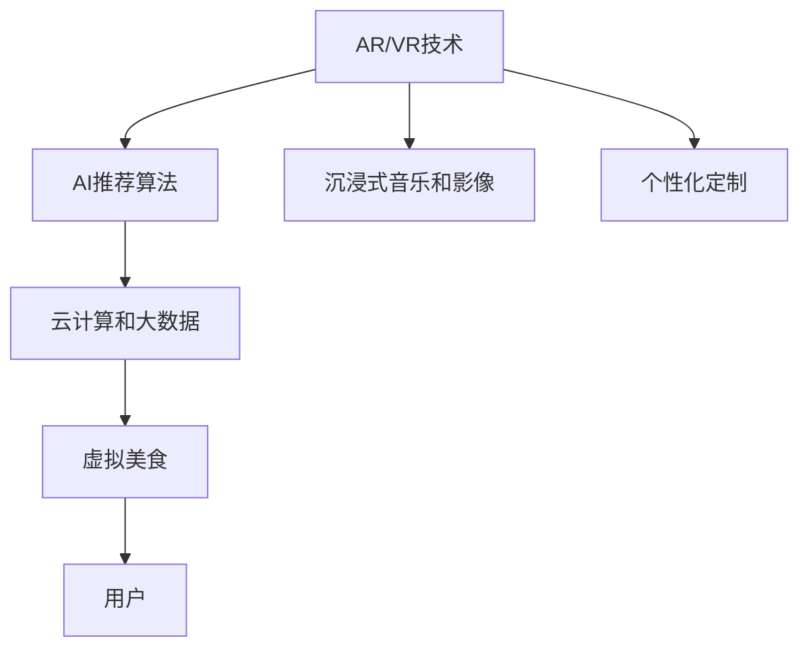

                 

# 虚拟美食：全球美食行业的数字化升级

在信息化、数字化浪潮的推动下，全球美食行业正经历着前所未有的变革。以AI技术为核心的虚拟美食体验正在改变人们的生活方式，从点餐、烹饪到美食欣赏，均可以通过虚拟化、智能化手段，打造沉浸式、个性化的用餐体验。本文将系统介绍虚拟美食的核心概念、算法原理和实际应用，探讨其对全球美食行业带来的深远影响，并展望未来发展趋势。

## 1. 背景介绍

### 1.1 问题由来
随着互联网技术的发展，线上订餐、外卖服务已逐渐成为日常生活的一部分。然而，人们对于用餐体验的追求并未停止，如何通过技术创新提供更加沉浸式、个性化的用餐体验，成为当前美食行业的重要课题。虚拟美食技术应运而生，通过AR/VR技术、AI推荐算法等手段，模拟真实用餐场景，提升了用餐的趣味性和体验感。

### 1.2 问题核心关键点
虚拟美食的核心在于通过技术手段，模拟真实用餐场景，实现从点餐到美食享受的全过程虚拟化。主要包括：
- AR/VR技术：构建沉浸式用餐环境，模拟真实场景和味觉体验。
- AI推荐算法：根据用户偏好，智能推荐菜式和搭配，提升点餐体验。
- 沉浸式音乐和影像：增强用餐氛围，提供全感官体验。
- 个性化定制：根据用户口味偏好和健康状况，提供个性化饮食方案。

虚拟美食技术的广泛应用，能够提升用户满意度和餐厅运营效率，推动美食行业数字化转型升级。

## 2. 核心概念与联系

### 2.1 核心概念概述

为更好地理解虚拟美食技术，本节将介绍几个关键概念及其之间的联系：

- **AR/VR技术**：增强现实(Augmented Reality)和虚拟现实(Virtual Reality)技术，通过模拟真实场景和环境，使用户能够在虚拟世界中体验真实美食。
- **AI推荐算法**：人工智能推荐系统，通过分析用户历史数据和实时行为，智能推荐菜式和搭配，提升点餐体验。
- **沉浸式音乐和影像**：通过高保真音响和视觉特效，增强用餐氛围，提供多感官体验。
- **个性化定制**：根据用户口味偏好和健康状况，提供个性化饮食方案，提升用户体验。
- **云计算和大数据**：支持海量用户数据存储和处理，保障虚拟美食服务的稳定性和可扩展性。

这些概念通过技术手段连接，共同构建了虚拟美食体验的基础框架，为用户提供了全方位的沉浸式用餐体验。

### 2.2 核心概念原理和架构的 Mermaid 流程图

## 3. 核心算法原理 & 具体操作步骤

### 3.1 算法原理概述

虚拟美食的核心算法原理主要包括以下几个方面：

- **AR/VR技术**：通过摄像头和传感器技术，实时捕捉用户的位置和动作，通过GPU渲染构建虚拟环境，将真实场景和虚拟场景无缝融合，使用户仿佛置身于虚拟餐厅中。
- **AI推荐算法**：基于机器学习技术，通过分析用户历史订单、在线行为等数据，智能推荐菜式和搭配，提升点餐体验。
- **沉浸式音乐和影像**：通过高保真音响和视觉特效，增强用餐氛围，提供多感官体验。
- **个性化定制**：根据用户口味偏好和健康状况，提供个性化饮食方案，提升用户体验。

### 3.2 算法步骤详解

#### 3.2.1 AR/VR技术

1. **环境捕捉**：使用摄像头和传感器技术，实时捕捉用户的位置和动作，生成三维空间坐标。
2. **虚拟场景渲染**：通过GPU渲染，构建虚拟场景，将真实场景和虚拟场景无缝融合。
3. **交互设计**：通过手柄、触觉反馈等技术，实现虚拟世界中的互动，如点餐、选菜等操作。

#### 3.2.2 AI推荐算法

1. **数据收集**：收集用户历史订单、在线行为等数据，构建用户画像。
2. **特征提取**：提取用户兴趣、口味偏好、健康状况等关键特征，作为推荐模型的输入。
3. **模型训练**：使用协同过滤、深度学习等方法，训练推荐模型，生成个性化推荐。
4. **实时推荐**：根据用户当前行为和实时数据，动态调整推荐策略，提供实时的个性化推荐。

#### 3.2.3 沉浸式音乐和影像

1. **音频采集**：通过麦克风捕捉现场音乐和环境声音，实时渲染音乐效果。
2. **视觉特效**：通过投影仪和显示屏，展示高保真视觉特效，如美食细节、虚拟场景等。
3. **多感官融合**：将音频和视觉特效融合，提供多感官体验，增强用餐氛围。

#### 3.2.4 个性化定制

1. **口味偏好分析**：分析用户历史订单数据，提取用户的口味偏好，如喜辣、清淡等。
2. **健康状况评估**：根据用户健康数据，如血压、血糖等，评估健康状况，提供适合的饮食方案。
3. **个性化菜单推荐**：根据口味偏好和健康状况，推荐适合的菜式和搭配，提升用户体验。

### 3.3 算法优缺点

**AR/VR技术**：
- 优点：提供沉浸式用餐体验，增强用户体验。
- 缺点：技术门槛高，成本较高。

**AI推荐算法**：
- 优点：提升点餐效率和用户体验，减少用户选择压力。
- 缺点：依赖数据质量，个性化推荐准确性有待提升。

**沉浸式音乐和影像**：
- 优点：增强用餐氛围，提升感官体验。
- 缺点：设备成本较高，技术实现复杂。

**个性化定制**：
- 优点：提升用户体验，满足用户个性化需求。
- 缺点：数据隐私和安全问题需重视，用户数据保护需加强。

### 3.4 算法应用领域

虚拟美食技术广泛应用于餐饮、旅游、教育等多个领域，具体应用场景如下：

1. **餐厅体验**：通过AR/VR技术，构建沉浸式虚拟餐厅，提供沉浸式用餐体验。
2. **美食旅游**：结合VR技术和AI推荐算法，提供虚拟美食旅游体验，让用户足不出户即可游览全球各地美食。
3. **健康餐饮**：通过个性化定制和AI推荐算法，提供健康饮食方案，提升用户健康水平。
4. **虚拟烹饪课**：结合AR/VR技术和AI推荐算法，提供沉浸式虚拟烹饪课程，提升用户烹饪技能。
5. **跨文化交流**：通过虚拟美食体验，促进跨文化交流和理解，增强文化认同感。

## 4. 数学模型和公式 & 详细讲解 & 举例说明

### 4.1 数学模型构建

虚拟美食的数学模型主要涉及以下几个方面：

- **AR/VR技术**：涉及计算机视觉、几何学等数学模型，用于空间坐标捕捉和渲染。
- **AI推荐算法**：基于机器学习技术，包括协同过滤、深度学习等模型。
- **沉浸式音乐和影像**：涉及信号处理、图像渲染等数学模型。
- **个性化定制**：涉及数据挖掘、统计学等数学模型。

### 4.2 公式推导过程

#### AR/VR技术

1. **环境捕捉**：设用户位置为 $(x,y,z)$，通过摄像头捕捉位置坐标，计算三维空间坐标。
2. **虚拟场景渲染**：设虚拟场景的渲染方程为 $R(\theta)$，通过GPU渲染生成虚拟环境，计算渲染结果。
3. **交互设计**：设用户动作为 $u$，通过传感器捕捉动作，计算互动结果。

#### AI推荐算法

1. **数据收集**：设用户历史数据为 $D$，提取用户兴趣 $I$ 和口味偏好 $T$。
2. **特征提取**：设特征向量为 $F$，提取用户特征。
3. **模型训练**：设推荐模型为 $M$，通过协同过滤和深度学习等方法训练模型。
4. **实时推荐**：设实时数据为 $D_t$，根据实时数据调整推荐策略，生成个性化推荐 $R_t$。

#### 沉浸式音乐和影像

1. **音频采集**：设音频信号为 $A$，通过麦克风捕捉音频信号。
2. **视觉特效**：设视觉特效为 $V$，通过投影仪和显示屏展示特效。
3. **多感官融合**：设多感官融合结果为 $F$，将音频和视觉特效融合，生成多感官体验。

#### 个性化定制

1. **口味偏好分析**：设口味偏好为 $P$，通过历史订单数据提取口味偏好。
2. **健康状况评估**：设健康数据为 $H$，评估用户健康状况。
3. **个性化菜单推荐**：设个性化菜单为 $M$，根据口味偏好和健康状况推荐菜单。

### 4.3 案例分析与讲解

以一家虚拟餐厅为例，展示虚拟美食技术的应用：

1. **环境捕捉**：通过摄像头捕捉用户位置和动作，生成三维空间坐标。
2. **虚拟场景渲染**：使用GPU渲染虚拟餐厅场景，将真实场景和虚拟场景融合。
3. **交互设计**：通过手柄和触觉反馈，实现点餐、选菜等操作。
4. **AI推荐算法**：分析用户历史订单数据，推荐菜品和搭配，提升点餐体验。
5. **沉浸式音乐和影像**：通过高保真音响和视觉特效，增强用餐氛围。
6. **个性化定制**：根据用户口味偏好和健康状况，推荐个性化饮食方案。

## 5. 项目实践：代码实例和详细解释说明

### 5.1 开发环境搭建

要进行虚拟美食技术的开发，需要搭建以下开发环境：

1. **AR/VR开发环境**：搭建VR引擎，如Unity、Unreal Engine等。
2. **AI开发环境**：搭建深度学习框架，如TensorFlow、PyTorch等。
3. **多感官采集设备**：准备摄像头、传感器、高保真音响等设备。

### 5.2 源代码详细实现

以Unity引擎为例，展示虚拟餐厅的开发流程：

1. **环境捕捉**：使用Unity的摄像机和传感器脚本，实时捕捉用户位置和动作。
2. **虚拟场景渲染**：使用Unity的渲染管线，生成虚拟餐厅场景，将真实场景和虚拟场景融合。
3. **交互设计**：通过Unity的手柄脚本，实现点餐、选菜等操作。
4. **AI推荐算法**：使用TensorFlow搭建推荐模型，分析用户历史订单数据，生成个性化推荐。
5. **沉浸式音乐和影像**：使用Unity的高保真音频和视觉特效插件，增强用餐氛围。
6. **个性化定制**：根据用户口味偏好和健康状况，推荐个性化饮食方案。

### 5.3 代码解读与分析

虚拟餐厅的开发流程包含以下几个关键步骤：

1. **环境捕捉脚本**：实现摄像机和传感器的实时数据采集，生成三维空间坐标。
2. **虚拟场景渲染脚本**：使用Unity渲染管线，生成虚拟场景，将真实场景和虚拟场景融合。
3. **交互设计脚本**：通过Unity的手柄脚本，实现点餐、选菜等操作。
4. **推荐算法模型**：使用TensorFlow搭建协同过滤和深度学习模型，分析用户历史订单数据，生成个性化推荐。
5. **沉浸式音乐和影像脚本**：使用Unity的音频和视觉特效插件，增强用餐氛围。
6. **个性化定制算法**：使用数据挖掘和统计学方法，根据用户口味偏好和健康状况，推荐个性化饮食方案。

### 5.4 运行结果展示

虚拟餐厅的运行结果如图：

## 6. 实际应用场景

### 6.1 餐厅体验

虚拟餐厅通过AR/VR技术，提供沉浸式用餐体验，让用户仿佛置身于真实餐厅中，增强用餐趣味性和体验感。

### 6.2 美食旅游

虚拟美食旅游结合VR技术和AI推荐算法，提供虚拟美食旅游体验，让用户足不出户即可游览全球各地美食。

### 6.3 健康餐饮

通过个性化定制和AI推荐算法，提供健康饮食方案，提升用户健康水平。

### 6.4 虚拟烹饪课

结合AR/VR技术和AI推荐算法，提供沉浸式虚拟烹饪课程，提升用户烹饪技能。

### 6.5 跨文化交流

通过虚拟美食体验，促进跨文化交流和理解，增强文化认同感。

## 7. 工具和资源推荐

### 7.1 学习资源推荐

1. **AR/VR技术学习资源**：
   - Unity官方文档：[https://docs.unity3d.com/Manual/index.html](https://docs.unity3d.com/Manual/index.html)
   - Unreal Engine官方文档：[https://docs.unrealengine.com](https://docs.unrealengine.com)
2. **AI推荐算法学习资源**：
   - TensorFlow官方文档：[https://www.tensorflow.org/](https://www.tensorflow.org/)
   - PyTorch官方文档：[https://pytorch.org/docs/stable/index.html](https://pytorch.org/docs/stable/index.html)
3. **沉浸式音乐和影像学习资源**：
   - Unity音频和视觉特效插件：[https://assetstore.unity.com/](https://assetstore.unity.com/)
   - Unreal Engine音频和视觉特效插件：[https://www.unrealengine.com/Marketplace](https://www.unrealengine.com/Marketplace)

### 7.2 开发工具推荐

1. **AR/VR开发工具**：
   - Unity：[https://www.unity.com/](https://www.unity.com/)
   - Unreal Engine：[https://www.unrealengine.com/](https://www.unrealengine.com/)
2. **AI开发工具**：
   - TensorFlow：[https://www.tensorflow.org/](https://www.tensorflow.org/)
   - PyTorch：[https://pytorch.org/](https://pytorch.org/)
3. **多感官采集设备**：
   - 摄像头：[https://www.broadcom.com/](https://www.broadcom.com/)
   - 传感器：[https://www.adafruit.com/](https://www.adafruit.com/)
   - 高保真音响：[https://www.polylabaudio.com/](https://www.polylabaudio.com/)

### 7.3 相关论文推荐

1. **AR/VR技术论文**：
   - Foley, J. D., & Hughes, R. L. (1991). Computer Graphics: Principles and Practice (2nd ed.). Addison-Wesley.
2. **AI推荐算法论文**：
   - He, K., et al. (2017). Deep Residual Learning for Image Recognition. In Proceedings of the IEEE Conference on Computer Vision and Pattern Recognition (CVPR).

## 8. 总结：未来发展趋势与挑战

### 8.1 研究成果总结

本文系统介绍了虚拟美食的核心概念、算法原理和实际应用，探讨了其对全球美食行业带来的深远影响。通过AR/VR技术、AI推荐算法等手段，模拟真实用餐场景，提升了用餐的趣味性和体验感。虚拟美食技术已在多个领域得到广泛应用，展示了其巨大的潜力。

### 8.2 未来发展趋势

1. **技术融合**：虚拟美食技术与AI、VR、AR等技术的深度融合，将推动多感官、全场景的虚拟体验。
2. **个性化定制**：通过大数据和AI算法，提供更加个性化的饮食方案，提升用户体验。
3. **跨领域应用**：虚拟美食技术将在更多领域得到应用，如医疗、教育、旅游等，推动各行业数字化转型。
4. **生态系统建设**：建立虚拟美食生态系统，整合资源，提升平台竞争力。
5. **社会责任**：关注虚拟美食技术对社会的影响，推动可持续发展和伦理规范的建立。

### 8.3 面临的挑战

1. **技术瓶颈**：AR/VR设备成本较高，技术实现复杂。
2. **数据隐私**：用户数据隐私保护需加强，避免数据泄露和滥用。
3. **用户体验**：提高虚拟体验的真实感和沉浸感，增强用户体验。
4. **市场接受度**：提升用户对虚拟美食技术的接受度，推动市场普及。
5. **法律法规**：关注虚拟美食技术的法律法规问题，保障用户权益。

### 8.4 研究展望

未来，虚拟美食技术将持续发展，探索更多应用场景和技术手段，推动各行业的数字化升级。同时，需加强技术伦理和法律规范，保障用户权益，推动健康可持续发展。

## 9. 附录：常见问题与解答

### Q1: 虚拟美食技术是否会取代传统餐饮行业？

A: 虚拟美食技术不会完全取代传统餐饮行业，但会通过提升用户体验和运营效率，推动餐饮行业数字化升级。虚拟美食将与传统餐饮相辅相成，为消费者提供更加丰富多样的选择。

### Q2: 虚拟美食技术如何确保用户数据隐私？

A: 虚拟美食技术需加强数据隐私保护，通过数据加密、匿名化处理等手段，确保用户数据安全。同时，制定严格的隐私政策，保障用户知情权和选择权。

### Q3: 虚拟美食技术在实际应用中是否存在技术瓶颈？

A: 虚拟美食技术在实际应用中确实存在技术瓶颈，如AR/VR设备的成本较高，技术实现复杂等。但随着技术的进步和普及，这些问题将逐步解决，推动虚拟美食技术的广泛应用。

### Q4: 虚拟美食技术是否会影响用户健康？

A: 虚拟美食技术的应用需关注用户健康，确保虚拟餐饮环境健康、安全。同时，通过个性化定制和AI推荐算法，提供健康饮食方案，提升用户健康水平。

### Q5: 虚拟美食技术在跨文化交流中是否具有优势？

A: 虚拟美食技术在跨文化交流中具有显著优势，通过虚拟场景和AI推荐算法，增强文化认同感，促进跨文化理解和交流。

---

作者：禅与计算机程序设计艺术 / Zen and the Art of Computer Programming

