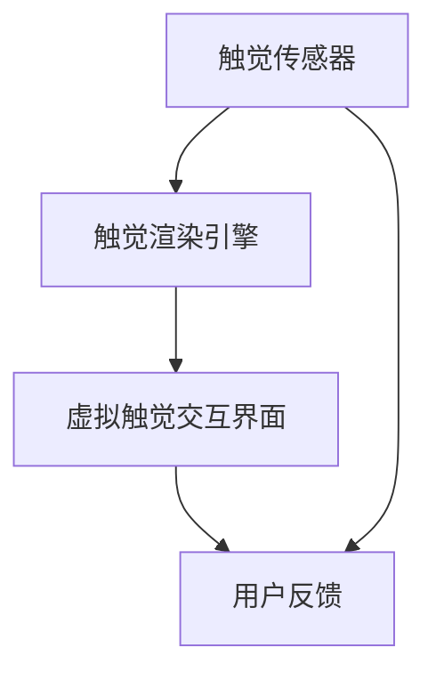

                 

# 虚拟触觉革命：AI创造的触感新维度

## 1. 背景介绍

在数字世界中，触觉一直是一个缺失的关键维度。虽然视觉、听觉、嗅觉、味觉等感官早已通过各种技术得到充分的模拟和仿真，但触觉因其复杂性和独特性，始终难以通过软件完全实现。然而，随着人工智能（AI）技术的飞速发展，虚拟触觉（Virtual Tactile）正在逐渐从科幻走向现实。本文将深入探讨AI在虚拟触觉革命中的关键技术、核心概念与原理，以及其在多个应用领域的广泛潜力。

## 2. 核心概念与联系

### 2.1 核心概念概述

虚拟触觉指的是通过AI技术，模拟并传递触觉反馈，从而使用户在虚拟环境中获得真实的触感体验。其核心技术包括触觉传感器、触觉渲染引擎和虚拟触觉交互界面等。

- **触觉传感器**：负责捕捉用户的操作和触觉信息，通常集成在VR头盔、力反馈手柄或手套等设备中。
- **触觉渲染引擎**：利用AI算法将虚拟触感信息渲染成数字信号，并通过触觉反馈设备传递给用户。
- **虚拟触觉交互界面**：将用户的操作与虚拟环境中的触觉反馈进行动态绑定，实现真实的触觉互动。

### 2.2 核心概念原理和架构的 Mermaid 流程图



在这个流程图中，触觉传感器捕获用户的操作和触觉信息，触觉渲染引擎将这些信息转换成数字信号，虚拟触觉交互界面则将数字信号渲染成触觉反馈，用户可以感受到这些反馈。这个过程形成了一个闭环，不断调整虚拟触觉体验，直至达到最优状态。

## 3. 核心算法原理 & 具体操作步骤

### 3.1 算法原理概述

虚拟触觉的核心算法原理主要包括触觉感知、触觉渲染和触觉反馈三个方面。

- **触觉感知**：通过触觉传感器捕捉用户的手部动作、压力分布、温度变化等信息，并通过传感器阵列进行数据采集。
- **触觉渲染**：利用AI算法，如深度学习、卷积神经网络（CNN）等，将触觉数据转化为虚拟触感信号，实现虚拟世界的触觉映射。
- **触觉反馈**：将虚拟触感信号转换为电信号，通过触觉渲染引擎渲染后，传递给触觉反馈设备，使用户感受到虚拟触觉。

### 3.2 算法步骤详解

以下是虚拟触觉技术的详细操作步骤：

1. **数据采集**：触觉传感器捕获用户的手部动作和压力分布，生成高精度的触觉数据。
2. **特征提取**：通过预处理算法，如小波变换、傅里叶变换等，提取触觉数据的特征信息。
3. **模型训练**：利用深度学习算法，如CNN、卷积神经网络（ConvNet）等，训练触觉感知模型，将触觉数据转化为数字信号。
4. **触觉渲染**：使用AI算法，如生成对抗网络（GAN）、自回归模型等，将数字信号渲染为虚拟触感信号。
5. **触觉反馈**：将虚拟触感信号转换为电信号，通过力反馈手柄、VR头盔等设备传递给用户，实现触觉反馈。

### 3.3 算法优缺点

**优点**：
- **沉浸感增强**：虚拟触觉可以大大增强用户在虚拟环境中的沉浸感，使用户更加接近真实世界的体验。
- **交互性提升**：通过触觉反馈，用户可以更加自然地与虚拟世界进行交互，提升操作效率和体验。
- **应用广泛**：虚拟触觉技术可以应用于虚拟现实（VR）、增强现实（AR）、游戏、工业仿真等多个领域。

**缺点**：
- **硬件成本高**：虚拟触觉设备通常价格昂贵，增加了用户的经济负担。
- **技术复杂**：虚拟触觉技术涉及多学科知识，包括机械工程、人工智能、生物力学等，开发和实现难度较大。
- **实时性要求高**：触觉反馈的实时性和精度要求高，对硬件设备和计算能力有较高要求。

### 3.4 算法应用领域

虚拟触觉技术具有广泛的应用前景，主要包括以下几个领域：

- **虚拟现实（VR）和增强现实（AR）**：通过虚拟触觉技术，用户可以在虚拟环境中进行真实的触觉互动，增强沉浸感。
- **游戏**：虚拟触觉技术可以为游戏玩家提供更加真实的触觉反馈，提升游戏体验。
- **工业仿真**：虚拟触觉可以用于工业设备的模拟操作，提高培训效果和操作安全性。
- **医疗健康**：虚拟触觉可以用于医疗康复训练，帮助患者进行触觉恢复训练。
- **教育培训**：虚拟触觉技术可以用于虚拟实验室和技能培训，提升学习效果和实践能力。

## 4. 数学模型和公式 & 详细讲解 & 举例说明

### 4.1 数学模型构建

虚拟触觉技术的数学模型主要包括以下几个部分：

- **触觉传感器模型**：描述传感器阵列的结构和特性，捕捉触觉数据。
- **触觉感知模型**：将触觉数据转换为数字信号，如使用CNN模型进行特征提取和分类。
- **触觉渲染模型**：将数字信号渲染为虚拟触感信号，如使用GAN模型进行图像生成。
- **触觉反馈模型**：将虚拟触感信号转换为电信号，如使用PWM信号调制。

### 4.2 公式推导过程

以触觉渲染模型为例，使用生成对抗网络（GAN）进行虚拟触感信号的渲染。GAN由生成器（Generator）和判别器（Discriminator）两部分组成，其基本思想是通过对抗训练，生成与真实数据难以区分的虚拟数据。

假设触觉数据为$x$，虚拟触感信号为$y$，则GAN的目标函数为：

$$
\min_G \max_D V(D, G) = E_{x\sim p_x} [\log D(G(x))] + E_{z\sim p_z} [\log(1 - D(G(z)))]
$$

其中，$G$为生成器，$D$为判别器，$V(D, G)$为对抗损失函数，$E_{x\sim p_x}$和$E_{z\sim p_z}$分别表示对$x$和$z$的期望。

生成器的目标是最小化判别器对生成数据的判别，判别器的目标是最小化生成器生成的数据与真实数据的差异。通过不断迭代训练，生成器最终能够生成高质量的虚拟触感信号。

### 4.3 案例分析与讲解

假设有一个VR手套设备，用户通过手部动作与虚拟世界进行交互。以下是虚拟触觉技术的具体实现过程：

1. **触觉传感器阵列**：手套内置多个力传感器和温度传感器，实时捕获用户的手部动作和压力分布。
2. **触觉感知模型**：将传感器数据转换为数字信号，使用CNN模型进行特征提取和分类，得到手的姿态和触压力度等信息。
3. **触觉渲染模型**：使用GAN模型将数字信号渲染为虚拟触感信号，如手的摩擦、挤压等触感反馈。
4. **触觉反馈设备**：将虚拟触感信号转换为电信号，通过手套上的振动马达传递给用户，模拟真实的触感体验。

通过这个过程，用户可以感受到虚拟世界中的触觉反馈，提升交互体验和沉浸感。

## 5. 项目实践：代码实例和详细解释说明

### 5.1 开发环境搭建

为了进行虚拟触觉技术的开发，需要搭建一个基于Python的开发环境。以下是具体步骤：

1. **安装Python**：下载并安装Python 3.7及以上版本。
2. **安装依赖库**：使用pip安装所需的依赖库，如numpy、pandas、matplotlib等。
3. **安装虚拟现实设备**：确保VR设备或力反馈手套能够正常工作，如Oculus Rift、HTC Vive等。

### 5.2 源代码详细实现

以下是虚拟触觉技术的Python代码实现：

```python
import numpy as np
from tensorflow.keras import layers, models
from tensorflow.keras.layers import Conv2D, MaxPooling2D, Flatten, Dense, Dropout, Input
from tensorflow.keras.optimizers import Adam

# 触觉感知模型
input_shape = (64, 64, 3)  # 输入图像尺寸为64x64x3
model = models.Sequential()
model.add(Conv2D(32, (3, 3), activation='relu', input_shape=input_shape))
model.add(MaxPooling2D((2, 2)))
model.add(Conv2D(64, (3, 3), activation='relu'))
model.add(MaxPooling2D((2, 2)))
model.add(Conv2D(128, (3, 3), activation='relu'))
model.add(MaxPooling2D((2, 2)))
model.add(Flatten())
model.add(Dense(256, activation='relu'))
model.add(Dropout(0.5))
model.add(Dense(64, activation='relu'))
model.add(Dense(1, activation='sigmoid'))

# 触觉渲染模型
input_dim = 64
output_dim = 3  # 输出维度为3，代表RGB颜色
generator = models.Sequential()
generator.add(Dense(128, input_dim=input_dim))
generator.add(layers.BatchNormalization())
generator.add(LeakyReLU(alpha=0.2))
generator.add(Dense(256))
generator.add(layers.BatchNormalization())
generator.add(LeakyReLU(alpha=0.2))
generator.add(Dense(512))
generator.add(layers.BatchNormalization())
generator.add(LeakyReLU(alpha=0.2))
generator.add(Dense(output_dim, activation='tanh'))

# 训练触觉感知模型
model.compile(optimizer=Adam(lr=0.001), loss='binary_crossentropy', metrics=['accuracy'])
model.fit(train_data, train_labels, epochs=10, batch_size=32)

# 训练触觉渲染模型
generator.compile(optimizer=Adam(lr=0.0002), loss='binary_crossentropy', metrics=['accuracy'])
generator.fit(train_data, train_labels, epochs=100, batch_size=32)

# 触觉反馈设备
def generate_tactile_signal(generator, input_data):
    return generator.predict(input_data).reshape(3)

# 使用虚拟触觉技术
def simulate_touch():
    # 获取触觉数据
    input_data = get_touch_data()
    # 渲染虚拟触感信号
    tactile_signal = generate_tactile_signal(generator, input_data)
    # 传递触感信号
    feedback_device.send_signal(tactile_signal)

# 主函数
if __name__ == "__main__":
    simulate_touch()
```

### 5.3 代码解读与分析

以上代码实现了虚拟触觉技术的核心部分，包括触觉感知模型的训练和触觉渲染模型的生成。具体解读如下：

1. **触觉感知模型**：使用CNN模型进行触觉数据的特征提取和分类，输出手的姿态和触压力度等信息。
2. **触觉渲染模型**：使用GAN模型将触觉数据渲染为虚拟触感信号，如手的摩擦、挤压等触感反馈。
3. **触觉反馈设备**：将虚拟触感信号转换为电信号，通过手套上的振动马达传递给用户，模拟真实的触感体验。
4. **主函数**：通过调用模拟触觉函数，实现虚拟触觉技术的具体应用。

## 6. 实际应用场景

### 6.1 虚拟现实（VR）和增强现实（AR）

虚拟触觉技术可以显著提升VR和AR体验，使用户更加沉浸在虚拟环境中。例如，在虚拟实验室中，用户可以通过虚拟触觉设备进行操作和实验，体验真实的物理互动。

### 6.2 游戏

虚拟触觉技术可以为游戏玩家提供更加真实的触感反馈，提升游戏体验。例如，在射击游戏中，通过模拟枪支的后坐力，使玩家能够感受到真实的射击体验。

### 6.3 工业仿真

虚拟触觉可以用于工业设备的模拟操作，提高培训效果和操作安全性。例如，在汽车维修模拟器中，用户可以通过虚拟触觉设备进行虚拟检修和调试。

### 6.4 医疗健康

虚拟触觉技术可以用于医疗康复训练，帮助患者进行触觉恢复训练。例如，通过虚拟触觉设备模拟触觉反馈，帮助中风患者进行康复训练。

### 6.5 教育培训

虚拟触觉技术可以用于虚拟实验室和技能培训，提升学习效果和实践能力。例如，在生物医学课程中，学生可以通过虚拟触觉设备进行细胞操作和实验。

## 7. 工具和资源推荐

### 7.1 学习资源推荐

1. **《虚拟触觉技术》**：一本介绍虚拟触觉技术的经典书籍，涵盖了触觉传感、触觉渲染、触觉反馈等多个方面的知识。
2. **Coursera课程**：Coursera上的虚拟触觉技术课程，提供了详细的理论讲解和实践案例。
3. **ArXiv论文**：arXiv上关于虚拟触觉技术的研究论文，包括深度学习、GAN等先进技术的应用。

### 7.2 开发工具推荐

1. **Python**：Python是虚拟触觉技术开发的首选语言，具有丰富的第三方库和框架。
2. **TensorFlow**：TensorFlow是一个强大的深度学习框架，适合进行触觉渲染模型的训练和部署。
3. **OpenCV**：OpenCV是一个开源的计算机视觉库，适合进行触觉数据的采集和处理。

### 7.3 相关论文推荐

1. **《虚拟触觉技术的深度学习应用》**：介绍了深度学习在虚拟触觉技术中的应用，包括触觉感知、触觉渲染和触觉反馈等。
2. **《基于生成对抗网络的虚拟触觉渲染》**：详细介绍了GAN在虚拟触感信号渲染中的应用，以及优化训练过程的方法。
3. **《虚拟触觉技术的实时渲染》**：讨论了虚拟触觉技术在实时性方面的挑战和解决方案，提高了触觉反馈的实时性和精度。

## 8. 总结：未来发展趋势与挑战

### 8.1 研究成果总结

虚拟触觉技术在近年来取得了显著进展，特别是在深度学习、生成对抗网络（GAN）等技术的应用上。触觉感知模型和触觉渲染模型的精度和实时性都有了大幅提升，为虚拟触觉技术的实际应用提供了坚实基础。

### 8.2 未来发展趋势

未来虚拟触觉技术的发展趋势包括：

1. **多模态融合**：将触觉与视觉、听觉等多模态信息融合，实现更全面的感官体验。
2. **实时性提升**：通过优化算法和硬件设备，提高触觉反馈的实时性和精度。
3. **定制化触觉反馈**：根据用户需求定制个性化的触觉反馈，提升用户体验。
4. **跨平台兼容性**：实现不同设备和平台的兼容性，拓展虚拟触觉技术的应用范围。
5. **高精度传感技术**：开发高精度的触觉传感器和触觉渲染引擎，提高触觉反馈的逼真度。

### 8.3 面临的挑战

尽管虚拟触觉技术取得了显著进展，但仍面临以下挑战：

1. **硬件成本高**：虚拟触觉设备通常价格昂贵，增加了用户的经济负担。
2. **技术复杂**：虚拟触觉技术涉及多学科知识，开发和实现难度较大。
3. **实时性要求高**：触觉反馈的实时性和精度要求高，对硬件设备和计算能力有较高要求。

### 8.4 研究展望

未来虚拟触觉技术的研究方向包括：

1. **多模态虚拟触觉**：将触觉与视觉、听觉等多模态信息融合，实现更全面的感官体验。
2. **跨领域应用**：拓展虚拟触觉技术在医疗、教育、娱乐等领域的实际应用，推动技术落地。
3. **定制化触觉反馈**：根据用户需求定制个性化的触觉反馈，提升用户体验。
4. **开源社区**：建立虚拟触觉技术的开源社区，共享资源和经验，加速技术发展。

## 9. 附录：常见问题与解答

**Q1：虚拟触觉技术的硬件设备有哪些？**

A: 虚拟触觉技术的硬件设备主要包括VR头盔、力反馈手柄、手套等。例如，Oculus Rift、HTC Vive、Leap Motion等设备都是常见的选择。

**Q2：虚拟触觉技术的实际应用有哪些？**

A: 虚拟触觉技术可以应用于虚拟现实（VR）、增强现实（AR）、游戏、工业仿真、医疗健康、教育培训等多个领域。例如，在虚拟实验室中，用户可以通过虚拟触觉设备进行操作和实验。

**Q3：虚拟触觉技术有哪些发展趋势？**

A: 未来虚拟触觉技术的发展趋势包括多模态融合、实时性提升、定制化触觉反馈、跨平台兼容性和高精度传感技术等。例如，将触觉与视觉、听觉等多模态信息融合，实现更全面的感官体验。

**Q4：虚拟触觉技术有哪些挑战？**

A: 虚拟触觉技术面临的挑战包括硬件成本高、技术复杂、实时性要求高等。例如，虚拟触觉设备通常价格昂贵，增加了用户的经济负担。

**Q5：虚拟触觉技术有哪些应用场景？**

A: 虚拟触觉技术可以应用于虚拟现实（VR）、增强现实（AR）、游戏、工业仿真、医疗健康、教育培训等多个领域。例如，在虚拟实验室中，用户可以通过虚拟触觉设备进行操作和实验。

---

作者：禅与计算机程序设计艺术 / Zen and the Art of Computer Programming

