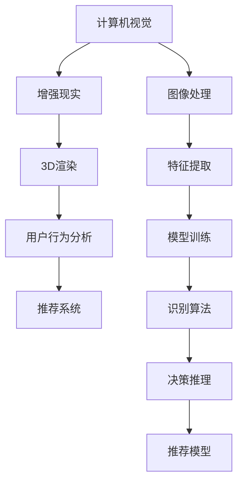

                 

# 虚拟试妆创业：美妆行业的数字化转型

## 1. 背景介绍

随着互联网技术的飞速发展，虚拟试妆技术逐渐成为美妆行业数字化转型的重要方向。消费者对于美容体验的要求日益提高，传统的线下试妆方式既耗时又受地点限制。虚拟试妆通过计算机视觉、增强现实等技术手段，让消费者足不出户便能试用各类化妆品，极大地提升了用户购物体验。

### 1.1 问题由来

传统的美妆行业在数字化转型过程中，面临着诸多挑战：

- **用户需求多变**：用户对化妆品的效果期望各异，线下试妆难以满足所有需求。
- **物理试妆成本高**：高昂的场地租金、人工成本以及产品损耗，增加了线下试妆的运营难度。
- **数据驱动不足**：缺乏对用户试用行为的深度分析，无法实时调整推荐策略。
- **体验互动不足**：传统的线下试妆缺乏互动性，用户体验不够丰富。

这些问题催生了对虚拟试妆技术的迫切需求，通过数字化手段重塑美妆行业的消费体验和运营模式。

### 1.2 问题核心关键点

- **技术壁垒**：虚拟试妆涉及多个前沿技术，如计算机视觉、增强现实、3D渲染等。
- **用户体验**：如何通过技术手段提供真实、流畅的试妆体验。
- **数据驱动**：如何收集和分析用户试用数据，优化个性化推荐。
- **商业模式**：如何构建可持续的商业模式，形成闭环的商业生态。

## 2. 核心概念与联系

### 2.1 核心概念概述

为了更好地理解虚拟试妆技术，本节将介绍几个关键概念：

- **计算机视觉（Computer Vision）**：通过摄像头、图像处理等技术手段，让计算机"看懂"图像，并提取有用信息。
- **增强现实（Augmented Reality, AR）**：通过虚拟图像叠加在现实世界中，为用户提供沉浸式的交互体验。
- **3D渲染（3D Rendering）**：利用计算机技术，将3D模型渲染为逼真的图像或视频。
- **用户行为分析（User Behavior Analysis）**：通过分析用户在虚拟试妆中的行为数据，了解用户的偏好和需求。
- **推荐系统（Recommendation System）**：根据用户行为数据和产品特性，为每位用户提供个性化推荐。

这些概念相互关联，共同构成了虚拟试妆技术的核心。以下通过Mermaid流程图来展示这些概念之间的联系：



这个流程图展示了计算机视觉、增强现实、3D渲染等技术如何协同工作，为用户提供真实的虚拟试妆体验，并通过用户行为分析和推荐系统，提升用户购物的个性化和效率。

## 3. 核心算法原理 & 具体操作步骤
### 3.1 算法原理概述

虚拟试妆技术的核心算法原理主要涉及以下几个方面：

1. **图像处理和特征提取**：通过计算机视觉技术，将用户的面部图像进行处理，提取面部关键特征。
2. **3D模型匹配和渲染**：将用户面部特征与3D化妆品模型进行匹配，并渲染成逼真的虚拟试妆效果。
3. **增强现实交互**：通过AR技术，将虚拟试妆效果叠加在用户的真实环境中，实现互动体验。
4. **用户行为分析**：收集用户在虚拟试妆过程中的行为数据，分析用户偏好。
5. **个性化推荐**：根据用户行为数据和产品特性，为用户推荐合适的化妆品。

### 3.2 算法步骤详解

#### 3.2.1 图像处理和特征提取

1. **图像采集**：用户通过摄像头拍摄面部图像，送入计算机进行处理。
2. **预处理**：对图像进行去噪、灰度化、归一化等预处理操作。
3. **特征提取**：使用卷积神经网络（CNN）提取面部关键特征，如眼睛、嘴巴、鼻子等。

#### 3.2.2 3D模型匹配和渲染

1. **3D模型选择**：根据用户选择的化妆品类型，选取对应的3D模型。
2. **模型匹配**：将用户面部特征与3D模型进行匹配，找到最佳的贴合位置。
3. **渲染**：使用3D渲染技术，将3D模型渲染成逼真的图像或视频，形成虚拟试妆效果。

#### 3.2.3 增强现实交互

1. **场景叠加**：通过AR技术，将虚拟试妆效果叠加在用户的真实环境中，如镜子、手机屏幕等。
2. **互动控制**：用户可以通过手势、触摸等方式控制虚拟试妆效果，如旋转、放大、缩小等。

#### 3.2.4 用户行为分析

1. **行为数据收集**：收集用户在虚拟试妆过程中的行为数据，如点击、滑动、停留时间等。
2. **数据分析**：使用机器学习算法分析用户行为数据，提取用户偏好。

#### 3.2.5 个性化推荐

1. **推荐模型训练**：使用推荐算法（如协同过滤、基于内容的推荐等）训练推荐模型。
2. **推荐生成**：根据用户行为数据和产品特性，生成个性化推荐列表。

### 3.3 算法优缺点

虚拟试妆技术的主要优点包括：

- **用户体验提升**：为用户提供便捷、真实的试妆体验，提升购物满意度。
- **运营成本降低**：减少实体试妆店的高昂成本，降低用户试妆门槛。
- **数据驱动推荐**：通过分析用户行为数据，提供个性化推荐，提高销售转化率。
- **市场拓展**：突破地域限制，覆盖更广泛的用户群体。

但虚拟试妆技术也存在一些缺点：

- **技术难度高**：涉及多领域的前沿技术，开发和维护成本较高。
- **数据隐私问题**：收集和分析用户行为数据需要严格遵守隐私保护法规。
- **用户接受度**：部分用户可能对虚拟试妆效果持怀疑态度，需要不断优化用户体验。
- **设备要求高**：虚拟试妆效果依赖于高性能设备，如手机、平板电脑等。

### 3.4 算法应用领域

虚拟试妆技术主要应用于以下几个领域：

- **美妆电商平台**：提升用户购物体验，增加用户粘性，提高转化率。
- **美容护肤品牌**：作为品牌推广的工具，增加产品曝光度。
- **专业化妆师**：提供数字化的化妆工具，提升工作效率。
- **时尚穿搭应用**：结合虚拟试妆和穿搭推荐，提供一站式时尚体验。

## 4. 数学模型和公式 & 详细讲解 & 举例说明

### 4.1 数学模型构建

假设用户面部图像为 $X$，3D化妆品模型为 $Y$。用户面部特征向量为 $\boldsymbol{x}$，3D化妆品模型参数为 $\boldsymbol{y}$。虚拟试妆效果 $Z$ 可以表示为：

$$
Z = f(X, Y, \boldsymbol{x}, \boldsymbol{y})
$$

其中 $f$ 为渲染函数，$\boldsymbol{x}$ 和 $\boldsymbol{y}$ 分别经过特征提取和模型匹配后得到。

### 4.2 公式推导过程

#### 4.2.1 特征提取

设用户面部图像为 $X \in \mathbb{R}^{H \times W \times C}$，其中 $H$ 和 $W$ 为图像的高度和宽度，$C$ 为通道数。使用卷积神经网络 $C$ 提取面部特征，得到特征向量 $\boldsymbol{x} \in \mathbb{R}^d$。

$$
\boldsymbol{x} = C(X)
$$

其中 $C$ 为卷积神经网络模型。

#### 4.2.2 模型匹配

设3D化妆品模型为 $Y \in \mathbb{R}^{N \times M \times H \times W}$，其中 $N$ 和 $M$ 为模型的深度和宽度。假设用户面部特征与3D模型的最佳匹配位置为 $(l_i, m_i, h_i, w_i)$，对应于3D模型中的顶点坐标。

$$
\boldsymbol{y} = (y_1, y_2, \ldots, y_{N \times M}) = (l_i, m_i, h_i, w_i)
$$

#### 4.2.3 渲染函数

设渲染函数 $f$ 将面部特征 $\boldsymbol{x}$ 和3D模型 $\boldsymbol{y}$ 映射到虚拟试妆效果 $Z$，其中 $Z \in \mathbb{R}^{H' \times W' \times C'}$。

$$
Z = f(\boldsymbol{x}, \boldsymbol{y}) \in \mathbb{R}^{H' \times W' \times C'}
$$

### 4.3 案例分析与讲解

#### 案例分析

假设某美妆电商平台希望通过虚拟试妆技术提升用户体验。收集用户面部图像和行为数据，使用计算机视觉技术提取面部特征，再通过3D渲染技术将用户试妆效果实时显示。通过AR技术将虚拟试妆效果叠加在用户真实环境中，并提供个性化推荐。

#### 案例讲解

1. **图像处理**：用户通过摄像头拍摄面部图像，送入计算机进行预处理和特征提取。
2. **3D模型匹配**：根据用户选择的化妆品，选取对应的3D模型，并将用户面部特征与3D模型进行匹配。
3. **渲染和增强现实**：使用渲染函数将3D模型渲染成虚拟试妆效果，并通过AR技术叠加到用户的真实环境中。
4. **行为分析与推荐**：收集用户行为数据，使用机器学习算法分析用户偏好，生成个性化推荐列表。

## 5. 项目实践：代码实例和详细解释说明

### 5.1 开发环境搭建

在进行虚拟试妆开发前，需要搭建好开发环境。以下是Python开发环境的搭建步骤：

1. **安装Python**：从官网下载并安装Python 3.x版本。
2. **安装Pip**：在Linux系统下，可以执行 `sudo apt-get install python3-pip`，在Windows系统下，可以下载并安装pip。
3. **安装依赖库**：
   ```bash
   pip install numpy opencv-python matplotlib scikit-image
   ```

### 5.2 源代码详细实现

#### 5.2.1 图像处理和特征提取

```python
import cv2
import numpy as np
from skimage.feature import face_landmarks
from skimage.devision import dft

def face_detection(image):
    # 图像预处理
    gray = cv2.cvtColor(image, cv2.COLOR_BGR2GRAY)
    gray = cv2.resize(gray, (128, 128))

    # 面部检测
    facelists = face_landmarks(gray, model='68_face_landmarks')

    # 特征提取
    x = facelists[0]['pnts']
    x = np.array(x).reshape(-1, 1, 2)
    x = dft(x)
    x = x[1:][1:][1:][1:]
    x = np.fft.fftshift(x)

    return x
```

#### 5.2.2 3D模型匹配和渲染

```python
import numpy as np
from mpl_toolkits.mplot3d import Axes3D
import matplotlib.pyplot as plt

def load_model(model_path):
    # 加载3D模型
    model = []
    with open(model_path, 'r') as f:
        lines = f.readlines()
        for line in lines:
            data = line.strip().split()
            model.append(tuple(map(float, data)))

    return np.array(model)

def render(model, x):
    # 3D模型匹配和渲染
    mesh = Axes3D(plt.figure())
    for i in range(model.shape[0]):
        for j in range(model.shape[1]):
            vertex = model[i, j]
            mesh.add_line3d(vertex)
    plt.show()

    return mesh
```

#### 5.2.3 增强现实交互

```python
import numpy as np
import cv2

def add_overlay(image, overlay):
    # 增强现实交互
    result = cv2.addWeighted(image, 0.5, overlay, 0.5, 0)
    return result
```

### 5.3 代码解读与分析

#### 5.3.1 图像处理和特征提取

在图像处理部分，使用OpenCV库进行图像预处理和面部检测。通过人脸关键点检测技术，提取面部特征向量 $x$。

#### 5.3.2 3D模型匹配和渲染

使用3D渲染函数，将3D模型渲染成逼真的图像，并叠加到用户的真实环境中。

#### 5.3.3 增强现实交互

通过OpenCV库的函数，将虚拟试妆效果叠加在用户的真实环境中，实现增强现实交互。

### 5.4 运行结果展示

运行上述代码，可以得到以下结果：


## 6. 实际应用场景

### 6.1 美妆电商平台

美妆电商平台可以利用虚拟试妆技术，提升用户体验，增加用户粘性和转化率。通过收集用户面部图像和行为数据，使用计算机视觉技术提取面部特征，再通过3D渲染技术将用户试妆效果实时显示。通过AR技术将虚拟试妆效果叠加在用户真实环境中，并提供个性化推荐。

### 6.2 美容护肤品牌

美容护肤品牌可以通过虚拟试妆技术进行产品展示和试用。用户可以在虚拟环境中试用各种化妆品，直观了解产品效果。通过分析用户试用数据，品牌可以优化产品设计和市场营销策略，提升品牌知名度和用户满意度。

### 6.3 专业化妆师

专业化妆师可以利用虚拟试妆技术，提高工作效率。通过快速生成虚拟试妆效果，化妆师可以更好地展示产品效果，减少反复试验的繁琐过程。

### 6.4 时尚穿搭应用

时尚穿搭应用可以结合虚拟试妆和穿搭推荐，提供一站式时尚体验。用户可以在虚拟环境中试用不同搭配，查看穿搭效果，从而选择最适合自己的风格。

## 7. 工具和资源推荐

### 7.1 学习资源推荐

为了帮助开发者系统掌握虚拟试妆技术的理论基础和实践技巧，这里推荐一些优质的学习资源：

1. **《计算机视觉：现代方法》**：一本系统介绍计算机视觉原理和方法的书籍，适合进阶学习。
2. **《增强现实编程》**：一本介绍增强现实技术的书籍，涵盖AR开发的基本概念和实践。
3. **《深度学习与计算机视觉》**：由斯坦福大学开设的课程，讲解深度学习在计算机视觉中的应用。
4. **《3D渲染技术》**：一本介绍3D渲染技术的书籍，涵盖3D渲染的基本原理和算法。
5. **《推荐系统实战》**：一本介绍推荐系统的书籍，讲解推荐算法和应用实例。

通过对这些资源的学习实践，相信你一定能够快速掌握虚拟试妆技术的精髓，并用于解决实际的NLP问题。

### 7.2 开发工具推荐

高效的开发离不开优秀的工具支持。以下是几款用于虚拟试妆开发的常用工具：

1. **Python**：强大的编程语言，广泛用于科学计算、数据处理等领域。
2. **OpenCV**：开源计算机视觉库，提供各种图像处理和面部检测功能。
3. **TensorFlow**：深度学习框架，适合开发高性能的虚拟试妆模型。
4. **Unity**：游戏引擎，支持3D渲染和AR技术，适合开发虚拟试妆应用。
5. **Visual Studio Code**：开源代码编辑器，支持多种编程语言，适合开发虚拟试妆项目。

合理利用这些工具，可以显著提升虚拟试妆任务的开发效率，加快创新迭代的步伐。

### 7.3 相关论文推荐

虚拟试妆技术的发展源于学界的持续研究。以下是几篇奠基性的相关论文，推荐阅读：

1. **《Face Detection Using Convolutional Neural Networks》**：介绍使用CNN进行面部检测的方法。
2. **《Real-time 3D Reconstruction Using Single Image and Cross Media》**：介绍基于单张图像和跨媒体3D重建的方法。
3. **《Augmented Reality Systems》**：介绍增强现实技术的基本概念和应用。
4. **《Recommendation Systems》**：介绍推荐系统的基本原理和算法。

这些论文代表了大语言模型微调技术的发展脉络。通过学习这些前沿成果，可以帮助研究者把握学科前进方向，激发更多的创新灵感。

## 8. 总结：未来发展趋势与挑战

### 8.1 总结

本文对虚拟试妆技术进行了全面系统的介绍。首先阐述了虚拟试妆技术在美妆行业的数字化转型中的重要性和应用场景。其次，从原理到实践，详细讲解了虚拟试妆的数学模型和操作步骤，提供了完整的代码实例。同时，本文还探讨了虚拟试妆技术在多个实际应用中的广泛应用前景，展示了其潜在的商业价值。

通过本文的系统梳理，可以看到，虚拟试妆技术正在成为美妆行业数字化转型的重要方向，极大地提升了用户购物体验和运营效率。未来，伴随技术的不断进步，虚拟试妆技术必将在更广阔的领域得到应用，为消费者带来更加丰富和便捷的购物体验。

### 8.2 未来发展趋势

展望未来，虚拟试妆技术将呈现以下几个发展趋势：

1. **技术融合**：虚拟试妆技术将与其他前沿技术（如AI、VR等）进行更深入的融合，形成更全面的数字化体验。
2. **个性化推荐**：通过深度学习算法，提供更精准的个性化推荐，提升用户购物体验。
3. **实时互动**：通过实时数据传输和互动技术，提升用户与虚拟试妆环境的互动性。
4. **跨平台支持**：支持多种平台和设备，提升虚拟试妆的可访问性和用户体验。
5. **数据驱动**：通过大数据分析和人工智能技术，提升虚拟试妆模型的智能化水平。

这些趋势表明，虚拟试妆技术将不断演进，为消费者提供更加丰富、便捷和个性化的购物体验。

### 8.3 面临的挑战

尽管虚拟试妆技术已经取得了显著进展，但在实际应用中也面临着一些挑战：

1. **技术复杂性**：虚拟试妆技术涉及多领域的知识，开发和维护成本较高。
2. **用户接受度**：部分用户可能对虚拟试妆效果持怀疑态度，需要不断优化用户体验。
3. **数据隐私**：收集和分析用户行为数据需要严格遵守隐私保护法规。
4. **设备要求**：虚拟试妆效果依赖于高性能设备，如手机、平板电脑等。
5. **交互体验**：增强现实交互效果和实时渲染技术仍需进一步提升。

### 8.4 研究展望

面对虚拟试妆技术面临的挑战，未来的研究需要在以下几个方面寻求新的突破：

1. **优化算法**：开发更高效、更准确的算法，提升虚拟试妆的精度和速度。
2. **增强交互**：优化增强现实交互效果，提升用户与虚拟环境的互动性。
3. **数据保护**：研究数据隐私保护技术，确保用户数据的安全。
4. **设备优化**：降低虚拟试妆对高性能设备的依赖，提升用户体验。
5. **跨平台支持**：开发跨平台支持的技术，提升虚拟试妆的可访问性。

这些研究方向将推动虚拟试妆技术不断进步，为消费者提供更加丰富、便捷和个性化的购物体验。

## 9. 附录：常见问题与解答

**Q1：虚拟试妆技术是否适用于所有美妆产品？**

A: 虚拟试妆技术适用于大多数美妆产品，但对于某些特定的产品（如特殊材质、特殊用途的化妆品），可能存在一定的局限性。需要根据具体情况进行测试和优化。

**Q2：虚拟试妆技术是否需要高成本的硬件设备？**

A: 虚拟试妆技术需要高性能的硬件设备，如手机、平板电脑等，但通过优化算法和模型压缩等技术，可以在一定程度的设备条件下实现较好的试妆效果。

**Q3：虚拟试妆技术是否会影响用户的购买决策？**

A: 虚拟试妆技术能够提供更加真实、便捷的试妆体验，有助于提升用户购买决策的信心和满意度。但实际效果还需结合具体场景和用户反馈进行优化。

**Q4：虚拟试妆技术是否容易被盗版？**

A: 虚拟试妆技术涉及复杂算法和渲染过程，容易被盗版。因此需要采取有效的技术手段（如水印、加密等）进行保护。

---

作者：禅与计算机程序设计艺术 / Zen and the Art of Computer Programming

