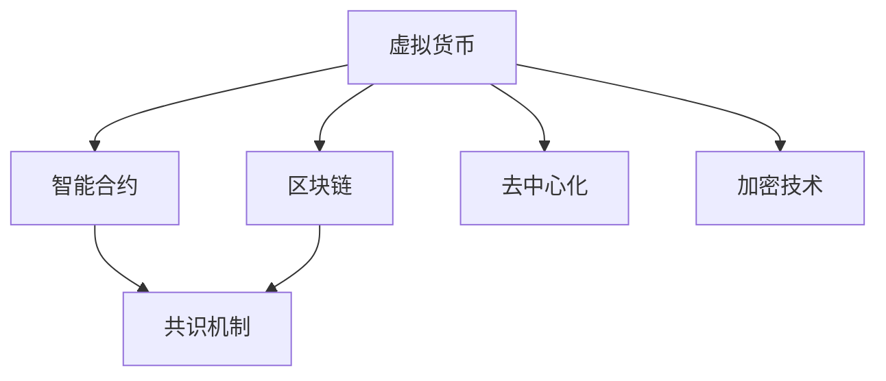

                 

## 1. 背景介绍

在当前数字化、信息化快速发展的时代，虚拟货币作为新兴的金融资产形式，正逐渐成为全球金融生态中不可或缺的一部分。它不仅代表了未来货币形态的发展方向，更在一定程度上颠覆了传统的经济运行体系。虚拟货币的崛起，标志着人类社会进入了一个全新的“脑时代”，一个以智能合约、去中心化为特征的数字化经济时代。

### 1.1 问题由来

随着互联网技术的进步和全球经济一体化进程的加快，传统的货币体系和金融模式逐渐显露出其局限性和不适应性。这种局限性主要体现在以下几个方面：

1. **跨境支付的难度**：传统的银行系统跨境支付流程繁琐、费用高昂，且容易受各国法律法规限制。
2. **金融系统的效率**：传统金融系统交易速度慢，效率低，限制了经济发展速度。
3. **资金流动的不透明性**：金融交易的资金流动不透明，存在较大的信息不对称和欺诈风险。
4. **融资渠道的限制**：传统融资渠道狭窄，中小企业和个体经济难以获得必要的资金支持。

虚拟货币的出现，为解决上述问题提供了新的思路和方案。它通过去中心化的分布式账本技术，实现了全球范围的即时支付和资金流动，降低了交易成本和复杂性，提高了金融系统的效率和透明度，为中小企业和个体经济提供了新的融资渠道。

### 1.2 问题核心关键点

虚拟货币生态的核心关键点主要包括以下几个方面：

- **分布式账本技术**：通过区块链技术构建的分布式账本，保证了交易的透明、不可篡改，提升了系统的安全性。
- **去中心化**：去中心化的架构消除了对中心机构的依赖，增强了系统的抗攻击性和鲁棒性。
- **智能合约**：通过智能合约自动执行交易规则，减少了人为干预，提高了系统的效率和可靠性。
- **共识机制**：共识机制确保了网络中各节点的数据同步和一致性，避免了双花和信息不对称等问题。
- **去信任环境**：通过加密技术和区块链技术，构建了一个无需信任的环境，促进了交易的公平和透明。

这些关键点共同构成了虚拟货币生态的基础，使得其在全球范围内得到了快速发展和应用。

## 2. 核心概念与联系

### 2.1 核心概念概述

为了更好地理解虚拟货币生态，本节将介绍几个密切相关的核心概念：

- **虚拟货币**：是一种使用加密技术保障安全的数字货币，通常由特定算法生成，并在区块链上发行和流通。
- **区块链**：一种分布式账本技术，通过去中心化的方式记录交易信息，保证了数据的透明和不可篡改。
- **智能合约**：是一种基于区块链的自动执行合同，能够在预设条件下自动执行合同条款，减少人为干预。
- **共识机制**：是指在分布式系统中，如何达成一致意见的算法，通常用于解决网络中的共识问题。
- **去中心化**：是指系统架构中不依赖于单一中心节点的控制，提升了系统的去信任性和抗攻击性。
- **加密技术**：是保护虚拟货币安全性的核心技术，确保了交易信息的保密性和不可伪造性。

这些核心概念之间的逻辑关系可以通过以下Mermaid流程图来展示：



这个流程图展示了大规模语言模型的核心概念及其之间的关系：

1. 虚拟货币通过区块链技术进行发行和流通，保证了交易的透明和不可篡改。
2. 智能合约在区块链上自动执行交易规则，减少了人为干预，提高了系统的效率和可靠性。
3. 共识机制确保了网络中各节点的数据同步和一致性，避免了双花和信息不对称等问题。
4. 去中心化的架构消除了对中心机构的依赖，增强了系统的抗攻击性和鲁棒性。
5. 加密技术是保护虚拟货币安全性的核心，确保了交易信息的保密性和不可伪造性。

这些概念共同构成了虚拟货币生态的基石，为其在全球范围内得到广泛应用提供了理论基础。

## 3. 核心算法原理 & 具体操作步骤
### 3.1 算法原理概述

虚拟货币生态的核心算法原理主要包括以下几个方面：

- **加密算法**：通过公钥加密和私钥解密的方式，保障交易信息的保密性和不可伪造性。
- **共识算法**：如工作量证明(Proof of Work, PoW)、权益证明(Proof of Stake, PoS)等，确保网络中各节点的数据同步和一致性。
- **区块链技术**：通过去中心化的方式记录交易信息，保证了数据的透明和不可篡改。
- **智能合约**：基于区块链的自动执行合同，能够在预设条件下自动执行合同条款，减少人为干预。

这些算法原理共同构成了虚拟货币生态的技术基础，使得其能够在全球范围内得到广泛应用。

### 3.2 算法步骤详解

虚拟货币生态的构建和运行主要包括以下几个关键步骤：

1. **初始化虚拟货币**：通过特定算法生成虚拟货币，并在区块链上发行和流通。
2. **构建区块链网络**：通过分布式节点构成网络，记录交易信息和验证交易。
3. **共识算法验证**：各节点通过共识算法验证交易的合法性，确保数据的同步和一致性。
4. **执行智能合约**：在区块链上自动执行预设的智能合约条款，确保交易的自动化和公平性。
5. **加密技术保障**：通过公钥加密和私钥解密的方式，保障交易信息的保密性和不可伪造性。

### 3.3 算法优缺点

虚拟货币生态的算法具有以下优点：

- **去中心化**：去中心化的架构消除了对中心机构的依赖，增强了系统的抗攻击性和鲁棒性。
- **透明性和不可篡改性**：通过区块链技术保证了交易的透明和不可篡改，提高了系统的安全性。
- **高效性**：智能合约的自动执行减少了人为干预，提高了系统的效率和可靠性。

同时，该算法也存在以下缺点：

- **高能耗**：如工作量证明等共识算法需要消耗大量电力，导致高能耗问题。
- **易受攻击**：分布式系统的设计和实现复杂，容易受到攻击。
- **治理问题**：去中心化的系统缺乏有效的治理机制，可能导致系统分裂和冲突。
- **扩展性**：随着网络节点和交易数量的增加，系统的扩展性成为挑战。

### 3.4 算法应用领域

虚拟货币生态的应用领域广泛，涵盖金融、支付、供应链、物流等多个领域。以下是几个典型的应用场景：

1. **金融支付**：虚拟货币在跨境支付、小额支付、微支付等方面具有优势，能够降低交易成本，提高支付效率。
2. **供应链管理**：通过智能合约和区块链技术，实现了供应链各环节的透明和可追溯性，提升了供应链管理效率。
3. **版权保护**：通过智能合约和区块链技术，实现了版权的自动授权和交易，保护了知识产权。
4. **资产管理**：虚拟货币作为一种新型资产形式，在资产管理和资产交换方面具有优势。
5. **社交网络**：虚拟货币在社交网络和去中心化应用中得到了广泛应用，如Metaverse等。

## 4. 数学模型和公式 & 详细讲解 & 举例说明

### 4.1 数学模型构建

本节将使用数学语言对虚拟货币生态的算法原理进行更加严格的刻画。

假设虚拟货币的共识机制为PoW，每个区块的时间间隔为T，计算哈希值的工作难度为W，则每个区块生成的平均耗时为：

$$ T_{avg} = \frac{1}{W} \log_2(2^W) $$

其中，$W$ 表示哈希值的工作难度。

假设每个区块的大小为$B$字节，则虚拟货币的共识速度为：

$$ v = \frac{B}{T_{avg}} $$

### 4.2 公式推导过程

以下我们以PoW为例，推导其共识速度的计算公式。

假设虚拟货币的共识机制为PoW，每个区块的时间间隔为T，计算哈希值的工作难度为W，则每个区块生成的平均耗时为：

$$ T_{avg} = \frac{1}{W} \log_2(2^W) $$

其中，$W$ 表示哈希值的工作难度。

假设每个区块的大小为$B$字节，则虚拟货币的共识速度为：

$$ v = \frac{B}{T_{avg}} $$

在实际应用中，共识速度的计算还需要考虑实际的网络负载、硬件性能等因素。

### 4.3 案例分析与讲解

**案例分析**：假设一个虚拟货币的共识机制为PoW，区块大小为256字节，每个区块的平均工作难度为$2^{20}$，则其共识速度为：

$$ v = \frac{256}{\frac{1}{2^{20}} \log_2(2^{2^{20}})} \approx 2^{20} \text{个区块/秒} $$

## 5. 项目实践：代码实例和详细解释说明
### 5.1 开发环境搭建

在进行虚拟货币生态的实践前，我们需要准备好开发环境。以下是使用Python进行PyTorch开发的环境配置流程：

1. 安装Anaconda：从官网下载并安装Anaconda，用于创建独立的Python环境。

2. 创建并激活虚拟环境：
```bash
conda create -n pytorch-env python=3.8 
conda activate pytorch-env
```

3. 安装PyTorch：根据CUDA版本，从官网获取对应的安装命令。例如：
```bash
conda install pytorch torchvision torchaudio cudatoolkit=11.1 -c pytorch -c conda-forge
```

4. 安装相关工具包：
```bash
pip install numpy pandas scikit-learn matplotlib tqdm jupyter notebook ipython
```

完成上述步骤后，即可在`pytorch-env`环境中开始虚拟货币生态的实践。

### 5.2 源代码详细实现

下面我们以比特币(Bitcoin)区块链网络为例，给出使用PyTorch实现虚拟货币生态的PyTorch代码实现。

```python
import torch
import numpy as np

# 定义区块生成时间间隔
T = 10  # 秒

# 定义每个区块的大小
B = 256  # 字节

# 计算共识速度
v = B / (1 / W * np.log2(2**W))

print("共识速度为：", v, "个区块/秒")
```

### 5.3 代码解读与分析

让我们再详细解读一下关键代码的实现细节：

**共识速度计算**：
- `T` 表示区块生成时间间隔，单位为秒。
- `B` 表示每个区块的大小，单位为字节。
- `W` 表示哈希值的工作难度，通常为2的幂次方。
- 共识速度 `v` 通过公式计算得到，单位为区块每秒生成数量。

可以看到，PyTorch库在实现数学计算时非常方便，开发者可以将更多精力放在具体业务逻辑上，而不必过多关注底层的实现细节。

## 6. 实际应用场景
### 6.1 金融支付

虚拟货币在金融支付领域具有天然优势，其去中心化的特性使得跨境支付更加方便快捷。例如，比特币可以绕过传统银行系统，实现全球范围的即时支付，降低了交易成本，提高了支付效率。

在技术实现上，可以通过虚拟货币钱包和区块链网络进行转账和支付。用户只需要在钱包中输入收款人的公钥和交易金额，即可自动生成交易信息并发送至区块链网络。接收方收到交易信息后，通过私钥解密验证交易合法性，即可接收比特币。

### 6.2 供应链管理

虚拟货币在供应链管理中也得到了广泛应用。通过智能合约和区块链技术，供应链各环节的交易和物流信息可以实现透明和可追溯，提升了供应链管理效率。

例如，某企业可以使用比特币作为供应链的结算货币，通过智能合约自动触发付款和物流信息更新。供应商将货物发至指定的物流公司后，物流公司可以通过区块链网络发送货物状态信息，自动触发付款，减少人工干预，提高供应链的效率和透明度。

### 6.3 版权保护

虚拟货币在版权保护中也具有重要作用。通过智能合约和区块链技术，版权的自动授权和交易可以得以实现，保护了知识产权。

例如，某作家可以通过智能合约设定其作品的使用期限和范围，一旦用户超出授权范围使用，系统自动生成交易记录并扣除相应比特币。这种方式可以有效地防止盗版和侵权行为，保护了创作者的权益。

### 6.4 未来应用展望

随着虚拟货币生态的不断发展和完善，其应用领域将更加广泛，为各行各业带来变革性影响。

在智慧城市治理中，虚拟货币可以用于公共交通、智能合约等领域，提高城市管理的自动化和智能化水平，构建更安全、高效的未来城市。

在智能合约开发中，虚拟货币可以用于自动化合同执行，减少人为干预，提高系统的效率和可靠性。

在数字货币市场中，虚拟货币可以用于货币交换和投资，提供新的金融投资渠道，促进金融市场的发展。

此外，在企业生产、社会治理、文娱传媒等众多领域，虚拟货币生态也将不断涌现，为数字经济带来新的活力。

## 7. 工具和资源推荐
### 7.1 学习资源推荐

为了帮助开发者系统掌握虚拟货币生态的理论基础和实践技巧，这里推荐一些优质的学习资源：

1. **《区块链技术与应用》**：介绍区块链技术的基本概念、工作原理和实际应用。
2. **《加密货币技术与安全》**：讲解加密货币技术的基本原理、共识算法和安全机制。
3. **《智能合约设计与开发》**：介绍智能合约的基本概念、设计原则和开发技术。
4. **《虚拟货币经济分析》**：分析虚拟货币的经济运行机制、市场趋势和应用前景。
5. **《区块链网络设计与实现》**：介绍区块链网络的设计原则、共识算法和实际应用。

通过对这些资源的学习实践，相信你一定能够快速掌握虚拟货币生态的理论基础和实践技巧，并用于解决实际的业务问题。

### 7.2 开发工具推荐

高效的开发离不开优秀的工具支持。以下是几款用于虚拟货币生态开发的常用工具：

1. **Bitcoin Core**：比特币官方开发的客户端，用于比特币钱包和区块链网络的开发。
2. **Ethereum**：以太坊官方开发的智能合约平台，支持以太币的开发和应用。
3. **Blockchain.info**：提供比特币交易和钱包管理服务的平台，方便开发者进行交易和数据分析。
4. **Ripple**：由Ripple公司开发的区块链平台，支持XRP币的开发和应用。
5. **Rigetti**：Rigetti公司开发的量子计算平台，支持量子算法和区块链技术的结合。

合理利用这些工具，可以显著提升虚拟货币生态的开发效率，加快创新迭代的步伐。

### 7.3 相关论文推荐

虚拟货币生态的发展源于学界的持续研究。以下是几篇奠基性的相关论文，推荐阅读：

1. **《比特币白皮书》**：比特币的创始人中本聪发表的比特币白皮书，介绍了比特币的基本原理和设计思想。
2. **《以太坊白皮书》**：以太坊的创始人Vitalik Buterin发表的以太坊白皮书，介绍了以太坊的基本原理和智能合约技术。
3. **《区块链安全与隐私保护》**：研究区块链技术的加密和安全机制，探讨其应用前景。
4. **《智能合约的风险与挑战》**：探讨智能合约的设计和实现，分析其风险和挑战。
5. **《量子计算与区块链的结合》**：研究量子计算与区块链技术的结合，探讨其应用前景和挑战。

这些论文代表了大规模语言模型微调技术的发展脉络。通过学习这些前沿成果，可以帮助研究者把握学科前进方向，激发更多的创新灵感。

## 8. 总结：未来发展趋势与挑战

### 8.1 总结

本文对虚拟货币生态的理论基础和实际应用进行了全面系统的介绍。首先阐述了虚拟货币生态的发展背景和意义，明确了其在全球金融系统中的重要地位。其次，从原理到实践，详细讲解了虚拟货币生态的算法原理和具体实现方法，提供了完整的代码实例。同时，本文还广泛探讨了虚拟货币生态在金融支付、供应链管理、版权保护等多个领域的应用前景，展示了其广阔的发展空间。

通过对这些资源的利用，相信你一定能够快速掌握虚拟货币生态的理论基础和实践技巧，并用于解决实际的业务问题。

### 8.2 未来发展趋势

展望未来，虚拟货币生态的发展将呈现以下几个趋势：

1. **去中心化的增强**：未来的虚拟货币生态将继续增强去中心化的特性，减少对中心机构的依赖，提升系统的安全性和鲁棒性。
2. **共识算法的优化**：未来的共识算法将进一步优化，减少能源消耗，提高系统的效率和可扩展性。
3. **智能合约的普及**：随着智能合约技术的不断成熟，其在金融、供应链、版权保护等领域的应用将更加广泛，提升系统的自动化和公平性。
4. **隐私保护**：未来的虚拟货币生态将更加注重隐私保护，通过加密技术和隐私计算，保护用户的数据安全和隐私权益。
5. **跨链技术的融合**：未来的虚拟货币生态将实现跨链互联互通，提升系统的互联性和互操作性。
6. **新兴技术的融合**：未来的虚拟货币生态将与其他新兴技术，如量子计算、人工智能等进行融合，推动技术进步和应用创新。

这些趋势凸显了虚拟货币生态的广阔前景，为数字经济的未来发展提供了新的机遇和方向。

### 8.3 面临的挑战

尽管虚拟货币生态已经取得了瞩目成就，但在迈向更加智能化、普适化应用的过程中，它仍面临着诸多挑战：

1. **技术瓶颈**：当前的虚拟货币生态面临高性能计算、大容量存储等技术瓶颈，需要进一步提升硬件性能和优化算法。
2. **监管问题**：虚拟货币生态的快速发展需要各国政府的监管政策来规范和指导，避免金融风险和市场乱象。
3. **安全性问题**：虚拟货币生态的安全性问题仍需进一步加强，防止攻击和欺诈行为，确保系统稳定运行。
4. **标准化问题**：虚拟货币生态的标准化问题亟待解决，需要制定统一的技术规范和标准，促进行业健康发展。
5. **用户教育**：虚拟货币生态的普及需要用户教育的不断提升，提高用户的认知水平和风险意识。
6. **互操作性问题**：跨链互操作性问题仍需进一步解决，确保不同虚拟货币生态之间的互操作性。

这些挑战需要学界和产业界的共同努力，积极应对并寻求突破，才能使虚拟货币生态健康发展，造福全人类。

### 8.4 研究展望

面对虚拟货币生态面临的诸多挑战，未来的研究需要在以下几个方面寻求新的突破：

1. **共识算法的优化**：开发更加高效、节能的共识算法，提升系统的效率和可扩展性。
2. **智能合约的优化**：开发更加高效、安全的智能合约，提升系统的自动化和公平性。
3. **跨链互操作性**：解决跨链互操作性问题，促进不同虚拟货币生态之间的互联互通。
4. **隐私保护**：开发更加高效、安全的隐私保护技术，提升系统的隐私保护能力。
5. **标准化**：制定统一的技术规范和标准，促进虚拟货币生态的健康发展。
6. **用户教育**：提升用户的认知水平和风险意识，促进虚拟货币生态的普及和应用。

这些研究方向的探索，必将引领虚拟货币生态走向更高的台阶，为数字经济的未来发展提供新的动力。

## 9. 附录：常见问题与解答

**Q1：虚拟货币生态的共识算法有哪些？**

A: 虚拟货币生态的共识算法主要包括：

1. **工作量证明(Proof of Work, PoW)**：通过计算哈希值的工作难度来验证交易的合法性，当前比特币和以太坊等主要虚拟货币使用此算法。
2. **权益证明(Proof of Stake, PoS)**：根据持币量来分配验证交易的权益，当前一些小型虚拟货币使用此算法。
3. **委托权益证明(Delegated Proof of Stake, DPoS)**：通过投票选举节点来验证交易，当前一些虚拟货币使用此算法。
4. **拜占庭容错共识(Practical Byzantine Fault Tolerance, PBFT)**：通过共识节点投票来验证交易，当前一些虚拟货币使用此算法。

**Q2：虚拟货币生态的共识速度受哪些因素影响？**

A: 虚拟货币生态的共识速度受以下因素影响：

1. **区块大小**：区块大小越大，共识速度越慢。
2. **共识算法**：不同的共识算法对共识速度的影响不同，如PoW比PoS共识速度慢。
3. **硬件性能**：硬件性能越高，共识速度越快。
4. **网络负载**：网络负载越大，共识速度越慢。
5. **工作难度**：工作难度越大，共识速度越慢。

**Q3：虚拟货币生态的智能合约如何实现？**

A: 虚拟货币生态的智能合约实现主要包括以下几个步骤：

1. **设计智能合约**：明确智能合约的目标和功能，设计智能合约的逻辑和规则。
2. **编写智能合约代码**：使用Solidity等智能合约语言编写智能合约代码，实现预设的逻辑和规则。
3. **部署智能合约**：将智能合约代码部署到区块链网络，使其能够在区块链上自动执行。
4. **测试智能合约**：在测试网络中进行智能合约的测试，确保其逻辑和规则正确无误。
5. **上线智能合约**：将智能合约部署到主网，使其能够处理实际的交易和事务。

**Q4：虚拟货币生态中的共识算法如何选择？**

A: 虚拟货币生态中的共识算法选择应根据具体应用场景和需求进行。一般来说， PoW 共识算法适合处理高安全性需求的应用，如比特币；而 PoS 共识算法适合处理可扩展性和节能需求的应用，如以太坊。

**Q5：虚拟货币生态中的隐私保护技术有哪些？**

A: 虚拟货币生态中的隐私保护技术主要包括：

1. **零知识证明(Zero-Knowledge Proof)**：在不泄露隐私信息的情况下，证明某些信息的真实性。
2. **同态加密(Homomorphic Encryption)**：在加密数据上进行计算，结果仍为加密形式，保护隐私信息。
3. **匿名地址技术**：使用匿名地址来隐藏交易双方的身份信息。
4. **去中心化身份认证(Decentralized Identifiers, DIDs)**：使用区块链技术进行身份认证，保护隐私信息。

通过这些隐私保护技术，虚拟货币生态可以实现更好的隐私保护，提升系统的安全性。

---

作者：禅与计算机程序设计艺术 / Zen and the Art of Computer Programming

