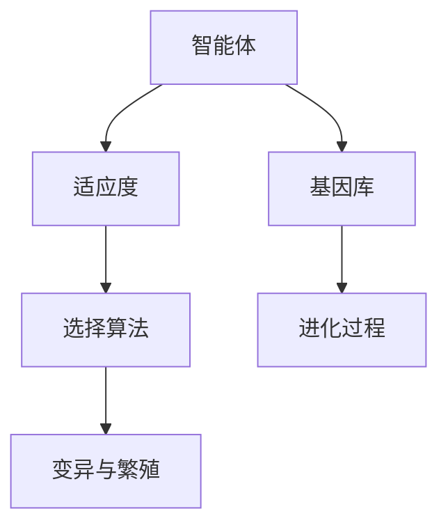

                 

# 虚拟进化模拟器：AI驱动的数字生态系统实验室

## 1. 背景介绍

### 1.1 问题由来

在现代科技迅速发展的背景下，人工智能（AI）正在成为推动数字生态系统演化的核心动力。虚拟进化模拟器（Virtual Evolution Simulator, VES）作为AI驱动的数字生态系统实验室，旨在通过模拟自然界进化过程，加速AI技术的迭代和优化，从而实现数字生态系统的动态平衡和可持续发展。

### 1.2 问题核心关键点

VES的核心目标是通过模拟自然界进化机制，利用AI技术不断迭代和优化数字生态系统中的各种元素，包括生物体、环境、资源等。其中，进化算法（Evolutionary Algorithm, EA）的引入，使得VES具备了自动优化的能力，能够不断寻找最优解，提升生态系统中的智能体（如AI模型）的适应性和创新能力。

当前，VES在智能推荐系统、机器人控制、自动驾驶、虚拟现实等多个领域得到广泛应用，展示了其在推动AI技术进步和数字生态系统演进方面的巨大潜力。

### 1.3 问题研究意义

研究虚拟进化模拟器，对于加速AI技术的创新和应用，推动数字生态系统的智能化、高效化发展，具有重要意义：

1. **加速技术迭代**：通过自动化的进化机制，不断优化和提升AI模型的性能，缩短新技术的研发周期。
2. **增强系统适应性**：使AI系统具备自适应能力，能够应对不断变化的环境和需求。
3. **促进创新思维**：通过模拟自然界进化过程，激发新思路和创新点，推动更多前沿技术的探索和应用。
4. **推动跨领域应用**：在多个垂直领域（如智能制造、智慧医疗、智能家居等）进行技术应用，加速数字化转型进程。
5. **提升资源利用率**：通过优化资源分配和利用，提高数字生态系统的整体效率和效益。

## 2. 核心概念与联系

### 2.1 核心概念概述

为更好地理解虚拟进化模拟器的原理和应用，本节将介绍几个关键概念及其联系：

- **虚拟进化模拟器（VES）**：基于进化算法和AI技术的数字生态系统实验室，旨在通过模拟自然界进化过程，优化和提升数字生态系统中的智能体性能。

- **进化算法（EA）**：通过模拟自然界进化机制，利用遗传算法、粒子群算法、模拟退火算法等方法，自动搜索最优解，适用于复杂优化问题。

- **智能体（Agent）**：在数字生态系统中扮演关键角色的实体，可以是机器人、AI模型、仿真环境等。

- **适应度（Fitness）**：衡量智能体适应环境能力的指标，如生存率、性能指标等。

- **基因库（Genetic Pool）**：存储智能体基因信息的数据库，包含各种基因的组合和变异情况。

- **选择算法（Selection Algorithm）**：根据适应度进行筛选，选择优胜者进行繁衍和变异，保证种群多样性。

这些概念之间的逻辑关系可以通过以下Mermaid流程图来展示：



这个流程图展示虚拟进化模拟器的核心概念及其之间的关系：

1. 智能体通过进化过程不断优化基因库。
2. 适应度评估决定哪些智能体能够生存繁衍。
3. 选择算法确保种群多样性。
4. 变异与繁殖产生新的智能体，进一步优化基因库。

## 3. 核心算法原理 & 具体操作步骤

### 3.1 算法原理概述

虚拟进化模拟器的核心算法是基于进化算法（EA）的优化机制。其基本流程如下：

1. 初始化智能体种群：从基因库中随机选择一组基因进行初始化，形成初始种群。
2. 评估适应度：根据智能体的适应度函数，评估其在当前环境下的表现。
3. 选择操作：根据适应度进行筛选，选择优胜者进行繁衍和变异。
4. 变异操作：对选中的智能体基因进行随机变异，产生新个体。
5. 繁殖操作：根据选择和变异结果，生成下一代的种群。
6. 重复执行：迭代执行上述步骤，直到满足终止条件。

通过上述过程，虚拟进化模拟器能够自动搜索最优解，不断优化和提升智能体的性能。

### 3.2 算法步骤详解

下面是虚拟进化模拟器的详细操作步骤：

#### 3.2.1 初始化种群

1. 随机生成一定数量的智能体，每个智能体的基因由一组参数组成。
2. 将初始种群存储到基因库中，以便后续选择和变异操作使用。

#### 3.2.2 适应度评估

1. 根据智能体的输出结果或性能指标，计算适应度值。
2. 适应度函数可以是分类准确率、生存时间、任务完成度等。
3. 根据适应度值，对智能体进行排序，选出优胜者。

#### 3.2.3 选择操作

1. 根据适应度值，选择一定比例的智能体进行繁殖和变异。
2. 选择策略可以是轮盘赌选择、锦标赛选择、随机选择等。

#### 3.2.4 变异操作

1. 对选中的智能体基因进行随机变异，产生新的基因组合。
2. 变异操作可以是交叉、替换、插入等，具体方法根据基因库类型确定。

#### 3.2.5 繁殖操作

1. 根据选择和变异结果，生成下一代的种群。
2. 繁殖策略可以是随机配对、精英配对等。

#### 3.2.6 迭代执行

1. 重复执行上述步骤，直到满足终止条件（如迭代次数、适应度提升阈值等）。

### 3.3 算法优缺点

虚拟进化模拟器基于进化算法的优点和缺点如下：

**优点：**

1. **全局优化能力**：进化算法能够搜索到全局最优解，不局限于局部最优。
2. **鲁棒性**：适应度函数和选择算法的灵活性，使得进化算法对问题类型和初始条件不敏感。
3. **自适应性**：进化算法能够自动调整参数和策略，适应环境变化。
4. **多目标优化**：进化算法能够同时优化多个目标，适用于复杂的任务。

**缺点：**

1. **计算复杂度高**：进化算法的时间复杂度较高，特别是在种群规模较大时。
2. **容易陷入局部最优**：如果种群多样性不足，容易陷入局部最优解。
3. **参数敏感**：进化算法的性能依赖于选择、交叉、变异等参数设置。
4. **收敛速度慢**：进化算法通常需要较长的迭代次数才能收敛。

### 3.4 算法应用领域

虚拟进化模拟器在多个领域得到了广泛应用，具体包括：

- **智能推荐系统**：通过进化算法优化推荐模型的参数，提升推荐效果。
- **机器人控制**：通过进化算法优化机器人的运动轨迹和行为策略，实现自主导航。
- **自动驾驶**：通过进化算法优化决策模型，提升车辆的驾驶安全和效率。
- **虚拟现实**：通过进化算法优化场景生成算法，提升虚拟环境的真实感和交互性。
- **智能制造**：通过进化算法优化生产流程和资源分配，提升制造系统的灵活性和效率。

以上领域的应用展示了虚拟进化模拟器在推动AI技术进步和数字生态系统演进方面的巨大潜力。

## 4. 数学模型和公式 & 详细讲解 & 举例说明

### 4.1 数学模型构建

假设智能体数量为 $n$，基因库大小为 $k$，每个智能体的基因由 $d$ 个参数组成，适应度函数为 $f$。

定义智能体 $i$ 的基因为 $\mathbf{x}_i=(x_{i1},x_{i2},\cdots,x_{id})$，其中 $x_{ij} \in [0,1]$。智能体 $i$ 的适应度为 $f(\mathbf{x}_i)$。

定义种群为 $\mathcal{P}=\{\mathbf{x}_1,\mathbf{x}_2,\cdots,\mathbf{x}_n\}$，基因库为 $\mathcal{G}=\{\mathbf{g}_1,\mathbf{g}_2,\cdots,\mathbf{g}_k\}$。

进化算法的目标是优化智能体的基因参数 $\mathbf{x}_i$，使得适应度函数 $f(\mathbf{x}_i)$ 最大化。

### 4.2 公式推导过程

进化算法的核心是通过选择、交叉和变异操作，逐步优化种群中的智能体基因。

**选择操作**：

1. 计算每个智能体的适应度值 $f_i=f(\mathbf{x}_i)$。
2. 根据适应度值进行排序，选出优胜者。
3. 选择策略可以是轮盘赌选择、锦标赛选择、随机选择等。

**交叉操作**：

1. 随机选择两个智能体 $\mathbf{x}_i$ 和 $\mathbf{x}_j$。
2. 生成一个新的基因组合 $\mathbf{x'}$，可以使用单点交叉、多点交叉等方法。
3. 新基因组合的每个基因由两个智能体的相应基因按一定比例混合得到。

**变异操作**：

1. 随机选择一个基因位置 $p$。
2. 对选中位置的基因进行随机变异，生成新的基因组合 $\mathbf{x''}$。
3. 变异方法可以是交叉、替换、插入等。

**繁殖操作**：

1. 根据选择和变异结果，生成下一代的种群 $\mathcal{P}'$。
2. 繁殖策略可以是随机配对、精英配对等。

通过上述过程，虚拟进化模拟器能够自动搜索最优解，不断优化和提升智能体的性能。

### 4.3 案例分析与讲解

**案例1：智能推荐系统优化**

假设有一个智能推荐系统，需要根据用户的兴趣和历史行为，推荐最适合的商品。我们可以使用虚拟进化模拟器来优化推荐模型的参数。

1. **初始化种群**：随机生成一定数量的智能体，每个智能体由推荐模型的参数组成。
2. **适应度评估**：根据用户的点击率、购买率等指标，计算智能体的适应度值。
3. **选择操作**：选择适应度较高的智能体进行繁殖和变异。
4. **变异操作**：对选中的智能体参数进行随机变异，产生新的参数组合。
5. **繁殖操作**：根据选择和变异结果，生成下一代的种群。

通过不断迭代，虚拟进化模拟器能够自动搜索最优的推荐模型参数，提升推荐系统的性能。

## 5. 项目实践：代码实例和详细解释说明

### 5.1 开发环境搭建

在进行虚拟进化模拟器的开发前，我们需要准备好开发环境。以下是使用Python进行PyTorch开发的环境配置流程：

1. 安装Anaconda：从官网下载并安装Anaconda，用于创建独立的Python环境。

2. 创建并激活虚拟环境：
```bash
conda create -n pyves env python=3.8 
conda activate pyves
```

3. 安装PyTorch：根据CUDA版本，从官网获取对应的安装命令。例如：
```bash
conda install pytorch torchvision torchaudio cudatoolkit=11.1 -c pytorch -c conda-forge
```

4. 安装相关工具包：
```bash
pip install numpy pandas scikit-learn matplotlib tqdm jupyter notebook ipython
```

完成上述步骤后，即可在`pyves`环境中开始开发实践。

### 5.2 源代码详细实现

下面我们以智能推荐系统优化为例，给出使用PyTorch进行虚拟进化模拟器的代码实现。

首先，定义智能体的基因库和适应度函数：

```python
import torch
import torch.nn as nn
import torch.nn.functional as F

# 定义智能体基因库
def generate_individual():
    # 生成随机基因组合
    x = torch.randn(10, 2)
    return x

# 定义适应度函数
def fitness_function(individual):
    # 随机生成输入数据
    x = torch.randn(100, 2)
    # 计算推荐模型的预测结果
    y_pred = individual @ x
    # 计算分类准确率
    loss = F.cross_entropy(y_pred, torch.randint(0, 2, (100,)))
    return 1 - loss.item()
```

然后，定义虚拟进化模拟器的进化算法：

```python
def virtual_evolution_simulator(num_generations, population_size, crossover_rate, mutation_rate):
    # 初始化种群
    population = [generate_individual() for _ in range(population_size)]
    # 存储适应度值
    fitness_values = [fitness_function(individual) for individual in population]
    # 迭代进化
    for generation in range(num_generations):
        # 选择操作
        # 按照适应度值排序，选择优胜者
        sorted_indices = sorted(range(population_size), key=lambda i: fitness_values[i])
        # 选择一定比例的智能体进行繁殖和变异
        selected_population = [population[i] for i in sorted_indices[:int(0.2 * population_size)]]
        # 变异操作
        # 随机选择一个基因位置进行变异
        for individual in selected_population:
            p = torch.rand(1)
            if p < mutation_rate:
                individual[p] = torch.randn(1, 2)
        # 交叉操作
        for i in range(int(0.2 * population_size), population_size):
            # 随机选择两个智能体
            j = torch.randint(0, int(0.2 * population_size), (1,))
            # 生成新的基因组合
            individual[torch.rand(1) > 0.5] = population[j][torch.rand(1) > 0.5]
        # 繁殖操作
        population = selected_population + population[torch.rand(1) > 0.5]
        # 计算新的适应度值
        fitness_values = [fitness_function(individual) for individual in population]
    return population, fitness_values
```

最后，启动进化模拟流程并在测试集上评估：

```python
num_generations = 100
population_size = 100
crossover_rate = 0.5
mutation_rate = 0.01

# 启动进化模拟
population, fitness_values = virtual_evolution_simulator(num_generations, population_size, crossover_rate, mutation_rate)

# 在测试集上评估
for i, individual in enumerate(population):
    x = torch.randn(100, 2)
    y_pred = individual @ x
    y_true = torch.randint(0, 2, (100,))
    loss = F.cross_entropy(y_pred, y_true)
    print(f'Generation {i+1}, Fitness: {1 - loss.item()}, Individual: {individual}')
```

以上就是使用PyTorch进行智能推荐系统优化虚拟进化模拟器的完整代码实现。可以看到，通过Python和PyTorch的结合，虚拟进化模拟器的代码实现变得简洁高效。

### 5.3 代码解读与分析

让我们再详细解读一下关键代码的实现细节：

**生成个体函数**：
- `generate_individual`：生成随机基因组合，作为智能体的初始基因。

**适应度函数**：
- `fitness_function`：计算推荐模型的预测结果与真实标签之间的误差，反转为适应度值。

**进化算法函数**：
- `virtual_evolution_simulator`：模拟进化过程，包含选择、交叉和变异操作。
  - 初始化种群
  - 适应度评估
  - 选择操作
  - 变异操作
  - 交叉操作
  - 繁殖操作

**启动进化流程**：
- 定义进化参数
- 启动进化模拟
- 在测试集上评估

这些代码实现展示了虚拟进化模拟器的基本逻辑和操作流程，开发者可以在此基础上进行进一步的扩展和优化。

## 6. 实际应用场景

### 6.1 智能推荐系统

虚拟进化模拟器在智能推荐系统中的应用非常广泛。通过进化算法不断优化推荐模型的参数，可以提升推荐系统的精度和用户满意度。

在实践中，可以收集用户的历史行为数据，包括浏览、点击、购买等行为。将这些数据作为训练集，通过虚拟进化模拟器对推荐模型进行优化，提升推荐系统的性能。同时，可以根据用户反馈和新数据，实时更新模型参数，实现持续改进。

### 6.2 机器人控制

机器人控制系统需要实时动态调整参数，以适应不同的环境和任务。通过虚拟进化模拟器，可以模拟机器人的运动轨迹和行为策略，优化控制系统参数，提高机器人的自主导航能力和响应速度。

在实际应用中，可以设计机器人的控制目标和环境参数，如避障、抓取、搬运等。通过虚拟进化模拟器对控制算法进行优化，生成最优的控制策略，然后在实际机器人上验证和应用。

### 6.3 自动驾驶

自动驾驶系统需要高精度的决策模型，以确保行车安全和效率。通过虚拟进化模拟器，可以对决策模型进行优化，提升模型的鲁棒性和准确性。

在实践中，可以设计自动驾驶的目标和环境参数，如车道保持、避让行人、超车等。通过虚拟进化模拟器对决策模型进行优化，生成最优的决策策略，然后在实际车辆上验证和应用。

### 6.4 虚拟现实

虚拟现实系统需要高保真度的场景生成算法，以提升用户体验。通过虚拟进化模拟器，可以对场景生成算法进行优化，提升虚拟环境的真实感和交互性。

在实际应用中，可以设计虚拟现实场景的目标和参数，如光照、材质、纹理等。通过虚拟进化模拟器对场景生成算法进行优化，生成最优的场景，然后在虚拟现实中应用。

## 7. 工具和资源推荐

### 7.1 学习资源推荐

为了帮助开发者系统掌握虚拟进化模拟器的理论基础和实践技巧，这里推荐一些优质的学习资源：

1. 《进化计算原理与实现》书籍：由进化算法专家撰写，详细介绍了进化算法的原理和实现方法。
2. 《深度学习与神经网络》课程：斯坦福大学开设的深度学习课程，包含进化算法的应用实例。
3. 《Python进化计算》书籍：介绍如何使用Python进行进化算法实现，包含多个实例代码。
4. 《进化算法在优化问题中的应用》论文：展示进化算法在各类优化问题中的应用案例。

通过对这些资源的学习实践，相信你一定能够快速掌握虚拟进化模拟器的精髓，并用于解决实际的优化问题。

### 7.2 开发工具推荐

高效的开发离不开优秀的工具支持。以下是几款用于虚拟进化模拟器的开发工具：

1. Python：Python是进化算法开发的主要语言，具有强大的科学计算和数据分析能力。
2. PyTorch：基于Python的深度学习框架，支持动态图和静态图，适合进行复杂的模拟和优化。
3. Jupyter Notebook：免费的交互式编程环境，支持Python、R、Julia等多种语言，便于代码调试和分享。
4. Anaconda：Python环境的统一管理工具，方便进行包管理和环境配置。
5. Visual Studio Code：强大的代码编辑器，支持Python、R等多种语言，提供丰富的插件和扩展。

合理利用这些工具，可以显著提升虚拟进化模拟器的开发效率，加快创新迭代的步伐。

### 7.3 相关论文推荐

虚拟进化模拟器在各类优化问题中得到了广泛应用，以下是几篇奠基性的相关论文，推荐阅读：

1. Evolutionary Algorithms for Design Optimization（A Survey）：全面综述了进化算法在优化问题中的应用，展示了其在多领域的应用效果。
2. A Survey of Genetic Algorithms for Parameter Optimization：介绍了遗传算法在参数优化中的应用，包含多个实际案例。
3. A Comparative Study of Evolutionary Algorithms for Optimization：比较了多种进化算法在优化问题中的性能，展示了各自的优缺点。
4. Evolving Neural Networks Using Evolutionary Algorithms：展示了进化算法在神经网络优化中的应用，包含多个实例代码。
5. A Survey of Computational Models and Applications of Genetic Algorithms：全面综述了遗传算法在计算模型中的应用，展示了其在不同领域的应用效果。

这些论文代表了大模型微调技术的发展脉络。通过学习这些前沿成果，可以帮助研究者把握学科前进方向，激发更多的创新灵感。

## 8. 总结：未来发展趋势与挑战

### 8.1 总结

本文对虚拟进化模拟器进行了全面系统的介绍。首先阐述了虚拟进化模拟器的研究背景和意义，明确了进化算法在优化数字生态系统中的重要作用。其次，从原理到实践，详细讲解了进化算法的数学模型和实现细节，给出了虚拟进化模拟器的代码实例。同时，本文还广泛探讨了虚拟进化模拟器的应用场景，展示了其在推动AI技术进步和数字生态系统演进方面的巨大潜力。最后，本文精选了进化算法的各类学习资源，力求为开发者提供全方位的技术指引。

通过本文的系统梳理，可以看到，虚拟进化模拟器在优化数字生态系统中的重要作用，以及其广阔的应用前景。未来，伴随进化算法的不断演进和优化，必将进一步提升数字生态系统的智能化水平，为各行各业带来变革性影响。

### 8.2 未来发展趋势

展望未来，虚拟进化模拟器的应用和发展将呈现以下几个趋势：

1. **多目标优化**：未来的虚拟进化模拟器将能够同时优化多个目标，提升数字生态系统的整体性能。
2. **动态自适应**：能够根据环境变化自动调整参数和策略，实现动态优化。
3. **分布式计算**：通过分布式计算框架，加速优化过程，提高计算效率。
4. **混合算法**：结合进化算法和深度学习算法，提升优化效果。
5. **模型可解释性**：增强进化算法的可解释性，提升用户对优化过程的理解和信任。
6. **跨领域应用**：在更多垂直领域（如医疗、教育、金融等）进行技术应用，实现多领域协同优化。

以上趋势凸显了虚拟进化模拟器的广阔前景。这些方向的探索发展，必将进一步提升数字生态系统的智能化水平，为各行各业带来变革性影响。

### 8.3 面临的挑战

尽管虚拟进化模拟器已经取得了瞩目成就，但在迈向更加智能化、高效化应用的过程中，它仍面临着诸多挑战：

1. **计算复杂度高**：进化算法的时间复杂度较高，特别是在种群规模较大时，难以在短时间内得到理想解。
2. **参数调优困难**：进化算法的性能依赖于选择、交叉、变异等参数设置，需要进行多次调优才能达到最佳效果。
3. **局部最优问题**：容易陷入局部最优解，无法找到全局最优解。
4. **适应性不足**：当环境变化较大时，进化算法的适应性可能不足，无法及时调整策略。
5. **资源消耗大**：进化算法的计算复杂度较高，需要大量的计算资源和存储空间。

正视这些挑战，积极应对并寻求突破，将是大模型微调走向成熟的必由之路。相信随着学界和产业界的共同努力，这些挑战终将一一被克服，大模型微调必将在构建人机协同的智能时代中扮演越来越重要的角色。

### 8.4 未来突破

面对虚拟进化模拟器所面临的种种挑战，未来的研究需要在以下几个方面寻求新的突破：

1. **并行计算优化**：通过并行计算框架，加速进化算法的迭代过程。
2. **元优化算法**：引入元优化算法，自动调整进化算法的参数，提升优化效果。
3. **数据驱动优化**：引入数据驱动方法，优化进化算法的搜索过程，提升全局优化能力。
4. **混合优化算法**：结合进化算法和深度学习算法，提升优化效果和计算效率。
5. **模型可解释性**：引入可解释性方法，增强进化算法的透明度，提升用户信任。
6. **跨领域优化**：在更多垂直领域进行技术应用，实现多领域协同优化。

这些研究方向的探索，必将引领虚拟进化模拟器的技术演进，为构建智能化、高效化的数字生态系统铺平道路。面向未来，虚拟进化模拟器还需要与其他AI技术进行更深入的融合，如因果推理、强化学习等，多路径协同发力，共同推动数字生态系统的进步。只有勇于创新、敢于突破，才能不断拓展虚拟进化模拟器的边界，让智能技术更好地造福人类社会。

## 9. 附录：常见问题与解答

**Q1：虚拟进化模拟器是否适用于所有优化问题？**

A: 虚拟进化模拟器适用于广泛的优化问题，特别是那些复杂、高维的优化问题。但在某些特殊情况下，如高噪声数据、高维度参数等，需要结合其他优化算法进行协同优化。

**Q2：如何选择进化算法中的参数？**

A: 进化算法的性能依赖于选择、交叉、变异等参数设置。通常需要进行多次实验，调整参数以找到最优解。一般建议选择适应度函数、选择策略、交叉策略、变异策略等进行调参。

**Q3：如何提高虚拟进化模拟器的计算效率？**

A: 可以通过并行计算、分布式计算、元优化算法等方式提升计算效率。同时，优化算法本身的设计也对计算效率有重要影响，如选择策略、交叉策略、变异策略等。

**Q4：如何增强虚拟进化模拟器的可解释性？**

A: 可以通过引入可解释性方法，如决策树、可视化等手段，增强进化算法的透明度，提升用户信任。同时，设计更易解释的适应度函数和选择策略，也可以增强可解释性。

**Q5：如何处理局部最优问题？**

A: 可以通过引入元优化算法、混合算法等方式，增强全局搜索能力，避免陷入局部最优。同时，引入更多的初始解和迭代策略，也可以增强算法的鲁棒性。

这些常见问题的解答，可以帮助开发者更好地理解虚拟进化模拟器的原理和应用，从而在实际项目中取得更好的效果。

---

作者：禅与计算机程序设计艺术 / Zen and the Art of Computer Programming

