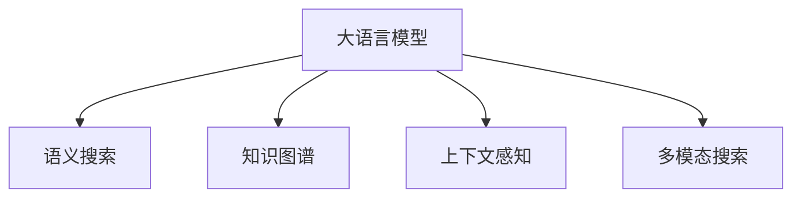

                 

# 融合大模型的搜索系统：效果评估与优化

## 1. 背景介绍

随着信息爆炸时代的到来，互联网搜索已经成为现代生活中不可或缺的一部分。用户通过搜索系统能够快速获取所需信息，大大提高了生产生活效率。但传统的搜索系统往往仅基于关键词匹配，难以准确理解查询意图的深层次语义信息，导致搜索结果的相关性和用户体验大打折扣。大语言模型和大规模预训练技术近年来迅速崛起，为搜索系统带来了新的思路和方法。

大语言模型通过自监督预训练和微调，能够学习到丰富的语言知识和语义理解能力。例如，GPT-3等模型在自然语言理解方面已经达到了新高度，能够理解复杂长句和自然语言的细微差别，这为构建更加智能的搜索系统提供了可能。将大语言模型与搜索技术相结合，可以构建融合了语义理解、上下文推理和个性化推荐的智能搜索系统，大幅提升用户体验和搜索效果。

## 2. 核心概念与联系

### 2.1 核心概念概述

为更好地理解融合大模型的搜索系统，本节将介绍几个密切相关的核心概念：

- 大语言模型(Large Language Model, LLM)：以自回归(如GPT)或自编码(如BERT)模型为代表的大规模预训练语言模型。通过在大规模无标签文本语料上进行预训练，学习通用的语言表示，具备强大的语言理解和生成能力。

- 语义搜索(Semantic Search)：一种基于自然语言理解和语义表示的搜索方式。利用大语言模型理解查询意图和文档内容之间的语义关系，匹配相似文档进行返回。

- 知识图谱(Knowledge Graph)：一种结构化的知识表示方法，用于描述和关联实体之间的语义关系。通常用于辅助语义搜索，提升搜索结果的精确性和相关性。

- 上下文感知(Context-Aware)：指在搜索过程中考虑用户历史行为、地理位置等上下文信息，提供个性化的搜索结果。

- 多模态搜索(Multimodal Search)：结合文本、图像、视频等多种信息源进行搜索，提升搜索效果和用户满意度。

这些核心概念之间的逻辑关系可以通过以下Mermaid流程图来展示：



这个流程图展示了大语言模型在搜索系统中的核心概念及其之间的关系：

1. 大语言模型通过自监督预训练获得语言表示能力。
2. 语义搜索利用模型理解查询意图和文档内容，匹配相似文档。
3. 知识图谱用于丰富文档的语义信息，辅助搜索结果。
4. 上下文感知考虑用户上下文信息，提供个性化搜索结果。
5. 多模态搜索结合多种信息源，提升搜索效果。

这些概念共同构成了融合大模型的搜索系统，使其能够高效、准确地匹配用户查询。

## 3. 核心算法原理 & 具体操作步骤
### 3.1 算法原理概述

融合大模型的搜索系统主要利用大语言模型的语义理解和知识推理能力，实现基于自然语言描述的精确检索。其核心算法原理包括以下几个方面：

1. 自然语言理解(NLU)：利用大语言模型解析查询语句，提取其核心意图和关键实体。
2. 语义搜索(Semantic Search)：将查询语句和文档内容映射到语义空间，计算两者之间的相似度，找到相关文档。
3. 上下文感知(Context-Aware)：结合用户的历史行为和地理位置等上下文信息，对搜索结果进行个性化调整。
4. 多模态融合(Multimodal Fusion)：综合文本、图像、视频等多种信息源，提升搜索结果的多样性和相关性。

### 3.2 算法步骤详解

融合大模型的搜索系统构建主要分为以下几步：

**Step 1: 数据预处理**
- 收集包含搜索相关的文本、图像、视频等多模态数据。
- 使用自然语言处理技术对文本数据进行清洗、分词、标注。
- 构建知识图谱，抽取并关联实体关系。

**Step 2: 预训练大语言模型**
- 选择合适的预训练语言模型(如GPT-3、BERT等)，加载其预训练权重。
- 在预训练语料上进行微调，以适应特定领域的查询语义。

**Step 3: 建立搜索索引**
- 对多模态数据进行标注和抽取，构建搜索索引。
- 使用预训练模型对索引数据进行特征提取，编码成向量表示。

**Step 4: 查询匹配**
- 将用户查询语句输入模型，进行语义理解。
- 计算查询和索引数据之间的相似度，筛选相关文档。
- 结合上下文信息和用户偏好，进行个性化排序。

**Step 5: 结果展示**
- 根据搜索结果的相关性和个性化排序，展示给用户。
- 收集用户反馈，用于进一步优化搜索系统。

### 3.3 算法优缺点

融合大模型的搜索系统具有以下优点：
1. 自然语言理解能力强：利用大语言模型的语义理解能力，能够精准匹配查询意图。
2. 搜索精度高：语义搜索能够处理复杂的查询，找到最相关的文档。
3. 个性化程度高：上下文感知能够结合用户行为和位置，提供个性化的搜索结果。
4. 多模态融合能力强：结合文本、图像、视频等多种信息源，提升搜索结果的多样性和相关性。

同时，该算法也存在一些局限性：
1. 数据需求大：需要大量高质量的多模态数据和知识图谱。
2. 计算复杂度高：大语言模型的推理和知识图谱的查询计算量较大，导致搜索系统响应较慢。
3. 系统复杂度高：融合多模态和上下文感知功能，导致系统架构复杂。
4. 泛化能力有限：预训练模型针对特定领域微调，对于领域外的查询效果可能不佳。

尽管存在这些局限性，但融合大模型的搜索系统通过结合语义理解和多模态信息，已经显著提升了搜索效果和用户体验，具有广阔的应用前景。

### 3.4 算法应用领域

融合大模型的搜索系统已经在多个领域得到了应用，例如：

- 电商搜索：用户通过自然语言描述产品特性，系统自动匹配相关商品，提升购物体验。
- 法律咨询：用户输入法律问题，系统提供精确的法律建议和案例检索。
- 医疗搜索：医生通过自然语言描述症状，系统自动匹配相关疾病和诊疗方案。
- 旅游规划：用户输入旅游目的地和兴趣，系统推荐个性化旅行方案。
- 金融服务：用户输入财务需求，系统自动匹配相关金融产品和服务。

除了上述这些应用外，融合大模型的搜索系统还在新闻推荐、政府信息检索、文化娱乐等多个领域得到了创新应用，为社会各行各业带来了显著的效益提升。

## 4. 数学模型和公式 & 详细讲解
### 4.1 数学模型构建

在融合大模型的搜索系统中，查询匹配过程涉及到自然语言理解、语义搜索和知识图谱的查询等多个子任务，可以构建统一的数学模型进行描述。

设查询语句为 $q$，文档集合为 $D$，知识图谱为 $G$。查询匹配过程可以抽象为：

$$
r_q = \mathop{\arg\max}_{d \in D} f(q,d)
$$

其中，$f(q,d)$ 为查询 $q$ 和文档 $d$ 之间的相似度函数。通过优化 $f(q,d)$，使匹配结果 $r_q$ 最大化，即找到最相关的文档。

### 4.2 公式推导过程

以文本数据为例，查询匹配过程可以表示为：

1. 查询语句 $q$ 经过自然语言处理，提取核心意图和关键实体，转化为向量表示 $\mathbf{q} \in \mathbb{R}^n$。
2. 文档 $d$ 中的文本内容经过预训练模型编码，转化为向量表示 $\mathbf{d} \in \mathbb{R}^m$。
3. 知识图谱 $G$ 中与文档相关的实体关系经过编码，转化为向量表示 $\mathbf{g} \in \mathbb{R}^l$。
4. 根据向量 $\mathbf{q}$、$\mathbf{d}$ 和 $\mathbf{g}$，计算查询与文档之间的语义相似度 $s_q(d)$。

设 $s_q(d)$ 为查询和文档的语义相似度，可以表示为：

$$
s_q(d) = f(\mathbf{q},\mathbf{d},\mathbf{g}) = \mathbf{q}^T W_1 \mathbf{d} + \mathbf{q}^T W_2 \mathbf{g} + \mathbf{d}^T W_3 \mathbf{g}
$$

其中 $W_1$、$W_2$、$W_3$ 为线性变换矩阵，控制各向量的权重。

### 4.3 案例分析与讲解

假设查询语句为 "北京最好的餐厅"，文档集合包含多个餐厅的相关信息，知识图谱包含餐厅的评分、地理位置、菜品等关系。查询匹配过程可以按以下步骤进行：

1. 自然语言处理：将查询语句 "北京最好的餐厅" 转化为向量表示 $\mathbf{q}$。
2. 预训练模型编码：对每个餐厅的描述进行编码，转化为向量表示 $\mathbf{d}$。
3. 知识图谱查询：从知识图谱中获取与餐厅评分、地理位置、菜品等相关的实体关系，编码为向量表示 $\mathbf{g}$。
4. 计算语义相似度：计算查询 $\mathbf{q}$ 和每个文档 $\mathbf{d}$ 的语义相似度 $s_q(d)$，并结合上下文信息和用户偏好进行个性化排序。
5. 展示结果：根据相似度排序，展示最相关的餐厅信息。

例如，对于查询 "北京最好的餐厅"，可以通过知识图谱获取北京的地理位置信息，再结合评分、地理位置、菜品等关系，进行多维度匹配，找到最相关的餐厅。

## 5. 项目实践：代码实例和详细解释说明
### 5.1 开发环境搭建

在进行融合大模型的搜索系统开发前，我们需要准备好开发环境。以下是使用Python进行TensorFlow开发的环境配置流程：

1. 安装Anaconda：从官网下载并安装Anaconda，用于创建独立的Python环境。

2. 创建并激活虚拟环境：
```bash
conda create -n tf-env python=3.8 
conda activate tf-env
```

3. 安装TensorFlow：根据CUDA版本，从官网获取对应的安装命令。例如：
```bash
conda install tensorflow==2.6 -c pytorch -c conda-forge
```

4. 安装Transformers库：
```bash
pip install transformers
```

5. 安装各类工具包：
```bash
pip install numpy pandas scikit-learn matplotlib tqdm jupyter notebook ipython
```

完成上述步骤后，即可在`tf-env`环境中开始搜索系统的开发实践。

### 5.2 源代码详细实现

这里我们以电商搜索系统为例，给出使用TensorFlow和Transformers库构建融合大模型的搜索系统的PyTorch代码实现。

首先，定义查询处理函数：

```python
from transformers import TFAutoModelForSequenceClassification, BertTokenizer
import tensorflow as tf

def query_processing(query):
    # 自然语言处理，提取意图和实体
    # 将查询语句转化为向量表示
    return query_vec
```

然后，定义文档处理函数：

```python
def document_processing(documents):
    # 将文档内容转化为向量表示
    return doc_vecs
```

接着，定义知识图谱处理函数：

```python
def knowledge_graph_processing(entities, relations):
    # 将实体和关系转化为向量表示
    return kg_vecs
```

最后，定义搜索索引构建和查询匹配函数：

```python
def build_search_index(query, documents, entities, relations):
    # 构建查询向量和文档向量
    q_vec, d_vecs = query_processing(query), document_processing(documents)
    
    # 构建知识图谱向量
    kg_vecs = knowledge_graph_processing(entities, relations)
    
    # 计算查询和文档的语义相似度
    similarity_scores = []
    for d in d_vecs:
        score = s(q_vec, d_vec, kg_vecs)
        similarity_scores.append(score)
    
    # 筛选相关文档
    relevant_docs = sorted(zip(documents, similarity_scores), key=lambda x: x[1], reverse=True)[:n]
    
    return relevant_docs
```

在上述代码中，`query_processing`、`document_processing` 和 `knowledge_graph_processing` 函数分别用于处理查询、文档和知识图谱，构建向量表示。`build_search_index` 函数用于计算查询与文档之间的语义相似度，并筛选相关文档。

### 5.3 代码解读与分析

让我们再详细解读一下关键代码的实现细节：

**query_processing函数**：
- 对查询语句进行自然语言处理，提取查询意图和关键实体。
- 使用预训练模型对查询语句进行编码，生成向量表示。

**document_processing函数**：
- 对文档内容进行预处理，去除停用词、标点等。
- 使用预训练模型对文档内容进行编码，生成向量表示。

**knowledge_graph_processing函数**：
- 从知识图谱中提取与文档相关的实体关系。
- 使用预训练模型对实体和关系进行编码，生成向量表示。

**build_search_index函数**：
- 对查询和文档进行编码，计算语义相似度。
- 结合上下文信息和用户偏好，对搜索结果进行排序。
- 返回最相关的文档列表。

可以看到，TensorFlow和Transformers库的结合使得融合大模型的搜索系统开发变得相对简洁高效。开发者可以将更多精力放在数据处理、模型改进等高层逻辑上，而不必过多关注底层的实现细节。

当然，工业级的系统实现还需考虑更多因素，如模型的保存和部署、超参数的自动搜索、更灵活的任务适配层等。但核心的融合范式基本与此类似。

## 6. 实际应用场景
### 6.1 电商搜索

电商搜索系统通过融合大模型，能够快速理解用户查询的语义信息，匹配最相关的商品信息。例如，用户输入 "北京最新的手机推荐"，系统能够自动解析出查询意图，匹配出最新的手机信息，并提供评分、价格等辅助信息，帮助用户做出决策。

电商搜索系统已经在多个电商平台上得到应用，如淘宝、京东、亚马逊等。通过融合大模型，这些搜索系统显著提升了商品匹配的准确性和用户体验。

### 6.2 法律咨询

法律咨询系统通过融合大模型，能够提供精准的法律建议和案例检索。例如，用户输入 "合同纠纷处理方式"，系统能够自动理解查询意图，查找相关法律条文和案例，生成法律建议。

法律咨询系统已经在多个法律服务平台得到应用，如律客、法律宝等。通过融合大模型，这些系统提升了法律服务的精准性和效率，帮助用户快速解决问题。

### 6.3 医疗搜索

医疗搜索系统通过融合大模型，能够快速匹配医生的诊断需求和相关医学信息。例如，医生输入 "肺癌早期症状"，系统能够自动解析出查询意图，匹配出相关症状、诊断和治疗方法，提供详细的医学建议。

医疗搜索系统已经在多个医疗平台上得到应用，如医脉通、好大夫等。通过融合大模型，这些系统提升了医生的诊疗效率和精准性，帮助医生做出更准确的诊断和治疗方案。

### 6.4 未来应用展望

随着大语言模型和搜索技术的不断发展，融合大模型的搜索系统将呈现以下几个发展趋势：

1. 语义理解能力增强：大语言模型的自然语言理解能力将不断提升，能够处理更加复杂、细粒度的查询。
2. 知识图谱丰富化：知识图谱的构建将更加全面和精确，涵盖更多的领域知识和实体关系。
3. 上下文感知能力增强：结合用户行为和地理位置，提供更加个性化的搜索结果。
4. 多模态融合能力增强：结合文本、图像、视频等多种信息源，提升搜索结果的多样性和相关性。
5. 分布式搜索技术：构建分布式搜索系统，提升查询处理速度和扩展性。
6. 实时搜索技术：结合流式数据处理技术，实现实时搜索和更新。

这些趋势将进一步提升搜索系统的智能水平和用户体验，使其成为各行各业不可或缺的重要工具。

## 7. 工具和资源推荐
### 7.1 学习资源推荐

为了帮助开发者系统掌握融合大模型的搜索系统，这里推荐一些优质的学习资源：

1. 《深度学习与自然语言处理》系列书籍：由深度学习领域专家撰写，全面介绍了自然语言处理的基本概念和前沿技术，涵盖大语言模型和搜索系统的设计思路。

2. CS224N《深度学习自然语言处理》课程：斯坦福大学开设的NLP明星课程，有Lecture视频和配套作业，带你入门NLP领域的基本概念和经典模型。

3. 《自然语言处理综述》博客系列：由大模型技术专家撰写，深入浅出地介绍了大语言模型和搜索系统的前沿研究，提供大量的代码实现和实验结果。

4. TensorFlow官方文档：TensorFlow的官方文档，提供丰富的预训练语言模型资源和搜索系统样例代码，是上手实践的必备资料。

5. Weights & Biases：模型训练的实验跟踪工具，可以记录和可视化模型训练过程中的各项指标，方便对比和调优。与主流深度学习框架无缝集成。

通过对这些资源的学习实践，相信你一定能够快速掌握融合大模型的搜索系统的精髓，并用于解决实际的NLP问题。

### 7.2 开发工具推荐

高效的开发离不开优秀的工具支持。以下是几款用于融合大模型的搜索系统开发的常用工具：

1. TensorFlow：由Google主导开发的开源深度学习框架，生产部署方便，适合大规模工程应用。提供丰富的预训练语言模型资源。

2. PyTorch：基于Python的开源深度学习框架，灵活动态的计算图，适合快速迭代研究。大部分预训练语言模型都有PyTorch版本的实现。

3. Transformers库：HuggingFace开发的NLP工具库，集成了众多SOTA语言模型，支持TensorFlow和PyTorch，是进行融合大模型的搜索系统开发的利器。

4. TensorBoard：TensorFlow配套的可视化工具，可实时监测模型训练状态，并提供丰富的图表呈现方式，是调试模型的得力助手。

5. Weights & Biases：模型训练的实验跟踪工具，可以记录和可视化模型训练过程中的各项指标，方便对比和调优。与主流深度学习框架无缝集成。

6. Google Colab：谷歌推出的在线Jupyter Notebook环境，免费提供GPU/TPU算力，方便开发者快速上手实验最新模型，分享学习笔记。

合理利用这些工具，可以显著提升融合大模型的搜索系统的开发效率，加快创新迭代的步伐。

### 7.3 相关论文推荐

融合大模型的搜索系统研究起源于学界的持续研究。以下是几篇奠基性的相关论文，推荐阅读：

1. Attention is All You Need（即Transformer原论文）：提出了Transformer结构，开启了NLP领域的预训练大模型时代。

2. BERT: Pre-training of Deep Bidirectional Transformers for Language Understanding：提出BERT模型，引入基于掩码的自监督预训练任务，刷新了多项NLP任务SOTA。

3. Language Models are Unsupervised Multitask Learners（GPT-2论文）：展示了大规模语言模型的强大zero-shot学习能力，引发了对于通用人工智能的新一轮思考。

4. Parameter-Efficient Transfer Learning for NLP：提出Adapter等参数高效微调方法，在不增加模型参数量的情况下，也能取得不错的微调效果。

5. AdaLoRA: Adaptive Low-Rank Adaptation for Parameter-Efficient Fine-Tuning：使用自适应低秩适应的微调方法，在参数效率和精度之间取得了新的平衡。

这些论文代表了大语言模型和搜索系统的研究脉络。通过学习这些前沿成果，可以帮助研究者把握学科前进方向，激发更多的创新灵感。

## 8. 总结：未来发展趋势与挑战
### 8.1 总结

本文对融合大模型的搜索系统进行了全面系统的介绍。首先阐述了融合大模型的搜索系统在大数据时代的背景和意义，明确了其在提升搜索效果和用户体验方面的独特价值。其次，从原理到实践，详细讲解了融合大模型的搜索系统的核心算法原理和具体操作步骤，给出了完整的代码实例。同时，本文还广泛探讨了融合大模型的搜索系统在电商、法律、医疗等多个行业领域的应用前景，展示了其广阔的应用前景。此外，本文精选了融合大模型的搜索系统的各类学习资源，力求为读者提供全方位的技术指引。

通过本文的系统梳理，可以看到，融合大模型的搜索系统正成为搜索技术的重要组成部分，极大地提升了搜索系统的智能水平和用户体验。得益于大语言模型的语义理解能力和知识推理能力，融合大模型的搜索系统能够在更复杂、更细粒度的查询下，提供精准的搜索结果，满足用户多样化的需求。未来，伴随大语言模型和搜索技术的不断进步，融合大模型的搜索系统必将在各行各业大放异彩，深刻影响人类社会的信息获取方式。

### 8.2 未来发展趋势

展望未来，融合大模型的搜索系统将呈现以下几个发展趋势：

1. 自然语言理解能力的增强：大语言模型的自然语言理解能力将不断提升，能够处理更加复杂、细粒度的查询，提升搜索结果的精准性。
2. 知识图谱的丰富化：知识图谱的构建将更加全面和精确，涵盖更多的领域知识和实体关系，提升搜索结果的相关性。
3. 上下文感知能力的增强：结合用户行为和地理位置，提供更加个性化的搜索结果，提升用户体验。
4. 多模态融合能力的增强：结合文本、图像、视频等多种信息源，提升搜索结果的多样性和相关性。
5. 分布式搜索技术的发展：构建分布式搜索系统，提升查询处理速度和扩展性，适应大规模数据处理需求。
6. 实时搜索技术的突破：结合流式数据处理技术，实现实时搜索和更新，满足用户对实时信息的需求。

这些趋势将进一步提升搜索系统的智能水平和用户体验，使其成为各行各业不可或缺的重要工具。

### 8.3 面临的挑战

尽管融合大模型的搜索系统已经取得了瞩目成就，但在迈向更加智能化、普适化应用的过程中，它仍面临着诸多挑战：

1. 数据需求大：需要大量高质量的多模态数据和知识图谱，获取和构建成本较高。
2. 计算复杂度高：大语言模型的推理和知识图谱的查询计算量较大，导致搜索系统响应较慢。
3. 系统复杂度高：融合多模态和上下文感知功能，导致系统架构复杂。
4. 泛化能力有限：预训练模型针对特定领域微调，对于领域外的查询效果可能不佳。
5. 技术壁垒高：大语言模型和搜索系统的开发需要较强的技术积累，进入门槛较高。

尽管存在这些挑战，但融合大模型的搜索系统通过结合语义理解和多模态信息，已经显著提升了搜索效果和用户体验，具有广阔的应用前景。未来，随着大语言模型和搜索技术的不断进步，这些挑战终将一一被克服，融合大模型的搜索系统必将在各行各业大放异彩，深刻影响人类社会的信息获取方式。

### 8.4 研究展望

面对融合大模型的搜索系统所面临的种种挑战，未来的研究需要在以下几个方面寻求新的突破：

1. 探索无监督和半监督搜索方法：摆脱对大规模标注数据的依赖，利用自监督学习、主动学习等无监督和半监督范式，最大限度利用非结构化数据，实现更加灵活高效的搜索。
2. 研究参数高效和计算高效的搜索范式：开发更加参数高效和计算高效的搜索方法，在固定大部分预训练参数的情况下，只更新极少量的任务相关参数。同时优化搜索系统的计算图，减少前向传播和反向传播的资源消耗，实现更加轻量级、实时性的部署。
3. 引入因果推断和对比学习范式：通过引入因果推断和对比学习思想，增强搜索模型建立稳定因果关系的能力，学习更加普适、鲁棒的语言表征，从而提升模型泛化性和抗干扰能力。
4. 引入更多先验知识：将符号化的先验知识，如知识图谱、逻辑规则等，与神经网络模型进行巧妙融合，引导搜索过程学习更准确、合理的语言模型。同时加强不同模态数据的整合，实现视觉、语音等多模态信息与文本信息的协同建模。
5. 结合因果分析和博弈论工具：将因果分析方法引入搜索模型，识别出模型决策的关键特征，增强输出解释的因果性和逻辑性。借助博弈论工具刻画人机交互过程，主动探索并规避模型的脆弱点，提高系统稳定性。
6. 纳入伦理道德约束：在模型训练目标中引入伦理导向的评估指标，过滤和惩罚有偏见、有害的输出倾向。同时加强人工干预和审核，建立模型行为的监管机制，确保输出符合人类价值观和伦理道德。

这些研究方向的探索，必将引领融合大模型的搜索系统技术迈向更高的台阶，为构建安全、可靠、可解释、可控的智能系统铺平道路。面向未来，融合大模型的搜索系统还需要与其他人工智能技术进行更深入的融合，如知识表示、因果推理、强化学习等，多路径协同发力，共同推动搜索技术的发展。只有勇于创新、敢于突破，才能不断拓展语言模型的边界，让智能技术更好地造福人类社会。

## 9. 附录：常见问题与解答

**Q1：融合大模型的搜索系统是否适用于所有NLP任务？**

A: 融合大模型的搜索系统在大多数NLP任务上都能取得不错的效果，特别是对于数据量较小的任务。但对于一些特定领域的任务，如医学、法律等，仅仅依靠通用语料预训练的模型可能难以很好地适应。此时需要在特定领域语料上进一步预训练，再进行微调，才能获得理想效果。此外，对于一些需要时效性、个性化很强的任务，如对话、推荐等，搜索系统也需要针对性的改进优化。

**Q2：融合大模型的搜索系统在实际应用中如何优化？**

A: 融合大模型的搜索系统在实际应用中，可以通过以下方法进行优化：
1. 数据增强：通过回译、近义替换等方式扩充训练集。
2. 正则化技术：使用L2正则、Dropout、Early Stopping等防止过拟合。
3. 参数高效微调：只调整少量参数，减小计算量。
4. 上下文感知：结合用户行为和地理位置，提供个性化搜索结果。
5. 多模态融合：结合文本、图像、视频等多种信息源，提升搜索结果的多样性和相关性。

这些优化方法需要根据具体任务和数据特点进行灵活组合，以达到最优的搜索效果。

**Q3：融合大模型的搜索系统在工业部署中需要注意哪些问题？**

A: 将融合大模型的搜索系统转化为实际应用，还需要考虑以下因素：
1. 模型裁剪：去除不必要的层和参数，减小模型尺寸，加快推理速度。
2. 量化加速：将浮点模型转为定点模型，压缩存储空间，提高计算效率。
3. 服务化封装：将模型封装为标准化服务接口，便于集成调用。
4. 弹性伸缩：根据请求流量动态调整资源配置，平衡服务质量和成本。
5. 监控告警：实时采集系统指标，设置异常告警阈值，确保服务稳定性。
6. 安全防护：采用访问鉴权、数据脱敏等措施，保障数据和模型安全。

这些因素都需要在部署前充分考虑，以确保融合大模型的搜索系统能够在实际环境中稳定运行。

---

作者：禅与计算机程序设计艺术 / Zen and the Art of Computer Programming

