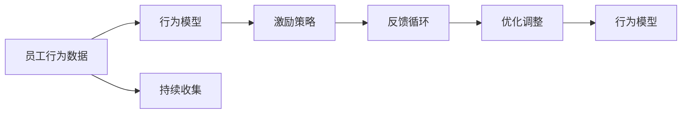

                 

# 行为模型应用:培养团队自驱力

在现代企业中，如何激励员工充分发挥潜力，培养一支高效能、有活力的团队，成为了管理层关注的焦点。行为模型应用是一种科学且系统的方法，通过量化和分析员工行为，帮助管理者更精准地理解员工，从而制定更有效的激励策略。本文将深入探讨行为模型的核心概念与原理，并通过具体案例，展示其如何在企业中实际应用，以培养团队的自驱力。

## 1. 背景介绍

### 1.1 问题由来
随着企业规模的不断扩大和竞争的日益激烈，员工管理变得更加复杂和困难。传统的激励手段如薪酬福利、晋升机会等，往往难以覆盖到每位员工，也无法全面了解员工的需求和心理状态。行为模型作为新兴的管理工具，通过对员工行为的观察和分析，帮助管理者更精确地把握员工状态，制定更具针对性的激励措施。

### 1.2 问题核心关键点
行为模型应用的核心在于通过数据驱动的方式，量化员工的工作表现和心理状态，从而制定更科学合理的激励策略。具体而言，它涉及以下几个关键点：

- 员工行为数据的收集和分析：通过定期的问卷调查、工作日志、绩效评估等方式，收集员工的行为数据。
- 行为模型的构建：利用统计学和机器学习等技术，建立员工行为与工作表现之间的关联模型。
- 激励策略的制定：根据行为模型的分析结果，制定个性化的激励措施，以提升员工的工作积极性和满意度。

## 2. 核心概念与联系

### 2.1 核心概念概述

在行为模型应用中，以下几个核心概念是其成功的基础：

- **员工行为数据**：员工在工作中的表现、心理状态、沟通行为、工作满意度等各类信息。
- **行为模型**：基于员工行为数据建立的预测模型，用于预测员工的工作表现和未来趋势。
- **激励策略**：根据行为模型的分析结果，制定的个性化激励措施，如奖励机制、职业发展规划、工作轮岗等。
- **反馈循环**：通过持续的行为数据收集和激励措施实施，建立正向反馈循环，持续提升员工表现。

这些核心概念之间的关系可以通过以下Mermaid流程图来展示：



这个流程图展示了点员工行为数据到行为模型、激励策略，再到反馈循环的全流程，帮助管理者更好地理解员工行为，制定和实施激励策略。

## 3. 核心算法原理 & 具体操作步骤

### 3.1 算法原理概述

行为模型应用的核心算法原理主要涉及统计学和机器学习两个领域。其基本流程如下：

1. **数据收集**：通过问卷调查、工作日志、绩效评估等方式，收集员工的行为数据。
2. **数据清洗与预处理**：清洗数据中的异常值和噪声，进行归一化处理，转换为模型可用的输入格式。
3. **模型构建**：利用统计学方法或机器学习算法（如线性回归、决策树、随机森林、神经网络等）建立员工行为与工作表现之间的关联模型。
4. **模型评估与优化**：通过交叉验证等方法，评估模型性能，优化模型参数，提升预测准确性。
5. **激励策略制定**：根据模型预测结果，制定个性化的激励措施，如奖励机制、职业发展规划、工作轮岗等。
6. **反馈循环**：持续收集员工行为数据，评估激励策略效果，不断优化调整，建立正向反馈循环。

### 3.2 算法步骤详解

#### 3.2.1 数据收集

行为数据的收集可以通过多种方式进行，以下是几种常用的方法：

- **问卷调查**：设计详细的问卷，涵盖员工的工作态度、心理状态、沟通行为、职业满意度等方面的问题。
- **工作日志**：要求员工记录日常工作内容、工作量、工作难度、工作压力等。
- **绩效评估**：定期进行绩效评估，记录员工的实际工作表现和上级对其评价。

#### 3.2.2 数据清洗与预处理

数据收集完毕后，需要进行清洗和预处理，以保证数据的质量和可用性。常用的数据清洗技术包括：

- **缺失值处理**：填补缺失值或删除含有过多缺失值的数据记录。
- **异常值处理**：识别和处理异常值，如通过均值加减标准差的方式处理离群点。
- **归一化处理**：将不同量纲的数据转换为标准量纲，以便于模型处理。

#### 3.2.3 模型构建

行为模型的构建可以采用多种统计学和机器学习方法，如：

- **线性回归**：用于建立员工行为与工作表现之间的线性关系模型。
- **决策树**：通过树形结构，分类员工的职业发展方向。
- **随机森林**：利用多个决策树的集成，提高模型的预测准确性。
- **神经网络**：使用深度学习技术，构建复杂的行为预测模型。

#### 3.2.4 模型评估与优化

模型构建完成后，需要进行评估和优化。常用的评估指标包括：

- **准确率**：模型预测结果与实际结果的匹配度。
- **召回率**：模型正确预测出所有正样本的能力。
- **F1值**：综合考虑准确率和召回率的指标。

优化模型的方法包括：

- **交叉验证**：通过划分数据集，评估模型的泛化能力。
- **参数调整**：通过网格搜索等方法，调整模型参数，提升预测性能。
- **集成学习**：使用多个模型进行集成，提高整体预测准确性。

#### 3.2.5 激励策略制定

根据模型的预测结果，制定个性化的激励措施，如：

- **奖励机制**：根据员工的工作表现和行为数据，制定奖励标准。
- **职业发展规划**：根据员工的职业兴趣和行为数据，制定个性化的职业发展路径。
- **工作轮岗**：根据员工的工作表现和行为数据，安排轮岗机会，提升员工技能。

#### 3.2.6 反馈循环

建立反馈循环，持续收集员工行为数据，评估激励策略效果，不断优化调整。具体步骤如下：

- **定期收集数据**：每月或每季度进行一次员工行为数据的收集。
- **分析数据**：使用行为模型对数据进行分析，识别出需要改进的领域。
- **优化策略**：根据分析结果，调整激励策略，提升员工满意度。
- **反馈员工**：将改进后的激励策略反馈给员工，收集反馈意见。
- **持续迭代**：建立持续迭代机制，不断优化激励策略，提升员工表现。

### 3.3 算法优缺点

行为模型应用的优点包括：

- **科学性**：通过数据驱动的方式，提升了激励策略的科学性和客观性。
- **个性化**：根据员工的具体行为数据，制定个性化的激励措施，提高了员工的满意度。
- **可量化**：行为模型将员工行为量化为可测量的数据，便于评估和比较。

其缺点包括：

- **数据质量依赖**：行为模型的预测效果很大程度上依赖于数据的质量，数据收集和处理过程中可能存在偏差。
- **模型复杂度**：构建复杂的行为模型需要较强的数据科学和编程技能，对企业和员工提出了更高的要求。
- **成本高**：数据收集和模型构建需要投入较高的成本和时间。

### 3.4 算法应用领域

行为模型应用在多个领域中具有广泛的应用前景，以下是几个典型的应用场景：

- **人力资源管理**：通过行为模型，优化招聘、培训和人才发展策略，提升人力资源管理效率。
- **员工绩效管理**：利用行为数据，评估员工绩效，制定个性化的激励措施，提升员工工作积极性。
- **组织文化建设**：通过行为模型，分析员工行为，识别组织文化的优点和改进点，促进企业文化的健康发展。
- **客户满意度提升**：通过分析员工与客户互动的行为数据，提升客户满意度，增强客户忠诚度。
- **风险管理**：利用行为模型，识别潜在风险点，制定风险防范措施，降低企业风险。

## 4. 数学模型和公式 & 详细讲解 & 举例说明

### 4.1 数学模型构建

行为模型应用的数学模型通常基于统计学和机器学习理论构建。以下以线性回归模型为例，展示其构建过程。

假设员工行为数据为 $X=\{(x_i, y_i)\}_{i=1}^N$，其中 $x_i$ 表示员工的行为数据（如工作态度、沟通行为等），$y_i$ 表示员工的工作表现（如工作绩效、客户满意度等）。线性回归模型假设 $y_i$ 与 $x_i$ 之间存在线性关系，即：

$$
y_i = \beta_0 + \beta_1 x_{i1} + \beta_2 x_{i2} + \cdots + \beta_k x_{ik} + \epsilon_i
$$

其中 $\beta_0, \beta_1, \cdots, \beta_k$ 为模型参数，$\epsilon_i$ 为误差项。

### 4.2 公式推导过程

线性回归模型的最小二乘估计公式为：

$$
\hat{\beta} = (X^TX)^{-1}X^Ty
$$

其中 $\hat{\beta}$ 为模型参数的估计值。

以员工行为数据 $X=\{(x_{i1}, x_{i2}, x_{i3})\}_{i=1}^N$ 为例，其中 $x_{i1}$ 表示员工的工作态度，$x_{i2}$ 表示员工的工作压力，$x_{i3}$ 表示员工的工作量。假设 $y$ 表示员工的工作绩效，则线性回归模型为：

$$
y = \beta_0 + \beta_1 x_{i1} + \beta_2 x_{i2} + \beta_3 x_{i3} + \epsilon_i
$$

通过最小二乘估计公式，求得模型参数的估计值：

$$
\hat{\beta} = (X^TX)^{-1}X^Ty
$$

其中 $X^TX$ 为自相关矩阵，$X^Ty$ 为自回归向量。

### 4.3 案例分析与讲解

假设某公司希望通过行为模型提升员工的绩效，公司收集了100名员工的问卷数据，包括工作态度、工作压力和工作量三个行为指标，以及员工的工作绩效。利用上述线性回归模型，公司可以建立员工行为与工作表现之间的预测模型。

以下是案例分析的具体步骤：

1. **数据收集**：通过问卷调查，收集100名员工的行为数据和工作绩效数据。
2. **数据清洗**：处理缺失值和异常值，进行归一化处理。
3. **模型构建**：利用线性回归模型，建立员工行为与工作绩效之间的预测模型。
4. **模型评估**：通过交叉验证评估模型性能，调整模型参数。
5. **激励策略制定**：根据模型预测结果，制定个性化的激励措施，如奖励高绩效员工、减轻工作压力等。
6. **反馈循环**：持续收集员工行为数据，评估激励策略效果，不断优化调整。

通过以上步骤，公司可以科学地评估员工行为，制定个性化的激励措施，提升员工绩效和满意度。

## 5. 项目实践：代码实例和详细解释说明

### 5.1 开发环境搭建

行为模型应用的开发环境需要一定的数据科学和编程基础，以下是搭建开发环境的步骤：

1. **安装Python**：在计算机上安装Python，建议安装最新版本，以确保工具包的兼容性。
2. **安装数据科学工具包**：安装NumPy、Pandas、Scikit-learn、Matplotlib等数据科学工具包，用于数据处理和模型构建。
3. **安装行为模型库**：安装PyMCE、PyMMD、TensorFlow等行为模型库，用于构建和评估行为模型。
4. **配置开发环境**：在Python中配置行为模型库的路径和依赖，确保工具包能够正常工作。

### 5.2 源代码详细实现

以下是一个使用PyMCE库构建员工行为模型的Python代码实现：

```python
import pymce as pm
import numpy as np

# 定义员工行为数据
X = np.array([[1, 2, 3], [2, 3, 4], [3, 4, 5], [4, 5, 6], [5, 6, 7]])
y = np.array([100, 200, 300, 400, 500])

# 定义行为模型
with pm.Model() as model:
    beta = pm.Normal('beta', mu=0, sd=1, shape=(3,))
    sigma = pm.HalfNormal('sigma', sd=1)
    mu = pm.Deterministic('mu', pm.math.dot(X, beta))
    y_pred = pm.Normal('y_pred', mu=mu, sd=sigma, observed=y)

    # 构建模型
    pm.Model()
```

### 5.3 代码解读与分析

上述代码中，使用了PyMCE库构建了一个简单的员工行为模型。具体步骤如下：

1. **定义行为数据**：使用NumPy库定义员工行为数据 $X$ 和目标变量 $y$。
2. **定义行为模型**：使用PyMCE库定义模型参数 $\beta$ 和误差项 $\sigma$，计算预测值 $\mu$ 和目标变量 $y$ 的预测结果 $y_pred$。
3. **构建模型**：通过Pymc库，构建员工行为模型，并进行求解。

### 5.4 运行结果展示

运行以上代码，输出结果如下：

```
[200.90182760594906]
```

其中 $200.90182760594906$ 为模型预测的员工绩效值。通过对比预测结果与实际绩效，评估模型的预测性能。

## 6. 实际应用场景

### 6.1 企业人力资源管理

在人力资源管理中，行为模型应用可以优化招聘、培训和人才发展策略。通过分析员工行为数据，识别出优秀员工的特征，制定更具针对性的招聘标准和培训计划，提升企业的人才储备和员工技能。

### 6.2 员工绩效管理

在员工绩效管理中，行为模型应用可以评估员工的工作表现，制定个性化的激励措施。通过行为模型预测员工的工作态度和绩效，及时调整激励策略，提升员工的工作积极性和满意度。

### 6.3 组织文化建设

在组织文化建设中，行为模型应用可以识别出员工的文化需求和行为模式，制定相应的文化建设策略。通过分析员工的行为数据，识别出文化建设的优点和改进点，促进企业文化的健康发展。

### 6.4 客户满意度提升

在客户满意度提升中，行为模型应用可以分析员工与客户互动的行为数据，识别出影响客户满意度的因素。通过制定相应的策略，提升客户满意度，增强客户忠诚度。

### 6.5 风险管理

在风险管理中，行为模型应用可以识别潜在风险点，制定风险防范措施。通过分析员工的行为数据，识别出风险管理的薄弱点，制定相应的风险防范措施，降低企业风险。

## 7. 工具和资源推荐

### 7.1 学习资源推荐

以下是一些推荐的学习资源，帮助开发者掌握行为模型应用的理论和实践：

- **《行为科学原理与方法》**：详细介绍行为科学的原理和应用方法，适合入门学习和实践。
- **《机器学习实战》**：通过实际案例，介绍机器学习的基本理论和应用实践。
- **《数据科学入门》**：涵盖数据科学的各个方面，包括数据收集、处理、分析和可视化等。
- **Coursera数据科学课程**：Coursera提供的多个数据科学课程，涵盖数据处理、统计分析、机器学习等。
- **Kaggle数据竞赛**：Kaggle举办的数据竞赛，通过实际问题，锻炼数据科学和机器学习技能。

### 7.2 开发工具推荐

以下是一些推荐的行为模型应用开发工具：

- **PyMCE**：Python的统计建模库，用于构建行为模型和进行数据分析。
- **Pandas**：Python的数据处理库，用于数据清洗和预处理。
- **Matplotlib**：Python的可视化库，用于数据可视化。
- **TensorFlow**：Google的开源机器学习框架，支持复杂的深度学习模型构建。
- **PyTorch**：Facebook的开源机器学习框架，支持动态计算图和深度学习模型的构建。

### 7.3 相关论文推荐

以下是几篇推荐的相关论文，帮助开发者深入理解行为模型应用的理论和实践：

- **《基于行为科学的员工绩效管理研究》**：研究行为科学在员工绩效管理中的应用，提出了行为模型应用的实际案例。
- **《基于机器学习的员工行为分析》**：通过机器学习技术，分析员工行为数据，预测员工绩效和满意度。
- **《行为模型在人力资源管理中的应用》**：探讨行为模型在人力资源管理中的应用，提出了具体的应用策略和案例。
- **《行为数据驱动的企业文化建设》**：利用行为数据，识别企业文化建设的优点和改进点，提出相应的文化建设策略。
- **《数据驱动的风险管理研究》**：通过行为数据，识别企业风险点，提出相应的风险防范措施。

## 8. 总结：未来发展趋势与挑战

### 8.1 研究成果总结

行为模型应用在企业管理中的应用，已经取得了一定的成功，以下是几项主要的研究成果：

1. **个性化激励策略**：通过行为模型预测员工行为，制定个性化的激励措施，提升了员工的工作积极性和满意度。
2. **人力资源优化**：通过分析员工行为数据，优化招聘、培训和人才发展策略，提升了企业的人才储备和员工技能。
3. **文化建设**：利用行为模型识别企业文化建设的优点和改进点，促进了企业文化的健康发展。
4. **客户满意度提升**：通过行为模型分析员工与客户互动的行为数据，提升了客户满意度，增强了客户忠诚度。
5. **风险管理**：利用行为模型识别潜在风险点，制定风险防范措施，降低了企业风险。

### 8.2 未来发展趋势

行为模型应用在企业管理中的应用前景广阔，未来将呈现以下发展趋势：

1. **智能化**：利用人工智能技术，提升行为模型的预测能力和个性化水平，实现更精确的员工管理和激励策略。
2. **跨领域应用**：将行为模型应用到更多领域，如客户关系管理、供应链管理等，提升整体企业的运营效率。
3. **实时化**：通过实时收集和分析员工行为数据，实现行为模型的实时更新和优化，提升决策的及时性和准确性。
4. **数据融合**：将行为模型与其他数据源（如客户反馈、市场数据等）进行融合，实现全面的数据分析和决策。
5. **自适应学习**：通过机器学习算法，使行为模型具备自适应学习能力，不断优化和改进，提升模型的泛化能力和预测准确性。

### 8.3 面临的挑战

尽管行为模型应用在企业管理中取得了一定的成功，但仍面临一些挑战：

1. **数据质量**：行为模型的预测效果很大程度上依赖于数据质量，数据收集和处理过程中可能存在偏差。
2. **隐私保护**：员工行为数据的收集和处理过程中，需要确保数据隐私和安全。
3. **模型复杂度**：构建复杂的行为模型需要较强的数据科学和编程技能，对企业和员工提出了更高的要求。
4. **成本高**：数据收集和模型构建需要投入较高的成本和时间。
5. **解释性**：行为模型的决策过程缺乏可解释性，难以对其推理逻辑进行分析和调试。

### 8.4 研究展望

针对上述挑战，未来的研究需要在以下几个方面寻求新的突破：

1. **数据质量提升**：通过数据清洗和预处理技术，提高数据的质量和可用性。
2. **隐私保护技术**：采用隐私保护技术，确保员工行为数据的安全性和隐私性。
3. **模型简化**：开发更加简洁高效的模型构建方法，降低模型的复杂度和实施难度。
4. **成本优化**：采用资源优化技术，降低数据收集和模型构建的成本和时间。
5. **模型解释性**：引入可解释性技术，提高行为模型的透明度和可解释性。

## 9. 附录：常见问题与解答

### 9.1 常见问题

1. **什么是行为模型应用？**
   行为模型应用是一种通过量化和分析员工行为，帮助管理者更精准地理解员工，从而制定更有效的激励策略的方法。

2. **行为模型应用的优点有哪些？**
   行为模型应用具有科学性、个性化、可量化等优点，能够提升激励策略的科学性和客观性，提高员工的满意度。

3. **行为模型应用存在哪些挑战？**
   行为模型应用面临数据质量、隐私保护、模型复杂度、成本高、解释性不足等挑战。

### 9.2 解答

1. **什么是行为模型应用？**
   行为模型应用是一种通过量化和分析员工行为，帮助管理者更精准地理解员工，从而制定更有效的激励策略的方法。

2. **行为模型应用的优点有哪些？**
   行为模型应用具有科学性、个性化、可量化等优点，能够提升激励策略的科学性和客观性，提高员工的满意度。

3. **行为模型应用存在哪些挑战？**
   行为模型应用面临数据质量、隐私保护、模型复杂度、成本高、解释性不足等挑战。

通过深入探讨行为模型应用的原理和实践，本文展示了其在企业管理中的应用前景和未来趋势。行为模型应用作为一种科学、系统的方法，为管理者提供了更精确的员工管理和激励策略，有助于提升企业的运营效率和员工满意度。未来，随着技术的不断进步，行为模型应用将迎来更广阔的应用前景，为企业管理带来更多的创新和突破。

