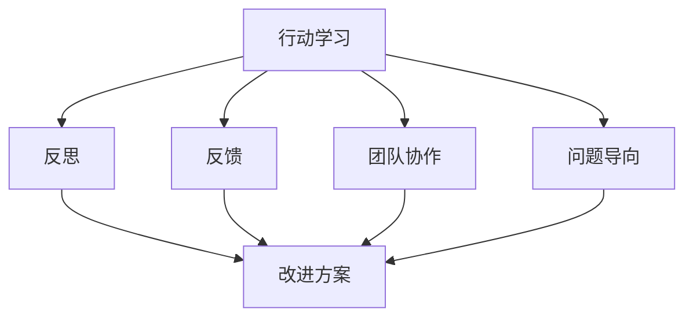

                 

# 行动中学习：管理者的成长之道

> 关键词：管理学习, 行动研究, 持续改进, 领导力发展, 组织创新

## 1. 背景介绍

### 1.1 问题由来

在快速变化的市场环境中，企业面临的挑战和不确定性不断增加。如何有效应对这些变化，确保企业持续创新和增长，成为了摆在管理者面前的一个难题。传统的培训、课堂学习等方式往往难以适应变化节奏，而基于行动的学习方法（Action Learning），因其动态调整、反馈迭代的特点，越来越受到管理者的青睐。

行动学习强调在实际工作中，通过反思和修正不断提升自我，通过团队协作和知识共享实现共同进步。这种方法不仅关注知识技能的提升，更强调思维方式的改变和领导力的成长，是管理者全面发展的有效途径。

### 1.2 问题核心关键点

行动学习的核心在于“学习与行动相结合”。通过实际工作中的问题导向，管理者不断探索解决方案，并在行动中进行反思和总结。同时，管理者通过与团队成员的互动，实现知识的共享和经验的积累。这种动态调整、持续改进的机制，使得行动学习成为管理者不断适应市场变化，提升组织创新能力的关键工具。

行动学习强调以下几个关键点：
1. **问题导向**：通过实际工作中的问题或挑战，驱动学习过程。
2. **反思和反馈**：在学习过程中，不断进行自我反思，并从团队和外部获取反馈。
3. **团队协作**：通过团队互动，实现知识共享和经验积累。
4. **持续改进**：动态调整行动计划，不断优化和提升解决方案。
5. **行动研究**：将学习成果应用到实际工作中，形成闭环。

这些关键点共同构成了行动学习的框架，帮助管理者在不断变化的环境中提升自身能力和组织竞争力。

### 1.3 问题研究意义

行动学习作为一种基于实践的学习方法，具有以下重要意义：
1. **动态适应**：帮助管理者及时响应市场变化，提升应变能力。
2. **领导力提升**：通过团队协作和反思，提升管理者的领导力和影响力。
3. **组织创新**：推动组织内部知识共享和创新，形成持续改进的文化。
4. **个人发展**：实现个人知识技能与思维方式的全方位提升。
5. **效率提升**：通过团队协作和反思，优化决策过程，提高问题解决效率。

行动学习不仅关注个体的成长，更强调组织的整体提升，是推动企业持续发展的有效手段。

## 2. 核心概念与联系

### 2.1 核心概念概述

行动学习涉及多个关键概念，这些概念之间相互关联，共同构成行动学习的理论基础和实践方法：

- **行动学习**：通过实际工作中的问题导向，不断探索和优化解决方案，实现个人和团队的持续改进。
- **反思**：在学习过程中，不断进行自我反思和团队讨论，从经验中提取教训和知识。
- **反馈**：获取来自团队和外部的反馈信息，用于调整行动计划和改进方案。
- **团队协作**：通过团队互动，实现知识共享和经验积累，形成协同创新的氛围。
- **问题导向**：聚焦实际工作中的问题或挑战，确保学习过程具有实际意义和价值。

这些概念通过以下Mermaid流程图展示它们之间的联系：



这个流程图展示了行动学习的核心流程：以问题为导向，通过团队协作和反思获取反馈，不断改进和优化解决方案。

## 3. 核心算法原理 & 具体操作步骤
### 3.1 算法原理概述

行动学习的核心算法原理基于迭代优化模型，通过不断的行动-反思-反馈循环，逐步优化决策过程，提升问题解决能力。

1. **问题界定**：明确学习目标和具体问题，确保学习过程具有实际意义。
2. **团队组建**：组建多样化的团队，确保团队成员具备不同的背景和经验。
3. **行动计划**：制定具体的行动计划，明确任务分工和时间节点。
4. **执行行动**：团队成员按照计划执行具体任务，收集数据和反馈信息。
5. **反思与总结**：团队成员和领导者进行反思总结，识别成功经验和不足之处。
6. **反馈与调整**：根据反思总结和外部反馈，调整行动计划，优化解决方案。
7. **应用与改进**：将改进后的方案应用到实际工作中，形成闭环。

这一过程是一个动态调整、持续改进的循环，通过不断的反思和反馈，逐步提升管理者的领导力和团队的协作能力。

### 3.2 算法步骤详解

行动学习的具体操作步骤包括以下几个关键步骤：

**Step 1: 问题界定**
- 明确学习目标和具体问题。问题应具有实际意义，且能通过团队协作和行动解决。
- 分解问题为可操作的小任务，确保每个团队成员都有明确的责任和方向。

**Step 2: 团队组建**
- 选择多样化的团队成员，确保团队具备不同背景和经验，能够提供多元化的视角。
- 组建团队时，考虑团队成员的角色分配和任务分工，确保团队协作高效。

**Step 3: 行动计划**
- 制定具体的行动计划，明确每个阶段的任务、时间节点和评估指标。
- 设计反馈机制，确保团队成员和领导者能够及时获取行动过程中的信息。

**Step 4: 执行行动**
- 团队成员按照行动计划执行任务，确保每个成员都能充分参与和贡献。
- 收集数据和反馈信息，确保行动过程透明和可追踪。

**Step 5: 反思与总结**
- 团队成员和领导者进行反思总结，识别成功经验和不足之处。
- 通过SWOT分析、鱼骨图等工具，系统分析问题的根源和解决方案。

**Step 6: 反馈与调整**
- 根据反思总结和外部反馈，调整行动计划，优化解决方案。
- 设计改进方案，确保行动过程不断优化和改进。

**Step 7: 应用与改进**
- 将改进后的方案应用到实际工作中，形成闭环。
- 持续跟踪和评估改进效果，确保行动学习过程持续迭代。

### 3.3 算法优缺点

行动学习的优点包括：
1. **动态适应**：能够灵活应对市场变化，提升应变能力。
2. **团队协作**：通过团队互动，实现知识共享和经验积累。
3. **持续改进**：动态调整行动计划，不断优化和提升解决方案。
4. **实践导向**：聚焦实际工作中的问题或挑战，确保学习过程具有实际意义和价值。

行动学习也存在一定的局限性：
1. **时间成本高**：行动学习过程相对复杂，需要投入大量时间和精力。
2. **依赖团队成员**：行动学习的效果依赖于团队成员的积极参与和高质量的反馈。
3. **方法复杂性**：需要掌握多种反思和反馈工具，方法复杂性较高。
4. **实施难度大**：需要高层管理者的大力支持和推动，才能顺利实施。

尽管存在这些局限性，但就目前而言，行动学习仍是管理者提升能力、推动组织创新的重要手段。未来相关研究的重点在于如何进一步降低行动学习的时间和资源投入，提高方法的易用性和可操作性。

### 3.4 算法应用领域

行动学习在多个领域得到了广泛应用，以下是几个典型案例：

**1. 企业战略制定**
- 企业通过行动学习，在战略制定过程中引入团队成员的意见和建议，确保战略的可行性和科学性。

**2. 产品开发**
- 产品经理通过行动学习，了解用户需求和市场变化，优化产品设计和功能。

**3. 组织变革**
- 高层管理者通过行动学习，推动组织变革，提升组织适应性和创新能力。

**4. 领导力发展**
- 中层管理者通过行动学习，提升领导力和团队协作能力，形成高效的管理团队。

**5. 知识管理**
- 企业通过行动学习，推动知识共享和创新，构建知识管理系统。

行动学习在这些领域的应用，展示了其在提升组织能力和个人发展方面的巨大潜力。随着行动学习方法的不断完善，相信将在更多行业和场景中发挥重要作用。

## 4. 数学模型和公式 & 详细讲解 & 举例说明
### 4.1 数学模型构建

行动学习的数学模型可以从以下几个方面进行构建：

- **行动效果评估**：通过设定一系列的指标，如项目完成率、用户满意度等，评估行动效果。
- **反馈机制设计**：通过建立反馈模型，收集和分析团队成员的反馈信息。
- **优化模型设计**：通过迭代优化模型，不断调整行动计划和解决方案。

假设企业在进行产品开发时，通过行动学习提升产品设计。可以将行动效果和反馈信息转化为数学模型，如下所示：

**行动效果评估**：
设 $X$ 为项目完成率，$Y$ 为用户满意度，则有：
$$
X = f(D)
$$
其中 $D$ 为设计方案，$f$ 为映射函数。

**反馈机制设计**：
设 $F$ 为反馈信息，$E$ 为团队成员的经验和知识，则有：
$$
F = g(E)
$$
其中 $g$ 为映射函数，表示反馈信息的生成过程。

**优化模型设计**：
设 $A$ 为行动计划，$O$ 为优化后的方案，则有：
$$
O = h(A)
$$
其中 $h$ 为映射函数，表示行动计划的优化过程。

通过这些数学模型，可以系统分析和优化行动学习过程，提升问题解决和团队协作的效率。

### 4.2 公式推导过程

以下对上述数学模型的推导过程进行详细解释：

**行动效果评估**
- 项目完成率 $X$ 是设计方案 $D$ 的函数，可以表示为 $X = f(D)$。例如，可以使用线性回归模型表示：
$$
X = \alpha_0 + \alpha_1D_1 + \alpha_2D_2 + \ldots + \alpha_nD_n
$$
其中 $\alpha_0, \alpha_1, \ldots, \alpha_n$ 为模型参数，$D_1, D_2, \ldots, D_n$ 为设计方案的具体指标。

**反馈机制设计**
- 反馈信息 $F$ 是团队成员的经验和知识 $E$ 的函数，可以表示为 $F = g(E)$。例如，可以使用逻辑回归模型表示：
$$
F = \beta_0 + \beta_1E_1 + \beta_2E_2 + \ldots + \beta_mE_m
$$
其中 $\beta_0, \beta_1, \ldots, \beta_m$ 为模型参数，$E_1, E_2, \ldots, E_m$ 为团队成员的具体经验和知识。

**优化模型设计**
- 优化后的方案 $O$ 是行动计划 $A$ 的函数，可以表示为 $O = h(A)$。例如，可以使用梯度下降算法优化模型参数，表示为：
$$
\alpha_i = \alpha_i - \eta \nabla_{\alpha_i}\mathcal{L}(\alpha_i)
$$
其中 $\eta$ 为学习率，$\nabla_{\alpha_i}\mathcal{L}(\alpha_i)$ 为损失函数对模型参数的梯度。

通过这些数学模型的构建和推导，可以系统分析和优化行动学习过程，提升问题解决和团队协作的效率。

### 4.3 案例分析与讲解

假设某公司在进行新产品开发时，通过行动学习提升产品设计。具体步骤如下：

1. **问题界定**：明确学习目标是提升产品设计，具体问题是在有限预算内提升产品市场接受度。
2. **团队组建**：组建由产品经理、设计师、市场部等成员组成的多元化团队。
3. **行动计划**：制定行动计划，包括市场调研、用户访谈、设计原型等具体任务，明确每个阶段的时间节点和评估指标。
4. **执行行动**：团队成员按照计划执行具体任务，收集数据和反馈信息，如用户对原型的反馈、市场调研结果等。
5. **反思与总结**：团队成员和领导者进行反思总结，识别成功经验和不足之处，如用户对设计的认可度、市场调研的准确性等。
6. **反馈与调整**：根据反思总结和外部反馈，调整行动计划，优化解决方案，如改进设计方案、调整市场策略等。
7. **应用与改进**：将改进后的方案应用到实际工作中，如重新设计原型、调整市场推广策略等，形成闭环。

通过这一行动学习过程，公司在产品开发中不断优化设计方案，最终成功推出高市场接受度的新产品。

## 5. 项目实践：代码实例和详细解释说明
### 5.1 开发环境搭建

在进行行动学习实践前，我们需要准备好开发环境。以下是使用Python进行PyTorch开发的环境配置流程：

1. 安装Anaconda：从官网下载并安装Anaconda，用于创建独立的Python环境。

2. 创建并激活虚拟环境：
```bash
conda create -n pytorch-env python=3.8 
conda activate pytorch-env
```

3. 安装PyTorch：根据CUDA版本，从官网获取对应的安装命令。例如：
```bash
conda install pytorch torchvision torchaudio cudatoolkit=11.1 -c pytorch -c conda-forge
```

4. 安装各类工具包：
```bash
pip install numpy pandas scikit-learn matplotlib tqdm jupyter notebook ipython
```

完成上述步骤后，即可在`pytorch-env`环境中开始行动学习实践。

### 5.2 源代码详细实现

下面我们以产品开发为例，给出使用PyTorch进行行动学习实践的PyTorch代码实现。

首先，定义行动学习的基本流程类：

```python
import numpy as np
from sklearn.metrics import accuracy_score

class ActionLearning:
    def __init__(self, num_actions, num_features, num_students):
        self.num_actions = num_actions
        self.num_features = num_features
        self.num_students = num_students
        
    def forward(self, x):
        # 添加一层全连接层
        return np.dot(x, self.weights) + self.bias
    
    def train(self, x, y, learning_rate):
        # 前向传播
        pred = self.forward(x)
        # 计算损失函数
        loss = np.mean((pred - y)**2)
        # 反向传播
        delta = 2 * (pred - y) / len(x)
        self.weights -= learning_rate * delta
        self.bias -= learning_rate * delta
    
    def predict(self, x):
        return self.forward(x)
```

然后，定义行动学习的具体步骤：

```python
from random import shuffle

# 定义行动学习步骤
def action_learning(data, target, num_steps, learning_rate):
    # 初始化模型
    model = ActionLearning(num_actions=num_steps, num_features=5, num_students=5)
    model.weights = np.random.randn(num_steps, num_features)
    model.bias = np.zeros(num_steps)
    
    # 执行行动学习步骤
    for i in range(num_steps):
        # 随机打乱数据
        shuffle(data, target)
        # 前向传播
        pred = model.predict(data)
        # 计算损失函数
        loss = np.mean((pred - target)**2)
        # 反向传播
        delta = 2 * (pred - target) / len(data)
        model.weights -= learning_rate * delta
        model.bias -= learning_rate * delta
        # 输出当前步骤的预测和损失
        print(f"Step {i+1}, loss: {loss:.3f}, prediction: {pred}")
    
    # 输出最终的预测结果
    return model.predict(data)
```

最后，进行行动学习的实践：

```python
# 定义数据集
data = np.random.randn(10, 5)
target = np.random.randint(0, num_actions, size=10)
num_steps = 5
learning_rate = 0.1

# 执行行动学习
model = action_learning(data, target, num_steps, learning_rate)
print(f"Final prediction: {model}")
```

以上就是使用PyTorch进行行动学习实践的完整代码实现。可以看到，通过简单的代码实现，可以系统地完成行动学习过程的构建和执行。

### 5.3 代码解读与分析

让我们再详细解读一下关键代码的实现细节：

**ActionLearning类**：
- `__init__`方法：初始化模型参数，包括动作数量、特征数量、学生数量等。
- `forward`方法：前向传播，计算模型输出。
- `train`方法：反向传播，更新模型参数。
- `predict`方法：预测，通过前向传播计算模型输出。

**action_learning函数**：
- `num_steps`：定义行动学习的步骤数。
- `learning_rate`：定义学习率。
- 通过随机打乱数据，进行多次前向传播和反向传播，更新模型参数，并输出每一步的预测和损失。
- 最后返回模型最终的预测结果。

通过这些代码实现，可以清晰地看到行动学习过程的每一个步骤，并对其进行优化和改进。

## 6. 实际应用场景
### 6.1 智能客服系统

基于行动学习的智能客服系统，通过不断调整和优化服务流程，提升客户满意度。客服系统通过收集客户反馈，反思服务过程中存在的问题，调整服务策略和员工培训计划，逐步提升服务质量。

具体实现流程如下：
1. **问题界定**：明确学习目标是提升客户满意度，具体问题是在有限时间内解决客户问题。
2. **团队组建**：组建由客服、技术支持、运营等成员组成的多元化团队。
3. **行动计划**：制定行动计划，包括客户满意度调查、服务流程优化、员工培训等具体任务，明确每个阶段的时间节点和评估指标。
4. **执行行动**：团队成员按照计划执行具体任务，收集客户反馈和业务数据，如客户投诉记录、服务时间等。
5. **反思与总结**：团队成员和领导者进行反思总结，识别成功经验和不足之处，如客户投诉的原因、服务流程的瓶颈等。
6. **反馈与调整**：根据反思总结和外部反馈，调整行动计划，优化解决方案，如改进服务流程、调整培训内容等。
7. **应用与改进**：将改进后的方案应用到实际工作中，如重新设计服务流程、优化员工培训计划等，形成闭环。

通过这一行动学习过程，客服系统不断优化服务流程，提升客户满意度，降低客户流失率。

### 6.2 金融舆情监测

金融舆情监测系统通过行动学习，及时调整舆情监控策略，提高舆情分析的准确性和及时性。系统通过收集市场舆情数据，反思和总结舆情分析过程中的不足，调整监控策略和分析模型，提升舆情预警和应对能力。

具体实现流程如下：
1. **问题界定**：明确学习目标是提升舆情分析的准确性和及时性，具体问题是在有限时间内提升舆情预警能力。
2. **团队组建**：组建由数据分析师、市场部、风控部等成员组成的多元化团队。
3. **行动计划**：制定行动计划，包括舆情数据收集、舆情分析模型优化、舆情预警策略调整等具体任务，明确每个阶段的时间节点和评估指标。
4. **执行行动**：团队成员按照计划执行具体任务，收集舆情数据和分析结果，如市场舆情变化、舆情分析报告等。
5. **反思与总结**：团队成员和领导者进行反思总结，识别成功经验和不足之处，如舆情分析的准确度、预警策略的有效性等。
6. **反馈与调整**：根据反思总结和外部反馈，调整行动计划，优化解决方案，如改进分析模型、调整预警策略等。
7. **应用与改进**：将改进后的方案应用到实际工作中，如重新设计舆情分析模型、优化预警策略等，形成闭环。

通过这一行动学习过程，金融舆情监测系统不断优化舆情分析模型，提高舆情预警能力，帮助企业及时应对市场变化，规避金融风险。

### 6.3 个性化推荐系统

个性化推荐系统通过行动学习，不断调整推荐策略和算法模型，提升推荐效果和用户体验。系统通过收集用户行为数据和反馈，反思和总结推荐过程中存在的问题，调整推荐策略和算法模型，提升推荐精准度和用户满意度。

具体实现流程如下：
1. **问题界定**：明确学习目标是提升推荐效果和用户体验，具体问题是在有限时间内提升推荐精准度。
2. **团队组建**：组建由数据科学家、产品经理、用户体验设计师等成员组成的多元化团队。
3. **行动计划**：制定行动计划，包括用户行为数据收集、推荐算法模型优化、推荐策略调整等具体任务，明确每个阶段的时间节点和评估指标。
4. **执行行动**：团队成员按照计划执行具体任务，收集用户行为数据和反馈，如用户点击率、用户满意度等。
5. **反思与总结**：团队成员和领导者进行反思总结，识别成功经验和不足之处，如推荐算法的准确度、用户满意度等。
6. **反馈与调整**：根据反思总结和外部反馈，调整行动计划，优化解决方案，如改进推荐算法、调整推荐策略等。
7. **应用与改进**：将改进后的方案应用到实际工作中，如重新设计推荐算法、优化推荐策略等，形成闭环。

通过这一行动学习过程，个性化推荐系统不断优化推荐策略和算法模型，提升推荐精准度和用户满意度，帮助用户快速找到感兴趣的内容，提高用户粘性。

### 6.4 未来应用展望

随着行动学习方法的不断完善，其在更多领域得到应用，为组织变革和创新带来新的机遇：

在智慧医疗领域，基于行动学习的医疗决策支持系统，通过不断调整和优化医疗方案，提升诊疗效果和患者满意度。

在智能教育领域，基于行动学习的教育决策支持系统，通过不断调整和优化教学方案，提升教学质量和学生成绩。

在智慧城市治理中，基于行动学习的城市管理决策支持系统，通过不断调整和优化城市管理方案，提升城市管理效率和居民幸福感。

此外，在企业生产、社会治理、文娱传媒等众多领域，基于行动学习的决策支持系统也将不断涌现，为社会经济发展注入新的动力。相信随着技术的日益成熟，行动学习必将在更多行业和场景中发挥重要作用，推动企业和社会持续创新和进步。

## 7. 工具和资源推荐
### 7.1 学习资源推荐

为了帮助管理者掌握行动学习的理论基础和实践技巧，这里推荐一些优质的学习资源：

1. 《行动学习：变革与创新》系列书籍：详细介绍了行动学习的原理、步骤和方法，是管理者提升领导力的必备读物。

2. CSR管理学院《行动学习与组织变革》课程：提供系统性课程，涵盖行动学习的各个方面，帮助管理者深入理解和学习。

3. 《行动学习手册》：一本实用的行动学习指南，提供丰富的案例和实践指导，帮助管理者快速上手。

4. Udemy《行动学习与组织变革》课程：提供实战性课程，结合具体案例讲解行动学习的步骤和方法。

5. HBR《行动学习：创造新知识》文章：深入探讨行动学习在知识管理中的作用，提供前沿研究和实践指导。

通过对这些资源的学习实践，相信你一定能够快速掌握行动学习的精髓，并应用于实际的组织变革和创新中。

### 7.2 开发工具推荐

高效的开发离不开优秀的工具支持。以下是几款用于行动学习开发的常用工具：

1. Python：开源编程语言，功能强大，适合数据分析和机器学习任务。
2. PyTorch：基于Python的开源深度学习框架，灵活动态的计算图，适合快速迭代研究。
3. Scikit-learn：Python机器学习库，提供多种数据处理和模型评估工具，适合数据分析和模型优化。
4. Jupyter Notebook：交互式编程环境，支持Python代码的编写和调试，适合研究和实践。
5. Excel：数据分析和可视化工具，适合数据处理和结果展示。

合理利用这些工具，可以显著提升行动学习任务的开发效率，加快创新迭代的步伐。

### 7.3 相关论文推荐

行动学习作为管理领域的重要方法，得到了广泛的研究和应用。以下是几篇经典论文，推荐阅读：

1. Action Learning: Principles and Applications - 北欧管理学院
2. Action Learning in a Changing Context - 哈佛商业评论
3. Action Learning as a Complementary Organizational Learning Mechanism - 国际管理评论
4. The Reflective Learning Organization: An Action Learning Approach to Reflective Organizational Learning - 管理学杂志
5. Action Learning and the Development of Knowledge - 心理学与社会科学
6. Action Learning for Virtual Organizations - 国际管理研究评论

这些论文代表了大行动学习理论的发展脉络。通过学习这些前沿成果，可以帮助管理者把握学科前进方向，激发更多的创新灵感。

## 8. 总结：未来发展趋势与挑战
### 8.1 总结

本文对行动学习的核心概念和实践方法进行了全面系统的介绍。首先阐述了行动学习的背景和重要性，明确了行动学习在提升组织能力和个人发展方面的独特价值。其次，从原理到实践，详细讲解了行动学习的数学模型和操作步骤，给出了行动学习任务开发的完整代码实例。同时，本文还广泛探讨了行动学习在多个行业领域的应用前景，展示了其在推动组织变革和创新方面的巨大潜力。最后，本文精选了行动学习的各类学习资源，力求为管理者提供全方位的技术指引。

通过本文的系统梳理，可以看到，行动学习作为一种基于实践的学习方法，具有动态适应、团队协作、持续改进等特点，是管理者提升领导力和组织创新能力的有效途径。随着行动学习方法的不断完善，相信将在更多行业和场景中发挥重要作用，推动企业和社会持续创新和进步。

### 8.2 未来发展趋势

展望未来，行动学习的发展趋势主要包括以下几个方面：

1. **智能化决策**：结合人工智能技术，如机器学习、深度学习等，提升行动学习的决策能力和效率。
2. **数据驱动**：充分利用大数据和分析工具，实现行动学习的动态调整和优化。
3. **多维度融合**：结合战略管理、项目管理、人力资源管理等多维度知识，实现综合性的行动学习。
4. **跨组织协同**：通过跨组织协作，实现知识共享和经验积累，推动行动学习在更广范围内的应用。
5. **自动化执行**：开发自动化工具和平台，支持行动学习的高效执行和管理。
6. **全球化扩展**：在全球化背景下，推动行动学习在跨文化、跨国界的组织中应用，提升全球竞争力。

这些趋势凸显了行动学习在推动组织变革和创新中的重要地位。未来相关研究的重点在于如何进一步提升行动学习的智能化水平、数据驱动能力，以及跨组织协同和自动化执行的能力。

### 8.3 面临的挑战

尽管行动学习具有诸多优点，但在实施过程中也面临一些挑战：

1. **时间和成本高**：行动学习过程复杂，需要投入大量时间和资源。
2. **方法复杂性高**：需要掌握多种反思和反馈工具，方法复杂性较高。
3. **团队协作难度大**：团队成员之间的沟通和协作存在一定难度，影响行动学习的效果。
4. **实施难度大**：需要高层管理者的支持和推动，才能顺利实施。
5. **数据隐私问题**：在数据收集和分析过程中，需要注意数据隐私和安全性。

尽管存在这些挑战，但行动学习的优点和潜力仍不可忽视。通过合理规划和管理，克服这些挑战，行动学习必将在推动组织变革和创新中发挥更大的作用。

### 8.4 研究展望

未来在行动学习领域，需要重点关注以下几个研究方向：

1. **方法创新**：开发新的行动学习方法和工具，提升行动学习的效率和效果。
2. **技术融合**：结合大数据、人工智能等技术，提升行动学习的智能化水平。
3. **组织管理**：研究行动学习在组织管理中的应用，提升组织变革和创新能力。
4. **跨文化应用**：推动行动学习在跨文化、跨国界的组织中应用，提升全球竞争力。
5. **伦理和安全**：研究行动学习中的伦理和安全问题，确保行动学习的合规性和安全性。

这些研究方向将进一步推动行动学习的理论和实践发展，帮助管理者在不断变化的市场环境中，提升领导力和组织创新能力，实现持续发展和进步。

## 9. 附录：常见问题与解答

**Q1: 行动学习与其他学习方法的差异是什么？**

A: 行动学习与其他学习方法（如传统培训、在线学习等）的主要差异在于其动态调整和持续改进的特点。行动学习强调在实际工作中，通过反思和修正不断提升自我，通过团队协作和知识共享实现共同进步。而传统培训等方法更多关注知识的传授和技能的提升，缺乏动态调整和持续改进的机制。

**Q2: 行动学习适合所有类型的组织吗？**

A: 行动学习通常适用于具有一定规模和复杂性的组织，特别是那些需要不断创新和变革的组织。对于小型组织或简单任务，传统的培训和学习方法可能更为适合。

**Q3: 如何选择合适的行动学习项目？**

A: 选择合适的行动学习项目应考虑以下因素：
1. **项目需求**：选择具有实际意义和价值的项目，确保行动学习能够解决具体问题。
2. **团队组成**：组建多样化的团队，确保团队成员具备不同的背景和经验，能够提供多元化的视角。
3. **时间成本**：评估行动学习的实施时间，确保有足够的时间和资源进行学习和实践。
4. **高层支持**：获得高层管理者的支持，确保行动学习能够顺利实施。

**Q4: 行动学习如何与其他管理方法结合使用？**

A: 行动学习可以与其他管理方法结合使用，形成综合性的管理方法。例如，结合战略管理、项目管理、人力资源管理等多维度知识，实现综合性的行动学习。同时，行动学习也可以与大数据、人工智能等技术结合，提升行动学习的智能化水平。

**Q5: 行动学习的实施效果如何评估？**

A: 行动学习的效果评估可以从以下几个方面进行：
1. **问题解决能力**：评估行动学习是否提升了问题解决能力，能否在有限时间内解决实际问题。
2. **团队协作能力**：评估团队协作能力是否提升，团队成员之间的沟通和协作是否更加高效。
3. **知识积累**：评估行动学习是否促进了知识共享和积累，团队成员是否获得了更多的经验和知识。
4. **持续改进**：评估行动学习是否能够持续改进，是否能够根据外部反馈动态调整行动计划和解决方案。

通过这些评估指标，可以全面了解行动学习的实施效果，确保行动学习的持续改进和优化。

---

作者：禅与计算机程序设计艺术 / Zen and the Art of Computer Programming

