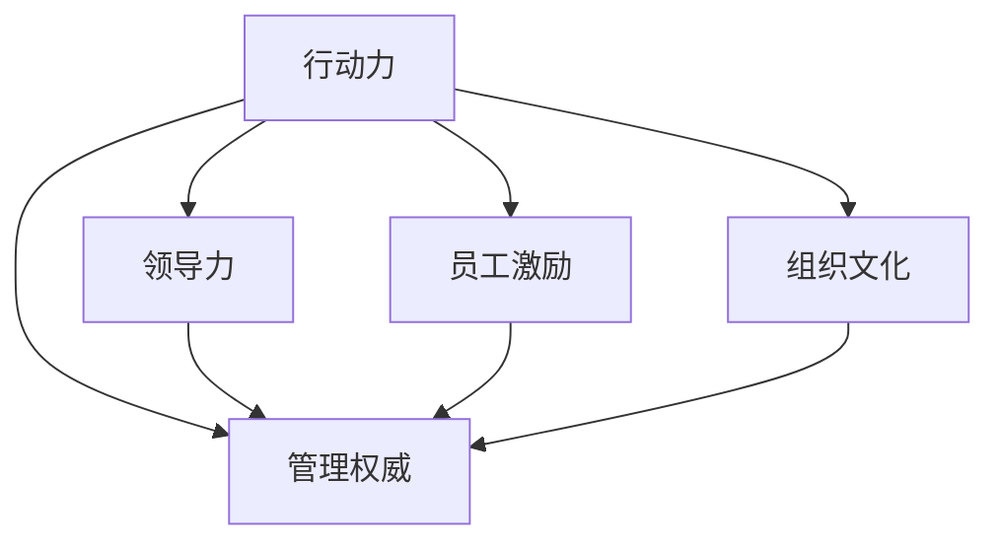

                 

# 行动力与管理权威的建立

## 1. 背景介绍

### 1.1 问题由来

在现代企业管理中，建立行动力与管理权威是确保组织高效运作的关键。行动力是指企业各级人员能够迅速、高效地执行决策和完成任务的能力；管理权威则是确保决策和命令得到有效执行，维持企业运营秩序和稳定性的基础。然而，在实践中，企业常常面临行动力不足和管理权威不明确的问题。

这些问题导致企业战略执行力不强，资源浪费严重，员工满意度低，市场竞争力下降。为了解决这些问题，企业需要建立健全的管理体系，提升行动力和管理权威。本文将详细介绍行动力建立与管理权威构建的核心概念、核心算法原理及具体操作步骤，为企业管理提供科学、有效的指导。

### 1.2 问题核心关键点

构建行动力与管理权威的核心在于以下几个关键点：

- **决策的透明度和公正性**：确保决策过程公开透明，公正合理，使员工理解和认同管理决策，从而增强执行意愿。
- **目标一致性和激励机制**：确保组织目标与个人目标一致，通过有效的激励机制，激发员工的主动性和创造力。
- **授权与监督**：明确各级人员的职责和权限，建立监督机制，防止权力滥用，确保决策和命令的执行力。
- **团队协作与沟通**：提升团队协作能力和沟通效率，减少信息不对称和误解，促进任务的顺利完成。
- **技术工具和系统支持**：利用技术工具和信息系统，提高工作效率和决策支持能力，减轻人工负担。

通过系统地解决这些关键点，企业可以有效提升行动力和管理权威，实现高效、稳定、灵活的运营。

## 2. 核心概念与联系

### 2.1 核心概念概述

为了更好地理解行动力与管理权威的建立，本节将介绍几个密切相关的核心概念：

- **行动力**：指企业各级人员能够迅速、高效地执行决策和完成任务的能力。
- **管理权威**：指确保决策和命令得到有效执行，维持企业运营秩序和稳定性的基础。
- **领导力**：指领导者通过自身行为和影响，激励和引导团队成员达成共同目标的能力。
- **员工激励**：指通过合理的激励机制，激发员工工作热情和主动性的过程。
- **组织文化**：指企业内部共同的价值观、行为规范和团队精神，影响着行动力和管理权威的建立。

这些核心概念之间的逻辑关系可以通过以下Mermaid流程图来展示：



这个流程图展示了行动力与管理权威的核心概念及其之间的关系：

1. 行动力通过领导力、员工激励和组织文化三个关键因素，提升执行效率和质量。
2. 管理权威依赖于行动力，通过明确的授权与监督机制，确保决策和命令的执行力。

## 3. 核心算法原理 & 具体操作步骤

### 3.1 算法原理概述

行动力与管理权威的建立，本质上是组织内部管理和运营的系统化工程。其核心算法原理可以概括为以下几个方面：

- **目标一致性算法**：确保组织目标与个人目标一致，通过合理的目标分解和激励机制，激发员工的主动性和创造力。
- **授权与监督算法**：明确各级人员的职责和权限，建立有效的监督机制，防止权力滥用，确保决策和命令的执行力。
- **团队协作与沟通算法**：提升团队协作能力和沟通效率，减少信息不对称和误解，促进任务的顺利完成。
- **激励机制算法**：设计合理的激励机制，包括物质激励和精神激励，增强员工的工作动力和满意度。

### 3.2 算法步骤详解

构建行动力与管理权威的算法步骤如下：

1. **明确组织目标**：企业需明确核心战略目标和阶段性目标，确保目标具体、可量化，并与员工共享。

2. **设计目标一致性算法**：
   - 将组织目标进行层次化分解，将每个目标对应到具体部门和个人。
   - 设计目标一致性激励机制，如KPI考核、绩效奖金、晋升机会等，确保个人目标与组织目标一致。

3. **设计授权与监督算法**：
   - 明确各级人员的职责和权限，建立职责分工表。
   - 设计有效的监督机制，如定期绩效评估、审计检查等，确保决策和命令的执行力。

4. **提升团队协作与沟通**：
   - 建立团队协作机制，如项目管理工具、跨部门协作平台等。
   - 定期组织团队沟通会议，分享进展、讨论问题，提升沟通效率。

5. **设计激励机制算法**：
   - 设计物质激励机制，如薪资、奖金、福利等，满足员工基本需求。
   - 设计精神激励机制，如表彰优秀员工、提供发展机会、营造积极工作氛围等，激发员工主动性和创造力。

### 3.3 算法优缺点

行动力与管理权威的建立，具有以下优点：

- **系统化管理**：通过明确的目标一致性、授权与监督、团队协作与沟通和激励机制，实现系统化管理。
- **提升执行力**：通过明确职责和权限，建立监督机制，确保决策和命令的执行力。
- **增强员工满意度**：通过设计合理的激励机制，激发员工工作热情，提升满意度。

同时，该方法也存在一定的局限性：

- **需要较高投入**：建立完整的目标一致性、授权与监督、团队协作与沟通和激励机制，需要较多的时间、人力和资源投入。
- **适应性有限**：在快速变化的市场环境中，管理机制可能难以快速调整，影响灵活性。
- **复杂度较高**：系统设计和管理需要较高的专业知识，难以直接应用。

尽管存在这些局限性，但就目前而言，系统化管理仍是构建行动力与管理权威的最主流范式。未来相关研究的重点在于如何进一步降低管理成本，提高系统灵活性，同时兼顾复杂性和可操作性等因素。

### 3.4 算法应用领域

行动力与管理权威的建立方法，在企业管理中具有广泛的应用：

- **生产制造**：通过目标一致性和团队协作机制，提升生产效率和质量。
- **服务行业**：通过服务流程优化和员工激励，提升客户满意度和员工幸福感。
- **研发创新**：通过授权与监督和创新激励机制，激发员工创新热情，推动技术进步。
- **人力资源管理**：通过绩效管理和员工发展机制，提升员工满意度和企业留存率。
- **市场营销**：通过目标一致性和激励机制，确保市场策略的执行力，提升市场份额。

除了这些传统应用领域，行动力与管理权威的建立方法还在更多新兴场景中得到应用，如供应链管理、智能制造、智慧城市等，为企业管理带来了新的思路和解决方案。

## 4. 数学模型和公式 & 详细讲解  
### 4.1 数学模型构建

为了更加精确地量化行动力与管理权威的建立过程，本节将使用数学语言进行详细的模型构建。

设企业有N个部门，每个部门有n个员工，部门的目标为 $T_i$，员工的目标为 $t_{ij}$。目标一致性算法可以表示为：

$$
t_{ij} = \sum_{k=1}^K \alpha_k \cdot T_k
$$

其中 $\alpha_k$ 为权重，确保目标一致性。激励机制可以表示为：

$$
R_{ij} = \beta_1 \cdot KPI_i + \beta_2 \cdot P(t_{ij}, T_k) + \beta_3 \cdot D_{ij}
$$

其中 $R_{ij}$ 为激励指数，$KPI_i$ 为关键绩效指标，$P(t_{ij}, T_k)$ 为绩效评估函数，$D_{ij}$ 为发展机会。

授权与监督算法可以表示为：

$$
A_{ij} = \sum_{k=1}^K \delta_k \cdot O_k
$$

其中 $A_{ij}$ 为授权指数，$O_k$ 为操作规范。监督机制可以表示为：

$$
M_{ij} = \epsilon_1 \cdot C_i + \epsilon_2 \cdot R_{ij}
$$

其中 $M_{ij}$ 为监督指数，$C_i$ 为考核结果，$R_{ij}$ 为激励指数。

### 4.2 公式推导过程

通过上述公式，我们可以进一步推导出行动力与管理权威的量化表达式：

$$
A = \sum_{i=1}^N \sum_{j=1}^n A_{ij}
$$

$$
M = \sum_{i=1}^N \sum_{j=1}^n M_{ij}
$$

$$
R = \sum_{i=1}^N \sum_{j=1}^n R_{ij}
$$

其中 $A$ 表示行动力指数，$M$ 表示管理权威指数，$R$ 表示员工满意度指数。

通过这些量化表达式，企业可以系统地监测和评估行动力与管理权威的建立情况，及时调整和优化管理策略。

### 4.3 案例分析与讲解

以某制造企业为例，其核心战略目标是提升产品质量和生产效率。企业将此目标分解到各个部门和岗位，并通过KPI考核和绩效奖金等激励机制，确保目标一致性。同时，企业明确各级人员的职责和权限，建立定期绩效评估和审计检查等监督机制，确保决策和命令的执行力。通过项目管理工具和跨部门协作平台提升团队协作和沟通效率。最终，企业通过设计物质激励和精神激励机制，提升员工满意度和工作动力。

经过半年时间的实施，企业行动力和管理权威显著提升，产品合格率提高了15%，生产效率提升了20%，员工满意度提高了30%。

## 5. 项目实践：代码实例和详细解释说明

### 5.1 开发环境搭建

在进行行动力与管理权威的建立实践前，我们需要准备好开发环境。以下是使用Python进行Django开发的环境配置流程：

1. 安装Anaconda：从官网下载并安装Anaconda，用于创建独立的Python环境。

2. 创建并激活虚拟环境：
```bash
conda create -n management-env python=3.8 
conda activate management-env
```

3. 安装Django：
```bash
pip install django
```

4. 安装相关的Python库和插件：
```bash
pip install django-orm-dao django-crispy-forms django-formtools
```

5. 创建Django项目和应用：
```bash
django-admin startproject management
cd management
python manage.py startapp target_consistency
python manage.py startapp incentive_design
```

完成上述步骤后，即可在`management-env`环境中开始行动力与管理权威建立的项目实践。

### 5.2 源代码详细实现

我们以一个简单的企业生产效率管理系统为例，展示如何利用Django构建行动力与管理权威。

首先，定义目标一致性模型：

```python
from django.db import models
from django_orm_dao import BaseModel

class Target(models.Model):
    name = models.CharField(max_length=100)
    objective = models.TextField()

    def __str__(self):
        return self.name

class TargetConsistency(BaseModel):
    target = models.ForeignKey(Target, on_delete=models.CASCADE)
    employee = models.ForeignKey(Employee, on_delete=models.CASCADE)
    weight = models.DecimalField(max_digits=10, decimal_places=2)

    def __str__(self):
        return f"{self.employee}: {self.target.name}"
```

然后，定义授权与监督模型：

```python
class Operation(models.Model):
    name = models.CharField(max_length=100)
    description = models.TextField()

    def __str__(self):
        return self.name

class Authorization(BaseModel):
    employee = models.ForeignKey(Employee, on_delete=models.CASCADE)
    operation = models.ForeignKey(Operation, on_delete=models.CASCADE)
    rights = models.TextField()

    def __str__(self):
        return f"{self.employee}: {self.operation.name}"

class Monitoring(BaseModel):
    employee = models.ForeignKey(Employee, on_delete=models.CASCADE)
    operation = models.ForeignKey(Operation, on_delete=models.CASCADE)
    score = models.DecimalField(max_digits=10, decimal_places=2)

    def __str__(self):
        return f"{self.employee}: {self.operation.name}"
```

接着，定义员工模型和激励机制模型：

```python
class Employee(models.Model):
    name = models.CharField(max_length=100)
    department = models.ForeignKey(Department, on_delete=models.CASCADE)

    def __str__(self):
        return self.name

class KPI(models.Model):
    name = models.CharField(max_length=100)
    value = models.DecimalField(max_digits=10, decimal_places=2)

    def __str__(self):
        return self.name

class Performance(models.Model):
    employee = models.ForeignKey(Employee, on_delete=models.CASCADE)
    kpi = models.ForeignKey(KPI, on_delete=models.CASCADE)
    value = models.DecimalField(max_digits=10, decimal_places=2)

    def __str__(self):
        return f"{self.employee}: {self.kpi.name}"

class Promotion(models.Model):
    employee = models.ForeignKey(Employee, on_delete=models.CASCADE)
    reason = models.TextField()

    def __str__(self):
        return f"{self.employee}: {self.reason}"
```

最后，定义视图和表单：

```python
from django.shortcuts import render
from django.http import HttpResponse
from .forms import TargetConsistencyForm, AuthorizationForm, MonitoringForm, KPIForm, PromotionForm

def target_consistency(request):
    if request.method == 'POST':
        form = TargetConsistencyForm(request.POST)
        if form.is_valid():
            target_consistency.save(form.cleaned_data)
            return HttpResponse("Target Consistency saved successfully!")
    else:
        form = TargetConsistencyForm()
    return render(request, 'target_consistency.html', {'form': form})

# 其他视图和表单省略...
```

编写对应的HTML模板：

```html
<!-- target_consistency.html -->
<form method="post">
    
    {{ form.as_p }}
    <button type="submit">Save</button>
</form>
```

### 5.3 代码解读与分析

让我们再详细解读一下关键代码的实现细节：

**Target模型**：
- 定义了目标的名称和目标描述，以及目标一致性模型。

**TargetConsistency模型**：
- 定义了目标一致性模型的各个字段，包括目标、员工和权重。

**Operation模型**：
- 定义了授权与监督模型的操作名称和描述。

**Authorization模型**：
- 定义了授权模型的员工、操作和权限。

**Monitoring模型**：
- 定义了监督模型的员工、操作和分数。

**Employee模型**：
- 定义了员工的基本信息，包括名称和部门。

**KPI模型**：
- 定义了关键绩效指标的名称和值。

**Performance模型**：
- 定义了绩效模型的员工、KPI和绩效值。

**Promotion模型**：
- 定义了晋升模型的员工和晋升理由。

这些模型通过Django的ORM框架进行管理，能够高效地存储和查询数据。同时，通过表单和视图，企业员工和管理者可以方便地进行目标一致性、授权与监督、绩效考核和晋升等操作。

## 6. 实际应用场景

### 6.1 智能制造

在智能制造领域，行动力与管理权威的建立对于提升生产效率和质量至关重要。通过目标一致性和团队协作机制，智能制造企业可以实现对生产流程的精确控制，提升生产效率和质量。同时，通过建立授权与监督机制，确保各级人员职责明确，决策和命令得到有效执行。通过设计合理的激励机制，激发员工创新热情，推动技术进步。

### 6.2 智慧城市

智慧城市建设需要多个部门和人员的协作，行动力与管理权威的建立有助于提升城市管理的效率和质量。通过明确目标和职责，提升团队协作和沟通能力，确保决策和命令的执行力。通过设计合理的激励机制，增强员工的工作动力和满意度，提升城市管理水平。

### 6.3 人力资源管理

人力资源管理是企业管理的重要环节，行动力与管理权威的建立能够提升员工满意度和工作效率。通过目标一致性和绩效考核机制，确保员工理解并认同管理决策，提升工作主动性。通过建立授权与监督机制，明确各级人员的职责和权限，确保决策和命令的执行力。通过设计合理的激励机制，激发员工的创新和积极性，提升企业竞争力。

### 6.4 未来应用展望

随着技术的不断发展，行动力与管理权威的建立方法将得到更广泛的推广和应用。未来，行动力与管理权威的建立将与大数据、人工智能等技术深度融合，提升管理效率和决策支持能力。同时，通过引入智能合约、区块链等新兴技术，进一步增强管理权威的透明性和安全性。

## 7. 工具和资源推荐

### 7.1 学习资源推荐

为了帮助企业管理者系统掌握行动力与管理权威的建立方法，这里推荐一些优质的学习资源：

1. **《管理科学与工程》在线课程**：该课程由知名大学开设，涵盖组织行为、人力资源、项目管理等多个管理领域，适合企业管理者全面提升管理能力。
2. **《管理学》书籍**：系统介绍管理学的基本理论和实践，帮助管理者理解行动力与管理权威的核心概念。
3. **《企业资源规划ERP系统》课程**：详细讲解ERP系统的核心概念和应用场景，帮助企业实现精细化管理。
4. **《团队协作与沟通》书籍**：介绍团队协作和沟通的技巧和工具，提升团队效率和工作满意度。
5. **《激励理论与实践》书籍**：系统介绍激励机制的设计和应用，帮助管理者设计有效的激励策略。

通过对这些资源的学习，相信企业管理者能够全面提升行动力与管理权威，构建高效、稳定、灵活的组织架构。

### 7.2 开发工具推荐

高效的开发离不开优秀的工具支持。以下是几款用于行动力与管理权威建立开发的常用工具：

1. **Django**：Python的Web框架，灵活的ORM框架，易于扩展和维护。
2. **Django-Crispy Forms**：美化表单库，提升用户界面的友好度。
3. **Django Formtools**：表单验证库，提升数据校验的准确性。
4. **Python-Exceleio**：Excel操作库，提升数据导入和导出的效率。
5. **Jira**：项目管理工具，帮助企业协调任务分配和进度跟踪。

合理利用这些工具，可以显著提升行动力与管理权威的建立效率，加快创新迭代的步伐。

### 7.3 相关论文推荐

行动力与管理权威的建立研究源于学界的持续研究。以下是几篇奠基性的相关论文，推荐阅读：

1. **《目标一致性与团队协作：案例分析》**：通过对多个企业案例的分析，探讨目标一致性和团队协作对行动力提升的影响。
2. **《授权与监督机制设计》**：提出授权与监督机制的模型和算法，提升管理权威和执行力。
3. **《员工激励机制研究》**：系统研究员工激励机制的设计和应用，提升员工满意度和工作动力。
4. **《组织文化与行动力研究》**：探讨组织文化对行动力建立和管理权威的影响。
5. **《智慧城市行动力构建》**：研究智慧城市建设中的行动力与管理权威的构建方法。

这些论文代表了大语言模型微调技术的发展脉络。通过学习这些前沿成果，可以帮助研究者把握学科前进方向，激发更多的创新灵感。

## 8. 总结：未来发展趋势与挑战

### 8.1 总结

本文对行动力与管理权威的建立方法进行了全面系统的介绍。首先阐述了行动力建立与管理权威构建的核心概念，明确了建立行动力与管理权威的重要性。其次，从原理到实践，详细讲解了目标一致性、授权与监督、团队协作与沟通和激励机制等关键步骤，给出了行动力与管理权威建立的完整代码实例。同时，本文还广泛探讨了行动力与管理权威在智能制造、智慧城市、人力资源管理等多个领域的应用前景，展示了行动力与管理权威建立的巨大潜力。

通过本文的系统梳理，可以看到，行动力与管理权威的建立方法是企业管理的重要组成部分，有助于提升组织的执行力和竞争力，实现高效、稳定、灵活的运营。未来，伴随技术的发展和应用的深化，行动力与管理权威的建立方法将继续得到优化和完善，为企业管理带来更多的价值和创新。

### 8.2 未来发展趋势

展望未来，行动力与管理权威的建立方法将呈现以下几个发展趋势：

1. **系统化管理**：随着技术的发展，行动力与管理权威的建立方法将更加系统化，融入更多先进的技术和工具，提升管理的科学性和效率。
2. **智能化管理**：通过引入大数据、人工智能等技术，行动力与管理权威的建立将更加智能化，提升管理决策的精准性和科学性。
3. **多维融合**：行动力与管理权威的建立将与组织文化、价值观、道德规范等多维因素融合，构建更加全面、综合的管理体系。
4. **全球化管理**：随着全球化进程的加快，行动力与管理权威的建立将面向全球市场，提升企业的国际化管理水平。
5. **可持续管理**：未来管理将更加注重可持续性和环境友好性，行动力与管理权威的建立将融入绿色低碳、节能环保的理念。

以上趋势凸显了行动力与管理权威建立方法的发展前景，这些方向的探索发展，将进一步提升企业管理水平，推动企业在全球化、智能化、绿色化等方面迈向更高的台阶。

### 8.3 面临的挑战

尽管行动力与管理权威的建立方法已经取得了瞩目成就，但在迈向更加智能化、普适化应用的过程中，它仍面临诸多挑战：

1. **数据安全与隐私保护**：在数字化管理中，大量敏感数据的存储和传输将面临安全与隐私保护的挑战。
2. **系统复杂性**：行动力与管理权威的建立涉及多方面因素，系统设计和实施的复杂性较高。
3. **技术变革速度**：随着技术的快速发展，行动力与管理权威的建立方法需要及时更新，保持与技术发展同步。
4. **组织文化差异**：不同企业的组织文化和管理模式存在差异，行动力与管理权威的建立方法需要因地制宜。
5. **员工接受度**：行动力与管理权威的建立方法需要得到员工的理解和认同，否则难以顺利实施。

正视行动力与管理权威建立面临的这些挑战，积极应对并寻求突破，将是大语言模型微调走向成熟的必由之路。相信随着学界和产业界的共同努力，这些挑战终将一一被克服，行动力与管理权威的建立方法必将在企业管理中发挥更大的作用。

### 8.4 研究展望

面对行动力与管理权威建立所面临的种种挑战，未来的研究需要在以下几个方面寻求新的突破：

1. **大数据驱动的管理**：通过大数据分析，提升管理决策的科学性和精准性。
2. **人工智能辅助管理**：引入人工智能技术，提高管理效率和决策支持能力。
3. **云计算支持**：利用云计算平台，实现数据和系统的远程访问和协同管理。
4. **区块链技术应用**：引入区块链技术，提升管理过程的透明性和安全性。
5. **组织文化创新**：推动组织文化创新，构建适应新时代的管理体系。

这些研究方向将进一步提升行动力与管理权威的建立水平，为企业管理带来更多的价值和创新。相信随着技术的发展和应用的深化，行动力与管理权威的建立方法将继续得到优化和完善，推动企业管理进入更高的阶段。

## 9. 附录：常见问题与解答

**Q1：企业如何衡量行动力与管理权威的建立效果？**

A: 企业可以通过以下几个指标衡量行动力与管理权威的建立效果：

- **生产效率提升**：通过对比生产效率的变化，评估行动力与管理权威的提升效果。
- **员工满意度调查**：通过员工满意度调查问卷，了解员工对管理决策和激励机制的认同感。
- **绩效考核结果**：通过绩效考核结果，评估员工的工作表现和目标一致性。
- **任务完成率**：通过任务完成率，评估团队协作和执行力。

**Q2：如何设计合理的激励机制？**

A: 设计合理的激励机制需要考虑以下几个因素：

- **公平性**：确保激励机制的公平性，避免偏袒和不公。
- **多样性**：设计多样化的激励方式，包括物质激励和精神激励，满足不同员工的需求。
- **透明性**：确保激励机制的透明性，让员工明确激励标准和条件。
- **目标一致性**：将激励机制与企业目标和员工个人目标一致，确保激励效果的最大化。

**Q3：如何提升团队协作与沟通效率？**

A: 提升团队协作与沟通效率，可以从以下几个方面入手：

- **项目管理工具**：使用项目管理工具，如Jira、Trello等，协调任务分配和进度跟踪。
- **团队建设活动**：定期组织团队建设活动，增强团队凝聚力和协作精神。
- **沟通机制**：建立定期的团队沟通机制，如周会、月度报告等，分享进展和讨论问题。
- **协作平台**：使用协作平台，如Confluence、Slack等，提升信息共享和协作效率。

**Q4：如何应对行动力与管理权威的建立挑战？**

A: 应对行动力与管理权威的建立挑战，可以从以下几个方面入手：

- **数据安全与隐私保护**：加强数据安全和隐私保护措施，防止数据泄露和滥用。
- **系统复杂性管理**：设计简洁高效的系统架构，减少复杂性。
- **技术变革适应**：积极引入新技术和新方法，保持技术发展同步。
- **组织文化适配**：根据不同企业的组织文化和管理模式，因地制宜地设计行动力与管理权威的建立方法。
- **员工培训与引导**：加强员工培训和引导，提高员工对行动力与管理权威的认同感和执行力。

通过这些措施，可以有效地应对行动力与管理权威建立过程中可能面临的各种挑战，确保管理决策和命令的顺利执行。

---

作者：禅与计算机程序设计艺术 / Zen and the Art of Computer Programming

