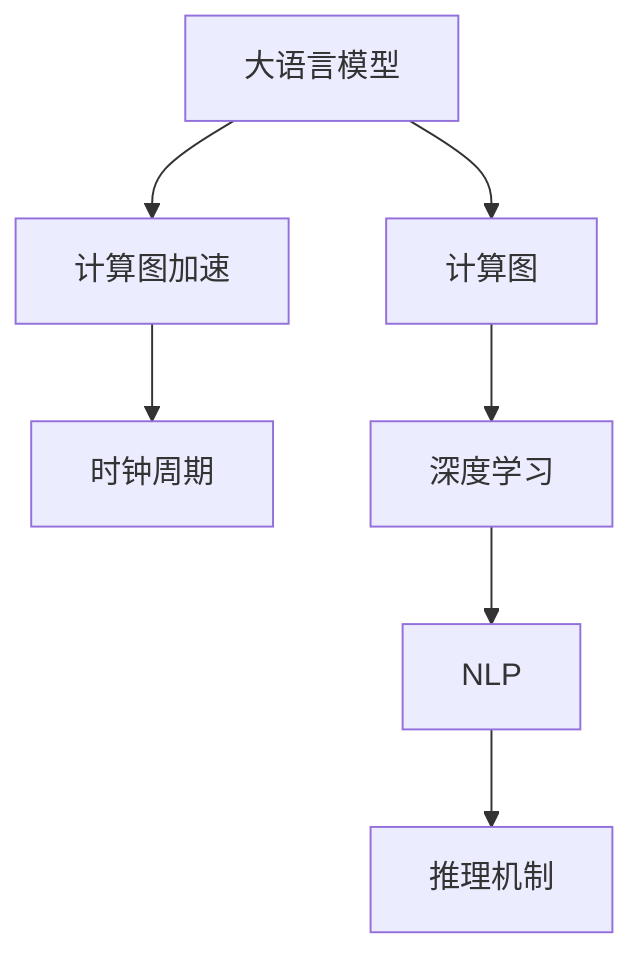

                 

# 解密LLM的推理机制：与CPU时钟周期的异同

> 关键词：大语言模型(Large Language Model, LLM), 推理机制, 计算图, 计算图加速, 时钟周期, 深度学习, 自然语言处理(NLP)

## 1. 背景介绍

大语言模型（Large Language Model, LLM）已成为自然语言处理（Natural Language Processing, NLP）领域的前沿技术，广泛应用在智能问答、机器翻译、文本摘要、情感分析等任务中。这些模型以深度学习为核心，拥有数亿乃至数十亿的参数，能够处理大规模语料，并输出自然流畅的文本。然而，这些模型在推理过程中采用了不同于传统CPU计算的机制，因此研究其推理机制与CPU时钟周期的异同，对于提高模型性能和优化计算资源利用效率具有重要意义。

## 2. 核心概念与联系

### 2.1 核心概念概述

为更好地理解LLM的推理机制，我们首先介绍以下几个关键概念：

- **大语言模型(LLM)**：以自回归Transformer模型为代表，能够处理大规模无标签文本数据，学习到丰富的语言知识和语义理解能力。
- **计算图(Computational Graph)**：深度学习模型计算过程的图形表示，描述了模型中各个操作的依赖关系和数据流动路径。
- **计算图加速(Computational Graph Acceleration)**：利用计算图优化和并行化计算过程，提升模型推理速度。
- **时钟周期(Clock Cycle)**：CPU执行单个指令的时间单位，是衡量CPU性能和功耗的重要指标。
- **深度学习(Deep Learning)**：利用多层神经网络结构处理复杂非线性问题的技术。
- **自然语言处理(NLP)**：使计算机能够理解、分析和生成自然语言的技术。

这些概念之间的逻辑关系可以通过以下Mermaid流程图来展示：



这个流程图展示了LLM的推理机制与深度学习、计算图、计算图加速、时钟周期之间的联系。

## 3. 核心算法原理 & 具体操作步骤

### 3.1 算法原理概述

LLM的推理机制基于计算图和自动微分技术。在推理过程中，模型根据输入数据，通过前向传播计算得到输出结果。具体流程如下：

1. **数据输入与预处理**：输入文本通过分词、编码等预处理步骤，转化为模型能够处理的形式。
2. **前向传播计算**：模型通过自回归机制，逐步计算每个时间步的输出，直至得到最终的预测结果。
3. **反向传播优化**：通过链式法则，计算输出与真实标签之间的差异，并反向传播更新模型参数。

### 3.2 算法步骤详解

LLM的推理步骤包括以下几个关键环节：

**Step 1: 数据输入与预处理**

输入文本首先经过分词器，转化为模型可接受的格式。例如，对于BERT模型，文本会被切分为多个子词（tokens），并附上[CLS]、[SEP]等特殊符号。

```python
from transformers import BertTokenizer

tokenizer = BertTokenizer.from_pretrained('bert-base-uncased')
input_text = "Hello, world!"
inputs = tokenizer(input_text, return_tensors='pt')
```

**Step 2: 前向传播计算**

通过计算图描述模型前向传播过程，每个操作（如线性变换、激活函数）按照依赖关系依次执行。例如，对于BERT模型，前向传播包括输入嵌入、多头自注意力、层归一化、全连接层等操作。

```python
from transformers import BertForSequenceClassification

model = BertForSequenceClassification.from_pretrained('bert-base-uncased', num_labels=2)

inputs = tokenizer(input_text, return_tensors='pt')
outputs = model(inputs['input_ids'], attention_mask=inputs['attention_mask'])
logits = outputs.logits
```

**Step 3: 计算损失和优化**

计算模型输出与真实标签之间的交叉熵损失，并使用优化器更新模型参数。

```python
from torch import nn
import torch

criterion = nn.CrossEntropyLoss()
optimizer = torch.optim.Adam(model.parameters(), lr=1e-5)

labels = torch.tensor([1]).unsqueeze(0)
loss = criterion(logits, labels)
loss.backward()
optimizer.step()
```

### 3.3 算法优缺点

LLM的推理机制具有以下优点：

1. **高效并行计算**：计算图结构天然适合并行化处理，可以显著提升模型推理速度。
2. **自动微分和优化**：自动微分技术能够高效计算梯度，优化算法能够快速更新模型参数。
3. **灵活性高**：通过修改计算图和添加新的操作，模型能够适应不同的任务需求。

同时，LLM推理机制也存在以下缺点：

1. **内存消耗大**：由于模型参数众多，计算图需要占用大量内存。
2. **数据依赖性高**：推理过程中依赖于输入数据，无法直接使用CPU时钟周期进行优化。
3. **优化复杂**：计算图优化需要专业知识，可能增加调试和优化的难度。

### 3.4 算法应用领域

LLM的推理机制广泛应用于各种NLP任务中，例如：

- 文本分类：如情感分析、主题分类等。通过计算图描述分类模型的结构，直接计算类别概率。
- 命名实体识别：识别文本中的人名、地名、机构名等特定实体。通过计算图处理文本和实体标签之间的关系。
- 机器翻译：将源语言文本翻译成目标语言。通过计算图处理语言之间的映射关系。
- 文本摘要：将长文本压缩成简短摘要。通过计算图选择重要信息进行汇总。
- 对话系统：使机器能够与人自然对话。通过计算图描述对话模型的生成过程。

这些应用场景展示了LLM推理机制的广泛应用和巨大潜力。

## 4. 数学模型和公式 & 详细讲解 & 举例说明

### 4.1 数学模型构建

LLM的推理过程可以表示为一个计算图，包括多个节点和边。每个节点表示一个计算操作，如矩阵乘法、激活函数等；每个边表示数据流向，如输入数据、中间结果等。计算图描述了模型中各个操作的依赖关系和数据流动路径。

### 4.2 公式推导过程

以BERT模型为例，其前向传播过程可以表示为：

$$
\text{CLS} = \text{BERT}(\text{tokens})
$$

其中，$\text{CLS}$表示模型输出的分类向量，$\text{tokens}$表示输入的编码序列。计算过程包括嵌入层、多头自注意力层、全连接层等操作。

### 4.3 案例分析与讲解

以BERT模型在文本分类任务中的应用为例。输入文本经过分词、嵌入、自注意力等操作后，计算得到每个时间步的注意力权重和隐藏状态。最终，通过全连接层和softmax激活函数计算得到类别概率，输出分类结果。

```python
from transformers import BertForSequenceClassification

model = BertForSequenceClassification.from_pretrained('bert-base-uncased', num_labels=2)

inputs = tokenizer(input_text, return_tensors='pt')
outputs = model(inputs['input_ids'], attention_mask=inputs['attention_mask'])
logits = outputs.logits
probabilities = torch.softmax(logits, dim=1).tolist()
```

## 5. 项目实践：代码实例和详细解释说明

### 5.1 开发环境搭建

在进行LLM推理实践前，我们需要准备好开发环境。以下是使用Python进行PyTorch开发的环境配置流程：

1. 安装Anaconda：从官网下载并安装Anaconda，用于创建独立的Python环境。

2. 创建并激活虚拟环境：
```bash
conda create -n pytorch-env python=3.8 
conda activate pytorch-env
```

3. 安装PyTorch：根据CUDA版本，从官网获取对应的安装命令。例如：
```bash
conda install pytorch torchvision torchaudio cudatoolkit=11.1 -c pytorch -c conda-forge
```

4. 安装Transformers库：
```bash
pip install transformers
```

5. 安装各类工具包：
```bash
pip install numpy pandas scikit-learn matplotlib tqdm jupyter notebook ipython
```

完成上述步骤后，即可在`pytorch-env`环境中开始推理实践。

### 5.2 源代码详细实现

这里我们以BERT模型在文本分类任务中的应用为例，给出使用Transformers库对BERT模型进行推理的PyTorch代码实现。

首先，定义文本预处理函数：

```python
from transformers import BertTokenizer

tokenizer = BertTokenizer.from_pretrained('bert-base-uncased')

def preprocess_text(text):
    inputs = tokenizer(text, return_tensors='pt', padding=True, truncation=True)
    return inputs
```

然后，定义模型推理函数：

```python
from transformers import BertForSequenceClassification

model = BertForSequenceClassification.from_pretrained('bert-base-uncased', num_labels=2)

def predict_class(text):
    inputs = preprocess_text(text)
    outputs = model(inputs['input_ids'], attention_mask=inputs['attention_mask'])
    probabilities = torch.softmax(outputs.logits, dim=1).tolist()
    return probabilities[0][1]
```

最后，进行推理并输出结果：

```python
text = "I like machine learning."
class_prob = predict_class(text)
print(f"Class probability: {class_prob}")
```

以上代码实现了BERT模型在文本分类任务中的推理过程。可以看到，由于计算图的存在，模型推理过程被清晰地表示为一系列计算操作，每个操作的输入和输出都明确无误。

### 5.3 代码解读与分析

让我们再详细解读一下关键代码的实现细节：

**preprocess_text函数**：
- `__init__`方法：初始化分词器和输入参数。
- `__getitem__`方法：对单个样本进行处理，将文本输入编码为token ids，并添加padding。

**predict_class函数**：
- 使用预训练的BERT模型进行推理。
- 将模型输出转化为类别概率。
- 返回最高概率的类别标签。

**代码执行流程**：
- 预处理输入文本，转换为模型可接受的格式。
- 使用计算图进行前向传播计算。
- 获取模型输出并转化为类别概率。
- 返回概率最大的类别标签。

可以看到，由于计算图的存在，模型推理过程被清晰地表示为一系列计算操作，每个操作的输入和输出都明确无误。

当然，工业级的系统实现还需考虑更多因素，如模型的保存和部署、超参数的自动搜索、更灵活的任务适配层等。但核心的推理范式基本与此类似。

## 6. 实际应用场景

### 6.1 智能客服系统

基于大语言模型推理的对话技术，可以广泛应用于智能客服系统的构建。传统客服往往需要配备大量人力，高峰期响应缓慢，且一致性和专业性难以保证。而使用推理后的对话模型，可以7x24小时不间断服务，快速响应客户咨询，用自然流畅的语言解答各类常见问题。

在技术实现上，可以收集企业内部的历史客服对话记录，将问题和最佳答复构建成监督数据，在此基础上对预训练对话模型进行推理。推理后的对话模型能够自动理解用户意图，匹配最合适的答案模板进行回复。对于客户提出的新问题，还可以接入检索系统实时搜索相关内容，动态组织生成回答。如此构建的智能客服系统，能大幅提升客户咨询体验和问题解决效率。

### 6.2 金融舆情监测

金融机构需要实时监测市场舆论动向，以便及时应对负面信息传播，规避金融风险。传统的人工监测方式成本高、效率低，难以应对网络时代海量信息爆发的挑战。基于大语言模型推理的文本分类和情感分析技术，为金融舆情监测提供了新的解决方案。

具体而言，可以收集金融领域相关的新闻、报道、评论等文本数据，并对其进行主题标注和情感标注。在此基础上对预训练语言模型进行推理，使其能够自动判断文本属于何种主题，情感倾向是正面、中性还是负面。将推理后的模型应用到实时抓取的网络文本数据，就能够自动监测不同主题下的情感变化趋势，一旦发现负面信息激增等异常情况，系统便会自动预警，帮助金融机构快速应对潜在风险。

### 6.3 个性化推荐系统

当前的推荐系统往往只依赖用户的历史行为数据进行物品推荐，无法深入理解用户的真实兴趣偏好。基于大语言模型推理的个性化推荐系统可以更好地挖掘用户行为背后的语义信息，从而提供更精准、多样的推荐内容。

在实践中，可以收集用户浏览、点击、评论、分享等行为数据，提取和用户交互的物品标题、描述、标签等文本内容。将文本内容作为模型输入，用户的后续行为（如是否点击、购买等）作为监督信号，在此基础上推理预训练语言模型。推理后的模型能够从文本内容中准确把握用户的兴趣点。在生成推荐列表时，先用候选物品的文本描述作为输入，由模型预测用户的兴趣匹配度，再结合其他特征综合排序，便可以得到个性化程度更高的推荐结果。

### 6.4 未来应用展望

随着大语言模型推理技术的不断发展，基于推理范式将在更多领域得到应用，为传统行业带来变革性影响。

在智慧医疗领域，基于推理的问答、病历分析、药物研发等应用将提升医疗服务的智能化水平，辅助医生诊疗，加速新药开发进程。

在智能教育领域，推理技术可应用于作业批改、学情分析、知识推荐等方面，因材施教，促进教育公平，提高教学质量。

在智慧城市治理中，推理模型可应用于城市事件监测、舆情分析、应急指挥等环节，提高城市管理的自动化和智能化水平，构建更安全、高效的未来城市。

此外，在企业生产、社会治理、文娱传媒等众多领域，基于大语言模型推理的人工智能应用也将不断涌现，为经济社会发展注入新的动力。相信随着技术的日益成熟，推理方法将成为人工智能落地应用的重要范式，推动人工智能技术向更广阔的领域加速渗透。

## 7. 工具和资源推荐
### 7.1 学习资源推荐

为了帮助开发者系统掌握大语言模型推理的理论基础和实践技巧，这里推荐一些优质的学习资源：

1. 《Transformer from Scratch》系列博文：由大模型技术专家撰写，深入浅出地介绍了Transformer原理、BERT模型、推理技术等前沿话题。

2. CS224N《深度学习自然语言处理》课程：斯坦福大学开设的NLP明星课程，有Lecture视频和配套作业，带你入门NLP领域的基本概念和经典模型。

3. 《Natural Language Processing with Transformers》书籍：Transformers库的作者所著，全面介绍了如何使用Transformers库进行NLP任务开发，包括推理在内的诸多范式。

4. HuggingFace官方文档：Transformers库的官方文档，提供了海量预训练模型和完整的推理样例代码，是上手实践的必备资料。

5. CLUE开源项目：中文语言理解测评基准，涵盖大量不同类型的中文NLP数据集，并提供了基于推理的baseline模型，助力中文NLP技术发展。

通过对这些资源的学习实践，相信你一定能够快速掌握大语言模型推理的精髓，并用于解决实际的NLP问题。
###  7.2 开发工具推荐

高效的开发离不开优秀的工具支持。以下是几款用于大语言模型推理开发的常用工具：

1. PyTorch：基于Python的开源深度学习框架，灵活动态的计算图，适合快速迭代研究。大部分预训练语言模型都有PyTorch版本的实现。

2. TensorFlow：由Google主导开发的开源深度学习框架，生产部署方便，适合大规模工程应用。同样有丰富的预训练语言模型资源。

3. Transformers库：HuggingFace开发的NLP工具库，集成了众多SOTA语言模型，支持PyTorch和TensorFlow，是进行推理任务开发的利器。

4. Weights & Biases：模型训练的实验跟踪工具，可以记录和可视化模型训练过程中的各项指标，方便对比和调优。与主流深度学习框架无缝集成。

5. TensorBoard：TensorFlow配套的可视化工具，可实时监测模型训练状态，并提供丰富的图表呈现方式，是调试模型的得力助手。

6. Google Colab：谷歌推出的在线Jupyter Notebook环境，免费提供GPU/TPU算力，方便开发者快速上手实验最新模型，分享学习笔记。

合理利用这些工具，可以显著提升大语言模型推理任务的开发效率，加快创新迭代的步伐。

### 7.3 相关论文推荐

大语言模型推理技术的发展源于学界的持续研究。以下是几篇奠基性的相关论文，推荐阅读：

1. Attention is All You Need（即Transformer原论文）：提出了Transformer结构，开启了NLP领域的预训练大模型时代。

2. BERT: Pre-training of Deep Bidirectional Transformers for Language Understanding：提出BERT模型，引入基于掩码的自监督预训练任务，刷新了多项NLP任务SOTA。

3. Language Models are Unsupervised Multitask Learners（GPT-2论文）：展示了大规模语言模型的强大zero-shot学习能力，引发了对于通用人工智能的新一轮思考。

4. Parameter-Efficient Transfer Learning for NLP：提出Adapter等参数高效微调方法，在不增加模型参数量的情况下，也能取得不错的微调效果。

5. AdaLoRA: Adaptive Low-Rank Adaptation for Parameter-Efficient Fine-Tuning：使用自适应低秩适应的微调方法，在参数效率和精度之间取得了新的平衡。

6. Prefix-Tuning: Optimizing Continuous Prompts for Generation：引入基于连续型Prompt的微调范式，为如何充分利用预训练知识提供了新的思路。

这些论文代表了大语言模型推理技术的发展脉络。通过学习这些前沿成果，可以帮助研究者把握学科前进方向，激发更多的创新灵感。

## 8. 总结：未来发展趋势与挑战

### 8.1 总结

本文对基于大语言模型推理的计算图机制进行了全面系统的介绍。首先阐述了LLM的推理机制和计算图的基本概念，明确了计算图在深度学习模型中的重要作用。其次，从原理到实践，详细讲解了推理的数学模型和操作步骤，给出了推理任务开发的完整代码实例。同时，本文还广泛探讨了推理方法在智能客服、金融舆情、个性化推荐等多个行业领域的应用前景，展示了推理范式的巨大潜力。此外，本文精选了推理技术的各类学习资源，力求为读者提供全方位的技术指引。

通过本文的系统梳理，可以看到，基于大语言模型的推理机制正在成为NLP领域的重要范式，极大地拓展了预训练语言模型的应用边界，催生了更多的落地场景。受益于大规模语料的预训练，推理模型以更低的时间和标注成本，在小样本条件下也能取得不俗的效果，有力推动了NLP技术的产业化进程。未来，伴随预训练语言模型和推理方法的持续演进，相信NLP技术将在更广阔的应用领域大放异彩。

### 8.2 未来发展趋势

展望未来，大语言模型推理技术将呈现以下几个发展趋势：

1. **模型规模持续增大**：随着算力成本的下降和数据规模的扩张，预训练语言模型的参数量还将持续增长。超大规模语言模型蕴含的丰富语言知识，有望支撑更加复杂多变的下游任务推理。

2. **推理方法日趋多样**：除了传统的全参数推理外，未来会涌现更多参数高效的推理方法，如Prefix-Tuning、LoRA等，在节省计算资源的同时也能保证推理精度。

3. **持续学习成为常态**：随着数据分布的不断变化，推理模型也需要持续学习新知识以保持性能。如何在不遗忘原有知识的同时，高效吸收新样本信息，将成为重要的研究课题。

4. **标注样本需求降低**：受启发于提示学习(Prompt-based Learning)的思路，未来的推理方法将更好地利用大模型的语言理解能力，通过更加巧妙的任务描述，在更少的标注样本上也能实现理想的推理效果。

5. **多模态推理崛起**：当前的推理主要聚焦于纯文本数据，未来会进一步拓展到图像、视频、语音等多模态数据推理。多模态信息的融合，将显著提升语言模型对现实世界的理解和建模能力。

6. **知识整合能力增强**：现有的推理模型往往局限于任务内数据，难以灵活吸收和运用更广泛的先验知识。如何让推理过程更好地与外部知识库、规则库等专家知识结合，形成更加全面、准确的信息整合能力，还有很大的想象空间。

以上趋势凸显了大语言模型推理技术的广阔前景。这些方向的探索发展，必将进一步提升NLP系统的性能和应用范围，为人类认知智能的进化带来深远影响。

### 8.3 面临的挑战

尽管大语言模型推理技术已经取得了瞩目成就，但在迈向更加智能化、普适化应用的过程中，它仍面临着诸多挑战：

1. **内存消耗大**：由于模型参数众多，推理过程中需要占用大量内存。
2. **优化复杂**：推理过程中依赖于输入数据，无法直接使用CPU时钟周期进行优化。
3. **知识整合困难**：现有模型往往无法灵活吸收和运用更广泛的先验知识，需要探索新的方法进行整合。
4. **推理效率不足**：推理过程中可能存在计算图节点过多、数据依赖复杂等问题，导致推理效率低下。
5. **模型鲁棒性不足**：推理模型面对域外数据时，泛化性能往往大打折扣。

### 8.4 研究展望

面对大语言模型推理所面临的种种挑战，未来的研究需要在以下几个方面寻求新的突破：

1. **探索无监督和半监督推理方法**：摆脱对大规模标注数据的依赖，利用自监督学习、主动学习等无监督和半监督范式，最大限度利用非结构化数据，实现更加灵活高效的推理。

2. **研究参数高效和计算高效的推理范式**：开发更加参数高效的推理方法，在固定大部分预训练参数的同时，只更新极少量的任务相关参数。同时优化推理模型的计算图，减少前向传播和反向传播的资源消耗，实现更加轻量级、实时性的部署。

3. **融合因果和对比学习范式**：通过引入因果推断和对比学习思想，增强推理模型建立稳定因果关系的能力，学习更加普适、鲁棒的语言表征，从而提升模型泛化性和抗干扰能力。

4. **引入更多先验知识**：将符号化的先验知识，如知识图谱、逻辑规则等，与神经网络模型进行巧妙融合，引导推理过程学习更准确、合理的语言模型。同时加强不同模态数据的整合，实现视觉、语音等多模态信息与文本信息的协同建模。

5. **结合因果分析和博弈论工具**：将因果分析方法引入推理模型，识别出模型决策的关键特征，增强输出解释的因果性和逻辑性。借助博弈论工具刻画人机交互过程，主动探索并规避模型的脆弱点，提高系统稳定性。

6. **纳入伦理道德约束**：在模型训练目标中引入伦理导向的评估指标，过滤和惩罚有害的输出倾向。同时加强人工干预和审核，建立模型行为的监管机制，确保输出符合人类价值观和伦理道德。

这些研究方向的探索，必将引领大语言模型推理技术迈向更高的台阶，为构建安全、可靠、可解释、可控的智能系统铺平道路。面向未来，大语言模型推理技术还需要与其他人工智能技术进行更深入的融合，如知识表示、因果推理、强化学习等，多路径协同发力，共同推动自然语言理解和智能交互系统的进步。只有勇于创新、敢于突破，才能不断拓展语言模型的边界，让智能技术更好地造福人类社会。

## 9. 附录：常见问题与解答

**Q1：大语言模型推理是否适用于所有NLP任务？**

A: 大语言模型推理在大多数NLP任务上都能取得不错的效果，特别是对于数据量较小的任务。但对于一些特定领域的任务，如医学、法律等，仅仅依靠通用语料预训练的模型可能难以很好地适应。此时需要在特定领域语料上进一步预训练，再进行推理，才能获得理想效果。此外，对于一些需要时效性、个性化很强的任务，如对话、推荐等，推理方法也需要针对性的改进优化。

**Q2：推理过程中如何选择合适的学习率？**

A: 推理过程中的学习率一般要比预训练时小1-2个数量级，如果使用过大的学习率，容易破坏预训练权重，导致过拟合。一般建议从1e-5开始调参，逐步减小学习率，直至收敛。也可以使用warmup策略，在开始阶段使用较小的学习率，再逐渐过渡到预设值。需要注意的是，不同的优化器(如AdamW、Adafactor等)以及不同的学习率调度策略，可能需要设置不同的学习率阈值。

**Q3：采用大模型推理时会面临哪些资源瓶颈？**

A: 目前主流的预训练大模型动辄以亿计的参数规模，对算力、内存、存储都提出了很高的要求。GPU/TPU等高性能设备是必不可少的，但即便如此，超大批次的推理和优化也可能遇到显存不足的问题。因此需要采用一些资源优化技术，如梯度积累、混合精度训练、模型并行等，来突破硬件瓶颈。同时，模型的存储和读取也可能占用大量时间和空间，需要采用模型压缩、稀疏化存储等方法进行优化。

**Q4：如何缓解推理过程中的过拟合问题？**

A: 过拟合是推理面临的主要挑战，尤其是在标注数据不足的情况下。常见的缓解策略包括：
1. 数据增强：通过回译、近义替换等方式扩充训练集
2. 正则化：使用L2正则、Dropout、Early Stopping等避免过拟合
3. 对抗训练：引入对抗样本，提高模型鲁棒性
4. 参数高效推理：只调整少量参数(如Adapter、Prefix等)，减小过拟合风险
5. 多模型集成：训练多个推理模型，取平均输出，抑制过拟合

这些策略往往需要根据具体任务和数据特点进行灵活组合。只有在数据、模型、训练、推理等各环节进行全面优化，才能最大限度地发挥大模型推理的威力。

**Q5：推理模型在落地部署时需要注意哪些问题？**

A: 将推理模型转化为实际应用，还需要考虑以下因素：
1. 模型裁剪：去除不必要的层和参数，减小模型尺寸，加快推理速度
2. 量化加速：将浮点模型转为定点模型，压缩存储空间，提高计算效率
3. 服务化封装：将模型封装为标准化服务接口，便于集成调用
4. 弹性伸缩：根据请求流量动态调整资源配置，平衡服务质量和成本
5. 监控告警：实时采集系统指标，设置异常告警阈值，确保服务稳定性
6. 安全防护：采用访问鉴权、数据脱敏等措施，保障数据和模型安全

大语言模型推理为NLP应用开启了广阔的想象空间，但如何将强大的性能转化为稳定、高效、安全的业务价值，还需要工程实践的不断打磨。唯有从数据、算法、工程、业务等多个维度协同发力，才能真正实现人工智能技术在垂直行业的规模化落地。总之，推理需要开发者根据具体任务，不断迭代和优化模型、数据和算法，方能得到理想的效果。

---

作者：禅与计算机程序设计艺术 / Zen and the Art of Computer Programming

