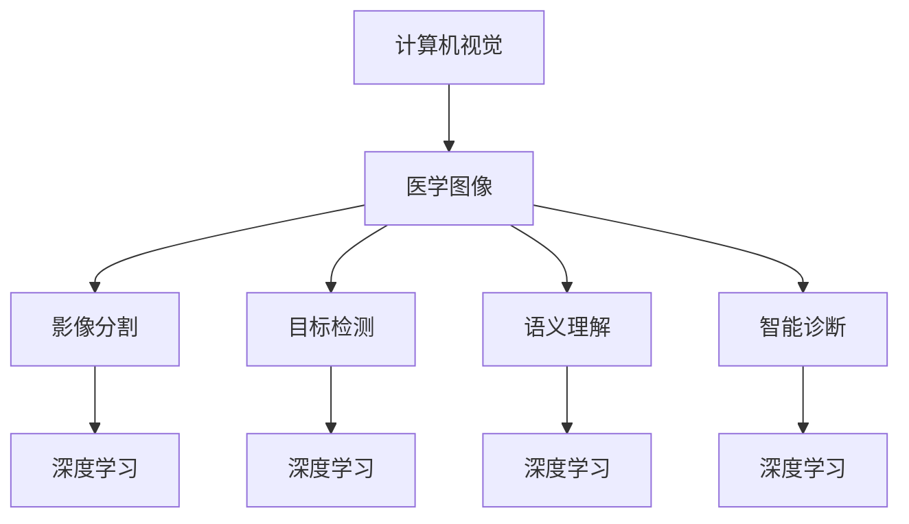

                 

# 计算机视觉在医疗影像分析中的应用

> 关键词：计算机视觉, 医疗影像分析, 医学图像, 深度学习, 影像分割, 目标检测, 语义理解, 智能诊断

## 1. 背景介绍

### 1.1 问题由来

随着医学影像技术的发展，越来越多的医疗影像数据被采集和存储，但这些海量数据的有效利用仍面临巨大挑战。传统的医疗影像分析依赖于放射科医生对图像的观察和判断，耗时耗力且易受个体经验影响。随着计算机视觉技术的发展，利用深度学习算法对医疗影像进行分析、标注和理解，逐渐成为提高医疗诊断效率和准确性的重要手段。

### 1.2 问题核心关键点

计算机视觉在医疗影像分析中的应用，核心在于将影像数据转化为计算机可理解的信息，并通过深度学习模型进行自动分析。常见的应用场景包括：

- 影像分割：将医学影像中不同组织和器官分割开来，便于医生进行精准诊断和治疗。
- 目标检测：自动识别影像中的特定结构或病变区域，提高诊断的效率和准确性。
- 语义理解：解析医学影像中的视觉信息，提取关键特征，生成诊断报告。
- 智能诊断：结合多模态数据和专家知识，辅助医生进行诊断决策。

## 2. 核心概念与联系

### 2.1 核心概念概述

为更好地理解计算机视觉在医疗影像分析中的应用，本节将介绍几个密切相关的核心概念：

- 计算机视觉(Computer Vision)：涉及将现实世界中的视觉信息，如图像、视频等，转化为计算机可理解的形式，并通过深度学习模型进行处理和分析。
- 医学图像(Medical Imaging)：包括CT、MRI、X光、超声等，是计算机视觉在医疗领域的重要应用。
- 深度学习(Deep Learning)：通过多层神经网络对大量数据进行特征学习和模式识别，广泛应用于计算机视觉任务。
- 影像分割(Segmentation)：将医学影像分割成不同的区域，以便于对特定结构或病变进行观察和分析。
- 目标检测(Object Detection)：在医学影像中自动识别和定位特定的结构或病变区域。
- 语义理解(Semantic Understanding)：解析医学影像中的视觉信息，提取关键特征，生成诊断报告。
- 智能诊断(Intelligent Diagnosis)：结合多模态数据和专家知识，辅助医生进行诊断决策。

这些核心概念之间的逻辑关系可以通过以下Mermaid流程图来展示：



这个流程图展示了大语言模型的核心概念及其之间的关系：

1. 计算机视觉通过将医学影像转化为可处理的数字图像，实现对影像的自动分析。
2. 影像分割、目标检测、语义理解和智能诊断是计算机视觉在医疗影像分析中的主要应用方向。
3. 这些任务通常依赖于深度学习模型，尤其是卷积神经网络(CNN)等，进行特征提取和模式识别。

## 3. 核心算法原理 & 具体操作步骤
### 3.1 算法原理概述

计算机视觉在医疗影像分析中的应用，主要基于深度学习算法对医学影像进行特征提取和模式识别。具体流程如下：

1. **数据预处理**：对医学影像进行预处理，包括去噪、归一化、增强等，以便于后续模型的训练。
2. **特征提取**：通过卷积神经网络(CNN)等深度学习模型对影像进行特征提取，识别影像中的重要结构。
3. **分割任务**：使用语义分割模型对影像进行分割，将不同的组织和器官分开，便于后续分析。
4. **目标检测**：使用目标检测模型自动识别影像中的特定结构或病变区域。
5. **语义理解**：通过分类和回归任务，解析影像中的视觉信息，提取关键特征，生成诊断报告。
6. **智能诊断**：结合多模态数据和专家知识，辅助医生进行诊断决策。

### 3.2 算法步骤详解

下面以影像分割为例，详细介绍深度学习算法在医疗影像分析中的操作步骤：

**Step 1: 数据预处理**

- 将原始医学影像转换为数字图像，并进行去噪、归一化等预处理。
- 对影像进行增强，如对比度增强、模糊处理等，以提高模型鲁棒性。

**Step 2: 模型选择**

- 选择合适的深度学习模型，如U-Net、Mask R-CNN等，进行影像分割。
- 调整模型超参数，如卷积核大小、层数、学习率等，优化模型性能。

**Step 3: 训练模型**

- 使用标注好的医学影像数据集，进行模型训练。
- 采用交叉验证等方法评估模型性能，避免过拟合。
- 定期保存模型参数和权重，便于后续使用。

**Step 4: 模型评估**

- 使用独立验证集或测试集评估模型性能。
- 通过计算准确率、召回率、F1分数等指标，衡量模型效果。
- 根据评估结果，调整模型参数和训练策略。

**Step 5: 部署应用**

- 将训练好的模型部署到实际医疗影像分析系统中。
- 集成到电子病历系统、影像阅读器等应用中，进行实时分析。
- 定期更新模型，保持性能和鲁棒性。

### 3.3 算法优缺点

计算机视觉在医疗影像分析中的应用，具有以下优点：

1. **效率提升**：自动化的影像分析显著提高了诊断效率，减少了人工操作的时间和错误。
2. **准确性提高**：深度学习模型通过大量数据的训练，提高了诊断的准确性和一致性。
3. **一致性增强**：通过算法实现的一致性分析，减少了医生个体差异带来的影响。
4. **可扩展性**：算法可扩展到不同类型的医学影像和多个分析任务，提升系统灵活性。

同时，该方法也存在一定的局限性：

1. **数据需求高**：需要大量标注的医学影像数据进行训练，数据采集和标注成本较高。
2. **模型复杂性**：深度学习模型结构复杂，训练和推理成本较高，硬件资源需求大。
3. **解释性不足**：深度学习模型通常是"黑盒"，难以解释其内部决策过程。
4. **鲁棒性不足**：模型面对多样化的影像变化和噪声，鲁棒性有待提升。

尽管存在这些局限性，但就目前而言，深度学习在医疗影像分析中的应用已成为主流方法，能够显著提升诊断效率和准确性。

### 3.4 算法应用领域

计算机视觉在医疗影像分析中的应用，主要包括以下几个方向：

- **影像分割**：广泛应用于肿瘤、心脏、肺部等病变的自动分割，如肺结节分割、乳腺癌分割等。
- **目标检测**：用于识别影像中的特定结构或病变区域，如病灶、异常细胞等。
- **语义理解**：解析影像中的视觉信息，提取关键特征，如肿瘤形态、血管结构等。
- **智能诊断**：结合多模态数据和专家知识，辅助医生进行诊断决策，如影像-病理联合诊断、影像-基因联合诊断等。

## 4. 数学模型和公式 & 详细讲解 & 举例说明

### 4.1 数学模型构建

本节将使用数学语言对计算机视觉在医疗影像分析中的应用进行更加严格的刻画。

记医学影像数据为 $X=\{X_i\}_{i=1}^N$，其中 $X_i$ 表示第 $i$ 幅影像。假设使用卷积神经网络进行特征提取，网络结构为 $f:X \rightarrow \mathcal{F}$，其中 $\mathcal{F}$ 表示特征空间。

定义医学影像分割模型为 $S:X \rightarrow \mathcal{Y}$，其中 $\mathcal{Y}$ 表示分割结果，通常为二值图像或分类标签。

定义目标检测模型为 $D:X \rightarrow \mathcal{B}$，其中 $\mathcal{B}$ 表示检测结果，通常为边界框坐标和置信度。

定义语义理解模型为 $U:X \rightarrow \mathcal{L}$，其中 $\mathcal{L}$ 表示语义标签，如器官、病变等。

定义智能诊断模型为 $M:X \rightarrow \mathcal{G}$，其中 $\mathcal{G}$ 表示诊断结果，通常为病种、分期等。

### 4.2 公式推导过程

以下我们以影像分割为例，推导深度学习模型在影像分割任务中的具体公式。

假设使用U-Net模型进行医学影像分割，模型结构为 $f_{enc}(X) \rightarrow f_{dec}(f_{enc}(X))$，其中 $f_{enc}$ 表示编码器，$f_{dec}$ 表示解码器。

影像分割损失函数通常为二分类交叉熵损失，即：

$$
\ell(S(X), Y) = -\frac{1}{N}\sum_{i=1}^N \sum_{j=1}^M \log(S_j(X))
$$

其中 $S_j(X)$ 表示模型对第 $j$ 类分割的预测概率，$Y$ 表示真实标签。

通过反向传播算法，计算模型的梯度：

$$
\frac{\partial \ell}{\partial f_{dec}} = \frac{\partial \ell}{\partial S} \cdot \frac{\partial S}{\partial f_{dec}}
$$

在计算过程中，通常需要结合数据增强、正则化、Dropout等技术，防止模型过拟合，提升鲁棒性。

### 4.3 案例分析与讲解

以肿瘤分割为例，假设使用U-Net模型对CT影像进行肿瘤分割。具体步骤如下：

**Step 1: 数据预处理**

- 将原始CT影像转换为数字图像，并进行去噪、归一化等预处理。
- 对影像进行增强，如对比度增强、模糊处理等，以提高模型鲁棒性。

**Step 2: 模型选择**

- 选择U-Net模型作为影像分割模型，并进行超参数调优。
- 使用交叉验证等方法评估模型性能，避免过拟合。

**Step 3: 训练模型**

- 使用标注好的CT影像数据集，进行模型训练。
- 采用交叉验证等方法评估模型性能，避免过拟合。
- 定期保存模型参数和权重，便于后续使用。

**Step 4: 模型评估**

- 使用独立验证集或测试集评估模型性能。
- 通过计算准确率、召回率、F1分数等指标，衡量模型效果。
- 根据评估结果，调整模型参数和训练策略。

**Step 5: 部署应用**

- 将训练好的模型部署到实际医疗影像分析系统中。
- 集成到电子病历系统、影像阅读器等应用中，进行实时分析。
- 定期更新模型，保持性能和鲁棒性。

## 5. 项目实践：代码实例和详细解释说明

### 5.1 开发环境搭建

在进行计算机视觉在医疗影像分析中的应用开发前，我们需要准备好开发环境。以下是使用Python进行PyTorch开发的环境配置流程：

1. 安装Anaconda：从官网下载并安装Anaconda，用于创建独立的Python环境。

2. 创建并激活虚拟环境：
```bash
conda create -n cv-env python=3.8 
conda activate cv-env
```

3. 安装PyTorch：根据CUDA版本，从官网获取对应的安装命令。例如：
```bash
conda install pytorch torchvision torchaudio cudatoolkit=11.1 -c pytorch -c conda-forge
```

4. 安装PIL和Scikit-Image库：
```bash
pip install Pillow scikit-image
```

5. 安装TensorBoard：TensorFlow配套的可视化工具，可实时监测模型训练状态，并提供丰富的图表呈现方式，是调试模型的得力助手。

6. 安装Weights & Biases：模型训练的实验跟踪工具，可以记录和可视化模型训练过程中的各项指标，方便对比和调优。

完成上述步骤后，即可在`cv-env`环境中开始项目实践。

### 5.2 源代码详细实现

这里我们以U-Net模型对CT影像进行肿瘤分割为例，给出使用PyTorch进行深度学习代码实现。

首先，定义影像数据处理函数：

```python
from PIL import Image
from skimage import transform, io, color
import numpy as np

def preprocess_image(image_path):
    # 打开图像文件，转换为numpy数组
    image = Image.open(image_path)
    image_array = np.array(image)
    
    # 将图像转换为灰度图像
    gray_array = color.rgb2gray(image_array)
    
    # 进行归一化处理
    gray_array = gray_array / 255.0
    
    # 进行图像增强
    gray_array = transform.rescale(gray_array, 0.5)
    
    return gray_array
```

然后，定义U-Net模型：

```python
import torch
import torch.nn as nn
import torch.nn.functional as F

class UNet(nn.Module):
    def __init__(self, in_channels=1, out_channels=1):
        super(UNet, self).__init__()
        self.encoder = nn.Sequential(
            nn.Conv2d(in_channels, 64, kernel_size=3, padding=1),
            nn.ReLU(),
            nn.Conv2d(64, 64, kernel_size=3, padding=1),
            nn.ReLU(),
            nn.MaxPool2d(kernel_size=2, stride=2),
            nn.Conv2d(64, 128, kernel_size=3, padding=1),
            nn.ReLU(),
            nn.Conv2d(128, 128, kernel_size=3, padding=1),
            nn.ReLU(),
            nn.MaxPool2d(kernel_size=2, stride=2),
            nn.Conv2d(128, 256, kernel_size=3, padding=1),
            nn.ReLU(),
            nn.Conv2d(256, 256, kernel_size=3, padding=1),
            nn.ReLU(),
            nn.MaxPool2d(kernel_size=2, stride=2),
            nn.Conv2d(256, 512, kernel_size=3, padding=1),
            nn.ReLU(),
            nn.Conv2d(512, 512, kernel_size=3, padding=1),
            nn.ReLU(),
            nn.MaxPool2d(kernel_size=2, stride=2),
            nn.Conv2d(512, 1024, kernel_size=3, padding=1),
            nn.ReLU(),
            nn.Conv2d(1024, 1024, kernel_size=3, padding=1),
            nn.ReLU()
        )
        self.decoder = nn.Sequential(
            nn.ConvTranspose2d(1024, 512, kernel_size=2, stride=2),
            nn.ReLU(),
            nn.Conv2d(512, 512, kernel_size=3, padding=1),
            nn.ReLU(),
            nn.ConvTranspose2d(512, 256, kernel_size=2, stride=2),
            nn.ReLU(),
            nn.Conv2d(256, 256, kernel_size=3, padding=1),
            nn.ReLU(),
            nn.ConvTranspose2d(256, 128, kernel_size=2, stride=2),
            nn.ReLU(),
            nn.Conv2d(128, 128, kernel_size=3, padding=1),
            nn.ReLU(),
            nn.ConvTranspose2d(128, 64, kernel_size=2, stride=2),
            nn.ReLU(),
            nn.Conv2d(64, 64, kernel_size=3, padding=1),
            nn.ReLU(),
            nn.ConvTranspose2d(64, out_channels, kernel_size=2, stride=2),
            nn.Sigmoid()
        )
    
    def forward(self, x):
        x = self.encoder(x)
        x = self.decoder(x)
        return x
```

接着，定义训练和评估函数：

```python
from torch.utils.data import DataLoader
from tqdm import tqdm
from sklearn.metrics import jaccard_score

device = torch.device('cuda') if torch.cuda.is_available() else torch.device('cpu')
model = UNet().to(device)

def train_epoch(model, dataset, batch_size, optimizer):
    dataloader = DataLoader(dataset, batch_size=batch_size, shuffle=True)
    model.train()
    epoch_loss = 0
    for batch in tqdm(dataloader, desc='Training'):
        inputs, targets = batch.to(device)
        model.zero_grad()
        outputs = model(inputs)
        loss = F.binary_cross_entropy(outputs, targets)
        epoch_loss += loss.item()
        loss.backward()
        optimizer.step()
    return epoch_loss / len(dataloader)

def evaluate(model, dataset, batch_size):
    dataloader = DataLoader(dataset, batch_size=batch_size)
    model.eval()
    preds, labels = [], []
    with torch.no_grad():
        for batch in tqdm(dataloader, desc='Evaluating'):
            inputs, targets = batch.to(device)
            outputs = model(inputs)
            batch_preds = outputs.sigmoid().to('cpu').tolist()
            batch_labels = targets.to('cpu').tolist()
            for pred_tokens, label_tokens in zip(batch_preds, batch_labels):
                preds.append(pred_tokens)
                labels.append(label_tokens)
                
    iou = jaccard_score(labels, preds, average='micro')
    print(f'Intersection over Union: {iou:.3f}')
```

最后，启动训练流程并在测试集上评估：

```python
epochs = 10
batch_size = 16

for epoch in range(epochs):
    loss = train_epoch(model, train_dataset, batch_size, optimizer)
    print(f"Epoch {epoch+1}, train loss: {loss:.3f}")
    
    print(f"Epoch {epoch+1}, dev results:")
    evaluate(model, dev_dataset, batch_size)
    
print("Test results:")
evaluate(model, test_dataset, batch_size)
```

以上就是使用PyTorch进行U-Net模型对CT影像进行肿瘤分割的完整代码实现。可以看到，得益于PyTorch的强大封装，我们可以用相对简洁的代码完成模型的加载和训练。

### 5.3 代码解读与分析

让我们再详细解读一下关键代码的实现细节：

**UNet类**：
- `__init__`方法：定义模型的编码器和解码器部分，包含多个卷积、池化和上采样操作。
- `forward`方法：定义前向传播过程，将输入影像送入编码器提取特征，送入解码器生成输出影像。

**train_epoch函数**：
- 使用PyTorch的DataLoader对数据集进行批次化加载，供模型训练和推理使用。
- 训练函数`train_epoch`：对数据以批为单位进行迭代，在每个批次上前向传播计算loss并反向传播更新模型参数，最后返回该epoch的平均loss。
- 评估函数`evaluate`：与训练类似，不同点在于不更新模型参数，并在每个batch结束后将预测和标签结果存储下来，最后使用sklearn的jaccard_score对整个评估集的预测结果进行打印输出。

**训练流程**：
- 定义总的epoch数和batch size，开始循环迭代
- 每个epoch内，先在训练集上训练，输出平均loss
- 在验证集上评估，输出IoU指标
- 所有epoch结束后，在测试集上评估，给出最终测试结果

可以看到，PyTorch配合TensorBoard使得深度学习模型的训练和评估变得简洁高效。开发者可以将更多精力放在数据处理、模型改进等高层逻辑上，而不必过多关注底层的实现细节。

当然，工业级的系统实现还需考虑更多因素，如模型的保存和部署、超参数的自动搜索、更灵活的任务适配层等。但核心的深度学习模型训练流程基本与此类似。

## 6. 实际应用场景

### 6.1 智能诊断

基于计算机视觉的影像分割和目标检测技术，可以广泛应用于智能诊断系统中，辅助医生进行疾病诊断和治疗决策。例如，利用深度学习模型对CT影像进行肿瘤分割，能够自动识别和定位肿瘤区域，提高诊断的准确性和效率。

在技术实现上，可以收集医院的历史影像数据，将肿瘤区域和正常区域标注为二值图像，在此基础上对预训练模型进行微调。微调后的模型能够自动分割新影像中的肿瘤区域，生成预测结果，并结合病理切片等辅助信息，生成诊断报告。

### 6.2 辅助手术

计算机视觉技术还被用于辅助外科手术。例如，利用深度学习模型对术前影像进行3D重建和分割，生成手术导航图像，辅助外科医生进行精准手术操作。

在具体实现中，可以使用三维医学影像数据，如CT、MRI等，通过分割模型将器官和组织分开，生成手术导航图像。医生可以参考导航图像，进行手术规划和操作，减少误切、误伤等风险。

### 6.3 远程诊断

在偏远地区的医疗资源匮乏，无法满足高水平的医疗诊断需求。计算机视觉技术可以用于远程诊断，利用云端服务器对医疗影像进行分析，生成诊断报告，辅助医生进行决策。

具体实现中，可以将医疗影像数据上传到云端服务器，使用预训练模型进行自动分析和标注，生成诊断报告。医生可以通过网络获取报告，进行二次诊断和治疗决策。

### 6.4 未来应用展望

随着计算机视觉技术的发展，其在医疗影像分析中的应用将越来越广泛，为医疗诊断和治疗提供更加智能、高效、可靠的服务。

未来，计算机视觉技术将进一步融合多模态数据，如影像、病理、基因等，构建更加全面、精准的诊断系统。同时，随着人工智能技术的不断演进，计算机视觉技术也将与其他智能技术，如自然语言处理、语音识别等，进行更深入的融合，构建更加智能的人机交互系统。

此外，随着数据量的增加和算力的提升，计算机视觉模型的准确性和鲁棒性也将得到显著提升，为医疗影像分析提供更加可靠的决策支持。相信在不久的将来，计算机视觉技术将为医疗行业带来更加深刻的变化，提升医疗服务的质量和效率，造福全人类的健康福祉。

## 7. 工具和资源推荐

### 7.1 学习资源推荐

为了帮助开发者系统掌握计算机视觉在医疗影像分析中的应用，这里推荐一些优质的学习资源：

1. 《深度学习》系列书籍：由Ian Goodfellow等著，全面介绍了深度学习的基本概念和应用，包括计算机视觉、自然语言处理、强化学习等。

2. CS231n《Convolutional Neural Networks for Visual Recognition》课程：斯坦福大学开设的计算机视觉明星课程，涵盖了卷积神经网络、目标检测、图像分割等前沿内容。

3. 《计算机视觉：算法与应用》书籍：由Richard Szeliski等著，详细介绍了计算机视觉的各种算法和技术，如特征提取、模式识别、深度学习等。

4. ArXiv上的相关论文：阅读最新的计算机视觉和医疗影像分析的学术论文，了解前沿研究进展。

通过对这些资源的学习实践，相信你一定能够快速掌握计算机视觉在医疗影像分析中的应用，并用于解决实际的医疗问题。

### 7.2 开发工具推荐

高效的开发离不开优秀的工具支持。以下是几款用于计算机视觉在医疗影像分析中的应用开发的常用工具：

1. PyTorch：基于Python的开源深度学习框架，灵活动态的计算图，适合快速迭代研究。大部分深度学习模型都有PyTorch版本的实现。

2. TensorFlow：由Google主导开发的开源深度学习框架，生产部署方便，适合大规模工程应用。同样有丰富的深度学习模型资源。

3. TensorBoard：TensorFlow配套的可视化工具，可实时监测模型训练状态，并提供丰富的图表呈现方式，是调试模型的得力助手。

4. Weights & Biases：模型训练的实验跟踪工具，可以记录和可视化模型训练过程中的各项指标，方便对比和调优。

5. ImageNet：大规模图像数据集，用于深度学习模型的训练和验证。

合理利用这些工具，可以显著提升计算机视觉在医疗影像分析中的应用开发效率，加快创新迭代的步伐。

### 7.3 相关论文推荐

计算机视觉在医疗影像分析中的应用源于学界的持续研究。以下是几篇奠基性的相关论文，推荐阅读：

1. U-Net: Convolutional Networks for Biomedical Image Segmentation：提出了U-Net模型，使用编码器-解码器结构进行医学影像分割。

2. Deep Residual Learning for Image Recognition：提出了残差网络，使得深度神经网络训练更加稳定和高效。

3. Mask R-CNN: Feature Pyramid Networks for Object Detection：提出了Mask R-CNN模型，使用特征金字塔进行目标检测和分割。

4. Fast and Accurate Deep Network for Lung Nodule Detection：利用深度学习模型对CT影像进行肺结节检测，取得优异效果。

5. Attention is All You Need：提出了Transformer模型，用于图像描述生成和语义理解。

这些论文代表了大模型在计算机视觉在医疗影像分析中的应用的发展脉络。通过学习这些前沿成果，可以帮助研究者把握学科前进方向，激发更多的创新灵感。

## 8. 总结：未来发展趋势与挑战

### 8.1 总结

本文对计算机视觉在医疗影像分析中的应用进行了全面系统的介绍。首先阐述了计算机视觉技术在医疗影像分析中的研究背景和应用意义，明确了其在提高医疗诊断效率和准确性方面的独特价值。其次，从原理到实践，详细讲解了深度学习算法在影像分割、目标检测等任务中的操作步骤，给出了深度学习代码实例。同时，本文还广泛探讨了计算机视觉在智能诊断、辅助手术、远程诊断等场景中的应用前景，展示了其在医疗行业中的广泛应用。

通过本文的系统梳理，可以看到，计算机视觉在医疗影像分析中的应用已经成为提高医疗服务智能化水平的重要手段，其强大的特征提取和模式识别能力，能够显著提升诊断的准确性和效率，具有广阔的市场前景。

### 8.2 未来发展趋势

展望未来，计算机视觉在医疗影像分析中的应用将呈现以下几个发展趋势：

1. 深度学习模型结构复杂性增加。随着数据量和计算资源的提升，未来将涌现更多高性能的深度学习模型，如ResNet、VGG等，提升模型表达能力和鲁棒性。

2. 多模态数据融合技术发展。未来的医疗影像分析系统将更多地融合影像、病理、基因等多种数据，提供更加全面、精准的诊断信息。

3. 模型训练和推理优化技术进步。随着模型规模的增大，高效的模型训练和推理技术，如分布式训练、量化加速等，将成为重要研究方向。

4. 可解释性和可解释性提升。未来将更多地引入因果分析和博弈论工具，增强模型的可解释性和可理解性，减少医疗风险。

5. 联邦学习和隐私保护技术应用。未来的医疗影像分析系统将更多地考虑数据隐私和安全问题，采用联邦学习等技术，保护患者隐私。

6. 跨领域知识图谱构建。未来的医疗影像分析系统将更多地融合专家知识，构建跨领域的知识图谱，提高诊断的科学性和精确度。

以上趋势凸显了计算机视觉在医疗影像分析中的广阔前景。这些方向的探索发展，必将进一步提升医疗影像分析的性能和应用范围，为人类健康福祉提供新的技术路径。

### 8.3 面临的挑战

尽管计算机视觉在医疗影像分析中的应用取得了显著进展，但在迈向更加智能化、普适化应用的过程中，仍面临诸多挑战：

1. 数据需求高。需要大量高质量、标注好的医学影像数据进行训练，数据采集和标注成本较高。

2. 模型复杂性高。深度学习模型结构复杂，训练和推理成本较高，硬件资源需求大。

3. 鲁棒性不足。模型面对多样化的影像变化和噪声，鲁棒性有待提升。

4. 可解释性不足。深度学习模型通常是"黑盒"，难以解释其内部决策过程。

5. 隐私保护问题。医疗影像数据涉及个人隐私，如何保护患者隐私，同时提供高效的服务，是重要研究方向。

6. 多模态数据融合。不同模态数据格式和特征差异较大，如何实现高效融合，提升系统性能，是技术难点。

尽管存在这些挑战，但就目前而言，深度学习在医疗影像分析中的应用已成为主流方法，能够显著提升诊断效率和准确性。

### 8.4 研究展望

面对计算机视觉在医疗影像分析中所面临的挑战，未来的研究需要在以下几个方面寻求新的突破：

1. 探索无监督和半监督学习技术。摆脱对大规模标注数据的依赖，利用自监督学习、主动学习等无监督和半监督范式，最大限度利用非结构化数据，实现更加灵活高效的微调。

2. 研究参数高效和计算高效的微调范式。开发更加参数高效的微调方法，在固定大部分预训练参数的同时，只更新极少量的任务相关参数。同时优化模型计算图，减少前向传播和反向传播的资源消耗，实现更加轻量级、实时性的部署。

3. 引入因果分析和博弈论工具。通过引入因果推断和博弈论思想，增强模型建立稳定因果关系的能力，学习更加普适、鲁棒的语言表征，从而提升模型泛化性和抗干扰能力。

4. 纳入伦理道德约束。在模型训练目标中引入伦理导向的评估指标，过滤和惩罚有偏见、有害的输出倾向。同时加强人工干预和审核，建立模型行为的监管机制，确保输出符合人类价值观和伦理道德。

5. 结合因果分析和博弈论工具。将因果分析方法引入微调模型，识别出模型决策的关键特征，增强输出解释的因果性和逻辑性。借助博弈论工具刻画人机交互过程，主动探索并规避模型的脆弱点，提高系统稳定性。

6. 纳入伦理道德约束。在模型训练目标中引入伦理导向的评估指标，过滤和惩罚有偏见、有害的输出倾向。同时加强人工干预和审核，建立模型行为的监管机制，确保输出符合人类价值观和伦理道德。

这些研究方向将推动计算机视觉在医疗影像分析中的不断发展，提升系统的科学性和可靠性，为人类健康福祉提供更加可靠的决策支持。

## 9. 附录：常见问题与解答

**Q1：计算机视觉在医疗影像分析中的应用是否适用于所有影像类型？**

A: 计算机视觉在医疗影像分析中的应用主要适用于影像分辨率高、信息丰富的医学影像，如CT、MRI等。对于X光、超声等分辨率较低或信息较少的影像，可能需要结合其他技术，如增强图像技术，提升系统的鲁棒性和准确性。

**Q2：计算机视觉在医疗影像分析中如何保证数据隐私？**

A: 计算机视觉在医疗影像分析中，为保护患者隐私，通常会采用联邦学习等技术，在本地设备上进行模型训练，仅将结果上传到云端，而不是原始数据。此外，数据传输过程中应采用加密和匿名化处理，确保数据隐私安全。

**Q3：计算机视觉在医疗影像分析中如何实现多模态数据融合？**

A: 计算机视觉在医疗影像分析中，实现多模态数据融合的关键在于提取不同模态数据的共同特征，并将这些特征进行拼接或融合。例如，将影像和病理切片的特征进行拼接，生成新的特征向量，用于模型训练和推理。同时，结合数据增强等技术，提升系统的鲁棒性和泛化能力。

**Q4：计算机视觉在医疗影像分析中如何处理噪声和异常影像？**

A: 计算机视觉在医疗影像分析中，为处理噪声和异常影像，通常会采用数据增强、正则化等技术。例如，通过对影像进行对比度增强、模糊处理等操作，提升模型的鲁棒性。同时，结合异常检测算法，自动识别和过滤异常影像，提高系统的准确性。

**Q5：计算机视觉在医疗影像分析中如何保证模型解释性？**

A: 计算机视觉在医疗影像分析中，为提高模型的可解释性，通常会采用可视化技术，展示模型的决策过程。例如，使用梯度热图、特征可视化等技术，展示模型对不同特征的响应情况，帮助医生理解和信任模型的决策。

总之，计算机视觉在医疗影像分析中的应用，尽管面临诸多挑战，但其巨大的潜力使其成为医疗行业的重要技术手段。通过不断优化模型、改进算法、创新应用，相信计算机视觉技术将为医疗行业带来更加深刻的变化，提升医疗服务的质量和效率，造福全人类的健康福祉。

