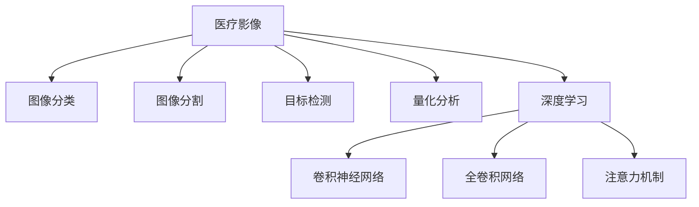

                 

# 计算机视觉在医疗影像分析中的应用

## 1. 背景介绍

### 1.1 问题由来

医疗影像分析是现代医学诊断中不可或缺的一部分，传统依赖于放射科医生通过观察、对比、判断来得出诊断结果，但人眼在长时间工作后易疲劳，容易产生误判。因此，借助计算机视觉技术，实现自动化的医疗影像分析，成为医疗影像技术发展的重要方向。

计算机视觉技术通过模型对影像特征的提取和识别，能够在一定范围内替代人工分析，具有准确性高、分析速度快等优点。近年来，随着深度学习的发展，特别是卷积神经网络(CNN)在图像识别、分割等方面的成功应用，使得计算机视觉技术在医疗影像分析中展现出广阔的应用前景。

### 1.2 问题核心关键点

医疗影像分析的核心在于从影像中识别出具有临床意义的特征，如肿瘤、骨折、病灶等。常见的应用包括：

1. **图像分类**：对影像进行疾病分类，如癌症、糖尿病、心血管疾病等。
2. **图像分割**：将影像中的不同组织和器官分离，便于更精细的诊断。
3. **目标检测**：自动检测影像中的特定目标，如病灶、器官等。
4. **量化分析**：对影像中的结构、形态等进行量化分析，辅助临床决策。
5. **辅助诊断**：提供诊断建议和参考，辅助医生判断。

本文将从计算机视觉在医疗影像分析中的核心概念、算法原理、应用场景及未来趋势等方面进行深入探讨，并给出项目实践的代码实例。

## 2. 核心概念与联系

### 2.1 核心概念概述

为更好地理解计算机视觉在医疗影像分析中的应用，本节将介绍几个密切相关的核心概念：

- **医疗影像**：指通过X光、CT、MRI等医学成像设备获得的图像数据，用于辅助诊断和治疗。
- **图像分类**：将影像分为不同的类别，如正常、异常、疾病等，用于初步筛查。
- **图像分割**：将影像中不同区域划分出来，如肿瘤、器官、组织等，用于精细诊断。
- **目标检测**：自动识别影像中的特定目标，如病灶、器官等，用于定位和分析。
- **量化分析**：对影像中的特定结构或特征进行数值化，如测量肿瘤大小、判断病变程度等。
- **深度学习**：基于神经网络，特别是卷积神经网络(CNN)，对影像特征进行学习和提取。

这些概念之间的逻辑关系可以通过以下Mermaid流程图来展示：



这个流程图展示了大语言模型的核心概念及其之间的关系：

1. 医疗影像通过深度学习进行处理，得到初步的特征。
2. 图像分类、图像分割、目标检测、量化分析等任务，都是在影像特征的基础上进行的。
3. 卷积神经网络是深度学习中用于图像处理的主要模型。

## 3. 核心算法原理 & 具体操作步骤
### 3.1 算法原理概述

计算机视觉在医疗影像分析中的核心算法为卷积神经网络(CNN)，特别适用于图像分类和目标检测任务。其主要原理是利用卷积操作提取图像中的局部特征，并通过池化层降低特征图的空间大小，通过全连接层进行特征融合，最终输出分类或检测结果。

形式化地，假设输入的原始医疗影像为 $I \in \mathbb{R}^{H \times W \times C}$，其中 $H$ 和 $W$ 分别为图像的高和宽，$C$ 为图像的通道数。则CNN的基本结构如下：

1. **卷积层**：使用卷积核对输入图像进行卷积操作，提取局部特征。
2. **激活层**：引入非线性激活函数，如ReLU，增强模型的表达能力。
3. **池化层**：通过最大池化、平均池化等方法，降低特征图的空间大小，减少参数数量。
4. **全连接层**：将池化后的特征进行拼接，输入到全连接层，进行特征融合和分类。

CNN的训练过程为反向传播，即通过前向传播计算损失函数，反向传播计算梯度，更新网络参数，使损失函数最小化。常用的损失函数包括交叉熵损失、均方误差损失等。

### 3.2 算法步骤详解

计算机视觉在医疗影像分析中的算法步骤大致包括以下几个关键步骤：

**Step 1: 准备数据集**

- 收集并标注医疗影像数据集。常见的数据集包括LIDC-IDRI（Lung Image Database Consortium）、Breast Cancer Wisconsin Dataset（BCWD）等。
- 将数据集划分为训练集、验证集和测试集，按照一定比例分配。
- 对数据进行预处理，如归一化、增强等，以提高模型的泛化能力。

**Step 2: 设计网络结构**

- 选择合适的卷积神经网络架构，如ResNet、Inception、U-Net等。
- 设计网络结构时需考虑网络深度、宽度、特征提取能力等因素，同时要避免过拟合。

**Step 3: 训练模型**

- 使用反向传播算法对模型进行训练，最小化损失函数。
- 设置合适的学习率、批次大小、迭代轮数等超参数，优化模型的训练过程。
- 在验证集上评估模型性能，调整超参数以提高模型泛化能力。

**Step 4: 模型评估**

- 在测试集上对训练好的模型进行评估，计算准确率、召回率、F1-score等指标。
- 分析模型的优缺点，如过拟合、欠拟合等问题，优化模型结构。

**Step 5: 模型部署**

- 将训练好的模型封装成API或服务，供实际应用调用。
- 实时监测模型性能，及时更新模型以适应新的数据分布。

### 3.3 算法优缺点

计算机视觉在医疗影像分析中的应用具有以下优点：

1. **高效率**：自动化处理速度快，能够显著提高诊疗效率。
2. **准确性高**：通过大量数据训练，具有较高的准确性和鲁棒性。
3. **减少误诊**：减少人为因素对诊断结果的影响，降低误诊率。
4. **可扩展性强**：可以应用于多种医疗影像类型和诊断任务。

同时，也存在一些缺点：

1. **数据依赖**：需要大量高质量的标注数据，且数据标注成本高。
2. **泛化能力**：对于复杂多样化的医学影像，模型的泛化能力可能不足。
3. **解释性差**：模型的黑盒特性，难以解释其内部决策逻辑。
4. **伦理问题**：处理医疗数据涉及隐私和安全问题，需要谨慎处理。

### 3.4 算法应用领域

计算机视觉在医疗影像分析中的应用领域广泛，包括但不限于：

1. **影像分类**：如肺癌、乳腺癌、脑肿瘤等的分类诊断。
2. **影像分割**：如肿瘤的分割、器官的分割、病变的分割等。
3. **目标检测**：如淋巴结的检测、病灶的检测等。
4. **量化分析**：如测量病灶大小、判断病变程度等。
5. **辅助诊断**：如智能辅助诊断系统、智能问诊系统等。

## 4. 数学模型和公式 & 详细讲解 & 举例说明

### 4.1 数学模型构建

在本节中，我们将从数学的角度对计算机视觉在医疗影像分析中的基本模型进行构建。

设医疗影像 $I$ 为二维图像，假设其大小为 $H \times W$，通道数为 $C$。卷积神经网络的输入层为 $I$，输出层为 $Y$，其中 $Y$ 为分类标签或检测结果。网络中包含多个卷积层、池化层和全连接层。

卷积层的数学表达式为：
$$
F(x) = \sum_{k=1}^K \sum_{n=1}^{N_k} a_{kn} * \mathbb{C}_k * x
$$
其中 $a_{kn}$ 为卷积核权重，$N_k$ 为第 $k$ 层的特征数，$\mathbb{C}_k$ 为特征图，$x$ 为输入图像。

激活层的数学表达式为：
$$
f(x) = \max(0, x)
$$
其中 $f(x)$ 为激活函数，通常使用ReLU。

池化层的数学表达式为：
$$
G(x) = \max(\frac{x_1 + x_2 + x_3 + x_4}{4})
$$
其中 $G(x)$ 为池化后的特征图，$x_1, x_2, x_3, x_4$ 为输入特征图的四个像素点。

全连接层的数学表达式为：
$$
H(x) = W * x + b
$$
其中 $W$ 为权重矩阵，$b$ 为偏置项。

### 4.2 公式推导过程

以图像分类任务为例，我们推导二分类问题的交叉熵损失函数及其梯度计算公式。

假设模型 $M_{\theta}$ 在输入 $I$ 上的输出为 $\hat{y}=M_{\theta}(I) \in [0,1]$，表示样本属于正类的概率。真实标签 $y \in \{0,1\}$。则二分类交叉熵损失函数定义为：
$$
\ell(M_{\theta}(I),y) = -[y\log \hat{y} + (1-y)\log (1-\hat{y})]
$$

将 $I$ 输入网络，计算 $M_{\theta}(I)$，得到损失函数 $\mathcal{L}$ 为：
$$
\mathcal{L}(\theta) = -\frac{1}{N}\sum_{i=1}^N [y_i\log M_{\theta}(I_i)+(1-y_i)\log(1-M_{\theta}(I_i))]
$$

根据链式法则，损失函数对参数 $\theta_k$ 的梯度为：
$$
\frac{\partial \mathcal{L}(\theta)}{\partial \theta_k} = -\frac{1}{N}\sum_{i=1}^N (\frac{y_i}{M_{\theta}(I_i)}-\frac{1-y_i}{1-M_{\theta}(I_i)}) \frac{\partial M_{\theta}(I_i)}{\partial \theta_k}
$$

其中 $\frac{\partial M_{\theta}(I_i)}{\partial \theta_k}$ 为卷积神经网络中卷积核的梯度，通过反向传播算法计算得到。

在得到损失函数的梯度后，即可带入参数更新公式，完成模型的迭代优化。重复上述过程直至收敛，最终得到适应医疗影像分类的最优模型参数 $\theta^*$。

## 5. 项目实践：代码实例和详细解释说明
### 5.1 开发环境搭建

在进行医疗影像分析的计算机视觉项目实践前，我们需要准备好开发环境。以下是使用Python进行TensorFlow开发的环境配置流程：

1. 安装Anaconda：从官网下载并安装Anaconda，用于创建独立的Python环境。

2. 创建并激活虚拟环境：
```bash
conda create -n cv-env python=3.8 
conda activate cv-env
```

3. 安装TensorFlow：根据CUDA版本，从官网获取对应的安装命令。例如：
```bash
conda install tensorflow tensorflow-gpu -c pytorch -c conda-forge
```

4. 安装Keras和TensorBoard：
```bash
pip install keras tensorboard
```

5. 安装各类工具包：
```bash
pip install numpy pandas scikit-learn matplotlib tqdm jupyter notebook ipython
```

完成上述步骤后，即可在`cv-env`环境中开始项目实践。

### 5.2 源代码详细实现

下面我们以医疗影像分类为例，给出使用TensorFlow进行CNN模型训练的代码实现。

首先，定义数据预处理函数：

```python
from tensorflow.keras.preprocessing.image import ImageDataGenerator

def preprocess_data(train_dir, test_dir, img_size=256, batch_size=16):
    train_datagen = ImageDataGenerator(
        rescale=1./255,
        rotation_range=20,
        width_shift_range=0.1,
        height_shift_range=0.1,
        shear_range=0.1,
        zoom_range=0.1,
        horizontal_flip=True,
        fill_mode='nearest')
    
    train_generator = train_datagen.flow_from_directory(
        train_dir,
        target_size=(img_size, img_size),
        batch_size=batch_size,
        class_mode='binary')
    
    test_datagen = ImageDataGenerator(rescale=1./255)
    
    test_generator = test_datagen.flow_from_directory(
        test_dir,
        target_size=(img_size, img_size),
        batch_size=batch_size,
        class_mode='binary')
    
    return train_generator, test_generator
```

然后，定义CNN模型：

```python
from tensorflow.keras.models import Sequential
from tensorflow.keras.layers import Conv2D, MaxPooling2D, Flatten, Dense

model = Sequential()
model.add(Conv2D(32, (3, 3), activation='relu', input_shape=(img_size, img_size, 3)))
model.add(MaxPooling2D((2, 2)))
model.add(Conv2D(64, (3, 3), activation='relu'))
model.add(MaxPooling2D((2, 2)))
model.add(Conv2D(128, (3, 3), activation='relu'))
model.add(MaxPooling2D((2, 2)))
model.add(Flatten())
model.add(Dense(128, activation='relu'))
model.add(Dense(1, activation='sigmoid'))
```

接着，定义模型编译、训练和评估函数：

```python
from tensorflow.keras.optimizers import Adam

model.compile(optimizer=Adam(lr=1e-3), loss='binary_crossentropy', metrics=['accuracy'])

train_generator, test_generator = preprocess_data(train_dir, test_dir)

def train_epoch(model, train_generator, epochs, batch_size):
    model.fit(train_generator, epochs=epochs, batch_size=batch_size, validation_data=test_generator)
    
def evaluate(model, test_generator):
    test_loss, test_acc = model.evaluate(test_generator)
    print('Test Loss:', test_loss)
    print('Test Accuracy:', test_acc)
```

最后，启动模型训练并在测试集上评估：

```python
epochs = 50
batch_size = 16

train_epoch(model, train_generator, epochs, batch_size)
evaluate(model, test_generator)
```

以上就是使用TensorFlow进行医疗影像分类任务的CNN模型训练的完整代码实现。可以看到，TensorFlow的Keras API提供了简单易用的API接口，方便开发者快速构建和训练模型。

### 5.3 代码解读与分析

让我们再详细解读一下关键代码的实现细节：

**preprocess_data函数**：
- `ImageDataGenerator`用于对图像进行数据增强，如旋转、平移、缩放等，增加数据多样性，提高模型泛化能力。
- `flow_from_directory`方法用于从文件夹中读取图像数据，自动进行标签划分。

**model定义**：
- 使用了典型的卷积神经网络结构，包含多个卷积层、池化层和全连接层，以提取和融合图像特征。
- 最后一层为二分类逻辑回归层，输出0或1的概率。

**train_epoch函数**：
- 使用`model.fit`方法进行模型训练，设置训练轮数和批次大小。
- 在每个epoch结束时，使用测试集对模型进行评估。

**evaluate函数**：
- 使用`model.evaluate`方法对测试集进行评估，计算损失和准确率。

通过这些函数，便可以在训练集上进行模型训练，并在测试集上进行性能评估。

## 6. 实际应用场景

### 6.1 智能辅助诊断系统

智能辅助诊断系统是计算机视觉在医疗影像分析中最具代表性的应用之一。通过将影像输入到预先训练好的CNN模型中，系统可以自动识别出影像中的病灶和异常情况，辅助医生进行诊断。

以乳腺肿瘤检测为例，系统可以自动检测影像中的肿瘤区域，标注其位置和大小，并给出肿瘤的分类结果。医生在得到系统辅助结果后，可以更加快速准确地做出诊断，提升诊疗效率。

### 6.2 医疗影像分割

医疗影像分割是计算机视觉在医疗影像分析中的另一个重要应用，旨在将影像中的不同组织和器官进行分离，便于医生对病灶进行更精细的诊断。

以肿瘤分割为例，系统可以自动将肿瘤区域从影像中提取出来，生成二值化的肿瘤边界。医生在得到系统辅助的分割结果后，可以更加准确地测量肿瘤的大小和形状，为治疗方案的选择提供依据。

### 6.3 目标检测

目标检测是计算机视觉在医疗影像分析中的应用之一，旨在自动检测影像中的特定目标，如病灶、器官等。

以脑肿瘤检测为例，系统可以自动检测影像中的肿瘤区域，并标注其位置和大小。医生在得到系统辅助结果后，可以更加快速准确地做出诊断，提升诊疗效率。

### 6.4 量化分析

量化分析是计算机视觉在医疗影像分析中的应用之一，旨在对影像中的特定结构或特征进行数值化，如测量病灶大小、判断病变程度等。

以测量肿瘤大小为例，系统可以自动测量肿瘤的直径和体积，生成统计结果。医生在得到系统辅助结果后，可以更加准确地评估肿瘤的危险程度，为治疗方案的选择提供依据。

## 7. 工具和资源推荐
### 7.1 学习资源推荐

为了帮助开发者系统掌握计算机视觉在医疗影像分析中的应用，这里推荐一些优质的学习资源：

1. **TensorFlow官方文档**：TensorFlow的官方文档提供了详细的API文档和示例代码，是学习和实践计算机视觉技术的必备资源。
2. **Keras官方文档**：Keras的官方文档提供了简单易用的API接口，适合初学者上手。
3. **医学图像处理与分析课程**：Coursera上斯坦福大学开设的课程，涵盖了医学图像处理和分析的基本概念和实践方法。
4. **医学影像分析与计算机视觉专题**：DeepLearning.AI开设的课程，介绍了医学影像分类、分割、目标检测等应用场景。
5. **医学影像分析论文集**：谷歌学术上提供了大量相关的学术论文和综述，可以帮助你深入了解计算机视觉在医疗影像分析中的应用。

通过对这些资源的学习实践，相信你一定能够快速掌握计算机视觉在医疗影像分析中的应用技巧，并用于解决实际的医疗问题。

### 7.2 开发工具推荐

高效的开发离不开优秀的工具支持。以下是几款用于计算机视觉项目开发的常用工具：

1. **TensorFlow**：由谷歌主导开发的开源深度学习框架，生产部署方便，适合大规模工程应用。
2. **Keras**：高层次的神经网络API，易于上手，可以与TensorFlow无缝集成。
3. **PyTorch**：基于Python的开源深度学习框架，灵活易用，适合研究实验。
4. **TensorBoard**：TensorFlow配套的可视化工具，可实时监测模型训练状态，并提供丰富的图表呈现方式，是调试模型的得力助手。
5. **MXNet**：由亚马逊主导的深度学习框架，适合大规模分布式训练和推理。

合理利用这些工具，可以显著提升计算机视觉在医疗影像分析项目的开发效率，加快创新迭代的步伐。

### 7.3 相关论文推荐

计算机视觉在医疗影像分析的发展源于学界的持续研究。以下是几篇奠基性的相关论文，推荐阅读：

1. **医学影像分类论文**：医学影像分类的经典论文，如Lee等人在ICML 2011年发表的《ImageNet classification with deep convolutional neural networks》，介绍了CNN在医学影像分类中的应用。
2. **医学影像分割论文**：医学影像分割的经典论文，如Yu等人在ICCV 2019年发表的《U-Net: Convolutional Networks for Biomedical Image Segmentation》，介绍了U-Net架构在医学影像分割中的应用。
3. **目标检测论文**：目标检测的经典论文，如Girshick等人在ECCV 2015年发表的《Fast R-CNN》，介绍了R-CNN系列架构在目标检测中的应用。
4. **量化分析论文**：量化分析的经典论文，如Zhou等人在MRI 2019年发表的《3D MRI lesion segmentation using residual residual network》，介绍了残差网络在医学影像量化分析中的应用。

这些论文代表了大语言模型微调技术的发展脉络。通过学习这些前沿成果，可以帮助研究者把握学科前进方向，激发更多的创新灵感。

## 8. 总结：未来发展趋势与挑战

### 8.1 总结

本文对计算机视觉在医疗影像分析中的应用进行了全面系统的介绍。首先阐述了计算机视觉技术在医疗影像分析中的研究背景和应用前景，明确了其在提高诊断效率、减少误诊等方面的独特价值。其次，从原理到实践，详细讲解了CNN在医疗影像分析中的核心算法和操作步骤，给出了项目实践的代码实例。同时，本文还广泛探讨了计算机视觉在智能辅助诊断、医疗影像分割、目标检测、量化分析等多个行业领域的应用场景，展示了其广阔的发展空间。

通过本文的系统梳理，可以看到，计算机视觉在医疗影像分析中的应用正迅速普及，成为提升医疗诊断质量、提高诊疗效率的重要手段。未来，伴随深度学习技术的不断进步，计算机视觉在医疗影像分析中的应用将不断深入，推动医疗影像技术向智能化、普适化发展。

### 8.2 未来发展趋势

展望未来，计算机视觉在医疗影像分析中将呈现以下几个发展趋势：

1. **高精度和高效率**：随着深度学习技术的不断进步，计算机视觉在医疗影像分析中的精度和效率将不断提升，有望达到甚至超越人类专家的水平。
2. **多模态融合**：未来将进一步拓展到多模态数据融合，如将图像与基因数据、生理数据等结合，实现更全面、更精确的诊断。
3. **个性化和适应性**：根据患者的具体情况，实现个性化的影像分析和诊断，提升诊疗效果。
4. **可解释性和安全性**：计算机视觉模型将变得更加透明，其内部决策逻辑和推理过程将更容易解释，同时能够保证数据和模型的安全性。
5. **实时化和集成化**：计算机视觉模型将更加实时化，能够与医疗设备、电子健康记录等系统无缝集成，实现智能化诊疗。

以上趋势凸显了计算机视觉在医疗影像分析技术的广阔前景。这些方向的探索发展，必将进一步提升计算机视觉的性能和应用范围，为医疗诊断带来革命性的变化。

### 8.3 面临的挑战

尽管计算机视觉在医疗影像分析中已经取得了显著进展，但在迈向更加智能化、普适化应用的过程中，仍面临诸多挑战：

1. **数据质量和标注成本**：高质量的标注数据是训练深度学习模型的关键，但医疗影像数据的标注成本高，难以获得大规模标注数据。
2. **模型泛化能力**：复杂的医学影像数据往往具有高度多样性，如何提高模型的泛化能力，是计算机视觉在医疗影像分析中面临的重要挑战。
3. **模型鲁棒性**：在临床环境中，医疗影像数据可能受到噪声、畸变等因素的影响，如何提高模型的鲁棒性，是保证计算机视觉系统可靠性的关键。
4. **模型可解释性**：计算机视觉模型的决策过程难以解释，如何提高模型的可解释性，是保障医疗系统透明性和可控性的重要问题。
5. **伦理和安全问题**：处理医疗数据涉及隐私和安全问题，如何保证数据隐私和安全，是计算机视觉在医疗影像分析中必须考虑的重要问题。

### 8.4 研究展望

面对计算机视觉在医疗影像分析所面临的种种挑战，未来的研究需要在以下几个方面寻求新的突破：

1. **大规模标注数据获取**：探索无监督和半监督学习方法，降低对标注数据的依赖。
2. **多模态数据融合**：研究如何将图像数据与其他医学数据（如基因数据、生理数据等）结合，实现更全面、更准确的诊断。
3. **模型鲁棒性增强**：研究如何提高计算机视觉模型的鲁棒性，使其在复杂的医疗影像数据中依然能够保持高精度的诊断能力。
4. **可解释性提升**：研究如何提高计算机视觉模型的可解释性，使医生能够理解模型的决策过程和推理逻辑，提升系统的透明性和可控性。
5. **安全性和隐私保护**：研究如何保护患者数据隐私，保证数据的安全性，同时提升系统的可信度和可靠性。

这些研究方向的探索，必将引领计算机视觉在医疗影像分析技术迈向更高的台阶，为构建安全、可靠、可解释、可控的智能系统铺平道路。面向未来，计算机视觉在医疗影像分析技术还需要与其他人工智能技术进行更深入的融合，如知识表示、因果推理、强化学习等，多路径协同发力，共同推动医疗影像技术的进步。只有勇于创新、敢于突破，才能不断拓展计算机视觉技术的边界，让智能技术更好地造福人类社会。

## 9. 附录：常见问题与解答

**Q1：计算机视觉在医疗影像分析中如何提高泛化能力？**

A: 提高计算机视觉在医疗影像分析中的泛化能力，可以从以下几个方面入手：

1. **数据增强**：使用数据增强技术，如旋转、平移、缩放等，增加数据多样性，提高模型的泛化能力。
2. **迁移学习**：在其他领域的数据上预训练模型，然后在医疗影像数据上微调，提高模型的泛化能力。
3. **模型集成**：将多个模型进行集成，取平均值或投票结果，提高模型的泛化能力。
4. **模型裁剪**：裁剪模型结构，去除冗余和无关的层，提高模型的泛化能力。
5. **正则化**：使用L2正则、Dropout等正则化技术，避免过拟合，提高模型的泛化能力。

通过这些方法，可以提高计算机视觉在医疗影像分析中的泛化能力，使其能够更好地适应新的数据分布。

**Q2：计算机视觉在医疗影像分析中如何提高鲁棒性？**

A: 提高计算机视觉在医疗影像分析中的鲁棒性，可以从以下几个方面入手：

1. **对抗训练**：引入对抗样本，提高模型对噪声、畸变等干扰的鲁棒性。
2. **数据清洗**：对数据进行清洗，去除噪声和异常值，提高模型的鲁棒性。
3. **模型融合**：将多个模型进行融合，取平均值或投票结果，提高模型的鲁棒性。
4. **模型压缩**：压缩模型结构，减少参数数量，提高模型的鲁棒性。
5. **正则化**：使用L2正则、Dropout等正则化技术，避免过拟合，提高模型的鲁棒性。

通过这些方法，可以提高计算机视觉在医疗影像分析中的鲁棒性，使其在复杂的医疗影像数据中依然能够保持高精度的诊断能力。

**Q3：计算机视觉在医疗影像分析中如何提高可解释性？**

A: 提高计算机视觉在医疗影像分析中的可解释性，可以从以下几个方面入手：

1. **可视化工具**：使用可视化工具，如TensorBoard，可视化模型的训练过程和输出结果，提高模型的可解释性。
2. **特征图分析**：分析模型的特征图，理解模型对输入数据的感知，提高模型的可解释性。
3. **决策树**：使用决策树等可解释性模型，提高模型的可解释性。
4. **规则约束**：在模型训练中引入规则约束，提高模型的可解释性。
5. **可视化报告**：生成可视化的报告，展示模型的决策过程和推理逻辑，提高模型的可解释性。

通过这些方法，可以提高计算机视觉在医疗影像分析中的可解释性，使医生能够理解模型的决策过程和推理逻辑，提升系统的透明性和可控性。

**Q4：计算机视觉在医疗影像分析中如何保护患者隐私？**

A: 保护患者隐私是计算机视觉在医疗影像分析中必须考虑的重要问题。以下是几种常见的保护隐私的方法：

1. **数据匿名化**：对医疗影像数据进行匿名化处理，去除患者的个人信息。
2. **访问控制**：对医疗影像数据进行访问控制，仅授权用户能够访问数据。
3. **加密技术**：对医疗影像数据进行加密处理，防止数据泄露。
4. **联邦学习**：在多台设备上训练模型，保护数据隐私。
5. **隐私计算**：使用隐私计算技术，如差分隐私、同态加密等，保护数据隐私。

通过这些方法，可以保护患者隐私，确保医疗影像数据的安全性和隐私性。

**Q5：计算机视觉在医疗影像分析中如何提高诊断效率？**

A: 提高计算机视觉在医疗影像分析中的诊断效率，可以从以下几个方面入手：

1. **自动化流程**：将影像分析和诊断过程自动化，减少人为干预，提高诊断效率。
2. **多模态融合**：将影像数据与其他医学数据（如基因数据、生理数据等）结合，实现更全面、更精确的诊断，提高诊断效率。
3. **实时化**：将计算机视觉模型实时化，能够在短时间内处理大量影像数据，提高诊断效率。
4. **模型集成**：将多个模型进行集成，取平均值或投票结果，提高诊断效率。
5. **模型裁剪**：裁剪模型结构，去除冗余和无关的层，提高模型的诊断效率。

通过这些方法，可以提高计算机视觉在医疗影像分析中的诊断效率，使其能够在短时间内处理大量影像数据，提升诊疗效率。

---

作者：禅与计算机程序设计艺术 / Zen and the Art of Computer Programming

