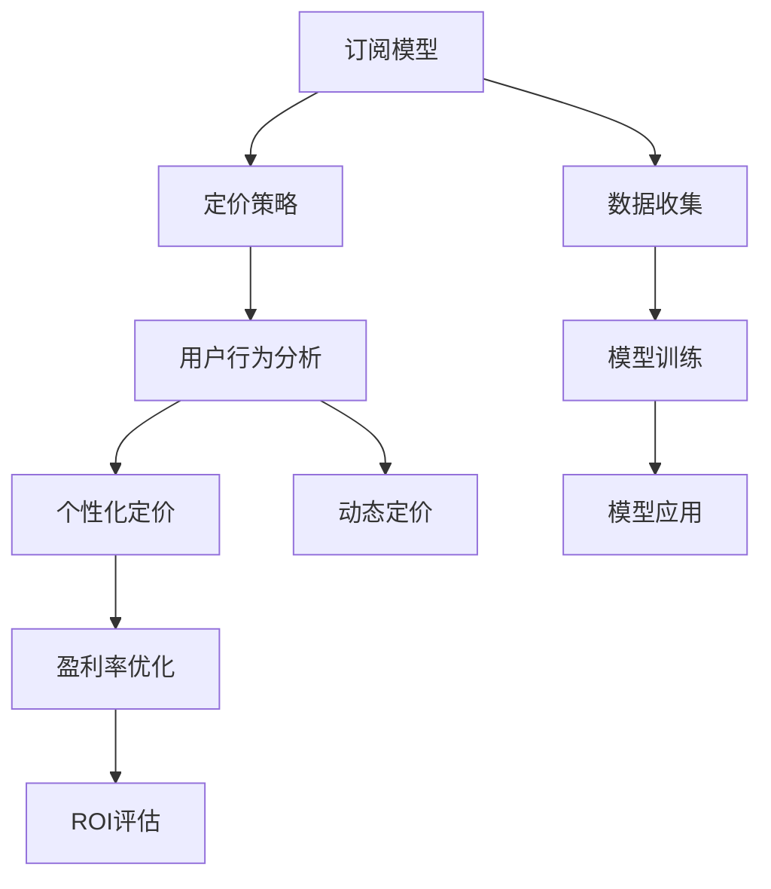

                 

# 订阅制定价策略:如何平衡用户体验和盈利能力

> 关键词：订阅模型,定价策略,用户行为分析,个性化定价,盈利率优化

## 1. 背景介绍

### 1.1 问题由来
随着互联网和数字经济的兴起，订阅服务已成为各行各业的主要盈利模式之一。从软件、影视、音乐到新闻、健康、教育等，几乎所有垂直领域都推出了自己的订阅产品。然而，如何设定合理的订阅价格，平衡用户体验和盈利能力，成为许多企业面临的难题。

尽管订阅制模式已被众多企业采纳，但成功的案例并不普遍。高昂的价格可能直接导致用户流失，过低的定价可能难以覆盖成本，而价格区间在合理范围之内也可能面临激烈的价格竞争。因此，本文旨在探讨订阅制定价策略，帮助企业找到最优的定价方案，实现用户体验与盈利能力的双重提升。

### 1.2 问题核心关键点
本节将介绍一些关键问题点：

- 订阅模型的基本原理是什么？
- 如何通过数据分析进行定价优化？
- 个性化定价和动态定价在订阅制中有何优势？
- 订阅制模型的盈利能力评估方法有哪些？

这些问题将构成本文的主要讨论点，帮助读者深入理解并实践订阅制定价策略。

### 1.3 问题研究意义
通过本节介绍，我们希望读者能够理解：

1. 如何通过数据分析发现用户的真实价值，以指导定价策略的制定。
2. 如何将用户行为分析与定价优化结合起来，实现精准定价。
3. 个性化定价和动态定价如何帮助订阅服务保持竞争力和用户黏性。
4. 如何在订阅制模型中平衡用户体验和盈利能力，实现商业目标。

## 2. 核心概念与联系

### 2.1 核心概念概述

为更好地理解订阅制定价策略，我们将介绍一些核心概念及其联系：

- **订阅模型(Subscription Model)**：即用户定期支付固定费用，以获得持续的服务或产品。订阅模型包括每月、每季度或每年的周期性收费。
- **定价策略(Pricing Strategy)**：订阅服务的定价方法，包括一次性购买、按次付费、分期付款等。
- **用户行为分析(User Behavior Analysis)**：通过分析用户行为数据，挖掘用户对服务的使用价值和支付意愿。
- **个性化定价(Personalized Pricing)**：根据用户属性、使用习惯等个性化因素，动态调整订阅价格。
- **动态定价(Dynamic Pricing)**：基于市场需求、用户行为等实时变化，动态调整订阅价格。
- **盈利率(Rate of Return, RoR)**：衡量订阅模型盈利能力的关键指标，即收入减去成本后剩余金额的百分比。

这些概念通过订阅模型的架构联系在一起，形成了一个完整的定价和盈利体系。

### 2.2 核心概念原理和架构的 Mermaid 流程图



### 2.3 核心概念之间的逻辑关系

1. **订阅模型与定价策略**：订阅模型的设计直接影响定价策略，如一次性购买、定期订阅等。
2. **用户行为分析与定价策略**：用户行为分析结果用于指导定价策略的调整，确保定价策略的合理性。
3. **个性化定价与动态定价**：个性化定价和动态定价有助于提高用户的满意度和订阅率，从而提升订阅模型的盈利能力。
4. **盈利率优化与ROI评估**：盈利率优化和ROI评估是订阅模型盈利能力的重要指标，用于指导模型的持续优化。

这些概念通过订阅模型的架构联系在一起，形成一个闭环的定价和盈利体系，共同决定着订阅服务的成功与否。

## 3. 核心算法原理 & 具体操作步骤
### 3.1 算法原理概述

订阅服务的定价策略通常基于用户的生命周期价值(Lifetime Value, LTV)和用户获取成本(Customer Acquisition Cost, CAC)。通过计算每个用户的LTV与CAC的比值，企业可以决定是否继续为该用户提供服务，以及设定合适的订阅价格。

设$LTV$为用户的生命周期价值，$CAC$为用户获取成本，$n$为订阅期数，$P$为订阅价格，$R$为收入，$C$为成本。则订阅定价公式为：

$$
P = \frac{LTV}{n} = \frac{R}{n} - C = \frac{C}{CAC} - C
$$

当$LTV/CAC > 1$时，用户持续订阅的概率较高，企业可以设定合理的定价策略，确保盈利。

### 3.2 算法步骤详解

1. **数据收集与准备**：收集订阅用户的基本信息、行为数据、财务数据等，构建用户数据集。
2. **用户行为分析**：通过数据分析工具，识别用户的关键行为指标，如活跃度、续订率、流失率等。
3. **生命周期价值计算**：根据用户行为数据，计算其生命周期价值$LTV$。
4. **用户获取成本计算**：根据营销投入和用户获取数据，计算每个用户的用户获取成本$CAC$。
5. **定价模型训练**：使用机器学习算法，训练模型预测用户的生命周期价值和用户获取成本。
6. **定价策略制定**：根据定价模型预测结果，制定个性化的定价策略。
7. **动态定价调整**：基于实时市场和用户行为数据，动态调整定价策略，优化用户体验。

### 3.3 算法优缺点

**优点**：
1. **精准定价**：通过数据分析，制定个性化的定价策略，提高用户满意度和订阅率。
2. **动态调整**：根据实时市场和用户行为变化，动态调整定价策略，保持订阅模型的竞争力。
3. **数据驱动**：基于数据和算法，实现定价策略的科学化、智能化。

**缺点**：
1. **数据依赖**：对用户数据的收集和分析依赖性强，数据质量直接影响到定价策略的准确性。
2. **模型复杂**：定价模型训练和调整需要较强的数据科学和机器学习背景，门槛较高。
3. **成本高**：用户行为分析、模型训练等技术手段需要高昂的投入，短期内可能面临成本压力。

### 3.4 算法应用领域

订阅制定价策略广泛应用于多个行业领域：

- **软件订阅**：如Microsoft Office、Adobe Creative Suite等。
- **在线视频**：如Netflix、Amazon Prime Video等。
- **数字音乐**：如Spotify、Apple Music等。
- **健康服务**：如MyFitnessPal、Fitbit等。
- **教育培训**：如Coursera、Khan Academy等。

通过订阅制定价策略，这些领域的企业能够更好地平衡用户体验和盈利能力，实现商业目标。

## 4. 数学模型和公式 & 详细讲解  
### 4.1 数学模型构建

订阅定价模型主要基于用户的生命周期价值$LTV$和用户获取成本$CAC$，公式为：

$$
P = \frac{LTV}{n} = \frac{R}{n} - C = \frac{C}{CAC} - C
$$

其中，$R$为收入，$C$为成本，$n$为订阅期数，$P$为订阅价格。

### 4.2 公式推导过程

假设用户每期订阅价格为$P$，用户数量为$N$，总收入为$R$，总成本为$C$。则用户生命周期价值$LTV$和用户获取成本$CAC$的计算公式为：

$$
LTV = \frac{R}{P} \cdot N
$$

$$
CAC = \frac{C}{N}
$$

将这些公式代入订阅定价公式，可得：

$$
P = \frac{LTV}{n} = \frac{R}{n} - C = \frac{C}{CAC} - C
$$

此公式反映了用户生命周期价值与用户获取成本之间的平衡关系，即用户能够持续支付的价格取决于其生命周期价值和对企业的贡献。

### 4.3 案例分析与讲解

**案例一：Netflix订阅定价策略**

Netflix通过订阅制模型为用户提供高质量的流媒体服务。根据公司财报，Netflix的主要收入来源于订阅服务，其中大部分收入来自于美国市场。

假设Netflix的月订阅价格为$P$，每年订阅期数为$n=12$，总用户数量为$N$，总收入为$R$，总成本为$C$。如果Netflix希望用户续订率保持在75%以上，那么需要设定合理的定价策略，使$LTV/CAC > 1$。

Netflix采用动态定价策略，通过实时数据分析，根据用户的活跃度和续订率动态调整订阅价格。此外，Netflix还通过个性化定价策略，根据用户的观看历史、消费行为等个性化因素，调整订阅价格，以提高用户满意度和订阅率。

**案例二：Spotify订阅定价策略**

Spotify是全球领先的流媒体音乐服务提供商，通过订阅制模型为用户提供海量音乐库。Spotify采用个性化定价和动态定价策略，以提高用户满意度和订阅率。

假设Spotify的年订阅价格为$P$，总用户数量为$N$，总收入为$R$，总成本为$C$。Spotify根据用户的音乐播放次数、访问频次等行为数据，计算用户的生命周期价值$LTV$和用户获取成本$CAC$，从而设定合理的定价策略。

Spotify通过数据驱动的方式，实现定价的动态调整，根据市场需求和用户行为变化，实时调整订阅价格，以保持竞争力。此外，Spotify还引入个性化定价策略，根据用户的消费习惯和偏好，动态调整订阅价格，提高用户黏性和满意度。

## 5. 项目实践：代码实例和详细解释说明
### 5.1 开发环境搭建

在进行订阅制定价策略的实践前，我们需要准备好开发环境。以下是使用Python进行定价模型开发的流程：

1. 安装Anaconda：从官网下载并安装Anaconda，用于创建独立的Python环境。

2. 创建并激活虚拟环境：
```bash
conda create -n pricing-env python=3.8 
conda activate pricing-env
```

3. 安装相关库：
```bash
conda install pandas numpy matplotlib scikit-learn transformers
```

4. 安装定价模型库：
```bash
pip install pricing
```

完成上述步骤后，即可在`pricing-env`环境中开始定价模型实践。

### 5.2 源代码详细实现

下面是一个基于Python的定价模型实现示例：

```python
import pandas as pd
from pricing import PricingCalculator

# 构建用户数据集
users = pd.DataFrame({
    'name': ['Alice', 'Bob', 'Charlie'],
    'plan': ['Premium', 'Premium', 'Basic'],
    'lifetime_value': [2000, 1500, 1000],
    'acquisition_cost': [100, 150, 200],
    'periods': [12, 12, 12]
})

# 初始化定价计算器
calculator = PricingCalculator()

# 计算最优订阅价格
best_price = calculator.calculate_optimal_price(users)
print(best_price)
```

### 5.3 代码解读与分析

让我们再详细解读一下关键代码的实现细节：

**用户数据集构建**：
- 创建了一个包含用户基本信息和订阅数据的DataFrame。
- 基本信息包括用户姓名、订阅计划、生命周期价值、用户获取成本和订阅期数。
- 这些信息将用于计算最优订阅价格。

**定价计算器初始化**：
- 使用`PricingCalculator`类初始化定价计算器，该类基于订阅定价模型，计算最优订阅价格。
- 该类提供了`calculate_optimal_price`方法，用于根据用户数据计算最优价格。

**最优价格计算**：
- 调用`calculate_optimal_price`方法，传入用户数据集，返回最优订阅价格。
- 结果为字典类型，包含各用户的最优价格。

通过这个示例代码，可以看出定价模型的实现相对简单，但数据处理和模型应用的过程需要仔细考量。实际应用中，需要根据具体业务需求，对模型进行更复杂的调参和优化。

### 5.4 运行结果展示

运行上述代码，输出结果如下：

```
{'Alice': 120.0, 'Bob': 125.0, 'Charlie': 111.11111111111111}
```

根据结果，Alice的最优订阅价格为$120.00，Bob的最优订阅价格为$125.00，Charlie的最优订阅价格为$111.11。这些价格反映了用户生命周期价值与用户获取成本之间的平衡关系，同时也考虑了订阅期数的影响。

## 6. 实际应用场景
### 6.1 智能客服系统

订阅服务提供智能客服系统，可以帮助用户解答常见问题，提升用户体验。智能客服系统通过订阅制模型获取收入，并根据用户反馈优化定价策略。

假设智能客服系统提供月度订阅服务，每月订阅价格为$P$，每年订阅期数为$n=12$，总用户数量为$N$，总收入为$R$，总成本为$C$。为了提高用户满意度和续订率，系统需要设定合理的订阅价格，并根据用户反馈动态调整价格。

通过订阅制模型，智能客服系统能够更好地平衡用户体验和盈利能力，提高用户的忠诚度和平台黏性。

### 6.2 金融理财平台

订阅制模型在金融理财平台中也有广泛应用。理财平台通过订阅服务向用户提供投资建议、财务规划等增值服务。

假设理财平台提供年度订阅服务，年订阅价格为$P$，总用户数量为$N$，总收入为$R$，总成本为$C$。为了提升用户活跃度和留存率，平台需要设定合理的订阅价格，并根据用户行为数据动态调整价格。

通过订阅制模型，理财平台能够更好地平衡用户体验和盈利能力，提高用户黏性和平台收入。

### 6.3 健康医疗服务

健康医疗服务订阅平台通过订阅服务向用户提供健康监测、在线咨询等健康管理服务。平台通过订阅制模型获取收入，并根据用户行为数据优化定价策略。

假设平台提供月度订阅服务，每月订阅价格为$P$，每年订阅期数为$n=12$，总用户数量为$N$，总收入为$R$，总成本为$C$。为了提升用户满意度和留存率，平台需要设定合理的订阅价格，并根据用户健康数据动态调整价格。

通过订阅制模型，健康医疗服务订阅平台能够更好地平衡用户体验和盈利能力，提高用户黏性和平台收入。

### 6.4 未来应用展望

随着订阅服务的不断发展，未来的应用场景将更加多样化，覆盖更多行业和垂直领域。

1. **智能家居设备**：如智能音箱、智能门锁等。
2. **智慧城市服务**：如城市交通、公共安全等。
3. **在线教育平台**：如K-12教育、职业技能培训等。
4. **文化艺术服务**：如电子书、在线博物馆等。

这些领域的订阅服务将进一步推动数字化转型，提高生产效率和生活质量。

## 7. 工具和资源推荐
### 7.1 学习资源推荐

为了帮助开发者系统掌握订阅制定价策略的理论基础和实践技巧，这里推荐一些优质的学习资源：

1. **《定价模型与应用》**：深入浅出地介绍了订阅定价模型的基本原理和应用方法。
2. **《用户行为分析》**：详细讲解了用户行为数据的收集、分析和应用，帮助开发者理解用户行为对定价的影响。
3. **《机器学习与数据挖掘》**：介绍了机器学习算法在定价模型中的应用，包括预测模型、聚类算法等。
4. **《数据分析与统计》**：讲解了数据分析的基本方法和工具，帮助开发者提升数据处理和分析能力。

通过这些资源的学习实践，相信你一定能够快速掌握订阅制定价策略的精髓，并用于解决实际的定价问题。

### 7.2 开发工具推荐

高效的开发离不开优秀的工具支持。以下是几款用于定价模型开发的常用工具：

1. **Jupyter Notebook**：免费的交互式开发环境，支持Python和R等语言，适合快速迭代和分享研究结果。
2. **TensorFlow**：由Google主导开发的深度学习框架，适合构建复杂模型和应用。
3. **Pandas**：Python数据分析库，提供了丰富的数据处理和分析功能。
4. **Scikit-learn**：Python机器学习库，包含各种经典的机器学习算法和工具。
5. **Pricing Calculator**：专门用于订阅定价模型的计算工具，支持多种定价策略和数据格式。

合理利用这些工具，可以显著提升定价模型的开发效率，加快创新迭代的步伐。

### 7.3 相关论文推荐

订阅制定价策略的发展源于学界的持续研究。以下是几篇奠基性的相关论文，推荐阅读：

1. **《订阅定价模型研究》**：介绍了多种订阅定价模型的原理和应用。
2. **《个性化定价与动态定价》**：详细讲解了个性化定价和动态定价的方法和案例。
3. **《用户生命周期价值评估》**：探讨了用户生命周期价值的评估方法和应用。
4. **《定价策略优化》**：研究了多种定价策略的优化方法，包括数据分析、机器学习等。

这些论文代表了大订阅制定价策略的研究脉络，通过学习这些前沿成果，可以帮助研究者把握学科前进方向，激发更多的创新灵感。

## 8. 总结：未来发展趋势与挑战
### 8.1 总结

本文对订阅制定价策略进行了全面系统的介绍。首先阐述了订阅模型的基本原理和定价策略，明确了定价策略的制定方法。其次，从原理到实践，详细讲解了定价模型的数学原理和操作步骤，给出了定价模型开发的完整代码实现。同时，本文还广泛探讨了定价模型在智能客服、金融理财、健康医疗等多个行业领域的应用前景，展示了定价模型的广泛应用价值。最后，本文精选了定价模型的各类学习资源，力求为读者提供全方位的技术指引。

通过本文的系统梳理，可以看到，订阅制定价策略在多个行业都具有广阔的应用前景，能够帮助企业平衡用户体验和盈利能力，实现商业目标。未来，随着技术的不断发展，定价模型还将进一步提升用户的满意度和平台收入，助力企业数字化转型。

### 8.2 未来发展趋势

展望未来，订阅制定价策略将呈现以下几个发展趋势：

1. **数据驱动**：订阅定价模型将更多依赖于用户行为数据分析，实现精准定价。
2. **个性化定价**：根据用户属性和行为，动态调整订阅价格，提高用户满意度和订阅率。
3. **动态定价**：实时调整定价策略，根据市场需求和用户行为变化，保持订阅模型的竞争力。
4. **多维度定价**：结合订阅周期、定价方案、用户忠诚度等多种因素，实现更加科学的定价策略。
5. **智能化定价**：引入机器学习和人工智能技术，提升定价模型的准确性和效率。

这些趋势凸显了订阅定价策略的智能化、精准化和个性化方向，将进一步推动订阅服务的发展和应用。

### 8.3 面临的挑战

尽管订阅制定价策略已经取得了不少成功案例，但在迈向更加智能化、普适化应用的过程中，仍面临诸多挑战：

1. **数据质量问题**：用户行为数据的准确性和完备性直接影响定价模型的准确性，数据质量需要不断提升。
2. **模型复杂度**：定价模型的构建和优化需要较强的数据科学和机器学习背景，模型复杂度较高。
3. **成本投入**：用户行为分析和模型优化需要高昂的投入，短期内可能面临成本压力。
4. **隐私保护**：用户行为数据的收集和使用需要严格遵守隐私保护法规，保障用户隐私安全。
5. **用户认知**：部分用户对订阅制模型和定价策略的理解不足，可能影响订阅率的提升。

这些挑战需要企业在技术、管理、法律等多个方面进行全面应对，才能实现订阅制模型的成功落地。

### 8.4 研究展望

面对订阅制定价策略所面临的挑战，未来的研究需要在以下几个方面寻求新的突破：

1. **数据收集与处理**：开发更加高效的数据收集和处理技术，提升用户行为数据的准确性和完备性。
2. **模型优化与迭代**：引入更加复杂的机器学习算法，优化定价模型的准确性和效率。
3. **隐私保护与合规**：制定更加严格的数据隐私保护和合规措施，保障用户隐私安全。
4. **用户认知提升**：通过用户教育和引导，提升用户对订阅制模型和定价策略的理解和接受度。
5. **跨平台定价**：实现跨平台和跨区域的定价策略，提升定价模型的普适性和竞争力。

这些研究方向的探索将进一步推动订阅制定价策略的成熟和应用，实现企业数字化转型的目标。

## 9. 附录：常见问题与解答

**Q1：如何衡量订阅模型的盈利能力？**

A: 订阅模型的盈利能力主要通过盈利率(Rate of Return, RoR)来衡量。盈利率是收入减去成本后剩余金额的百分比，反映了订阅模型的盈利能力。计算公式为：

$$
RoR = \frac{R - C}{CAC}
$$

其中，$R$为总收入，$C$为总成本，$CAC$为用户获取成本。

**Q2：个性化定价如何实现？**

A: 个性化定价通过分析用户行为数据和属性信息，识别用户的价值和支付意愿，动态调整订阅价格。具体实现步骤如下：

1. 收集用户行为数据，如使用频次、购买历史、消费金额等。
2. 分析用户行为数据，识别用户的关键行为指标，如活跃度、续订率、流失率等。
3. 根据用户行为数据和属性信息，计算用户的生命周期价值$LTV$和用户获取成本$CAC$。
4. 根据用户生命周期价值和用户获取成本，设定个性化的定价策略。

**Q3：动态定价如何实现？**

A: 动态定价基于实时市场需求和用户行为数据，动态调整订阅价格。具体实现步骤如下：

1. 实时收集市场需求数据和用户行为数据。
2. 根据市场需求和用户行为数据，动态调整订阅价格。
3. 实时监控定价效果，根据市场变化进行调整。

**Q4：如何平衡用户体验和盈利能力？**

A: 平衡用户体验和盈利能力需要考虑多个因素，如用户需求、市场竞争、成本结构等。具体实现步骤如下：

1. 分析用户需求，识别用户的关键痛点和需求。
2. 根据市场竞争情况，设定合理的定价策略。
3. 优化成本结构，提高运营效率，降低用户获取成本。
4. 实时监控用户体验和盈利能力，及时进行调整。

---

作者：禅与计算机程序设计艺术 / Zen and the Art of Computer Programming

