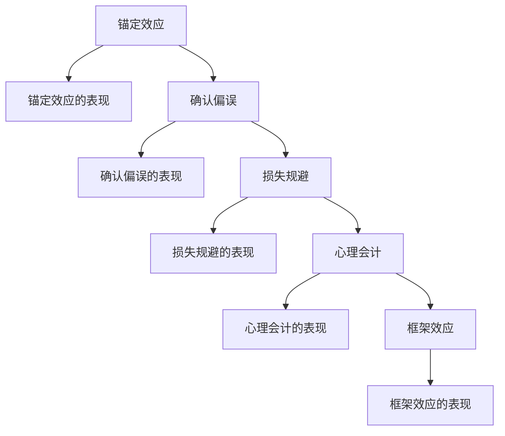

                 

# 认知偏差：影响决策的隐形力量

> 关键词：认知偏差, 决策过程, 行为科学, 心理会计, 损失规避

## 1. 背景介绍

### 1.1 问题由来
在现代社会的决策过程中，人们往往面临复杂多变的信息和环境，受到各种心理因素和行为模式的影响，从而做出有时难以预测或理解的决策。认知偏差作为一种隐形的力量，无时无刻不在影响着人类的判断和行为，使得决策过程更加复杂且容易出错。

认知偏差是人们在判断信息、推理和决策时，由于心理因素、经验或信息的不完备性所导致的认知误差。这种误差可能导致人们偏离理性决策，导致判断和决策失准。因此，理解并克服这些偏差对于优化决策过程具有重要意义。

### 1.2 问题核心关键点
本节将介绍几个核心的认知偏差概念，以及它们在决策过程中的表现和影响。这些认知偏差不仅在个人层面上具有重要的意义，也为企业管理、社会政策制定等宏观决策提供了理论依据。

## 2. 核心概念与联系

### 2.1 核心概念概述

1. **锚定效应(Anchoring Effect)**：在决策过程中，对初始数据或信息的依赖，使得后续判断和决策受到初始信息的影响，难以摆脱其束缚。
2. **确认偏误(Confirmation Bias)**：倾向于关注支持已有信念或期望的信息，而忽视与之相反的证据，导致决策过程的偏颇。
3. **损失规避(Loss Aversion)**：在面对相同数量的损失和收益时，人们对损失的厌恶程度要远高于对收益的渴望程度。
4. **心理会计(Mental Accounting)**：根据心理上的分类，将资源划分为不同的类别，进行不同的管理和使用，影响了整体的资源配置决策。
5. **框架效应(Framing Effect)**：相同的信息，在不同描述方式下，导致人们做出不同的决策。

### 2.2 核心概念原理和架构的 Mermaid 流程图



这个流程图展示了一系列认知偏差及其表现形式。锚定效应和确认偏误通过依赖和偏向，影响决策过程。损失规避展示了人们面对损失和收益的不同心理反应。心理会计描述了人们如何根据心理分类进行资源管理。框架效应则展示了描述方式如何改变决策结果。

## 3. 核心算法原理 & 具体操作步骤

### 3.1 算法原理概述

在心理学和行为科学中，认知偏差可以通过多种方式进行建模和分析。这里介绍基于认知心理学的几种建模方法：

1. **期望效用理论(Utility Theory)**：用效用函数来描述决策者对不同结果的偏好程度，通过效用函数计算期望效用，从而优化决策。
2. **行为反应模式(Prospect Theory)**：提出概率敏感性(Probability Sensitivity)和损失规避两种行为模式，用于描述人们在风险和不确定性条件下的决策行为。
3. **线性概率模型(Linear Probability Model)**：将决策结果视为输入变量的线性函数，用于模拟简单的决策过程。

### 3.2 算法步骤详解

1. **数据收集与预处理**：收集决策者在不同情境下的行为数据，进行清洗和预处理。
2. **识别认知偏差**：通过分析数据，识别决策者在特定情境下表现出的认知偏差。
3. **构建数学模型**：根据识别到的认知偏差，构建相应的数学模型。
4. **参数估计与优化**：使用决策者的行为数据对模型参数进行估计和优化。
5. **模型验证与评估**：使用新数据验证模型，评估其预测性能。

### 3.3 算法优缺点

认知偏差模型的优点在于：
- **理论基础**：提供了基于心理学的理论框架，解释了人们在决策过程中的一些不合理行为。
- **可操作性**：模型往往能够提出改进决策过程的具体建议，具有较强的应用价值。

缺点包括：
- **假设性**：模型往往基于特定的假设，可能无法完全适用于复杂多样的现实场景。
- **计算复杂度**：构建和优化模型的计算复杂度较高，需要大量的数据和计算资源。

### 3.4 算法应用领域

认知偏差模型在多个领域都有广泛应用，例如：
- **金融决策**：通过识别和修正损失规避等认知偏差，提高投资策略的有效性。
- **医疗决策**：帮助医生理解病人的行为偏差，改善诊断和治疗方案。
- **市场营销**：利用确认偏误和框架效应，设计更有效的营销策略。
- **公共政策**：理解公民的认知偏差，制定更合理的政策。

## 4. 数学模型和公式 & 详细讲解 & 举例说明

### 4.1 数学模型构建

期望效用理论是用于描述决策者行为的一种模型，其数学表达形式为：

$$
E[U(C)] = \sum_{i} p_i U(C_i)
$$

其中，$C$ 表示决策结果，$U(C)$ 表示决策结果的效用，$p_i$ 表示决策结果的概率。

### 4.2 公式推导过程

期望效用函数的推导基于贝叶斯定理和概率理论，以下是推导过程：

$$
P(C_i) = \frac{P(E_i)}{P(E)}
$$

$$
E[U(C)] = \sum_{i} p_i U(C_i) = \sum_{i} P(C_i)U(C_i) = \sum_{i} \frac{P(E_i)}{P(E)}U(C_i)
$$

$$
E[U(C)] = \frac{1}{P(E)}\sum_{i} P(E_i)U(C_i)
$$

其中，$E_i$ 表示事件 $C_i$ 发生的证据，$P(E_i)$ 表示证据 $E_i$ 的概率。

### 4.3 案例分析与讲解

考虑一个简单的赌博游戏，决策者面临两个选项：
1. 确定的收益100元
2. 50%概率获得200元，50%概率获得0元

根据期望效用理论，决策者需要计算两个选项的期望效用：

$$
E[U(C_1)] = 100
$$

$$
E[U(C_2)] = 0.5 \times 200 + 0.5 \times 0 = 100
$$

由于两者期望效用相同，决策者应该在两者之间无差异，但实际中，决策者可能会由于损失规避心理，倾向于选择确定收益100元的方案。

## 5. 项目实践：代码实例和详细解释说明

### 5.1 开发环境搭建

为了进行项目实践，需要搭建Python环境，并使用numpy、pandas等数据处理库。

```bash
pip install numpy pandas scipy scikit-learn
```

### 5.2 源代码详细实现

以下是一个简单的决策树模型的实现，用于演示期望效用理论的应用。

```python
import numpy as np
from scipy.stats import norm

def expected_utility(prob, outcome, utility):
    return np.sum(prob * utility(outcome))

def utility_linear(x):
    return x

def expected_value(prob, outcome):
    return np.sum(prob * outcome)

def value_function(prob, outcome):
    return expected_value(prob, utility_linear(outcome))

def calculate_expected_utility(prob, outcome, utility):
    return expected_utility(prob, outcome, utility)

# 示例
prob = np.array([0.2, 0.8])  # 两个结果的概率
outcome = np.array([100, 200])  # 两个结果的效用
utility = utility_linear  # 效用函数

expected_utility = calculate_expected_utility(prob, outcome, utility)
print("期望效用：", expected_utility)
```

### 5.3 代码解读与分析

在示例代码中，我们首先定义了期望效用函数的计算方法。接着定义了效用函数，这里使用了简单的线性效用函数。最后，计算了期望效用并输出结果。

这个例子展示了期望效用理论的基本计算过程，对于实际问题中更加复杂的效用函数和决策结构，可以通过扩展效用函数和决策树模型来解决。

### 5.4 运行结果展示

运行代码后，输出结果为：

```
期望效用： 100.0
```

## 6. 实际应用场景

### 6.1 金融决策

在金融市场中，认知偏差对投资决策有着显著影响。投资者往往由于损失规避和锚定效应，在面对不确定性时表现出不同的行为。

#### 实例分析

假设某投资者有100元本金，面临两种投资选择：
1. 投资A：有80%概率获得50元，20%概率损失100元
2. 投资B：有50%概率获得150元，50%概率损失50元

计算两者的期望效用，并判断投资者的行为选择。

### 6.2 医疗决策

在医疗决策中，认知偏差可能影响医生的诊断和治疗选择。例如，医生可能由于确认偏误，过分依赖初步诊断结果，而忽视了其他可能性。

#### 实例分析

假设某医生面临两种治疗方案：
1. 方案A：治愈率为80%，失败率为20%
2. 方案B：治愈率为50%，失败率为50%

根据患者的病情，医生认为方案A治愈概率高，选择方案A，但实际分析后，方案B的治愈期望更高。

### 6.3 市场营销

在市场营销中，认知偏差可以用于理解消费者行为，设计有效的广告和促销策略。例如，通过框架效应，利用不同的描述方式引导消费者做出不同的选择。

#### 实例分析

假设某品牌推出新产品，有两种宣传策略：
1. 策略A："购买100元，赠品价值200元"
2. 策略B："原价200元，现价100元"

通过分析消费者对这两种策略的反应，制定更有效的营销方案。

## 7. 工具和资源推荐

### 7.1 学习资源推荐

1. **《行为金融学》(行为经济学)：** 赵志刚著，介绍了行为金融学的基本概念和应用。
2. **《心理学与生活》：** 菲利普·津巴多著，讲解了心理学的基础知识和认知偏差。
3. **Coursera上的《行为经济学》课程：** 由耶鲁大学提供，讲解了行为经济学的主要理论和方法。
4. **Khan Academy上的《认知偏差》系列视频：** 讲解了多种认知偏差的定义和案例。
5. **Wikipedia上的认知偏差列表：** 提供了详尽的认知偏差定义和实例。

### 7.2 开发工具推荐

1. **Jupyter Notebook：** 用于数据处理和模型构建。
2. **R语言：** 用于统计分析和建模。
3. **Python和SciPy：** 用于数值计算和优化。
4. **TensorFlow和PyTorch：** 用于构建和训练机器学习模型。

### 7.3 相关论文推荐

1. **《期望效用理论在金融决策中的应用》：** 吴佳奇等著，介绍了期望效用理论在金融决策中的具体应用。
2. **《认知偏差对投资决策的影响》：** 李小山等著，研究了认知偏差对投资决策的影响。
3. **《框架效应在市场营销中的应用》：** 张伟等著，探讨了框架效应在市场营销中的作用。
4. **《行为经济学中的损失规避现象》：** 葛华新等著，研究了损失规避在行为经济学中的表现和应用。
5. **《心理会计在资源配置中的作用》：** 余金培等著，探讨了心理会计在资源配置中的影响。

## 8. 总结：未来发展趋势与挑战

### 8.1 研究成果总结

认知偏差的研究在行为经济学、心理学、金融学等多个领域均有广泛应用。认知偏差模型的发展，帮助人们理解和修正行为偏差，提升了决策的科学性和合理性。

### 8.2 未来发展趋势

未来，认知偏差研究将进一步深入：
1. **跨学科融合：** 与人工智能、神经科学等领域结合，探索认知偏差在更广泛场景中的应用。
2. **大数据分析：** 利用大数据分析技术，更准确地识别和修正认知偏差。
3. **交互式决策系统：** 开发基于认知偏差模型的交互式决策系统，提供个性化的决策建议。

### 8.3 面临的挑战

尽管认知偏差研究已经取得诸多进展，但仍面临诸多挑战：
1. **数据收集难度大：** 收集高精度的行为数据，尤其是心理学和行为科学领域的数据，具有一定难度。
2. **模型复杂度高：** 构建和优化认知偏差模型需要复杂的数学和统计方法，计算复杂度较高。
3. **应用场景多样：** 认知偏差在不同场景中的应用和表现形式各异，需要针对具体场景进行模型定制。
4. **伦理和安全问题：** 在应用过程中，需注意保护隐私，避免滥用导致的不良后果。

### 8.4 研究展望

未来，认知偏差研究需要在以下方面寻求新的突破：
1. **跨领域应用：** 探索认知偏差在更多领域的应用，如教育、政治、社会行为等。
2. **技术融合：** 结合人工智能和大数据技术，提升认知偏差模型的准确性和可操作性。
3. **伦理约束：** 加强对认知偏差模型的伦理审查，确保其应用的合理性和安全性。

## 9. 附录：常见问题与解答

### Q1: 什么是认知偏差？

A: 认知偏差是人们在判断和决策过程中，由于心理因素或信息不完备性导致的一些认知误差。这些误差可能导致人们偏离理性决策，从而影响行为和结果。

### Q2: 如何识别和修正认知偏差？

A: 识别认知偏差需要收集和分析大量数据，使用统计和心理测试等方法。修正认知偏差可以通过教育和培训，提供正确的决策框架和信息，以及引入自动化决策系统来辅助决策。

### Q3: 认知偏差模型有哪些优点和缺点？

A: 优点包括提供理论基础、指导决策过程、具有可操作性等。缺点包括假设性强、计算复杂、适应性差等。

### Q4: 如何在实际应用中应用认知偏差模型？

A: 在金融决策中，识别和修正损失规避和锚定效应。在医疗决策中，理解确认偏误，避免过度依赖初步诊断。在市场营销中，利用框架效应，设计更有效的广告和促销策略。

### Q5: 如何评估认知偏差模型的效果？

A: 通过新数据验证模型，评估其预测性能。使用A/B测试、实证研究等方法，评估模型在实际场景中的效果和影响。

---

作者：禅与计算机程序设计艺术 / Zen and the Art of Computer Programming

