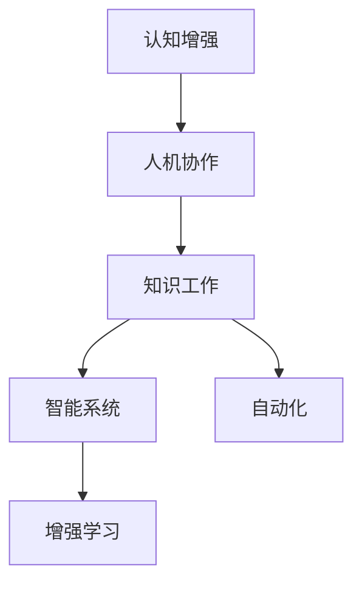

                 

# 认知增强与人机协作：知识工作的未来

> 关键词：认知增强, 人机协作, 知识工作, 智能系统, 自动化, 增强学习, 自然语言处理, 数据融合

## 1. 背景介绍

### 1.1 问题由来
随着人工智能(AI)技术的飞速发展，人机协作已成为现代知识工作的重要趋势。传统的人类知识工作者面临工作强度高、信息过载、决策效率低等诸多挑战。通过引入智能系统，自动化其重复性、低价值工作，将人类从繁杂的工作中解脱出来，专注于创造性、高价值的工作，可以大幅提升生产效率和创新能力。

当前，人工智能技术在处理结构化数据方面已经取得了显著进展，诸如计算机视觉、自然语言处理等领域，已经有许多基于深度学习模型的优秀成果。然而，对于知识密集型任务，如知识工程、法律咨询、财务管理等，基于规则或专家知识的传统系统仍然占据主导地位。

大模型时代的到来，特别是预训练语言模型BERT、GPT系列等的问世，为知识工作的自动化和智能化带来了新的机遇。通过在预训练大模型基础上进行微调，可以使其具备解决特定领域问题的能力，形成认知增强的人机协作系统。

### 1.2 问题核心关键点
本节将详细介绍基于认知增强的人机协作系统，其核心关键点在于：

1. **认知增强**：通过预训练大模型获取语义表示，增强人类对语言和逻辑的理解，提高决策的准确性和效率。

2. **人机协作**：将人机互为补充，让人类从繁琐的数据分析、规则执行等任务中解脱出来，专注于复杂的推理、决策、创意等工作。

3. **知识工作**：人机协作系统服务于知识密集型任务，如法律咨询、医学诊断、财务分析等，通过自动化处理数据和规则，提高知识工作的生产效率和质量。

4. **智能系统**：基于深度学习、知识图谱、推理机制等技术构建的智能化系统，能够处理复杂多变的知识密集型任务。

5. **自动化**：通过认知增强，智能化系统能够自动完成诸如信息检索、文档分类、报表生成等低价值工作，提升整体工作效率。

6. **增强学习**：智能系统通过与人类工作者不断互动，学习最优的工作策略，逐步提升其智能水平和协作效果。

这些核心关键点构成了认知增强人机协作系统的技术基础，使其在知识密集型领域中发挥着越来越重要的作用。

## 2. 核心概念与联系

### 2.1 核心概念概述

为更好地理解认知增强人机协作系统的构建，本节将介绍几个关键概念：

1. **认知增强**：利用深度学习模型，对语言和逻辑知识进行自动编码和理解，增强人类对复杂知识工作的处理能力。

2. **人机协作**：将人类工作者与智能系统进行有机结合，互为补充，共同完成复杂任务。

3. **知识工作**：涉及大量知识的收集、整理、分析、推理等复杂任务，对人类智慧有高度依赖性。

4. **智能系统**：基于机器学习和推理机制构建的系统，具备自主决策、执行、优化能力。

5. **自动化**：利用人工智能技术自动化完成低价值任务，提升生产效率。

6. **增强学习**：通过人机互动，智能系统不断学习优化，提高工作质量。

这些核心概念之间的逻辑关系可以通过以下Mermaid流程图来展示：



这个流程图展示了几者之间的联系：

1. 认知增强系统通过增强人类的认知能力，使人机协作更高效。
2. 人机协作使得智能系统能够更好地理解和执行复杂任务。
3. 智能系统为自动化提供了更强大的支持。
4. 增强学习使智能系统不断进步，优化协作效果。

## 3. 核心算法原理 & 具体操作步骤
### 3.1 算法原理概述

认知增强人机协作系统通过在大规模预训练语言模型基础上进行微调，获得针对特定知识工作任务的增强能力。其核心算法包括预训练、微调和增强学习三个部分。

1. **预训练**：在大量无标签文本数据上进行自监督学习，获取语言知识表示。

2. **微调**：在特定领域标注数据上，对预训练模型进行有监督微调，增强特定领域能力。

3. **增强学习**：在实际人机协作中，通过不断反馈和优化，提升智能系统的协作效果。

### 3.2 算法步骤详解

以下详细讲解认知增强人机协作系统的实现步骤：

**Step 1: 准备预训练模型和数据集**
- 选择合适的预训练语言模型，如BERT、GPT系列等。
- 收集特定领域的标注数据集，划分为训练集、验证集和测试集。

**Step 2: 添加任务适配层**
- 根据任务类型，在预训练模型顶层设计合适的输出层和损失函数。
- 对于分类任务，通常添加线性分类器和交叉熵损失函数。
- 对于生成任务，通常使用语言模型的解码器输出概率分布，并以负对数似然为损失函数。

**Step 3: 设置微调超参数**
- 选择合适的优化算法及其参数，如AdamW、SGD等，设置学习率、批大小、迭代轮数等。
- 设置正则化技术及强度，包括权重衰减、Dropout、Early Stopping等。
- 确定冻结预训练参数的策略，如仅微调顶层，或全部参数都参与微调。

**Step 4: 执行梯度训练**
- 将训练集数据分批次输入模型，前向传播计算损失函数。
- 反向传播计算参数梯度，根据设定的优化算法和学习率更新模型参数。
- 周期性在验证集上评估模型性能，根据性能指标决定是否触发 Early Stopping。
- 重复上述步骤直到满足预设的迭代轮数或 Early Stopping 条件。

**Step 5: 测试和部署**
- 在测试集上评估微调后模型的效果，对比微调前后的精度提升。
- 使用微调后的模型对新样本进行推理预测，集成到实际的应用系统中。
- 持续收集新的数据，定期重新微调模型，以适应数据分布的变化。

### 3.3 算法优缺点

认知增强人机协作系统具有以下优点：
1. 提升生产效率：通过自动化处理低价值任务，人类工作者可以将更多精力投入创造性、高价值工作，大幅提升工作效率。
2. 提高决策质量：利用深度学习模型的语义理解能力，能够帮助人类工作者更准确地做出决策。
3. 支持复杂任务：认知增强系统能够处理多模态数据和复杂逻辑推理，适用于各种知识密集型任务。
4. 动态优化：通过增强学习不断优化，智能系统能够适应变化的环境，提升协作效果。

同时，该方法也存在一些局限性：
1. 依赖标注数据：微调的效果很大程度上取决于标注数据的质量和数量，获取高质量标注数据的成本较高。
2. 迁移能力有限：当目标任务与预训练数据的分布差异较大时，微调的性能提升有限。
3. 可解释性不足：认知增强系统的决策过程通常缺乏可解释性，难以对其推理逻辑进行分析和调试。
4. 模型复杂度高：预训练模型和微调过程需要大量的计算资源和存储空间，构建复杂系统较为困难。

尽管存在这些局限性，但就目前而言，基于认知增强的人机协作方法仍然是大规模应用的主流范式。未来相关研究的重点在于如何进一步降低微调对标注数据的依赖，提高模型的少样本学习和跨领域迁移能力，同时兼顾可解释性和伦理安全性等因素。

### 3.4 算法应用领域

认知增强人机协作系统已经在知识密集型任务中得到广泛应用，覆盖了多个领域：

1. **法律咨询**：智能法律咨询系统能够快速检索相关法律条款，提供类似案例的参考，辅助律师进行法律分析和案件处理。
2. **医学诊断**：基于深度学习模型的医学影像识别系统，可以快速、准确地诊断疾病，辅助医生进行诊断和治疗决策。
3. **财务分析**：智能财务分析系统能够自动化处理大量财务数据，进行财务报表生成、风险评估等。
4. **智能客服**：认知增强客服系统能够通过理解自然语言，提供个性化的客户服务，解决常见问题，提升客户满意度。
5. **内容创作**：智能内容生成系统能够自动生成新闻、文章、报告等文本内容，提升内容创作效率和质量。
6. **金融交易**：基于认知增强的系统能够快速分析市场动态，提供交易建议，辅助投资者做出决策。
7. **舆情监测**：智能舆情分析系统能够自动监测网络舆情，识别关键信息，提供预警和分析报告。

除了上述这些经典应用外，认知增强人机协作系统还不断创新性地拓展到更多场景中，如智能推荐、智能制造、智慧城市等，为各行各业带来新的变革。

## 4. 数学模型和公式 & 详细讲解  
### 4.1 数学模型构建

本节将使用数学语言对认知增强人机协作系统的构建进行更加严格的刻画。

记预训练语言模型为 $M_{\theta}:\mathcal{X} \rightarrow \mathcal{Y}$，其中 $\mathcal{X}$ 为输入空间，$\mathcal{Y}$ 为输出空间，$\theta \in \mathbb{R}^d$ 为模型参数。假设微调任务的训练集为 $D=\{(x_i,y_i)\}_{i=1}^N, x_i \in \mathcal{X}, y_i \in \mathcal{Y}$。

定义模型 $M_{\theta}$ 在输入 $x$ 上的损失函数为 $\ell(M_{\theta}(x),y)$，则在数据集 $D$ 上的经验风险为：

$$
\mathcal{L}(\theta) = \frac{1}{N} \sum_{i=1}^N \ell(M_{\theta}(x_i),y_i)
$$

微调的优化目标是最小化经验风险，即找到最优参数：

$$
\theta^* = \mathop{\arg\min}_{\theta} \mathcal{L}(\theta)
$$

在实践中，我们通常使用基于梯度的优化算法（如SGD、Adam等）来近似求解上述最优化问题。设 $\eta$ 为学习率，$\lambda$ 为正则化系数，则参数的更新公式为：

$$
\theta \leftarrow \theta - \eta \nabla_{\theta}\mathcal{L}(\theta) - \eta\lambda\theta
$$

其中 $\nabla_{\theta}\mathcal{L}(\theta)$ 为损失函数对参数 $\theta$ 的梯度，可通过反向传播算法高效计算。

### 4.2 公式推导过程

以下我们以二分类任务为例，推导交叉熵损失函数及其梯度的计算公式。

假设模型 $M_{\theta}$ 在输入 $x$ 上的输出为 $\hat{y}=M_{\theta}(x) \in [0,1]$，表示样本属于正类的概率。真实标签 $y \in \{0,1\}$。则二分类交叉熵损失函数定义为：

$$
\ell(M_{\theta}(x),y) = -[y\log \hat{y} + (1-y)\log (1-\hat{y})]
$$

将其代入经验风险公式，得：

$$
\mathcal{L}(\theta) = -\frac{1}{N}\sum_{i=1}^N [y_i\log M_{\theta}(x_i)+(1-y_i)\log(1-M_{\theta}(x_i))]
$$

根据链式法则，损失函数对参数 $\theta_k$ 的梯度为：

$$
\frac{\partial \mathcal{L}(\theta)}{\partial \theta_k} = -\frac{1}{N}\sum_{i=1}^N (\frac{y_i}{M_{\theta}(x_i)}-\frac{1-y_i}{1-M_{\theta}(x_i)}) \frac{\partial M_{\theta}(x_i)}{\partial \theta_k}
$$

其中 $\frac{\partial M_{\theta}(x_i)}{\partial \theta_k}$ 可进一步递归展开，利用自动微分技术完成计算。

在得到损失函数的梯度后，即可带入参数更新公式，完成模型的迭代优化。重复上述过程直至收敛，最终得到适应下游任务的最优模型参数 $\theta^*$。

## 5. 项目实践：代码实例和详细解释说明
### 5.1 开发环境搭建

在进行认知增强人机协作系统开发前，我们需要准备好开发环境。以下是使用Python进行PyTorch开发的环境配置流程：

1. 安装Anaconda：从官网下载并安装Anaconda，用于创建独立的Python环境。

2. 创建并激活虚拟环境：
```bash
conda create -n pytorch-env python=3.8 
conda activate pytorch-env
```

3. 安装PyTorch：根据CUDA版本，从官网获取对应的安装命令。例如：
```bash
conda install pytorch torchvision torchaudio cudatoolkit=11.1 -c pytorch -c conda-forge
```

4. 安装Transformers库：
```bash
pip install transformers
```

5. 安装各类工具包：
```bash
pip install numpy pandas scikit-learn matplotlib tqdm jupyter notebook ipython
```

完成上述步骤后，即可在`pytorch-env`环境中开始项目实践。

### 5.2 源代码详细实现

下面我们以智能财务分析系统为例，给出使用Transformers库对BERT模型进行认知增强的PyTorch代码实现。

首先，定义财务分析任务的数据处理函数：

```python
from transformers import BertTokenizer
from torch.utils.data import Dataset
import torch

class FinancialAnalysisDataset(Dataset):
    def __init__(self, texts, tags, tokenizer, max_len=128):
        self.texts = texts
        self.tags = tags
        self.tokenizer = tokenizer
        self.max_len = max_len
        
    def __len__(self):
        return len(self.texts)
    
    def __getitem__(self, item):
        text = self.texts[item]
        tags = self.tags[item]
        
        encoding = self.tokenizer(text, return_tensors='pt', max_length=self.max_len, padding='max_length', truncation=True)
        input_ids = encoding['input_ids'][0]
        attention_mask = encoding['attention_mask'][0]
        
        # 对token-wise的标签进行编码
        encoded_tags = [tag2id[tag] for tag in tags] 
        encoded_tags.extend([tag2id['O']] * (self.max_len - len(encoded_tags)))
        labels = torch.tensor(encoded_tags, dtype=torch.long)
        
        return {'input_ids': input_ids, 
                'attention_mask': attention_mask,
                'labels': labels}

# 标签与id的映射
tag2id = {'O': 0, 'POSITIVE': 1, 'NEGATIVE': 2}
id2tag = {v: k for k, v in tag2id.items()}

# 创建dataset
tokenizer = BertTokenizer.from_pretrained('bert-base-cased')

train_dataset = FinancialAnalysisDataset(train_texts, train_tags, tokenizer)
dev_dataset = FinancialAnalysisDataset(dev_texts, dev_tags, tokenizer)
test_dataset = FinancialAnalysisDataset(test_texts, test_tags, tokenizer)
```

然后，定义模型和优化器：

```python
from transformers import BertForTokenClassification, AdamW

model = BertForTokenClassification.from_pretrained('bert-base-cased', num_labels=len(tag2id))

optimizer = AdamW(model.parameters(), lr=2e-5)
```

接着，定义训练和评估函数：

```python
from torch.utils.data import DataLoader
from tqdm import tqdm
from sklearn.metrics import classification_report

device = torch.device('cuda') if torch.cuda.is_available() else torch.device('cpu')
model.to(device)

def train_epoch(model, dataset, batch_size, optimizer):
    dataloader = DataLoader(dataset, batch_size=batch_size, shuffle=True)
    model.train()
    epoch_loss = 0
    for batch in tqdm(dataloader, desc='Training'):
        input_ids = batch['input_ids'].to(device)
        attention_mask = batch['attention_mask'].to(device)
        labels = batch['labels'].to(device)
        model.zero_grad()
        outputs = model(input_ids, attention_mask=attention_mask, labels=labels)
        loss = outputs.loss
        epoch_loss += loss.item()
        loss.backward()
        optimizer.step()
    return epoch_loss / len(dataloader)

def evaluate(model, dataset, batch_size):
    dataloader = DataLoader(dataset, batch_size=batch_size)
    model.eval()
    preds, labels = [], []
    with torch.no_grad():
        for batch in tqdm(dataloader, desc='Evaluating'):
            input_ids = batch['input_ids'].to(device)
            attention_mask = batch['attention_mask'].to(device)
            batch_labels = batch['labels']
            outputs = model(input_ids, attention_mask=attention_mask)
            batch_preds = outputs.logits.argmax(dim=2).to('cpu').tolist()
            batch_labels = batch_labels.to('cpu').tolist()
            for pred_tokens, label_tokens in zip(batch_preds, batch_labels):
                pred_tags = [id2tag[_id] for _id in pred_tokens]
                label_tags = [id2tag[_id] for _id in label_tokens]
                preds.append(pred_tags[:len(label_tags)])
                labels.append(label_tags)
                
    print(classification_report(labels, preds))
```

最后，启动训练流程并在测试集上评估：

```python
epochs = 5
batch_size = 16

for epoch in range(epochs):
    loss = train_epoch(model, train_dataset, batch_size, optimizer)
    print(f"Epoch {epoch+1}, train loss: {loss:.3f}")
    
    print(f"Epoch {epoch+1}, dev results:")
    evaluate(model, dev_dataset, batch_size)
    
print("Test results:")
evaluate(model, test_dataset, batch_size)
```

以上就是使用PyTorch对BERT进行智能财务分析任务认知增强的完整代码实现。可以看到，得益于Transformers库的强大封装，我们可以用相对简洁的代码完成BERT模型的加载和微调。

### 5.3 代码解读与分析

让我们再详细解读一下关键代码的实现细节：

**FinancialAnalysisDataset类**：
- `__init__`方法：初始化文本、标签、分词器等关键组件。
- `__len__`方法：返回数据集的样本数量。
- `__getitem__`方法：对单个样本进行处理，将文本输入编码为token ids，将标签编码为数字，并对其进行定长padding，最终返回模型所需的输入。

**tag2id和id2tag字典**：
- 定义了标签与数字id之间的映射关系，用于将token-wise的预测结果解码回真实的标签。

**训练和评估函数**：
- 使用PyTorch的DataLoader对数据集进行批次化加载，供模型训练和推理使用。
- 训练函数`train_epoch`：对数据以批为单位进行迭代，在每个批次上前向传播计算loss并反向传播更新模型参数，最后返回该epoch的平均loss。
- 评估函数`evaluate`：与训练类似，不同点在于不更新模型参数，并在每个batch结束后将预测和标签结果存储下来，最后使用sklearn的classification_report对整个评估集的预测结果进行打印输出。

**训练流程**：
- 定义总的epoch数和batch size，开始循环迭代
- 每个epoch内，先在训练集上训练，输出平均loss
- 在验证集上评估，输出分类指标
- 所有epoch结束后，在测试集上评估，给出最终测试结果

可以看到，PyTorch配合Transformers库使得BERT认知增强的代码实现变得简洁高效。开发者可以将更多精力放在数据处理、模型改进等高层逻辑上，而不必过多关注底层的实现细节。

当然，工业级的系统实现还需考虑更多因素，如模型的保存和部署、超参数的自动搜索、更灵活的任务适配层等。但核心的认知增强范式基本与此类似。

## 6. 实际应用场景
### 6.1 智能法律咨询

智能法律咨询系统利用预训练大模型的语义理解能力，快速检索相关法律条款，并提供类似案例的参考，辅助律师进行法律分析和案件处理。例如，在医疗纠纷案件中，系统可以快速定位到相关法律法规，提取案件关键点，提供相似案例的判例参考，帮助律师进行法律分析和辩论。

此外，系统还可以根据用户输入的自然语言问题，自动生成法律咨询报告，节省律师的文书工作，提高工作效率。

### 6.2 智能健康诊断

基于深度学习模型的医学影像识别系统，能够快速、准确地诊断疾病，辅助医生进行诊断和治疗决策。例如，在肺癌筛查中，系统能够自动识别X光或CT影像中的异常区域，提供初步诊断结果和相关医疗建议。

系统还可以集成自然语言处理技术，自动从病历、报告中提取关键信息，提供全面的诊断报告，辅助医生做出更准确的诊断。

### 6.3 智能财务分析

智能财务分析系统能够自动化处理大量财务数据，进行财务报表生成、风险评估等。例如，系统可以自动从财务报表中提取关键数据，生成财务分析报告，提供公司财务状况的概述和风险预警。

系统还可以根据历史财务数据，预测公司未来财务状况，辅助投资者做出更明智的投资决策。

### 6.4 智能客服系统

认知增强客服系统能够通过理解自然语言，提供个性化的客户服务，解决常见问题，提升客户满意度。例如，在智能客服系统中，系统能够根据用户输入的自然语言问题，自动查找解决方案，并生成答复。

此外，系统还可以集成自然语言生成技术，自动生成个性化的回复，提升客户交互体验。

### 6.5 智能内容创作

智能内容生成系统能够自动生成新闻、文章、报告等文本内容，提升内容创作效率和质量。例如，系统可以自动从新闻资讯中提取关键信息，生成新闻摘要，节省记者的时间。

系统还可以根据用户输入的需求，自动生成相关内容的草稿，辅助作者进行创作，提升内容创作效率。

### 6.6 智能推荐系统

智能推荐系统能够自动分析用户的行为数据和偏好，推荐个性化的商品、内容等。例如，在电商平台中，系统可以根据用户的浏览历史、购买记录，推荐相关商品，提升用户购买转化率。

系统还可以集成自然语言处理技术，自动从评论、反馈中提取用户需求，提供更精准的推荐。

### 6.7 智能舆情监测

智能舆情分析系统能够自动监测网络舆情，识别关键信息，提供预警和分析报告。例如，在突发事件中，系统可以实时监测社交媒体、新闻等渠道的舆情变化，提供事件发展的实时监控和预警。

系统还可以集成自然语言处理技术，自动从舆情数据中提取关键信息，提供更全面的分析报告，辅助政府和企业应对突发事件。

### 6.8 智能制造系统

基于深度学习模型的智能制造系统，能够自动优化生产流程，提升生产效率和质量。例如，在汽车制造中，系统可以自动从传感器数据中提取生产过程中的关键信息，进行故障检测和预测，优化生产流程。

系统还可以集成自然语言处理技术，自动从生产日志中提取关键信息，提供生产流程的优化建议，提升生产效率和质量。

## 7. 工具和资源推荐
### 7.1 学习资源推荐

为了帮助开发者系统掌握认知增强人机协作系统的理论基础和实践技巧，这里推荐一些优质的学习资源：

1. 《Transformer从原理到实践》系列博文：由大模型技术专家撰写，深入浅出地介绍了Transformer原理、BERT模型、认知增强技术等前沿话题。

2. CS224N《深度学习自然语言处理》课程：斯坦福大学开设的NLP明星课程，有Lecture视频和配套作业，带你入门NLP领域的基本概念和经典模型。

3. 《Natural Language Processing with Transformers》书籍：Transformers库的作者所著，全面介绍了如何使用Transformers库进行NLP任务开发，包括认知增强在内的诸多范式。

4. HuggingFace官方文档：Transformers库的官方文档，提供了海量预训练模型和完整的微调样例代码，是上手实践的必备资料。

5. CLUE开源项目：中文语言理解测评基准，涵盖大量不同类型的中文NLP数据集，并提供了基于认知增强的baseline模型，助力中文NLP技术发展。

通过对这些资源的学习实践，相信你一定能够快速掌握认知增强人机协作系统的精髓，并用于解决实际的NLP问题。
###  7.2 开发工具推荐

高效的开发离不开优秀的工具支持。以下是几款用于认知增强人机协作系统开发的常用工具：

1. PyTorch：基于Python的开源深度学习框架，灵活动态的计算图，适合快速迭代研究。大部分预训练语言模型都有PyTorch版本的实现。

2. TensorFlow：由Google主导开发的开源深度学习框架，生产部署方便，适合大规模工程应用。同样有丰富的预训练语言模型资源。

3. Transformers库：HuggingFace开发的NLP工具库，集成了众多SOTA语言模型，支持PyTorch和TensorFlow，是进行认知增强任务开发的利器。

4. Weights & Biases：模型训练的实验跟踪工具，可以记录和可视化模型训练过程中的各项指标，方便对比和调优。与主流深度学习框架无缝集成。

5. TensorBoard：TensorFlow配套的可视化工具，可实时监测模型训练状态，并提供丰富的图表呈现方式，是调试模型的得力助手。

6. Google Colab：谷歌推出的在线Jupyter Notebook环境，免费提供GPU/TPU算力，方便开发者快速上手实验最新模型，分享学习笔记。

合理利用这些工具，可以显著提升认知增强人机协作系统的开发效率，加快创新迭代的步伐。

### 7.3 相关论文推荐

认知增强人机协作系统的发展源于学界的持续研究。以下是几篇奠基性的相关论文，推荐阅读：

1. Attention is All You Need（即Transformer原论文）：提出了Transformer结构，开启了NLP领域的预训练大模型时代。

2. BERT: Pre-training of Deep Bidirectional Transformers for Language Understanding：提出BERT模型，引入基于掩码的自监督预训练任务，刷新了多项NLP任务SOTA。

3. Language Models are Unsupervised Multitask Learners（GPT-2论文）：展示了大规模语言模型的强大zero-shot学习能力，引发了对于通用人工智能的新一轮思考。

4. Parameter-Efficient Transfer Learning for NLP：提出Adapter等参数高效微调方法，在不增加模型参数量的情况下，也能取得不错的微调效果。

5. Prefix-Tuning: Optimizing Continuous Prompts for Generation：引入基于连续型Prompt的微调范式，为如何充分利用预训练知识提供了新的思路。

6. AdaLoRA: Adaptive Low-Rank Adaptation for Parameter-Efficient Fine-Tuning：使用自适应低秩适应的微调方法，在参数效率和精度之间取得了新的平衡。

这些论文代表了大模型认知增强技术的发展脉络。通过学习这些前沿成果，可以帮助研究者把握学科前进方向，激发更多的创新灵感。

## 8. 总结：未来发展趋势与挑战

### 8.1 总结

本文对认知增强人机协作系统的构建进行了全面系统的介绍。首先阐述了认知增强系统在知识工作中的应用背景和意义，明确了人机协作在提升工作效率和决策质量方面的独特价值。其次，从原理到实践，详细讲解了认知增强的数学原理和关键步骤，给出了认知增强任务开发的完整代码实例。同时，本文还广泛探讨了认知增强系统在法律咨询、健康诊断、财务分析等多个行业领域的应用前景，展示了认知增强技术的巨大潜力。此外，本文精选了认知增强技术的各类学习资源，力求为读者提供全方位的技术指引。

通过本文的系统梳理，可以看到，认知增强人机协作系统正在成为知识工作自动化和智能化的重要工具，极大地提升了大规模知识密集型任务的效率和质量。未来，伴随认知增强技术、深度学习技术、知识图谱技术等的不断进步，认知增强系统必将进一步拓展应用领域，成为智能化时代的强大引擎。

### 8.2 未来发展趋势

展望未来，认知增强人机协作系统将呈现以下几个发展趋势：

1. 模型规模持续增大。随着算力成本的下降和数据规模的扩张，预训练语言模型的参数量还将持续增长。超大规模语言模型蕴含的丰富语言知识，有望支撑更加复杂多变的知识密集型任务。

2. 增强学习成为常态。随着深度学习模型的不断进步，认知增强系统将更加智能，通过与人类工作者不断互动，学习最优的工作策略，逐步提升其智能水平和协作效果。

3. 跨领域迁移能力增强。通过微调和增强学习，认知增强系统能够更好地适应不同领域的工作任务，提高系统的泛化能力和应用范围。

4. 多模态融合加深。认知增强系统将进一步拓展到多模态数据融合，集成视觉、语音、文本等多模态信息，提供更加全面、准确的认知增强支持。

5. 伦理和安全问题重视。随着认知增强系统的广泛应用，如何确保系统行为的透明性、可解释性和安全性，将成为重要的研究方向。

6. 人机协同更加高效。通过认知增强，智能系统将更高效地完成低价值任务，释放人类工作者的创造性和高价值工作，提升整体生产力。

以上趋势凸显了认知增强人机协作系统的广阔前景。这些方向的探索发展，必将进一步提升知识工作的效率和质量，为经济社会发展注入新的动力。

### 8.3 面临的挑战

尽管认知增强人机协作系统已经取得了瞩目成就，但在迈向更加智能化、普适化应用的过程中，它仍面临着诸多挑战：

1. 标注成本瓶颈。虽然认知增强系统减少了标注数据的需求，但对于长尾应用场景，仍需大量高质量标注数据，获取成本较高。如何进一步降低微调对标注样本的依赖，将是一大难题。

2. 模型鲁棒性不足。认知增强系统面对域外数据时，泛化性能往往大打折扣。对于测试样本的微小扰动，模型容易发生波动。如何提高模型的鲁棒性，避免灾难性遗忘，还需要更多理论和实践的积累。

3. 推理效率有待提高。大规模语言模型虽然精度高，但在实际部署时往往面临推理速度慢、内存占用大等效率问题。如何在保证性能的同时，简化模型结构，提升推理速度，优化资源占用，将是重要的优化方向。

4. 可解释性亟需加强。认知增强系统的决策过程通常缺乏可解释性，难以对其推理逻辑进行分析和调试。对于医疗、金融等高风险应用，算法的可解释性和可审计性尤为重要。如何赋予认知增强系统更强的可解释性，将是亟待攻克的难题。

5. 安全性有待保障。预训练语言模型难免会学习到有偏见、有害的信息，通过认知增强传递到下游任务，产生误导性、歧视性的输出，给实际应用带来安全隐患。如何从数据和算法层面消除模型偏见，避免恶意用途，确保输出的安全性，也将是重要的研究课题。

6. 知识整合能力不足。现有的认知增强系统往往局限于任务内数据，难以灵活吸收和运用更广泛的先验知识。如何让认知增强过程更好地与外部知识库、规则库等专家知识结合，形成更加全面、准确的信息整合能力，还有很大的想象空间。

正视认知增强系统面临的这些挑战，积极应对并寻求突破，将是人机协作走向成熟的必由之路。相信随着学界和产业界的共同努力，这些挑战终将一一被克服，认知增强人机协作系统必将在构建人机协同的智能时代中扮演越来越重要的角色。

### 8.4 研究展望

面对认知增强人机协作系统所面临的种种挑战，未来的研究需要在以下几个方面寻求新的突破：

1. 探索无监督和半监督认知增强方法。摆脱对大规模标注数据的依赖，利用自监督学习、主动学习等无监督和半监督范式，最大限度利用非结构化数据，实现更加灵活高效的认知增强。

2. 研究参数高效和计算高效的认知增强范式。开发更加参数高效的认知增强方法，在固定大部分预训练参数的同时，只更新极少量的任务相关参数。同时优化认知增强模型的计算图，减少前向传播和反向传播的资源消耗，实现更加轻量级、实时性的部署。

3. 融合因果和对比学习范式。通过引入因果推断和对比学习思想，增强认知增强模型建立稳定因果关系的能力，学习更加普适、鲁棒的语言表征，从而提升模型泛化性和抗干扰能力。

4. 引入更多先验知识。将符号化的先验知识，如知识图谱、逻辑规则等，与神经网络模型进行巧妙融合，引导认知增强过程学习更准确、合理的语言模型。同时加强不同模态数据的整合，实现视觉、语音等多模态信息与文本信息的协同建模。

5. 结合因果分析和博弈论工具。将因果分析方法引入认知增强模型，识别出模型决策的关键特征，增强输出解释的因果性和逻辑性。借助博弈论工具刻画人机交互过程，主动探索并规避模型的脆弱点，提高系统稳定性。

6. 纳入伦理道德约束。在模型训练目标中引入伦理导向的评估指标，过滤和惩罚有偏见、有害的输出倾向。同时加强人工干预和审核，建立模型行为的监管机制，确保输出符合人类价值观和伦理道德。

这些研究方向的探索，必将引领认知增强人机协作技术迈向更高的台阶，为构建安全、可靠、可解释、可控的智能系统铺平道路。面向未来，认知增强人机协作技术还需要与其他人工智能技术进行更深入的融合，如知识表示、因果推理、强化学习等，多路径协同发力，共同推动自然语言理解和智能交互系统的进步。只有勇于创新、敢于突破，才能不断拓展语言模型的边界，让智能技术更好地造福人类社会。

## 9. 附录：常见问题与解答
### Q1: 认知增强人机协作系统的核心优势是什么？

A: 认知增强人机协作系统的核心优势在于提升知识工作者的效率和决策质量。通过利用预训练大模型的语义理解能力，系统能够自动完成低价值任务，释放人类工作者的创造性和高价值工作。同时，系统能够提供基于深度学习模型的智能分析，辅助人类进行决策，提高整体工作效率和决策准确性。

### Q2: 认知增强人机协作系统在实际应用中面临哪些挑战？

A: 认知增强人机协作系统在实际应用中面临以下挑战：

1. 标注成本高：认知增强系统仍需大量高质量标注数据，获取成本较高。

2. 模型鲁棒性不足：面对域外数据，认知增强系统泛化性能有限。

3. 推理效率低：大规模语言模型在实际部署时面临推理速度慢、内存占用大等问题。

4. 可解释性不足：认知增强系统的决策过程缺乏可解释性，难以对其推理逻辑进行分析和调试。

5. 安全性问题：预训练语言模型可能学习到有害信息，通过认知增强传递到下游任务，给实际应用带来安全隐患。

6. 知识整合能力不足：系统难以灵活吸收和运用广泛的先验知识。

### Q3: 认知增强人机协作系统如何实现高效的自动化处理？

A: 认知增强人机协作系统通过预训练大模型获取语义表示，增强人类对复杂知识工作的处理能力。系统能够自动处理低价值任务，如信息检索、文档分类、报表生成等。同时，系统还可以集成自然语言生成技术，自动生成个性化的回复和报告，提升自动化处理效率。

### Q4: 如何构建高效可靠的认知增强人机协作系统？

A: 构建高效可靠的认知增强人机协作系统需要综合考虑以下几个方面：

1. 选择合适的预训练模型，根据任务需求进行微调。

2. 设计合适的任务适配层，根据任务类型选择合适的输出层和损失函数。

3. 设置合理的微调超参数，包括学习率、批大小、迭代轮数等。

4. 应用正则化技术，防止模型过拟合。

5. 结合增强学习，不断优化认知增强系统的性能。

6. 关注系统可解释性和安全性，确保其决策透明性和可靠性。

7. 持续收集新数据，定期重新微调模型，保持系统的时效性和适应性。

通过以上步骤，可以构建出高效、可靠的认知增强人机协作系统，提升知识工作的效率和质量。

