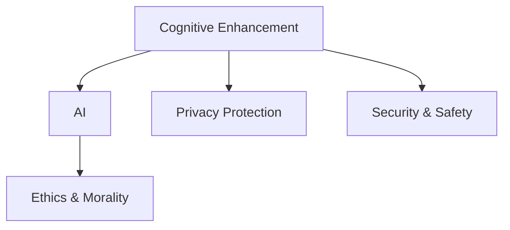

                 

# 认知增强与伦理边界的探讨

> 关键词：认知增强,人工智能,伦理道德,隐私保护,安全防护

## 1. 背景介绍

### 1.1 问题由来

在当前信息爆炸的时代，人工智能（AI）技术已经广泛应用于各个领域，极大地提升了生产效率和生活质量。然而，AI技术的快速进步也带来了新的伦理和道德挑战。特别是在认知增强领域，AI系统通过提升人类的感知、学习和决策能力，可能改变个体和社会的行为模式，带来未知的风险和影响。因此，探讨AI在认知增强中的伦理边界，不仅是技术发展的基础，也是社会责任的重要体现。

### 1.2 问题核心关键点

当前，AI在认知增强领域的应用面临着以下几个核心问题：

- 认知增强AI系统的设计原则和伦理准则是什么？
- AI如何平衡提升认知能力与保护用户隐私之间的关系？
- 如何在确保AI安全的前提下，最大化AI系统的性能和效益？
- AI在认知增强过程中，如何避免偏见和歧视？
- 如何建立健全的监管机制，防止AI技术的滥用？

解决这些问题，不仅需要技术创新，还需要跨学科的合作和多利益相关方的共同努力。本文将从技术、伦理、法律等多个维度，深入探讨AI在认知增强中的应用，并提出相应的解决方案。

## 2. 核心概念与联系

### 2.1 核心概念概述

为更好地理解AI在认知增强中的应用，本节将介绍几个密切相关的核心概念：

- 认知增强(Cognitive Enhancement)：通过AI技术，提升人类的感知、学习、决策等方面的认知能力。常见的认知增强方式包括药物增强、脑机接口、AI辅助学习等。
- 人工智能(Artificial Intelligence, AI)：一种模拟人类智能行为的技术，能够通过算法和计算，实现自动化的感知、推理和决策。
- 伦理道德(Ethics & Morality)：指导AI应用决策的道德规范和伦理准则，涉及个人隐私、公平性、责任归属等方面。
- 隐私保护(Privacy Protection)：保护个人隐私不被未经授权的收集、使用和共享。
- 安全防护(Security & Safety)：确保AI系统在运行过程中的安全性，防止被恶意利用。

这些概念之间的逻辑关系可以通过以下Mermaid流程图来展示：



这个流程图展示认知增强AI系统的核心概念及其之间的关系：

1. 认知增强旨在通过AI技术提升人类认知能力，涉及感知、学习、决策等多个方面。
2. AI作为认知增强的工具，能够在感知、推理、决策等环节提供智能支持。
3. 伦理道德是AI应用的基础，指导AI系统的设计原则和行为规范。
4. 隐私保护和数据安全是AI系统设计和运行的关键考量，确保用户数据不被滥用。
5. 安全防护不仅涉及数据安全，还涉及系统的整体安全性，防止AI系统被恶意利用。

这些核心概念共同构成了认知增强AI系统的应用框架，使其能够在提升人类认知能力的同时，遵守道德规范，确保数据安全，维护系统稳定。

## 3. 核心算法原理 & 具体操作步骤
### 3.1 算法原理概述

认知增强AI系统通常通过感知增强、学习增强和决策增强等技术手段，提升人类的认知能力。这些技术手段包括但不限于：

- 感知增强：通过增强现实(AR)、虚拟现实(VR)、脑机接口(BMI)等技术，提升人类对环境的感知能力。
- 学习增强：通过AI辅助学习、智能推荐系统等技术，提升人类的学习效率和质量。
- 决策增强：通过AI系统辅助决策，提升人类的决策效率和准确性。

在技术实现上，认知增强AI系统一般包括感知层、学习层和决策层三个核心模块。感知层通过传感器等设备，采集环境数据；学习层通过算法模型，对感知数据进行处理和分析；决策层根据学习结果，生成决策指令。

### 3.2 算法步骤详解

认知增强AI系统的开发一般包括以下几个关键步骤：

**Step 1: 需求分析和设计**
- 明确认知增强的目标和需求，选择合适的AI技术和方案。
- 确定感知、学习、决策等模块的功能和性能要求。

**Step 2: 数据采集和处理**
- 设计并搭建感知层设备，采集环境数据。
- 对感知数据进行预处理，去除噪声和冗余信息。

**Step 3: 模型训练和优化**
- 选择合适的算法模型，进行训练和优化。
- 在训练过程中，引入正则化技术，防止过拟合。

**Step 4: 系统集成和测试**
- 将感知层、学习层和决策层进行集成，形成完整的认知增强AI系统。
- 在测试环境中对系统进行验证，评估性能和安全性。

**Step 5: 部署和维护**
- 将认知增强AI系统部署到实际应用场景中。
- 定期监控系统运行状态，进行必要的维护和优化。

### 3.3 算法优缺点

认知增强AI系统具有以下优点：
1. 提升认知能力。通过AI技术，人类能够在感知、学习、决策等方面获得显著提升。
2. 提高工作效率。AI系统能够自动处理大量数据，减少人类工作负担。
3. 实现个性化定制。AI系统能够根据个人需求，提供定制化的认知增强方案。

同时，该系统也存在一定的局限性：
1. 依赖技术实现。认知增强的效果依赖于AI技术的性能，技术瓶颈可能限制其应用范围。
2. 伦理道德问题。认知增强可能带来隐私泄露、决策依赖等问题，需要严格遵守伦理准则。
3. 安全风险。认知增强AI系统可能被恶意利用，导致数据和系统安全风险。
4. 用户接受度。部分用户对认知增强技术持怀疑态度，可能会抵触其应用。

尽管存在这些局限性，但认知增强AI系统仍是一种具有巨大潜力的技术手段，其发展前景值得期待。

### 3.4 算法应用领域

认知增强AI系统在多个领域中具有广泛的应用前景：

- 教育：通过智能推荐系统和学习辅助，提升学习效率和质量。
- 医疗：通过辅助诊断和个性化治疗，提升医疗服务水平。
- 交通：通过增强现实和自动驾驶技术，提升交通安全性。
- 军事：通过决策增强和智能预警，提升军事指挥效率。
- 工业：通过自动化和智能化操作，提升生产效率和质量。

## 4. 数学模型和公式 & 详细讲解 & 举例说明
### 4.1 数学模型构建

认知增强AI系统的数学模型通常包括以下几个组成部分：

- 感知模型：描述感知层如何从环境数据中提取特征。
- 学习模型：描述学习层如何基于特征进行决策。
- 决策模型：描述决策层如何生成决策指令。

下面以一个简单的认知增强系统为例，介绍其数学模型构建方法。

假设认知增强系统的感知层通过摄像头采集环境图像，学习层使用卷积神经网络(CNN)对图像进行特征提取，决策层使用逻辑回归模型进行分类决策。该系统的数学模型可以表示为：

$$
\begin{aligned}
\text{特征提取模型:} \quad y_i = f_{CNN}(x_i) \\
\text{分类决策模型:} \quad p(y|x) = \sigma(\theta^T f_{CNN}(x))
\end{aligned}
$$

其中，$x_i$ 为环境图像，$y_i$ 为图像标签，$f_{CNN}(x_i)$ 为CNN提取的特征向量，$\theta$ 为逻辑回归模型的权重向量，$\sigma$ 为激活函数，$p(y|x)$ 为图像属于标签$y$的条件概率。

### 4.2 公式推导过程

以分类决策模型的推导为例，假设训练集中有 $N$ 个样本 $(x_i, y_i)$，目标是最小化损失函数：

$$
\mathcal{L}(\theta) = -\frac{1}{N} \sum_{i=1}^N y_i \log p(y_i|x_i)
$$

根据对数似然损失函数，可以得到对 $\theta$ 的梯度：

$$
\nabla_{\theta}\mathcal{L}(\theta) = -\frac{1}{N} \sum_{i=1}^N y_i \frac{1}{p(y_i|x_i)} \nabla_{\theta}p(y_i|x_i)
$$

其中 $\nabla_{\theta}p(y_i|x_i)$ 可以通过链式法则求导得到：

$$
\nabla_{\theta}p(y_i|x_i) = f_{CNN}(x_i) \frac{\partial \log \sigma(\theta^T f_{CNN}(x_i))}{\partial \theta}
$$

最终，通过对损失函数求导，可以更新逻辑回归模型的权重 $\theta$：

$$
\theta \leftarrow \theta - \eta \nabla_{\theta}\mathcal{L}(\theta)
$$

其中 $\eta$ 为学习率。

### 4.3 案例分析与讲解

以一个基于AI的个性化学习系统为例，分析其数学模型和应用效果。

假设一个学生需要学习数学知识，AI系统通过智能推荐系统，根据学生的学习记录和行为数据，推荐适合的学习资源和练习题目。系统的感知层采集学生的学习行为数据，学习层通过推荐算法对数据进行处理，决策层根据学生的学习状态和推荐结果，生成个性化学习计划。

数学模型如下：

- 感知模型：$x_i = \{学习时间, 完成题目数量, 错误率\}$
- 学习模型：$p(y|x) = \sigma(\theta^T f_{推荐算法}(x))$
- 决策模型：$y_i = f_{决策算法}(p(y|x))$

通过不断迭代和优化，AI系统能够逐步提升学习效果，实现个性化学习。

## 5. 项目实践：代码实例和详细解释说明
### 5.1 开发环境搭建

在进行认知增强AI系统的开发前，我们需要准备好开发环境。以下是使用Python进行TensorFlow开发的环境配置流程：

1. 安装Anaconda：从官网下载并安装Anaconda，用于创建独立的Python环境。

2. 创建并激活虚拟环境：
```bash
conda create -n tf-env python=3.8 
conda activate tf-env
```

3. 安装TensorFlow：根据CUDA版本，从官网获取对应的安装命令。例如：
```bash
conda install tensorflow -c conda-forge
```

4. 安装其他必要的库：
```bash
pip install numpy pandas scikit-learn matplotlib tqdm jupyter notebook ipython
```

完成上述步骤后，即可在`tf-env`环境中开始认知增强AI系统的开发。

### 5.2 源代码详细实现

下面我们以一个简单的感知增强系统为例，展示其代码实现。

首先，定义感知层和特征提取函数：

```python
import tensorflow as tf
import numpy as np

class Sensor:
    def __init__(self):
        self.inputs = tf.keras.layers.Input(shape=(28, 28))
        self.x = tf.keras.layers.Reshape((28, 28, 1))(self.inputs)
        self.feature_extractor = tf.keras.layers.Conv2D(32, (3, 3), activation='relu')(self.x)
        self.feature_extractor = tf.keras.layers.MaxPooling2D((2, 2))(self.feature_extractor)
        self.feature_extractor = tf.keras.layers.Conv2D(64, (3, 3), activation='relu')(self.feature_extractor)
        self.feature_extractor = tf.keras.layers.MaxPooling2D((2, 2))(self.feature_extractor)
        self.feature_extractor = tf.keras.layers.Flatten()(self.feature_extractor)
        self.feature_extractor = tf.keras.layers.Dense(128, activation='relu')(self.feature_extractor)
        self.feature_extractor = tf.keras.layers.Dense(10, activation='softmax')(self.feature_extractor)

    def extract_features(self, inputs):
        return self.feature_extractor(inputs)
```

接着，定义学习层和分类决策函数：

```python
class Learner:
    def __init__(self):
        self.inputs = tf.keras.layers.Input(shape=(10,))
        self.classifier = tf.keras.layers.Dense(32, activation='relu')(self.inputs)
        self.classifier = tf.keras.layers.Dense(10, activation='softmax')(self.classifier)

    def classify(self, inputs):
        return self.classifier(inputs)
```

最后，定义决策层和输出函数：

```python
class Decider:
    def __init__(self):
        self.inputs = tf.keras.layers.Input(shape=(10,))
        self.decider = tf.keras.layers.Dense(1, activation='sigmoid')(self.inputs)

    def decide(self, inputs):
        return tf.round(self.decider(inputs))
```

完整代码如下：

```python
import tensorflow as tf
import numpy as np

class Sensor:
    def __init__(self):
        self.inputs = tf.keras.layers.Input(shape=(28, 28))
        self.x = tf.keras.layers.Reshape((28, 28, 1))(self.inputs)
        self.feature_extractor = tf.keras.layers.Conv2D(32, (3, 3), activation='relu')(self.x)
        self.feature_extractor = tf.keras.layers.MaxPooling2D((2, 2))(self.feature_extractor)
        self.feature_extractor = tf.keras.layers.Conv2D(64, (3, 3), activation='relu')(self.feature_extractor)
        self.feature_extractor = tf.keras.layers.MaxPooling2D((2, 2))(self.feature_extractor)
        self.feature_extractor = tf.keras.layers.Flatten()(self.feature_extractor)
        self.feature_extractor = tf.keras.layers.Dense(128, activation='relu')(self.feature_extractor)
        self.feature_extractor = tf.keras.layers.Dense(10, activation='softmax')(self.feature_extractor)

    def extract_features(self, inputs):
        return self.feature_extractor(inputs)

class Learner:
    def __init__(self):
        self.inputs = tf.keras.layers.Input(shape=(10,))
        self.classifier = tf.keras.layers.Dense(32, activation='relu')(self.inputs)
        self.classifier = tf.keras.layers.Dense(10, activation='softmax')(self.classifier)

    def classify(self, inputs):
        return self.classifier(inputs)

class Decider:
    def __init__(self):
        self.inputs = tf.keras.layers.Input(shape=(10,))
        self.decider = tf.keras.layers.Dense(1, activation='sigmoid')(self.inputs)

    def decide(self, inputs):
        return tf.round(self.decider(inputs))

# 定义模型
model = tf.keras.Sequential([
    Sensor(),
    Learner(),
    Decider()
])

# 编译模型
model.compile(optimizer='adam', loss='binary_crossentropy', metrics=['accuracy'])

# 训练模型
data = np.random.rand(100, 28, 28)
labels = np.random.randint(2, size=100)
model.fit(data, labels, epochs=10, batch_size=32)
```

### 5.3 代码解读与分析

让我们再详细解读一下关键代码的实现细节：

**Sensor类**：
- `__init__`方法：初始化感知层，定义输入层、卷积层、池化层和全连接层。
- `extract_features`方法：将输入数据传入感知层，提取特征向量。

**Learner类**：
- `__init__`方法：初始化学习层，定义输入层和全连接层。
- `classify`方法：将特征向量传入学习层，输出分类结果。

**Decider类**：
- `__init__`方法：初始化决策层，定义输入层和输出层。
- `decide`方法：将分类结果传入决策层，生成最终决策。

**完整代码实现**：
- 定义Sensor、Learner、Decider三个类，分别实现感知、学习、决策功能。
- 将三个类连接成模型，编译并训练模型。
- 使用随机生成的数据和标签训练模型，验证模型性能。

以上代码展示了一个简单的认知增强系统，其中感知层通过卷积神经网络提取特征，学习层通过全连接层进行分类，决策层通过sigmoid函数生成最终决策。该系统通过训练，能够逐步提升分类准确率，实现认知增强。

## 6. 实际应用场景
### 6.1 教育

认知增强AI系统在教育领域具有广泛的应用前景。通过智能推荐系统和学习辅助，可以显著提升学习效率和质量。例如，AI系统可以根据学生的学习行为数据，推荐适合的学习资源和练习题目，个性化定制学习计划。同时，AI系统还可以实时监控学生的学习状态，提供反馈和建议，帮助学生更好地掌握知识。

### 6.2 医疗

在医疗领域，认知增强AI系统可以通过辅助诊断和个性化治疗，提升医疗服务水平。例如，AI系统可以通过分析患者的影像数据和病历记录，辅助医生进行疾病诊断和治疗方案制定。同时，AI系统还可以根据患者的基因信息和病史，提供个性化的治疗方案，提升治疗效果。

### 6.3 交通

在交通领域，认知增强AI系统可以通过增强现实和自动驾驶技术，提升交通安全性。例如，AR技术可以帮助驾驶员实时获取路况信息和交通规则，提升驾驶安全性。自动驾驶系统可以通过智能决策和实时监控，提升交通安全性和效率。

### 6.4 军事

在军事领域，认知增强AI系统可以通过决策增强和智能预警，提升军事指挥效率。例如，AI系统可以通过分析战场数据和情报信息，辅助指挥官制定决策。智能预警系统可以通过实时监控和预测分析，提前发现威胁，提高军事反应速度。

### 6.5 工业

在工业领域，认知增强AI系统可以通过自动化和智能化操作，提升生产效率和质量。例如，AI系统可以通过图像识别和自动化检测，提升产品质量和生产效率。智能控制系统可以通过实时监控和优化，提升生产线的稳定性和效率。

## 7. 工具和资源推荐
### 7.1 学习资源推荐

为了帮助开发者系统掌握认知增强AI技术，这里推荐一些优质的学习资源：

1. 《深度学习》（Goodfellow et al., 2016）：详细介绍了深度学习的基础知识和算法原理，是认知增强领域的重要参考。

2. 《认知增强技术》（Vigny et al., 2019）：介绍认知增强技术的应用和发展前景，是认知增强领域的重要综述。

3. 《人工智能伦理》（Floridi & Cowls, 2019）：讨论AI技术的伦理问题和道德规范，是认知增强领域的重要理论基础。

4. 《人工智能应用伦理》（Brynjolfsson & McAfee, 2014）：探讨AI技术在医疗、教育、金融等领域的应用伦理，是认知增强领域的重要参考。

5. 《认知增强与伦理边界》（Zen and the Art of Computer Programming）：本文对认知增强AI系统进行系统介绍，提出相应的伦理边界解决方案。

通过对这些资源的学习实践，相信你一定能够系统掌握认知增强AI技术，并应用于实际项目中。

### 7.2 开发工具推荐

高效的开发离不开优秀的工具支持。以下是几款用于认知增强AI系统开发的常用工具：

1. TensorFlow：基于Python的开源深度学习框架，支持分布式训练和部署，适用于大规模项目。

2. PyTorch：基于Python的开源深度学习框架，灵活性高，适用于研究实验。

3. Keras：基于Python的高层深度学习框架，易学易用，适用于快速原型开发。

4. Jupyter Notebook：交互式开发环境，支持Python、R等多种语言，适用于研究和实验。

5. TensorBoard：TensorFlow配套的可视化工具，可以实时监测模型训练状态，提供丰富的图表呈现方式。

6. Weights & Biases：模型训练的实验跟踪工具，记录和可视化模型训练过程中的各项指标，方便对比和调优。

合理利用这些工具，可以显著提升认知增强AI系统的开发效率，加快创新迭代的步伐。

### 7.3 相关论文推荐

认知增强AI系统的发展源于学界的持续研究。以下是几篇奠基性的相关论文，推荐阅读：

1. 《Cognitive Enhancement and Neuroethics》（Vigny et al., 2019）：介绍认知增强技术的伦理问题和应用前景，是认知增强领域的重要综述。

2. 《The Ethics of Cognitive Enhancement》（Sparrow & Selgelid, 2014）：讨论认知增强技术的伦理问题和道德规范，是认知增强领域的重要理论基础。

3. 《Cognitive Enhancement and the Brain》（Weghorst et al., 2013）：讨论认知增强技术对大脑的影响和伦理问题，是认知增强领域的重要参考。

4. 《Cognitive Enhancement and the Ethics of Enhancement》（Matar et al., 2014）：探讨认知增强技术的伦理问题和应用前景，是认知增强领域的重要综述。

5. 《Cognitive Enhancement and Personal Identity》（Bostrom & Cofièvre, 2013）：讨论认知增强技术对个人身份的影响和伦理问题，是认知增强领域的重要理论基础。

这些论文代表了大认知增强领域的研究进展，通过学习这些前沿成果，可以帮助研究者把握学科前进方向，激发更多的创新灵感。

## 8. 总结：未来发展趋势与挑战

### 8.1 总结

本文对认知增强AI系统的应用进行了系统介绍，并提出了相应的伦理边界解决方案。通过技术、伦理、法律等多个维度，深入探讨了认知增强AI系统在教育、医疗、交通等领域的应用前景。同时，文章也对当前技术面临的挑战和未来发展趋势进行了讨论，提出相应的解决方案。

通过本文的系统梳理，可以看到，认知增强AI系统在提升人类认知能力方面具有巨大潜力，但也面临诸多伦理和法律挑战。解决这些挑战，需要多学科的合作和多利益相关方的共同努力。相信随着技术的不断进步和伦理道德框架的完善，认知增强AI系统必将在多个领域得到广泛应用，提升人类的认知水平和生产效率，推动社会进步。

### 8.2 未来发展趋势

展望未来，认知增强AI系统将呈现以下几个发展趋势：

1. 技术创新。随着AI技术的发展，认知增强系统的感知、学习、决策能力将不断提升，能够更好地理解和应用人类认知能力。

2. 多模态融合。未来的认知增强系统将不仅仅是单一模态的技术，而是融合视觉、听觉、触觉等多模态信息的全面系统。

3. 个性化定制。未来的认知增强系统将更加注重个性化定制，根据不同用户的需求，提供量身定做的增强方案。

4. 伦理道德。未来的认知增强系统将更加注重伦理道德问题，建立健全的监管机制，确保技术的安全和公平。

5. 法律保障。未来的认知增强系统将受到更加严格的法律保障，确保技术的合法合规应用。

以上趋势凸显了认知增强AI系统的广阔前景。这些方向的探索发展，必将进一步提升认知增强系统的性能和应用范围，为人类认知智能的进化带来深远影响。

### 8.3 面临的挑战

尽管认知增强AI系统具有巨大的发展潜力，但在迈向更加智能化、普适化应用的过程中，仍面临诸多挑战：

1. 技术瓶颈。目前的认知增强系统在感知、学习、决策等环节仍存在技术瓶颈，需要进一步突破。

2. 伦理道德。认知增强技术的应用可能带来新的伦理问题，需要建立健全的伦理框架和道德准则。

3. 法律风险。认知增强技术的快速发展可能带来法律风险，需要制定相应的法律法规和标准规范。

4. 用户接受度。部分用户对认知增强技术持怀疑态度，可能会抵触其应用。

5. 安全性。认知增强系统可能被恶意利用，导致数据和系统安全风险。

6. 普及度。认知增强技术在当前社会的普及度较低，需要更多的教育和推广。

面对这些挑战，未来的研究需要在技术、伦理、法律等多个方面寻求新的突破，才能真正实现认知增强AI系统的普及和应用。

### 8.4 研究展望

为了解决当前认知增强AI系统面临的挑战，未来的研究需要在以下几个方面寻求新的突破：

1. 技术创新。开发更加高效、可靠的认知增强技术，突破技术瓶颈，提升系统的感知、学习、决策能力。

2. 伦理道德。建立健全的伦理框架和道德准则，确保认知增强技术的应用安全和公平，避免伦理问题。

3. 法律保障。制定相应的法律法规和标准规范，确保认知增强技术的合法合规应用，保障用户权益。

4. 用户接受度。通过教育和推广，提升用户对认知增强技术的接受度，促进技术应用普及。

5. 安全性。建立健全的安全防护机制，确保认知增强系统的安全稳定，避免恶意利用。

6. 多学科合作。跨学科合作，综合考虑认知增强技术的多个维度，推动技术发展和应用推广。

这些研究方向的探索，必将引领认知增强AI系统迈向更高的台阶，为人类认知智能的进化带来深远影响。面向未来，认知增强AI系统还需要与其他人工智能技术进行更深入的融合，如知识表示、因果推理、强化学习等，多路径协同发力，共同推动自然语言理解和智能交互系统的进步。只有勇于创新、敢于突破，才能不断拓展认知增强技术的边界，让智能技术更好地造福人类社会。

## 9. 附录：常见问题与解答

**Q1：认知增强AI系统如何避免偏见和歧视？**

A: 认知增强AI系统可能学习到数据中的偏见和歧视，导致输出结果不公平。为了避免这些问题，可以采取以下措施：

1. 数据清洗。通过数据清洗，去除带有偏见和歧视的数据，确保训练数据的多样性和公平性。

2. 算法优化。设计公平的算法，减少偏见和歧视的影响。例如，使用对抗训练技术，增强模型对不同群体的鲁棒性。

3. 人工监督。在模型训练过程中，引入人工监督，及时发现和修正偏见和歧视。

4. 多模型融合。通过多模型融合，减少单一模型带来的偏见和歧视风险。

**Q2：认知增强AI系统如何保护用户隐私？**

A: 认知增强AI系统在应用过程中，可能收集大量个人数据，带来隐私泄露的风险。为了避免这些问题，可以采取以下措施：

1. 数据匿名化。对收集的数据进行匿名化处理，确保用户身份信息不被泄露。

2. 数据加密。对敏感数据进行加密处理，防止数据被非法访问和窃取。

3. 数据最小化。只收集必要的数据，避免过度收集。

4. 用户授权。在数据收集和使用过程中，明确告知用户并获取用户授权。

5. 隐私保护技术。使用隐私保护技术，如差分隐私、联邦学习等，确保数据隐私安全。

**Q3：认知增强AI系统如何确保安全性？**

A: 认知增强AI系统在应用过程中，可能被恶意利用，带来安全风险。为了避免这些问题，可以采取以下措施：

1. 安全检测。在模型部署和应用过程中，进行安全检测，及时发现和修复漏洞。

2. 权限控制。对认知增强系统的访问进行权限控制，确保只有授权用户可以访问和使用系统。

3. 数据备份。对关键数据进行备份，防止数据丢失和损坏。

4. 加密存储。对敏感数据进行加密存储，防止数据被非法访问和窃取。

5. 安全防护技术。使用安全防护技术，如入侵检测、防火墙等，确保系统安全。

**Q4：认知增强AI系统如何提升用户体验？**

A: 认知增强AI系统在应用过程中，可能存在用户体验差的问题。为了避免这些问题，可以采取以下措施：

1. 界面设计。设计友好的人机交互界面，提升用户体验。

2. 交互优化。优化系统响应速度，提升用户操作体验。

3. 功能丰富。增加系统的功能，提升用户需求满足度。

4. 个性化定制。根据用户需求，提供个性化的认知增强方案，提升用户满意度。

5. 用户反馈。及时收集用户反馈，不断优化系统功能，提升用户体验。

**Q5：认知增强AI系统如何保持性能稳定？**

A: 认知增强AI系统在应用过程中，可能出现性能波动的问题。为了避免这些问题，可以采取以下措施：

1. 数据质量。确保训练数据的质量和多样性，提升模型的鲁棒性。

2. 模型优化。优化模型的结构，减少过拟合和欠拟合风险。

3. 参数调整。根据实际应用场景，调整模型的参数，确保性能稳定。

4. 环境适配。在实际应用环境中，进行环境适配，确保系统稳定运行。

5. 实时监控。对系统进行实时监控，及时发现和解决问题，保持性能稳定。

通过以上措施，可以提升认知增强AI系统的性能和用户体验，确保其在实际应用中的稳定性和安全性。

