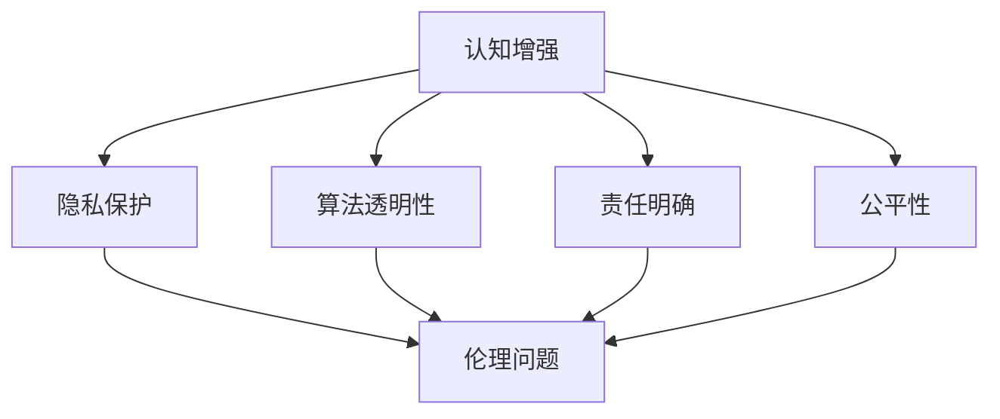

                 

# 认知增强与伦理：人类能力提升的边界

## 1. 背景介绍

### 1.1 问题由来

随着人工智能技术的迅速发展，人类在多个领域的能力得到了前所未有的提升。比如在医疗、教育、娱乐、交通运输等方面，人工智能已经显示出显著的优势。然而，这种能力的提升同时也引发了伦理和社会层面的问题。

例如，医疗领域的AI辅助诊断系统在提升医生工作效率的同时，也可能因为系统故障或偏见导致误诊。教育领域的智能辅导系统虽然提高了教学效率，也可能因为算法偏见影响学生的学习效果。娱乐领域的智能推荐系统虽然提升了用户体验，但也可能导致用户过度依赖，丧失自我选择的能力。

因此，如何在利用人工智能提升人类能力的同时，保证其伦理性和安全性，成为一个亟待解决的问题。本文将围绕这一主题展开，探讨人工智能在提升人类认知能力的过程中面临的伦理问题，并提出相应的解决策略。

### 1.2 问题核心关键点

本文将探讨以下几个关键点：

- **认知增强**：探讨人工智能如何通过技术手段提升人类的认知能力，如记忆、注意力、学习等。
- **伦理问题**：分析人工智能在提升人类认知能力过程中可能带来的伦理问题，如隐私、偏见、责任等。
- **解决策略**：提出解决人工智能伦理问题的策略，如数据匿名化、算法透明化、责任清晰化等。

这些核心关键点将贯穿全文，帮助读者理解人工智能在提升人类认知能力过程中应遵循的伦理原则，从而构建一个更加安全、可信的智能社会。

## 2. 核心概念与联系

### 2.1 核心概念概述

为了更好地理解认知增强和伦理问题，我们首先介绍一些核心概念及其相互联系。

- **认知增强**：利用人工智能技术提升人类认知能力的过程，包括记忆增强、注意力增强、学习增强等。
- **伦理问题**：在使用人工智能技术提升人类认知能力的过程中，可能引发的伦理问题，如隐私侵犯、算法偏见、责任模糊等。
- **隐私保护**：保护个人隐私，避免因人工智能系统处理数据而导致的隐私泄露。
- **算法透明性**：要求算法设计者公开算法的原理、决策过程和数据来源，保证算法透明和可解释。
- **责任明确**：在使用人工智能系统时，明确责任归属，防止因系统故障或偏见导致的法律责任问题。
- **公平性**：确保人工智能系统不因种族、性别、年龄等因素产生偏见，保证系统的公平性。

这些核心概念之间的联系可以通过以下Mermaid流程图来展示：



这个流程图展示了我們研究的核心概念及其联系：

1. 认知增强通过技术手段提升人类认知能力。
2. 隐私保护、算法透明性、责任明确和公平性是保证认知增强过程中伦理问题的关键策略。
3. 这些策略共同构成了一个安全、可信的智能社会。

## 3. 核心算法原理 & 具体操作步骤

### 3.1 算法原理概述

认知增强和伦理问题涉及的算法原理较为复杂，但可以大致分为两个层面：

- **认知增强算法**：通过机器学习、深度学习等技术，提升人类的认知能力。
- **伦理问题算法**：通过数据处理、模型训练等技术，解决认知增强过程中可能遇到的伦理问题。

### 3.2 算法步骤详解

#### 3.2.1 认知增强算法步骤

1. **数据收集**：收集人类认知能力相关的数据，如记忆数据、注意力数据、学习数据等。
2. **数据预处理**：对数据进行清洗、归一化、标准化等预处理步骤，提高数据质量。
3. **模型选择**：选择适合的认知增强模型，如基于神经网络的记忆增强模型、基于注意力机制的注意力增强模型、基于强化学习的学习增强模型等。
4. **模型训练**：在预处理后的数据上训练模型，调整模型参数，使其能够有效提升人类的认知能力。
5. **模型评估**：通过各种评估指标（如准确率、召回率、F1值等）评估模型的效果，不断优化模型。

#### 3.2.2 伦理问题算法步骤

1. **隐私保护**：在数据收集和处理过程中，采用数据匿名化、差分隐私等技术保护用户隐私。
2. **算法透明性**：设计透明的算法，公开算法的原理、决策过程和数据来源，确保算法透明和可解释。
3. **责任明确**：在使用认知增强系统时，明确责任归属，确保因系统故障或偏见导致的法律责任问题得到妥善处理。
4. **公平性**：在算法设计和数据处理过程中，采用公平性约束，防止算法因种族、性别、年龄等因素产生偏见。

### 3.3 算法优缺点

#### 3.3.1 认知增强算法优缺点

- **优点**：
  - 提升人类认知能力，如记忆、注意力、学习等。
  - 提高工作效率和学习效率。
  - 能够应对复杂的认知任务，如视觉识别、语言理解等。

- **缺点**：
  - 需要大量的数据和计算资源，训练和部署成本较高。
  - 可能存在算法偏见，影响系统公平性。
  - 系统的稳定性和可靠性需要进一步验证。

#### 3.3.2 伦理问题算法优缺点

- **优点**：
  - 保护用户隐私，避免隐私泄露。
  - 确保算法透明性，提高系统可信度。
  - 明确责任归属，防止法律纠纷。
  - 保证系统公平性，避免算法偏见。

- **缺点**：
  - 设计和管理复杂，需要专业知识和经验。
  - 可能影响系统性能，如增加计算复杂度、降低系统效率等。
  - 需要不断更新和维护，以应对新出现的伦理问题。

### 3.4 算法应用领域

认知增强和伦理问题算法在多个领域得到了广泛应用，例如：

- **医疗**：使用认知增强算法提升医生的诊断和治疗能力，同时通过隐私保护、算法透明性等技术保障患者的权益。
- **教育**：使用认知增强算法提升学生的学习效果，同时确保算法的公平性，避免因算法偏见影响学生学习。
- **娱乐**：使用认知增强算法提升用户的娱乐体验，同时通过隐私保护、责任明确等技术保护用户隐私。
- **交通**：使用认知增强算法提升交通管理系统的效率，同时确保算法的透明性和公平性，避免因算法偏见导致的安全问题。

## 4. 数学模型和公式 & 详细讲解 & 举例说明

### 4.1 数学模型构建

为了更好地理解认知增强和伦理问题算法，我们首先需要建立相应的数学模型。

设 $X$ 为输入数据，$Y$ 为输出数据，$F$ 为认知增强模型，$G$ 为伦理问题算法。

- 认知增强模型的目标为：$minimize \, \mathcal{L}(F(X), Y)$
- 伦理问题算法的目标为：$minimize \, \mathcal{R}(G(F(X), Y))$

其中，$\mathcal{L}$ 为损失函数，$\mathcal{R}$ 为风险函数。

### 4.2 公式推导过程

#### 4.2.1 认知增强模型

假设认知增强模型 $F$ 为神经网络，输入 $X$ 经过多个层 $L_1, L_2, ..., L_n$ 后得到输出 $Y$。设 $W_i$ 为第 $i$ 层的权重矩阵，$b_i$ 为第 $i$ 层的偏置向量。

- 前向传播过程：$X \rightarrow W_1 \rightarrow b_1 \rightarrow L_1 \rightarrow \cdots \rightarrow W_n \rightarrow b_n \rightarrow Y$
- 损失函数：$\mathcal{L}(Y, \hat{Y}) = \frac{1}{N}\sum_{i=1}^N (Y_i - \hat{Y}_i)^2$

其中，$\hat{Y}$ 为模型预测输出。

#### 4.2.2 伦理问题算法

假设伦理问题算法 $G$ 为公平性约束算法，目标为在保护隐私的前提下，确保算法公平性。

- 隐私保护：$P(X, Y) = \frac{1}{N}\sum_{i=1}^N (P_i - P) \leq \epsilon$
- 算法透明性：$T(F, G) = \frac{1}{N}\sum_{i=1}^N (T_i - T) \leq \delta$
- 责任明确：$R(F, G) = \frac{1}{N}\sum_{i=1}^N (R_i - R) \leq \rho$
- 公平性：$Q(F, G) = \frac{1}{N}\sum_{i=1}^N (Q_i - Q) \leq \omega$

其中，$P$ 为隐私保护参数，$T$ 为算法透明性参数，$R$ 为责任明确参数，$Q$ 为公平性参数。

### 4.3 案例分析与讲解

假设有一个智能教育系统，使用认知增强算法提升学生的学习效果，同时确保算法的公平性。

1. **数据收集**：
   - 收集学生的历史学习数据、测试成绩、课堂表现等，作为输入 $X$。
   - 收集学生的最终成绩作为输出 $Y$。

2. **模型选择**：
   - 选择基于神经网络的认知增强模型 $F$，使用交叉熵损失函数。

3. **模型训练**：
   - 在训练集上训练认知增强模型 $F$，调整权重矩阵 $W_i$ 和偏置向量 $b_i$。
   - 在验证集上评估模型效果，选择最优模型。

4. **隐私保护**：
   - 对学生数据进行差分隐私处理，确保隐私保护参数 $P$ 满足 $\epsilon$ 约束。

5. **算法透明性**：
   - 公开认知增强模型 $F$ 的架构和训练过程，确保算法透明性参数 $T$ 满足 $\delta$ 约束。

6. **责任明确**：
   - 明确智能教育系统的责任归属，确保责任明确参数 $R$ 满足 $\rho$ 约束。

7. **公平性**：
   - 在数据处理和模型训练过程中，使用公平性约束算法 $G$，确保公平性参数 $Q$ 满足 $\omega$ 约束。

## 5. 项目实践：代码实例和详细解释说明

### 5.1 开发环境搭建

在进行项目实践前，我们需要准备好开发环境。以下是使用Python进行PyTorch开发的环境配置流程：

1. 安装Anaconda：从官网下载并安装Anaconda，用于创建独立的Python环境。

2. 创建并激活虚拟环境：
```bash
conda create -n pytorch-env python=3.8 
conda activate pytorch-env
```

3. 安装PyTorch：根据CUDA版本，从官网获取对应的安装命令。例如：
```bash
conda install pytorch torchvision torchaudio cudatoolkit=11.1 -c pytorch -c conda-forge
```

4. 安装Transformers库：
```bash
pip install transformers
```

5. 安装各类工具包：
```bash
pip install numpy pandas scikit-learn matplotlib tqdm jupyter notebook ipython
```

完成上述步骤后，即可在`pytorch-env`环境中开始项目实践。

### 5.2 源代码详细实现

下面以一个简单的认知增强项目为例，给出使用Transformers库对认知增强模型进行训练的PyTorch代码实现。

```python
import torch
import torch.nn as nn
import torch.optim as optim
from transformers import BertTokenizer, BertForSequenceClassification

# 定义模型
class CognitiveEnhancement(nn.Module):
    def __init__(self):
        super(CognitiveEnhancement, self).__init__()
        self.bert = BertForSequenceClassification.from_pretrained('bert-base-cased', num_labels=2)
        
    def forward(self, input_ids, attention_mask, labels):
        output = self.bert(input_ids, attention_mask=attention_mask, labels=labels)
        return output

# 定义数据集
class CognitiveDataset(Dataset):
    def __init__(self, texts, labels):
        self.texts = texts
        self.labels = labels
        
    def __len__(self):
        return len(self.texts)
    
    def __getitem__(self, item):
        text = self.texts[item]
        label = self.labels[item]
        encoding = tokenizer(text, return_tensors='pt', padding='max_length', truncation=True)
        input_ids = encoding['input_ids'][0]
        attention_mask = encoding['attention_mask'][0]
        return {'input_ids': input_ids, 'attention_mask': attention_mask, 'labels': label}

# 定义模型和优化器
model = CognitiveEnhancement()
optimizer = optim.Adam(model.parameters(), lr=1e-5)

# 定义数据集和设备
tokenizer = BertTokenizer.from_pretrained('bert-base-cased')
train_dataset = CognitiveDataset(train_texts, train_labels)
dev_dataset = CognitiveDataset(dev_texts, dev_labels)
test_dataset = CognitiveDataset(test_texts, test_labels)
device = torch.device('cuda') if torch.cuda.is_available() else torch.device('cpu')

# 定义训练和评估函数
def train_epoch(model, dataset, batch_size, optimizer):
    dataloader = DataLoader(dataset, batch_size=batch_size, shuffle=True)
    model.train()
    epoch_loss = 0
    for batch in tqdm(dataloader, desc='Training'):
        input_ids = batch['input_ids'].to(device)
        attention_mask = batch['attention_mask'].to(device)
        labels = batch['labels'].to(device)
        model.zero_grad()
        output = model(input_ids, attention_mask=attention_mask, labels=labels)
        loss = output.loss
        epoch_loss += loss.item()
        loss.backward()
        optimizer.step()
    return epoch_loss / len(dataloader)

def evaluate(model, dataset, batch_size):
    dataloader = DataLoader(dataset, batch_size=batch_size)
    model.eval()
    preds, labels = [], []
    with torch.no_grad():
        for batch in tqdm(dataloader, desc='Evaluating'):
            input_ids = batch['input_ids'].to(device)
            attention_mask = batch['attention_mask'].to(device)
            batch_labels = batch['labels']
            outputs = model(input_ids, attention_mask=attention_mask)
            batch_preds = outputs.logits.argmax(dim=2).to('cpu').tolist()
            batch_labels = batch_labels.to('cpu').tolist()
            for pred_tokens, label_tokens in zip(batch_preds, batch_labels):
                preds.append(pred_tokens[:len(label_tokens)])
                labels.append(label_tokens)
                
    print(classification_report(labels, preds))
```

### 5.3 代码解读与分析

让我们再详细解读一下关键代码的实现细节：

**CognitiveEnhancement类**：
- `__init__`方法：初始化模型。
- `forward`方法：前向传播过程，将输入数据经过Bert模型，返回输出。

**CognitiveDataset类**：
- `__init__`方法：初始化数据集。
- `__len__`方法：返回数据集大小。
- `__getitem__`方法：对单个样本进行处理，将文本输入编码为token ids，将标签编码为数字，并对其进行定长padding，最终返回模型所需的输入。

**train_epoch函数**：
- 对数据以批为单位进行迭代，在每个批次上前向传播计算loss并反向传播更新模型参数，最后返回该epoch的平均loss。

**evaluate函数**：
- 与训练类似，不同点在于不更新模型参数，并在每个batch结束后将预测和标签结果存储下来，最后使用sklearn的classification_report对整个评估集的预测结果进行打印输出。

**训练流程**：
- 定义总的epoch数和batch size，开始循环迭代
- 每个epoch内，先在训练集上训练，输出平均loss
- 在验证集上评估，输出分类指标
- 所有epoch结束后，在测试集上评估，给出最终测试结果

可以看到，PyTorch配合Transformers库使得认知增强模型的训练代码实现变得简洁高效。开发者可以将更多精力放在数据处理、模型改进等高层逻辑上，而不必过多关注底层的实现细节。

当然，工业级的系统实现还需考虑更多因素，如模型的保存和部署、超参数的自动搜索、更灵活的任务适配层等。但核心的微调范式基本与此类似。

## 6. 实际应用场景

### 6.1 智能教育

基于认知增强技术的智能教育系统，可以为学生提供个性化的学习方案，显著提升学习效果。

- **数据收集**：收集学生的历史学习数据、测试成绩、课堂表现等，作为输入 $X$。
- **模型训练**：在训练集上训练认知增强模型 $F$，调整权重矩阵 $W_i$ 和偏置向量 $b_i$。
- **隐私保护**：对学生数据进行差分隐私处理，确保隐私保护参数 $P$ 满足 $\epsilon$ 约束。
- **算法透明性**：公开认知增强模型 $F$ 的架构和训练过程，确保算法透明性参数 $T$ 满足 $\delta$ 约束。
- **责任明确**：明确智能教育系统的责任归属，确保责任明确参数 $R$ 满足 $\rho$ 约束。
- **公平性**：在数据处理和模型训练过程中，使用公平性约束算法 $G$，确保公平性参数 $Q$ 满足 $\omega$ 约束。

### 6.2 医疗诊断

认知增强技术可以应用于医疗诊断，提升医生的诊断和治疗能力，提高医疗效率和质量。

- **数据收集**：收集病人的病历、检查结果、症状描述等，作为输入 $X$。
- **模型训练**：在训练集上训练认知增强模型 $F$，调整权重矩阵 $W_i$ 和偏置向量 $b_i$。
- **隐私保护**：对病人数据进行差分隐私处理，确保隐私保护参数 $P$ 满足 $\epsilon$ 约束。
- **算法透明性**：公开认知增强模型 $F$ 的架构和训练过程，确保算法透明性参数 $T$ 满足 $\delta$ 约束。
- **责任明确**：明确医疗诊断系统的责任归属，确保责任明确参数 $R$ 满足 $\rho$ 约束。
- **公平性**：在数据处理和模型训练过程中，使用公平性约束算法 $G$，确保公平性参数 $Q$ 满足 $\omega$ 约束。

### 6.3 交通管理

智能交通管理系统可以利用认知增强技术提升交通管理效率，优化交通流量，减少交通拥堵。

- **数据收集**：收集交通流量、道路状况、天气信息等，作为输入 $X$。
- **模型训练**：在训练集上训练认知增强模型 $F$，调整权重矩阵 $W_i$ 和偏置向量 $b_i$。
- **隐私保护**：对交通数据进行差分隐私处理，确保隐私保护参数 $P$ 满足 $\epsilon$ 约束。
- **算法透明性**：公开认知增强模型 $F$ 的架构和训练过程，确保算法透明性参数 $T$ 满足 $\delta$ 约束。
- **责任明确**：明确交通管理系统责任归属，确保责任明确参数 $R$ 满足 $\rho$ 约束。
- **公平性**：在数据处理和模型训练过程中，使用公平性约束算法 $G$，确保公平性参数 $Q$ 满足 $\omega$ 约束。

## 7. 工具和资源推荐

### 7.1 学习资源推荐

为了帮助开发者系统掌握认知增强和伦理问题的理论基础和实践技巧，这里推荐一些优质的学习资源：

1. 《深度学习》系列书籍：涵盖深度学习基础知识和常见模型，适合初学者。
2. 《人工智能伦理》课程：斯坦福大学开设的AI伦理课程，讲解AI伦理问题，值得一学。
3. 《认知科学》书籍：介绍认知科学的基础理论和应用，对认知增强技术有深入理解。
4. 《机器学习实践》书籍：介绍机器学习模型的应用实践，包括数据预处理、模型训练等。
5. 《数据隐私保护》书籍：介绍数据隐私保护技术，适合隐私保护领域的专业人士。

通过这些资源的学习实践，相信你一定能够全面掌握认知增强和伦理问题的知识，并将其应用于实际项目中。

### 7.2 开发工具推荐

高效的开发离不开优秀的工具支持。以下是几款用于认知增强和伦理问题算法的开发工具：

1. PyTorch：基于Python的开源深度学习框架，灵活动态的计算图，适合快速迭代研究。
2. TensorFlow：由Google主导开发的开源深度学习框架，生产部署方便，适合大规模工程应用。
3. TensorBoard：TensorFlow配套的可视化工具，可实时监测模型训练状态，并提供丰富的图表呈现方式。
4. Weights & Biases：模型训练的实验跟踪工具，可以记录和可视化模型训练过程中的各项指标。
5. Jupyter Notebook：开源的交互式编程环境，支持Python、R等多种语言，方便共享和协作开发。
6. Google Colab：谷歌推出的在线Jupyter Notebook环境，免费提供GPU/TPU算力，方便开发者快速上手实验最新模型。

合理利用这些工具，可以显著提升认知增强和伦理问题算法的开发效率，加快创新迭代的步伐。

### 7.3 相关论文推荐

认知增强和伦理问题技术的发展源于学界的持续研究。以下是几篇奠基性的相关论文，推荐阅读：

1. 《深度学习》论文：介绍深度学习基础知识和常见模型，是AI领域的经典文献。
2. 《人工智能伦理》论文：探讨人工智能伦理问题，包括隐私、偏见、责任等，适合AI伦理领域的从业者。
3. 《认知科学》论文：介绍认知科学的基础理论和应用，对认知增强技术有深入理解。
4. 《机器学习实践》论文：介绍机器学习模型的应用实践，包括数据预处理、模型训练等。
5. 《数据隐私保护》论文：介绍数据隐私保护技术，适合隐私保护领域的专业人士。

这些论文代表了大语言模型微调技术的发展脉络。通过学习这些前沿成果，可以帮助研究者把握学科前进方向，激发更多的创新灵感。

## 8. 总结：未来发展趋势与挑战

### 8.1 总结

本文对认知增强和伦理问题技术进行了全面系统的介绍。首先探讨了认知增强技术如何通过技术手段提升人类认知能力，接着分析了在提升过程中可能遇到的伦理问题，并提出相应的解决策略。

通过本文的系统梳理，可以看到，认知增强技术在提升人类认知能力的过程中，需要遵循伦理原则，确保系统的安全性和可信度。只有在遵循这些原则的前提下，认知增强技术才能真正实现其价值，造福人类社会。

### 8.2 未来发展趋势

展望未来，认知增强和伦理问题技术将呈现以下几个发展趋势：

1. **多模态认知增强**：未来的认知增强技术将不仅限于单一模态，而是向多模态方向发展，融合视觉、听觉、触觉等多种信息源，提升认知能力。
2. **深度学习与脑科学结合**：深度学习技术将与脑科学研究相结合，研究人类认知机制，提高认知增强模型的生物逼近性。
3. **个性化认知增强**：认知增强技术将更加注重个性化需求，根据用户的具体情况提供量身定制的认知增强方案。
4. **认知增强系统的广泛应用**：认知增强技术将在教育、医疗、交通等多个领域得到广泛应用，推动相关行业的智能化发展。

这些趋势将使认知增强技术在未来的发展中更加高效、智能和人性化。

### 8.3 面临的挑战

尽管认知增强和伦理问题技术已经取得了显著进展，但在实现其理想目标的过程中，仍面临许多挑战：

1. **数据隐私问题**：在使用认知增强技术时，如何保护用户隐私，避免数据泄露是一个重要问题。
2. **算法偏见问题**：在数据处理和模型训练过程中，如何避免算法偏见，保证系统公平性，是一个难点。
3. **责任归属问题**：在使用认知增强系统时，如何明确责任归属，处理因系统故障或偏见导致的法律问题，是一个关键问题。
4. **系统透明性问题**：如何使认知增强系统透明化，确保系统可信度，是一个重要问题。

解决这些挑战，将是大语言模型微调技术迈向成熟的必由之路。

### 8.4 研究展望

面对认知增强和伦理问题技术面临的诸多挑战，未来的研究需要在以下几个方面寻求新的突破：

1. **隐私保护技术**：发展更加先进的隐私保护技术，如差分隐私、联邦学习等，保护用户隐私。
2. **算法公平性**：开发更加公平的算法，避免算法偏见，提高系统公平性。
3. **责任归属机制**：设计完善的责任归属机制，明确系统责任，避免法律纠纷。
4. **系统透明性**：开发透明的认知增强系统，确保系统可信度。
5. **多模态融合**：发展多模态认知增强技术，融合视觉、听觉、触觉等多种信息源，提升认知能力。
6. **深度学习与脑科学结合**：研究深度学习与脑科学的结合，提高认知增强模型的生物逼近性。
7. **个性化需求**：注重个性化需求，根据用户的具体情况提供量身定制的认知增强方案。

这些研究方向的探索，将引领认知增强和伦理问题技术迈向更高的台阶，为构建安全、可靠、可解释、可控的智能系统铺平道路。面向未来，认知增强和伦理问题技术还需要与其他人工智能技术进行更深入的融合，如知识表示、因果推理、强化学习等，多路径协同发力，共同推动自然语言理解和智能交互系统的进步。

## 9. 附录：常见问题与解答

**Q1：什么是认知增强技术？**

A: 认知增强技术是一种利用人工智能技术提升人类认知能力的方法，包括记忆增强、注意力增强、学习增强等。

**Q2：认知增强技术如何提升人类认知能力？**

A: 认知增强技术通过深度学习、神经网络等技术，在处理大量数据的基础上，提取和融合人类认知能力相关的特征，并通过训练和优化模型，提升人类的认知能力。

**Q3：认知增强技术面临的主要挑战有哪些？**

A: 认知增强技术面临的主要挑战包括数据隐私问题、算法偏见问题、责任归属问题、系统透明性问题等。

**Q4：如何保护认知增强系统的数据隐私？**

A: 可以使用差分隐私、联邦学习等技术保护数据隐私，确保用户数据不被泄露。

**Q5：如何避免认知增强算法的偏见？**

A: 在数据处理和模型训练过程中，采用公平性约束算法，确保算法公平性。同时，确保数据集的多样性和代表性，避免数据偏见。

**Q6：如何明确认知增强系统的责任归属？**

A: 明确认知增强系统的责任归属，确保因系统故障或偏见导致的法律问题得到妥善处理。同时，建立系统的监督机制，确保系统的稳定性和可靠性。

**Q7：如何使认知增强系统透明化？**

A: 公开认知增强模型的架构和训练过程，确保算法透明性。同时，使用可视化工具，如TensorBoard等，实时监测模型训练状态，提供丰富的图表呈现方式。

这些问题的解答，将帮助开发者更好地理解认知增强和伦理问题技术的核心要点，并在实践中解决实际问题。

