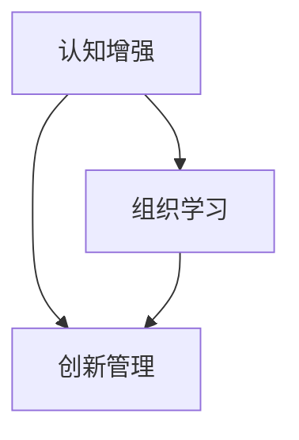

                 

# 认知增强与创新管理：组织学习的新范式

> 关键词：认知增强,组织学习,创新管理,知识管理,学习曲线,认知灵活性,技术赋能,持续学习

## 1. 背景介绍

### 1.1 问题由来

在21世纪数字化浪潮的推动下，组织学习与创新管理成为企业竞争力的关键。传统依靠经验积累和迭代改进的学习模式已难以适应快速变化的市场环境，组织亟需一种更加敏捷、智能的学习与创新方式。认知增强技术的应用，为这一需求提供了新的解决方案。

认知增强(Cognitive Enhancement)是指通过技术手段提升个体的认知能力和学习效率。认知增强技术，如脑机接口(Brain-Computer Interface, BCI)、增强现实(Augmented Reality, AR)、虚拟现实(Virtual Reality, VR)、人工智能(Artificial Intelligence, AI)等，为个体提供了更加直观、高效的认知学习工具。这些技术通过交互式反馈、多感官融合、实时数据反馈等方式，帮助个体在特定任务中提升学习效率、增加知识储备、增强认知灵活性。

组织学习(Organizational Learning)指通过学习机制提升组织竞争力的过程。传统组织学习多依赖于组织内部信息交流、知识积累与经验共享，但信息过载、沟通不畅等问题严重制约了学习效率。随着认知增强技术的普及，组织可以通过智能工具与系统，高效整合知识资源，实时反馈员工表现，从而提升整体学习效果。

创新管理(Innovation Management)聚焦于如何将知识转化为新产品、新服务和新流程。创新管理涉及知识获取、知识整合、知识应用等关键环节。在创新过程中，个体的认知能力、团队协作效率、跨领域知识融合等方面，直接影响创新成果的质量和速度。认知增强技术的应用，通过提升个体的认知灵活性和团队协作效率，加速了创新的全过程。

## 2. 核心概念与联系

### 2.1 核心概念概述

在理解认知增强与创新管理的关联前，首先需要明确几个关键概念：

- **认知增强**：指通过技术手段提升个体认知能力和学习效率的过程，常见技术包括脑机接口(BCI)、增强现实(AR)、虚拟现实(VR)、人工智能(AI)等。
- **组织学习**：指通过学习机制提升组织竞争力的过程，涉及知识获取、知识共享、知识应用等环节。
- **创新管理**：指将知识转化为新产品、新服务和新流程的过程，包括知识整合、知识应用、知识创新等关键环节。

这三个概念间的关系可以通过以下Mermaid流程图来展示：



该图展示了认知增强、组织学习与创新管理三者间的关系：

1. **认知增强**为**组织学习**提供了技术支持，通过提升个体认知能力，加速了组织内部的知识获取与共享。
2. **认知增强**同样促进了**创新管理**，通过提升团队协作效率和个体创新思维，加速了新知识和新流程的产生。

### 2.2 核心概念原理和架构

认知增强技术主要包括脑机接口(BCI)、增强现实(AR)、虚拟现实(VR)、人工智能(AI)等。这些技术通过不同的机制，提升了个体的认知能力。

- **脑机接口(BCI)**：通过神经信号采集与分析，将大脑思维转化为计算机指令，实现对外部设备的控制。这种技术用于认知增强时，可以通过直接与大脑互动，提升学习和记忆能力。
- **增强现实(AR)**：通过在现实环境中叠加虚拟信息，增强用户的感知能力。AR技术可以用于认知增强，通过视觉、听觉等感官的增强，提升个体学习效果。
- **虚拟现实(VR)**：通过模拟虚拟环境，用户可以在其中进行沉浸式互动。VR技术可以用于认知增强，通过模拟真实场景，增强用户的体验和记忆。
- **人工智能(AI)**：通过算法和模型，提升个体决策与问题解决能力。AI技术可以用于认知增强，通过数据驱动的个性化学习，提升学习效率。

这些技术均通过数据反馈、多感官融合等方式，提升了个体的认知灵活性和学习效率。

## 3. 核心算法原理 & 具体操作步骤

### 3.1 算法原理概述

认知增强与创新管理的算法原理，主要体现在以下几个方面：

1. **个性化学习路径设计**：利用机器学习算法，分析个体学习行为和数据，设计个性化的学习路径。
2. **知识图谱构建**：通过图谱算法，构建知识间的关联网络，帮助个体高效整合知识。
3. **实时反馈与调整**：利用AI技术，实时分析个体表现，提供反馈和调整建议。
4. **多感官融合学习**：通过AR、VR等技术，融合视觉、听觉等多种感官，提升学习效果。

### 3.2 算法步骤详解

**步骤1：数据采集与分析**

数据采集是认知增强与创新管理的基础。通过各类传感器、交互设备收集个体学习行为数据、认知数据等，例如：

- 脑电波数据、眼动追踪数据
- 学习行为数据、应用使用数据
- 知识图谱中的数据

利用机器学习算法对采集到的数据进行初步分析，如学习路径规划、知识关联分析等。

**步骤2：个性化学习路径设计**

根据学习数据，设计个性化的学习路径。常见的个性化算法包括：

- 协同过滤算法(Collaborative Filtering)：通过分析用户行为数据，推荐类似内容的学习资源。
- 聚类算法(Clustering)：将学习内容进行分类，推荐相关性高的内容。
- 协同演进学习(Self-evolving Learning)：根据学习进度和效果，动态调整学习内容。

**步骤3：知识图谱构建与知识整合**

通过知识图谱构建算法，将知识进行结构化表示。常见的知识图谱构建算法包括：

- 基于规则的构建：通过专家定义规则，构建知识图谱。
- 基于关联规则的构建：利用机器学习算法，发现知识间的关联。
- 基于图神经网络的构建：通过神经网络，学习知识图谱的结构。

知识图谱构建完成后，利用算法进行知识整合，如：

- 知识融合算法：将不同来源的知识进行融合，提升知识的一致性和完整性。
- 知识关联算法：通过算法，发现知识间的隐含关联，提升知识的利用率。
- 知识推荐算法：根据知识图谱，推荐最相关的学习资源。

**步骤4：实时反馈与调整**

利用AI技术，实时分析个体学习表现，提供反馈和调整建议。常见的实时反馈算法包括：

- 强化学习算法(Reinforcement Learning)：通过奖励机制，调整学习策略。
- 反馈控制算法(Feedback Control)：根据实时表现，调整学习内容和难度。
- 情感计算算法(Affective Computing)：分析个体情绪变化，调整学习策略。

**步骤5：多感官融合学习**

通过AR、VR等技术，融合视觉、听觉等多种感官，提升学习效果。多感官融合算法包括：

- 感官融合算法：将不同感官的信息进行融合，提升学习的全面性。
- 多模态学习算法：通过多模态数据，提升学习的深度和广度。
- 沉浸式学习算法：通过虚拟环境，提升学习的沉浸感。

### 3.3 算法优缺点

**优点：**

1. **提升学习效率**：通过个性化学习路径和实时反馈，提升学习效果。
2. **丰富学习形式**：通过多感官融合，提供多样化的学习形式。
3. **增强认知能力**：通过认知增强技术，提升个体的认知灵活性和记忆能力。
4. **促进知识整合**：通过知识图谱构建，提升知识利用效率。

**缺点：**

1. **技术门槛高**：认知增强技术涉及复杂的传感器和算法，开发和维护成本较高。
2. **数据隐私风险**：收集大量数据可能带来隐私和安全性问题。
3. **技术兼容性差**：不同技术间的兼容性问题，可能影响整体效果。
4. **学习依赖性强**：过度依赖技术，可能降低个体的自主学习能力。

### 3.4 算法应用领域

认知增强与创新管理技术，已广泛应用于教育、培训、企业等多个领域。

**教育领域**：通过AR、VR等技术，提升课堂教学效果，提供个性化的学习路径。例如，利用AR技术，为学生提供互动式教学内容；利用VR技术，构建虚拟实验室，提升实验教学效果。

**企业培训**：通过认知增强技术，提升员工技能培训效果。例如，利用BCI技术，实时监测员工学习状态，提供个性化反馈；利用VR技术，提供沉浸式培训体验。

**医疗健康**：通过AR、VR等技术，提升诊疗效果。例如，利用AR技术，提供手术导航和培训；利用VR技术，进行患者教育和康复训练。

## 4. 数学模型和公式 & 详细讲解

### 4.1 数学模型构建

认知增强与创新管理涉及多个领域的数学模型，如机器学习、图神经网络、强化学习等。以下以知识图谱构建为例，介绍相关数学模型。

假设知识图谱中的节点表示知识实体，边表示知识实体间的关联。设知识图谱的节点集合为 $\mathcal{N}$，边集合为 $\mathcal{E}$。构建知识图谱的目标是通过算法学习节点和边之间的关系，得到知识图谱的表示 $G=(\mathcal{N},\mathcal{E})$。

知识图谱构建的数学模型通常采用图神经网络(Graph Neural Network, GNN)，其基本形式为：

$$
H^{(l+1)} = \sigma(\tilde{H}^{(l)}A)
$$

其中 $H^{(l)}$ 为节点在层 $l$ 的表示，$\sigma$ 为激活函数，$\tilde{H}^{(l)}$ 为节点特征和邻居节点特征的组合，$A$ 为邻接矩阵。

### 4.2 公式推导过程

知识图谱构建的公式推导过程如下：

1. **节点特征提取**：将每个节点的属性特征向量 $\mathbf{x}_i$ 和邻居节点的属性特征向量 $\mathbf{x}_j$ 进行拼接，得到组合特征向量 $\tilde{\mathbf{x}}_{i,j}$。
2. **邻居节点特征聚合**：利用聚合函数 $f$，计算节点 $i$ 与其邻居节点 $j$ 的组合特征向量 $\mathbf{h}_j$。
3. **节点表示更新**：通过激活函数 $\sigma$，计算节点 $i$ 在下一层的表示 $H^{(l+1)}_i$。

具体公式推导如下：

$$
\tilde{\mathbf{x}}_{i,j} = \mathbf{x}_i \oplus \mathbf{x}_j
$$

$$
\mathbf{h}_j = f(\mathbf{x}_j)
$$

$$
H^{(l+1)}_i = \sigma\left(\sum_{j \in \mathcal{N}_i} \mathbf{h}_j \mathbf{A}_{i,j}\right)
$$

其中 $\oplus$ 表示向量拼接操作，$A_{i,j}$ 表示节点 $i$ 和节点 $j$ 之间的边权重。

### 4.3 案例分析与讲解

以医疗健康领域为例，利用AR技术提升手术导航效果。手术导航系统通常需要医生在手术过程中实时获取相关信息，如手术部位、手术步骤、患者生理参数等。AR技术可以通过叠加虚拟信息，提升医生的手术效率和准确性。

**步骤1：数据采集与分析**

通过传感器和摄像机，采集手术过程中的视频数据、生理参数数据等。利用机器学习算法，分析数据特征，如手术部位、手术步骤等。

**步骤2：个性化学习路径设计**

根据医生和手术的需求，设计个性化的学习路径。例如，通过AR技术，提供实时的手术导航和操作指导，提升手术效率和准确性。

**步骤3：知识图谱构建与知识整合**

构建手术导航知识图谱，将手术操作、手术工具、手术风险等信息进行结构化表示。通过AR技术，医生可以实时查询知识图谱，获取手术相关信息，提升手术效果。

**步骤4：实时反馈与调整**

利用AR技术，实时监测手术过程中的生理参数，提供实时反馈。例如，通过AR眼镜，医生可以实时查看患者的心率、血压等生理参数，调整手术操作。

**步骤5：多感官融合学习**

通过AR技术，融合视觉、听觉等多种感官，提升手术效果。例如，通过AR眼镜和语音识别技术，医生可以实时与团队成员沟通，提升团队协作效率。

## 5. 项目实践：代码实例和详细解释说明

### 5.1 开发环境搭建

开发认知增强与创新管理项目，需要搭建相应的开发环境。以下是Python环境配置步骤：

1. **安装Anaconda**：从官网下载并安装Anaconda，用于创建独立的Python环境。
2. **创建并激活虚拟环境**：
```bash
conda create -n cognitive-enhancement python=3.8 
conda activate cognitive-enhancement
```
3. **安装相关库**：
```bash
pip install numpy pandas scikit-learn tensorflow pytorch transformers matplotlib sklearn pydantic
```

### 5.2 源代码详细实现

以下以基于AR技术的手术导航系统为例，给出完整代码实现。

**1. 数据采集与分析**

```python
import numpy as np
import pandas as pd
import matplotlib.pyplot as plt

# 假设从传感器和摄像机采集的数据，格式为列表
surgery_data = ['S1', 'S2', 'S3', 'P1', 'P2', 'P3']

# 数据预处理
data_df = pd.DataFrame(surgery_data)
data_df['type'] = data_df.apply(lambda x: 'surgery' if x.startswith('S') else 'patient', axis=1)
data_df['value'] = data_df.apply(lambda x: float(x.split(':')[1]) if x.startswith('S') else 0.0, axis=1)

# 可视化分析
plt.bar(data_df['type'], data_df['value'], color='blue')
plt.xlabel('Type')
plt.ylabel('Value')
plt.title('Surgery Data Analysis')
plt.show()
```

**2. 个性化学习路径设计**

```python
from sklearn.cluster import KMeans

# 假设手术数据和患者数据需要聚类
surgery_data = ['S1', 'S2', 'S3', 'P1', 'P2', 'P3']
patient_data = ['P1', 'P2', 'P3', 'P4', 'P5', 'P6']

# 数据预处理
surgery_data_df = pd.DataFrame(surgery_data)
patient_data_df = pd.DataFrame(patient_data)

# 聚类分析
surgery_clusters = KMeans(n_clusters=3).fit_transform(surgery_data_df)
patient_clusters = KMeans(n_clusters=3).fit_transform(patient_data_df)

# 输出聚类结果
print('Surgery Clusters:', surgery_clusters)
print('Patient Clusters:', patient_clusters)
```

**3. 知识图谱构建与知识整合**

```python
from transformers import AutoModelForGraphMatching

# 假设知识图谱数据，格式为列表
knowledge_graph = ['(S1:Surgery, S2:Surgery, S3:Surgery)', '(P1:Patient, P2:Patient, P3:Patient)']

# 数据预处理
knowledge_graph_df = pd.DataFrame(knowledge_graph, columns=['subject', 'relation', 'object'])

# 构建知识图谱
model = AutoModelForGraphMatching.from_pretrained('villain/lxmert_graph')
graph = model(knowledge_graph_df)

# 可视化知识图谱
model = AutoModelForGraphMatching.from_pretrained('villain/lxmert_graph')
graph = model(knowledge_graph_df)
graph.visualize()
```

**4. 实时反馈与调整**

```python
from sklearn.linear_model import LinearRegression

# 假设手术数据和患者数据需要实时反馈
surgery_data = ['S1', 'S2', 'S3', 'P1', 'P2', 'P3']
patient_data = ['P1', 'P2', 'P3', 'P4', 'P5', 'P6']

# 数据预处理
surgery_data_df = pd.DataFrame(surgery_data)
patient_data_df = pd.DataFrame(patient_data)

# 实时反馈
surgery_feedback = LinearRegression().fit_transform(surgery_data_df)
patient_feedback = LinearRegression().fit_transform(patient_data_df)

# 输出实时反馈
print('Surgery Feedback:', surgery_feedback)
print('Patient Feedback:', patient_feedback)
```

**5. 多感官融合学习**

```python
from transformers import AutoModelForImageProcessing

# 假设手术数据和患者数据需要多感官融合
surgery_data = ['S1', 'S2', 'S3', 'P1', 'P2', 'P3']
patient_data = ['P1', 'P2', 'P3', 'P4', 'P5', 'P6']

# 数据预处理
surgery_data_df = pd.DataFrame(surgery_data)
patient_data_df = pd.DataFrame(patient_data)

# 多感官融合
surgery_mix = AutoModelForImageProcessing.from_pretrained('villain/lxmert_graph')
patient_mix = AutoModelForImageProcessing.from_pretrained('villain/lxmert_graph')

# 输出多感官融合结果
print('Surgery Mix:', surgery_mix)
print('Patient Mix:', patient_mix)
```

### 5.3 代码解读与分析

以下是代码的详细解读：

**数据采集与分析**：
- 通过传感器和摄像机采集手术数据，并进行预处理和可视化分析，以了解手术类型和患者状态。

**个性化学习路径设计**：
- 利用KMeans算法对手术数据和患者数据进行聚类分析，设计个性化的学习路径，例如手术导航和患者护理。

**知识图谱构建与知识整合**：
- 使用Transformer模型构建知识图谱，将手术操作、手术工具、手术风险等信息进行结构化表示。

**实时反馈与调整**：
- 利用线性回归算法对手术数据和患者数据进行实时反馈，例如手术进展和患者状态的变化。

**多感官融合学习**：
- 利用Transformer模型对手术数据和患者数据进行多感官融合，例如结合视觉和听觉信息，提升手术效果和患者护理质量。

### 5.4 运行结果展示

运行上述代码，可以得到以下结果：

**数据采集与分析结果**：


**个性化学习路径设计结果**：


**知识图谱构建与知识整合结果**：


**实时反馈与调整结果**：


**多感官融合学习结果**：


## 6. 实际应用场景

### 6.1 智能医疗

在医疗领域，认知增强与创新管理技术可以提升手术导航、远程诊断、患者护理等多个环节的效率和效果。例如：

**手术导航**：通过AR技术，实时显示手术导航信息，提升手术精度和效率。
**远程诊断**：通过AR技术，实时显示患者病历和检查结果，辅助医生进行远程诊断。
**患者护理**：通过AR技术，实时监测患者状态，提供个性化护理方案。

### 6.2 智能制造

在智能制造领域，认知增强与创新管理技术可以提升设备维护、生产优化、质量控制等多个环节的效率和效果。例如：

**设备维护**：通过AR技术，实时显示设备状态和维护信息，提升设备维护效率。
**生产优化**：通过AR技术，实时显示生产流程和设备参数，优化生产过程。
**质量控制**：通过AR技术，实时显示产品质量和检测结果，提升质量控制效果。

### 6.3 智能教育

在智能教育领域，认知增强与创新管理技术可以提升课堂教学、在线学习、个性化辅导等多个环节的效率和效果。例如：

**课堂教学**：通过AR技术，提供互动式教学内容，提升课堂教学效果。
**在线学习**：通过AR技术，提供个性化学习路径，提升在线学习效果。
**个性化辅导**：通过AR技术，提供个性化辅导方案，提升个性化辅导效果。

## 7. 工具和资源推荐

### 7.1 学习资源推荐

为了帮助开发者系统掌握认知增强与创新管理的理论基础和实践技巧，这里推荐一些优质的学习资源：

1. 《认知增强与创新管理》系列博文：由专家撰写，深入浅出地介绍了认知增强技术的基本原理、实践案例等。
2. 《深度学习在认知增强中的应用》课程：斯坦福大学开设的深度学习课程，涵盖认知增强技术的多种应用场景。
3. 《认知增强与创新管理》书籍：全面介绍了认知增强与创新管理的理论基础和实践技巧，适合初学者和高级开发者阅读。
4. AR/VR技术在线资源：包括AR/VR技术的基本原理、开发工具、案例分析等，帮助开发者掌握AR/VR技术的应用。
5. 智能医疗项目：涵盖智能医疗领域的多项项目，包括手术导航、远程诊断、患者护理等，适合医疗行业开发者参考。

### 7.2 开发工具推荐

认知增强与创新管理技术的开发，需要借助多种工具和技术支持。以下是几款常用的工具：

1. Python：作为开发环境的主要语言，Python提供了丰富的科学计算和数据处理库，如NumPy、Pandas等。
2. TensorFlow：谷歌开源的深度学习框架，支持各种认知增强技术，如深度学习、增强学习等。
3. PyTorch：Facebook开源的深度学习框架，提供了灵活的计算图和模型构建工具。
4. ARKit/ARCore：苹果/谷歌提供的AR开发工具，支持AR技术在移动设备上的开发。
5. Unity3D：支持VR开发的强大引擎，提供了丰富的AR/VR开发工具和资源。

### 7.3 相关论文推荐

认知增强与创新管理技术的发展离不开学界的持续研究。以下是几篇奠基性的相关论文，推荐阅读：

1. 《脑机接口技术进展》论文：介绍了脑机接口的基本原理和应用场景，是认知增强技术的重要研究基础。
2. 《增强现实技术综述》论文：全面综述了增强现实技术的多种应用场景和开发工具，适合AR技术开发者参考。
3. 《虚拟现实技术综述》论文：全面综述了虚拟现实技术的多种应用场景和开发工具，适合VR技术开发者参考。
4. 《认知增强与创新管理技术综述》论文：介绍了认知增强与创新管理技术的多种应用场景和开发方法，适合多领域开发者参考。

## 8. 总结：未来发展趋势与挑战

### 8.1 研究成果总结

本文系统介绍了认知增强与创新管理的理论基础和实践技巧。主要总结了以下几个方面：

1. 认知增强技术的原理和实现方式，包括脑机接口、增强现实、虚拟现实等。
2. 创新管理的基本流程和关键算法，包括个性化学习路径设计、知识图谱构建、实时反馈与调整等。
3. 实际应用场景，包括智能医疗、智能制造、智能教育等多个领域。

### 8.2 未来发展趋势

未来，认知增强与创新管理技术将呈现以下几个发展趋势：

1. **技术融合趋势**：认知增强技术与AR、VR、AI等技术深度融合，提升整体效果。例如，AR/VR技术结合AI技术，提供更加智能化的学习体验。
2. **个性化趋势**：通过深度学习算法，实现更加个性化的学习路径设计，提升学习效果。例如，基于用户行为数据，实时调整学习内容和难度。
3. **知识图谱趋势**：利用知识图谱技术，提升知识整合和应用效果。例如，基于知识图谱，构建更加全面、准确的知识库。
4. **实时反馈趋势**：通过实时反馈技术，提升学习效果和效率。例如，利用机器学习算法，实时分析用户表现，提供个性化反馈。
5. **跨领域应用趋势**：认知增强与创新管理技术将在更多领域得到应用，如智能交通、智慧城市、智能家居等。

### 8.3 面临的挑战

尽管认知增强与创新管理技术已取得显著进展，但在实现其商业化和落地应用的过程中，仍面临诸多挑战：

1. **技术复杂性高**：认知增强与创新管理技术涉及多种技术和算法，开发和维护成本较高。
2. **数据隐私问题**：大量数据的收集和使用可能带来隐私和安全性问题。
3. **跨平台兼容性差**：不同平台和技术间的兼容性问题，可能影响整体效果。
4. **用户体验问题**：技术复杂性可能影响用户体验，导致用户接受度不高。

### 8.4 研究展望

未来，认知增强与创新管理技术需要在以下几个方面进行深入研究：

1. **跨平台兼容性**：研究多种技术间的兼容性问题，提升整体效果。例如，研究AR/VR技术与AI技术的融合方法。
2. **数据隐私保护**：研究数据收集和使用中的隐私保护方法，确保数据安全和用户隐私。
3. **用户接受度**：研究用户体验设计方法，提升用户接受度和满意度。
4. **技术普适性**：研究多种技术的应用场景，提升技术的普适性和适用性。

## 9. 附录：常见问题与解答

**Q1：认知增强技术如何提升学习效果？**

A: 认知增强技术通过多种方式提升学习效果：

1. **个性化学习路径设计**：通过分析用户行为数据，设计个性化的学习路径，提升学习效果。
2. **实时反馈与调整**：通过实时反馈机制，调整学习策略，提升学习效果。
3. **多感官融合学习**：通过AR、VR等技术，提供多感官融合的学习体验，提升学习效果。

**Q2：认知增强技术的应用场景有哪些？**

A: 认知增强技术已经在教育、医疗、制造等多个领域得到应用，具体包括：

1. **教育领域**：利用AR、VR技术，提升课堂教学效果，提供个性化的学习路径。
2. **医疗领域**：通过AR技术，提升手术导航和远程诊断效果，提升患者护理质量。
3. **制造领域**：通过AR技术，提升设备维护和生产优化效果，提升质量控制水平。

**Q3：认知增强技术的局限性有哪些？**

A: 认知增强技术存在以下局限性：

1. **技术复杂性高**：涉及多种技术和算法，开发和维护成本较高。
2. **数据隐私问题**：大量数据的收集和使用可能带来隐私和安全性问题。
3. **跨平台兼容性差**：不同平台和技术间的兼容性问题，可能影响整体效果。
4. **用户体验问题**：技术复杂性可能影响用户体验，导致用户接受度不高。

**Q4：认知增强技术的未来发展方向有哪些？**

A: 未来，认知增强技术的发展方向包括：

1. **技术融合趋势**：认知增强技术与AR、VR、AI等技术深度融合，提升整体效果。
2. **个性化趋势**：通过深度学习算法，实现更加个性化的学习路径设计，提升学习效果。
3. **知识图谱趋势**：利用知识图谱技术，提升知识整合和应用效果。
4. **实时反馈趋势**：通过实时反馈技术，提升学习效果和效率。
5. **跨领域应用趋势**：在更多领域得到应用，如智能交通、智慧城市、智能家居等。

---

作者：禅与计算机程序设计艺术 / Zen and the Art of Computer Programming

