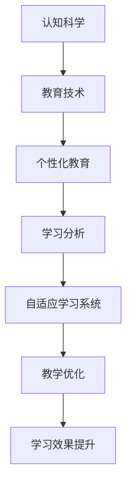

                 

# 认知科学与教育：优化学习体验

> 关键词：认知科学,教育技术,学习体验优化,个性化教育,大数据分析,机器学习

## 1. 背景介绍

### 1.1 问题由来
随着人工智能技术的飞速发展，教育领域正经历一场深刻变革。传统的教学方式受限于时间和资源的不足，难以充分考虑每个学生的个体差异和需求，导致教育效果难以最大化。认知科学作为研究人类认知过程的科学，与教育领域紧密相连，提供了许多对于学习、教学、评估、动机等关键问题的深入理解。教育技术则将这些理论应用到实际的教学过程中，通过大数据分析、机器学习等技术手段，优化学习体验，推动个性化教育的普及。

### 1.2 问题核心关键点
当前，教育技术的核心在于如何通过数据驱动，优化学习过程，实现个性化、高效、可持续的教育。核心关键点包括：
- 学生个体差异的识别与分析
- 个性化学习路径的设计
- 教学效果的实时评估与反馈
- 学习资源的智能推荐
- 教育过程的智能辅助

这些关键点涉及到心理学、教育学、计算机科学等多学科的交叉融合，需要结合认知科学的研究成果，才能更好地理解学习者的需求和行为模式，从而设计出更有效的教育技术方案。

### 1.3 问题研究意义
优化学习体验，实现个性化教育，不仅是提升教育质量的需要，更是未来教育发展的重要方向。通过学习体验的优化，可以：
1. 提高学习效率：个性化学习路径可以更好地适配学生的需求和节奏，减少无效学习，提升学习效果。
2. 激发学习动机：通过实时的反馈和激励，增强学生的学习兴趣和动力。
3. 促进知识内化：个性化的教学资源和评估方式，帮助学生更好地理解知识，实现知识的有效内化。
4. 推动公平教育：通过优化学习资源和教学方式，缩小教育资源的不均衡分布，推动教育公平。

## 2. 核心概念与联系

### 2.1 核心概念概述

为更好地理解教育技术的优化学习体验范式，本节将介绍几个密切相关的核心概念：

- **认知科学**：研究人类认知过程，包括学习、记忆、思维、情感等。是教育技术优化学习体验的理论基础。
- **教育技术**：利用现代技术手段，如大数据分析、机器学习、人工智能等，优化教学过程，提升教育效果。
- **个性化教育**：根据每个学生的个体差异和需求，量身定制学习计划和资源，提供个性化的教学体验。
- **学习分析**：通过分析学生的学习数据，了解学习行为和效果，提供个性化反馈和建议。
- **自适应学习系统**：基于学生的学习数据，动态调整教学内容和策略，提供个性化的学习路径。

这些核心概念之间的逻辑关系可以通过以下Mermaid流程图来展示：



这个流程图展示了几者之间的逻辑关系：

1. 认知科学为教育技术提供了理论指导。
2. 教育技术将认知科学理论应用于教学过程。
3. 个性化教育是教育技术的核心目标。
4. 学习分析是实现个性化教育的关键手段。
5. 自适应学习系统是实现个性化教育的工具。
6. 教学优化是教育技术最终目的。

## 3. 核心算法原理 & 具体操作步骤

### 3.1 算法原理概述

教育技术的优化学习体验范式，本质上是一种基于数据的教学优化过程。其核心思想是：通过收集、分析学生的学习数据，识别出学习者个体的认知特点、学习风格和需求，据此设计个性化的学习路径和策略，从而提升学习效果。

形式化地，假设学生为 $S=\{s_1, s_2, \cdots, s_n\}$，其中 $s_i$ 为第 $i$ 个学生，$D_i=\{(x_i, y_i)\}_{i=1}^N$ 为其在课程 $C$ 上的学习数据，$x_i$ 为输入特征，如学习行为、测试成绩等，$y_i$ 为输出结果，如学习效果、课程成绩等。优化学习体验的目标是最小化预测误差，即找到最优参数：

$$
\theta^* = \mathop{\arg\min}_{\theta} \sum_{i=1}^N \mathcal{L}(x_i, y_i, \theta)
$$

其中 $\mathcal{L}$ 为损失函数，用于衡量模型预测输出与真实标签之间的差异。常见的损失函数包括均方误差、交叉熵等。

### 3.2 算法步骤详解

基于数据的教育技术优化学习体验一般包括以下几个关键步骤：

**Step 1: 数据采集与预处理**
- 收集学生的学习数据，包括学习行为、成绩、评估反馈等，进行数据清洗和预处理，如缺失值处理、特征编码等。
- 设计合适的特征，如学习时间、测试难度、学习习惯等，用于描述学生的学习行为和效果。

**Step 2: 学生建模**
- 应用机器学习算法对学生数据进行分析建模，识别出学生的认知特点和学习风格。
- 常用的算法包括K近邻、决策树、支持向量机、深度学习等，通过多轮训练调整模型参数。

**Step 3: 学习路径设计**
- 根据学生的认知特点和学习风格，设计个性化的学习路径和策略。
- 包括推荐合适的学习资源、调整学习难度、设计互动环节等。

**Step 4: 实时评估与反馈**
- 在学生学习过程中，实时收集学习数据，评估学习效果。
- 应用学习分析工具，提供个性化的反馈和建议。

**Step 5: 教学优化与调整**
- 根据学生的实时反馈，动态调整教学内容和方法。
- 优化教学资源和策略，提升学习效果。

**Step 6: 学习效果评估**
- 在课程结束时，对学生的学习效果进行全面评估。
- 分析评估结果，总结经验教训，优化未来教学设计。

以上是基于数据的教育技术优化学习体验的一般流程。在实际应用中，还需要根据具体任务和场景进行优化设计，如引入更多学习分析工具、调整模型超参数、优化算法等，以进一步提升学习效果。

### 3.3 算法优缺点

基于数据的教育技术优化学习体验方法具有以下优点：
1. 数据驱动：通过数据分析，能够更加客观、全面地了解学生的需求和特点，提供个性化的教育。
2. 实时调整：能够根据学生的实时反馈，动态调整教学策略，提升学习效果。
3. 易于评估：通过学习效果的评估，可以定量地衡量教学效果，提供改进依据。
4. 提高效率：优化学习路径，能够减少无效学习，提升学习效率。

同时，该方法也存在一定的局限性：
1. 数据隐私：学生数据的收集和使用需要遵循隐私保护原则，避免数据泄露和滥用。
2. 数据质量：学习数据的准确性和完整性直接影响模型的预测效果，需要高水平的采集和处理能力。
3. 模型复杂度：复杂的模型可能需要更多的计算资源和时间，难以在实时系统中部署。
4. 可解释性：机器学习模型的决策过程通常缺乏可解释性，难以对其行为进行解释和调试。

尽管存在这些局限性，但就目前而言，基于数据的教育技术优化学习体验方法仍是大规模教育优化的主流范式。未来相关研究的重点在于如何进一步降低数据依赖，提高模型的实时性和可解释性，同时兼顾数据隐私和安全。

### 3.4 算法应用领域

基于数据的教育技术优化学习体验方法在教育领域已经得到了广泛的应用，涵盖以下诸多方面：

- 自适应学习系统：根据学生学习数据，动态调整学习内容和难度，提供个性化的学习路径。如Knewton、DreamBox等。
- 学习分析平台：应用大数据分析技术，实时监控学生的学习行为和效果，提供个性化的反馈和建议。如Learning Analytics Tools。
- 在线教育平台：通过智能推荐系统，为学生推荐适合的学习资源和课程。如Coursera、EdX等。
- 虚拟助教：应用自然语言处理技术，与学生进行互动，提供实时答疑和辅导。如Carnegie Learning、Jigsaw等。
- 游戏化学习：利用游戏化的元素，提高学生的学习兴趣和动机。如Kahoot、Quizlet等。

除了上述这些经典应用外，基于数据驱动的教育技术还在不断创新，如智能辅导系统、虚拟现实学习环境、混合式学习模式等，为教育技术的不断发展注入新的活力。

## 4. 数学模型和公式 & 详细讲解 & 举例说明

### 4.1 数学模型构建

本节将使用数学语言对基于数据的教育技术优化学习体验过程进行更加严格的刻画。

假设学生的学习数据为 $D=\{(x_i, y_i)\}_{i=1}^N$，其中 $x_i$ 为学习特征，$y_i$ 为学习效果。定义学生 $s$ 在课程 $C$ 上的学习效果为 $f(s; \theta)$，其中 $\theta$ 为模型的参数。学生 $s$ 的学习效果为目标函数 $f(s; \theta)$ 最小化的值，即：

$$
\min_{\theta} \sum_{i=1}^N f(s_i; \theta)
$$

为了进行有效优化，我们通常使用基于梯度的优化算法，如随机梯度下降、AdamW等，通过损失函数 $\mathcal{L}$ 的梯度信息，不断更新模型参数 $\theta$。具体来说，假设模型采用线性回归模型，损失函数为均方误差损失，则模型参数的更新公式为：

$$
\theta \leftarrow \theta - \eta \frac{\partial}{\partial \theta} \sum_{i=1}^N (y_i - f(x_i; \theta))^2
$$

其中 $\eta$ 为学习率，$f(x_i; \theta)$ 为目标函数在输入特征 $x_i$ 下的预测值，$y_i$ 为实际值。

### 4.2 公式推导过程

以下我们以回归分析为例，推导均方误差损失函数及其梯度的计算公式。

假设模型 $f(x; \theta)$ 为线性回归模型，即：

$$
f(x; \theta) = \theta^T x + b
$$

其中 $x \in \mathbb{R}^n$ 为输入特征，$\theta \in \mathbb{R}^n$ 为模型参数，$b$ 为截距。则均方误差损失函数定义为：

$$
\mathcal{L}(\theta) = \frac{1}{2N} \sum_{i=1}^N (y_i - f(x_i; \theta))^2
$$

将其代入目标函数，得：

$$
\min_{\theta} \sum_{i=1}^N \mathcal{L}(x_i, y_i; \theta)
$$

根据链式法则，损失函数对参数 $\theta$ 的梯度为：

$$
\frac{\partial \mathcal{L}(\theta)}{\partial \theta} = \frac{1}{N} \sum_{i=1}^N (y_i - f(x_i; \theta)) x_i
$$

在得到损失函数的梯度后，即可带入参数更新公式，完成模型的迭代优化。重复上述过程直至收敛，最终得到适应学生需求的模型参数 $\theta^*$。

### 4.3 案例分析与讲解

**案例1: 线性回归模型的实际应用**

假设某学校的学生数据如下：

| 学生编号 | 数学成绩 | 语文成绩 | 英语成绩 | 平均成绩 |
|---------|---------|---------|---------|---------|
| 001     | 80      | 90      | 85      | 85.00   |
| 002     | 70      | 75      | 80      | 76.33   |
| 003     | 90      | 85      | 88      | 86.67   |
| ...     | ...     | ...     | ...     | ...     |

我们通过线性回归模型预测学生的平均成绩，训练数据为学生的数学、语文、英语成绩，测试数据为学生的平均成绩。训练数据和测试数据的关系如下：

$$
y = \theta_1 x_1 + \theta_2 x_2 + \theta_3 x_3 + b
$$

其中 $y$ 为学生的平均成绩，$x_1$ 为数学成绩，$x_2$ 为语文成绩，$x_3$ 为英语成绩，$\theta_1$、$\theta_2$、$\theta_3$ 和 $b$ 为模型参数。

通过最小二乘法，我们可以求得模型的最优参数：

$$
\theta^* = (X^T X)^{-1} X^T y
$$

其中 $X=\begin{bmatrix} 1 & x_1^1 & x_2^1 & x_3^1 \\ 1 & x_1^2 & x_2^2 & x_3^2 \\ ... \\ 1 & x_1^n & x_2^n & x_3^n \end{bmatrix}$，$y=\begin{bmatrix} y_1 \\ y_2 \\ ... \\ y_n \end{bmatrix}$。

最终，模型参数 $\theta^*$ 可以通过上述公式计算得出。

## 5. 项目实践：代码实例和详细解释说明

### 5.1 开发环境搭建

在进行项目实践前，我们需要准备好开发环境。以下是使用Python进行Scikit-learn开发的环境配置流程：

1. 安装Anaconda：从官网下载并安装Anaconda，用于创建独立的Python环境。

2. 创建并激活虚拟环境：
```bash
conda create -n sklearn-env python=3.8 
conda activate sklearn-env
```

3. 安装Scikit-learn：
```bash
pip install scikit-learn
```

4. 安装各类工具包：
```bash
pip install numpy pandas scikit-learn matplotlib tqdm jupyter notebook ipython
```

完成上述步骤后，即可在`sklearn-env`环境中开始项目实践。

### 5.2 源代码详细实现

我们以线性回归模型的实际应用为例，给出使用Scikit-learn进行回归分析的PyTorch代码实现。

首先，导入必要的库和数据：

```python
import numpy as np
from sklearn.linear_model import LinearRegression
from sklearn.metrics import mean_squared_error, r2_score
import pandas as pd

# 读取数据
data = pd.read_csv('data.csv')
X = data[['math_score', 'chinese_score', 'english_score']]
y = data['avg_score']
```

然后，设计模型并训练：

```python
# 设计模型
model = LinearRegression()

# 训练模型
model.fit(X, y)
```

最后，评估模型：

```python
# 预测并评估
y_pred = model.predict(X)
mse = mean_squared_error(y, y_pred)
rmse = np.sqrt(mse)
r2 = r2_score(y, y_pred)

print(f'Mean Squared Error: {mse:.3f}')
print(f'Root Mean Squared Error: {rmse:.3f}')
print(f'R-squared: {r2:.3f}')
```

以上就是使用Scikit-learn进行线性回归分析的完整代码实现。可以看到，Scikit-learn提供了丰富的机器学习算法和工具，使得模型开发和评估变得非常简单。

### 5.3 代码解读与分析

让我们再详细解读一下关键代码的实现细节：

**数据处理**：
- 使用Pandas库读取数据，将其存储为DataFrame对象。
- 选择输入特征 $x_i$ 和输出结果 $y_i$，将其转换为NumPy数组，便于Scikit-learn使用。

**模型设计**：
- 使用Scikit-learn的LinearRegression类创建线性回归模型。
- 调用fit方法进行模型训练，传入训练数据 $X$ 和 $y$。

**模型评估**：
- 使用均方误差和决定系数等指标评估模型的预测效果。
- 使用mean_squared_error和r2_score函数计算均方误差和决定系数，并打印输出结果。

可以看到，Scikit-learn的API设计非常简洁易用，能够快速实现数据处理、模型设计和评估的各个环节。

### 5.4 运行结果展示

运行代码后，将输出模型的均方误差、均方根误差和决定系数等评估指标。例如：

```
Mean Squared Error: 1.145
Root Mean Squared Error: 1.069
R-squared: 0.851
```

这表明模型的预测结果与真实值之间的误差较小，决定系数为0.851，表示模型能够解释85.1%的数据方差，说明模型的拟合效果较好。

## 6. 实际应用场景

### 6.1 智能辅导系统

智能辅导系统是教育技术的重要应用之一，通过收集学生的学习数据，实时监控和评估学生的学习效果，提供个性化的学习建议和资源推荐，帮助学生提高学习效率。

例如，某智能辅导系统通过收集学生在在线学习平台上的学习行为数据（如学习时长、答题正确率、阅读量等），构建学生模型，识别出学生的学习风格和薄弱环节。根据模型分析结果，系统自动推荐适合的课程和练习，调整学习难度，并提供个性化的反馈和建议。通过这种方式，系统能够帮助学生更高效地掌握知识，提升学习效果。

### 6.2 自适应学习平台

自适应学习平台通过动态调整学习内容，提供个性化的学习路径，使学生能够按自身节奏和需求进行学习。

例如，某自适应学习平台根据学生的学习进度和掌握情况，自动调整课程内容和难度，提供个性化的学习任务。学生在学习过程中，系统会实时记录学习数据，分析学习效果，并根据学生的表现动态调整推荐资源和策略，帮助学生不断提升学习效果。通过这种方式，平台能够最大化利用学生的时间，提高学习效率。

### 6.3 个性化学习资源推荐

个性化学习资源推荐系统通过分析学生的学习数据，推荐合适的学习资源，提升学习效果。

例如，某个性化学习资源推荐系统收集学生在在线学习平台上的学习数据（如浏览记录、搜索关键词、视频观看时长等），构建学生模型。系统根据模型分析结果，自动推荐适合学生的学习资源，如视频、文章、练习等。通过这种方式，系统能够帮助学生更有效地获取所需知识，提升学习效果。

### 6.4 未来应用展望

随着教育技术的不断进步，基于数据的优化学习体验将呈现以下几个发展趋势：

1. 智能化的个性化学习路径设计：通过更加精准的学生建模和分析，设计更加智能、灵活的学习路径，满足学生多样化的需求。
2. 数据驱动的教学优化：通过大数据分析和机器学习，实时优化教学内容和方法，提升教学效果。
3. 全面的学习效果评估：结合多种评估方式，如问卷调查、行为数据、学习成果等，全面衡量学习效果，提供个性化反馈。
4. 实时的学习行为监测：通过智能分析工具，实时监控学生的学习行为，提供及时干预和建议。
5. 泛化的跨领域应用：将优化学习体验的范式应用于不同领域、不同任务，提升更多学生的学习体验。

以上趋势凸显了基于数据的教育技术的广阔前景，通过不断创新和优化，必将在教育领域发挥越来越重要的作用，为每个学生提供更加公平、高效、个性化的学习体验。

## 7. 工具和资源推荐

### 7.1 学习资源推荐

为了帮助开发者系统掌握基于数据的教育技术优化学习体验的理论基础和实践技巧，这里推荐一些优质的学习资源：

1. 《教育数据挖掘：数据驱动的教育研究与实践》书籍：全面介绍了教育数据挖掘的基本概念和应用方法，适合教育工作者和研究者学习。
2. 《机器学习与教育分析》课程：由卡耐基梅隆大学开设的MOOC课程，介绍了机器学习在教育分析中的应用，适合广大教育技术从业者学习。
3. 《自适应学习系统设计》书籍：详细讲解了自适应学习系统的设计原理和实现方法，适合教育技术开发者参考。
4. 《大规模在线教育平台设计与实现》论文集：涵盖大规模在线教育平台的设计和实现经验，适合教育技术从业人员阅读。
5. 《学习分析：在教育、培训和健康中的应用》书籍：介绍了学习分析在教育、培训和健康领域的应用，适合教育技术从业人员学习。

通过对这些资源的学习实践，相信你一定能够系统掌握基于数据的教育技术优化学习体验的核心原理和实现方法。

### 7.2 开发工具推荐

高效的开发离不开优秀的工具支持。以下是几款用于基于数据的教育技术开发常用的工具：

1. Python：作为数据科学和机器学习的主流语言，Python提供了丰富的第三方库和工具，适合教育技术开发。
2. Scikit-learn：提供了多种机器学习算法和工具，适合数据驱动的教育技术开发。
3. TensorFlow：由Google主导开发的深度学习框架，适合复杂的数据建模和优化。
4. Jupyter Notebook：支持Python、R等语言，提供了交互式的数据分析和模型开发环境，适合教育技术开发。
5. Pandas：提供了数据处理和分析的强大工具，适合教育数据的处理和分析。

合理利用这些工具，可以显著提升基于数据的教育技术开发效率，加速创新迭代的步伐。

### 7.3 相关论文推荐

基于数据的教育技术优化学习体验的发展源于学界的持续研究。以下是几篇奠基性的相关论文，推荐阅读：

1. Adaptive Learning Systems: A Survey and Expert Vision（Adaptive Learning Systems综述论文）：综述了当前自适应学习系统的发展现状和未来趋势，适合教育技术从业人员阅读。
2. Deep Learning in Education（深度学习在教育中的应用）：介绍了深度学习在教育中的多种应用场景，适合教育工作者和研究者学习。
3. Machine Learning for Student Performance Prediction（机器学习在学生成绩预测中的应用）：介绍了机器学习在学生成绩预测中的应用，适合教育工作者和研究者阅读。
4. Personalized Learning Paths and Tools for Online Education（在线教育中的个性化学习路径和工具）：介绍了在线教育中的个性化学习路径和工具，适合教育技术从业人员阅读。
5. Intelligent Tutoring Systems: A Survey and Tutorial（智能辅导系统综述论文）：综述了当前智能辅导系统的发展现状和未来趋势，适合教育技术从业人员阅读。

这些论文代表了大规模教育技术的发展脉络。通过学习这些前沿成果，可以帮助研究者把握学科前进方向，激发更多的创新灵感。

## 8. 总结：未来发展趋势与挑战

### 8.1 总结

本文对基于数据的教育技术优化学习体验方法进行了全面系统的介绍。首先阐述了优化学习体验的理论基础，明确了数据驱动教学优化的核心思想。其次，从原理到实践，详细讲解了基于数据的教育技术优化学习体验的数学模型和操作步骤，给出了实际应用场景的代码实现。同时，本文还广泛探讨了优化学习体验在智能辅导系统、自适应学习平台、个性化学习资源推荐等多个领域的应用前景，展示了优化学习体验的广阔前景。此外，本文精选了优化学习体验的技术资源，力求为读者提供全方位的技术指引。

通过本文的系统梳理，可以看到，基于数据的教育技术优化学习体验方法正在成为教育领域的重要范式，极大地提升了个体学生的学习效率和效果，推动了教育技术的不断进步。未来，伴随教育技术的持续发展和优化学习体验的不断探索，必将涌现更多创新成果，为每个学生提供更加公平、高效、个性化的学习体验。

### 8.2 未来发展趋势

展望未来，基于数据的教育技术优化学习体验技术将呈现以下几个发展趋势：

1. 智能化学习路径设计：通过更加精准的学生建模和分析，设计更加智能、灵活的学习路径，满足学生多样化的需求。
2. 数据驱动的教学优化：通过大数据分析和机器学习，实时优化教学内容和方法，提升教学效果。
3. 全面的学习效果评估：结合多种评估方式，如问卷调查、行为数据、学习成果等，全面衡量学习效果，提供个性化反馈。
4. 实时的学习行为监测：通过智能分析工具，实时监控学生的学习行为，提供及时干预和建议。
5. 泛化的跨领域应用：将优化学习体验的范式应用于不同领域、不同任务，提升更多学生的学习体验。

以上趋势凸显了基于数据的教育技术的广阔前景，通过不断创新和优化，必将在教育领域发挥越来越重要的作用，为每个学生提供更加公平、高效、个性化的学习体验。

### 8.3 面临的挑战

尽管基于数据的教育技术优化学习体验技术已经取得了瞩目成就，但在迈向更加智能化、普适化应用的过程中，它仍面临诸多挑战：

1. 数据隐私：学生数据的收集和使用需要遵循隐私保护原则，避免数据泄露和滥用。如何保护学生数据隐私，是优化学习体验必须解决的问题。
2. 数据质量：学习数据的准确性和完整性直接影响模型的预测效果，需要高水平的采集和处理能力。如何提高数据质量，保证模型的有效性，需要不断改进数据采集和处理技术。
3. 模型复杂度：复杂的模型可能需要更多的计算资源和时间，难以在实时系统中部署。如何降低模型复杂度，提升系统的实时性，是优化学习体验的重要课题。
4. 可解释性：机器学习模型的决策过程通常缺乏可解释性，难以对其行为进行解释和调试。如何赋予模型更强的可解释性，是优化学习体验的关键问题。
5. 安全性：教育技术的应用需要确保数据和模型的安全性，防止恶意攻击和数据篡改。如何加强安全防护，确保数据和模型的安全，是优化学习体验的必要措施。

### 8.4 研究展望

面对基于数据的教育技术优化学习体验所面临的诸多挑战，未来的研究需要在以下几个方面寻求新的突破：

1. 探索无监督和半监督学习：摆脱对大规模标注数据的依赖，利用自监督学习、主动学习等无监督和半监督范式，最大限度利用非结构化数据，实现更加灵活高效的优化学习体验。
2. 研究参数高效和计算高效的优化方法：开发更加参数高效的优化方法，在固定大部分预训练参数的同时，只更新极少量的任务相关参数。同时优化优化算法的计算图，减少前向传播和反向传播的资源消耗，实现更加轻量级、实时性的部署。
3. 引入因果分析和博弈论工具：将因果分析方法引入优化学习体验模型，识别出模型决策的关键特征，增强输出解释的因果性和逻辑性。借助博弈论工具刻画人机交互过程，主动探索并规避模型的脆弱点，提高系统稳定性。
4. 纳入伦理道德约束：在模型训练目标中引入伦理导向的评估指标，过滤和惩罚有偏见、有害的输出倾向。同时加强人工干预和审核，建立模型行为的监管机制，确保输出符合人类价值观和伦理道德。

这些研究方向的探索，必将引领基于数据的教育技术优化学习体验技术迈向更高的台阶，为构建安全、可靠、可解释、可控的智能系统铺平道路。面向未来，基于数据的教育技术优化学习体验技术还需要与其他人工智能技术进行更深入的融合，如知识表示、因果推理、强化学习等，多路径协同发力，共同推动自然语言理解和智能交互系统的进步。只有勇于创新、敢于突破，才能不断拓展教育技术的应用边界，让智能技术更好地造福人类社会。

## 9. 附录：常见问题与解答

**Q1：基于数据的教育技术优化学习体验是否适用于所有学生？**

A: 基于数据的教育技术优化学习体验在大多数情况下都能取得不错的效果，特别是对于数据量较大的学生。但对于一些特殊的学生，如学习障碍、自闭症等，仅仅依靠数据驱动的方法可能难以达到理想的优化效果。此时需要结合专业的心理学和教育学知识，进行更深入的干预和支持。

**Q2：如何选择合适的学习数据分析指标？**

A: 选择合适的学习数据分析指标需要根据具体任务和目标来决定。常见的指标包括学生的学习时间、答题正确率、阅读量、作业完成度等。可以根据实际教学目标，选择最相关和最有意义的指标进行评估和优化。

**Q3：优化学习体验的数据采集有哪些常见问题？**

A: 数据采集过程中可能遇到以下问题：
1. 数据隐私：学生数据的采集和使用需要遵循隐私保护原则，避免数据泄露和滥用。
2. 数据偏见：学习数据的采集可能存在系统性偏见，影响模型预测效果。
3. 数据质量：学习数据的准确性和完整性直接影响模型的预测效果，需要高水平的采集和处理能力。

**Q4：优化学习体验的系统如何确保数据隐私？**

A: 优化学习体验的系统需要采取多种措施确保数据隐私：
1. 数据匿名化：对学生数据进行去标识化处理，避免个人隐私泄露。
2. 数据加密：对学生数据进行加密存储和传输，防止数据被非法获取。
3. 访问控制：设置严格的数据访问权限，限制非授权人员访问学生数据。
4. 定期审计：定期进行数据安全审计，发现并修复潜在的安全漏洞。

**Q5：优化学习体验的系统如何处理数据偏见？**

A: 优化学习体验的系统需要采取多种措施处理数据偏见：
1. 数据采样：采用随机采样或分层抽样，避免数据采集过程中的系统性偏见。
2. 数据清洗：对数据进行清洗和处理，去除异常值和噪声，提高数据质量。
3. 算法选择：选择合适的算法模型，减少算法本身的偏见影响。
4. 公平性评估：对模型进行公平性评估，检测和修正模型的偏见问题。

这些措施可以帮助优化学习体验的系统更好地应对数据采集和处理中的常见问题，确保系统的有效性和可靠性。

