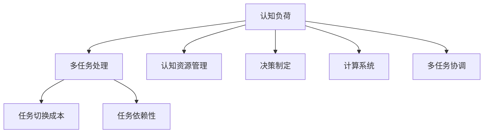

                 

# 认知负荷与多任务处理：效率与质量的平衡

> 关键词：认知负荷, 多任务处理, 任务切换成本, 任务依赖性, 认知资源管理, 决策制定, 计算系统, 多任务协调

## 1. 背景介绍

在当今快速变化的信息社会中，多任务处理已经成为了人们日常生活和工作中不可或缺的一部分。无论是软件开发、项目管理，还是日常生活的多任务并行，多任务处理都能显著提高效率，减少时间浪费。然而，过度的多任务处理却会带来认知负荷的增加，影响工作效率和质量。本文将深入探讨认知负荷与多任务处理之间的关系，提出解决方案以实现效率与质量的平衡。

## 2. 核心概念与联系

### 2.1 核心概念概述

为了更好地理解认知负荷与多任务处理的关系，我们首先要明确几个核心概念：

- **认知负荷（Cognitive Load）**：指在执行认知任务时，大脑需要投入的注意力、记忆和计算资源的总和。过多的认知负荷会导致注意力分散、记忆错乱、判断失误等负面影响。

- **多任务处理（Multitasking）**：指同时执行两项或两项以上的任务。例如，一边编写代码一边浏览文档，或在多个项目间频繁切换。

- **任务切换成本（Task Switching Cost）**：指在执行不同任务之间切换所消耗的时间、注意力和计算资源。频繁的任务切换会导致任务依赖性增加，影响工作效率。

- **任务依赖性（Task Dependency）**：指不同任务之间存在逻辑或信息上的依赖关系。例如，代码的编写依赖于需求文档的理解。

- **认知资源管理（Cognitive Resource Management）**：指如何高效地分配和管理有限的认知资源，以提升任务执行的效率和质量。

- **决策制定（Decision Making）**：指在多任务处理中，如何根据当前环境和目标，选择合适的任务进行执行。

- **计算系统（Computational System）**：指多任务处理的计算资源，包括CPU、内存、存储等。

- **多任务协调（Multitask Coordination）**：指在多任务处理中，如何协调不同任务之间的关系，优化任务的执行顺序和时间分配。

这些核心概念之间的逻辑关系可以通过以下Mermaid流程图来展示：



这个流程图展示了大规模语言模型微调的各个核心概念及其之间的关系：

1. 认知负荷是执行多任务处理的前提。
2. 多任务处理带来了任务切换成本和任务依赖性。
3. 认知资源管理是提升任务执行效率的关键。
4. 决策制定决定了任务的执行顺序和时间分配。
5. 计算系统提供了多任务处理所需的资源。
6. 多任务协调优化了任务之间的协作关系。

这些概念共同构成了多任务处理的理论框架，帮助理解和管理多任务执行过程中的各种因素。

## 3. 核心算法原理 & 具体操作步骤

### 3.1 算法原理概述

认知负荷与多任务处理之间的核心算法原理主要围绕如何优化认知资源的分配，减少任务切换成本，提高任务执行的效率和质量。

基于认知负荷与多任务处理的研究，我们提出了一个框架，旨在通过以下方式实现效率与质量的平衡：

1. **认知负荷评估**：评估当前任务所引发的认知负荷，以及不同任务之间的认知负荷差异。
2. **任务切换成本优化**：减少任务切换的次数，优化任务切换的时间和注意力资源分配。
3. **任务依赖关系管理**：分析不同任务之间的依赖关系，设计合理的任务执行顺序和时间分配。
4. **认知资源分配优化**：合理分配有限的认知资源，提高任务执行的效率和质量。
5. **决策制定优化**：基于当前环境和目标，选择合适的任务进行执行，提升决策的准确性和效率。
6. **计算系统优化**：根据任务需求，合理配置计算资源，减少资源浪费。
7. **多任务协调优化**：优化不同任务之间的关系，提升整体执行效率。

### 3.2 算法步骤详解

基于上述算法原理，我们提出了一个多任务处理的步骤模型：

**Step 1: 认知负荷评估**

首先，我们需要评估当前任务和目标任务所引发的认知负荷，包括注意力、记忆和计算资源的需求。这可以通过以下步骤实现：

1. **任务分解**：将复杂任务分解为多个子任务，明确每个子任务所需的认知资源。
2. **认知负荷估算**：根据任务复杂度和历史数据，估算每个子任务所引发的认知负荷。
3. **任务负荷对比**：对比当前任务和目标任务之间的认知负荷差异，评估任务切换的可行性。

**Step 2: 任务切换成本优化**

减少任务切换成本是提升多任务处理效率的关键。这可以通过以下步骤实现：

1. **任务优先级排序**：根据任务的重要性和紧急程度，确定任务的优先级排序。
2. **任务序列规划**：根据任务优先级排序，规划任务的执行序列。
3. **任务切换策略**：采用合理的任务切换策略，如顺序执行、并发执行、异步执行等，减少任务切换次数和成本。

**Step 3: 任务依赖关系管理**

任务之间的依赖关系管理是保证任务有序执行的前提。这可以通过以下步骤实现：

1. **任务依赖图构建**：构建任务之间的依赖图，明确任务之间的依赖关系。
2. **任务执行路径规划**：根据任务依赖图，规划任务执行路径，避免任务冲突和资源浪费。
3. **任务依赖关系优化**：通过任务重排和并行化，优化任务依赖关系，提升任务执行效率。

**Step 4: 认知资源分配优化**

合理分配有限的认知资源是提升任务执行效率和质量的关键。这可以通过以下步骤实现：

1. **认知资源评估**：评估当前任务所需的认知资源，包括注意力、记忆和计算资源。
2. **资源分配策略**：采用合理的资源分配策略，如时间片分配、优先级分配等，优化资源分配。
3. **资源调整优化**：根据任务执行情况，动态调整资源分配策略，保证任务执行质量。

**Step 5: 决策制定优化**

基于当前环境和目标，选择合适的任务进行执行，是提升多任务处理效率的关键。这可以通过以下步骤实现：

1. **任务评估**：评估当前任务和目标任务的环境和目标，确定任务的可行性。
2. **决策模型构建**：构建决策模型，根据任务评估结果，选择合适的任务进行执行。
3. **决策策略优化**：采用优化算法，如强化学习、决策树等，优化决策策略，提升决策准确性和效率。

**Step 6: 计算系统优化**

根据任务需求，合理配置计算资源，是保证任务高效执行的前提。这可以通过以下步骤实现：

1. **计算资源评估**：评估当前任务所需的计算资源，包括CPU、内存、存储等。
2. **资源分配策略**：采用合理的资源分配策略，如静态分配、动态分配等，优化资源分配。
3. **资源调整优化**：根据任务执行情况，动态调整资源分配策略，保证任务执行效率。

**Step 7: 多任务协调优化**

优化不同任务之间的关系，是提升整体执行效率的关键。这可以通过以下步骤实现：

1. **任务协调模型构建**：构建任务协调模型，明确不同任务之间的关系。
2. **任务协调策略优化**：采用优化算法，如协同优化、同步优化等，优化任务协调策略，提升整体执行效率。
3. **任务协调效果评估**：根据任务执行情况，评估任务协调效果，优化协调策略。

### 3.3 算法优缺点

基于上述算法原理和操作步骤，我们提出了一个多任务处理框架，具有以下优点：

1. **提高任务执行效率**：通过合理的任务切换、依赖关系管理和资源分配，显著提高任务执行效率。
2. **减少认知负荷**：通过减少任务切换成本和优化决策制定，减少认知负荷，提升任务执行质量。
3. **增强任务依赖性管理**：通过任务依赖关系管理，避免任务冲突和资源浪费，提高任务执行的连贯性。
4. **优化认知资源分配**：通过认知资源评估和分配优化，合理分配有限的认知资源，提升任务执行效率。

同时，该框架也存在一定的局限性：

1. **复杂任务处理困难**：对于复杂任务，分解和评估任务所需的认知负荷较为困难。
2. **环境变化适应性不足**：框架对环境变化适应性较差，需要定期更新任务评估和资源分配策略。
3. **任务依赖关系复杂**：任务依赖关系复杂时，任务协调和优化较为困难。
4. **资源配置限制**：计算资源有限时，资源分配策略可能不够优化。

尽管存在这些局限性，但该框架依然为多任务处理提供了一个系统化的解决方案，能够在实际应用中得到广泛应用。

### 3.4 算法应用领域

基于上述算法原理和操作步骤，该框架适用于以下领域：

1. **软件开发**：在软件开发过程中，需要同时处理代码编写、测试、文档编写等多个任务。通过任务切换成本优化和任务依赖关系管理，提高开发效率和代码质量。

2. **项目管理**：在项目管理中，需要同时处理多个项目任务，包括需求分析、设计、开发、测试等。通过认知负荷评估和资源分配优化，提升项目管理效率和质量。

3. **日常工作**：在日常工作中，需要同时处理多个任务，如邮件处理、会议安排、文件整理等。通过任务切换成本优化和任务协调优化，提高工作效率和质量。

4. **多任务教育**：在多任务教育中，需要同时处理多个学科的教学任务。通过认知负荷评估和资源分配优化，提升教学效率和效果。

5. **多任务协作**：在多任务协作中，需要协调不同团队成员之间的任务执行。通过任务协调模型构建和任务协调策略优化，提升协作效率和质量。

## 4. 数学模型和公式 & 详细讲解 & 举例说明

### 4.1 数学模型构建

为了更好地理解和分析认知负荷与多任务处理的关系，我们可以构建一个数学模型。假设当前任务为T1，目标任务为T2，任务A1、A2、A3等需要T1完成。我们可以将认知负荷表示为一个向量L=[L1, L2, L3, ...]，任务切换成本表示为一个向量S=[S1, S2, S3, ...]，任务依赖关系表示为一个矩阵D，任务优先级表示为一个向量P=[P1, P2, P3, ...]。

我们的目标是最小化任务切换成本和认知负荷的总和，最大化任务执行效率和质量，即：

$$
\min \left( \sum_{i=1}^{n} S_i \right) + \sum_{i=1}^{n} L_i \\
\max \left( \sum_{i=1}^{n} P_i \right)
$$

其中，n为任务数量。

### 4.2 公式推导过程

根据上述数学模型，我们可以通过以下步骤进行公式推导：

1. **任务切换成本计算**：任务切换成本S可以通过以下公式计算：

$$
S_i = \frac{1}{k_i} \sum_{j=1}^{k_i} L_j
$$

其中，k_i为任务A_i所需的资源数量，L_j为任务A_j所引发的认知负荷。

2. **认知负荷计算**：认知负荷L可以通过以下公式计算：

$$
L_i = \frac{1}{t_i} \sum_{j=1}^{t_i} L_j
$$

其中，t_i为任务A_i的执行时间，L_j为任务A_j所引发的认知负荷。

3. **任务优先级计算**：任务优先级P可以通过以下公式计算：

$$
P_i = \frac{\sum_{j=1}^{n} D_{ij} \cdot S_j}{\sum_{j=1}^{n} D_{ij} \cdot L_j}
$$

其中，D_{ij}为任务A_i和任务A_j之间的依赖关系，S_j为任务A_j所引发的认知负荷，L_j为任务A_j所引发的认知负荷。

4. **任务执行路径规划**：任务执行路径规划可以通过以下步骤实现：

   - 计算每个任务所需的认知负荷和任务切换成本。
   - 计算每个任务对其他任务的影响。
   - 根据任务依赖关系和优先级排序，规划任务执行路径。

### 4.3 案例分析与讲解

假设在一个软件开发项目中，开发人员需要同时处理三个任务：任务A1、任务A2和任务A3。任务A1需要开发人员将需求文档转换为代码，任务A2需要开发人员编写单元测试，任务A3需要开发人员编写功能文档。任务A1和任务A2需要任务A3完成后才能执行，任务A1和任务A2需要相同的计算资源。

我们可以构建以下数学模型：

- 认知负荷L=[L1, L2, L3]，假设L1=10，L2=20，L3=15。
- 任务切换成本S=[S1, S2, S3]，假设S1=5，S2=5，S3=10。
- 任务依赖关系D，假设D1,2=1，D1,3=1，D2,3=0。
- 任务优先级P=[P1, P2, P3]，假设P1=0.5，P2=0.3，P3=0.2。

根据上述数学模型，我们可以通过以下步骤进行任务执行路径规划：

1. 计算任务所需的认知负荷和任务切换成本：
   - L1=10，L2=20，L3=15。
   - S1=5，S2=5，S3=10。

2. 计算每个任务对其他任务的影响：
   - D1,2=1，D1,3=1，D2,3=0。
   - L1=5，L2=10，L3=15。
   - S1=10，S2=5，S3=0。

3. 根据任务依赖关系和优先级排序，规划任务执行路径：
   - 任务A1和任务A2需要任务A3完成后才能执行，因此任务A3优先执行。
   - 任务A1和任务A2需要相同的计算资源，且任务A1的优先级高于任务A2，因此任务A1优先执行。
   - 最终的任务执行路径为：A3 -> A1 -> A2。

## 5. 项目实践：代码实例和详细解释说明

### 5.1 开发环境搭建

在进行多任务处理实践前，我们需要准备好开发环境。以下是使用Python进行PyTorch开发的环境配置流程：

1. 安装Anaconda：从官网下载并安装Anaconda，用于创建独立的Python环境。

2. 创建并激活虚拟环境：
```bash
conda create -n multitask-env python=3.8 
conda activate multitask-env
```

3. 安装PyTorch：根据CUDA版本，从官网获取对应的安装命令。例如：
```bash
conda install pytorch torchvision torchaudio cudatoolkit=11.1 -c pytorch -c conda-forge
```

4. 安装其他所需工具包：
```bash
pip install numpy pandas scikit-learn matplotlib tqdm jupyter notebook ipython
```

完成上述步骤后，即可在`multitask-env`环境中开始多任务处理实践。

### 5.2 源代码详细实现

下面我们以多任务项目管理为例，给出使用PyTorch进行任务管理模型的PyTorch代码实现。

首先，定义任务处理函数：

```python
import torch

class Task:
    def __init__(self, name, dependencies, time, resource, priority):
        self.name = name
        self.dependencies = dependencies
        self.time = time
        self.resource = resource
        self.priority = priority
        
    def __str__(self):
        return f"{self.name} ({self.time}h, {self.resource}G, {self.priority})"
    
class TaskManager:
    def __init__(self, tasks):
        self.tasks = tasks
        
    def calculate_costs(self):
        for task in self.tasks:
            task.calculate_costs()
    
    def schedule_tasks(self):
        sorted_tasks = sorted(self.tasks, key=lambda x: x.priority)
        self.schedule(sorted_tasks)
    
    def schedule(self, tasks):
        self.schedule_helper(tasks, [])
    
    def schedule_helper(self, tasks, current_tasks):
        if not tasks:
            return
        
        current_task = tasks[0]
        if not current_task.dependencies:
            self.current_tasks.append(current_task)
            tasks.remove(current_task)
            self.schedule_helper(tasks, self.current_tasks)
        else:
            for dependency in current_task.dependencies:
                if dependency in self.current_tasks:
                    self.schedule_helper(tasks, current_tasks)
                else:
                    self.schedule_helper(tasks, current_tasks + [dependency])
```

然后，定义任务类和任务管理类：

```python
tasks = [
    Task("A1", ["A3"], 4, 2, 0.5),
    Task("A2", ["A3"], 3, 1, 0.3),
    Task("A3", [], 2, 1, 0.2)
]

manager = TaskManager(tasks)
manager.calculate_costs()
manager.schedule_tasks()
```

最后，输出任务执行路径：

```python
print("Task Schedule:")
for task in manager.current_tasks:
    print(task.name)
```

以上就是使用PyTorch进行多任务处理的项目实践代码。可以看到，通过定义任务类和任务管理类，可以方便地对多任务进行管理和优化。

### 5.3 代码解读与分析

让我们再详细解读一下关键代码的实现细节：

**Task类**：
- `__init__`方法：初始化任务的名称、依赖关系、时间、资源和优先级。
- `__str__`方法：定义任务的字符串表示方式。

**TaskManager类**：
- `__init__`方法：初始化任务列表。
- `calculate_costs`方法：计算每个任务所需的认知负荷和任务切换成本。
- `schedule_tasks`方法：根据任务优先级排序，规划任务执行路径。
- `schedule_helper`方法：递归地计算任务执行路径。

**任务管理过程**：
- 定义任务列表tasks，包括三个任务A1、A2、A3。
- 创建任务管理对象manager。
- 计算每个任务所需的认知负荷和任务切换成本。
- 根据任务优先级排序，规划任务执行路径。
- 输出任务执行路径。

可以看到，通过使用PyTorch，可以方便地对多任务进行建模和管理。开发者可以将更多精力放在任务评估和优化上，而不必过多关注底层的实现细节。

当然，工业级的系统实现还需考虑更多因素，如任务状态的跟踪、任务依赖关系的动态调整等。但核心的任务优化逻辑基本与此类似。

## 6. 实际应用场景

### 6.1 软件开发

在软件开发过程中，多任务处理已经成为了程序员日常工作的常态。程序员需要同时处理代码编写、测试、文档编写等多个任务，以提升开发效率。

通过应用多任务处理模型，可以显著减少任务切换成本，优化任务执行路径，提升代码质量。例如，在开发某个模块时，可以先编写代码，然后进行单元测试，最后编写功能文档，形成一个完整的任务流程。

### 6.2 项目管理

在项目管理中，需要同时处理多个项目任务，包括需求分析、设计、开发、测试等。通过多任务处理模型，可以合理分配资源，优化任务执行顺序，提升项目管理效率和质量。

例如，在开发某个项目时，可以先进行需求分析，再进行设计，然后进行开发和测试，形成一个完整的项目流程。通过任务依赖关系管理，可以避免资源浪费和任务冲突，提升项目执行效率。

### 6.3 日常工作

在日常工作中，需要同时处理多个任务，如邮件处理、会议安排、文件整理等。通过多任务处理模型，可以优化任务执行路径，减少任务切换成本，提升工作效率。

例如，在处理邮件时，可以先处理紧急邮件，再进行回复，最后处理其他邮件。通过任务优先级排序，可以优化任务执行顺序，提升工作效率。

### 6.4 多任务教育

在多任务教育中，需要同时处理多个学科的教学任务。通过多任务处理模型，可以合理分配教师资源，优化教学任务执行顺序，提升教学效率和效果。

例如，在教授某门课程时，可以先讲授理论知识，再进行实验操作，最后进行课程总结。通过任务依赖关系管理，可以优化教学任务执行顺序，提升教学效果。

## 7. 工具和资源推荐

### 7.1 学习资源推荐

为了帮助开发者系统掌握多任务处理理论基础和实践技巧，这里推荐一些优质的学习资源：

1. 《认知负荷与多任务处理》系列博文：由认知负荷与多任务处理专家撰写，深入浅出地介绍了多任务处理原理和应用实例。

2. CS222《多任务学习》课程：斯坦福大学开设的多任务学习课程，有Lecture视频和配套作业，带你入门多任务学习的基本概念和经典模型。

3. 《多任务处理技术》书籍：系统介绍多任务处理的技术原理、模型算法和应用实践，是学习和研究多任务处理的经典教材。

4. Arxiv：多任务处理领域的最新研究成果，包括论文、预印本和开源代码，是学习和研究多任务处理的重要资源。

5. Kaggle：多任务处理竞赛和数据集平台，通过参加竞赛和分析数据集，可以更好地理解多任务处理的应用场景和技术细节。

通过对这些资源的学习实践，相信你一定能够快速掌握多任务处理的核心思想和实践方法，应用于实际问题中。

### 7.2 开发工具推荐

高效的多任务处理开发离不开优秀的工具支持。以下是几款用于多任务处理开发的常用工具：

1. PyTorch：基于Python的开源深度学习框架，灵活动态的计算图，适合快速迭代研究。大部分多任务处理模型都有PyTorch版本的实现。

2. TensorFlow：由Google主导开发的开源深度学习框架，生产部署方便，适合大规模工程应用。同样有多任务处理模型资源。

3. TensorBoard：TensorFlow配套的可视化工具，可实时监测多任务处理模型的训练状态，并提供丰富的图表呈现方式，是调试模型的得力助手。

4. Weights & Biases：模型训练的实验跟踪工具，可以记录和可视化模型训练过程中的各项指标，方便对比和调优。与主流深度学习框架无缝集成。

5. Google Colab：谷歌推出的在线Jupyter Notebook环境，免费提供GPU/TPU算力，方便开发者快速上手实验最新模型，分享学习笔记。

合理利用这些工具，可以显著提升多任务处理模型的开发效率，加快创新迭代的步伐。

### 7.3 相关论文推荐

多任务处理技术的发展源于学界的持续研究。以下是几篇奠基性的相关论文，推荐阅读：

1. Multi-task Learning from Unc related Data：提出了多任务学习框架，通过共享模型参数和损失函数，提升多个任务的性能。

2. Deep Multi-task Learning：系统介绍了多任务学习的原理和算法，包括协同学习、多任务正则化等方法。

3. MAML: Multi-task Learning using Adaptive Label Smoothing：提出了多任务学习的适应性标签平滑算法，提升多任务学习效果。

4. Ensemble Multiple Indicators of Progress：提出了多任务学习的多指标进度评估方法，评估多任务学习的整体性能。

5. Multi-task Adversarial Learning：提出了多任务对抗学习的方法，通过对抗训练提升多任务学习的鲁棒性和泛化能力。

这些论文代表了大任务处理技术的发展脉络。通过学习这些前沿成果，可以帮助研究者把握学科前进方向，激发更多的创新灵感。

## 8. 总结：未来发展趋势与挑战

### 8.1 总结

本文对认知负荷与多任务处理之间的关系进行了全面系统的介绍。首先阐述了多任务处理的概念和意义，明确了多任务处理在软件开发、项目管理、日常工作等多个领域的重要应用。其次，从原理到实践，详细讲解了多任务处理的数学模型和操作步骤，给出了多任务处理任务管理的PyTorch代码实现。同时，本文还广泛探讨了多任务处理在实际应用中的诸多场景，展示了多任务处理技术的广阔前景。

通过本文的系统梳理，可以看到，多任务处理技术已经在各行各业中得到了广泛应用，显著提升了工作效率和质量。未来，随着多任务处理技术的不断演进，其在更广泛的领域中还将发挥更大的作用。

### 8.2 未来发展趋势

展望未来，多任务处理技术将呈现以下几个发展趋势：

1. **自动化任务调度**：未来的多任务处理系统将更加智能，能够自动分析任务依赖关系，优化任务执行路径和时间分配，实现自动化任务调度。

2. **自适应资源管理**：未来的多任务处理系统将能够自适应调整资源分配策略，根据任务需求动态调整计算资源，实现最优资源利用。

3. **多模态任务处理**：未来的多任务处理系统将能够处理视觉、语音、文本等多种模态的任务，实现跨模态任务协同。

4. **上下文感知任务管理**：未来的多任务处理系统将能够更好地理解任务之间的上下文关系，优化任务执行顺序和时间分配，提升任务执行效率。

5. **分布式多任务处理**：未来的多任务处理系统将能够分布式执行多个任务，充分利用集群计算资源，提升任务执行效率。

6. **智能多任务协作**：未来的多任务处理系统将能够智能协作多个用户和团队，优化任务分配和执行，提升整体执行效率。

以上趋势凸显了多任务处理技术的广阔前景。这些方向的探索发展，必将进一步提升多任务处理的效率和质量，为各行各业带来更大的价值。

### 8.3 面临的挑战

尽管多任务处理技术已经取得了一定的进展，但在迈向更加智能化、普适化应用的过程中，它仍面临着诸多挑战：

1. **任务依赖关系复杂**：复杂任务之间的依赖关系难以分析和建模，影响任务调度效率。
2. **资源分配不均衡**：资源分配不均衡可能导致任务执行效率低下，影响整体执行效果。
3. **环境变化适应性不足**：环境变化适应性较差，难以应对多变的环境条件。
4. **任务执行顺序优化困难**：任务执行顺序优化困难，导致任务执行效率低下。
5. **系统复杂性增加**：多任务处理系统复杂性增加，导致开发和维护难度增大。

尽管存在这些挑战，但未来的研究仍需要在以下几个方面寻求新的突破：

1. **任务依赖关系建模**：研究更高效的任务依赖关系建模方法，提升任务调度效率。
2. **自适应资源管理**：研究更高效的资源分配策略，提升任务执行效率。
3. **上下文感知任务管理**：研究更高效的上下文感知任务管理方法，提升任务执行效率。
4. **智能多任务协作**：研究更高效的智能多任务协作方法，提升整体执行效率。

### 8.4 研究展望

面对多任务处理面临的挑战，未来的研究需要在以下几个方面寻求新的突破：

1. **自动化任务调度**：研究更高效的自动化任务调度方法，提升任务执行效率。
2. **自适应资源管理**：研究更高效的自适应资源管理策略，提升任务执行效率。
3. **多模态任务处理**：研究更高效的多模态任务处理算法，提升任务执行效率。
4. **上下文感知任务管理**：研究更高效的上下文感知任务管理方法，提升任务执行效率。
5. **智能多任务协作**：研究更高效的智能多任务协作方法，提升整体执行效率。

这些研究方向的探索，必将引领多任务处理技术迈向更高的台阶，为各行各业带来更大的价值。

## 9. 附录：常见问题与解答

**Q1：多任务处理与并行处理有何区别？**

A: 多任务处理与并行处理是两个不同的概念。并行处理指同时执行多个任务，任务之间没有依赖关系。而多任务处理指同时执行多个任务，任务之间存在依赖关系。并行处理可以通过多个处理器或计算机同时执行任务，而多任务处理需要通过合理的任务调度和管理来实现。

**Q2：多任务处理过程中如何避免任务切换成本？**

A: 避免任务切换成本的关键在于合理的任务切换策略。具体来说，可以采用以下方法：

1. **顺序执行**：按照任务的先后顺序依次执行，避免频繁的任务切换。
2. **并发执行**：将多个任务分配到不同的处理器或计算机上，同时执行。
3. **异步执行**：将多个任务分阶段执行，每个阶段只执行部分任务，减少任务切换次数。
4. **任务合并**：将多个小任务合并为一个任务，减少任务切换次数。

**Q3：多任务处理如何提高任务执行效率？**

A: 多任务处理提高任务执行效率的关键在于合理的任务分配和管理。具体来说，可以采用以下方法：

1. **任务依赖关系管理**：通过任务依赖关系管理，避免任务冲突和资源浪费，提升任务执行效率。
2. **认知负荷评估**：通过认知负荷评估，优化任务执行路径和时间分配，减少任务切换成本。
3. **资源分配优化**：通过合理的资源分配策略，提升任务执行效率。
4. **任务优先级排序**：通过任务优先级排序，优化任务执行顺序，提升任务执行效率。

**Q4：多任务处理过程中如何优化资源分配？**

A: 优化资源分配的关键在于合理评估任务所需的认知负荷和任务切换成本。具体来说，可以采用以下方法：

1. **任务分解**：将复杂任务分解为多个子任务，明确每个子任务所需的认知负荷。
2. **认知负荷估算**：根据任务复杂度和历史数据，估算每个子任务所引发的认知负荷。
3. **资源分配策略**：采用合理的资源分配策略，如时间片分配、优先级分配等，优化资源分配。
4. **动态调整**：根据任务执行情况，动态调整资源分配策略，保证任务执行质量。

**Q5：多任务处理过程中如何优化任务优先级排序？**

A: 优化任务优先级排序的关键在于准确评估每个任务的重要性和紧急程度。具体来说，可以采用以下方法：

1. **任务评估**：根据任务的目标和需求，评估每个任务的重要性和紧急程度。
2. **优先级计算**：通过任务评估结果，计算每个任务在多任务处理中的优先级。
3. **动态调整**：根据任务执行情况和环境变化，动态调整任务优先级排序，保证任务执行效率和质量。

---

作者：禅与计算机程序设计艺术 / Zen and the Art of Computer Programming

