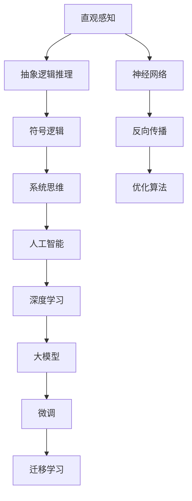

                 

# 认知革命：人类思维的进化历程

> 关键词：认知革命,人类思维,神经科学,进化,人工智能

## 1. 背景介绍

### 1.1 问题由来
人类社会的进步和发展，从根本上说，是思维方式和认知模式的不断演进。从原始的直观感知，到抽象逻辑推理，再到复杂的系统思维，每一次思维方式的重大转变，都带来了文明的巨大飞跃。认知革命(Cognitive Revolution)，就是指人类思维从简单的直观感知，逐步演进到复杂的系统思维的过程。在这个过程中，人类通过不断地吸收新知识、新技能，形成更加系统、严谨的认知体系，从而推动了科技的进步和社会的繁荣。

### 1.2 问题核心关键点
认知革命的核心关键点包括以下几个方面：

- 原始直观感知向抽象逻辑推理的转变：人类早期的认知模式主要依赖于直观感知，即通过感官输入来理解世界。这种认知模式受限于感官输入的局限性，难以处理复杂多变的现象。随着语言、符号等抽象工具的出现，人类开始能够通过逻辑推理来理解世界，从而推动了科学、数学等知识体系的发展。

- 符号逻辑到系统思维的演进：随着科学方法论的兴起，人类开始使用符号逻辑来描述和分析现象。符号逻辑通过引入符号和公式，能够表达复杂而抽象的概念，支持严谨的推理和验证。系统思维则在此基础上，进一步整合多领域知识，形成更加全面、系统的认知体系，推动了工业革命、信息革命等重大技术革新。

- 人工智能的兴起：随着计算技术的进步，人类开始尝试使用计算机模拟人类思维过程，开发出具有高度智能的AI系统。这些系统不仅能够处理大量数据，还能够进行复杂的逻辑推理和决策，推动了智能技术在各个领域的应用。

这些关键点共同构成了认知革命的演进脉络，展示了人类思维从简单直观到复杂系统的发展历程。理解这一演进过程，对于我们把握未来的科技发展趋势，有着重要的启示意义。

## 2. 核心概念与联系

### 2.1 核心概念概述

认知革命涉及多个核心概念，包括直观感知、抽象逻辑推理、符号逻辑、系统思维和人工智能等。这些概念之间的联系可以通过以下Mermaid流程图来展示：



这个流程图展示了认知革命演进过程中各个概念之间的联系：

1. 直观感知(A)是认知革命的起点，是人类早期认知的主要模式。
2. 抽象逻辑推理(B)在语言和符号的基础上出现，支持复杂的逻辑推理。
3. 符号逻辑(C)进一步抽象化，能够表达复杂概念，支持形式化推理。
4. 系统思维(D)整合多领域知识，形成系统的认知体系。
5. 人工智能(E)通过计算模拟人类思维过程，推动智能技术发展。
6. 深度学习(F)和预训练大模型(G)进一步提升了AI的计算能力。
7. 微调(H)和迁移学习(I)优化了模型的性能，增强了模型适应新任务的能力。
8. 神经网络(J)和反向传播(K)是大模型和微调技术的基础。
9. 优化算法(L)提供了高效求解优化问题的工具。

这些概念共同构成了认知革命的演进框架，揭示了人类思维从简单到复杂的发展路径。

## 3. 核心算法原理 & 具体操作步骤
### 3.1 算法原理概述

认知革命的演进过程中，涉及多种算法和操作技术。其中，深度学习算法和优化算法是认知革命在人工智能阶段的主要技术支撑。

### 3.2 算法步骤详解

认知革命的演进可以总结为以下几个关键步骤：

**Step 1: 数据收集与预处理**
- 收集与认知革命相关的数据，如历史文献、实验记录、科学论文等。
- 对数据进行清洗和标注，确保数据的质量和一致性。

**Step 2: 模型选择与训练**
- 根据认知革命的不同阶段，选择适合的算法模型，如神经网络、符号逻辑等。
- 在选定的模型上，使用反向传播等算法进行训练，优化模型参数，使其能够更好地拟合数据。

**Step 3: 模型微调与评估**
- 在模型训练完成后，通过微调和评估来进一步优化模型的性能。微调可以通过调整模型参数或添加新的层来实现，评估则通过计算模型在测试集上的性能指标来衡量。

**Step 4: 应用与迭代**
- 将训练好的模型应用于实际问题中，如语言翻译、推理、决策等。
- 不断收集新的数据和反馈，进行模型迭代优化，提高模型性能。

### 3.3 算法优缺点

认知革命演进过程中的算法，既有其优势，也存在一定的局限性。

#### 优势
1. 数据驱动：通过大量数据的收集和处理，能够发现复杂的模式和规律，推动科学发现和技术创新。
2. 计算高效：深度学习算法和优化算法在计算能力上具有明显优势，能够处理大规模数据集和复杂模型。
3. 鲁棒性强：通过不断迭代优化，模型能够适应新的数据和任务，具有一定的鲁棒性。

#### 局限性
1. 数据依赖：深度学习算法需要大量标注数据进行训练，获取高质量标注数据成本较高。
2. 可解释性不足：模型参数复杂，难以解释其内部机制和决策过程。
3. 局部最优：优化算法容易陷入局部最优，难以找到全局最优解。
4. 过拟合风险：在标注数据不足的情况下，模型容易过拟合，泛化性能不佳。

尽管存在这些局限性，深度学习算法和优化算法仍是当前认知革命演进阶段的主要技术手段，推动了人工智能技术在各个领域的应用。未来，研究者们需要进一步优化这些技术，提高模型的可解释性和泛化性能，推动认知革命的进一步发展。

### 3.4 算法应用领域

认知革命演进过程中的算法，在多个领域得到了广泛应用，包括：

- 语言翻译：通过深度学习算法，翻译模型能够自动将一种语言翻译成另一种语言，广泛应用于跨境电商、国际会议等场景。
- 自然语言处理：通过符号逻辑和系统思维，NLP技术能够处理和理解自然语言，广泛应用于智能客服、智能问答等场景。
- 图像识别：通过深度学习算法，图像识别模型能够自动识别和分类图像，广泛应用于医疗影像分析、安防监控等场景。
- 自动驾驶：通过深度学习和优化算法，自动驾驶模型能够自动驾驶汽车，应用于智能交通和物流等领域。
- 金融风控：通过深度学习和优化算法，金融风控模型能够自动评估贷款申请和投资风险，应用于金融管理和风险控制。

## 4. 数学模型和公式 & 详细讲解  
### 4.1 数学模型构建

认知革命演进过程中的算法，涉及多种数学模型和公式。以深度学习算法为例，其核心模型是神经网络，其数学模型可以表示为：

$$
h = f(Wx + b)
$$

其中 $h$ 为神经元的输出，$x$ 为输入向量，$W$ 为权重矩阵，$b$ 为偏置项，$f$ 为激活函数。

### 4.2 公式推导过程

以神经网络为例，其反向传播算法的推导过程如下：

1. 定义损失函数 $L$，如均方误差损失。
2. 对输出层进行前向传播，计算预测值 $y$。
3. 计算损失函数 $L$ 对输出层权重 $W$ 和偏置项 $b$ 的梯度。
4. 反向传播梯度，计算中间层权重和偏置项的梯度。
5. 使用优化算法，如SGD，更新模型参数。

这一过程可以通过伪代码表示为：

```
for layer in layers:
    dloss_dw = dloss_db = 0
    for i in range(layer.size):
        dloss_dw += dloss_db * layer.w[i]
        dloss_db *= layer.a
        dloss_db += layer.x * layer.g
    layer.w -= learning_rate * dloss_dw
    layer.b -= learning_rate * dloss_db
```

### 4.3 案例分析与讲解

以图像识别为例，卷积神经网络(CNN)是常用的深度学习模型。其核心思想是通过卷积层提取图像特征，通过池化层减少特征维度，通过全连接层进行分类。

以LeNet-5模型为例，其核心架构如下：

```
Input Layer
|
Convolution Layer
|          |
|    ReLU  | --> Max Pooling Layer
|          |
|           |
|         Convolution Layer
|          |
|    ReLU  | --> Max Pooling Layer
|          |
|           |
|      Flatten Layer
|           |
|         FC Layer
|          |
|           |
|         Softmax Layer
|           |
Output Layer
```

其中，Convolution Layer和Pooling Layer通过卷积和池化操作，提取图像特征。Flatten Layer将特征图展平，FC Layer通过全连接层进行分类。Softmax Layer输出概率分布，用于预测图像类别。

CNN在图像识别任务中取得了显著效果，其核心在于通过卷积操作提取局部特征，通过池化操作减少特征维度，通过全连接层进行分类。在实际应用中，可以通过调整卷积核大小、池化大小、全连接层宽度等超参数，优化模型性能。

## 5. 项目实践：代码实例和详细解释说明
### 5.1 开发环境搭建

在进行项目实践前，我们需要准备好开发环境。以下是使用Python进行TensorFlow开发的完整环境配置流程：

1. 安装Anaconda：从官网下载并安装Anaconda，用于创建独立的Python环境。

2. 创建并激活虚拟环境：
```bash
conda create -n tf-env python=3.7 
conda activate tf-env
```

3. 安装TensorFlow：从官网获取对应的安装命令，例如：
```bash
pip install tensorflow
```

4. 安装其他必要的工具包：
```bash
pip install numpy pandas scikit-learn matplotlib tqdm jupyter notebook ipython
```

完成上述步骤后，即可在`tf-env`环境中开始项目实践。

### 5.2 源代码详细实现

下面以LeNet-5模型为例，给出TensorFlow对图像识别任务进行深度学习的完整代码实现。

首先，定义模型：

```python
import tensorflow as tf
from tensorflow.keras import layers

model = tf.keras.Sequential([
    layers.Conv2D(6, (3, 3), activation='relu', input_shape=(28, 28, 1)),
    layers.MaxPooling2D((2, 2)),
    layers.Conv2D(16, (3, 3), activation='relu'),
    layers.MaxPooling2D((2, 2)),
    layers.Flatten(),
    layers.Dense(120, activation='relu'),
    layers.Dense(10, activation='softmax')
])
```

接着，定义损失函数和优化器：

```python
loss_fn = tf.keras.losses.SparseCategoricalCrossentropy(from_logits=True)
optimizer = tf.keras.optimizers.Adam()
```

然后，定义训练函数：

```python
def train_step(model, inputs, labels):
    with tf.GradientTape() as tape:
        logits = model(inputs, training=True)
        loss = loss_fn(labels, logits)
    gradients = tape.gradient(loss, model.trainable_variables)
    optimizer.apply_gradients(zip(gradients, model.trainable_variables))
    return loss
```

最后，启动训练流程：

```python
for epoch in range(epochs):
    for inputs, labels in train_dataset:
        loss = train_step(model, inputs, labels)
    print(f'Epoch {epoch+1}, loss: {loss:.4f}')
```

以上就是使用TensorFlow对LeNet-5模型进行图像识别任务深度学习的完整代码实现。可以看到，借助TensorFlow的强大封装，我们可以快速实现复杂的深度学习模型，并对其进行训练和评估。

### 5.3 代码解读与分析

让我们再详细解读一下关键代码的实现细节：

**train_step函数**：
- 使用梯度带回的Tape，记录训练过程的梯度信息。
- 计算模型输出的logits。
- 计算损失函数。
- 计算梯度，并使用Adam优化器进行参数更新。

**训练流程**：
- 在每个epoch内，对训练集数据进行迭代。
- 每个batch内，使用train_step函数计算损失，更新模型参数。
- 输出每个epoch的平均损失。

可以看到，TensorFlow提供了丰富的API，方便开发者快速实现复杂的深度学习模型和训练流程。同时，TensorFlow的Tape机制和自动微分功能，使得模型训练的梯度计算变得简单高效。

## 6. 实际应用场景

### 6.1 智能医疗

在智能医疗领域，深度学习算法和认知革命演进技术得到了广泛应用。通过深度学习模型，医疗影像分析、病历分析、药物研发等任务得到了显著提升。

具体而言，可以通过深度学习模型对医学影像进行自动分析，识别出病变部位、细胞结构等，辅助医生进行诊断和治疗。通过自然语言处理技术，对电子病历进行自动摘要、分析，生成医生的辅助诊断报告。通过知识图谱和符号逻辑推理，对药物的药效和副作用进行自动评估，辅助药物研发和临床试验设计。

这些应用大大提高了医疗服务的智能化水平，降低了医生的诊断和治疗负担，提升了患者的治疗效果和满意度。未来，随着深度学习算法和认知革命演进技术的进一步发展，智能医疗将成为推动人类健康进步的重要力量。

### 6.2 智慧城市

在智慧城市治理中，深度学习算法和认知革命演进技术同样扮演着重要角色。通过深度学习模型，城市事件监测、舆情分析、应急指挥等环节得到了智能化升级。

具体而言，可以通过深度学习模型对城市数据进行实时分析，识别出异常事件和安全隐患，如交通拥堵、环境污染等。通过自然语言处理技术，对社交媒体和新闻进行情感分析，预测社会舆情变化，及时应对突发事件。通过知识图谱和符号逻辑推理，进行城市规划和管理决策，优化资源配置，提升城市治理效率。

这些应用大大提高了城市管理的智能化水平，提升了城市居民的生活质量和幸福感。未来，随着深度学习算法和认知革命演进技术的进一步发展，智慧城市将成为推动社会进步和可持续发展的重要引擎。

### 6.3 智能交通

在智能交通领域，深度学习算法和认知革命演进技术同样具有重要应用。通过深度学习模型，自动驾驶、交通流预测、智能调度等任务得到了显著提升。

具体而言，可以通过深度学习模型对车辆传感器数据进行实时分析，识别出车辆、行人、道路等交通元素，进行路径规划和行驶决策。通过自然语言处理技术，对交通信息进行自动分析和解读，生成智能调度策略。通过知识图谱和符号逻辑推理，进行交通流预测和优化，提升交通管理和调度效率。

这些应用大大提高了交通系统的智能化水平，降低了交通拥堵和事故发生率，提升了交通管理效率和服务质量。未来，随着深度学习算法和认知革命演进技术的进一步发展，智能交通将成为推动城市交通发展的重要方向。

## 7. 工具和资源推荐

### 7.1 学习资源推荐

为了帮助开发者系统掌握深度学习和认知革命演进技术的理论基础和实践技巧，这里推荐一些优质的学习资源：

1. 《深度学习》系列书籍：由深度学习领域权威学者撰写，全面介绍了深度学习的基本概念和核心算法，包括前向传播、反向传播、优化算法等。

2. 《认知革命》系列文章：由认知革命演进领域专家撰写，深入浅出地介绍了认知革命演进的基本概念和历史脉络，包括直观感知、抽象逻辑推理、符号逻辑、系统思维等。

3. 《TensorFlow实战》书籍：由TensorFlow官方作者撰写，全面介绍了TensorFlow的基本用法和高级技巧，包括模型构建、训练和优化等。

4. CS231n《深度学习与计算机视觉》课程：斯坦福大学开设的深度学习课程，涵盖深度学习在计算机视觉领域的应用，包括卷积神经网络、图像识别等。

5. Weights & Biases：模型训练的实验跟踪工具，可以记录和可视化模型训练过程中的各项指标，方便对比和调优。

通过对这些资源的学习实践，相信你一定能够快速掌握深度学习和认知革命演进技术的精髓，并用于解决实际的NLP问题。

### 7.2 开发工具推荐

高效的开发离不开优秀的工具支持。以下是几款用于深度学习和认知革命演进开发的常用工具：

1. TensorFlow：由Google主导开发的深度学习框架，生产部署方便，适合大规模工程应用。同时有丰富的预训练语言模型资源。

2. PyTorch：基于Python的开源深度学习框架，灵活动态的计算图，适合快速迭代研究。大部分深度学习模型都有PyTorch版本的实现。

3. Keras：高层次的深度学习框架，易于上手，适合快速实现原型模型。支持TensorFlow和PyTorch等后端，方便开发者切换。

4. Weights & Biases：模型训练的实验跟踪工具，可以记录和可视化模型训练过程中的各项指标，方便对比和调优。

5. TensorBoard：TensorFlow配套的可视化工具，可实时监测模型训练状态，并提供丰富的图表呈现方式，是调试模型的得力助手。

6. Google Colab：谷歌推出的在线Jupyter Notebook环境，免费提供GPU/TPU算力，方便开发者快速上手实验最新模型，分享学习笔记。

合理利用这些工具，可以显著提升深度学习和认知革命演进任务的开发效率，加快创新迭代的步伐。

### 7.3 相关论文推荐

深度学习和认知革命演进技术的发展源于学界的持续研究。以下是几篇奠基性的相关论文，推荐阅读：

1. 《ImageNet Classification with Deep Convolutional Neural Networks》：提出卷积神经网络架构，解决了图像识别问题。

2. 《Neural Machine Translation by Jointly Learning to Align and Translate》：提出基于注意力机制的神经机器翻译模型，提升了机器翻译的效果。

3. 《Understanding the difficulty of training deep feedforward neural networks》：研究了深度神经网络训练的难度和优化策略，提供了深度学习模型的训练指导。

4. 《Learning from Logs of Deep Learning Models》：提出基于日志的深度学习模型优化策略，提升了模型性能。

5. 《Knowledge-Graph-Enhanced Explainable AI》：探讨了知识图谱与深度学习模型的结合，增强了AI模型的可解释性。

这些论文代表了大深度学习和认知革命演进技术的发展脉络。通过学习这些前沿成果，可以帮助研究者把握学科前进方向，激发更多的创新灵感。

## 8. 总结：未来发展趋势与挑战

### 8.1 总结

本文对深度学习和认知革命演进技术进行了全面系统的介绍。首先阐述了深度学习算法和优化算法的理论基础，明确了深度学习在各个领域的应用前景。其次，从原理到实践，详细讲解了深度学习模型的构建、训练和优化方法，给出了深度学习任务开发的完整代码实例。同时，本文还广泛探讨了深度学习技术在智能医疗、智慧城市、智能交通等多个领域的应用场景，展示了深度学习技术的巨大潜力。此外，本文精选了深度学习技术的各类学习资源，力求为读者提供全方位的技术指引。

通过本文的系统梳理，可以看到，深度学习算法和优化算法已经成为认知革命演进的重要手段，极大地拓展了AI技术的应用边界，催生了更多的落地场景。未来，伴随深度学习算法和优化方法的持续演进，深度学习技术必将在更多领域大放异彩，深刻影响人类的生产生活方式。

### 8.2 未来发展趋势

展望未来，深度学习和认知革命演进技术将呈现以下几个发展趋势：

1. 模型规模持续增大。随着算力成本的下降和数据规模的扩张，深度学习模型的参数量还将持续增长。超大批次的训练和推理也将成为可能，推动模型性能的进一步提升。

2. 模型泛化能力增强。随着多任务学习和自适应学习方法的不断完善，深度学习模型能够更好地适应新任务和新数据，提升模型的泛化能力。

3. 计算资源优化。深度学习模型在计算资源上的需求将不断增大，如何高效利用计算资源，优化模型性能，是未来的重要研究方向。

4. 跨模态学习兴起。深度学习模型将逐渐突破单模态限制，实现跨模态学习，如视觉、语音、文本等多模态数据的联合建模。

5. 模型可解释性提升。深度学习模型在决策过程的透明性和可解释性上仍有不足，未来需要进一步提升模型的可解释性，增强模型的信任度。

6. 多任务学习和自适应学习发展。多任务学习和自适应学习方法能够提升模型对新任务的适应能力，未来将成为深度学习技术的重要方向。

这些趋势凸显了深度学习技术的广阔前景。这些方向的探索发展，必将进一步提升深度学习模型的性能和应用范围，为认知革命演进带来新的突破。

### 8.3 面临的挑战

尽管深度学习技术已经取得了瞩目成就，但在迈向更加智能化、普适化应用的过程中，它仍面临着诸多挑战：

1. 数据依赖性强。深度学习模型需要大量标注数据进行训练，获取高质量标注数据的成本较高，数据标注效率较低。

2. 模型复杂度高。深度学习模型的参数量较大，难以解释其内部机制和决策过程。

3. 泛化性能不稳定。深度学习模型在标注数据不足的情况下，容易过拟合，泛化性能不稳定。

4. 计算资源消耗大。深度学习模型在计算资源上的需求较高，如何高效利用计算资源，优化模型性能，是未来的重要研究方向。

5. 可解释性不足。深度学习模型在决策过程的透明性和可解释性上仍有不足，增强模型的信任度将是未来的重要方向。

6. 鲁棒性不足。深度学习模型在对抗样本和异常数据上的鲁棒性有待提高。

正视深度学习技术面临的这些挑战，积极应对并寻求突破，将使其能够更好地服务于社会生产和生活。相信随着学界和产业界的共同努力，这些挑战终将一一被克服，深度学习技术必将在构建人机协同的智能时代中扮演越来越重要的角色。

### 8.4 研究展望

面对深度学习技术面临的诸多挑战，未来的研究需要在以下几个方面寻求新的突破：

1. 探索无监督和半监督学习方法。摆脱对大量标注数据的依赖，利用自监督学习、主动学习等方法，最大限度利用非结构化数据。

2. 研究参数高效和计算高效的深度学习范式。开发更加参数高效的深度学习模型，在固定大部分预训练参数的同时，只更新极少量的任务相关参数。

3. 引入因果推断和对比学习范式。通过引入因果推断和对比学习思想，增强深度学习模型建立稳定因果关系的能力，学习更加普适、鲁棒的语言表征。

4. 融合知识图谱和符号逻辑推理。将知识图谱与深度学习模型进行结合，增强模型的知识整合能力。

5. 引入伦理道德约束。在深度学习模型的训练目标中引入伦理导向的评估指标，过滤和惩罚有偏见、有害的输出倾向。

这些研究方向将推动深度学习技术向更加智能化、普适化、可解释化方向发展，为认知革命演进带来新的突破。

## 9. 附录：常见问题与解答

**Q1：深度学习和认知革命演进技术是否适用于所有领域？**

A: 深度学习和认知革命演进技术在多个领域得到了广泛应用，特别是在数据量较大、问题结构化程度较高的领域，如计算机视觉、自然语言处理、语音识别等。但在某些领域，如化学、生物等，由于数据标注和问题结构的复杂性，深度学习技术可能面临较大挑战。

**Q2：如何选择合适的深度学习模型？**

A: 选择合适的深度学习模型需要考虑任务类型、数据规模和计算资源等多个因素。通常情况下，可以根据任务类型选择合适的模型架构，如卷积神经网络用于图像识别，循环神经网络用于序列建模，注意力机制用于机器翻译等。同时，可以根据数据规模和计算资源选择适当的模型规模，避免过拟合和计算资源浪费。

**Q3：深度学习模型在训练过程中容易出现哪些问题？**

A: 深度学习模型在训练过程中，容易出现过拟合、梯度消失、梯度爆炸等常见问题。为了应对这些问题，可以采用数据增强、正则化、梯度裁剪、批次标准化等技术，优化模型训练过程。

**Q4：如何提高深度学习模型的泛化性能？**

A: 提高深度学习模型的泛化性能，可以从以下几个方面入手：
1. 数据增强：通过回译、近义替换等方式扩充训练集。
2. 正则化：使用L2正则、Dropout等方法防止过拟合。
3. 早停法：在验证集性能不再提升时停止训练，避免过拟合。
4. 模型集成：使用多个模型取平均输出，提高模型的鲁棒性。

**Q5：深度学习模型在实际应用中需要注意哪些问题？**

A: 在将深度学习模型应用于实际问题中，还需要注意以下问题：
1. 模型裁剪：去除不必要的层和参数，减小模型尺寸，加快推理速度。
2. 量化加速：将浮点模型转为定点模型，压缩存储空间，提高计算效率。
3. 服务化封装：将模型封装为标准化服务接口，便于集成调用。
4. 弹性伸缩：根据请求流量动态调整资源配置，平衡服务质量和成本。
5. 监控告警：实时采集系统指标，设置异常告警阈值，确保服务稳定性。

通过合理设计和优化深度学习模型，可以有效解决实际应用中的各种问题，提升模型的性能和可靠性。

---

作者：禅与计算机程序设计艺术 / Zen and the Art of Computer Programming

