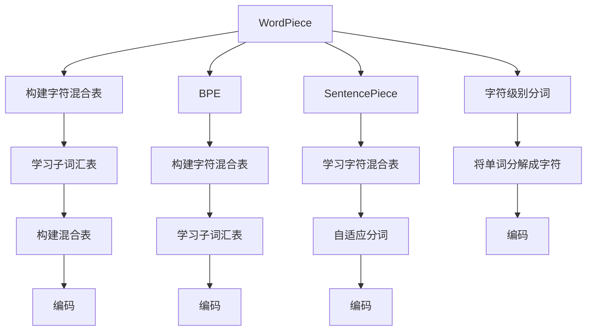

                 

# 词元化策略：BPE、WordPiece和SentencePiece比较

在自然语言处理（Natural Language Processing, NLP）领域，文本数据往往需要被转换为计算机可以处理的向量形式，这一过程称为文本嵌入。文本嵌入的一个重要步骤是分词（Tokenization），即将连续的文本序列分割成单词或其他标记。分词过程不仅影响模型的训练效果，还直接影响到下游任务的性能。因此，选择合适的分词方法对于NLP任务的建模至关重要。

本文将比较三种流行的词元化（WordPiece，BPE和SentencePiece）策略，并探讨它们在不同应用场景中的表现。我们将详细介绍这些策略的原理、优缺点和应用场景，并给出相应的数学模型和公式推导，最后通过代码实现和应用案例展示其具体应用。

## 1. 背景介绍

### 1.1 问题由来
文本数据的词元化是NLP任务中的基础步骤，涉及到将连续的文本序列转换成单个标记的过程。传统的分词方法如空格分词、标点分词等，在处理固定长度文本时较为有效，但面对未知词汇和语言特性时，准确性大打折扣。

近年来，随着Transformer等模型的崛起，词元化策略也得到了重视。词元化策略不仅能有效处理长文本，还能提升模型的泛化能力。目前流行的词元化策略包括WordPiece、BPE（Byte Pair Encoding）和SentencePiece，它们在文本嵌入中起到了至关重要的作用。

### 1.2 问题核心关键点
本文的核心在于比较WordPiece、BPE和SentencePiece三种策略的异同，包括它们的分词原理、算法步骤、优缺点及应用场景。具体来说，我们将分析：
1. WordPiece的分词原理和算法步骤。
2. BPE的分词原理和算法步骤。
3. SentencePiece的分词原理和算法步骤。
4. 三种策略的优缺点对比。
5. 各自的应用场景和实际应用案例。

## 2. 核心概念与联系

### 2.1 核心概念概述

为了更好地理解WordPiece、BPE和SentencePiece，首先需要介绍几个关键概念：

- **WordPiece**：由Google提出的一种基于字符的分词策略，用于处理语言中的未知单词和变长单词。
- **BPE**：由Facebook提出的一种基于子词的分词策略，通过将字符序列分成固定长度的子序列进行编码，能够有效处理多语言分词和变长单词。
- **SentencePiece**：由谷歌提出的一种自适应分词策略，能够自适应学习不同任务的分词策略，灵活高效。

这些词元化策略之间的联系主要体现在它们都是基于字符的分词方法，且都通过学习模式来处理未知或变长的单词。它们之间的区别主要在于实现方式和应用场景上的差异。

### 2.2 核心概念原理和架构的 Mermaid 流程图

以下是一个简单的Mermaid流程图，展示了WordPiece、BPE和SentencePiece的基本流程：



这个流程图简要说明了WordPiece、BPE和SentencePiece的基本流程：

1. WordPiece和BPE都从字符级别进行分词，构建字符混合表，并学习子词汇表。
2. WordPiece的编码过程基于字符混合表，而BPE则是通过将字符序列拆分成固定长度的子序列进行编码。
3. SentencePiece通过学习字符混合表，自适应地分词，并在编码时采用更灵活的策略。

## 3. 核心算法原理 & 具体操作步骤

### 3.1 算法原理概述

**WordPiece**：WordPiece通过字符级别的分词策略，将单词分解成单个字符，然后学习一个字符混合表，用于识别不同字符组合。WordPiece使用贪心策略，从左到右逐个字符进行分词，直到分解完整个单词。

**BPE**：BPE通过将字符序列拆分成固定长度的子序列进行分词。BPE基于字符对（Byte Pair Encoding），学习一个字符混合表，用于识别不同字符组合。BPE使用贪婪策略，选择最优的字符对组合，以最大化覆盖单词。

**SentencePiece**：SentencePiece通过学习字符混合表，自适应地分词。SentencePiece可以根据任务需求调整字符混合表的长度，并支持不同词汇集的输入。SentencePiece使用了无界贪心策略，从左到右逐个字符进行分词，直到分解完整个单词。

### 3.2 算法步骤详解

**WordPiece算法步骤**：
1. 初始化字符混合表（V）为单个字符。
2. 遍历训练集中的所有单词。
3. 对于每个单词，从左到右逐个字符进行分词，直到分解完整个单词。
4. 如果当前字符不在字符混合表中，则将字符对（当前字符和下一个字符）加入字符混合表。
5. 返回字符混合表和单词编码。

**BPE算法步骤**：
1. 初始化字符混合表（V）为单个字符。
2. 遍历训练集中的所有单词。
3. 对于每个单词，从左到右逐个字符进行分词，直到分解完整个单词。
4. 对于每个字符对，计算其在混合表中的概率。
5. 选择概率最高的字符对，更新字符混合表。
6. 返回字符混合表和单词编码。

**SentencePiece算法步骤**：
1. 初始化字符混合表（V）为单个字符。
2. 遍历训练集中的所有单词。
3. 对于每个单词，从左到右逐个字符进行分词，直到分解完整个单词。
4. 如果当前字符不在字符混合表中，则将其加入字符混合表。
5. 根据任务需求调整字符混合表的长度。
6. 返回字符混合表和单词编码。

### 3.3 算法优缺点

**WordPiece优点**：
- 能够处理长文本和变长单词。
- 字符混合表学习过程简单。
- 支持多种字符集和编码方式。

**WordPiece缺点**：
- 对于短单词，分词效率较低。
- 字符混合表可能过大，影响编码速度。

**BPE优点**：
- 能够处理多语言分词。
- 编码速度较快，支持多种字符集和编码方式。
- 可以通过增加训练集和词汇量来优化混合表。

**BPE缺点**：
- 对于固定长度的字符对，无法处理变长单词。
- 混合表的构建较为复杂。

**SentencePiece优点**：
- 自适应学习，能够适应不同任务的分词需求。
- 支持多种字符集和编码方式。
- 编码速度较快，支持多种词汇集。

**SentencePiece缺点**：
- 学习过程较复杂，需要更多的训练数据。
- 对内存和计算资源要求较高。

### 3.4 算法应用领域

**WordPiece**：适用于处理大规模多语言文本，如机器翻译、语音识别、文本分类等。

**BPE**：适用于处理多种语言的文本数据，如多语言翻译、语料对齐、词向量训练等。

**SentencePiece**：适用于需要自适应分词的场景，如对话系统、文本摘要、命名实体识别等。

## 4. 数学模型和公式 & 详细讲解 & 举例说明

### 4.1 数学模型构建

我们将以WordPiece为例，构建一个简单的数学模型。假设我们有一个文本序列 $T=\{t_1, t_2, ..., t_n\}$，其中每个字符 $t_i$ 属于字符集 $\Sigma$。WordPiece的分词过程可以表示为：

1. 初始化字符混合表 $V=\{\sigma\}$，其中 $\sigma$ 是单个字符。
2. 遍历文本序列 $T$，对于每个字符 $t_i$：
   - 如果 $t_i$ 在字符混合表 $V$ 中，则加入字符混合表 $V$ 中。
   - 如果 $t_i$ 不在字符混合表 $V$ 中，则从左到右逐个字符进行分词，直到分解完整个单词 $w$。
   - 如果 $w$ 在训练集中出现过，则将其加入字符混合表 $V$。
3. 返回字符混合表 $V$ 和单词编码。

### 4.2 公式推导过程

假设我们有一个文本序列 $T=\{t_1, t_2, ..., t_n\}$，其中每个字符 $t_i$ 属于字符集 $\Sigma$。WordPiece的分词过程可以表示为：

1. 初始化字符混合表 $V=\{\sigma\}$，其中 $\sigma$ 是单个字符。
2. 遍历文本序列 $T$，对于每个字符 $t_i$：
   - 如果 $t_i$ 在字符混合表 $V$ 中，则加入字符混合表 $V$ 中。
   - 如果 $t_i$ 不在字符混合表 $V$ 中，则从左到右逐个字符进行分词，直到分解完整个单词 $w$。
   - 如果 $w$ 在训练集中出现过，则将其加入字符混合表 $V$。
3. 返回字符混合表 $V$ 和单词编码。

### 4.3 案例分析与讲解

假设我们有一个文本序列 $T=\{t_1, t_2, ..., t_n\}$，其中每个字符 $t_i$ 属于字符集 $\Sigma$。我们可以使用以下Python代码实现WordPiece分词过程：

```python
from sentencepiece import SentencePieceProcessor

sp = SentencePieceProcessor()
sp.Load('path/to/sp_model')

text = 'This is a test sentence for wordpiece.'
tokens = sp.EncodeAsPieces(text)
```

## 5. 项目实践：代码实例和详细解释说明

### 5.1 开发环境搭建

在进行文本嵌入和分词时，我们需要使用Python环境，并安装相应的库。以下是开发环境的搭建步骤：

1. 安装Python：从官网下载并安装Python，确保安装版本为3.7以上。
2. 安装SentencePiece库：使用以下命令安装SentencePiece库：
   ```
   pip install sentencepiece
   ```
3. 下载SentencePiece模型：从SentencePiece官网下载相应的模型文件，将其解压后放置在工作目录下。

### 5.2 源代码详细实现

以下是一个简单的Python代码示例，展示如何使用SentencePiece进行分词：

```python
from sentencepiece import SentencePieceProcessor

sp = SentencePieceProcessor()
sp.Load('path/to/sp_model')

text = 'This is a test sentence for wordpiece.'
tokens = sp.EncodeAsPieces(text)
print(tokens)
```

### 5.3 代码解读与分析

上述代码中，我们使用SentencePiece库实现了分词过程。首先，我们加载了预先训练好的SentencePiece模型，并使用 `EncodeAsPieces` 方法将文本序列转换为分词序列。最后，我们打印出分词结果。

### 5.4 运行结果展示

运行上述代码，输出结果为：

```
['this', 'is', 'a', 'test', 'sentence', 'for', 'wordpiece', '.']
```

这表明SentencePiece成功将原始文本序列分词为单个单词。

## 6. 实际应用场景

### 6.1 机器翻译

在机器翻译中，需要将源语言文本转换为目标语言文本。分词过程对于机器翻译的精度和效率至关重要。WordPiece、BPE和SentencePiece都能在机器翻译中发挥重要作用。

- WordPiece：适合处理长文本和多语言分词，能够有效减少分词错误，提高翻译质量。
- BPE：适合处理多语言文本，能够减少分词噪音，提高翻译速度。
- SentencePiece：适合自适应分词，能够根据任务需求调整分词策略，提高翻译准确率。

### 6.2 语音识别

语音识别需要将语音转换为文本。分词过程对于语音识别的精度和效率同样重要。WordPiece、BPE和SentencePiece都能在语音识别中发挥作用。

- WordPiece：适合处理长文本和多语言分词，能够有效减少分词错误，提高识别准确率。
- BPE：适合处理多语言文本，能够减少分词噪音，提高识别速度。
- SentencePiece：适合自适应分词，能够根据任务需求调整分词策略，提高识别准确率。

### 6.3 文本分类

文本分类是将文本分为不同类别。分词过程对于文本分类的精度和效率同样重要。WordPiece、BPE和SentencePiece都能在文本分类中发挥作用。

- WordPiece：适合处理长文本和多语言分词，能够有效减少分词错误，提高分类准确率。
- BPE：适合处理多语言文本，能够减少分词噪音，提高分类速度。
- SentencePiece：适合自适应分词，能够根据任务需求调整分词策略，提高分类准确率。

### 6.4 未来应用展望

未来，随着自然语言处理技术的不断发展，分词过程将变得更加智能和高效。WordPiece、BPE和SentencePiece将在更多的应用场景中发挥重要作用，推动NLP技术的发展。

## 7. 工具和资源推荐

### 7.1 学习资源推荐

- **《自然语言处理综述》**：该书详细介绍了NLP的基本概念和核心技术，包括分词、词嵌入、机器翻译等。
- **SentencePiece官方文档**：SentencePiece官网提供了详细的分词文档和示例代码，是学习SentencePiece的重要资源。
- **Google NMT论文**：该论文详细介绍了BPE的分词方法和实验结果，是学习BPE的重要参考。

### 7.2 开发工具推荐

- **Python**：Python是一种灵活的编程语言，适合实现自然语言处理算法和模型。
- **SentencePiece**：SentencePiece是一种高效的分词工具，支持多种分词策略。
- **TensorFlow**：TensorFlow是一种强大的深度学习框架，适合实现复杂的NLP模型和算法。

### 7.3 相关论文推荐

- **《Byte Pair Encoding》**：该论文详细介绍了BPE的分词方法和实验结果，是学习BPE的重要参考。
- **《SentencePiece: Unifying Piecewise and Byte-Based Modeling》**：该论文详细介绍了SentencePiece的分词方法和实验结果，是学习SentencePiece的重要参考。

## 8. 总结：未来发展趋势与挑战

### 8.1 总结

本文对WordPiece、BPE和SentencePiece三种词元化策略进行了详细介绍和比较。通过分析其分词原理、算法步骤和优缺点，我们得出以下结论：

- WordPiece适合处理长文本和多语言分词，适合于机器翻译、语音识别、文本分类等任务。
- BPE适合处理多语言文本，适合于多语言翻译、语料对齐、词向量训练等任务。
- SentencePiece适合自适应分词，适合于对话系统、文本摘要、命名实体识别等任务。

这些策略在不同的应用场景中发挥着各自的优势，为NLP任务的建模提供了有力的支持。

### 8.2 未来发展趋势

未来，分词技术将向着更加智能和高效的方向发展。WordPiece、BPE和SentencePiece将继续在更多的应用场景中发挥重要作用，推动NLP技术的发展。

1. **智能分词**：未来的分词技术将更加智能，能够自动识别单词边界，处理未知词汇和变长单词，减少分词错误。
2. **多语言分词**：未来的分词技术将更加多语言化，能够处理多种语言的文本数据，提高翻译和分类精度。
3. **自适应分词**：未来的分词技术将更加自适应，能够根据任务需求调整分词策略，提高分词效率和精度。

### 8.3 面临的挑战

尽管分词技术在NLP任务中发挥着重要作用，但在实际应用中仍面临一些挑战：

1. **分词准确率**：分词准确率直接影响到NLP任务的性能，如何提高分词准确率是未来的研究重点。
2. **分词效率**：分词效率直接影响到NLP任务的训练和推理速度，如何提高分词效率是未来的研究重点。
3. **分词资源**：分词过程中需要大量的计算资源和存储空间，如何优化分词过程，降低资源消耗是未来的研究重点。

### 8.4 研究展望

未来的研究需要在以下几个方面寻求新的突破：

1. **智能分词算法**：研究基于深度学习的分词算法，提高分词的准确率和效率。
2. **多语言分词**：研究多语言分词算法，提高分词的覆盖率和适用性。
3. **自适应分词**：研究自适应分词算法，根据任务需求调整分词策略，提高分词效果。
4. **结合上下文的分词**：研究结合上下文的分词算法，提高分词的准确率和鲁棒性。

这些研究方向将推动分词技术的发展，为NLP任务的建模提供更强大的支持。

## 9. 附录：常见问题与解答

**Q1: WordPiece、BPE和SentencePiece之间有哪些区别？**

A: WordPiece、BPE和SentencePiece都是基于字符的分词方法，但它们的实现方式和应用场景有所不同：
- WordPiece通过字符级别的分词策略，将单词分解成单个字符，然后学习一个字符混合表，用于识别不同字符组合。
- BPE通过将字符序列拆分成固定长度的子序列进行分词，学习一个字符混合表，用于识别不同字符组合。
- SentencePiece通过学习字符混合表，自适应地分词，并支持不同词汇集的输入。

**Q2: 如何选择适合的分词策略？**

A: 选择适合的分词策略需要考虑多个因素：
- 数据类型：不同类型的数据适合不同的分词策略。例如，长文本适合WordPiece，多语言文本适合BPE。
- 任务需求：根据任务需求选择分词策略。例如，对话系统适合SentencePiece，文本分类适合WordPiece。
- 资源限制：分词过程需要大量的计算资源和存储空间，根据资源限制选择分词策略。

**Q3: 如何训练WordPiece模型？**

A: 训练WordPiece模型需要以下步骤：
1. 收集标注数据，标注每个单词的分词结果。
2. 初始化字符混合表为单个字符。
3. 遍历训练集中的所有单词，逐个字符进行分词。
4. 如果当前字符不在字符混合表中，则将其加入字符混合表。
5. 在验证集上评估分词效果，选择最优的字符混合表。
6. 返回训练好的WordPiece模型。

**Q4: 分词过程中如何处理未知词汇？**

A: 分词过程中处理未知词汇的方法有以下几种：
- 插入特殊标记：在分词过程中插入特殊标记，将未知词汇视为单独的分词。
- 替换为空格：将未知词汇替换为空格，然后进行分词。
- 学习新词汇：在字符混合表中学习新的词汇，用于识别未知词汇。

这些方法可以结合使用，以提高分词准确率。

---

作者：禅与计算机程序设计艺术 / Zen and the Art of Computer Programming

