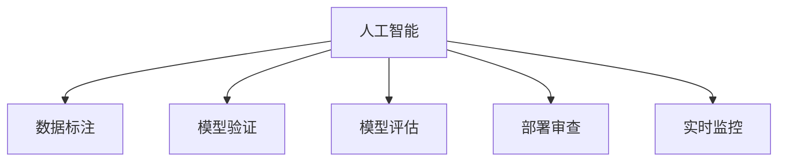

                 

# 质量保证：人工智能结果的严格审查

> 关键词：人工智能,结果审查,算法验证,数据标注,机器学习,深度学习,模型评估

## 1. 背景介绍

### 1.1 问题由来

随着人工智能技术（AI）在各个领域的应用日益广泛，从自动驾驶到智能推荐，从医疗诊断到金融风控，AI系统已经深入到人们的日常生活和工作之中。然而，AI系统的正确性和可靠性往往备受质疑，尤其是当其被应用于高风险场景时，任何轻微的错误都可能导致严重后果。因此，如何保证AI系统的质量，确保其输出结果的准确性和可信度，成为了一个亟待解决的问题。

### 1.2 问题核心关键点

为确保AI系统的质量，需要在开发和部署过程中进行严格的质量保证（Quality Assurance, QA）。这包括但不限于：数据标注的质量控制、算法模型的验证和评估、部署环境的审查以及运行时的实时监控等。具体来说，高质量的AI系统需要在以下几个方面进行严格的审查和验证：

- **数据标注**：保证训练数据的质量和多样性，避免模型偏向于特定的数据分布或历史偏见。
- **算法验证**：确保模型能够在不同数据集上表现稳定，避免过拟合和欠拟合等问题。
- **模型评估**：通过多种评估指标和测试方法，全面评价模型的性能和鲁棒性。
- **部署审查**：检查AI系统的部署环境，确保其在实际应用中的性能和稳定性。
- **实时监控**：对AI系统在实际使用中的表现进行实时监控和分析，及时发现和纠正问题。

## 2. 核心概念与联系

### 2.1 核心概念概述

为了更好地理解AI结果的严格审查，我们需要先了解几个关键的概念：

- **人工智能（AI）**：一种利用计算机系统进行智能决策的技术，涵盖机器学习、深度学习、自然语言处理等多个领域。
- **数据标注**：为训练AI模型准备标注数据的过程，通常包括文本分类、图像标注、语音识别等。
- **模型验证**：通过验证数据集上的性能指标，确保模型的泛化能力。
- **模型评估**：使用独立的测试数据集，对模型的性能进行全面评估。
- **部署审查**：检查AI系统在实际部署环境中的表现和稳定性。
- **实时监控**：对AI系统在实际运行中的表现进行实时监控和分析。

这些概念之间的逻辑关系可以通过以下Mermaid流程图来展示：



这个流程图展示了AI系统的开发和部署过程中，各个环节之间的逻辑联系。

## 3. 核心算法原理 & 具体操作步骤

### 3.1 算法原理概述

AI结果的严格审查是一个多阶段、多维度的工作，涉及从数据预处理到模型训练、评估和部署的各个环节。其核心算法原理包括但不限于：

- **数据清洗**：去除数据中的噪声和不一致性，提高数据质量。
- **模型训练**：通过监督学习、无监督学习或强化学习等方法，训练AI模型。
- **模型验证**：使用交叉验证、留出法等技术，验证模型在不同数据集上的性能。
- **模型评估**：使用混淆矩阵、ROC曲线、F1分数等指标，评估模型在测试集上的表现。
- **部署审查**：检查AI系统在实际部署环境中的性能和稳定性，确保其能够适应不同的硬件和软件环境。
- **实时监控**：使用日志分析和异常检测技术，实时监控AI系统的表现，及时发现和纠正问题。

### 3.2 算法步骤详解

基于上述原理，AI结果的严格审查可以分解为以下几个关键步骤：

1. **数据准备**：收集和清洗数据，确保数据质量和多样性。
2. **模型训练**：选择合适的算法和模型结构，使用训练集进行模型训练。
3. **模型验证**：使用验证集对模型进行验证，确保模型泛化能力。
4. **模型评估**：使用测试集对模型进行全面评估，生成评估报告。
5. **部署审查**：将模型部署到实际环境，进行性能和稳定性测试。
6. **实时监控**：部署后，实时监控AI系统的表现，及时发现和纠正问题。

### 3.3 算法优缺点

AI结果的严格审查具有以下优点：

- **确保质量**：通过多个阶段和多个维度的审查，确保AI系统的质量。
- **提升性能**：通过不断迭代优化，提高AI系统的性能和稳定性。
- **预防风险**：通过实时监控和异常检测，预防和解决潜在问题。

同时，该方法也存在以下局限性：

- **成本高**：审查和验证需要大量时间和资源，尤其是在大规模项目中。
- **复杂性高**：涉及多个环节和技术，需要跨学科的团队协作。
- **依赖人工**：部分审查环节需要人工介入，如数据标注和模型评估。

### 3.4 算法应用领域

AI结果的严格审查不仅适用于AI系统的开发和部署，还广泛应用于多个领域，例如：

- **医疗诊断**：通过严格的数据标注和模型验证，确保医疗AI系统的诊断准确性。
- **金融风控**：通过模型评估和部署审查，确保金融AI系统的风险控制能力。
- **自动驾驶**：通过实时监控和异常检测，确保自动驾驶系统的安全性。
- **智能推荐**：通过数据清洗和模型训练，确保智能推荐系统的个性化和多样性。

这些领域的应用展示了AI结果严格审查的广泛性和重要性。

## 4. 数学模型和公式 & 详细讲解 & 举例说明

### 4.1 数学模型构建

为了对AI结果进行严格审查，需要构建多个数学模型，包括数据清洗模型、模型训练模型、模型验证模型和模型评估模型。

- **数据清洗模型**：用于去除数据中的噪声和不一致性，保证数据质量。
- **模型训练模型**：用于训练AI模型，优化模型参数。
- **模型验证模型**：用于验证模型的泛化能力，避免过拟合和欠拟合。
- **模型评估模型**：用于全面评估模型的性能和鲁棒性。

### 4.2 公式推导过程

以下以模型训练和模型评估为例，进行数学公式的推导：

#### 模型训练公式

假设我们有训练数据集 $D=\{(x_i, y_i)\}_{i=1}^N$，其中 $x_i$ 为输入，$y_i$ 为标签。使用交叉熵损失函数 $L$ 进行模型训练，目标是最小化损失函数：

$$
L(\theta) = -\frac{1}{N}\sum_{i=1}^N \log p(y_i|x_i)
$$

其中 $p(y_i|x_i)$ 为模型在输入 $x_i$ 下预测标签 $y_i$ 的概率分布。

模型参数 $\theta$ 的更新公式为：

$$
\theta \leftarrow \theta - \eta \nabla_{\theta}L(\theta)
$$

其中 $\eta$ 为学习率，$\nabla_{\theta}L(\theta)$ 为损失函数对模型参数的梯度。

#### 模型评估公式

假设我们有一组测试数据集 $D_t=\{(x_i, y_i)\}_{i=1}^M$，其中 $x_i$ 为输入，$y_i$ 为标签。使用混淆矩阵 $C$ 进行模型评估，计算各种评估指标：

- **准确率**：$P=\frac{TP+TN}{TP+TN+FP+FN}$，其中 $TP$ 为真正例，$TN$ 为真反例，$FP$ 为假正例，$FN$ 为假反例。
- **召回率**：$R=\frac{TP}{TP+FN}$，其中 $TP$ 为真正例，$FN$ 为假反例。
- **F1分数**：$F_1=2\frac{P*R}{P+R}$。

### 4.3 案例分析与讲解

以一个简单的二分类模型为例，展示模型训练和评估的过程：

1. **数据准备**：收集和清洗数据，得到训练集 $D$ 和测试集 $D_t$。
2. **模型训练**：使用交叉熵损失函数进行模型训练，得到模型参数 $\theta$。
3. **模型验证**：使用验证集对模型进行验证，调整模型参数。
4. **模型评估**：使用测试集对模型进行评估，计算准确率、召回率和 F1 分数。
5. **生成评估报告**：根据评估结果，生成详细的评估报告，指出模型优点和改进建议。

## 5. 项目实践：代码实例和详细解释说明

### 5.1 开发环境搭建

在开发和部署AI系统时，需要一个合适的开发环境。以下是一些常用的开发环境搭建方法：

1. **Python环境搭建**：使用Anaconda或Miniconda创建Python虚拟环境，安装必要的库和依赖。
2. **GPU环境搭建**：配置好GPU和相关驱动，安装CUDA和cuDNN等库，进行深度学习训练。
3. **部署环境搭建**：使用Docker容器或Kubernetes等容器化技术，将AI系统部署到生产环境中。
4. **监控环境搭建**：使用Prometheus、Grafana等工具，实现对AI系统的实时监控和告警。

### 5.2 源代码详细实现

以下是一个简单的模型训练和评估的代码实现：

```python
import torch
import torch.nn as nn
import torch.optim as optim
from sklearn.metrics import accuracy_score, precision_score, recall_score, f1_score

# 定义模型结构
class Net(nn.Module):
    def __init__(self):
        super(Net, self).__init__()
        self.fc1 = nn.Linear(784, 256)
        self.fc2 = nn.Linear(256, 10)

    def forward(self, x):
        x = torch.relu(self.fc1(x))
        x = torch.softmax(self.fc2(x), dim=1)
        return x

# 加载数据集
train_data = ...
test_data = ...

# 定义损失函数和优化器
criterion = nn.CrossEntropyLoss()
optimizer = optim.Adam(model.parameters(), lr=0.001)

# 训练模型
for epoch in range(10):
    running_loss = 0.0
    for i, data in enumerate(train_loader, 0):
        inputs, labels = data
        optimizer.zero_grad()
        outputs = model(inputs)
        loss = criterion(outputs, labels)
        loss.backward()
        optimizer.step()
        running_loss += loss.item()
    print('Epoch: {}, Loss: {}'.format(epoch+1, running_loss/len(train_loader)))

# 评估模型
y_pred = []
y_true = []
for data in test_loader:
    inputs, labels = data
    outputs = model(inputs)
    y_pred.append(outputs.argmax(dim=1))
    y_true.append(labels)
accuracy = accuracy_score(y_true, y_pred)
precision = precision_score(y_true, y_pred, average='weighted')
recall = recall_score(y_true, y_pred, average='weighted')
f1 = f1_score(y_true, y_pred, average='weighted')
print('Accuracy: {}, Precision: {}, Recall: {}, F1 Score: {}'.format(accuracy, precision, recall, f1))
```

### 5.3 代码解读与分析

**代码解读**：

1. **模型定义**：定义了一个简单的神经网络模型，包含两个全连接层。
2. **数据加载**：使用PyTorch的数据加载器，加载训练集和测试集。
3. **损失函数和优化器**：定义了交叉熵损失函数和Adam优化器。
4. **模型训练**：使用训练集进行模型训练，计算损失函数并更新模型参数。
5. **模型评估**：使用测试集进行模型评估，计算各种评估指标。

**代码分析**：

1. **模型结构**：一个简单的两层神经网络，适合处理图像分类问题。
2. **损失函数**：使用交叉熵损失函数，适用于多分类问题。
3. **优化器**：使用Adam优化器，适合训练深度学习模型。
4. **评估指标**：使用准确率、精确率、召回率和F1分数，全面评估模型性能。

## 6. 实际应用场景

### 6.1 智能推荐系统

在智能推荐系统中，对AI结果的严格审查非常重要。推荐系统需要保证对用户行为的准确理解和个性化推荐，避免推荐内容质量低下或与用户兴趣不符。

具体来说，可以通过以下方式进行严格审查：

1. **数据质量检查**：确保用户行为数据的完整性和准确性，去除噪音数据。
2. **模型训练验证**：使用交叉验证等技术，确保模型的泛化能力。
3. **模型评估**：通过A/B测试等方法，评估推荐系统的实际效果。
4. **部署审查**：在生产环境中，实时监控推荐系统的性能和稳定性。
5. **用户反馈收集**：收集用户反馈，及时调整和优化推荐算法。

### 6.2 医疗诊断系统

在医疗诊断系统中，对AI结果的严格审查尤其重要，因为任何错误都可能对患者生命造成严重威胁。

具体来说，可以通过以下方式进行严格审查：

1. **数据标注质量检查**：确保医学影像和病历数据的准确性和一致性。
2. **模型训练验证**：使用独立的数据集验证模型的准确性和稳定性。
3. **模型评估**：使用交叉验证等技术，评估模型的泛化能力。
4. **部署审查**：在医疗环境中，实时监控诊断系统的性能和稳定性。
5. **专家评审**：邀请医学专家评审模型的诊断结果，确保诊断准确性。

### 6.3 金融风控系统

在金融风控系统中，对AI结果的严格审查同样重要，因为错误的风险评估可能导致严重的财务损失。

具体来说，可以通过以下方式进行严格审查：

1. **数据质量检查**：确保金融数据的完整性和准确性，去除噪音数据。
2. **模型训练验证**：使用交叉验证等技术，确保模型的泛化能力。
3. **模型评估**：使用独立的测试集评估模型的准确性和稳定性。
4. **部署审查**：在金融环境中，实时监控风控系统的性能和稳定性。
5. **风险控制**：设置风险控制阈值，及时发现和纠正潜在的风险。

## 7. 工具和资源推荐

### 7.1 学习资源推荐

为了帮助开发者系统掌握AI结果的严格审查技术，这里推荐一些优质的学习资源：

1. **机器学习课程**：如Coursera上的《机器学习》课程，涵盖了数据清洗、模型训练、模型验证等关键技术。
2. **深度学习课程**：如斯坦福大学的《深度学习》课程，深入介绍了深度学习的基本原理和算法。
3. **数据科学工具**：如Python的Pandas、NumPy、Scikit-learn等，方便数据处理和模型训练。
4. **模型评估工具**：如TensorBoard、Weights & Biases等，方便实时监控和评估模型性能。

通过对这些资源的学习实践，相信你一定能够快速掌握AI结果严格审查的精髓，并用于解决实际的AI问题。

### 7.2 开发工具推荐

高效的开发离不开优秀的工具支持。以下是几款用于AI结果严格审查的常用工具：

1. **Python环境搭建**：使用Anaconda或Miniconda创建Python虚拟环境，安装必要的库和依赖。
2. **GPU环境搭建**：配置好GPU和相关驱动，安装CUDA和cuDNN等库，进行深度学习训练。
3. **模型训练工具**：使用TensorFlow、PyTorch等深度学习框架，方便训练AI模型。
4. **模型评估工具**：使用Scikit-learn、TensorBoard等工具，方便评估模型性能和实时监控。
5. **数据处理工具**：使用Pandas、NumPy等工具，方便数据清洗和预处理。

合理利用这些工具，可以显著提升AI结果严格审查的开发效率，加快创新迭代的步伐。

### 7.3 相关论文推荐

AI结果的严格审查技术在学术界和工业界得到了广泛研究。以下是几篇奠基性的相关论文，推荐阅读：

1. **《Data Cleaning in Data Mining》**：介绍了数据清洗的基本方法和技术，适用于各种数据类型。
2. **《Model Validation and Diagnostics》**：介绍了模型验证的基本方法和技术，适用于各种机器学习模型。
3. **《Model Evaluation and Selection》**：介绍了模型评估的基本方法和技术，适用于各种评估指标。
4. **《Real-Time Monitoring and Fault Detection》**：介绍了实时监控和故障检测的基本方法和技术，适用于各种生产环境。

这些论文代表了大规模AI结果严格审查技术的发展脉络。通过学习这些前沿成果，可以帮助研究者把握学科前进方向，激发更多的创新灵感。

## 8. 总结：未来发展趋势与挑战

### 8.1 研究成果总结

AI结果的严格审查技术已经取得了显著进展，应用于多个领域，如智能推荐、医疗诊断、金融风控等。其主要成果包括：

- **数据质量控制**：确保数据的完整性和准确性，去除噪音数据。
- **模型训练验证**：通过交叉验证等技术，确保模型的泛化能力。
- **模型评估方法**：使用各种评估指标，全面评估模型性能和鲁棒性。
- **实时监控技术**：使用日志分析和异常检测技术，实时监控AI系统的表现，及时发现和纠正问题。

### 8.2 未来发展趋势

展望未来，AI结果的严格审查技术将呈现以下几个发展趋势：

1. **自动化和智能化**：引入自动化和智能化技术，减少人工介入，提高审查效率。
2. **跨领域应用**：将严格审查技术应用于更多领域，如教育、农业、能源等，推动AI技术的普及和应用。
3. **实时性和低延迟**：通过优化模型结构和算法，实现实时性和低延迟的严格审查。
4. **多模态融合**：将视觉、语音、文本等多模态数据融合，提升AI系统的全面性和准确性。
5. **安全和隐私保护**：引入安全性和隐私保护技术，确保AI系统的安全性和合规性。

### 8.3 面临的挑战

尽管AI结果的严格审查技术已经取得了显著进展，但在实际应用中仍面临诸多挑战：

1. **数据隐私**：在数据清洗和标注过程中，如何保护用户隐私，避免数据泄露。
2. **模型复杂性**：复杂的模型结构增加了审查的难度，需要更多的时间和资源。
3. **技术壁垒**：严格的审查技术需要跨学科的团队协作，需要更多的技术支持和资源投入。
4. **实时监控的复杂性**：实时监控需要处理大量的日志和数据，增加了系统的复杂性。
5. **安全和风险管理**：在实际应用中，如何应对安全风险和潜在问题，需要更多的技术和制度支持。

### 8.4 研究展望

未来的研究需要在以下几个方面寻求新的突破：

1. **自动化技术**：引入自动化和智能化技术，减少人工介入，提高审查效率。
2. **跨模态融合**：将视觉、语音、文本等多模态数据融合，提升AI系统的全面性和准确性。
3. **模型简化**：通过简化模型结构和算法，提高审查的实时性和低延迟性。
4. **安全和隐私保护**：引入安全性和隐私保护技术，确保AI系统的安全性和合规性。
5. **实时监控技术**：引入更高效的实时监控技术，确保AI系统的稳定性和可靠性。

## 9. 附录：常见问题与解答

**Q1: 如何确保数据质量？**

A: 确保数据质量的方法包括但不限于：

1. **数据清洗**：去除数据中的噪声和不一致性，保证数据质量。
2. **数据标注**：确保标注数据的准确性和一致性，去除错误标注数据。
3. **数据增强**：通过数据增强技术，丰富数据集的多样性，提高模型泛化能力。

**Q2: 如何进行模型训练验证？**

A: 模型训练验证的方法包括但不限于：

1. **交叉验证**：使用交叉验证技术，验证模型在不同数据集上的泛化能力。
2. **留出法**：使用留出法技术，保留一部分数据作为验证集，验证模型的性能。
3. **正则化**：使用正则化技术，避免过拟合和欠拟合问题。

**Q3: 如何进行模型评估？**

A: 模型评估的方法包括但不限于：

1. **混淆矩阵**：使用混淆矩阵，评估模型的准确率、精确率、召回率和F1分数。
2. **ROC曲线**：使用ROC曲线，评估模型的灵敏度、特异度和精确度。
3. **评估指标**：使用各种评估指标，全面评估模型的性能和鲁棒性。

**Q4: 如何进行部署审查？**

A: 部署审查的方法包括但不限于：

1. **性能测试**：在生产环境中，进行性能测试，确保AI系统的稳定性和性能。
2. **稳定性测试**：在生产环境中，进行稳定性测试，确保AI系统能够处理各种异常情况。
3. **日志分析**：使用日志分析技术，实时监控AI系统的表现，及时发现和纠正问题。

**Q5: 如何进行实时监控？**

A: 实时监控的方法包括但不限于：

1. **日志分析**：使用日志分析技术，实时监控AI系统的表现，及时发现和纠正问题。
2. **异常检测**：使用异常检测技术，及时发现和纠正异常情况。
3. **告警系统**：设置告警阈值，及时发现和解决潜在问题。

---

作者：禅与计算机程序设计艺术 / Zen and the Art of Computer Programming

