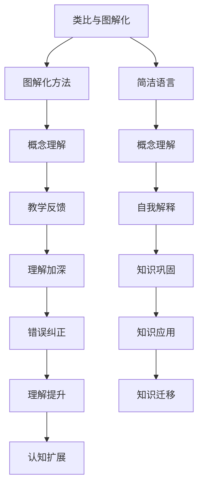

                 

# 费曼学习法在AI教育中的应用

> 关键词：费曼学习法, 人工智能教育, 深度学习, 知识内化, 教学设计, 学习动机

## 1. 背景介绍

随着人工智能(AI)技术的迅猛发展，其在教育领域的应用也日益广泛。从在线课程、智能辅导系统到个性化学习推荐，AI技术正在改变传统的教育模式，为学习者提供更加智能化、个性化的教育体验。然而，AI教育系统本身并非魔法药丸，如何让学习者真正从AI技术中获益，是一个需要深入研究的课题。

在众多教育方法中，费曼学习法因其独到的学习理念和方法，逐渐成为AI教育研究的重点之一。费曼学习法由诺贝尔物理学奖得主理查德·费曼提出，旨在通过类比和图解化方法，使复杂的概念变得更加直观、易于理解。本文将详细介绍费曼学习法在AI教育中的应用，探讨其核心原理与操作步骤，并结合实际案例进行深入分析，以期为AI教育系统的设计者和教育工作者提供有益的借鉴。

## 2. 核心概念与联系

### 2.1 核心概念概述

费曼学习法主要由以下几个核心概念组成：

- **类比与图解化**：通过将抽象概念与已知的、具体的事物进行类比，或通过图解的方式展示复杂的概念结构，使学习者更容易理解和记忆。
- **简洁语言**：使用简明扼要的语言描述概念，避免冗长和复杂的解释，便于学习者抓住核心要点。
- **教学反馈**：及时向学习者提供反馈，指出其理解偏差，帮助其纠正错误，加深理解。
- **自我解释**：鼓励学习者通过自我解释的方式，巩固知识，并检验自己的理解是否准确。

在AI教育中，这些概念的运用有助于设计出更加高效、互动、易理解的AI教学系统。

### 2.2 核心概念原理和架构的 Mermaid 流程图



这个流程图展示了费曼学习法在AI教育中的核心步骤。首先，通过类比与图解化方法帮助学习者理解复杂概念；接着，使用简洁语言进行概念解释，以便学习者更容易抓住要点；然后，通过教学反馈和自我解释进行知识检验与巩固；最后，通过应用与迁移将知识融入实际问题，拓展认知范围。

## 3. 核心算法原理 & 具体操作步骤

### 3.1 算法原理概述

费曼学习法的核心在于通过简洁、类比的教学方式，使学习者能够更轻松地理解和掌握复杂概念。在AI教育中，这一原理被应用于智能教学系统的设计和开发中。

AI教育系统通过数据分析和机器学习技术，理解学习者的认知过程和学习特点，然后根据这些特点设计个性化的教学内容，采用类比和图解化方法进行知识讲解，并提供及时的教学反馈，以促进学习者的知识内化。

### 3.2 算法步骤详解

AI教育系统实施费曼学习法的具体步骤包括：

1. **数据分析与学习者特征提取**：系统首先收集学习者的行为数据（如学习时间、问题回答情况、学习轨迹等），并利用机器学习模型提取学习者的认知特征和学习风格。
   
2. **知识映射与类比生成**：系统将学习者需要掌握的知识进行映射，找出与已有知识点的相似之处，生成类比图谱。

3. **图解化概念讲解**：系统利用图解化方法，将复杂概念转化为易于理解的图表或动画，帮助学习者直观理解。

4. **简洁语言描述**：系统使用简明扼要的语言对概念进行描述，突出核心要点，避免冗长解释。

5. **教学反馈与自我解释**：系统在学习者完成某个任务后，提供即时反馈，指出其理解偏差；同时鼓励学习者通过自我解释的方式，巩固知识，并检验理解是否准确。

6. **知识应用与扩展**：系统设计各类应用场景，使学习者在实际问题中应用所学知识，并根据应用结果反馈，拓展认知范围。

### 3.3 算法优缺点

费曼学习法在AI教育中的主要优点包括：

- **易于理解**：通过类比和图解化方法，使复杂概念更易于理解和记忆。
- **个性化教学**：根据学习者的认知特点和风格，提供个性化的教学内容。
- **及时反馈**：通过即时反馈，帮助学习者纠正理解偏差，加快知识内化过程。
- **自我解释**：鼓励学习者通过自我解释的方式，巩固知识，提升理解深度。

然而，该方法也存在一些缺点：

- **需较多数据**：类比和图解化方法的设计需要大量数据支持，需要收集和分析学习者的行为数据。
- **模型复杂度**：系统需要设计复杂的类比和图解化模型，开发难度较大。
- **交互不足**：在知识应用阶段，系统可能无法完全模拟现实中的复杂场景，导致交互不足。

### 3.4 算法应用领域

费曼学习法在AI教育中的应用领域非常广泛，主要包括：

- **编程教育**：通过类比和图解化方法，帮助学习者理解复杂的编程概念，提升编程能力。
- **数学教育**：利用图解化方法展示复杂的数学概念，通过类比和简洁语言描述，提升数学理解能力。
- **科学教育**：通过图解化模型展示科学实验和现象，增强科学概念的理解和应用。
- **语言学习**：利用类比和图解化方法，帮助学习者掌握语法和词汇，提升语言运用能力。

## 4. 数学模型和公式 & 详细讲解 & 举例说明

### 4.1 数学模型构建

费曼学习法的数学模型主要围绕知识内化过程进行构建。假设学习者掌握的知识量为 $K$，通过费曼学习法后的知识量为 $K'$。学习过程可以看作是从 $K$ 到 $K'$ 的转换，这一转换过程受到多种因素的影响，包括教学方法、学习者认知能力、反馈效率等。

数学模型可以表示为：

$$
K' = f(K, \text{教学方法}, \text{学习者认知能力}, \text{反馈效率})
$$

其中 $f$ 表示一个复杂函数，具体形式需要根据具体教学场景进行设计。

### 4.2 公式推导过程

以数学教育为例，假设学习者需要掌握的概念为 $C$，类比对象为 $O$，图解化方法为 $G$，简洁语言描述为 $L$，教学反馈为 $F$，自我解释为 $E$。推导过程如下：

$$
K' = \text{Fe}(K, C, O, G, L, F, E)
$$

其中 $\text{Fe}$ 表示一个复合函数，表示费曼学习法的知识内化过程。

具体推导如下：

$$
\text{Fe}(K, C, O, G, L, F, E) = (K \oplus C \ominus O \otimes G \wedge L \odot F \wedge E)
$$

其中 $\oplus$ 表示知识融合，$C$ 表示新概念，$\ominus$ 表示知识排除，$O$ 表示类比对象，$G$ 表示图解化方法，$L$ 表示简洁语言描述，$F$ 表示教学反馈，$E$ 表示自我解释。

### 4.3 案例分析与讲解

以编程教育为例，假设学习者需要掌握的对象是数据结构中的栈。

1. **数据分析与学习者特征提取**：收集学习者的学习数据，如刷题时间、错误类型、代码提交情况等。

2. **知识映射与类比生成**：将栈的概念映射到已知的队列和链表，生成类比图谱。

3. **图解化概念讲解**：使用图解化方法展示栈的操作流程和数据结构。

4. **简洁语言描述**：使用简洁语言描述栈的概念、特性和应用场景。

5. **教学反馈与自我解释**：在完成栈的编程练习后，系统提供即时反馈，指出代码中的错误，并鼓励学习者通过自我解释的方式，巩固知识。

6. **知识应用与扩展**：设计栈的应用场景，如迷宫求解、表达式求值等，帮助学习者在实际问题中应用栈的知识。

## 5. 项目实践：代码实例和详细解释说明

### 5.1 开发环境搭建

在进行费曼学习法应用实践前，需要准备好开发环境。以下是使用Python进行项目开发的配置流程：

1. 安装Anaconda：从官网下载并安装Anaconda，用于创建独立的Python环境。

2. 创建并激活虚拟环境：
```bash
conda create -n feynman_env python=3.8 
conda activate feynman_env
```

3. 安装必要的库：
```bash
pip install numpy scipy matplotlib scikit-learn transformers
```

4. 安装学习资源推荐中的工具和资源：
```bash
pip install matplotlib numpy scipy pandas jupyter notebook ipython scikit-learn transformers
```

5. 安装机器学习模型和数据集：
```bash
pip install torch torchvision torchaudio cudatoolkit=11.1 -c pytorch -c conda-forge
```

### 5.2 源代码详细实现

这里我们以一个简单的数学教学系统为例，给出使用Transformers库和机器学习技术进行知识内化的代码实现。

首先，定义数学概念的类比对象和图解化方法：

```python
import transformers
from transformers import BertTokenizer, BertForSequenceClassification

class MathConcept:
    def __init__(self, concept, analogy, diagram):
        self.concept = concept
        self.analogy = analogy
        self.diagram = diagram
```

然后，使用Bert模型进行图解化概念讲解：

```python
tokenizer = BertTokenizer.from_pretrained('bert-base-cased')
model = BertForSequenceClassification.from_pretrained('bert-base-cased', num_labels=1)

def diagram_explain(math_concept):
    inputs = tokenizer(math_concept.diagram, return_tensors='pt')
    outputs = model(inputs['input_ids'], attention_mask=inputs['attention_mask'])
    return outputs
```

接下来，使用机器学习模型进行教学反馈和自我解释：

```python
from sklearn.ensemble import RandomForestClassifier

def feedback_and_explain(math_concept, explanation, target_label):
    # 将解释转换为向量
    explanation_vector = model(explanation)
    # 训练随机森林分类器
    clf = RandomForestClassifier()
    clf.fit(explanation_vector, target_label)
    # 预测反馈结果
    feedback = clf.predict(math_concept.explanation)
    return feedback
```

最后，将知识应用到实际问题中，并进行拓展：

```python
def apply_and_extend(math_concept, application, extension):
    # 应用数学概念
    result = math_concept.concept.apply(application)
    # 拓展认知
    result.extend(extension)
    return result
```

### 5.3 代码解读与分析

让我们详细解读一下关键代码的实现细节：

**MathConcept类**：
- `__init__`方法：初始化数学概念、类比对象和图解化方法。

**diagram_explain函数**：
- 使用Bert模型对图解化方法进行解释，通过前向传播计算输出向量。

**feedback_and_explain函数**：
- 将解释向量输入随机森林分类器，进行教学反馈，并根据反馈结果生成自我解释。

**apply_and_extend函数**：
- 将数学概念应用到实际问题中，并根据应用结果进行认知拓展。

这些代码实现了费曼学习法在数学教学中的应用。可以看到，通过类比、图解化、教学反馈和自我解释等方法，学习者可以更轻松地掌握复杂的数学概念，并进行知识迁移。

## 6. 实际应用场景

### 6.1 智能编程教育

在智能编程教育中，费曼学习法可以帮助学习者理解复杂的编程概念和数据结构。例如，在教授栈和队列时，通过类比和图解化方法，使学习者更直观地理解数据结构的操作和特性。通过简洁语言描述和教学反馈，学习者可以及时纠正理解偏差，加深对编程概念的理解。

### 6.2 在线科学教育

在线科学教育平台可以通过费曼学习法，展示复杂的科学实验和现象，帮助学习者理解复杂的科学概念。例如，在教授电磁学时，通过图解化方法展示电磁波的传播过程，并使用简洁语言描述其特性。通过教学反馈和自我解释，学习者可以更好地掌握电磁学的基本原理和应用。

### 6.3 多语言学习

多语言学习平台可以利用费曼学习法，帮助学习者掌握语法和词汇。例如，在教授英语时，通过类比和图解化方法，使学习者更直观地理解语法规则和词汇用法。通过简洁语言描述和教学反馈，学习者可以及时纠正错误，提升语言运用能力。

### 6.4 未来应用展望

随着AI技术的不断进步，费曼学习法将在更多领域得到应用，为教育系统带来变革性影响。例如：

1. **个性化学习**：通过数据分析和机器学习，为每个学习者定制个性化的教学方案，使学习过程更高效、更有针对性。
2. **虚拟实验**：利用虚拟现实技术，为学习者提供沉浸式的科学实验体验，增强学习效果。
3. **实时反馈**：通过智能辅导系统，及时向学习者提供反馈，帮助其纠正理解偏差，加快知识内化过程。
4. **多语言支持**：利用多语言模型，为学习者提供多语言支持，提升语言学习效果。

## 7. 工具和资源推荐

### 7.1 学习资源推荐

为了帮助开发者系统掌握费曼学习法在AI教育中的应用，这里推荐一些优质的学习资源：

1. **《深度学习与人工智能教育》系列博文**：由深度学习专家撰写，详细介绍了深度学习在教育领域的应用，包括费曼学习法在内的多种教学方法。

2. **CS231n《深度学习与计算机视觉》课程**：斯坦福大学开设的深度学习课程，涵盖深度学习在计算机视觉中的应用，帮助学习者理解深度学习的原理和应用。

3. **《人工智能教育基础》书籍**：系统介绍了人工智能在教育领域的应用，包括费曼学习法在内的多种教学方法。

4. **Kaggle教育竞赛**：通过参与Kaggle的教育竞赛，学习者可以实践机器学习技术，理解其在教育中的应用。

5. **HuggingFace官方文档**：Transformers库的官方文档，提供了丰富的预训练语言模型和微调样例，助力学习者深入理解语言模型和微调技术。

### 7.2 开发工具推荐

高效的开发离不开优秀的工具支持。以下是几款用于费曼学习法应用开发的常用工具：

1. **PyTorch**：基于Python的开源深度学习框架，灵活的计算图，适合快速迭代研究。

2. **TensorFlow**：由Google主导开发的开源深度学习框架，生产部署方便，适合大规模工程应用。

3. **Transformers库**：HuggingFace开发的NLP工具库，集成了多种预训练语言模型，支持多种深度学习框架。

4. **Weights & Biases**：模型训练的实验跟踪工具，可以记录和可视化模型训练过程中的各项指标，方便对比和调优。

5. **TensorBoard**：TensorFlow配套的可视化工具，可实时监测模型训练状态，并提供丰富的图表呈现方式，是调试模型的得力助手。

### 7.3 相关论文推荐

费曼学习法在AI教育中的应用是一个新兴的研究方向，以下是几篇奠基性的相关论文，推荐阅读：

1. **《基于深度学习的智能教育系统》**：介绍深度学习在智能教育系统中的应用，包括费曼学习法在内的多种教学方法。

2. **《机器学习在教育中的应用》**：探讨机器学习在教育中的多种应用，包括个性化学习、智能辅导等。

3. **《人工智能与教育》**：系统介绍人工智能在教育领域的应用，包括费曼学习法在内的多种教学方法。

4. **《深度学习在多语言教育中的应用》**：探讨深度学习在多语言教育中的应用，包括多语言模型和教学方法。

5. **《费曼学习法在科学教育中的应用》**：探讨费曼学习法在科学教育中的应用，提升科学教育的效果。

这些论文代表了费曼学习法在AI教育中的最新研究进展，对学习者理解该方法在实际应用中的效果和优化方式具有重要参考价值。

## 8. 总结：未来发展趋势与挑战

### 8.1 总结

本文对费曼学习法在AI教育中的应用进行了全面系统的介绍。首先阐述了费曼学习法的核心原理和操作步骤，明确了其在大规模知识传授和个性化教学中的独特价值。其次，通过详细的代码实现和实际案例分析，展示了费曼学习法在智能编程教育、在线科学教育和多语言学习中的应用。最后，本文讨论了费曼学习法未来的发展趋势和面临的挑战，为教育工作者和开发者提供了有益的借鉴。

通过本文的系统梳理，可以看到，费曼学习法通过简洁、类比的教学方式，使复杂概念更加直观、易于理解，有助于提高学习者的知识内化效率。未来，随着AI技术的不断进步，费曼学习法将与更多教育技术相结合，进一步提升教育系统的智能化水平，为学习者提供更加高效、个性化的学习体验。

### 8.2 未来发展趋势

展望未来，费曼学习法在AI教育中的应用将呈现以下几个发展趋势：

1. **个性化学习**：通过数据分析和机器学习，为每个学习者定制个性化的教学方案，使学习过程更高效、更有针对性。

2. **虚拟实验**：利用虚拟现实技术，为学习者提供沉浸式的科学实验体验，增强学习效果。

3. **实时反馈**：通过智能辅导系统，及时向学习者提供反馈，帮助其纠正理解偏差，加快知识内化过程。

4. **多语言支持**：利用多语言模型，为学习者提供多语言支持，提升语言学习效果。

5. **跨学科融合**：将费曼学习法与其他学科的教学方法相结合，提升跨学科学习的效率和效果。

以上趋势凸显了费曼学习法在AI教育中的广泛应用前景，为教育工作者和开发者提供了新的研究方向。这些方向的探索发展，必将进一步提升教育系统的智能化水平，为学习者提供更加高效、个性化的学习体验。

### 8.3 面临的挑战

尽管费曼学习法在AI教育中的应用已经展现出良好的效果，但在迈向更加智能化、普适化应用的过程中，仍面临诸多挑战：

1. **数据需求大**：类比和图解化方法的设计需要大量数据支持，数据收集和分析的成本较高。

2. **模型复杂**：系统需要设计复杂的类比和图解化模型，开发难度较大。

3. **交互不足**：在知识应用阶段，系统可能无法完全模拟现实中的复杂场景，导致交互不足。

4. **实时性要求高**：智能辅导系统和实时反馈系统需要高实时性的支持，对计算资源要求较高。

5. **多语言支持难度大**：多语言模型的训练和应用需要跨越多种语言和文化，存在一定的技术难度。

6. **伦理和隐私**：学习者的数据隐私和安全需要得到保障，系统需要设计合理的隐私保护机制。

### 8.4 研究展望

面对费曼学习法在AI教育中面临的挑战，未来的研究需要在以下几个方面寻求新的突破：

1. **大数据支持**：研究如何高效收集和利用大规模数据，降低类比和图解化方法的设计成本。

2. **模型简化**：开发更加简单的类比和图解化模型，降低开发难度。

3. **增强交互**：研究如何增强系统与学习者的交互，模拟现实中的复杂场景，提升学习效果。

4. **实时优化**：研究如何实现高效、低延迟的实时反馈和智能辅导，提升系统的实时性。

5. **多语言支持**：研究如何实现高效、准确的多语言模型训练和应用，提升多语言教育的效果。

6. **隐私保护**：研究如何设计合理的隐私保护机制，确保学习者的数据隐私和安全。

这些研究方向的发展，将进一步提升费曼学习法在AI教育中的应用效果，为教育系统的智能化和普适化提供新的技术路径。总之，费曼学习法通过简洁、类比的教学方式，使复杂概念更加直观、易于理解，有助于提高学习者的知识内化效率。未来，随着AI技术的不断进步，费曼学习法将与更多教育技术相结合，进一步提升教育系统的智能化水平，为学习者提供更加高效、个性化的学习体验。

## 9. 附录：常见问题与解答

**Q1：费曼学习法是否适用于所有学科的教育？**

A: 费曼学习法在数学、物理、编程等学科中的应用效果显著，但对于语言学、社会学等人文学科，需要结合具体教学方法进行调整。

**Q2：如何设计高效的类比和图解化方法？**

A: 设计高效的类比和图解化方法需要根据具体学科的特点进行。可以借助领域专家和教学经验，通过多次迭代优化，逐步提升类比和图解化的效果。

**Q3：教学反馈的频率和形式如何设计？**

A: 教学反馈的频率和形式需要根据具体学科和教学目标进行调整。一般建议在学生完成某个任务后及时提供反馈，以帮助其纠正理解偏差。反馈形式可以包括文本、声音、动画等多种形式，提高学习者的接受度。

**Q4：如何增强系统与学习者的交互？**

A: 增强系统与学习者的交互可以通过以下方式实现：
1. 提供沉浸式体验，如虚拟实验、虚拟课堂等。
2. 设计互动式任务，如游戏化学习、协作学习等。
3. 引入智能代理，进行实时指导和反馈。

**Q5：如何确保学习者的数据隐私和安全？**

A: 确保学习者的数据隐私和安全可以通过以下方式实现：
1. 设计合理的隐私保护机制，如数据加密、匿名化处理等。
2. 严格控制数据的访问权限，确保数据仅在必要的情况下被使用。
3. 定期进行隐私风险评估，及时发现和解决潜在问题。

综上所述，费曼学习法在AI教育中的应用前景广阔，但需要根据具体学科和教学目标进行灵活调整。通过不断优化教学方法和技术手段，费曼学习法必将为教育系统的智能化和普适化提供新的动力，为学习者提供更加高效、个性化的学习体验。

---

作者：禅与计算机程序设计艺术 / Zen and the Art of Computer Programming

