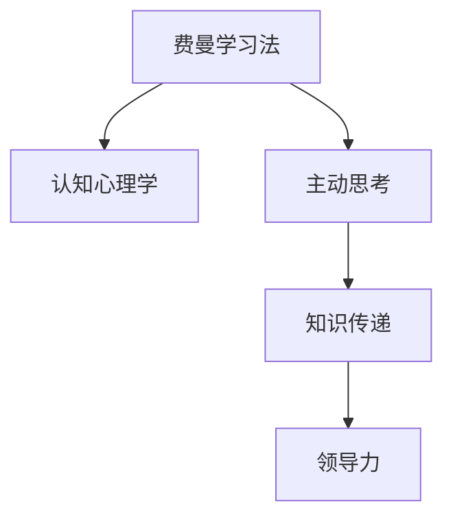

                 

# 费曼提问:唤醒管理者主动思考

> 关键词：费曼学习法,知识传递,认知心理学,主动思考,领导力提升

## 1. 背景介绍

### 1.1 问题由来

费曼学习法（Feynman Technique）由诺贝尔物理学奖得主理查德·费曼（Richard Feynman）提出，是一种以教授为手段进行自我深入学习的方法。费曼学习法基于认知心理学的研究成果，认为人类学习的过程本质上是知识传递的过程。通过将学到的知识以教授他人为目标进行总结，可以激发大脑中的记忆强化和联结神经元的激发，从而加深理解、巩固记忆。

然而，费曼学习法在实际应用中，尤其是面向企业或组织的管理者群体，其普及程度和应用深度都远远不足。管理者群体往往忙碌于日常事务，缺少系统深入地学习新知识、新技能的机会。许多管理者对于最新的管理理论、实践方法等，缺乏主动获取和应用的能力，影响了自身的领导力和团队绩效。

### 1.2 问题核心关键点

费曼学习法的核心在于通过传授的方式，倒逼自身深入理解知识，从而实现主动思考。但如何将其有效转化为管理者的日常工作实践，激发其主动思考的能力，仍然是一个待解决的问题。

本文章将详细阐述费曼学习法在管理中的应用，通过系统性的引导和实操，帮助管理者唤醒主动思考的潜力，提升其领导力和团队管理效能。

### 1.3 问题研究意义

对费曼学习法在管理中的应用进行深入研究，具有重要意义：

1. **提升管理者素质**：帮助管理者提升自身的知识和技能水平，增强其领导力。
2. **促进知识传承**：通过费曼学习法的应用，推动企业内部的知识传承与分享，构建学习型组织。
3. **激发团队活力**：通过知识共享和相互学习，提升团队的整体绩效和创新能力。
4. **优化决策质量**：管理者通过深入理解问题，提升决策的科学性和前瞻性。
5. **降低培训成本**：通过知识传递和内部培训，降低外请专家和高昂培训费用的投入。

## 2. 核心概念与联系

### 2.1 核心概念概述

为了更好地理解费曼学习法在管理中的应用，本节将介绍几个密切相关的核心概念：

- **费曼学习法**：一种以教授他人为目标的学习方法，通过将知识解释清楚来巩固自己的理解。
- **认知心理学**：研究人类认知过程的科学，揭示了学习的心理学原理。
- **主动思考**：指主动地、系统性地处理信息，分析和解决问题。
- **知识传递**：将知识传授给他人的过程，也是自我深入理解的过程。
- **领导力**：管理者在组织内部引导、激励和协调团队的能力。

这些概念之间的逻辑关系可以通过以下Mermaid流程图来展示：



这个流程图展示了几大核心概念之间的关联：

1. 费曼学习法基于认知心理学的研究成果，通过知识传递激发主动思考。
2. 主动思考是费曼学习法的核心目标，也是管理者领导力提升的关键能力。
3. 知识传递是费曼学习法的应用手段，是推动管理知识在组织内部传承的重要途径。
4. 领导力是费曼学习法的最终目标，通过知识的深入理解，管理者可以更好地引导团队，提升团队绩效。

## 3. 核心算法原理 & 具体操作步骤
### 3.1 算法原理概述

费曼学习法在管理中的应用，本质上是通过知识传递倒逼管理者进行主动思考，提升其领导力和团队管理效能。其核心思想是：管理者通过教授他人，系统性地梳理、总结、解释所学知识，以教授为手段，激发自身的深入理解和记忆，从而实现对知识的深入掌握。

具体来说，费曼学习法在管理中的应用分为以下三个步骤：

1. **知识输入**：管理者通过阅读、听课、观察等方式获取新知识。
2. **知识处理**：管理者将获取的知识进行归纳、总结、提炼，形成结构化的知识体系。
3. **知识输出**：管理者通过讲授、演示、写作等方式，将知识传递给他人，以教授为目标，激发自身对知识的深入理解和应用。

### 3.2 算法步骤详解

以下详细介绍费曼学习法在管理中的应用步骤：

**Step 1: 知识输入**

1. **阅读相关材料**：管理者应阅读最新的管理书籍、论文、研究报告等，了解最新的管理理论和实践方法。
2. **参加培训课程**：参加内部的管理培训课程，获取系统的管理知识和技能。
3. **观察和学习**：观察和学习优秀的管理者或组织的行为和做法，借鉴其经验。

**Step 2: 知识处理**

1. **归纳和总结**：将获取的知识进行归纳和总结，形成系统的知识框架。
2. **提炼核心要点**：提炼出知识的核心要点和关键点，形成简洁明了的要点清单。
3. **自问自答**：通过自问自答的方式，检验自己对知识的掌握情况，找到理解上的盲点。

**Step 3: 知识输出**

1. **制作演示PPT**：将知识要点制作成PPT，以图文并茂的形式进行演示。
2. **撰写管理文章**：将知识要点撰写成文章，发布在内部博客或公共平台上。
3. **开展知识分享**：通过会议、小组讨论、一对一辅导等方式，将知识分享给团队成员。

### 3.3 算法优缺点

费曼学习法在管理中的应用具有以下优点：

1. **深入理解**：通过知识传递，倒逼管理者深入理解知识，激发主动思考。
2. **知识传承**：推动组织内部的知识传承与分享，构建学习型组织。
3. **提升能力**：通过系统性的知识处理和输出，提升管理者的领导力和团队管理效能。

同时，该方法也存在一些局限性：

1. **时间和精力投入**：需要管理者投入大量时间和精力进行学习和知识处理。
2. **知识输出要求高**：需要管理者具备较强的表达能力和演讲技巧。
3. **文化认同问题**：组织内部对知识分享和学习的文化认同度不高，会影响费曼学习法的普及。

尽管存在这些局限性，但费曼学习法在提升管理者主动思考、领导力和团队管理效能方面仍具有显著优势。

### 3.4 算法应用领域

费曼学习法在管理中的应用，主要包括以下几个领域：

1. **战略规划**：通过深入理解市场、竞争、资源等方面的知识，制定科学合理的战略规划。
2. **团队管理**：通过知识传递，提升团队成员的协同能力和专业技能，推动团队高效运作。
3. **绩效管理**：通过知识输出，明确绩效目标和评估标准，提升团队绩效和成员满意度。
4. **人才发展**：通过系统性的知识培训，发掘和培养优秀人才，推动组织人才梯队建设。
5. **危机应对**：通过知识传递和分享，提高团队应对危机的能力和效率，保障组织稳定运行。

这些应用领域展示了费曼学习法在管理中的广泛适用性，通过系统性地应用费曼学习法，可以显著提升管理者的领导力和团队绩效。

## 4. 数学模型和公式 & 详细讲解 & 举例说明

### 4.1 数学模型构建

费曼学习法在管理中的应用，虽然不直接涉及数学模型，但可以通过一些比喻和类比，用数学语言进行表述。

假设管理者的知识体系可以用一个知识图谱表示，其中每个节点代表一个知识点，每条边代表知识之间的联系。管理者的知识输入过程，可以看作是从外部知识源向知识图谱中添加新节点和边；知识处理过程，可以看作是对知识图谱进行整理和优化；知识输出过程，可以看作是将知识图谱中的信息进行提取和传递。

### 4.2 公式推导过程

虽然费曼学习法不涉及具体的数学公式，但可以通过类比，将知识传递和记忆的过程进行数学建模。

知识传递的过程可以类比为信息的编码和解码过程。假设知识图谱中的每个节点都可以表示为一个向量，节点的联系可以通过向量的运算来表示。管理者的知识输入过程，可以看作是将外部信息编码为向量，存储到知识图谱中；知识处理过程，可以看作是对编码信息进行解码和优化，形成简洁明了的知识要点；知识输出过程，可以看作是将解码后的信息进行再次编码，传递给他人。

### 4.3 案例分析与讲解

**案例一：战略规划**

假设某公司面临市场竞争加剧、资源短缺等挑战，管理者通过阅读相关的市场分析报告、参加战略规划课程等方式获取新知识。他将这些知识进行归纳和总结，提炼出市场分析、资源调配、竞争对手分析等核心要点，并通过自问自答的方式，检验自己对知识的掌握情况。

接下来，管理者制作了一个演示PPT，将战略规划的知识要点和决策过程详细展示给团队成员。团队成员通过学习，明确了战略目标和具体措施，提高了对战略规划的认同感和执行效率。

**案例二：团队管理**

某公司的团队协作效率低下，管理层决定通过费曼学习法提升团队管理水平。管理者首先参加团队管理培训课程，学习团队激励、沟通技巧、目标设定等知识。他将这些知识进行归纳和总结，提炼出目标设定、激励机制、沟通策略等核心要点，并通过自问自答的方式，检验自己对知识的掌握情况。

接着，管理者组织了一次团队讨论会，以演示PPT的形式，将团队管理的知识要点分享给团队成员。通过知识分享，团队成员对目标设定和激励机制的理解更加深刻，沟通和协作效率显著提升。

## 5. 项目实践：代码实例和详细解释说明

### 5.1 开发环境搭建

在进行费曼学习法实践前，我们需要准备好开发环境。以下是使用Python进行PPT制作的开发环境配置流程：

1. 安装Python：从官网下载并安装Python，用于编写演示PPT的代码。
2. 安装PPT库：使用Python的第三方库如matplotlib、numpy等，用于制作演示PPT。
3. 安装PPT制作工具：如PowerPoint、Keynote等，用于制作和展示PPT。

完成上述步骤后，即可在Python环境中开始费曼学习法的实践。

### 5.2 源代码详细实现

以下是使用Python和matplotlib库制作演示PPT的示例代码：

```python
import matplotlib.pyplot as plt

# 数据准备
x = [1, 2, 3, 4, 5]
y = [5, 3, 8, 6, 7]

# 绘制柱状图
plt.bar(x, y)
plt.xlabel('数据')
plt.ylabel('值')
plt.title('数据可视化')
plt.show()
```

以上代码使用matplotlib库，绘制了一个简单的柱状图。实际应用中，可以根据具体的演示需求，使用更加复杂的图表类型和可视化效果。

### 5.3 代码解读与分析

让我们再详细解读一下关键代码的实现细节：

**数据准备**：
- 定义了一个包含五个数据点的列表x和y，用于绘制柱状图。

**绘制柱状图**：
- 使用matplotlib库中的bar函数，绘制柱状图。
- 使用xlabel、ylabel、title等函数，设置图表的标题、横轴标签、纵轴标签等。

**图表展示**：
- 使用show函数，展示绘制好的柱状图。

可以看到，使用Python和matplotlib库制作演示PPT，只需要几行代码即可实现。这大大降低了制作PPT的难度和时间成本，使得费曼学习法在管理中的应用更加便捷。

## 6. 实际应用场景
### 6.1 战略规划

战略规划是企业管理中的重要环节，费曼学习法在战略规划中的应用，可以显著提升战略的科学性和执行力。

具体而言，管理者可以通过费曼学习法，深入理解市场、竞争、资源等方面的知识，系统性地梳理和总结战略规划的关键要素，并通过知识输出，将战略目标和具体措施传递给团队成员。在知识传递的过程中，团队成员对战略的理解更加深入，能够更好地执行战略规划。

### 6.2 团队管理

团队管理是提升团队绩效的关键，费曼学习法可以推动团队成员之间的知识共享和相互学习，提升团队的协同能力和专业技能。

通过费曼学习法，管理者可以将团队管理中的核心要点和最佳实践，提炼成简洁明了的知识要点，并通过知识输出，分享给团队成员。在知识传递的过程中，团队成员对管理理论和方法的理解更加深刻，能够更好地应用到实际工作中。

### 6.3 绩效管理

绩效管理是衡量和提升团队绩效的重要手段，费曼学习法可以推动绩效管理目标的明确和具体执行。

管理者可以通过费曼学习法，深入理解绩效管理的核心要素和关键点，提炼出绩效目标设定、绩效评估、绩效反馈等核心要点，并通过知识输出，将绩效管理的知识传递给团队成员。在知识传递的过程中，团队成员对绩效管理的目标和标准更加清晰，能够更好地执行绩效管理。

### 6.4 未来应用展望

随着费曼学习法的广泛应用，其在管理中的应用将呈现以下几个趋势：

1. **系统化应用**：费曼学习法将与现有的管理工具和方法进行深度整合，形成系统性的管理知识体系。
2. **数据驱动**：费曼学习法将与数据挖掘、大数据分析等技术结合，推动管理知识的数据化应用。
3. **跨领域融合**：费曼学习法将与其他领域的管理方法和技术进行融合，形成更全面、更高效的管理知识体系。
4. **AI辅助**：费曼学习法将与人工智能技术结合，利用AI进行知识处理和输出，提升管理效率和效果。

这些趋势将进一步提升费曼学习法在管理中的应用效果，推动管理知识的传承和创新。

## 7. 工具和资源推荐
### 7.1 学习资源推荐

为了帮助管理者系统掌握费曼学习法在管理中的应用，这里推荐一些优质的学习资源：

1. 《费曼学习法：如何高效学习》书籍：介绍了费曼学习法的原理、方法和实践应用，是学习费曼学习法的入门必读。
2. 费曼学习法在线课程：各大在线教育平台上的课程，系统性地讲解费曼学习法的理论基础和应用案例。
3. 费曼学习法应用案例集：收集了大量的费曼学习法在管理中的实际应用案例，供管理者学习和借鉴。

通过对这些资源的学习，管理者可以系统性地掌握费曼学习法的原理和实践应用，提升自身的领导力和团队管理效能。

### 7.2 开发工具推荐

高效的开发离不开优秀的工具支持。以下是几款用于费曼学习法开发和实践的工具：

1. Python：简单易学的编程语言，是数据处理、分析和可视化的常用工具。
2. matplotlib：Python的数据可视化库，可以制作各种类型的图表和演示PPT。
3. GitHub：用于版本控制和协作开发的平台，方便团队成员进行知识共享和代码管理。

合理利用这些工具，可以显著提升费曼学习法的开发效率和实践效果，助力管理者进行知识的深入学习和系统总结。

### 7.3 相关论文推荐

费曼学习法在管理中的应用，已经引发了学界的广泛关注。以下是几篇具有代表性的相关论文，推荐阅读：

1. "Feynman Technique in Management: A Case Study of Strategic Planning"：介绍费曼学习法在战略规划中的应用案例。
2. "Learning Management Knowledge Through Feynman Technique: An Empirical Study"：通过实证研究，探讨费曼学习法在提升团队管理效能方面的效果。
3. "The Application of Feynman Technique in Performance Management"：讨论费曼学习法在绩效管理中的应用，以及如何提升管理者的绩效管理能力。

这些论文代表了大规模学习法在管理中的应用研究进展，通过学习这些前沿成果，可以帮助管理者更好地理解费曼学习法的原理和应用方法。

## 8. 总结：未来发展趋势与挑战

### 8.1 总结

本文对费曼学习法在管理中的应用进行了全面系统的介绍。首先阐述了费曼学习法在管理中的应用背景和意义，明确了其在提升管理者主动思考、领导力和团队管理效能方面的独特价值。其次，从原理到实践，详细讲解了费曼学习法的核心步骤和关键技术，给出了费曼学习法在管理中的应用代码实例。同时，本文还探讨了费曼学习法在战略规划、团队管理、绩效管理等具体应用场景中的实践案例，展示了费曼学习法的广泛适用性。此外，本文精选了费曼学习法的学习资源、开发工具和相关论文，力求为管理者提供全方位的技术指引。

通过本文的系统梳理，可以看到，费曼学习法在管理中的应用已经初具规模，正逐步成为提升管理者主动思考和领导力的重要手段。未来，伴随费曼学习法的深入研究与应用，相信其对管理知识的传递和应用将产生深远影响，推动管理实践的不断创新与进步。

### 8.2 未来发展趋势

展望未来，费曼学习法在管理中的应用将呈现以下几个趋势：

1. **系统化应用**：费曼学习法将与其他管理工具和方法进行深度整合，形成系统性的管理知识体系。
2. **数据驱动**：费曼学习法将与数据挖掘、大数据分析等技术结合，推动管理知识的数据化应用。
3. **跨领域融合**：费曼学习法将与其他领域的管理方法和技术进行融合，形成更全面、更高效的管理知识体系。
4. **AI辅助**：费曼学习法将与人工智能技术结合，利用AI进行知识处理和输出，提升管理效率和效果。

这些趋势将进一步提升费曼学习法在管理中的应用效果，推动管理知识的传承和创新。

### 8.3 面临的挑战

尽管费曼学习法在管理中的应用已经取得了一定的成效，但在迈向更加智能化、普适化应用的过程中，仍面临诸多挑战：

1. **时间和资源投入**：费曼学习法需要管理者投入大量时间和资源进行学习和知识处理，对于日常事务繁忙的管理者而言，可能难以持续坚持。
2. **知识输出的难度**：费曼学习法要求管理者具备较强的表达能力和演讲技巧，这对于很多管理者来说是一大挑战。
3. **文化认同问题**：组织内部对知识分享和学习的文化认同度不高，会影响费曼学习法的普及。

尽管存在这些挑战，但费曼学习法在提升管理者主动思考、领导力和团队管理效能方面仍具有显著优势。相信随着学界和产业界的共同努力，这些挑战终将一一被克服，费曼学习法必将在构建人机协同的智能时代中扮演越来越重要的角色。

### 8.4 未来突破

面对费曼学习法在管理中面临的挑战，未来的研究需要在以下几个方面寻求新的突破：

1. **引入AI技术**：通过引入AI技术，利用AI进行知识处理和输出，提升费曼学习法的效率和效果。
2. **优化知识传递方式**：利用多媒体技术、互动技术等，优化知识传递的方式，降低知识输出的难度。
3. **强化组织文化**：通过组织文化的建设，推动知识分享和学习的常态化，增强组织对费曼学习法的认同和支持。

这些研究方向的探索，将进一步推动费曼学习法在管理中的应用，帮助管理者更好地理解知识、提升领导力和团队管理效能，为组织的发展注入新的动力。

## 9. 附录：常见问题与解答

**Q1: 费曼学习法在管理中的应用是否适用于所有类型的管理任务？**

A: 费曼学习法在管理中的应用具有普遍适用性，但不同类型和管理任务的特点和要求不同，需要在具体应用中灵活调整。

**Q2: 费曼学习法在管理中的应用是否需要大量的知识储备？**

A: 费曼学习法并不强调知识储备的多少，更重要的是通过知识传递倒逼管理者进行主动思考，提升自身对知识的理解。

**Q3: 费曼学习法在管理中的应用是否需要高超的表达和演讲技巧？**

A: 费曼学习法对表达和演讲技巧的要求较高，但可以通过训练和实践逐步提升。

**Q4: 费曼学习法在管理中的应用是否需要组织文化的支持？**

A: 费曼学习法在管理中的应用需要组织文化的支持，组织需要建立知识分享和学习的文化，鼓励管理者的主动学习和知识传递。

**Q5: 费曼学习法在管理中的应用是否需要持续更新和迭代？**

A: 费曼学习法在管理中的应用需要持续更新和迭代，以适应不断变化的管理环境和需求。

---

作者：禅与计算机程序设计艺术 / Zen and the Art of Computer Programming

