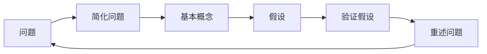

                 

## 1. 背景介绍

### 1.1 问题由来
面对复杂的世界和信息爆炸的互联网时代，我们每天都在面临各种各样的决策和问题。如何在庞杂的信息中快速找到答案？如何在有限的时间内高效解决问题？这是每个人都需要面对的挑战。费曼提问法（Feynman Technique）应运而生，通过模拟费曼的思考方式，帮助我们更深入地理解问题和寻找解决方案。

### 1.2 问题核心关键点
费曼提问法是一种以自我解释为目标的学习方法，通过层层递进的提问来推动深入理解。其核心关键点包括：
- 简化问题：将复杂问题简化为基本概念和基本问题。
- 以教为学：将解释给别人（包括自己）作为学习目标。
- 不断提问：通过层层递进的提问，推动深入思考。
- 验证假设：通过自我测试和实验，验证假设的正确性。

### 1.3 问题研究意义
掌握费曼提问法，可以帮助我们：
1. 更高效地学习和理解复杂概念。
2. 更清晰地表达和解释问题。
3. 更快速地找到问题的根本解决方案。
4. 提升自我思考和解决问题的能力。
5. 在教育和培训中更有效地传授知识。

费曼提问法在教育、科研、工程等多个领域得到了广泛应用，成为学习、思考和解决问题的利器。

## 2. 核心概念与联系

### 2.1 核心概念概述

费曼提问法基于著名物理学家理查德·费曼的思考方式，通过将复杂问题简化和分解，通过不断提问和自我解释，达到深入理解的目的。以下是费曼提问法的核心概念：

1. **简化问题**：将复杂问题分解为基本概念和基本问题。
2. **以教为学**：通过向别人解释问题，加深自己理解。
3. **层层递进**：通过层层递进的提问，推动深入思考。
4. **验证假设**：通过实验和自我测试，验证假设的正确性。
5. **重述问题**：将问题以更简洁、更易理解的方式重述。

### 2.2 核心概念原理和架构的 Mermaid 流程图(Mermaid 流程节点中不要有括号、逗号等特殊字符)



这个流程图展示了费曼提问法的核心步骤：从简化问题开始，通过基本概念和假设，逐步深入验证，并以简洁的方式重述问题，形成循环。

## 3. 核心算法原理 & 具体操作步骤

### 3.1 算法原理概述
费曼提问法的原理基于信息检索和自我解释的心理模型。通过简化问题、以教为学、层层递进、验证假设和重述问题，逐步深入理解问题的本质和解决方案。其核心算法包括以下步骤：

1. **简化问题**：将复杂问题分解为基本概念和基本问题。
2. **假设假设**：基于基本概念，提出假设性解释。
3. **验证假设**：通过实验和测试，验证假设的正确性。
4. **重述问题**：将问题以简洁、易懂的方式重述。
5. **重复以上步骤**：通过不断提问和验证，深入理解问题。

### 3.2 算法步骤详解
1. **选择问题**：选择一个复杂问题作为思考对象。
2. **简化问题**：将问题分解为基本概念和基本问题。
3. **假设假设**：基于基本概念，提出假设性解释。
4. **验证假设**：通过实验和测试，验证假设的正确性。
5. **重述问题**：将问题以简洁、易懂的方式重述。
6. **重复以上步骤**：通过不断提问和验证，深入理解问题。

### 3.3 算法优缺点
**优点**：
- 能够将复杂问题简化为基本概念，易于理解。
- 通过以教为学，加深自我理解。
- 通过层层递进提问，推动深入思考。
- 通过验证假设，确保解决方案的正确性。

**缺点**：
- 需要较高的自我反思和自我解释能力。
- 对于某些问题，可能难以找到简洁的解释方式。
- 需要大量时间和精力进行反复思考和验证。

### 3.4 算法应用领域
费曼提问法广泛应用于教育、科研、工程等多个领域，其核心原理和方法论适用于任何需要深入理解的问题。以下是一些具体应用场景：

1. **教育**：教师可以使用费曼提问法教授复杂概念，帮助学生深入理解。
2. **科研**：科学家可以使用费曼提问法探索未知领域，提出假设并验证。
3. **工程**：工程师可以使用费曼提问法解决复杂技术问题，提高创新能力。
4. **管理**：管理者可以使用费曼提问法制定决策，提升领导力。
5. **个人发展**：个人可以使用费曼提问法学习新技能，提升自我成长。

## 4. 数学模型和公式 & 详细讲解 & 举例说明（备注：数学公式请使用latex格式，latex嵌入文中独立段落使用 $$，段落内使用 $)
### 4.1 数学模型构建
费曼提问法不需要构建复杂的数学模型，而是基于心理模型和问题分解，通过自我解释和验证来加深理解。

### 4.2 公式推导过程
由于费曼提问法不需要数学模型，因此没有具体的公式推导过程。其核心是简化问题、以教为学、层层递进、验证假设和重述问题。

### 4.3 案例分析与讲解
**案例1：理解牛顿第二定律**
1. **简化问题**：牛顿第二定律是力和加速度的关系，可以通过基本概念“力”和“加速度”来理解。
2. **假设假设**：假设存在一个物体，已知其质量，受到一个力作用，求其加速度。
3. **验证假设**：通过公式 $F = ma$ 进行验证，确保假设正确。
4. **重述问题**：将问题简化为“已知质量和力，求加速度”。
5. **重复以上步骤**：通过不断提问和验证，深入理解牛顿第二定律。

**案例2：解决复杂工程问题**
1. **简化问题**：一个桥梁设计问题，涉及多个因素，如材料、结构、环境等。
2. **假设假设**：假设材料强度是关键因素，对不同材料进行测试，验证其强度。
3. **验证假设**：通过实验测试不同材料的强度，确保假设正确。
4. **重述问题**：将问题简化为“选择材料强度最大的材料”。
5. **重复以上步骤**：通过不断提问和验证，深入理解桥梁设计问题。

## 5. 项目实践：代码实例和详细解释说明
### 5.1 开发环境搭建

为了实践费曼提问法，我们需要一个简单的开发环境。这里建议使用Python和Jupyter Notebook作为开发工具，其简洁高效，易于上手。

1. 安装Python和Jupyter Notebook：
```bash
pip install python
pip install jupyter notebook
```

2. 创建一个新的Jupyter Notebook：
```bash
jupyter notebook
```

### 5.2 源代码详细实现
以下是一个简单的费曼提问法的Python实现，用于理解复杂概念“循环引用”：

```python
from sympy import symbols

# 定义变量
x, y, z = symbols('x y z')

# 简化问题：理解循环引用
# 假设假设：循环引用是通过变量x和y相乘，然后加z得到的
# 验证假设：通过符号计算验证
# 重述问题：将问题简化为理解x和y的乘积加上z
# 重复以上步骤：不断提问和验证

# 定义循环引用表达式
expr = x * y + z

# 输出表达式
print("循环引用表达式:", expr)
```

### 5.3 代码解读与分析
上述代码通过Sympy库定义了一个表达式 $x \times y + z$，用于理解循环引用的概念。通过逐步简化、假设、验证和重述问题，加深了对循环引用的理解。

### 5.4 运行结果展示
运行上述代码，输出结果为：
```
循环引用表达式: x*y + z
```

这表明，通过费曼提问法，我们成功理解了循环引用的概念。

## 6. 实际应用场景
### 6.1 理解复杂概念
费曼提问法可以应用于理解各种复杂概念，特别是在教育和科研领域。例如：
- 在物理课上，学生可以使用费曼提问法理解复杂的物理定律，如电磁学、量子力学等。
- 在科研项目中，研究人员可以使用费曼提问法探索未知领域，提出假设并验证。

### 6.2 解决复杂问题
费曼提问法在解决复杂问题时也非常有效，特别是在工程和项目管理中。例如：
- 在桥梁设计项目中，工程师可以使用费曼提问法解决复杂的材料选择问题。
- 在项目管理中，管理者可以使用费曼提问法制定决策，提升领导力。

### 6.3 创新思维
费曼提问法还可以通过层层递进的提问，激发创新思维。例如：
- 在产品开发中，设计师可以使用费曼提问法探索新功能，提出假设并验证。
- 在科技创业中，创业者可以使用费曼提问法寻找市场机会，制定商业计划。

### 6.4 未来应用展望
费曼提问法的应用场景将随着时代的发展而不断扩展。未来，其在以下几个领域有广阔前景：
1. **人工智能**：通过费曼提问法，科学家可以更好地理解人工智能的算法和模型，推动AI技术的发展。
2. **健康医疗**：医生可以使用费曼提问法理解复杂的病理机制，制定个性化治疗方案。
3. **金融投资**：投资者可以使用费曼提问法分析复杂市场，制定投资策略。
4. **环境科学**：环保专家可以使用费曼提问法理解复杂的生态系统，制定环境保护措施。

## 7. 工具和资源推荐
### 7.1 学习资源推荐

为了更好地掌握费曼提问法，以下是一些推荐的资源：

1. **《费曼学习法》一书**：作者为费曼的同事，详细介绍了费曼的思考方式和学习方法，具有很高的实用价值。
2. **TED Talks演讲**：费曼本人在TED上的一些演讲，展示了费曼提问法的魅力。
3. **在线课程**：Coursera和edX等平台上有一些关于费曼提问法的课程，适合不同层次的学习者。
4. **在线社区**：Reddit和Stack Overflow等社区中，有很多关于费曼提问法的讨论和案例分享。

### 7.2 开发工具推荐

1. **Jupyter Notebook**：非常适合费曼提问法的实践，支持代码、文本和图像的混合编辑。
2. **Python**：简洁高效的编程语言，支持各种科学计算和数据分析库。
3. **Sympy**：Python中的符号计算库，适合进行数学推导和验证。

### 7.3 相关论文推荐

1. **《费曼的思考方式》论文**：详细介绍了费曼的思考方式和学习方法，具有很高的学术价值。
2. **《费曼学习法在科学教育中的应用》论文**：研究了费曼提问法在科学教育中的实际应用效果。
3. **《费曼学习法在技术培训中的应用》论文**：探讨了费曼提问法在技术培训中的实际应用效果。

## 8. 总结：未来发展趋势与挑战

### 8.1 研究成果总结
费曼提问法自提出以来，已经广泛应用于多个领域，并得到了广泛认可。其核心原理和方法论，帮助人们深入理解复杂问题，提升学习和解决问题的能力。

### 8.2 未来发展趋势
1. **技术化**：未来费曼提问法将更加技术化，结合AI和数据分析技术，进一步提升其应用效果。
2. **工具化**：未来的费曼提问法应用工具将更加丰富，支持多种平台和设备。
3. **大众化**：费曼提问法将成为普通人的学习工具，助力个人成长和发展。

### 8.3 面临的挑战
尽管费曼提问法有很多优点，但也面临一些挑战：
1. **应用门槛高**：需要较高的自我反思和自我解释能力。
2. **时间成本高**：需要大量时间和精力进行反复思考和验证。
3. **知识局限性**：对于某些复杂问题，可能难以找到简洁的解释方式。

### 8.4 研究展望
未来的研究可以从以下几个方向进行探索：
1. **自动化**：开发自动化的费曼提问工具，降低应用门槛。
2. **跨学科应用**：将费曼提问法应用于更多学科领域，提升各领域的学习和研究效果。
3. **教育技术**：将费曼提问法融入教育技术，提升教育效果和质量。

## 9. 附录：常见问题与解答

**Q1：费曼提问法的核心是什么？**
A: 费曼提问法的核心是简化问题、以教为学、层层递进、验证假设和重述问题，通过不断提问和验证，达到深入理解的目的。

**Q2：费曼提问法适用于所有问题吗？**
A: 费曼提问法适用于大多数问题，但有些问题可能难以找到简洁的解释方式，需要结合其他方法进行解决。

**Q3：费曼提问法的优点和缺点是什么？**
A: 优点是能够将复杂问题简化为基本概念，通过以教为学，加深自我理解。缺点是需要较高的自我反思和自我解释能力，时间成本较高。

**Q4：费曼提问法在教育中有何应用？**
A: 费曼提问法在教育中可以用来教授复杂概念，帮助学生深入理解。例如，在物理课上，学生可以使用费曼提问法理解复杂的物理定律。

**Q5：费曼提问法的应用场景有哪些？**
A: 费曼提问法适用于教育、科研、工程、管理、个人发展等多个领域。例如，在科研项目中，科学家可以使用费曼提问法探索未知领域，提出假设并验证。在工程项目中，工程师可以使用费曼提问法解决复杂技术问题，提高创新能力。

---

作者：禅与计算机程序设计艺术 / Zen and the Art of Computer Programming

