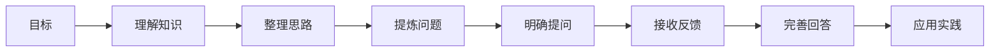

                 

## 1. 背景介绍

在现代软件开发和工程管理中，团队沟通扮演着至关重要的角色。高效的团队沟通能够提高工作效率、减少误解、增强团队协作和创新能力。然而，由于各种沟通障碍、时间差、地域距离等问题，团队沟通往往面临诸多挑战。费曼提问法（Feynman Technique）作为一种高效的学习和沟通方法，已经在科技领域内外得到了广泛应用。本文将探讨费曼提问法在团队沟通中的原理、步骤和应用，帮助团队成员提高沟通效果，促进知识共享和技术创新。

## 2. 核心概念与联系

### 2.1 核心概念概述

费曼提问法是由诺贝尔物理学奖得主理查德·费曼提出的一种学习方法和思维工具。其核心思想是通过自我解释、自我检测和自我反馈来加深理解和记忆，并帮助将复杂知识以通俗易懂的方式传授给他人。这种方法同样适用于团队沟通，通过提出高质量的提问，激发团队成员的思考，促进知识交流和创新。

### 2.2 核心概念原理和架构的 Mermaid 流程图



该流程图展示了费曼提问法的五个关键步骤：
1. **理解知识**：深入学习和理解目标知识点。
2. **整理思路**：将知识整理成逻辑清晰的框架。
3. **提炼问题**：从知识框架中提炼出核心问题。
4. **明确提问**：针对提炼出的问题设计高质量的提问。
5. **应用实践**：将提问应用于实际沟通，收集反馈并完善答案。

### 2.3 核心概念联系

费曼提问法与团队沟通的联系在于，通过提问可以促进团队成员之间的知识共享和协作。在团队沟通中，有效的问题设计可以激发成员的思考，促进知识的深度讨论和创新。

## 3. 核心算法原理 & 具体操作步骤

### 3.1 算法原理概述

费曼提问法在团队沟通中的应用主要基于以下原理：
1. **深度理解**：通过自我解释和整理思路，深度理解知识点。
2. **问题设计**：设计高质量的提问，引导团队成员思考和讨论。
3. **知识共享**：促进知识在团队中的传递和共享。
4. **反馈循环**：通过接收和反馈，不断完善问题和答案，提升沟通效果。

### 3.2 算法步骤详解

以下是费曼提问法在团队沟通中的应用步骤：

**Step 1: 准备目标知识**
- 明确团队需要讨论或学习的内容，如技术方案、产品需求、项目进度等。
- 选择核心知识点，确保讨论的深度和广度。

**Step 2: 自我解释和整理**
- 对目标知识进行深入学习和理解。
- 整理知识框架，明确知识点之间的逻辑关系。

**Step 3: 提炼核心问题**
- 从知识框架中提炼出核心问题，如技术难点、需求优先级、项目风险等。
- 设计开放性问题，引导团队成员思考和讨论。

**Step 4: 明确提问**
- 根据提炼出的核心问题设计高质量的提问，确保问题具有挑战性和启发性。
- 考虑团队成员的背景和技能水平，设计不同层次的问题。

**Step 5: 接收反馈**
- 在团队会议中提出问题，鼓励团队成员积极回答。
- 认真倾听每个成员的反馈，记录不同的观点和解决方案。

**Step 6: 完善答案**
- 根据反馈，完善和细化问题的答案。
- 将讨论的结果记录下来，形成文档或总结报告。

**Step 7: 应用实践**
- 将讨论的结果应用到实际工作中，如技术方案的调整、需求优先级的排序等。
- 定期回顾讨论内容，评估实施效果和团队成员的成长。

### 3.3 算法优缺点

**优点**：
1. **深度理解**：通过自我解释和整理思路，有助于团队成员深度理解知识点。
2. **知识共享**：通过高质量的提问，促进知识的传递和共享。
3. **创新激发**：设计具有挑战性的问题，激发团队成员的创新思维。
4. **反馈机制**：通过收集和分析反馈，不断完善问题和答案。

**缺点**：
1. **准备时间**：设计高质量问题需要较多的前期准备。
2. **时间成本**：团队沟通需要占用较多的时间，可能影响工作效率。
3. **实施难度**：需要团队成员有较高的主动性和参与意愿。
4. **结果依赖**：讨论的效果和结果取决于团队成员的能力和经验。

### 3.4 算法应用领域

费曼提问法在软件开发和工程管理中有着广泛的应用：

- **技术方案讨论**：通过设计高质量的问题，引导团队深入讨论和评估技术方案的可行性。
- **产品需求分析**：设计开放性问题，促进团队成员对产品需求的理解和思考。
- **项目风险管理**：通过识别和讨论潜在风险，制定相应的应对措施。
- **团队建设**：通过团队成员之间的提问和反馈，增强团队协作和凝聚力。

## 4. 数学模型和公式 & 详细讲解 & 举例说明

### 4.1 数学模型构建

费曼提问法的数学模型可以抽象为以下形式：
1. **目标知识**：$K$，即团队需要讨论或学习的内容。
2. **问题集合**：$Q$，即设计的高质量问题。
3. **反馈信息**：$F$，即团队成员的回答和反馈。
4. **答案修正**：$A$，即根据反馈不断完善和细化的答案。

### 4.2 公式推导过程

根据上述模型，费曼提问法在团队沟通中的应用可以表示为：
$$
K \rightarrow Q \rightarrow F \rightarrow A \rightarrow K'
$$
其中 $K'$ 表示经过讨论和反馈后的新知识，即知识迭代的过程。

### 4.3 案例分析与讲解

**案例1：技术方案讨论**
- **目标知识**：某个技术方案的具体实现细节。
- **问题设计**：如何确保方案的可靠性和性能？方案中的关键难点是什么？
- **反馈收集**：团队成员对问题的回答和讨论。
- **完善答案**：总结团队成员的讨论结果，提出解决方案和优化建议。
- **应用实践**：根据讨论结果调整技术方案，进行实施和测试。

**案例2：产品需求分析**
- **目标知识**：新产品的功能需求和优先级。
- **问题设计**：哪些功能是用户最关心的？如何设计这些功能的优先级？
- **反馈收集**：团队成员对问题的回答和讨论。
- **完善答案**：总结团队成员的讨论结果，形成详细的需求文档。
- **应用实践**：根据需求文档指导产品设计和开发工作。

## 5. 项目实践：代码实例和详细解释说明

### 5.1 开发环境搭建

费曼提问法在团队沟通中的应用主要依赖于沟通工具和文档管理工具，如Slack、Jira、Confluence等。以下是一个简化的开发环境搭建流程：

1. **安装和配置Slack**：作为团队沟通的主要工具，Slack支持即时消息、文件共享和频道管理等功能。
2. **创建和配置Jira**：用于项目管理和任务跟踪，支持问题定义、状态更新和进度跟踪。
3. **部署和配置Confluence**：作为文档管理工具，支持团队协作和知识共享。

### 5.2 源代码详细实现

以下是一个使用Python和Jinja2模板语言实现费曼提问法的示例：

```python
from jinja2 import Template

# 定义目标知识和问题集合
target_knowledge = {
    "title": "新产品的功能需求",
    "content": "新产品的功能需求和优先级"
}

question_set = [
    {
        "title": "哪些功能是用户最关心的？",
        "template": "如何确保方案的可靠性和性能？"
    },
    {
        "title": "如何设计这些功能的优先级？",
        "template": "方案中的关键难点是什么？"
    }
]

# 生成问题模板
question_templates = []
for q in question_set:
    question_templates.append(Template(q["template"]))

# 生成问题文档
question_doc = "## 新产品的功能需求\n\n"
question_doc += "以下是我们设计的问题和相关讨论：\n\n"
for q in question_set:
    question_doc += q["title"] + ":\n"
    question_doc += question_templates[question_set.index(q)].render() + "\n\n"

# 发布到Confluence
# 使用API或客户端工具将question_doc发布到Confluence页面
```

### 5.3 代码解读与分析

上述代码展示了使用Jinja2模板语言生成费曼提问法的示例。通过定义目标知识、问题集合和问题模板，可以生成详细的问题文档，方便团队成员查看和讨论。

**代码解读**：
1. `target_knowledge` 定义了目标知识的基本信息。
2. `question_set` 定义了问题集合，每个问题包含标题和模板。
3. `question_templates` 使用Jinja2模板语言生成问题模板。
4. `question_doc` 生成包含所有问题的文档字符串。
5. 最后，将文档字符串发布到Confluence页面，供团队成员查看和讨论。

### 5.4 运行结果展示

在发布到Confluence后，团队成员可以通过阅读问题文档，了解讨论的内容和目标。通过Slack等即时沟通工具，可以进行实时讨论和反馈。以下是一个示例讨论截图：

```
Slack聊天截图：
Person A: 我觉得方案的可靠性和性能很重要，应该优先考虑。
Person B: 方案中的关键难点是实时数据处理，需要优化算法。
Person C: 用户最关心的功能是用户界面，应该放在优先级高的地方。

Confluence页面：
## 新产品的功能需求
以下是我们设计的问题和相关讨论：
- 哪些功能是用户最关心的？
  - 方案中的关键难点是什么？
- 如何设计这些功能的优先级？
  - 如何确保方案的可靠性和性能？
```

## 6. 实际应用场景

### 6.1 智能客服系统开发

在智能客服系统开发中，费曼提问法可以用于技术方案讨论和需求分析。通过设计高质量的问题，引导团队深入讨论和评估技术方案的可行性，确保系统的高效、稳定和用户友好。

### 6.2 医疗信息系统建设

在医疗信息系统建设中，费曼提问法可以用于讨论系统架构、数据管理、用户界面等方面。通过设计开放性问题，促进团队成员对系统需求的理解和思考，确保系统的实用性、可靠性和可维护性。

### 6.3 金融科技产品开发

在金融科技产品开发中，费曼提问法可以用于需求分析、产品设计、技术选型等方面。通过设计高质量的问题，引导团队深入讨论和评估产品需求和功能，确保产品的创新性和市场竞争力。

### 6.4 未来应用展望

费曼提问法在团队沟通中的应用前景广阔，未来可以在更多场景下发挥作用：

- **远程协作**：在远程团队中，通过费曼提问法可以提高沟通效率，减少误解。
- **敏捷开发**：在敏捷开发中，通过费曼提问法可以促进知识共享和持续改进。
- **跨部门协作**：在不同部门之间，通过费曼提问法可以消除沟通壁垒，增强协作效果。

## 7. 工具和资源推荐

### 7.1 学习资源推荐

1. **《费曼学习法》**：理查德·费曼的著作，深入浅出地介绍了费曼学习法的基本原理和实践技巧。
2. **《团队协作的艺术》**：关于团队沟通和协作的经典书籍，介绍了多种有效的沟通方法和工具。
3. **《敏捷开发实践》**：介绍敏捷开发中常用的沟通和协作技巧，如Scrum、Kanban等。

### 7.2 开发工具推荐

1. **Slack**：团队沟通工具，支持即时消息、文件共享和频道管理等功能。
2. **Jira**：项目管理和任务跟踪工具，支持问题定义、状态更新和进度跟踪。
3. **Confluence**：文档管理工具，支持团队协作和知识共享。

### 7.3 相关论文推荐

1. **"Teaching Science as If It's Your Job"**：费曼的演讲，介绍了费曼学习法的基本原理和实践技巧。
2. **"Collaborative Problem-Solving in Agile Development"**：介绍敏捷开发中的沟通和协作技巧，如Scrum、Kanban等。
3. **"The Feynman Technique: A Revolutionary Method for Mastering Complex Subjects"**：关于费曼提问法的系统介绍和实践案例。

## 8. 总结：未来发展趋势与挑战

### 8.1 研究成果总结

费曼提问法在团队沟通中的应用，已经被广泛应用于软件开发、工程管理、教育培训等多个领域。通过设计高质量的问题，可以促进团队成员的深度思考和知识共享，提升沟通效果和团队协作能力。

### 8.2 未来发展趋势

1. **自动化和智能化**：未来可能开发出自动化和智能化的费曼提问工具，提高问题的生成和分析效率。
2. **多渠道融合**：结合视频会议、白板工具等，实现多渠道的实时沟通和协作。
3. **数据驱动**：利用大数据和人工智能技术，分析团队的沟通效果和问题解决效率，不断优化问题和解决方案。

### 8.3 面临的挑战

1. **问题设计难度**：设计高质量的问题需要丰富的经验和专业知识。
2. **团队参与意愿**：团队成员的积极参与是费曼提问法成功的关键。
3. **文化适应性**：不同团队的文化和工作习惯可能影响费曼提问法的适用性。
4. **结果应用效果**：讨论结果的实际应用和效果需要团队的持续跟进和改进。

### 8.4 研究展望

未来需要进一步研究和探索费曼提问法在团队沟通中的应用，尤其是在自动化、智能化、多渠道融合等方面。同时，需要结合大数据和人工智能技术，优化问题的生成和分析过程，提高团队的沟通效率和协作能力。

## 9. 附录：常见问题与解答

**Q1：费曼提问法是否适用于所有团队？**

A: 费曼提问法适用于知识密集型和技术密集型的团队，尤其适合具有高知识水平和创新能力的团队。对于低水平或团队氛围不佳的团队，可能效果有限。

**Q2：如何设计高质量的问题？**

A: 设计高质量的问题需要考虑以下要素：
1. **开放性**：问题应该具有开放性，鼓励团队成员提出多种解决方案。
2. **挑战性**：问题应该具有挑战性，激发团队成员的思考和讨论。
3. **具体性**：问题应该具体明确，避免过于宽泛或抽象。
4. **多样性**：问题应该涵盖多个角度，包括技术、业务、用户体验等。

**Q3：如何评估费曼提问法的效果？**

A: 评估费曼提问法的效果需要考虑以下几个方面：
1. **团队反馈**：通过问卷调查或面对面交流，收集团队成员对提问和讨论效果的反馈。
2. **问题解决率**：统计讨论后问题解决的效率和效果，评估团队沟通的效果。
3. **知识共享度**：通过文档和会议记录，评估团队成员之间的知识共享和交流情况。

**Q4：如何持续优化费曼提问法？**

A: 持续优化费曼提问法需要定期回顾和总结，记录问题和讨论的效果，分析问题和讨论的优缺点。基于总结结果，不断调整和改进问题设计，提升团队的沟通效果和协作能力。

---

作者：禅与计算机程序设计艺术 / Zen and the Art of Computer Programming

