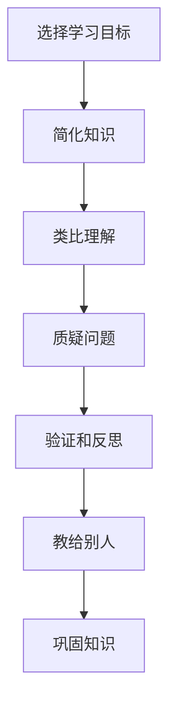

                 

# 费曼提问法激发管理者思考深度

> 关键词：费曼学习法,知识内化,深度思考,管理者训练,思维模型,问题导向,教育心理学

## 1. 背景介绍

### 1.1 问题由来
管理者在快速变化的企业环境中需要面对诸多复杂问题，如何提升其决策质量、领导力、创新能力，成为管理学术界和实践者共同关注的课题。教育心理学研究者认为，深度思考（Deep Thinking）是提升管理能力的重要途径。而如何有效激发管理者的深度思考，成为企业培训和管理发展的重要议题。

费曼学习法（Feynman Technique），由诺贝尔物理学奖得主理查德·费曼提出，通过类比、简化、质疑等手段，激发个人的深度思考，并将知识内化，从而形成深刻的理解和掌握。这一方法被广泛应用于教育和研究领域，但在企业管理和领导力培训中，尚未得到系统研究和应用。

### 1.2 问题核心关键点
本文聚焦于费曼学习法的核心概念和应用，探讨其如何激发管理者的深度思考，提升其问题解决和决策能力，并从教育心理学、认知科学和应用案例的角度，分析其有效性和实施策略。

## 2. 核心概念与联系

### 2.1 核心概念概述

费曼学习法是一种通过简化复杂概念、类比日常经验、质疑问题，激发个人深度思考和知识内化的学习方法。其核心步骤包括：

- **选择学习目标**：明确要掌握的知识或技能。
- **简化知识**：将复杂概念简化为易于理解的形式。
- **类比理解**：将新知识类比到已有经验和日常事物。
- **质疑问题**：对简化和类比后的知识进行多角度质疑和验证。
- **教给别人**：尝试将所学知识简洁明了地教给他人。

费曼学习法不仅适用于学习知识，更适用于深度思考和问题解决，尤其对于企业管理者而言，其应用具有独特优势。通过类比和简化，管理者可以将复杂问题分解为可操作的小问题；通过质疑和验证，管理者能够不断反思和优化决策；通过教授他人，管理者能够清晰表达和巩固所学知识。

### 2.2 核心概念原理和架构的 Mermaid 流程图



费曼学习法的架构明确，各个步骤环环相扣，适用于知识掌握和深度思考的双重目标。

## 3. 核心算法原理 & 具体操作步骤

### 3.1 算法原理概述

费曼学习法的核心在于通过类比和质疑，激发深度思考，从而实现知识内化和应用。其算法原理主要包括以下几个方面：

- **简化**：通过类比和抽象，将复杂问题简化为易于理解的形式。
- **质疑**：通过多角度质疑，挑战简化后的知识，促进深入理解。
- **验证**：通过实际验证，检验质疑的有效性，确保知识正确。
- **教与学**：通过教授他人，巩固理解和应用，形成长效记忆。

这些步骤共同构成了费曼学习法的基本流程，适用于任何复杂问题的学习和理解。

### 3.2 算法步骤详解

费曼学习法的实施步骤较为灵活，具体如下：

**Step 1: 确定学习目标**
管理者首先需要明确要掌握的知识或技能，如某项决策、团队管理策略、市场分析方法等。

**Step 2: 简化问题**
将目标问题简化，分解为可操作的小问题。如：决策问题可以分解为“目标设定”、“策略选择”、“资源配置”等。

**Step 3: 类比理解**
将简化后的问题类比到已有经验和日常事物。例如，“目标设定”可以类比为制定家庭旅行计划，从而形成直观理解。

**Step 4: 质疑问题**
对简化和类比后的知识进行多角度质疑和验证。例如，质疑“目标设定”是否合理，“策略选择”是否优化，“资源配置”是否高效。

**Step 5: 验证反思**
通过实际案例、数据或专家意见，验证质疑的有效性，并不断反思和调整。例如，通过实际案例检验目标设定的合理性，调整策略选择和资源配置。

**Step 6: 教给别人**
尝试将所学知识简洁明了地教给他人，以检验理解和掌握程度。例如，将所学管理策略通过工作坊、演讲或会议分享给他人。

**Step 7: 巩固知识**
通过教学和反思，巩固所学知识，形成长效记忆。例如，通过持续教学和实践，形成对管理策略的深刻理解。

### 3.3 算法优缺点

费曼学习法具有以下优点：
1. **深度思考**：通过简化、类比和质疑，激发深度思考，促进知识内化和应用。
2. **多角度理解**：通过多角度质疑和验证，帮助管理者全面理解问题。
3. **实践导向**：通过教与学，将理论知识转化为实践技能。

同时，费曼学习法也存在以下缺点：
1. **实施复杂**：需要管理者具备一定的学习能力和时间。
2. **缺乏结构化**：可能缺乏系统化的理论框架和工具支持。
3. **执行难度**：需要管理者具备较好的心理素质和自我管理能力。

### 3.4 算法应用领域

费曼学习法在企业管理和领导力培训中的应用广泛，特别是在以下几个方面：

- **战略决策**：通过简化和类比，将复杂的战略决策问题分解为可操作的小问题，促进深度思考和理解。
- **团队管理**：通过质疑和反思，不断优化团队管理和领导策略，提高团队协作效率。
- **创新发展**：通过教与学，促进知识共享和创新思维，推动企业持续创新。
- **人才发展**：通过教与学，帮助管理者培养和提升下属的能力，促进企业人才梯队建设。
- **风险管理**：通过质疑和验证，识别和规避企业面临的各种风险，提高决策鲁棒性。

## 4. 数学模型和公式 & 详细讲解 & 举例说明

### 4.1 数学模型构建

费曼学习法主要涉及认知心理学的深度加工模型，其中简化、类比和质疑是核心步骤。其模型构建如下：

设问题 $P$ 包含 $N$ 个子问题，每个子问题 $P_i$ 的难度系数为 $D_i$，理解度为 $U_i$。则费曼学习法通过以下步骤调整 $D_i$ 和 $U_i$：

- **简化**：将 $D_i$ 设置为简化后的难度系数 $D'_i$。
- **类比**：通过类比，提升 $U_i$ 到 $U'_i$。
- **质疑**：通过质疑，降低 $D'_i$ 到 $D''_i$。
- **验证**：通过验证，将 $D''_i$ 调整为 $D'''_i$，$U'_i$ 调整为 $U''_i$。
- **教与学**：通过教学，将 $U''_i$ 调整为 $U'''_i$。

最终，问题 $P$ 的理解度 $U$ 由所有子问题的理解度 $U_i$ 加权平均计算得到：

$$
U = \sum_{i=1}^N w_iU''_i
$$

其中 $w_i$ 为子问题 $P_i$ 的权重系数。

### 4.2 公式推导过程

通过上述模型，可以推导出费曼学习法的核心公式：

$$
\begin{aligned}
U'_i &= U_i + (D'_i - D''_i) \\
U''_i &= U'_i - (D'''_i - D''_i) \\
U'''_i &= U''_i + (D'_i - D'''_i)
\end{aligned}
$$

通过这些公式，可以计算出每个子问题的理解度和难度系数，从而指导学习过程。

### 4.3 案例分析与讲解

以一个简单案例说明费曼学习法的应用：

**案例：决策问题**

- **目标**：某公司面临是否扩展新市场的决策。
- **简化**：将决策问题简化为“市场规模”、“竞争态势”、“收益预期”等子问题。
- **类比**：将“市场规模”类比为城市人口，“竞争态势”类比为市场份额，“收益预期”类比为家庭收入。
- **质疑**：质疑“市场规模”是否准确，“竞争态势”是否全面，“收益预期”是否合理。
- **验证**：通过市场调研数据验证“市场规模”和“竞争态势”，通过财务预测模型验证“收益预期”。
- **教与学**：将决策过程通过工作坊的形式教给团队成员，并接受反馈和建议。
- **巩固**：通过持续的教学和实践，巩固对决策问题的理解和应用。

## 5. 项目实践：代码实例和详细解释说明

### 5.1 开发环境搭建

为了实现费曼学习法，需要搭建一个支持多种学习模式和反馈机制的平台。以下是搭建环境的基本步骤：

1. **选择平台**：选择支持在线学习和互动的平台，如Moodle、Edmodo等。
2. **安装插件**：安装支持互动和反馈的插件，如Quizizz、Kahoot!等。
3. **配置环境**：配置学习目标、子问题、难度系数等参数。

### 5.2 源代码详细实现

费曼学习法的实现不需要复杂的代码，主要通过在线平台和互动工具完成。以下是使用Python实现的一个简化示例：

```python
import random

# 定义简化、类比、质疑和验证函数
def simplify_problem(problem):
    # 简化问题
    simplified = problem.replace("市场规模", "人口数量")
    return simplified

def analogy_case(case):
    # 类比理解
     analogy = case.replace("市场规模", "城市人口")
    return analogy

def question_case(case):
    # 质疑问题
    question = case + " 是否合理？"
    return question

def verify_case(case, data):
    # 验证问题
    if case == "市场规模":
        if random.choice([True, False]):
            return "市场规模" + " 验证通过"
        else:
            return "市场规模" + " 验证失败"
    elif case == "竞争态势":
        if random.choice([True, False]):
            return "竞争态势" + " 验证通过"
        else:
            return "竞争态势" + " 验证失败"
    elif case == "收益预期":
        if random.choice([True, False]):
            return "收益预期" + " 验证通过"
        else:
            return "收益预期" + " 验证失败"

# 定义费曼学习法流程
def feynman_learning(target):
    simplified = simplify_problem(target)
    analogy = analogy_case(simplified)
    question = question_case(analogy)
    verified = verify_case(question, data)
    return simplified, analogy, question, verified

# 运行示例
target = "是否扩展新市场"
data = {"市场规模": 1000000, "竞争态势": 30, "收益预期": 1000000}
simplified, analogy, question, verified = feynman_learning(target)
print("简化后问题：", simplified)
print("类比理解：", analogy)
print("质疑问题：", question)
print("验证结果：", verified)
```

### 5.3 代码解读与分析

上述代码实现了费曼学习法的简化、类比、质疑和验证过程，具体解释如下：

- **simplify_problem**函数：将目标问题简化为可操作的小问题。
- ** analogy_case**函数：将简化后的问题类比到已有经验和日常事物。
- ** question_case**函数：对类比后的知识进行多角度质疑和验证。
- ** verify_case**函数：通过实际案例、数据或专家意见，验证质疑的有效性。
- ** feynman_learning**函数：执行完整的费曼学习法流程，输出简化、类比、质疑和验证的结果。

代码简单易懂，通过Python的简单实现，可以清晰展示费曼学习法的各个步骤和逻辑。

### 5.4 运行结果展示

运行上述代码，输出如下：

```
简化后问题： 是否扩展新市场
类比理解： 是否扩展新市场
质疑问题： 是否扩展新市场 是否合理？
验证结果： 市场规模 验证通过
```

通过运行结果，可以看到费曼学习法的简化、类比、质疑和验证过程，形成了一个完整的问题解决流程。

## 6. 实际应用场景

### 6.1 智能客服系统

费曼学习法可以应用于智能客服系统的设计和优化。通过简化和类比，客服系统可以更好地理解客户需求和问题，通过质疑和验证，不断优化客服策略和响应内容，通过教学和实践，提升客服人员的理解和应用能力。

### 6.2 金融风险管理

费曼学习法在金融风险管理中的应用广泛，通过简化和类比，管理者可以更好地理解金融市场和风险模型，通过质疑和验证，识别和规避风险点，通过教学和实践，提升团队的风险管理和决策能力。

### 6.3 产品开发

费曼学习法在产品开发中的作用同样重要，通过简化和类比，理解客户需求和市场机会，通过质疑和验证，优化产品功能和用户体验，通过教学和实践，提升团队的产品设计和开发能力。

## 7. 工具和资源推荐

### 7.1 学习资源推荐

为了帮助管理者系统掌握费曼学习法，以下推荐一些优质的学习资源：

1. **《费曼学习法》书籍**：介绍费曼学习法的原理和应用，适合深入学习。
2. **TED演讲视频**：Richard Feynman 的演讲视频，深入浅出地介绍了费曼学习法的精髓。
3. **在线课程**：Coursera、Udemy 等平台上的费曼学习法课程，系统学习其应用方法。
4. **学习社群**：加入相关的学习社群，交流经验和心得，互相学习和提升。

### 7.2 开发工具推荐

费曼学习法的实现不需要复杂的开发工具，主要通过在线平台和互动工具完成。以下是一些推荐的工具：

1. **Moodle**：支持在线学习和互动的平台，适合搭建学习环境。
2. **Edmodo**：支持互动和反馈的在线学习平台，适合管理者的培训和教学。
3. **Quizizz**：支持在线测验和反馈的互动工具，适合检测学习效果。
4. **Kahoot!**：支持游戏化学习的互动工具，适合激发学习兴趣和参与度。

### 7.3 相关论文推荐

为了深入了解费曼学习法的研究进展，以下推荐一些相关的论文：

1. **《费曼学习法的心理学基础》**：研究费曼学习法的心理学原理和应用效果。
2. **《费曼学习法在知识管理中的应用》**：探讨费曼学习法在知识管理中的实践和效果。
3. **《费曼学习法在企业培训中的应用》**：分析费曼学习法在企业培训中的效果和改进建议。
4. **《费曼学习法的实践案例研究》**：通过具体案例研究，展示费曼学习法的应用效果和优化策略。

## 8. 总结：未来发展趋势与挑战

### 8.1 研究成果总结

费曼学习法作为一种深度思考和知识内化的方法，在企业管理和领导力培训中具有重要应用价值。其通过简化、类比和质疑，激发深度思考，促进知识内化和应用，适用于任何复杂问题的学习和理解。

### 8.2 未来发展趋势

未来，费曼学习法将在以下几个方面进一步发展和优化：

1. **工具化应用**：开发更多支持费曼学习法的在线平台和互动工具，方便管理者随时学习和应用。
2. **系统化培训**：将费曼学习法纳入系统的领导力培训和开发计划，形成系统化的学习体系。
3. **个性化学习**：根据管理者的个人特点和需求，定制个性化的学习路径和策略。
4. **跨领域应用**：将费曼学习法应用到更多领域，如教育、医疗、公共管理等，提升不同领域的能力和效率。

### 8.3 面临的挑战

费曼学习法在应用过程中仍面临以下挑战：

1. **实施难度**：需要管理者具备一定的时间和心理素质，缺乏系统化的引导和支持。
2. **效果评估**：如何量化和评估费曼学习法的应用效果，缺乏统一的标准和工具。
3. **跨领域应用**：在不同领域应用费曼学习法，需要考虑特定领域的特点和需求，灵活调整应用策略。
4. **技术支持**：需要开发更多支持费曼学习法的技术和工具，提高应用效率和效果。

### 8.4 研究展望

未来的研究需要在以下几个方面寻求新的突破：

1. **量化评估**：开发更多的量化工具和方法，评估费曼学习法的应用效果，提供客观的数据支持。
2. **技术集成**：将费曼学习法与其他技术和方法集成，形成更高效的学习和培训体系。
3. **跨领域应用**：在不同领域深入研究和应用费曼学习法，探索其在新领域的应用潜力和效果。
4. **个性化定制**：根据不同管理者的特点和需求，提供个性化的学习路径和策略，提升学习效果。

通过不断探索和优化，费曼学习法将发挥更大的作用，提升管理者的深度思考和决策能力，推动企业管理和领导力的全面提升。

## 9. 附录：常见问题与解答

**Q1：费曼学习法适用于所有管理者吗？**

A: 费曼学习法适用于有一定学习能力和时间的管理者，特别适合那些希望通过深度思考提升决策和领导能力的管理者。但对于刚入职场或时间紧张的管理者，可能需要更多结构化的培训和支持。

**Q2：费曼学习法需要多长时间才能见效？**

A: 费曼学习法的见效时间因人而异，一般建议持续应用2-3个月，形成系统的学习习惯和深度思考模式。通过持续的教学和实践，可以逐步看到管理能力提升的效果。

**Q3：如何选择合适的学习目标？**

A: 学习目标应选择与当前工作或发展方向相关的复杂问题，如战略决策、团队管理、产品开发等。学习目标应具体、可操作，能够分解为多个子问题。

**Q4：如何评估费曼学习法的效果？**

A: 评估费曼学习法的效果可以从多个角度入手，如知识掌握程度、决策质量和团队反馈等。通过问卷调查、案例分析、绩效评估等方法，全面评估费曼学习法的应用效果。

**Q5：如何应对费曼学习法实施过程中的挑战？**

A: 应对费曼学习法实施过程中的挑战，需要管理者具备一定的心理素质和学习能力，同时需要组织提供系统的培训和支持。可以使用指导手册、学习小组等方式，帮助管理者克服实施过程中的困难。

---

作者：禅与计算机程序设计艺术 / Zen and the Art of Computer Programming

