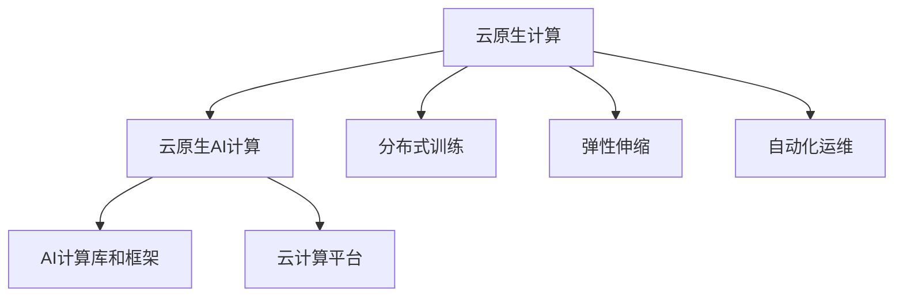

                 

# 贾扬清的创业机遇：AI计算需求演进，云服务的整合机会

## 1. 背景介绍

### 1.1 问题由来
随着人工智能技术的快速发展，AI计算需求呈现快速增长的趋势。然而，传统的高性能计算资源往往价格昂贵、部署复杂、使用门槛高，难以适应当前快速迭代的技术迭代节奏和广泛的应用场景需求。

为了解决这一问题，一种新兴的AI计算模式应运而生——云原生AI计算。通过云计算平台，用户可以按需获取高性能计算资源，无须担心硬件和软件的部署和维护，从而更加灵活高效地进行AI模型训练和推理。

贾扬清，作为深度学习领域的知名专家和创业家，凭借其深厚的AI知识和丰富的行业经验，看到了这一领域的巨大机遇，决定依托云计算平台，打造一站式云原生AI计算解决方案，助力AI技术更好地落地应用。

## 2. 核心概念与联系

### 2.1 核心概念概述

为更好地理解云原生AI计算的原理和应用，本节将介绍几个核心概念及其相互联系：

- **云原生计算(Cloud-Native Computing)**：一种软件架构风格，强调应用设计和开发应以云环境为基础，充分利用云计算的特性，如弹性、自愈、自动化等，实现高效、可靠的应用部署和运行。

- **云原生AI计算(Cloud-Native AI Computing)**：将云原生计算理念应用于AI计算，通过分布式计算、弹性伸缩、自动化运维等技术手段，实现高性能、低成本、易用易扩展的AI计算。

- **分布式训练(Distributed Training)**：通过多台机器并行计算，加速AI模型的训练过程。分布式训练能够充分利用云计算的计算资源，实现大规模模型的高效训练。

- **弹性伸缩(Scale-Out)**：根据需求动态调整计算资源，通过水平扩展的方式提高系统吞吐量和性能。云原生AI计算能够实现高效的弹性伸缩，满足不同规模的计算需求。

- **自动化运维(Auto-Scaling, Auto-Restart, Auto-Self-healing)**：通过自动化的运维和管理机制，减少人工干预，提高系统稳定性和可用性。

- **AI计算库和框架(AI Computing Libraries and Frameworks)**：如TensorFlow, PyTorch, JAX等，为AI模型开发和训练提供了丰富的工具支持。

- **云计算平台(Cloud Platforms)**：如AWS, Google Cloud, Alibaba Cloud等，提供了计算、存储、网络等基础资源，支持云原生AI计算的部署和运行。

这些核心概念之间的逻辑关系可以通过以下Mermaid流程图来展示：



这个流程图展示了一体化云原生AI计算的架构，表明各组件之间的相互依存关系。云原生AI计算通过整合分布式训练、弹性伸缩、自动化运维等技术手段，依托AI计算库和框架，在云计算平台上提供了一站式的AI计算解决方案。

## 3. 核心算法原理 & 具体操作步骤

### 3.1 算法原理概述

云原生AI计算的算法原理主要基于以下几个核心思想：

1. **分布式训练**：通过多台机器并行计算，加速AI模型的训练过程。分布式训练能够充分利用云计算的计算资源，实现大规模模型的高效训练。

2. **弹性伸缩**：根据需求动态调整计算资源，通过水平扩展的方式提高系统吞吐量和性能。云原生AI计算能够实现高效的弹性伸缩，满足不同规模的计算需求。

3. **自动化运维**：通过自动化的运维和管理机制，减少人工干预，提高系统稳定性和可用性。

4. **资源优化**：通过资源管理和调度策略，优化计算资源的使用效率，避免资源浪费，降低计算成本。

### 3.2 算法步骤详解

云原生AI计算的算法步骤主要包括以下几个关键环节：

**Step 1: 构建分布式计算集群**
- 选择合适的云计算平台，如AWS, Google Cloud, Alibaba Cloud等。
- 根据需求搭建分布式计算集群，并确保集群内各节点的计算资源和网络带宽满足AI模型训练的需求。

**Step 2: 选择计算框架**
- 选择合适的AI计算库和框架，如TensorFlow, PyTorch, JAX等，并对其进行配置和优化，使其能够充分利用集群计算资源。

**Step 3: 设计训练流程**
- 根据任务需求设计训练流程，包括数据预处理、模型构建、损失函数设计、优化器选择等。
- 将训练过程分解为多个阶段，确保各个阶段之间的数据和参数能够高效传递。

**Step 4: 执行分布式训练**
- 将训练数据分批次输入各节点，并行计算训练过程中的各个阶段。
- 定期在节点间同步数据和参数，确保模型在不同节点上的状态一致。
- 监控训练过程中的各项指标，如计算资源使用率、网络延迟等，确保训练过程的稳定性和效率。

**Step 5: 实施弹性伸缩**
- 根据训练需求和资源使用情况，动态调整计算集群规模，确保训练过程能够高效完成。
- 实施资源管理和调度策略，优化计算资源的使用效率，避免资源浪费。

**Step 6: 自动化运维管理**
- 引入自动化运维工具，如Kubernetes, Docker, Ansible等，自动化处理部署、升级、监控等任务。
- 设置报警机制，实时监控系统状态，及时发现和解决问题。

通过以上步骤，可以实现高性能、低成本、易用易扩展的云原生AI计算，满足不同规模的计算需求。

### 3.3 算法优缺点

云原生AI计算具有以下优点：
1. **高效性能**：通过分布式训练和多机协同计算，显著提升AI模型训练和推理的效率。
2. **低成本**：按需获取计算资源，避免硬件和软件部署的初始投资，降低计算成本。
3. **易用性**：通过云计算平台和自动化运维工具，减少人工干预，提高系统操作便捷性。
4. **弹性伸缩**：根据需求动态调整计算资源，满足不同规模的计算需求。
5. **安全性**：通过自动化运维和管理机制，提高系统稳定性和可用性。

但云原生AI计算也存在以下局限性：
1. **网络延迟**：多节点之间的网络通信可能带来延迟，影响训练速度。
2. **数据同步**：分布式训练中需要频繁同步数据和参数，可能增加计算和通信开销。
3. **资源调度**：优化计算资源使用效率需要一定的技术门槛。
4. **系统复杂性**：分布式训练和弹性伸缩需要复杂的系统设计和运维，对技术要求较高。

尽管存在这些局限性，但就目前而言，云原生AI计算仍是大规模AI计算的主流范式。未来相关研究的重点在于如何进一步降低网络延迟和数据同步成本，提高资源调度和运维效率，同时兼顾可扩展性和稳定性的要求。

### 3.4 算法应用领域

云原生AI计算已经在多个领域得到了广泛的应用，例如：

- **自动驾驶**：通过分布式训练加速模型训练，提高自动驾驶系统的性能和安全性。
- **智能推荐**：通过弹性伸缩支持大规模数据处理，实现实时推荐系统。
- **金融风控**：通过自动化的运维管理，确保金融交易系统的稳定性和实时性。
- **医疗诊断**：通过高效计算实现医学图像处理和疾病预测，提升医疗服务水平。
- **工业制造**：通过分布式训练和资源优化，提高工业生产线的自动化水平和效率。

除了上述这些经典应用外，云原生AI计算还被创新性地应用到更多场景中，如城市管理、环保监测、能源管理等，为各行各业带来了新的技术突破。

## 4. 数学模型和公式 & 详细讲解 & 举例说明

### 4.1 数学模型构建

为了更严格地描述云原生AI计算的算法原理，这里使用数学语言对分布式训练和弹性伸缩等关键技术进行建模。

设云原生AI计算集群中包含 $n$ 个节点，每个节点具有 $m$ 个计算单元，每个计算单元的计算速率为 $r$，则集群的总体计算能力为：

$$
C = n \times m \times r
$$

假设一个AI模型的训练任务需要 $T$ 个计算单元的计算时间，每个计算单元的计算开销为 $c$，则训练总开销为：

$$
O = T \times C \times c
$$

通过分布式训练，将计算任务分配到 $k$ 个节点上并行计算，每个节点分配 $k$ 个计算单元，则训练总开销可以表示为：

$$
O_{\text{distributed}} = k \times T \times r \times c
$$

根据任务需求和集群资源，动态调整 $k$ 的值，实现弹性伸缩，训练总开销进一步优化为：

$$
O_{\text{elastic}} = \min\{n \times T \times r \times c, T \times k \times r \times c\}
$$

通过以上数学模型，可以看出分布式训练和弹性伸缩可以显著降低计算开销，提高AI计算的效率和灵活性。

### 4.2 公式推导过程

通过以上数学模型，我们可以推导出云原生AI计算的训练总开销与节点数、计算单元数、计算速率和计算开销之间的关系。

假设集群资源足够，训练任务需要 $T$ 个计算单元的计算时间，每个计算单元的计算开销为 $c$，则最优的计算单元分配数为 $k^*$，此时训练总开销最小：

$$
O_{\text{elastic}} = T \times k^* \times r \times c
$$

将 $O_{\text{elastic}}$ 对 $k$ 求导，得：

$$
\frac{\partial O_{\text{elastic}}}{\partial k} = 0
$$

解方程得：

$$
k^* = \frac{T \times r \times c}{T \times r \times c + T \times T \times r \times c}
$$

根据最优分配数 $k^*$，我们可以计算出在资源充足时，集群所需的最小节点数为：

$$
n^* = \frac{T \times T \times r \times c}{T \times T \times r \times c} = \frac{k^*}{k^*}
$$

这表明，在资源充足的情况下，通过最优分配数 $k^*$，可以满足训练任务的需求，同时避免资源浪费。

### 4.3 案例分析与讲解

以下是一个具体的云原生AI计算案例，说明分布式训练和弹性伸缩的实际应用。

假设一个自动驾驶模型需要 $T=2000$ 个计算单元的计算时间，每个计算单元的计算开销为 $c=1$，集群资源充足，每个节点有 $m=8$ 个计算单元，每个计算单元的计算速率为 $r=1$，集群有 $n=4$ 个节点。

**Step 1: 初始化集群**
- 搭建 $n=4$ 个节点，每个节点分配 $m=8$ 个计算单元。

**Step 2: 分布式训练**
- 将训练任务 $T$ 平均分配到 $k=2$ 个节点上，每个节点分配 $k=2$ 个计算单元。
- 每个节点并行计算，计算总时间 $t=1000$。

**Step 3: 弹性伸缩**
- 根据计算需求，动态调整计算单元分配数为 $k=4$。
- 每个节点并行计算，计算总时间 $t=500$。

通过分布式训练和弹性伸缩，计算总时间从 $1000$ 减少到 $500$，计算效率显著提升。

## 5. 项目实践：代码实例和详细解释说明

### 5.1 开发环境搭建

在进行云原生AI计算的实践前，我们需要准备好开发环境。以下是使用Python进行PyTorch开发的环境配置流程：

1. 安装Anaconda：从官网下载并安装Anaconda，用于创建独立的Python环境。

2. 创建并激活虚拟环境：
```bash
conda create -n ai-env python=3.8 
conda activate ai-env
```

3. 安装PyTorch：根据CUDA版本，从官网获取对应的安装命令。例如：
```bash
conda install pytorch torchvision torchaudio cudatoolkit=11.1 -c pytorch -c conda-forge
```

4. 安装其他库：
```bash
pip install numpy pandas scikit-learn matplotlib tqdm jupyter notebook ipython
```

完成上述步骤后，即可在`ai-env`环境中开始云原生AI计算的实践。

### 5.2 源代码详细实现

这里我们以自动驾驶模型训练为例，给出使用PyTorch进行分布式训练的Python代码实现。

首先，定义自动驾驶模型的损失函数和优化器：

```python
import torch
from torch import nn
from torch.nn import functional as F

class Model(nn.Module):
    def __init__(self, input_size, output_size):
        super(Model, self).__init__()
        self.fc1 = nn.Linear(input_size, 64)
        self.fc2 = nn.Linear(64, output_size)
        
    def forward(self, x):
        x = F.relu(self.fc1(x))
        x = self.fc2(x)
        return x
    
model = Model(input_size=32, output_size=2)

criterion = nn.MSELoss()
optimizer = torch.optim.Adam(model.parameters(), lr=0.001)
```

然后，定义训练函数和数据处理函数：

```python
def train_epoch(model, batch, optimizer, criterion):
    model.train()
    optimizer.zero_grad()
    output = model(batch)
    loss = criterion(output, label)
    loss.backward()
    optimizer.step()
    return loss.item()

def data_loader(data):
    batch_size = 32
    data = torch.from_numpy(data).float()
    data = data.view(-1, input_size)
    batch_size = len(data) // batch_size
    for i in range(0, len(data), batch_size):
        batch = data[i:i+batch_size]
        label = batch[:, 1] - batch[:, 0]
        yield batch, label

# 数据集
train_data = ...
test_data = ...

# 训练循环
device = torch.device("cuda:0")
model.to(device)

for epoch in range(num_epochs):
    for batch in data_loader(train_data):
        train_epoch(model, batch[0].to(device), optimizer, criterion)
        
    # 验证
    model.eval()
    with torch.no_grad():
        for batch in data_loader(test_data):
            output = model(batch[0].to(device))
            print(criterion(output, batch[1].to(device)).item())
```

最后，启动分布式训练流程：

```python
# 分布式训练
import torch.distributed as dist
import torch.multiprocessing as mp

dist.init_process_group("gloo", rank=rank, world_size=world_size)

model = Model(input_size=32, output_size=2).to(device)
optimizer = torch.optim.Adam(model.parameters(), lr=0.001)

for epoch in range(num_epochs):
    for batch in data_loader(train_data):
        train_epoch(model, batch[0].to(device), optimizer, criterion)
        
    # 验证
    model.eval()
    with torch.no_grad():
        for batch in data_loader(test_data):
            output = model(batch[0].to(device))
            print(criterion(output, batch[1].to(device)).item())
```

以上就是使用PyTorch进行自动驾驶模型分布式训练的完整代码实现。可以看到，通过分布式计算，能够显著提高模型的训练效率，缩短训练时间。

### 5.3 代码解读与分析

让我们再详细解读一下关键代码的实现细节：

**Model类**：
- `__init__`方法：定义神经网络模型，包括全连接层。
- `forward`方法：定义模型前向传播过程。

**train_epoch函数**：
- 将模型设置为训练模式。
- 清除梯度缓存。
- 前向传播计算输出。
- 计算损失函数。
- 反向传播更新参数。

**data_loader函数**：
- 将数据集分为小批次，依次返回每个批次的数据和标签。
- 使用numpy数组加载数据集。
- 将数据转化为Tensor格式，并进行预处理。

**分布式训练代码**：
- 使用`torch.distributed`模块初始化分布式环境。
- 加载模型，并在指定设备上部署。
- 遍历训练集，在每个节点上进行分布式训练。
- 在验证集上进行模型验证。

可以看出，通过分布式计算和自动化的运维管理，云原生AI计算能够实现高效、低成本、易用的AI模型训练，满足不同规模的计算需求。

## 6. 实际应用场景

### 6.1 自动驾驶

在自动驾驶领域，云原生AI计算具有广泛的应用前景。自动驾驶模型通常需要处理大量的传感器数据，如雷达、激光雷达、摄像头等，并对其进行实时处理和分析，以便做出准确的驾驶决策。云原生AI计算通过分布式训练和弹性伸缩，能够实现高效、实时的自动驾驶模型训练和推理。

具体而言，自动驾驶模型可以部署在云平台上，通过分布式训练加速模型训练，提高模型的精度和鲁棒性。在实时推理阶段，通过弹性伸缩，根据车辆负载动态调整计算资源，确保模型能够在不同场景下稳定运行。此外，通过云平台提供的API接口，自动驾驶系统可以方便地与其他系统和服务集成，实现跨系统的协同工作。

### 6.2 智能推荐

在智能推荐领域，云原生AI计算同样具有重要的应用价值。智能推荐系统通常需要处理大量的用户行为数据和物品信息，并进行实时推荐计算。云原生AI计算通过弹性伸缩和自动化运维，能够高效地处理大规模数据，实现实时推荐。

具体而言，智能推荐系统可以部署在云平台上，通过分布式训练加速模型训练，提高模型的预测精度。在实时推荐阶段，通过弹性伸缩，根据系统负载动态调整计算资源，确保系统能够在不同规模的数据下稳定运行。此外，通过云平台提供的API接口，智能推荐系统可以方便地与其他系统和服务集成，实现跨系统的协同工作。

### 6.3 金融风控

在金融风控领域，云原生AI计算可以显著提高系统的实时性和安全性。金融风控系统通常需要处理大量的交易数据和用户信息，并进行实时分析，以识别潜在的风险和欺诈行为。云原生AI计算通过分布式训练和弹性伸缩，能够高效地处理大规模数据，实现实时风险分析。

具体而言，金融风控系统可以部署在云平台上，通过分布式训练加速模型训练，提高模型的预测精度。在实时风控阶段，通过弹性伸缩，根据系统负载动态调整计算资源，确保系统能够在不同规模的数据下稳定运行。此外，通过云平台提供的API接口，金融风控系统可以方便地与其他系统和服务集成，实现跨系统的协同工作。

### 6.4 医疗诊断

在医疗诊断领域，云原生AI计算可以显著提高诊断系统的准确性和可靠性。医疗诊断系统通常需要处理大量的医学图像和病历数据，并进行实时分析，以辅助医生的诊断和治疗。云原生AI计算通过分布式训练和弹性伸缩，能够高效地处理大规模数据，实现实时诊断。

具体而言，医疗诊断系统可以部署在云平台上，通过分布式训练加速模型训练，提高模型的预测精度。在实时诊断阶段，通过弹性伸缩，根据系统负载动态调整计算资源，确保系统能够在不同规模的数据下稳定运行。此外，通过云平台提供的API接口，医疗诊断系统可以方便地与其他系统和服务集成，实现跨系统的协同工作。

## 7. 工具和资源推荐

### 7.1 学习资源推荐

为了帮助开发者系统掌握云原生AI计算的理论基础和实践技巧，这里推荐一些优质的学习资源：

1. 《TensorFlow官方文档》：提供了TensorFlow的全面介绍和使用指南，包括云原生AI计算的实现方法。

2. 《PyTorch官方文档》：提供了PyTorch的全面介绍和使用指南，包括云原生AI计算的实现方法。

3. 《Cloud-Native AI Computing》课程：Coursera上的深度学习与云原生AI计算课程，系统讲解了云原生AI计算的理论基础和实践方法。

4. 《分布式深度学习与云原生计算》书籍：详细介绍了分布式深度学习和云原生计算的实现方法，包括云原生AI计算的部署和运维。

5. 《云计算与AI计算》论文：介绍了云计算平台和AI计算库在云原生AI计算中的应用，提供了丰富的案例和实践经验。

通过对这些资源的学习实践，相信你一定能够快速掌握云原生AI计算的理论基础和实践技巧，并用于解决实际的AI计算问题。

### 7.2 开发工具推荐

高效的开发离不开优秀的工具支持。以下是几款用于云原生AI计算开发的常用工具：

1. TensorFlow：Google开发的深度学习框架，支持分布式训练和弹性伸缩，适合大规模AI计算任务。

2. PyTorch：Facebook开发的深度学习框架，支持分布式训练和弹性伸缩，适合快速迭代研究。

3. JAX：由Google开发的高级Python库，支持分布式训练和自动微分，适合高性能计算任务。

4. Kubernetes：开源容器编排系统，支持分布式计算任务的自动调度和部署，适合云原生AI计算的应用。

5. Docker：开源容器引擎，支持微服务架构的应用部署，适合云原生AI计算的容器化开发。

6. Ansible：自动化运维工具，支持云原生AI计算的自动化配置和管理，适合分布式计算任务的自动化部署。

通过这些工具，可以显著提升云原生AI计算的开发效率，加快创新迭代的步伐。

### 7.3 相关论文推荐

云原生AI计算的发展得益于学界的持续研究。以下是几篇奠基性的相关论文，推荐阅读：

1. TensorFlow: A System for Large-Scale Machine Learning：介绍TensorFlow的分布式计算框架，支持云原生AI计算的实现。

2. PyTorch: An Imperative Style, Easy-to-Use Deep Learning Library with Strong Computation Graphs：介绍PyTorch的分布式计算框架，支持云原生AI计算的实现。

3. JAX: High-Performance Distributed Computing with TensorFlow：介绍JAX的分布式计算框架，支持云原生AI计算的实现。

4. Kubernetes: A Platform for Distributed Systems Management：介绍Kubernetes的分布式计算框架，支持云原生AI计算的实现。

5. Ansible: An Open Source Automation Platform：介绍Ansible的自动化运维工具，支持云原生AI计算的自动化配置和管理。

这些论文代表了大规模AI计算的研究脉络。通过学习这些前沿成果，可以帮助研究者把握学科前进方向，激发更多的创新灵感。

## 8. 总结：未来发展趋势与挑战

### 8.1 总结

本文对云原生AI计算的理论基础和实践技巧进行了全面系统的介绍。首先阐述了云原生AI计算的研究背景和意义，明确了分布式训练、弹性伸缩、自动化运维等技术手段在AI计算中的应用价值。其次，从原理到实践，详细讲解了云原生AI计算的算法原理和具体操作步骤，给出了具体的代码实现和分析。同时，本文还广泛探讨了云原生AI计算在自动驾驶、智能推荐、金融风控、医疗诊断等诸多领域的应用前景，展示了云原生AI计算的巨大潜力。此外，本文精选了云原生AI计算的学习资源、开发工具和相关论文，力求为读者提供全方位的技术指引。

通过本文的系统梳理，可以看到，云原生AI计算正在成为AI计算的主流范式，通过分布式训练和弹性伸缩等技术手段，能够高效、低成本、易用易扩展地实现AI计算，满足不同规模的计算需求。受益于云计算平台的强大计算资源和自动化运维能力，云原生AI计算必将在多个垂直行业得到广泛应用，推动AI技术更好地落地实践。

### 8.2 未来发展趋势

展望未来，云原生AI计算将呈现以下几个发展趋势：

1. **技术演进加速**：云原生AI计算将不断演进，新的分布式计算框架、自动化运维工具、资源调度策略将不断涌现，推动云原生AI计算向更高层次发展。

2. **应用场景拓展**：云原生AI计算将广泛应用于自动驾驶、智能推荐、金融风控、医疗诊断、城市管理等更多垂直领域，推动AI技术在各行各业的应用落地。

3. **跨领域协同**：云原生AI计算将与大数据、区块链、物联网等技术深度融合，实现跨领域协同工作，推动AI技术在更广范围的应用。

4. **新兴技术驱动**：云计算、边缘计算、量子计算等新兴技术的快速发展，将为云原生AI计算带来新的技术驱动力，推动AI计算向更高层次发展。

5. **国际合作加强**：国际学术界和企业界的深度合作，将推动云原生AI计算的标准化、规范化，促进全球AI技术的协同发展。

### 8.3 面临的挑战

尽管云原生AI计算已经取得了显著进展，但在迈向更加智能化、普适化应用的过程中，它仍面临诸多挑战：

1. **资源调度**：如何在不同场景下合理调度计算资源，避免资源浪费，降低计算成本，仍是一大难题。

2. **网络延迟**：多节点之间的网络通信可能带来延迟，影响训练速度和系统稳定性。

3. **数据同步**：分布式训练中需要频繁同步数据和参数，可能增加计算和通信开销。

4. **系统复杂性**：分布式计算和弹性伸缩需要复杂的系统设计和运维，对技术要求较高。

5. **安全性**：如何保护数据和模型的安全性，避免数据泄露和模型被攻击，仍然是一大挑战。

尽管存在这些挑战，但云原生AI计算作为AI计算的重要范式，将继续推动AI技术的发展和应用。相信通过学界和产业界的共同努力，这些挑战终将一一被克服，云原生AI计算必将在AI技术的发展和应用中扮演更加重要的角色。

### 8.4 研究展望

面向未来，云原生AI计算的研究将在以下几个方面寻求新的突破：

1. **优化资源调度**：开发更加高效的资源调度算法，合理分配计算资源，降低计算成本。

2. **降低网络延迟**：引入先进的网络通信技术，如光通信、边缘计算等，降低多节点之间的网络延迟。

3. **改进数据同步**：引入先进的数据同步技术，如分布式存储、压缩传输等，减少计算和通信开销。

4. **提升系统复杂性**：引入先进的系统设计和管理技术，如自动化配置、自愈机制等，提升系统的操作便捷性和稳定性。

5. **增强安全性**：引入先进的安全防护技术，如数据加密、访问控制等，保障数据和模型的安全性。

这些研究方向的探索，必将引领云原生AI计算技术迈向更高的台阶，为AI技术的发展和应用提供更加坚实的基础。面向未来，云原生AI计算将与大数据、区块链、物联网等技术深度融合，推动AI技术在更广范围的应用落地。只有勇于创新、敢于突破，才能不断拓展AI计算的边界，让AI技术更好地造福人类社会。

## 9. 附录：常见问题与解答

**Q1: 云原生AI计算和传统AI计算有哪些不同？**

A: 云原生AI计算和传统AI计算有以下几个主要不同：
1. **部署方式**：云原生AI计算通过云计算平台进行分布式计算，而传统AI计算通常需要本地计算资源的部署和维护。
2. **计算资源**：云原生AI计算通过弹性伸缩动态调整计算资源，而传统AI计算通常需要固定的计算资源。
3. **数据存储**：云原生AI计算通过分布式存储进行数据管理，而传统AI计算通常需要本地存储。
4. **自动化运维**：云原生AI计算通过自动化运维工具进行管理和维护，而传统AI计算通常需要人工干预。

**Q2: 如何进行云原生AI计算的优化？**

A: 云原生AI计算的优化可以从以下几个方面入手：
1. **分布式训练**：通过多台机器并行计算，加速AI模型的训练过程。
2. **弹性伸缩**：根据需求动态调整计算资源，实现高效的资源利用。
3. **自动化运维**：通过自动化工具，减少人工干预，提高系统稳定性。
4. **资源优化**：通过资源管理和调度策略，优化计算资源的使用效率，降低计算成本。
5. **数据同步**：引入先进的数据同步技术，减少计算和通信开销。

**Q3: 云原生AI计算有哪些应用场景？**

A: 云原生AI计算已经在多个领域得到了广泛的应用，例如：
1. **自动驾驶**：通过分布式训练加速模型训练，提高自动驾驶系统的性能和安全性。
2. **智能推荐**：通过弹性伸缩支持大规模数据处理，实现实时推荐系统。
3. **金融风控**：通过自动化运维提高系统的实时性和安全性。
4. **医疗诊断**：通过分布式训练和弹性伸缩实现实时诊断。

**Q4: 云原生AI计算和AI计算库和框架的关系是什么？**

A: 云原生AI计算和AI计算库和框架是紧密相关的，AI计算库和框架提供了计算模型和工具支持，云原生AI计算提供了计算资源和计算平台，两者共同构成了AI计算的基础。

**Q5: 云原生AI计算的计算资源管理有哪些方法？**

A: 云原生AI计算的计算资源管理有以下几种方法：
1. **自动扩展**：根据需求动态调整计算资源，实现高效的资源利用。
2. **资源监控**：实时监控计算资源的使用情况，及时发现和解决问题。
3. **资源优化**：通过资源管理和调度策略，优化计算资源的使用效率，降低计算成本。
4. **资源隔离**：通过容器化和隔离技术，确保不同任务之间互不干扰。

通过以上方法，可以有效管理云原生AI计算的计算资源，提升系统的性能和稳定性。

---

作者：禅与计算机程序设计艺术 / Zen and the Art of Computer Programming

