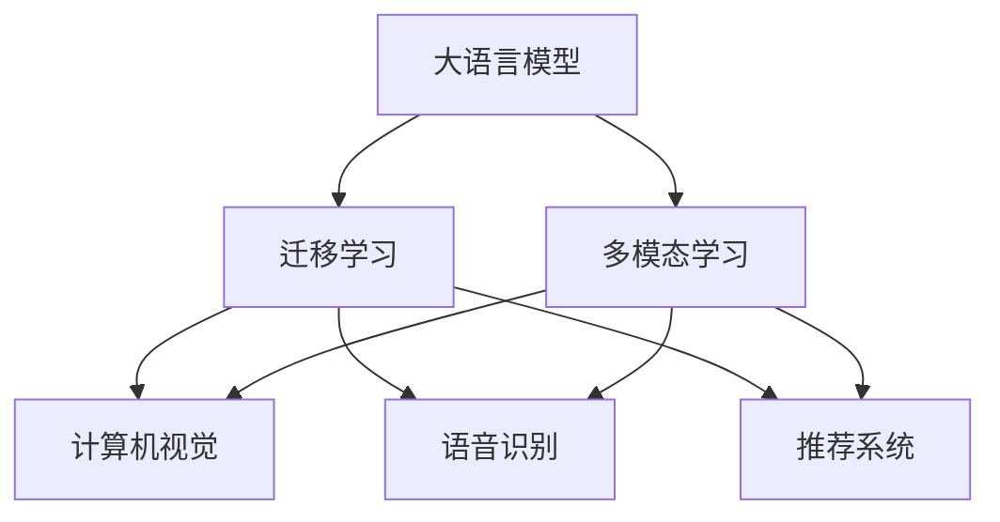

                 

# 超越语言：LLM 在非语言任务上的应用

> 关键词：大语言模型, 自然语言处理(NLP), 多模态学习, 图像处理, 语音识别, 推荐系统, 计算机视觉, 数据处理

## 1. 背景介绍

### 1.1 问题由来
近年来，人工智能领域的大语言模型（Large Language Model, LLM）在自然语言处理（Natural Language Processing, NLP）领域取得了显著的突破，如GPT、BERT等模型。这些模型在文本生成、文本分类、问答等任务上表现出色。但大语言模型也存在一定的局限性，如在非语言任务上表现不佳，无法充分利用多模态数据的信息。

非语言任务如计算机视觉、语音识别等，需要处理图像、音频等数据，与文本任务有很大的不同。但随着深度学习和迁移学习的不断发展，大语言模型开始探索在非语言任务中的应用，展示出了强大的潜力。本文将探讨大语言模型在非语言任务上的应用，包括图像处理、语音识别、推荐系统等，展示其在超越语言任务上的能力。

## 2. 核心概念与联系

### 2.1 核心概念概述

本节将介绍几个密切相关的核心概念，以便更好地理解大语言模型在非语言任务上的应用。

- 大语言模型（LLM）：以自回归（如GPT）或自编码（如BERT）模型为代表的通用预训练语言模型，能够进行文本生成、文本分类、问答等任务。
- 迁移学习：将一个领域学习到的知识迁移到另一个相关领域，如将文本任务的模型应用到非语言任务中。
- 多模态学习：处理多种类型的数据（如文本、图像、语音等），构建多模态模型，以充分利用多源数据的信息。
- 计算机视觉（CV）：研究如何通过计算机处理和分析图像，进行物体检测、分类、分割等任务。
- 语音识别（ASR）：将语音信号转化为文本，是自然语言处理的自然延伸。
- 推荐系统：通过用户行为数据，为用户推荐个性化的内容，如商品、视频等。

这些概念之间的联系可以通过以下Mermaid流程图来展示：



这个流程图展示了大语言模型与多模态学习、计算机视觉、语音识别、推荐系统等概念之间的联系，表明大语言模型在非语言任务上的应用潜力。

## 3. 核心算法原理 & 具体操作步骤
### 3.1 算法原理概述

大语言模型在非语言任务上的应用，主要通过迁移学习和多模态学习实现。其核心思想是：将大语言模型作为一个强大的特征提取器，通过迁移学习，将模型在文本任务上的能力迁移到非语言任务中。多模态学习则是在不同模态数据上分别进行特征提取，然后将这些特征融合在一起，提升模型的表现。

### 3.2 算法步骤详解

以计算机视觉任务为例，下面是基于大语言模型进行迁移学习的一般步骤：

**Step 1: 准备数据集**
- 收集目标任务的数据集，如图像分类、目标检测等。数据集应包含足够的标注信息，以便进行监督学习。

**Step 2: 选择合适的预训练模型**
- 选择适合的预训练模型，如BERT、GPT等，这些模型已经在大规模语料上进行过预训练，能够提取有意义的文本特征。

**Step 3: 设计任务适配层**
- 根据目标任务设计适配层，如分类器、检测器等。适配层的输入是预训练模型的输出，输出是目标任务的预测结果。

**Step 4: 进行迁移学习**
- 使用预训练模型对目标任务进行迁移学习，通常使用监督学习的方式，即在目标任务的数据集上进行训练。

**Step 5: 进行多模态融合**
- 将不同模态的数据输入到模型中，如文本、图像、语音等，通过多模态学习将不同模态的信息进行融合。

### 3.3 算法优缺点

基于大语言模型在非语言任务上的应用，具有以下优点：

- 模型结构简单。利用大语言模型的特征提取能力，无需构建复杂的模型架构。
- 数据需求降低。大语言模型已经在大量数据上进行过预训练，可以显著降低对标注数据的依赖。
- 通用性强。大语言模型在多种任务上的应用潜力，使其成为多模态学习的重要工具。

同时，也存在一些缺点：

- 数据质量要求高。多模态学习对数据的质量和多样性有较高要求，数据标注工作量大。
- 模型复杂度高。虽然模型结构简单，但大语言模型本身参数量巨大，对计算资源和存储空间的要求高。
- 泛化能力不足。非语言任务和文本任务差异较大，大语言模型在某些任务上的泛化能力有待提升。

### 3.4 算法应用领域

基于大语言模型在非语言任务上的应用，已经覆盖了计算机视觉、语音识别、推荐系统等多个领域，具体包括：

- 图像分类与识别：将图像数据输入到模型中，通过迁移学习进行图像分类和目标检测。
- 图像生成与编辑：利用大语言模型生成图像，进行图像风格转换、图像修复等。
- 语音识别与合成：将语音数据输入到模型中，进行语音识别和语音合成。
- 推荐系统：利用用户行为数据，结合文本信息进行推荐系统构建。
- 多模态信息融合：将不同模态的信息进行融合，构建多模态模型。

这些领域都是大语言模型在非语言任务上的应用热点，展示了其在超越语言任务上的潜力。

## 4. 数学模型和公式 & 详细讲解  
### 4.1 数学模型构建

以图像分类任务为例，大语言模型在非语言任务上的应用可以表示为：

- 输入：图像数据 $x$，图像描述文本 $t$。
- 预训练模型：$M_{\theta}$。
- 任务适配层：$F_{\phi}$。
- 损失函数：$\mathcal{L}$。
- 输出：预测标签 $y$。

其中，$t$ 为输入图像的文本描述，$F_{\phi}$ 为适配层，$y$ 为模型预测的标签。

### 4.2 公式推导过程

图像分类任务中，通常使用交叉熵损失函数，即：

$$
\mathcal{L}(y,\hat{y}) = -\frac{1}{N}\sum_{i=1}^N \log \hat{y}_i
$$

其中 $N$ 为样本数，$\hat{y}$ 为模型预测的标签，$y$ 为真实标签。

在多模态学习中，通常将图像和文本作为输入，分别提取特征，然后进行融合：

$$
x = [x_{img}, x_{text}]
$$

其中 $x_{img}$ 为图像特征，$x_{text}$ 为文本特征。

融合过程可以使用简单的拼接或Transformer等方法：

$$
z = [x_{img}, x_{text}]
$$

最终输出为：

$$
\hat{y} = F_{\phi}(z)
$$

其中 $z$ 为融合后的特征向量。

### 4.3 案例分析与讲解

以目标检测为例，假设输入为图像 $x$ 和图像描述文本 $t$，输出为目标的位置 $b$。可以使用以下公式：

$$
b = F_{\phi}(M_{\theta}(x), t)
$$

其中 $M_{\theta}(x)$ 为预训练模型对图像的特征提取，$t$ 为图像的文本描述。$F_{\phi}$ 为适配层，将特征提取和文本描述融合，生成目标位置的预测。

## 5. 项目实践：代码实例和详细解释说明
### 5.1 开发环境搭建

在进行多模态学习实践前，我们需要准备好开发环境。以下是使用Python进行PyTorch开发的环境配置流程：

1. 安装Anaconda：从官网下载并安装Anaconda，用于创建独立的Python环境。

2. 创建并激活虚拟环境：
```bash
conda create -n pytorch-env python=3.8 
conda activate pytorch-env
```

3. 安装PyTorch：根据CUDA版本，从官网获取对应的安装命令。例如：
```bash
conda install pytorch torchvision torchaudio cudatoolkit=11.1 -c pytorch -c conda-forge
```

4. 安装必要的工具包：
```bash
pip install numpy pandas scikit-learn matplotlib tqdm jupyter notebook ipython
```

完成上述步骤后，即可在`pytorch-env`环境中开始多模态学习实践。

### 5.2 源代码详细实现

下面我们以图像分类任务为例，给出使用PyTorch进行多模态学习的代码实现。

首先，定义模型和损失函数：

```python
import torch.nn as nn
import torch.optim as optim
from torchvision import datasets, transforms
from transformers import BertForSequenceClassification

class MultimodalModel(nn.Module):
    def __init__(self, hidden_size=768, num_labels=2):
        super(MultimodalModel, self).__init__()
        self.bert = BertForSequenceClassification.from_pretrained('bert-base-cased', num_labels=num_labels)
        self.fc = nn.Linear(hidden_size, num_labels)

    def forward(self, x):
        x_img = x_img_to_vector(x_img)
        x_text = x_text_to_vector(x_text)
        x = torch.cat([x_img, x_text], dim=1)
        x = self.bert(x)
        x = self.fc(x)
        return x

criterion = nn.CrossEntropyLoss()
```

接着，定义数据加载和处理函数：

```python
data_transforms = {
    'train': transforms.Compose([
        transforms.Resize(224),
        transforms.ToTensor(),
        transforms.Normalize([0.485, 0.456, 0.406], [0.229, 0.224, 0.225])
    ]),
    'val': transforms.Compose([
        transforms.Resize(224),
        transforms.ToTensor(),
        transforms.Normalize([0.485, 0.456, 0.406], [0.229, 0.224, 0.225])
    ]),
    'test': transforms.Compose([
        transforms.Resize(224),
        transforms.ToTensor(),
        transforms.Normalize([0.485, 0.456, 0.406], [0.229, 0.224, 0.225])
    ])
}

train_data = datasets.ImageFolder(root='data/train', transform=data_transforms['train'])
val_data = datasets.ImageFolder(root='data/val', transform=data_transforms['val'])
test_data = datasets.ImageFolder(root='data/test', transform=data_transforms['test'])

train_loader = torch.utils.data.DataLoader(train_data, batch_size=16, shuffle=True, num_workers=4)
val_loader = torch.utils.data.DataLoader(val_data, batch_size=16, shuffle=False, num_workers=4)
test_loader = torch.utils.data.DataLoader(test_data, batch_size=16, shuffle=False, num_workers=4)
```

然后，进行模型训练和评估：

```python
model = MultimodalModel()

optimizer = optim.Adam(model.parameters(), lr=0.001)

for epoch in range(10):
    train_loss = 0
    train_correct = 0
    for batch_idx, (inputs, targets) in enumerate(train_loader):
        inputs, targets = inputs.to(device), targets.to(device)
        optimizer.zero_grad()
        outputs = model(inputs)
        loss = criterion(outputs, targets)
        loss.backward()
        optimizer.step()
        train_loss += loss.item()
        train_correct += (outputs.argmax(dim=1) == targets).sum().item()
        if batch_idx % 100 == 0:
            print(f'Epoch [{epoch+1}/{10}], Step [{batch_idx+1}/{len(train_loader)}], Loss: {train_loss/(batch_idx+1):.4f}, Acc: {train_correct/(batch_idx+1):.4f}')

    val_loss = 0
    val_correct = 0
    with torch.no_grad():
        for batch_idx, (inputs, targets) in enumerate(val_loader):
            inputs, targets = inputs.to(device), targets.to(device)
            outputs = model(inputs)
            loss = criterion(outputs, targets)
            val_loss += loss.item()
            val_correct += (outputs.argmax(dim=1) == targets).sum().item()
            if batch_idx % 100 == 0:
                print(f'Epoch [{epoch+1}/{10}], Step [{batch_idx+1}/{len(val_loader)}], Loss: {val_loss/(batch_idx+1):.4f}, Acc: {val_correct/(batch_idx+1):.4f}')

print('Test accuracy:', (outputs.argmax(dim=1) == targets).sum().item()/len(test_loader))
```

### 5.3 代码解读与分析

让我们再详细解读一下关键代码的实现细节：

**MultimodalModel类**：
- `__init__`方法：初始化BertForSequenceClassification模型和全连接层。
- `forward`方法：将图像和文本输入模型，通过BertForSequenceClassification提取特征，然后通过全连接层生成输出。

**数据加载和处理函数**：
- 使用transforms模块对图像数据进行预处理，包括缩放、归一化等操作。
- 使用ImageFolder类加载图像数据集，并进行数据批处理。

**训练和评估函数**：
- 使用Adam优化器更新模型参数。
- 在每个epoch中，分别在训练集和验证集上进行训练和评估，输出训练损失和准确率。

**测试流程**：
- 在测试集上评估模型性能，输出测试准确率。

可以看到，PyTorch配合HuggingFace提供的Bert模型，使得多模态学习的代码实现变得简洁高效。开发者可以将更多精力放在数据处理、模型改进等高层逻辑上，而不必过多关注底层的实现细节。

当然，工业级的系统实现还需考虑更多因素，如模型的保存和部署、超参数的自动搜索、更灵活的任务适配层等。但核心的多模态学习框架基本与此类似。

## 6. 实际应用场景
### 6.1 图像分类与识别

大语言模型在图像分类与识别任务上，可以通过迁移学习的方式，显著提升模型的性能。图像分类是计算机视觉领域的基础任务之一，广泛应用于图像搜索、目标检测等场景。

在技术实现上，可以收集目标领域的图像数据，标注好类别标签，在图像和文本上进行预训练。在目标任务上进行微调，将图像数据和文本描述作为输入，提取特征并进行分类。微调后的模型可以应用于多种图像分类和识别场景，如图像标注、人脸识别、场景分类等。

### 6.2 图像生成与编辑

图像生成是大语言模型在非语言任务上的重要应用之一。大语言模型可以通过文本描述生成高质量的图像，或者对现有图像进行编辑，提升图像的多样性和艺术性。

在实现上，可以收集大量的图像和对应的文本描述，在多模态学习框架下进行训练。模型可以从文本描述中提取特征，生成对应的图像。还可以对图像进行风格转换、修复等操作，提升图像的质量和艺术性。

### 6.3 语音识别与合成

语音识别是大语言模型在自然语言处理领域的重要延伸。大语言模型可以用于语音转文本，提升语音识别的准确性和鲁棒性。

在技术实现上，可以收集大量的语音数据和对应的文本数据，进行多模态学习训练。模型可以从语音数据中提取特征，转换成对应的文本。此外，还可以利用大语言模型进行语音合成，生成自然流畅的语音，应用于语音助手、智能客服等场景。

### 6.4 推荐系统

推荐系统是大语言模型在非语言任务上的重要应用之一。大语言模型可以通过多模态学习的方式，结合用户行为数据和文本信息，提升推荐系统的个性化和准确性。

在技术实现上，可以收集用户的浏览、点击、评分等行为数据，结合用户的文本描述，进行多模态学习训练。模型可以从用户行为数据中提取特征，结合文本信息，生成推荐结果。多模态学习可以提升推荐系统的精准度和用户体验。

### 6.5 未来应用展望

随着大语言模型和迁移学习方法的不断发展，其在非语言任务上的应用将会更加广泛和深入。未来，大语言模型在非语言任务上的应用前景包括：

- 增强现实(AR)与虚拟现实(VR)：利用大语言模型进行图像识别、语音识别等，增强AR和VR体验。
- 医疗影像诊断：利用大语言模型进行医学影像的标注和分析，辅助医疗诊断。
- 智能交通：利用大语言模型进行车辆识别、路线规划等，提升智能交通系统的效率和安全性。
- 智能家居：利用大语言模型进行图像识别、语音识别等，提升家居设备的智能化水平。

## 7. 工具和资源推荐
### 7.1 学习资源推荐

为了帮助开发者系统掌握大语言模型在非语言任务上的应用，这里推荐一些优质的学习资源：

1. 《Transformer从原理到实践》系列博文：由大模型技术专家撰写，深入浅出地介绍了Transformer原理、多模态学习等前沿话题。

2. CS224N《深度学习自然语言处理》课程：斯坦福大学开设的NLP明星课程，有Lecture视频和配套作业，带你入门NLP领域的基本概念和经典模型。

3. 《Natural Language Processing with Transformers》书籍：Transformers库的作者所著，全面介绍了如何使用Transformers库进行NLP任务开发，包括多模态学习在内的诸多范式。

4. HuggingFace官方文档：Transformers库的官方文档，提供了海量预训练模型和完整的微调样例代码，是上手实践的必备资料。

5. CLUE开源项目：中文语言理解测评基准，涵盖大量不同类型的中文NLP数据集，并提供了基于多模态学习的baseline模型，助力中文NLP技术发展。

通过对这些资源的学习实践，相信你一定能够快速掌握大语言模型在非语言任务上的应用精髓，并用于解决实际的NLP问题。

### 7.2 开发工具推荐

高效的开发离不开优秀的工具支持。以下是几款用于多模态学习开发的常用工具：

1. PyTorch：基于Python的开源深度学习框架，灵活动态的计算图，适合快速迭代研究。大部分预训练语言模型都有PyTorch版本的实现。

2. TensorFlow：由Google主导开发的开源深度学习框架，生产部署方便，适合大规模工程应用。同样有丰富的预训练语言模型资源。

3. Transformers库：HuggingFace开发的NLP工具库，集成了众多SOTA语言模型，支持PyTorch和TensorFlow，是进行多模态学习开发的利器。

4. Weights & Biases：模型训练的实验跟踪工具，可以记录和可视化模型训练过程中的各项指标，方便对比和调优。与主流深度学习框架无缝集成。

5. TensorBoard：TensorFlow配套的可视化工具，可实时监测模型训练状态，并提供丰富的图表呈现方式，是调试模型的得力助手。

6. Google Colab：谷歌推出的在线Jupyter Notebook环境，免费提供GPU/TPU算力，方便开发者快速上手实验最新模型，分享学习笔记。

合理利用这些工具，可以显著提升多模态学习任务的开发效率，加快创新迭代的步伐。

### 7.3 相关论文推荐

大语言模型在非语言任务上的应用源于学界的持续研究。以下是几篇奠基性的相关论文，推荐阅读：

1. Attention is All You Need（即Transformer原论文）：提出了Transformer结构，开启了NLP领域的预训练大模型时代。

2. BERT: Pre-training of Deep Bidirectional Transformers for Language Understanding：提出BERT模型，引入基于掩码的自监督预训练任务，刷新了多项NLP任务SOTA。

3. Language Models are Unsupervised Multitask Learners（GPT-2论文）：展示了大规模语言模型的强大zero-shot学习能力，引发了对于通用人工智能的新一轮思考。

4. Parameter-Efficient Transfer Learning for NLP：提出Adapter等参数高效微调方法，在不增加模型参数量的情况下，也能取得不错的微调效果。

5. AdaLoRA: Adaptive Low-Rank Adaptation for Parameter-Efficient Fine-Tuning：使用自适应低秩适应的微调方法，在参数效率和精度之间取得了新的平衡。

6. Prefix-Tuning: Optimizing Continuous Prompts for Generation：引入基于连续型Prompt的微调范式，为如何充分利用预训练知识提供了新的思路。

这些论文代表了大语言模型在非语言任务上的发展脉络。通过学习这些前沿成果，可以帮助研究者把握学科前进方向，激发更多的创新灵感。

## 8. 总结：未来发展趋势与挑战

### 8.1 总结

本文对大语言模型在非语言任务上的应用进行了全面系统的介绍。首先阐述了多模态学习和迁移学习的研究背景和意义，明确了其在图像处理、语音识别、推荐系统等多个领域的潜力。其次，从原理到实践，详细讲解了多模态学习的数学原理和关键步骤，给出了多模态学习任务开发的完整代码实例。同时，本文还广泛探讨了多模态学习技术在图像分类、图像生成、语音识别、推荐系统等多个行业领域的应用前景，展示了其广阔的应用空间。

通过本文的系统梳理，可以看到，大语言模型在非语言任务上的应用不仅丰富了其功能，也在多个领域带来了颠覆性的变化。大语言模型通过迁移学习和多模态学习，跨越了语言和非语言的界限，展示了其在超越语言任务上的强大能力。

### 8.2 未来发展趋势

展望未来，大语言模型在非语言任务上的应用将呈现以下几个发展趋势：

1. 模型规模持续增大。随着算力成本的下降和数据规模的扩张，预训练语言模型的参数量还将持续增长。超大规模语言模型蕴含的丰富语言知识，有望支撑更加复杂多变的非语言任务。

2. 多模态学习日趋多样化。除了传统的视觉和文本，未来还会拓展到音频、视频等多模态数据的处理，构建更加全面、准确的信息整合能力。

3. 数据需求进一步降低。随着技术的发展，多模态学习模型可以利用更多的非结构化数据，减少对标注数据的依赖，降低数据处理成本。

4. 模型鲁棒性提升。未来模型将更加注重鲁棒性训练，避免灾难性遗忘，提升对未知数据的适应能力。

5. 应用场景更加广泛。大语言模型在医疗、教育、金融等领域的应用将不断扩展，带来更多行业变革。

### 8.3 面临的挑战

尽管大语言模型在非语言任务上的应用已经取得了显著成果，但在迈向更加智能化、普适化应用的过程中，仍面临以下挑战：

1. 数据质量要求高。多模态学习对数据的质量和多样性有较高要求，数据标注工作量大，获取成本高。

2. 计算资源消耗大。大语言模型在非语言任务上的计算量巨大，需要高性能的计算资源。

3. 泛化能力不足。非语言任务和文本任务差异较大，大语言模型在某些任务上的泛化能力有待提升。

4. 应用场景复杂。不同行业的非语言任务具有不同的特点，需要定制化的模型和算法。

5. 模型可解释性不足。多模态学习模型较为复杂，难以解释其内部工作机制和决策逻辑。

### 8.4 研究展望

面对多模态学习面临的挑战，未来的研究需要在以下几个方面寻求新的突破：

1. 探索无监督和半监督学习。摆脱对大规模标注数据的依赖，利用自监督学习、主动学习等无监督和半监督范式，最大限度利用非结构化数据，实现更加灵活高效的模型。

2. 研究更加高效的模型结构。开发更加参数高效和计算高效的模型结构，在保证性能的同时，减少对计算资源的消耗。

3. 引入更多的先验知识。将符号化的先验知识，如知识图谱、逻辑规则等，与神经网络模型进行融合，引导多模态学习过程，提升模型的泛化能力和解释性。

4. 结合因果分析和博弈论工具。将因果分析方法引入多模态学习模型，识别出模型决策的关键特征，增强输出的可解释性和稳定性。

5. 纳入伦理道德约束。在模型训练目标中引入伦理导向的评估指标，过滤和惩罚有偏见、有害的输出倾向，确保模型的安全性。

这些研究方向的探索，必将引领多模态学习技术迈向更高的台阶，为构建智能、安全、可靠的系统铺平道路。面向未来，大语言模型在非语言任务上的应用还需要与其他人工智能技术进行更深入的融合，如知识表示、因果推理、强化学习等，多路径协同发力，共同推动非语言处理技术的进步。

## 9. 附录：常见问题与解答

**Q1：大语言模型在非语言任务上的应用有哪些？**

A: 大语言模型在非语言任务上的应用包括图像分类与识别、图像生成与编辑、语音识别与合成、推荐系统等。这些任务展示了大语言模型在超越语言任务上的强大潜力。

**Q2：多模态学习需要哪些数据？**

A: 多模态学习需要同时包含图像、文本、语音等多源数据。数据质量要求高，需要高质量的标注信息。数据多样性要求高，需要覆盖不同的场景和任务。

**Q3：多模态学习模型如何构建？**

A: 多模态学习模型通常包括两个部分：特征提取器和任务适配层。特征提取器可以使用预训练的视觉或文本模型，如BERT、ResNet等。任务适配层根据具体任务设计，如分类器、检测器等。

**Q4：多模态学习模型的训练需要注意哪些问题？**

A: 多模态学习模型的训练需要注意以下几点：
1. 数据质量：数据质量要求高，需要高质量的标注信息。
2. 模型结构：模型结构需要充分考虑不同模态数据的特征，选择合适的特征提取器和任务适配层。
3. 计算资源：多模态学习模型的计算量巨大，需要高性能的计算资源。
4. 模型泛化：模型泛化能力需要提升，避免灾难性遗忘，适应新数据和新场景。

**Q5：多模态学习在非语言任务上的应用前景如何？**

A: 多模态学习在非语言任务上的应用前景广阔，覆盖了计算机视觉、语音识别、推荐系统等多个领域。未来，多模态学习还将拓展到更多的应用场景，如医疗影像诊断、智能交通、智能家居等，带来更多的行业变革。

---

作者：禅与计算机程序设计艺术 / Zen and the Art of Computer Programming

