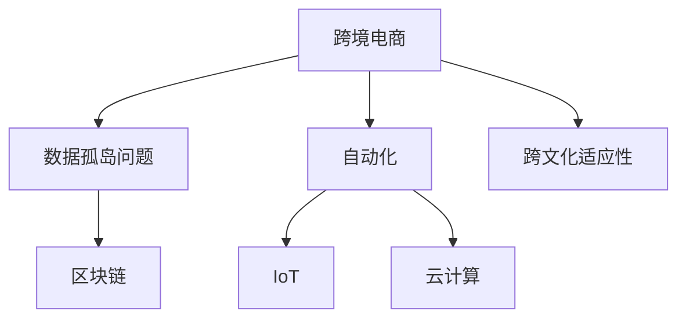

                 

# 跨境自动化创业：机遇与挑战

## 1. 背景介绍

### 1.1 问题由来
跨境电商近年来飞速发展，全球化进程的加快和互联网技术的进步使得海外市场逐渐进入普通人的视野。跨境电商的出现，让国内商家能够直接面向全球消费者销售商品，增加了销售渠道，扩大了市场规模。然而，跨境电商涉及到的多国文化和政策差异，以及复杂的物流、支付、税务等流程，给商家带来了巨大的挑战。

### 1.2 问题核心关键点
随着人工智能、大数据、云计算等新兴技术的兴起，自动化技术开始进入跨境电商领域，帮助商家提高效率、降低成本，实现全球业务运营。但自动化创业仍面临诸多挑战，如何高效开发和管理自动化系统，解决数据孤岛问题，提高跨文化适应性，是当前亟待解决的问题。

### 1.3 问题研究意义
跨境自动化创业的探索，对于推动全球化经济贸易的发展，降低企业运营成本，提升用户体验具有重要意义。自动化技术不仅能够加速跨境电商的全球扩张，还能为传统行业数字化转型提供借鉴和参考，助力各行各业向智能、高效、便捷的方向发展。

## 2. 核心概念与联系

### 2.1 核心概念概述

在探讨跨境自动化创业时，涉及到的核心概念包括：

- **跨境电商(Cross-Border E-commerce)**：通过互联网跨越国界销售商品和服务的电商模式。涉及到的跨境物流、支付、税收、清关等环节比国内电商更为复杂。

- **自动化(Automation)**：利用智能技术（如AI、机器学习、自然语言处理）自动完成各种任务，以提高效率、降低成本。

- **数据孤岛(Data Silo)**：不同系统间数据无法互通，导致数据共享和整合困难。

- **跨文化适应性(Cross-Cultural Adaptation)**：系统需适应不同地区文化的差异，提供本地化的服务。

- **区块链(Blockchain)**：一种去中心化的分布式账本技术，为跨境支付、清关提供安全、透明的解决方案。

- **物联网(IoT)**：通过传感器、智能设备收集信息，实时监控跨境物流环节，提升效率和安全性。

- **云计算(Cloud Computing)**：提供强大的计算资源，支持大规模数据处理和存储，为自动化系统提供基础设施支持。

这些概念之间相互关联，共同构成了跨境自动化创业的技术基础和应用场景。

### 2.2 核心概念原理和架构的 Mermaid 流程图



这个流程图展示了跨境电商与自动化创业中的关键概念及其相互关系。跨境电商的业务流程涉及多个环节，自动化技术通过智能技术提高各环节效率，而数据孤岛、区块链、物联网、云计算等技术则提供了具体的实现手段。跨文化适应性则是自动化系统在多个文化环境下运行的关键能力。

## 3. 核心算法原理 & 具体操作步骤
### 3.1 算法原理概述

跨境自动化创业的核心算法原理主要基于人工智能和机器学习技术，利用深度学习、自然语言处理、计算机视觉等技术，实现智能化的商品推荐、库存管理、客户服务、市场营销等业务流程的自动化。其核心在于如何通过训练模型，从海量数据中学习规律，并应用于实时业务场景。

### 3.2 算法步骤详解

1. **数据收集与预处理**：从不同国家市场收集商品信息、消费者数据、物流信息等，使用数据清洗、归一化等方法处理数据。
2. **模型训练**：选择合适的算法，如推荐算法、自然语言处理模型、图像识别模型等，在标注数据上训练模型，优化模型参数。
3. **实时预测与决策**：将训练好的模型部署到生产环境中，实时接收数据输入，进行预测与决策，并触发相应操作。
4. **评估与优化**：定期评估模型性能，收集反馈数据，优化模型参数，提升模型精度。

### 3.3 算法优缺点

**优点**：
- 提高效率：自动化技术可以大幅减少人工操作，提高业务流程效率。
- 降低成本：自动化系统减少人工成本，提高资源利用率。
- 提升用户体验：智能推荐、客户服务可以更好地满足用户需求。

**缺点**：
- 数据质量要求高：模型训练依赖于高质量的数据，数据偏差可能导致模型失效。
- 技术复杂度高：需要大量专业知识和技术积累，开发和维护成本高。
- 跨文化适应性差：自动化系统在跨文化环境下可能出现误判，需要额外优化。

### 3.4 算法应用领域

跨境自动化创业的应用领域广泛，涉及以下几个方面：

- **商品推荐与库存管理**：利用机器学习算法，分析用户行为数据，预测商品需求，优化库存策略。
- **客户服务与客服自动化**：使用自然语言处理技术，实现智能客服、自动回复等功能，提升客户满意度。
- **市场营销与广告投放**：通过分析用户数据，精准推荐广告，提高广告投放效果。
- **支付与结算**：利用区块链技术，提高跨境支付的安全性和透明度。
- **物流追踪与管理**：利用物联网技术，实时监控物流状态，优化物流流程。
- **客户数据分析**：利用数据挖掘技术，分析客户行为，提升销售转化率。

## 4. 数学模型和公式 & 详细讲解 & 举例说明

### 4.1 数学模型构建

在跨境自动化创业中，常用数学模型包括推荐算法中的协同过滤算法、自然语言处理中的序列标注模型、图像识别中的卷积神经网络等。这里以协同过滤算法为例，构建数学模型。

**协同过滤算法**：
设用户集为 $U$，商品集为 $I$，用户对商品的评分矩阵为 $R \in \mathbb{R}^{n \times m}$，其中 $n$ 为用户数，$m$ 为商品数。协同过滤算法的目标是在未评分矩阵 $R_u \in \mathbb{R}^{m \times m}$ 中预测用户 $u$ 对商品 $i$ 的评分。

数学模型为：
$$
R_u = R_u^o + \alpha \sum_{v \in U} (R_{uv} - R_{uv}^o) R_{vi}
$$

其中 $R_u^o$ 为用户 $u$ 的初始评分矩阵，$R_{uv}$ 为 $u$ 对 $v$ 商品的评分，$\alpha$ 为调和系数，控制新评分对旧评分的贡献。

### 4.2 公式推导过程

- **用户评分预测**：对每个用户 $u$，计算其对商品 $i$ 的评分预测 $R_{ui}$：
$$
R_{ui} = R_{iu}^o + \alpha \sum_{v \in U} (R_{uv} - R_{uv}^o) R_{vi}
$$

- **相似度计算**：计算用户 $u$ 和商品 $i$ 之间的相似度 $s_{ui}$：
$$
s_{ui} = \frac{\alpha}{\sqrt{|\mathcal{N}_i \times \mathcal{N}_u|}} \sum_{v \in U} (R_{uv} - R_{uv}^o) R_{vi}
$$

其中 $\mathcal{N}_i$ 和 $\mathcal{N}_u$ 分别为商品 $i$ 和用户 $u$ 的邻居集合。

- **推荐结果排序**：根据相似度 $s_{ui}$ 对商品 $i$ 进行排序，选择评分最高的前 $k$ 个商品推荐给用户 $u$。

### 4.3 案例分析与讲解

以推荐算法为例，某跨境电商平台的商品推荐系统使用协同过滤算法进行推荐。该系统在用户行为数据上进行训练，通过预测用户对未购买商品的评分，生成推荐列表。具体步骤包括：
1. 收集用户对商品的评分数据 $R$。
2. 使用协同过滤算法，预测用户 $u$ 对商品 $i$ 的评分 $R_{ui}$。
3. 根据预测评分，选择评分较高的商品，生成推荐列表。
4. 定期更新评分矩阵，提高推荐准确性。

通过推荐系统，商家能够精准推荐商品，提升用户购买率和满意度。

## 5. 项目实践：代码实例和详细解释说明

### 5.1 开发环境搭建

跨境自动化创业需要构建跨平台的自动化系统，开发环境包括：

- **Python**：常用的编程语言，支持人工智能、机器学习、数据处理等。
- **PyTorch**：深度学习框架，支持神经网络模型的训练和部署。
- **TensorFlow**：深度学习框架，支持分布式计算和大规模数据处理。
- **AWS**：云计算平台，提供弹性计算和存储资源。
- **Docker**：容器化工具，实现跨平台部署。
- **Kubernetes**：容器编排工具，管理容器化应用。

### 5.2 源代码详细实现

以推荐算法为例，使用Python和PyTorch实现协同过滤算法：

```python
import torch
import torch.nn as nn
import numpy as np
from sklearn.metrics import mean_squared_error

class协同过滤模型(nn.Module):
    def __init__(self, n_users, n_items, alpha=0.1):
        super(协同过滤模型, self).__init__()
        self.alpha = alpha
        self.user_item = nn.Embedding(n_users, 100)
        self.item_user = nn.Embedding(n_items, 100)
        self.fc = nn.Linear(200, 1)
    
    def forward(self, user_id, item_id):
        user_embed = self.user_item(user_id)
        item_embed = self.item_user(item_id)
        user_item_score = (user_embed * item_embed).sum(dim=1)
        pred_score = self.fc(user_item_score)
        return pred_score
    
    def predict(self, user_id, item_id):
        pred_score = self.forward(user_id, item_id)
        return np.squeeze(pred_score.data.numpy())
    
    def train(self, data, learning_rate=0.01, epochs=100):
        optimizer = torch.optim.Adam(self.parameters(), lr=learning_rate)
        mse = mean_squared_error
        for epoch in range(epochs):
            for user_id, item_id, true_score in data:
                pred_score = self.forward(user_id, item_id)
                loss = mse(pred_score, true_score)
                optimizer.zero_grad()
                loss.backward()
                optimizer.step()
            print(f'Epoch {epoch+1}, loss: {loss.item()}')
```

该代码实现了一个基于协同过滤算法的推荐模型，包含用户和商品嵌入层，线性回归层，支持输入用户ID和商品ID，输出预测评分。

### 5.3 代码解读与分析

- **用户和商品嵌入层**：将用户和商品ID映射到固定大小的向量表示。
- **线性回归层**：计算用户和商品的相似度，并映射到评分空间。
- **预测函数**：将模型输出转化为预测评分。
- **训练函数**：使用均方误差损失函数，梯度下降算法优化模型参数。

该模型使用AdaM优化器，学习率为0.01，训练100个epoch。训练数据以NumPy数组形式提供，包括用户ID、商品ID和真实评分。

### 5.4 运行结果展示

训练完成后，可以对新的数据进行预测：

```python
# 使用训练好的模型进行预测
model.eval()
with torch.no_grad():
    pred_scores = []
    for user_id, item_id in data:
        pred_score = model.forward(user_id, item_id)
        pred_scores.append(pred_score.item())
    print(pred_scores)
```

输出预测评分结果，可结合真实评分进行比较，评估模型性能。

## 6. 实际应用场景

### 6.1 智能客服系统

智能客服系统是跨境自动化创业的重要应用场景。跨境电商的客户服务涉及多语言和文化背景，传统的客服模式难以应对。利用自然语言处理技术，可以构建智能客服系统，提供24/7无间断服务。

具体而言，可以收集客户咨询数据，使用序列标注模型进行意图识别和实体提取，根据意图调用对应的响应模板，生成自动化回复。使用多语言模型处理多语言客户咨询，提升客服体验和满意度。

### 6.2 库存管理与预测

库存管理是跨境电商中的核心环节，涉及商品采购、存储、销售等多个环节。利用机器学习技术，可以进行库存需求预测，优化库存策略，减少库存成本。

具体流程包括：
1. 收集历史销售数据、订单数据等，构建库存需求预测模型。
2. 使用时间序列预测算法，如LSTM、ARIMA等，预测未来库存需求。
3. 根据预测结果，调整采购计划和库存水平。

### 6.3 市场营销与广告投放

市场营销是跨境电商的重要环节，如何精准投放广告，提升广告效果，是商家关注的焦点。利用数据挖掘技术，可以分析用户行为数据，预测用户兴趣，生成个性化广告。

具体步骤包括：
1. 收集用户行为数据，如浏览历史、点击记录等。
2. 使用协同过滤算法、内容过滤算法等推荐系统算法，生成个性化广告推荐。
3. 结合广告效果数据，优化广告投放策略，提高广告转化率。

### 6.4 未来应用展望

未来，跨境自动化创业将进一步拓展应用场景，涵盖更多领域。例如：
- **供应链管理**：利用物联网技术，实时监控供应链状态，优化物流路径，提升物流效率。
- **金融服务**：利用区块链技术，提供跨境支付、清关等金融服务，提升跨境交易的安全性和透明度。
- **客户关系管理**：利用自然语言处理技术，分析客户反馈数据，优化客户体验。

随着技术的发展，跨境自动化创业将实现更加智能化、高效化的运营，帮助商家降低成本，提升竞争力。

## 7. 工具和资源推荐

### 7.1 学习资源推荐

- **机器学习课程**：斯坦福大学《机器学习》课程，涵盖机器学习的基本概念和算法，适合初学者。
- **自然语言处理课程**：Rochester大学《自然语言处理》课程，涵盖自然语言处理的理论和方法，适合进阶学习。
- **深度学习框架**：PyTorch官方文档和TensorFlow官方文档，详细介绍深度学习框架的使用方法。
- **开源项目**：HuggingFace的Transformers库，提供丰富的预训练语言模型和工具。
- **书籍推荐**：《深度学习》（Ian Goodfellow）、《自然语言处理综论》（Daniel Jurafsky, James H. Martin）。

### 7.2 开发工具推荐

- **IDE**：PyCharm、Jupyter Notebook、VS Code。
- **数据处理库**：NumPy、Pandas、Scikit-Learn。
- **深度学习框架**：PyTorch、TensorFlow。
- **云计算平台**：AWS、Google Cloud、阿里云。
- **容器化工具**：Docker、Kubernetes。

### 7.3 相关论文推荐

- **协同过滤算法**：Koren, Y., & Bell, K.L. (2009). Matrix factorization techniques for recommendation systems. IEEE transactions on knowledge and data engineering, 21(11), 1263-1278.
- **自然语言处理**：Jurafsky, D., & Martin, J.H. (2019). Speech and Language Processing. Pearson Education.
- **深度学习**：Goodfellow, I., Bengio, Y., & Courville, A. (2016). Deep learning. MIT press.

## 8. 总结：未来发展趋势与挑战

### 8.1 研究成果总结

跨境自动化创业通过利用人工智能、机器学习等技术，实现了跨境电商业务的自动化，提高了效率、降低了成本，提升了用户体验。但在实际应用中，仍面临诸多挑战，如数据孤岛问题、跨文化适应性差、技术复杂度高等。

### 8.2 未来发展趋势

未来，跨境自动化创业将进一步拓展应用场景，涵盖更多领域。同时，也将面临更多挑战，如技术演进、市场竞争、法律合规等。

- **技术演进**：人工智能和机器学习技术不断发展，跨境自动化创业将利用最新技术，实现更加智能化、高效化的运营。
- **市场竞争**：跨境电商市场竞争激烈，商家需不断创新，提升产品和服务质量，获得竞争优势。
- **法律合规**：跨境电商涉及多国法律和文化，商家需严格遵守当地法律法规，确保业务合法合规。

### 8.3 面临的挑战

跨境自动化创业虽然前景广阔，但在发展过程中仍面临以下挑战：

- **数据孤岛问题**：不同系统间数据无法互通，导致数据共享和整合困难。
- **跨文化适应性差**：自动化系统在跨文化环境下可能出现误判，需要额外优化。
- **技术复杂度高**：需要大量专业知识和技术积累，开发和维护成本高。
- **法律合规问题**：跨境电商涉及多国法律和文化，商家需严格遵守当地法律法规，确保业务合法合规。
- **用户体验差**：自动化系统在提供服务时，仍需关注用户体验，避免自动化带来的不便和误解。

### 8.4 研究展望

面对跨境自动化创业所面临的挑战，未来的研究需要在以下几个方面寻求新的突破：

- **数据共享与整合**：通过数据标准化和API接口，实现系统间的无缝连接，打破数据孤岛。
- **跨文化适应性优化**：使用多语言模型和领域自适应技术，提高系统在跨文化环境下的适应能力。
- **技术简化与优化**：开发更易用、更高效的自动化工具和框架，降低开发和维护成本。
- **法律合规研究**：深入研究跨境电商的法律法规，提供合规解决方案，确保业务合法合规。
- **用户体验提升**：利用用户反馈数据，不断优化自动化系统，提升用户体验。

总之，跨境自动化创业的未来发展充满机遇和挑战。只有不断创新、优化，才能在这一领域取得突破，实现真正的全球化运营。

## 9. 附录：常见问题与解答

**Q1：跨境自动化创业需要哪些关键技术？**

A: 跨境自动化创业需要以下关键技术：
1. **人工智能与机器学习**：用于数据处理、模型训练、预测与决策。
2. **自然语言处理**：用于客户服务、市场营销等场景。
3. **区块链技术**：用于跨境支付、清关等安全场景。
4. **物联网技术**：用于实时监控物流状态。
5. **云计算技术**：用于提供弹性计算和存储资源。

**Q2：跨境自动化创业是否需要多国语言支持？**

A: 是的，跨境自动化创业需要支持多国语言，以便更好地服务全球客户。自然语言处理技术可以帮助系统处理多语言文本，提升客服、市场营销等服务的本地化水平。

**Q3：跨境自动化创业是否需要考虑法律合规问题？**

A: 是的，跨境自动化创业涉及多国法律法规，需严格遵守当地法律法规，确保业务合法合规。法律合规是跨境电商成功的关键因素之一。

**Q4：跨境自动化创业的开发难点有哪些？**

A: 跨境自动化创业的开发难点包括：
1. 数据孤岛问题：不同系统间数据无法互通，导致数据共享和整合困难。
2. 跨文化适应性差：自动化系统在跨文化环境下可能出现误判，需要额外优化。
3. 技术复杂度高：需要大量专业知识和技术积累，开发和维护成本高。
4. 用户体验差：自动化系统在提供服务时，仍需关注用户体验，避免自动化带来的不便和误解。

**Q5：跨境自动化创业的未来发展方向是什么？**

A: 跨境自动化创业的未来发展方向包括：
1. 技术演进：利用最新的人工智能和机器学习技术，实现更加智能化、高效化的运营。
2. 应用拓展：涵盖更多领域，如供应链管理、金融服务等。
3. 法律合规：深入研究跨境电商的法律法规，提供合规解决方案，确保业务合法合规。
4. 用户体验提升：利用用户反馈数据，不断优化自动化系统，提升用户体验。

通过系统性地分析跨境自动化创业的关键技术、应用场景、发展趋势和面临的挑战，本文希望为相关从业者提供有益的参考和指导。

作者：禅与计算机程序设计艺术 / Zen and the Art of Computer Programming

