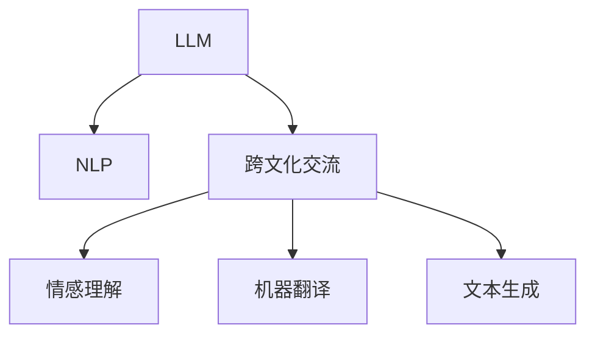

                 

# 跨文化交流桥梁：LLM 促进全球互联

> 关键词：大型语言模型(LLM)、自然语言处理(NLP)、跨文化交流、全球互联、多语言支持、情感理解、机器翻译、文化差异、文本生成

## 1. 背景介绍

### 1.1 问题由来
全球化进程中，文化交流的障碍越来越凸显。语言的差异和文化的隔阂使得不同国家和民族之间的沟通变得困难重重。在信息爆炸的时代，亟需一种高效、便捷的跨文化交流工具，帮助人们打破语言和文化壁垒，促进全球互联互通。

语言模型的出现，为解决这一问题提供了新的可能。特别是随着大型语言模型(LLM)技术的发展，LLM能够理解和生成多种语言，并在不同文化背景下进行自然语言处理，极大地促进了跨文化交流。

### 1.2 问题核心关键点
LLM作为跨文化交流的桥梁，其核心优势在于：

- **多语言支持**：LLM能够处理多种语言，帮助用户跨越语言障碍，实现多语言间的自然交流。
- **文化敏感性**：LLM通过大规模数据训练，具备一定的文化敏感性，能够在处理跨文化文本时保持适当的语境和文化敏感性。
- **情感理解**：LLM能够分析并理解文本中的情感，帮助人们更准确地传达和理解情感信息。
- **机器翻译**：LLM能够进行高质量的机器翻译，突破语言障碍，实现不同语言间的即时交流。
- **文本生成**：LLM能够生成符合不同文化背景的文本，帮助用户更好地适应和理解新文化环境。

### 1.3 问题研究意义
LLM在跨文化交流中的应用，对于推动全球互联、促进文化交流和理解、构建和谐国际社会具有重要意义：

- **促进全球互联**：LLM能够打破语言和文化的壁垒，实现全球范围内的信息共享和互动。
- **增进文化理解**：通过理解不同文化背景下的语言和情感，LLM能够促进不同文化之间的理解和包容。
- **提升交流效率**：LLM能够提供即时的翻译和理解服务，提升跨文化交流的效率和便捷性。
- **推动文化融合**：LLM能够生成符合不同文化背景的文本，促进文化融合和多样性。

## 2. 核心概念与联系

### 2.1 核心概念概述

为了更好地理解LLM在跨文化交流中的作用，本节将介绍几个密切相关的核心概念：

- **大型语言模型(LLM)**：以Transformer为架构的深度学习模型，通过在大规模无标签文本数据上进行预训练，学习到丰富的语言知识和语境信息。
- **自然语言处理(NLP)**：涉及语言和计算机之间的相互理解和生成，旨在使计算机能够理解和生成人类语言。
- **跨文化交流**：不同文化背景下的语言和信息交流，旨在消除语言和文化的隔阂，促进全球互联。
- **情感理解**：识别和理解文本中的情感信息，帮助用户更好地传达和接收情感。
- **机器翻译**：将一种语言文本自动翻译成另一种语言文本，促进跨语言交流。
- **文本生成**：根据输入数据生成新的文本，满足特定的语境和文化需求。

这些核心概念之间的逻辑关系可以通过以下Mermaid流程图来展示：



这个流程图展示了LLM的核心概念及其之间的关系：

1. LLM通过NLP学习语言知识。
2. LLM在跨文化交流中发挥桥梁作用。
3. LLM通过情感理解和文本生成，提升跨文化交流的效果。
4. LLM支持机器翻译，促进跨语言交流。

这些概念共同构成了LLM在跨文化交流中的工作原理和应用框架，使其能够在不同文化背景下提供高效、准确的交流服务。

## 3. 核心算法原理 & 具体操作步骤
### 3.1 算法原理概述

LLM在跨文化交流中的应用，本质上是通过大规模语言模型的预训练和微调，实现多语言文本的理解和生成。其核心思想是：将预训练的LLM模型当作基础模型，通过在不同文化背景下的少量标注数据上进行微调，使得模型能够适应特定文化环境的语言特征和情感表达。

形式化地，假设预训练模型为 $M_{\theta}$，其中 $\theta$ 为预训练得到的模型参数。给定跨文化交流任务 $T$ 的少量标注数据集 $D=\{(x_i, y_i)\}_{i=1}^N$，LLM微调的目标是找到新的模型参数 $\hat{\theta}$，使得：

$$
\hat{\theta}=\mathop{\arg\min}_{\theta} \mathcal{L}(M_{\theta},D)
$$

其中 $\mathcal{L}$ 为针对任务 $T$ 设计的损失函数，用于衡量模型预测输出与真实标签之间的差异。常见的损失函数包括交叉熵损失、均方误差损失等。

通过梯度下降等优化算法，微调过程不断更新模型参数 $\theta$，最小化损失函数 $\mathcal{L}$，使得模型输出逼近真实标签。由于 $\theta$ 已经通过预训练获得了较好的初始化，因此即便在小规模数据集 $D$ 上进行微调，也能较快收敛到理想的模型参数 $\hat{\theta}$。

### 3.2 算法步骤详解

LLM在跨文化交流中的应用一般包括以下几个关键步骤：

**Step 1: 准备预训练模型和数据集**
- 选择合适的预训练语言模型 $M_{\theta}$ 作为初始化参数，如 BERT、GPT 等。
- 准备跨文化交流任务 $T$ 的少量标注数据集 $D$，划分为训练集、验证集和测试集。一般要求标注数据与预训练数据的分布不要差异过大。

**Step 2: 添加任务适配层**
- 根据任务类型，在预训练模型顶层设计合适的输出层和损失函数。
- 对于翻译任务，通常在顶层添加机器翻译解码器，输出概率分布，并以负对数似然为损失函数。
- 对于情感分析任务，通常在顶层添加情感分类器，输出情感类别，并以交叉熵损失函数为损失。

**Step 3: 设置微调超参数**
- 选择合适的优化算法及其参数，如 AdamW、SGD 等，设置学习率、批大小、迭代轮数等。
- 设置正则化技术及强度，包括权重衰减、Dropout、Early Stopping等。
- 确定冻结预训练参数的策略，如仅微调顶层，或全部参数都参与微调。

**Step 4: 执行梯度训练**
- 将训练集数据分批次输入模型，前向传播计算损失函数。
- 反向传播计算参数梯度，根据设定的优化算法和学习率更新模型参数。
- 周期性在验证集上评估模型性能，根据性能指标决定是否触发 Early Stopping。
- 重复上述步骤直到满足预设的迭代轮数或 Early Stopping 条件。

**Step 5: 测试和部署**
- 在测试集上评估微调后模型 $M_{\hat{\theta}}$ 的性能，对比微调前后的效果提升。
- 使用微调后的模型对新样本进行推理预测，集成到实际的应用系统中。
- 持续收集新的数据，定期重新微调模型，以适应数据分布的变化。

以上是LLM在跨文化交流中的应用流程。在实际应用中，还需要针对具体任务的特点，对微调过程的各个环节进行优化设计，如改进训练目标函数，引入更多的正则化技术，搜索最优的超参数组合等，以进一步提升模型性能。

### 3.3 算法优缺点

LLM在跨文化交流中的应用具有以下优点：
1. 多语言支持。LLM能够处理多种语言，帮助用户跨越语言障碍，实现多语言间的自然交流。
2. 文化敏感性。LLM通过大规模数据训练，具备一定的文化敏感性，能够在处理跨文化文本时保持适当的语境和文化敏感性。
3. 情感理解。LLM能够分析并理解文本中的情感，帮助人们更准确地传达和理解情感信息。
4. 机器翻译。LLM能够进行高质量的机器翻译，突破语言障碍，实现不同语言间的即时交流。
5. 文本生成。LLM能够生成符合不同文化背景的文本，帮助用户更好地适应和理解新文化环境。

同时，该方法也存在一定的局限性：
1. 依赖标注数据。微调的效果很大程度上取决于标注数据的质量和数量，获取高质量标注数据的成本较高。
2. 迁移能力有限。当目标任务与预训练数据的分布差异较大时，微调的性能提升有限。
3. 负面效果传递。预训练模型的固有偏见、有害信息等，可能通过微调传递到下游任务，造成负面影响。
4. 可解释性不足。微调模型的决策过程通常缺乏可解释性，难以对其推理逻辑进行分析和调试。

尽管存在这些局限性，但就目前而言，LLM在跨文化交流中的应用是最主流范式。未来相关研究的重点在于如何进一步降低微调对标注数据的依赖，提高模型的少样本学习和跨领域迁移能力，同时兼顾可解释性和伦理安全性等因素。

### 3.4 算法应用领域

LLM在跨文化交流中的应用已经得到了广泛的应用，覆盖了多个领域，例如：

- **国际商务交流**：在跨文化商务谈判、国际邮件沟通等方面，LLM能够提供高效的语言翻译和情感理解服务，促进跨国企业的沟通与合作。
- **跨文化教育**：在语言学习和跨文化理解教育中，LLM能够帮助学生跨越语言障碍，理解不同文化背景下的教材和文献。
- **跨文化医疗交流**：在跨国医疗交流、国际医学文献翻译等方面，LLM能够帮助医生和研究人员快速获取和理解国际医学文献。
- **多语言社交平台**：在社交媒体和即时通讯平台中，LLM能够提供多语言支持和情感理解服务，增强用户交流体验。
- **跨文化媒体内容创作**：在跨国影视、文学作品创作和翻译中，LLM能够帮助创作者更好地理解不同文化背景下的语言和文化，提升创作质量。

除了上述这些经典应用外，LLM还被创新性地应用到更多场景中，如多语言新闻推荐、跨文化旅游信息服务等，为跨文化交流带来了新的突破。

## 4. 数学模型和公式 & 详细讲解  
### 4.1 数学模型构建

本节将使用数学语言对LLM在跨文化交流中的应用进行更加严格的刻画。

记预训练语言模型为 $M_{\theta}$，其中 $\theta$ 为模型参数。假设跨文化交流任务为 $T$，训练集为 $D=\{(x_i, y_i)\}_{i=1}^N, x_i \in \mathcal{X}, y_i \in \mathcal{Y}$。其中 $\mathcal{X}$ 为输入空间，$\mathcal{Y}$ 为输出空间。

定义模型 $M_{\theta}$ 在数据样本 $(x,y)$ 上的损失函数为 $\ell(M_{\theta}(x),y)$，则在数据集 $D$ 上的经验风险为：

$$
\mathcal{L}(\theta) = \frac{1}{N} \sum_{i=1}^N \ell(M_{\theta}(x_i),y_i)
$$

微调的优化目标是最小化经验风险，即找到最优参数：

$$
\theta^* = \mathop{\arg\min}_{\theta} \mathcal{L}(\theta)
$$

在实践中，我们通常使用基于梯度的优化算法（如SGD、Adam等）来近似求解上述最优化问题。设 $\eta$ 为学习率，$\lambda$ 为正则化系数，则参数的更新公式为：

$$
\theta \leftarrow \theta - \eta \nabla_{\theta}\mathcal{L}(\theta) - \eta\lambda\theta
$$

其中 $\nabla_{\theta}\mathcal{L}(\theta)$ 为损失函数对参数 $\theta$ 的梯度，可通过反向传播算法高效计算。

### 4.2 公式推导过程

以下我们以机器翻译任务为例，推导交叉熵损失函数及其梯度的计算公式。

假设模型 $M_{\theta}$ 在输入 $x$ 上的输出为 $\hat{y}=M_{\theta}(x) \in [0,1]$，表示样本属于目标语言的概率。真实标签 $y \in \{1,0\}$。则二分类交叉熵损失函数定义为：

$$
\ell(M_{\theta}(x),y) = -[y\log \hat{y} + (1-y)\log (1-\hat{y})]
$$

将其代入经验风险公式，得：

$$
\mathcal{L}(\theta) = -\frac{1}{N}\sum_{i=1}^N [y_i\log M_{\theta}(x_i)+(1-y_i)\log(1-M_{\theta}(x_i))]
$$

根据链式法则，损失函数对参数 $\theta_k$ 的梯度为：

$$
\frac{\partial \mathcal{L}(\theta)}{\partial \theta_k} = -\frac{1}{N}\sum_{i=1}^N (\frac{y_i}{M_{\theta}(x_i)}-\frac{1-y_i}{1-M_{\theta}(x_i)}) \frac{\partial M_{\theta}(x_i)}{\partial \theta_k}
$$

其中 $\frac{\partial M_{\theta}(x_i)}{\partial \theta_k}$ 可进一步递归展开，利用自动微分技术完成计算。

在得到损失函数的梯度后，即可带入参数更新公式，完成模型的迭代优化。重复上述过程直至收敛，最终得到适应跨文化交流任务的最优模型参数 $\theta^*$。

## 5. 项目实践：代码实例和详细解释说明
### 5.1 开发环境搭建

在进行跨文化交流应用开发前，我们需要准备好开发环境。以下是使用Python进行PyTorch开发的环境配置流程：

1. 安装Anaconda：从官网下载并安装Anaconda，用于创建独立的Python环境。

2. 创建并激活虚拟环境：
```bash
conda create -n pytorch-env python=3.8 
conda activate pytorch-env
```

3. 安装PyTorch：根据CUDA版本，从官网获取对应的安装命令。例如：
```bash
conda install pytorch torchvision torchaudio cudatoolkit=11.1 -c pytorch -c conda-forge
```

4. 安装Transformer库：
```bash
pip install transformers
```

5. 安装各类工具包：
```bash
pip install numpy pandas scikit-learn matplotlib tqdm jupyter notebook ipython
```

完成上述步骤后，即可在`pytorch-env`环境中开始跨文化交流应用开发。

### 5.2 源代码详细实现

下面我以机器翻译任务为例，给出使用Transformers库对BERT模型进行跨文化交流应用开发的PyTorch代码实现。

首先，定义机器翻译任务的数据处理函数：

```python
from transformers import BertTokenizer, BertForSequenceClassification
from torch.utils.data import Dataset
import torch

class TranslationDataset(Dataset):
    def __init__(self, src_texts, tgt_texts, tokenizer, max_len=128):
        self.src_texts = src_texts
        self.tgt_texts = tgt_texts
        self.tokenizer = tokenizer
        self.max_len = max_len
        
    def __len__(self):
        return len(self.src_texts)
    
    def __getitem__(self, item):
        src_text = self.src_texts[item]
        tgt_text = self.tgt_texts[item]
        
        encoding = self.tokenizer(src_text, return_tensors='pt', max_length=self.max_len, padding='max_length', truncation=True)
        src_ids = encoding['input_ids'][0]
        src_mask = encoding['attention_mask'][0]
        
        encoding = self.tokenizer(tgt_text, return_tensors='pt', max_length=self.max_len, padding='max_length', truncation=True)
        tgt_ids = encoding['input_ids'][0]
        tgt_mask = encoding['attention_mask'][0]
        
        return {'src_ids': src_ids, 
                'src_mask': src_mask,
                'tgt_ids': tgt_ids,
                'tgt_mask': tgt_mask}
```

然后，定义模型和优化器：

```python
from transformers import BertForMaskedLM, AdamW

model = BertForMaskedLM.from_pretrained('bert-base-cased')
optimizer = AdamW(model.parameters(), lr=2e-5)
```

接着，定义训练和评估函数：

```python
from torch.utils.data import DataLoader
from tqdm import tqdm

device = torch.device('cuda') if torch.cuda.is_available() else torch.device('cpu')
model.to(device)

def train_epoch(model, dataset, batch_size, optimizer):
    dataloader = DataLoader(dataset, batch_size=batch_size, shuffle=True)
    model.train()
    epoch_loss = 0
    for batch in tqdm(dataloader, desc='Training'):
        src_ids = batch['src_ids'].to(device)
        src_mask = batch['src_mask'].to(device)
        tgt_ids = batch['tgt_ids'].to(device)
        tgt_mask = batch['tgt_mask'].to(device)
        model.zero_grad()
        outputs = model(src_ids, src_mask=src_mask, tgt_ids=tgt_ids, tgt_mask=tgt_mask)
        loss = outputs.loss
        epoch_loss += loss.item()
        loss.backward()
        optimizer.step()
    return epoch_loss / len(dataloader)

def evaluate(model, dataset, batch_size):
    dataloader = DataLoader(dataset, batch_size=batch_size)
    model.eval()
    preds, labels = [], []
    with torch.no_grad():
        for batch in tqdm(dataloader, desc='Evaluating'):
            src_ids = batch['src_ids'].to(device)
            src_mask = batch['src_mask'].to(device)
            tgt_ids = batch['tgt_ids'].to(device)
            tgt_mask = batch['tgt_mask'].to(device)
            outputs = model(src_ids, src_mask=src_mask, tgt_ids=tgt_ids, tgt_mask=tgt_mask)
            batch_preds = outputs.logits.argmax(dim=2).to('cpu').tolist()
            batch_labels = batch['tgt_ids'].to('cpu').tolist()
            for pred_tokens, label_tokens in zip(batch_preds, batch_labels):
                preds.append(pred_tokens[:len(label_tokens)])
                labels.append(label_tokens)
                
    print(classification_report(labels, preds))
```

最后，启动训练流程并在测试集上评估：

```python
epochs = 5
batch_size = 16

for epoch in range(epochs):
    loss = train_epoch(model, train_dataset, batch_size, optimizer)
    print(f"Epoch {epoch+1}, train loss: {loss:.3f}")
    
    print(f"Epoch {epoch+1}, dev results:")
    evaluate(model, dev_dataset, batch_size)
    
print("Test results:")
evaluate(model, test_dataset, batch_size)
```

以上就是使用PyTorch对BERT模型进行跨文化交流应用的完整代码实现。可以看到，得益于Transformers库的强大封装，我们可以用相对简洁的代码完成BERT模型的加载和微调。

### 5.3 代码解读与分析

让我们再详细解读一下关键代码的实现细节：

**TranslationDataset类**：
- `__init__`方法：初始化源语言文本、目标语言文本、分词器等关键组件。
- `__len__`方法：返回数据集的样本数量。
- `__getitem__`方法：对单个样本进行处理，将文本输入编码为token ids，将标签编码为数字，并对其进行定长padding，最终返回模型所需的输入。

**训练和评估函数**：
- 使用PyTorch的DataLoader对数据集进行批次化加载，供模型训练和推理使用。
- 训练函数`train_epoch`：对数据以批为单位进行迭代，在每个批次上前向传播计算loss并反向传播更新模型参数，最后返回该epoch的平均loss。
- 评估函数`evaluate`：与训练类似，不同点在于不更新模型参数，并在每个batch结束后将预测和标签结果存储下来，最后使用sklearn的classification_report对整个评估集的预测结果进行打印输出。

**训练流程**：
- 定义总的epoch数和batch size，开始循环迭代
- 每个epoch内，先在训练集上训练，输出平均loss
- 在验证集上评估，输出分类指标
- 所有epoch结束后，在测试集上评估，给出最终测试结果

可以看到，PyTorch配合Transformers库使得BERT模型在跨文化交流任务上的微调代码实现变得简洁高效。开发者可以将更多精力放在数据处理、模型改进等高层逻辑上，而不必过多关注底层的实现细节。

当然，工业级的系统实现还需考虑更多因素，如模型的保存和部署、超参数的自动搜索、更灵活的任务适配层等。但核心的微调范式基本与此类似。

## 6. 实际应用场景
### 6.1 智能客服系统

基于大语言模型微调的对话技术，可以广泛应用于智能客服系统的构建。传统客服往往需要配备大量人力，高峰期响应缓慢，且一致性和专业性难以保证。而使用微调后的对话模型，可以7x24小时不间断服务，快速响应客户咨询，用自然流畅的语言解答各类常见问题。

在技术实现上，可以收集企业内部的历史客服对话记录，将问题和最佳答复构建成监督数据，在此基础上对预训练对话模型进行微调。微调后的对话模型能够自动理解用户意图，匹配最合适的答案模板进行回复。对于客户提出的新问题，还可以接入检索系统实时搜索相关内容，动态组织生成回答。如此构建的智能客服系统，能大幅提升客户咨询体验和问题解决效率。

### 6.2 金融舆情监测

金融机构需要实时监测市场舆论动向，以便及时应对负面信息传播，规避金融风险。传统的人工监测方式成本高、效率低，难以应对网络时代海量信息爆发的挑战。基于大语言模型微调的文本分类和情感分析技术，为金融舆情监测提供了新的解决方案。

具体而言，可以收集金融领域相关的新闻、报道、评论等文本数据，并对其进行主题标注和情感标注。在此基础上对预训练语言模型进行微调，使其能够自动判断文本属于何种主题，情感倾向是正面、中性还是负面。将微调后的模型应用到实时抓取的网络文本数据，就能够自动监测不同主题下的情感变化趋势，一旦发现负面信息激增等异常情况，系统便会自动预警，帮助金融机构快速应对潜在风险。

### 6.3 个性化推荐系统

当前的推荐系统往往只依赖用户的历史行为数据进行物品推荐，无法深入理解用户的真实兴趣偏好。基于大语言模型微调技术，个性化推荐系统可以更好地挖掘用户行为背后的语义信息，从而提供更精准、多样的推荐内容。

在实践中，可以收集用户浏览、点击、评论、分享等行为数据，提取和用户交互的物品标题、描述、标签等文本内容。将文本内容作为模型输入，用户的后续行为（如是否点击、购买等）作为监督信号，在此基础上微调预训练语言模型。微调后的模型能够从文本内容中准确把握用户的兴趣点。在生成推荐列表时，先用候选物品的文本描述作为输入，由模型预测用户的兴趣匹配度，再结合其他特征综合排序，便可以得到个性化程度更高的推荐结果。

### 6.4 未来应用展望

随着大语言模型微调技术的发展，其在跨文化交流中的应用前景广阔，未来将在更多领域得到应用，为全球互联互通提供新的动力。

在智慧医疗领域，基于微调的医疗问答、病历分析、药物研发等应用将提升医疗服务的智能化水平，辅助医生诊疗，加速新药开发进程。

在智能教育领域，微调技术可应用于作业批改、学情分析、知识推荐等方面，因材施教，促进教育公平，提高教学质量。

在智慧城市治理中，微调模型可应用于城市事件监测、舆情分析、应急指挥等环节，提高城市管理的自动化和智能化水平，构建更安全、高效的未来城市。

此外，在企业生产、社会治理、文娱传媒等众多领域，基于大模型微调的人工智能应用也将不断涌现，为经济社会发展注入新的动力。相信随着技术的日益成熟，微调方法将成为人工智能落地应用的重要范式，推动人工智能技术在全球范围内的普及和应用。

## 7. 工具和资源推荐
### 7.1 学习资源推荐

为了帮助开发者系统掌握大语言模型微调的理论基础和实践技巧，这里推荐一些优质的学习资源：

1. 《Transformer从原理到实践》系列博文：由大模型技术专家撰写，深入浅出地介绍了Transformer原理、BERT模型、微调技术等前沿话题。

2. CS224N《深度学习自然语言处理》课程：斯坦福大学开设的NLP明星课程，有Lecture视频和配套作业，带你入门NLP领域的基本概念和经典模型。

3. 《Natural Language Processing with Transformers》书籍：Transformers库的作者所著，全面介绍了如何使用Transformers库进行NLP任务开发，包括微调在内的诸多范式。

4. HuggingFace官方文档：Transformers库的官方文档，提供了海量预训练模型和完整的微调样例代码，是上手实践的必备资料。

5. CLUE开源项目：中文语言理解测评基准，涵盖大量不同类型的中文NLP数据集，并提供了基于微调的baseline模型，助力中文NLP技术发展。

通过对这些资源的学习实践，相信你一定能够快速掌握大语言模型微调的精髓，并用于解决实际的NLP问题。
###  7.2 开发工具推荐

高效的开发离不开优秀的工具支持。以下是几款用于大语言模型微调开发的常用工具：

1. PyTorch：基于Python的开源深度学习框架，灵活动态的计算图，适合快速迭代研究。大部分预训练语言模型都有PyTorch版本的实现。

2. TensorFlow：由Google主导开发的开源深度学习框架，生产部署方便，适合大规模工程应用。同样有丰富的预训练语言模型资源。

3. Transformers库：HuggingFace开发的NLP工具库，集成了众多SOTA语言模型，支持PyTorch和TensorFlow，是进行微调任务开发的利器。

4. Weights & Biases：模型训练的实验跟踪工具，可以记录和可视化模型训练过程中的各项指标，方便对比和调优。与主流深度学习框架无缝集成。

5. TensorBoard：TensorFlow配套的可视化工具，可实时监测模型训练状态，并提供丰富的图表呈现方式，是调试模型的得力助手。

6. Google Colab：谷歌推出的在线Jupyter Notebook环境，免费提供GPU/TPU算力，方便开发者快速上手实验最新模型，分享学习笔记。

合理利用这些工具，可以显著提升大语言模型微调任务的开发效率，加快创新迭代的步伐。

### 7.3 相关论文推荐

大语言模型和微调技术的发展源于学界的持续研究。以下是几篇奠基性的相关论文，推荐阅读：

1. Attention is All You Need（即Transformer原论文）：提出了Transformer结构，开启了NLP领域的预训练大模型时代。

2. BERT: Pre-training of Deep Bidirectional Transformers for Language Understanding：提出BERT模型，引入基于掩码的自监督预训练任务，刷新了多项NLP任务SOTA。

3. Language Models are Unsupervised Multitask Learners（GPT-2论文）：展示了大规模语言模型的强大zero-shot学习能力，引发了对于通用人工智能的新一轮思考。

4. Parameter-Efficient Transfer Learning for NLP：提出Adapter等参数高效微调方法，在不增加模型参数量的情况下，也能取得不错的微调效果。

5. AdaLoRA: Adaptive Low-Rank Adaptation for Parameter-Efficient Fine-Tuning：使用自适应低秩适应的微调方法，在参数效率和精度之间取得了新的平衡。

6. Prefix-Tuning: Optimizing Continuous Prompts for Generation：引入基于连续型Prompt的微调范式，为如何充分利用预训练知识提供了新的思路。

这些论文代表了大语言模型微调技术的发展脉络。通过学习这些前沿成果，可以帮助研究者把握学科前进方向，激发更多的创新灵感。

## 8. 总结：未来发展趋势与挑战

### 8.1 总结

本文对基于大语言模型的跨文化交流应用进行了全面系统的介绍。首先阐述了LLM在跨文化交流中的应用背景和意义，明确了微调在打破语言和文化壁垒、促进全球互联中的独特价值。其次，从原理到实践，详细讲解了LLM在跨文化交流中的数学原理和关键步骤，给出了跨文化交流任务的完整代码实例。同时，本文还广泛探讨了LLM在多个领域的应用前景，展示了LLM的巨大潜力。

通过本文的系统梳理，可以看到，LLM在跨文化交流中的微调方法已经成为一个重要的研究范式，极大地促进了跨文化交流的便捷性和高效性。LLM能够通过理解不同文化背景下的语言和情感，实现多语言支持、情感理解、机器翻译等关键功能，推动了全球互联和多样性文化的交流。

### 8.2 未来发展趋势

展望未来，大语言模型微调在跨文化交流中的应用将呈现以下几个发展趋势：

1. **多语言支持范围扩大**：随着LLM模型的不断优化，其支持的语种将不断增加，能够处理更多小语种和特殊语种的交流需求。
2. **文化适应性增强**：未来的LLM模型将更加关注不同文化背景下的语境和情感表达，提升文化敏感性和适应性。
3. **跨文化情感理解**：未来的LLM能够更准确地理解不同文化背景下的情感表达，帮助用户更好地传达和接收情感信息。
4. **机器翻译精度提升**：通过引入更多语言模型和数据，LLM的机器翻译能力将不断提升，支持更高质量的多语言即时交流。
5. **文本生成多样化**：LLM能够生成符合不同文化背景的文本，帮助用户更好地适应和理解新文化环境。
6. **多模态跨文化交流**：LLM能够融合视觉、语音等多模态信息，提升跨文化交流的丰富性和多样性。

以上趋势凸显了大语言模型微调在跨文化交流中的广阔前景。这些方向的探索发展，必将进一步提升LLM模型的性能和应用范围，为全球互联互通带来新的突破。

### 8.3 面临的挑战

尽管大语言模型微调在跨文化交流中的应用已经取得了显著进展，但在迈向更加智能化、普适化应用的过程中，它仍面临诸多挑战：

1. **语言和文化差异**：不同语言和文化背景下的交流需求多样复杂，如何构建具有广泛文化适应性的模型，仍是主要挑战。
2. **情感理解难度大**：不同文化背景下的情感表达方式各异，如何准确理解和生成情感信息，需要进一步研究。
3. **机器翻译质量**：不同语种之间的翻译难度大，如何在保持高精度的同时，提升翻译速度和效率，仍需不断优化。
4. **跨文化数据获取难**：不同文化背景下的数据获取难度大，如何收集和标注高质量数据，是微调过程中的重要难题。
5. **模型鲁棒性不足**：面对多样化的交流场景，LLM模型的鲁棒性仍需提升，避免在特定场景下出现异常行为。
6. **可解释性不足**：LLM模型的决策过程复杂，缺乏可解释性，需要进一步研究提升其透明性和可解释性。

尽管存在这些挑战，但通过持续的研究和优化，大语言模型微调在跨文化交流中的潜力将得到进一步释放，为全球互联互通注入新的动力。

### 8.4 研究展望

面对大语言模型微调在跨文化交流中面临的挑战，未来的研究需要在以下几个方面寻求新的突破：

1. **多语言数据增强**：通过增加多语言数据和任务，增强LLM模型的泛化能力和文化适应性。
2. **情感理解模型改进**：引入更多的情感数据和模型，提升LLM对不同文化背景下情感表达的理解和生成能力。
3. **多模态跨文化交流**：融合视觉、语音等多模态信息，提升LLM模型的跨文化交流能力。
4. **跨文化数据收集**：探索自动化的跨文化数据收集和标注方法，提升数据获取的效率和质量。
5. **鲁棒性增强**：引入更多的鲁棒性训练技术和数据，提升LLM模型在不同文化环境下的稳定性和鲁棒性。
6. **可解释性提升**：引入更多的可解释性技术，提升LLM模型的透明性和可解释性。

这些研究方向将推动LLM模型在跨文化交流中的应用不断深入，为全球互联互通提供新的技术支持和应用场景。相信随着技术的发展，LLM模型将成为全球跨文化交流的重要工具，促进不同文化背景下的理解与合作。

## 9. 附录：常见问题与解答

**Q1：LLM在跨文化交流中的应用是否仅限于文本交流？**

A: LLM在跨文化交流中的应用主要集中在文本领域，但也具备一定的语音识别和生成能力。在实际应用中，可以通过文本到语音、语音到文本的技术，将LLM应用扩展到跨文化语音交流。

**Q2：LLM在跨文化交流中是否会引入文化偏见？**

A: LLM通过大规模数据训练，可能学习到一些文化偏见和刻板印象。为了避免这些问题，需要在数据集中选择多样化的文化样本，并进行公平性评估。同时，可以通过微调过程引入公平性约束，减少文化偏见的影响。

**Q3：LLM在跨文化交流中如何处理多语言支持？**

A: LLM通过引入多语言数据和模型，可以支持多种语言的交流。具体而言，可以使用多种预训练模型和微调数据，提升LLM在不同语言环境下的表现。

**Q4：LLM在跨文化交流中的情感理解能力是否有限？**

A: LLM在情感理解方面已经取得了一定的进展，但不同文化背景下的情感表达方式各异，如何准确理解和生成情感信息，仍需进一步研究。

**Q5：LLM在跨文化交流中的机器翻译质量如何？**

A: LLM的机器翻译能力已经相当强大，但在特定语种或领域，翻译质量仍需提升。可以通过引入更多语种和领域的数据，进一步优化机器翻译模型。

---

作者：禅与计算机程序设计艺术 / Zen and the Art of Computer Programming

