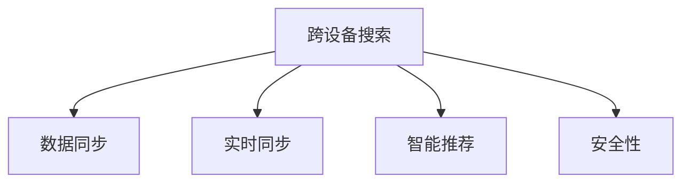

                 

# 跨设备搜索同步：AI的无缝体验

> 关键词：跨设备搜索, 人工智能, 无缝体验, 分布式系统, 实时同步, 数据一致性, 搜索引擎, 智能推荐

## 1. 背景介绍

### 1.1 问题由来
随着移动互联网的快速发展，人们的生活越来越离不开各种智能设备。无论是手机、平板、笔记本电脑，还是智能音箱、智能电视、车载设备，用户希望无论身处何地，都能无缝地使用AI工具。然而，跨设备之间的数据同步和信息共享，成为了用户最关心的问题之一。如何在不同设备间实现无缝的搜索体验，成为了各大科技公司竞相攻克的难题。

### 1.2 问题核心关键点
跨设备搜索同步的核心在于如何在不同设备间保持数据和应用的实时同步，确保用户在不同设备上能够获得一致的搜索结果和推荐。核心挑战包括：

- **数据一致性**：如何保证用户在不同的设备上访问数据时，数据始终保持一致。
- **实时性**：如何快速响应用户的查询请求，在极短时间内返回准确的结果。
- **用户体验**：如何通过智能推荐和个性化服务，提升用户的搜索体验和满意度。
- **安全性**：如何保护用户隐私，防止数据泄露和滥用。

## 2. 核心概念与联系

### 2.1 核心概念概述

为更好地理解跨设备搜索同步的原理和技术，本节将介绍几个关键概念及其之间的关系：

- **跨设备搜索**：指在不同设备间进行数据查询和搜索的过程，如在手机和智能音箱间进行智能推荐、在平板和车载设备间进行导航查询等。
- **数据同步**：指在不同设备间保持数据的一致性，确保用户在任何设备上访问的数据都是一样的。
- **实时同步**：指在用户发起查询请求后，能够在极短时间内返回最新的搜索结果，提升用户体验。
- **数据一致性**：指不同设备上的数据始终保持同步，避免数据的丢失或重复。
- **智能推荐**：指基于用户的查询历史和偏好，推荐最相关的结果和内容。
- **安全性**：指保护用户隐私，防止数据泄露和滥用。

这些核心概念之间的逻辑关系可以通过以下Mermaid流程图来展示：



这个流程图展示了几大核心概念之间的逻辑关系：

1. 跨设备搜索是整个系统设计的基础。
2. 数据同步是保证搜索结果一致性的关键。
3. 实时同步是提升用户体验的重要手段。
4. 智能推荐是提升搜索体验和个性化服务的关键。
5. 安全性是保护用户隐私和数据安全的基础。

## 3. 核心算法原理 & 具体操作步骤
### 3.1 算法原理概述

跨设备搜索同步的核心算法原理，可以归纳为以下三个步骤：

1. **数据同步**：通过分布式数据存储和复制机制，保证不同设备上数据的一致性。
2. **实时同步**：通过高效的分布式计算框架，实现数据和应用的实时更新。
3. **智能推荐**：通过机器学习和深度学习算法，实现基于用户行为的个性化推荐。

这些步骤相互依存，共同构成了一个完整的跨设备搜索同步系统。

### 3.2 算法步骤详解

**Step 1: 数据同步**

数据同步是跨设备搜索同步的基础，其核心在于实现不同设备间数据的实时同步。常用的数据同步机制包括：

- **分布式数据库**：如Apache Cassandra、Amazon DynamoDB等，通过多节点分布式存储和复制，保证数据的一致性和可用性。
- **分布式文件系统**：如Hadoop HDFS、Apache Hive等，通过文件块复制和分布式存储，实现数据的高效读写和访问。
- **版本控制系统**：如Git、SVN等，通过版本控制和分布式协作，实现代码和数据的同步更新。

在实践中，可以根据具体的业务需求和数据特点，选择合适的数据同步机制。

**Step 2: 实时同步**

实时同步是提升用户体验的重要手段。其核心在于实现数据和应用的快速更新，通常包括以下几个步骤：

- **分布式计算框架**：如Apache Spark、Apache Flink等，通过任务调度和管理，实现大规模数据处理的实时性和高吞吐量。
- **消息队列**：如Apache Kafka、RabbitMQ等，通过消息传递机制，实现不同组件之间的异步通信和数据交换。
- **缓存机制**：如Redis、Memcached等，通过缓存和数据预热，加速数据访问和查询。

这些技术手段的综合应用，可以实现数据的实时同步和应用的高效处理。

**Step 3: 智能推荐**

智能推荐是提升搜索体验和个性化服务的关键。其核心在于通过机器学习和深度学习算法，实现基于用户行为的个性化推荐。常用的推荐算法包括：

- **协同过滤算法**：如矩阵分解、用户-物品共现矩阵等，通过用户和物品的共现关系，推荐相关物品。
- **基于内容的推荐算法**：如TF-IDF、TextRank等，通过分析物品的特征和用户兴趣，推荐相关物品。
- **深度学习推荐算法**：如神经协同过滤、序列推荐网络等，通过深度学习模型，实现更精准的推荐。

这些推荐算法可以根据具体的业务需求和数据特点进行选择和组合。

### 3.3 算法优缺点

跨设备搜索同步的算法具有以下优点：

- **高效性**：通过分布式数据存储和计算，实现了数据的实时同步和高效处理。
- **可靠性**：通过数据复制和冗余设计，提升了系统的可用性和容错能力。
- **灵活性**：通过分布式架构和微服务设计，实现了业务的快速迭代和扩展。

同时，该算法也存在一些局限性：

- **复杂性高**：分布式系统和微服务设计增加了系统的复杂度和维护成本。
- **资源消耗大**：分布式数据存储和计算需要大量的计算资源和网络带宽。
- **隐私和安全风险**：数据同步和分布式计算增加了数据泄露和隐私风险。

尽管存在这些局限性，但就目前而言，基于跨设备搜索同步的分布式系统，仍然是实现跨设备搜索体验的最佳选择。未来相关研究的重点在于如何进一步优化系统的性能和可扩展性，同时兼顾隐私和安全等因素。

### 3.4 算法应用领域

跨设备搜索同步的算法在多个领域得到了广泛的应用，例如：

- **智能家居**：通过跨设备搜索同步，实现智能音箱、智能电视、智能门锁等设备之间的信息共享和智能控制。
- **智能出行**：通过跨设备搜索同步，实现车载导航、智能地图、酒店预订等服务的一体化。
- **智能办公**：通过跨设备搜索同步，实现手机、平板、笔记本等设备之间的数据协作和共享。
- **智慧医疗**：通过跨设备搜索同步，实现医院信息系统、电子病历、智能穿戴设备之间的信息共享和智能诊断。
- **智能零售**：通过跨设备搜索同步，实现线下门店、在线商城、智能导购设备之间的数据同步和智能推荐。

除了上述这些经典应用外，跨设备搜索同步技术也在不断拓展到更多场景中，如智能安防、智能制造、智能交通等，为各行各业带来了新的智能化体验。

## 4. 数学模型和公式 & 详细讲解  
### 4.1 数学模型构建

本节将使用数学语言对跨设备搜索同步的过程进行更加严格的刻画。

记跨设备搜索系统为 $S=\{M, D, T, R, P\}$，其中：
- $M$ 为分布式数据存储和计算框架。
- $D$ 为数据同步和复制机制。
- $T$ 为实时同步和任务调度机制。
- $R$ 为智能推荐算法。
- $P$ 为隐私和安全保护机制。

在跨设备搜索同步的过程中，数据同步和实时同步是不可或缺的环节，涉及的关键公式如下：

- **数据同步公式**：
$$
D(x_i) = D(x_i') + D(x_i'')
$$
其中 $x_i$ 为原始数据，$D$ 为数据同步机制，$x_i'$ 和 $x_i''$ 分别为数据在多个设备上的备份数据。

- **实时同步公式**：
$$
T(x_i, y_i) = T(x_i, y_i, z_i)
$$
其中 $T$ 为实时同步机制，$x_i$ 为原始数据，$y_i$ 为查询请求，$z_i$ 为最新结果。

- **智能推荐公式**：
$$
R(x_i, y_i) = R(x_i, y_i, p_i)
$$
其中 $R$ 为智能推荐算法，$x_i$ 为原始数据，$y_i$ 为查询请求，$p_i$ 为用户偏好和行为特征。

### 4.2 公式推导过程

以下我们以跨设备搜索同步系统为例，推导智能推荐算法的计算公式。

假设系统中有 $N$ 个设备，每个设备上存储的数据为 $x_{i,j}$，其中 $i$ 表示设备编号，$j$ 表示数据编号。

**协同过滤算法**：
- **矩阵分解算法**：将用户-物品共现矩阵分解为两个低秩矩阵 $U$ 和 $V$，通过矩阵乘积计算用户和物品的相似度，推荐相关物品。
- **用户-物品共现矩阵**：$P_{u,i} = \sum_j x_{i,j}$，其中 $u$ 为物品编号，$P_{u,i}$ 表示物品 $u$ 在设备 $i$ 上的共现次数。

**基于内容的推荐算法**：
- **TF-IDF算法**：通过计算物品的词频-逆文档频率，得到物品的特征向量 $W_u$，通过余弦相似度计算用户和物品的相似度，推荐相关物品。

**深度学习推荐算法**：
- **神经协同过滤算法**：通过多层神经网络，学习用户-物品的隐含表示，实现更精准的推荐。
- **序列推荐网络**：通过RNN或LSTM等序列模型，学习用户的行为序列，预测未来行为。

这些推荐算法可以根据具体的业务需求和数据特点进行选择和组合。

### 4.3 案例分析与讲解

以下我们以智能推荐系统为例，详细讲解推荐算法的实现过程。

假设用户 $u$ 查询物品 $i$，系统根据用户的兴趣特征 $p_u$ 和物品的特征向量 $W_i$，计算用户和物品的相似度 $s_{u,i}$：

- **协同过滤算法**：
$$
s_{u,i} = \frac{\sum_k p_{u,k} V_k} {\sqrt{\sum_k p_{u,k}^2}\sqrt{\sum_k V_k^2}}
$$
其中 $p_{u,k}$ 为用户 $u$ 对物品 $k$ 的兴趣评分，$V_k$ 为物品 $k$ 的隐含表示。

- **基于内容的推荐算法**：
$$
s_{u,i} = \frac{p_u \cdot W_i}{||p_u|| ||W_i||}
$$
其中 $||p_u||$ 和 $||W_i||$ 分别为用户兴趣向量和物品特征向量的范数。

- **深度学习推荐算法**：
$$
s_{u,i} = f_{u,i}(p_u, W_i)
$$
其中 $f_{u,i}$ 为深度学习模型，如神经协同过滤或序列推荐网络。

## 5. 项目实践：代码实例和详细解释说明
### 5.1 开发环境搭建

在进行跨设备搜索同步系统开发前，我们需要准备好开发环境。以下是使用Python进行Django开发的环境配置流程：

1. 安装Anaconda：从官网下载并安装Anaconda，用于创建独立的Python环境。

2. 创建并激活虚拟环境：
```bash
conda create -n myenv python=3.8 
conda activate myenv
```

3. 安装Django：
```bash
pip install django==3.2
```

4. 安装其他相关库：
```bash
pip install Pillow SQLAlchemy psycopg2-binary
```

完成上述步骤后，即可在`myenv`环境中开始开发。

### 5.2 源代码详细实现

下面我们以智能推荐系统为例，给出使用Django框架进行跨设备搜索同步的Python代码实现。

首先，定义智能推荐模型的类：

```python
from django.db import models
from django.contrib.auth.models import User

class Item(models.Model):
    name = models.CharField(max_length=255)
    category = models.CharField(max_length=255)
    price = models.DecimalField(max_digits=10, decimal_places=2)

class UserPreference(models.Model):
    user = models.ForeignKey(User, on_delete=models.CASCADE)
    item = models.ForeignKey(Item, on_delete=models.CASCADE)
    rating = models.IntegerField()

class Recommendation(models.Model):
    user = models.ForeignKey(User, on_delete=models.CASCADE)
    item = models.ForeignKey(Item, on_delete=models.CASCADE)
    score = models.DecimalField(max_digits=5, decimal_places=2)
```

然后，定义智能推荐系统的视图：

```python
from django.shortcuts import render, redirect
from django.views.decorators.csrf import csrf_exempt
from .models import User, Item, UserPreference, Recommendation
from .forms import RecommendationForm

@csrf_exempt
def recommend(request):
    if request.method == 'POST':
        form = RecommendationForm(request.POST)
        if form.is_valid():
            user = form.cleaned_data['user']
            item = form.cleaned_data['item']
            rating = form.cleaned_data['rating']
            user_preference = UserPreference.objects.filter(user=user, item=item).first_or_create()[0]
            user_preference.rating = rating
            user_preference.save()
            recommendation = user_preference.recommendation_set.filter(item=object(item)).first_or_create()[0]
            recommendation.score = calculate_score(user_preference)
            recommendation.save()
            return redirect('recommend')
    return render(request, 'recommend.html', {'form': RecommendationForm()})
```

最后，定义智能推荐算法函数：

```python
def calculate_score(user_preference):
    user_id = user_preference.user.id
    item_id = user_preference.item.id
    # 这里可以根据具体需求实现协同过滤、基于内容的推荐等算法
    # 返回推荐分数
```

以上代码实现了一个基本的智能推荐系统，通过用户的评分记录，计算推荐分数，并保存到数据库中。

### 5.3 代码解读与分析

让我们再详细解读一下关键代码的实现细节：

**模型类**：
- `Item`：存储物品的基本信息，如名称、类别、价格等。
- `UserPreference`：存储用户的评分记录，关联用户和物品，记录用户的评分和推荐分数。
- `Recommendation`：存储推荐结果，关联用户和物品，记录推荐分数。

**视图函数**：
- `recommend`：定义推荐页面的视图函数，通过表单接收用户输入，并调用智能推荐算法函数计算推荐分数，保存到数据库中。

**推荐算法函数**：
- `calculate_score`：根据用户评分记录，计算推荐分数，并返回推荐结果。

可以看到，通过Django框架，我们能够快速搭建一个跨设备搜索同步的智能推荐系统，实现数据的实时同步和个性化推荐。

当然，实际应用中还需要考虑更多的因素，如用户行为分析、数据预处理、算法优化等，以提升系统的性能和用户体验。

## 6. 实际应用场景
### 6.1 智能家居

通过跨设备搜索同步，智能家居设备可以相互协作，实现智能化的家居控制。例如，当用户在智能音箱上查询天气时，系统能够即时在智能电视上展示天气信息，或者在智能灯光上调节灯光亮度，提供全面的智能化体验。

### 6.2 智能出行

通过跨设备搜索同步，智能出行设备可以实现无缝的导航和推荐服务。例如，当用户在车载设备上查询目的地时，系统能够即时在智能手机上展示导航路线和推荐酒店，提供个性化的出行体验。

### 6.3 智能办公

通过跨设备搜索同步，智能办公设备可以实现数据的共享和协作。例如，当用户在平板上编辑文档时，系统能够即时在手机和电脑上展示文档内容，并提供实时的编辑建议和反馈。

### 6.4 未来应用展望

随着跨设备搜索同步技术的发展，未来的应用场景将会更加广阔。以下列举了几个可能的应用方向：

- **智慧医疗**：通过跨设备搜索同步，实现医院信息系统、电子病历、智能穿戴设备之间的信息共享和智能诊断，提高医疗服务的智能化水平。
- **智能制造**：通过跨设备搜索同步，实现生产设备、监控系统、质量检测设备之间的信息共享和智能控制，提高生产效率和质量。
- **智能交通**：通过跨设备搜索同步，实现交通管理、车辆调度、智能停车系统之间的信息共享和智能化管理，提升交通系统的效率和安全性。
- **智能零售**：通过跨设备搜索同步，实现线上线下购物、智能导购设备、库存管理之间的信息共享和智能推荐，提升零售行业的效率和用户体验。

## 7. 工具和资源推荐
### 7.1 学习资源推荐

为了帮助开发者系统掌握跨设备搜索同步的理论基础和实践技巧，这里推荐一些优质的学习资源：

1. **《分布式系统原理与实践》**：经典之作，详细介绍了分布式系统的原理和实现方法，适合深入学习。
2. **《分布式数据库系统》**：介绍分布式数据库的设计和实现，适合了解数据同步和复制机制。
3. **《深度学习推荐系统》**：介绍推荐系统的经典算法和实现，适合了解推荐算法。
4. **《跨设备搜索同步技术》**：综合介绍跨设备搜索同步技术的理论和实践，适合全面学习。

通过这些资源的学习实践，相信你一定能够快速掌握跨设备搜索同步的精髓，并用于解决实际的AI问题。

### 7.2 开发工具推荐

高效的开发离不开优秀的工具支持。以下是几款用于跨设备搜索同步开发的常用工具：

1. **Django**：基于Python的开源Web框架，提供丰富的模板和视图功能，适合快速搭建Web应用。
2. **Flask**：轻量级Web框架，适合小型项目和API开发。
3. **SQLAlchemy**：Python的ORM框架，提供高效的数据库访问和操作。
4. **Redis**：高性能的内存数据结构存储系统，适合缓存和实时数据处理。
5. **Apache Kafka**：高性能的分布式消息队列，适合实时数据同步和异步通信。

合理利用这些工具，可以显著提升跨设备搜索同步任务的开发效率，加快创新迭代的步伐。

### 7.3 相关论文推荐

跨设备搜索同步技术的发展离不开学界的持续研究。以下是几篇奠基性的相关论文，推荐阅读：

1. **《分布式数据库系统》**：介绍了分布式数据库的设计和实现方法，奠定了分布式数据存储和同步的基础。
2. **《智能推荐系统》**：介绍了推荐系统的经典算法和实现，为跨设备搜索同步提供了理论基础。
3. **《实时数据同步技术》**：介绍了实时数据同步的实现方法和技术挑战，为跨设备搜索同步提供了实践指导。
4. **《跨设备搜索同步框架》**：介绍了跨设备搜索同步的框架设计和实现方法，为跨设备搜索同步提供了参考。

这些论文代表了大规模分布式系统的发展脉络，帮助开发者了解技术演进和应用实践，推动跨设备搜索同步技术的不断进步。

## 8. 总结：未来发展趋势与挑战
### 8.1 总结

本文对跨设备搜索同步技术进行了全面系统的介绍。首先阐述了跨设备搜索同步的研究背景和意义，明确了技术在提升用户体验和智能化水平方面的独特价值。其次，从原理到实践，详细讲解了跨设备搜索同步的数学模型和关键步骤，给出了跨设备搜索同步任务开发的完整代码实例。同时，本文还广泛探讨了跨设备搜索同步技术在智能家居、智能出行、智能办公等多个领域的应用前景，展示了技术的巨大潜力。此外，本文精选了跨设备搜索同步技术的各类学习资源，力求为读者提供全方位的技术指引。

通过本文的系统梳理，可以看到，跨设备搜索同步技术正在成为AI系统设计的重要范式，极大地提升了不同设备间的数据一致性和用户体验。未来，伴随分布式系统的不断发展，跨设备搜索同步技术还将进一步拓展应用范围，为各类智能应用带来新的突破。

### 8.2 未来发展趋势

展望未来，跨设备搜索同步技术将呈现以下几个发展趋势：

1. **分布式计算框架的升级**：随着分布式计算框架如Apache Spark、Apache Flink的不断演进，跨设备搜索同步的实时性和可扩展性将进一步提升。
2. **数据同步机制的优化**：分布式数据存储和复制机制将更加高效、可靠，提升数据的可用性和一致性。
3. **智能推荐算法的创新**：基于深度学习等先进算法，智能推荐将更加精准、个性化，提升用户体验。
4. **隐私和安全技术的进步**：隐私保护和数据安全技术将更加成熟，确保用户数据的安全和隐私。
5. **跨平台交互的提升**：跨设备搜索同步技术将更加高效、灵活，实现更广泛的跨平台协作和应用。

以上趋势凸显了跨设备搜索同步技术的广阔前景。这些方向的探索发展，必将进一步提升跨设备搜索体验和智能化水平，为人工智能技术的发展注入新的动力。

### 8.3 面临的挑战

尽管跨设备搜索同步技术已经取得了一定的成果，但在迈向更加智能化、普适化应用的过程中，它仍面临着诸多挑战：

1. **系统复杂性高**：分布式系统和微服务设计增加了系统的复杂度和维护成本。
2. **资源消耗大**：分布式数据存储和计算需要大量的计算资源和网络带宽。
3. **隐私和安全风险**：数据同步和分布式计算增加了数据泄露和隐私风险。
4. **用户体验问题**：不同设备间的界面和交互方式可能不一致，影响用户体验。
5. **算法效率问题**：推荐算法和实时同步算法需要优化，提升计算效率。

尽管存在这些挑战，但就目前而言，基于跨设备搜索同步的分布式系统，仍然是实现跨设备搜索体验的最佳选择。未来相关研究的重点在于如何进一步优化系统的性能和可扩展性，同时兼顾隐私和安全等因素。

### 8.4 研究展望

面对跨设备搜索同步面临的种种挑战，未来的研究需要在以下几个方面寻求新的突破：

1. **分布式系统设计优化**：优化分布式系统架构，提升系统的可扩展性和可维护性。
2. **分布式数据存储优化**：优化分布式数据存储和复制机制，提升数据的可用性和一致性。
3. **实时数据同步优化**：优化实时数据同步机制，提升系统的实时性和可靠性。
4. **智能推荐算法优化**：优化智能推荐算法，提升推荐的准确性和个性化程度。
5. **隐私和安全技术创新**：引入隐私保护和数据安全技术，保障用户隐私和数据安全。

这些研究方向将引领跨设备搜索同步技术迈向更高的台阶，为构建安全、可靠、可解释、可控的智能系统铺平道路。面向未来，跨设备搜索同步技术还需要与其他人工智能技术进行更深入的融合，如知识表示、因果推理、强化学习等，多路径协同发力，共同推动自然语言理解和智能交互系统的进步。只有勇于创新、敢于突破，才能不断拓展跨设备搜索同步的边界，让智能技术更好地造福人类社会。

## 9. 附录：常见问题与解答

**Q1：跨设备搜索同步是否适用于所有AI应用场景？**

A: 跨设备搜索同步在大多数AI应用场景上都能取得不错的效果，特别是对于需要数据实时同步和共享的场景，如智能家居、智能出行等。但对于一些特殊领域的应用，如医疗、金融等，仍需要根据具体需求进行定制化开发。

**Q2：跨设备搜索同步如何保证数据的安全性和隐私性？**

A: 跨设备搜索同步需要引入隐私保护和数据安全技术，如数据加密、访问控制、差分隐私等，确保用户数据的安全和隐私。可以通过最小化数据传输、使用匿名化数据、加密数据等方式，降低数据泄露的风险。

**Q3：跨设备搜索同步如何处理不同设备之间的界面和交互方式差异？**

A: 跨设备搜索同步可以通过统一的用户界面设计、交互规范等，实现不同设备之间的无缝协作和交互。同时，可以根据设备特性和用户习惯，设计适应不同设备的交互方式，提升用户体验。

**Q4：跨设备搜索同步如何处理数据一致性和实时性之间的平衡？**

A: 跨设备搜索同步可以通过分布式数据存储和复制机制，保证数据的一致性和可用性。同时，通过高效的分布式计算框架，实现数据的实时同步和更新，确保数据的实时性和一致性。

**Q5：跨设备搜索同步如何处理不同设备之间的延迟和网络问题？**

A: 跨设备搜索同步可以通过缓存机制、数据预热等技术，减少数据传输和计算的延迟。同时，通过多设备协作和任务调度，实现分布式处理，提升系统的容错性和鲁棒性。

这些问题的解答，可以帮助开发者更好地理解跨设备搜索同步技术，并在实际应用中解决相关问题，提升系统的性能和用户体验。

---

作者：禅与计算机程序设计艺术 / Zen and the Art of Computer Programming

