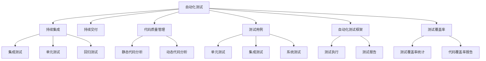

                 

# 软件测试自动化：提高代码质量和效率

> 关键词：软件测试自动化, 持续集成, 持续交付, 代码质量管理, 测试用例, 自动化测试框架, 测试覆盖率

## 1. 背景介绍

### 1.1 问题由来
在软件开发过程中，软件测试是确保代码质量和功能正确性的重要环节。然而，传统的人工测试方法效率低下，容易出现人为错误，且难以全面覆盖代码的所有角落。特别是在软件规模不断扩大，版本迭代速度加快的今天，如何提高测试效率，确保软件质量，成为了软件开发过程中的重要挑战。

软件测试自动化正是在这种背景下应运而生的。通过自动化工具和技术，软件测试可以更高效、更全面、更精确地完成，大大降低了人力和时间成本，提升了软件交付速度和质量。

### 1.2 问题核心关键点
软件测试自动化的核心在于，通过自动化的测试工具和框架，将测试任务由人工转变为计算机执行，以提高测试效率和质量。其关键点包括：
1. 自动化测试工具的选择和配置。
2. 测试用例的设计和编写。
3. 持续集成和持续交付(CI/CD)的实施。
4. 测试覆盖率的监控和管理。
5. 自动化测试的维护和优化。

通过合理地应用这些关键点，可以实现软件测试的自动化，提高代码质量和效率，加速软件交付周期。

### 1.3 问题研究意义
软件测试自动化的研究具有重要意义：
1. 提高软件质量。自动化测试可以全面、精确地覆盖代码，发现潜在的缺陷和漏洞，确保软件的稳定性和可靠性。
2. 加速软件开发。通过自动化测试，可以减少人为错误，缩短测试周期，加速软件交付。
3. 降低成本。自动化测试可以减少人工测试成本，提升团队效率，带来可观的经济效益。
4. 提升用户体验。高质量的软件交付，可以减少因缺陷导致的用户投诉，提升用户满意度。
5. 支持敏捷开发。自动化测试与敏捷开发方法紧密结合，支持快速迭代和持续改进。

## 2. 核心概念与联系

### 2.1 核心概念概述

为更好地理解软件测试自动化的原理和应用，本节将介绍几个密切相关的核心概念：

- **自动化测试**：指使用自动化工具和脚本，代替人工执行测试任务，以提高测试效率和质量。常见的自动化测试工具包括Selenium、Jest、JUnit等。

- **持续集成(CI)**：指将代码频繁集成到主干分支，并在每次集成时自动执行测试，以便尽早发现代码缺陷，确保软件稳定。

- **持续交付(CD)**：指在持续集成的基础上，将代码自动部署到生产环境，实现快速发布和回滚。

- **代码质量管理**：指通过自动化工具和规则，对代码进行静态和动态分析，以确保代码符合质量标准。

- **测试用例**：指用来测试系统特定功能的测试数据和预期输出，是测试自动化的基础。

- **自动化测试框架**：指用于封装和管理测试用例的框架，如Robot Framework、TestNG、Pytest等。

- **测试覆盖率**：指测试用例对代码覆盖的百分比，常用于衡量测试的全面性。

这些核心概念之间的逻辑关系可以通过以下Mermaid流程图来展示：



这个流程图展示了几大核心概念及其之间的关系：

1. 自动化测试是持续集成和持续交付的基石，是确保软件质量的重要手段。
2. 代码质量管理是自动化测试的基础，确保代码符合标准，减少测试难度。
3. 测试用例是自动化测试的核心，通过设计合理的用例，实现全面的测试覆盖。
4. 自动化测试框架提供了测试执行和管理的基础设施，支持多种测试用例和工具的集成。
5. 测试覆盖率用于评估测试的全面性，帮助优化测试策略。

这些概念共同构成了软件测试自动化的理论基础和实践框架，使其能够高效地支持软件开发和部署。

## 3. 核心算法原理 & 具体操作步骤
### 3.1 算法原理概述

软件测试自动化的核心算法原理包括：
1. **自动化测试工具的选择和配置**：选择适合的自动化测试工具，根据项目需求进行配置，实现自动化测试。
2. **测试用例的设计和编写**：根据需求设计测试用例，编写测试脚本，确保测试用例覆盖所有关键功能点。
3. **持续集成和持续交付的实施**：将代码频繁集成到主干分支，并在每次集成时自动执行测试，确保软件稳定。
4. **测试覆盖率的监控和管理**：统计和分析测试覆盖率，优化测试策略，确保测试全面性。
5. **自动化测试的维护和优化**：定期更新和维护测试脚本和框架，优化测试效率和质量。

### 3.2 算法步骤详解

软件测试自动化的具体操作步骤包括：

1. **选择工具和框架**：根据项目需求选择合适的自动化测试工具和框架，如Selenium、JUnit、Robot Framework等。

2. **设计测试用例**：根据项目需求设计测试用例，确保覆盖所有关键功能点。例如，对于Web应用，可以设计登录、注册、浏览商品等用例。

3. **编写测试脚本**：根据测试用例编写测试脚本，使用自动化测试工具提供的API或库，实现对功能的自动化测试。例如，使用Selenium编写Web应用自动化测试脚本。

4. **配置持续集成系统**：配置持续集成系统，如Jenkins、Travis CI等，将代码频繁集成到主干分支，并在每次集成时自动执行测试。

5. **实施持续交付**：将自动化测试与持续交付结合，自动将测试通过的代码部署到生产环境，实现快速发布和回滚。

6. **监控测试覆盖率**：统计和分析测试覆盖率，确保测试全面性。例如，使用Cobertura、 JaCoCo等工具进行代码覆盖率统计。

7. **维护和优化测试**：定期更新和维护测试脚本和框架，优化测试效率和质量。例如，根据新需求更新测试用例，优化测试脚本性能。

### 3.3 算法优缺点

软件测试自动化的优点包括：
1. 提高测试效率：自动化测试可以大幅减少人工测试的时间和成本，提高测试效率。
2. 提高测试覆盖率：自动化测试可以全面覆盖代码，发现更多潜在缺陷。
3. 支持持续集成和持续交付：自动化测试与CI/CD结合，支持快速迭代和持续改进。
4. 提升代码质量：自动化测试可以确保代码质量符合标准，减少人为错误。

同时，软件测试自动化也存在一定的局限性：
1. 需要较高的技术水平：自动化测试需要一定的技术水平，包括工具配置、脚本编写、持续集成配置等。
2. 需要维护和优化：自动化测试需要定期维护和优化，确保测试脚本和框架的稳定性和效率。
3. 可能过度自动化：过度自动化可能导致忽视部分手动测试的价值，例如用户验收测试。

### 3.4 算法应用领域

软件测试自动化在软件开发领域有广泛的应用，包括但不限于：

- **Web应用测试**：自动化测试Web应用的登录、注册、浏览商品、提交订单等功能。
- **移动应用测试**：自动化测试移动应用的注册、登录、导航、功能测试等。
- **API测试**：自动化测试Web服务的API接口，确保接口正确性和稳定性。
- **性能测试**：自动化测试系统性能，如负载测试、压力测试、容量测试等。
- **安全测试**：自动化测试系统的安全漏洞，如SQL注入、XSS攻击等。
- **兼容性测试**：自动化测试系统在不同浏览器、设备、操作系统上的兼容性。
- **回归测试**：自动化测试每次代码更改后的功能是否正常。

除了上述这些经典应用外，软件测试自动化还被创新性地应用到更多场景中，如代码静态分析、代码覆盖率统计、代码审查等，为软件开发提供了全方位的支持。

## 4. 数学模型和公式 & 详细讲解 & 举例说明（备注：数学公式请使用latex格式，latex嵌入文中独立段落使用 $$，段落内使用 $)
### 4.1 数学模型构建

软件测试自动化的数学模型主要涉及以下几个方面：

1. **测试覆盖率模型**：测试覆盖率是指测试用例对代码覆盖的百分比，常用于衡量测试的全面性。测试覆盖率模型可以表示为：

   $$
   \text{Test Coverage} = \frac{\text{Total Code Size}}{\text{Covered Code Size}}
   $$

   其中，Total Code Size表示代码总行数，Covered Code Size表示被测试覆盖的代码行数。

2. **持续集成模型**：持续集成模型描述代码频繁集成到主干分支的过程。模型可以表示为：

   $$
   \text{CI Process} = \text{Code Commit} \times \text{Build} \times \text{Test}
   $$

   其中，Code Commit表示代码提交，Build表示编译和构建，Test表示执行测试。

3. **持续交付模型**：持续交付模型描述代码自动部署到生产环境的过程。模型可以表示为：

   $$
   \text{CD Process} = \text{CI Process} \times \text{Deploy}
   $$

   其中，Deploy表示代码部署。

4. **测试用例模型**：测试用例模型描述测试用例的设计和编写。模型可以表示为：

   $$
   \text{Test Case} = \text{Scenario} \times \text{Input} \times \text{Expected Output}
   $$

   其中，Scenario表示测试场景，Input表示输入数据，Expected Output表示预期输出。

### 4.2 公式推导过程

下面以测试覆盖率模型为例，进行公式推导。

假设代码总行数为10000行，其中被测试覆盖的代码行数为5000行。则测试覆盖率为：

$$
\text{Test Coverage} = \frac{10000}{5000} = 50\%
$$

在实践中，可以使用覆盖率统计工具如Cobertura、JaCoCo等，自动计算测试覆盖率，并进行可视化展示。

### 4.3 案例分析与讲解

以Selenium自动化测试为例，介绍如何使用Selenium进行Web应用的自动化测试：

1. **安装Selenium**：首先需要安装Selenium库，并配置Web驱动程序，例如Google Chrome的驱动程序。

2. **编写测试脚本**：使用Selenium编写测试脚本，实现对Web应用的自动化测试。例如，使用Selenium模拟用户登录：

   ```python
   from selenium import webdriver
   
   driver = webdriver.Chrome()
   
   driver.get('https://www.example.com/login')
   username = driver.find_element_by_name('username')
   password = driver.find_element_by_name('password')
   
   username.send_keys('your_username')
   password.send_keys('your_password')
   
   driver.find_element_by_name('login_button').click()
   ```

3. **配置持续集成系统**：使用Jenkins配置持续集成系统，将代码频繁集成到主干分支，并在每次集成时自动执行测试。

4. **监控测试覆盖率**：使用Cobertura等工具统计和分析测试覆盖率，确保测试全面性。

5. **维护和优化测试**：根据新需求更新测试用例，优化测试脚本性能，确保测试脚本和框架的稳定性和效率。

通过上述步骤，可以实现Web应用的自动化测试，提高测试效率和质量，支持持续集成和持续交付。

## 5. 项目实践：代码实例和详细解释说明
### 5.1 开发环境搭建

在进行软件测试自动化实践前，我们需要准备好开发环境。以下是使用Python进行Selenium自动化测试的环境配置流程：

1. 安装Anaconda：从官网下载并安装Anaconda，用于创建独立的Python环境。

2. 创建并激活虚拟环境：
```bash
conda create -n selenium-env python=3.8 
conda activate selenium-env
```

3. 安装Selenium和相关驱动程序：
```bash
pip install selenium 
```

4. 安装Google Chrome或Firefox驱动程序：
   - 对于Chrome：`pip install selenium-chrome-driver`
   - 对于Firefox：`pip install selenium-geckodriver`

5. 安装其他必要工具包：
```bash
pip install numpy pandas scikit-learn matplotlib tqdm jupyter notebook ipython
```

完成上述步骤后，即可在`selenium-env`环境中开始自动化测试实践。

### 5.2 源代码详细实现

下面我们以Web应用登录测试为例，给出使用Selenium进行自动化测试的PyTorch代码实现。

首先，定义测试用例函数：

```python
from selenium import webdriver
from selenium.webdriver.common.keys import Keys

def login_test():
    driver = webdriver.Chrome()
    driver.get('https://www.example.com/login')
    
    username = driver.find_element_by_name('username')
    password = driver.find_element_by_name('password')
    
    username.send_keys('your_username')
    password.send_keys('your_password')
    
    driver.find_element_by_name('login_button').click()
    
    assert 'Welcome to your account!' in driver.page_source
    driver.quit()
```

然后，使用Jenkins等持续集成工具配置自动化测试任务：

1. 在Jenkins上创建一个新的项目。

2. 配置项目的基本信息，如项目名称、源码地址等。

3. 配置持续集成触发器，例如GitHub触发器，将代码变更触发自动化测试。

4. 配置持续集成步骤，添加执行Selenium测试脚本的命令：

   ```bash
   java -jar selenium-standalone-driver.jar -p selenium/chromedriver.exe -v
   ```

5. 配置持续集成结果展示，如将测试结果上传到Jenkins Artifactory，便于查看和分析。

6. 配置持续集成失败后邮件通知，确保问题及时反馈。

最后，启动持续集成流程：

```bash
jenkins -b build your_build_name
```

即可以开始执行Selenium自动化测试，并根据测试结果进行后续处理。

### 5.3 代码解读与分析

让我们再详细解读一下关键代码的实现细节：

**login_test函数**：
- 使用Selenium的Webdriver模块初始化浏览器实例。
- 访问登录页面。
- 查找并输入用户名和密码。
- 点击登录按钮。
- 断言登录成功。
- 关闭浏览器。

**Jenkins配置**：
- 配置项目基本信息。
- 配置触发器，将代码变更触发自动化测试。
- 配置执行步骤，执行Selenium测试脚本。
- 配置结果展示和失败邮件通知。

通过上述步骤，可以方便地实现Web应用的自动化测试，并结合持续集成系统，实现持续交付。

## 6. 实际应用场景
### 6.1 软件公司

在软件公司，软件测试自动化已经成为标准流程，广泛应用于开发、测试和运维各个环节。开发人员将自动化测试与持续集成结合，实现快速迭代和持续改进。测试人员使用自动化测试工具，提高测试效率和覆盖率，确保软件质量。运维人员使用自动化测试，快速发现和修复生产环境中的问题，保障系统稳定。

通过自动化测试，软件公司能够提升团队效率，缩短交付周期，提高软件质量，降低成本，提升用户体验。

### 6.2 互联网公司

互联网公司对软件交付速度和质量有着更高的要求，软件测试自动化是其重要的支撑手段。例如，电商平台的自动化测试工具可以帮助监控交易系统的稳定性和性能，确保购物体验流畅。社交媒体的自动化测试工具可以帮助监控广告投放的效果，确保广告投放的精准度和收益。

通过自动化测试，互联网公司能够提升用户体验，增强市场竞争力，支持快速迭代和持续改进。

### 6.3 金融机构

金融行业对数据安全和系统稳定性要求极高，自动化测试成为保障其稳定运行的重要手段。例如，银行使用自动化测试工具监控ATM机、网上银行的稳定性，确保金融交易的安全性和可靠性。保险公司使用自动化测试工具监控理赔系统的稳定性和性能，确保理赔流程的顺利进行。

通过自动化测试，金融机构能够提升服务质量，降低运营成本，保障客户信任和品牌形象。

### 6.4 未来应用展望

未来，软件测试自动化将在更多领域得到应用，为各行各业带来变革性影响。

在智慧医疗领域，自动化测试可以应用于电子病历、药品管理、诊断系统等环节，确保医疗数据的准确性和系统的稳定性，保障医疗服务的安全性和可靠性。

在智能制造领域，自动化测试可以应用于生产设备、工艺流程、供应链管理等环节，确保生产系统的稳定性和性能，提升生产效率和产品质量。

在智能交通领域，自动化测试可以应用于智能车辆、交通管理、车辆维修等环节，确保智能交通系统的稳定性和可靠性，提升交通效率和安全性。

除了上述这些领域，软件测试自动化还被创新性地应用到更多场景中，如智慧城市、智慧农业、智慧能源等，为各行各业提供全方位的支持。

## 7. 工具和资源推荐
### 7.1 学习资源推荐

为了帮助开发者系统掌握软件测试自动化的理论基础和实践技巧，这里推荐一些优质的学习资源：

1. **《软件测试自动化实战》系列博文**：由软件测试专家撰写，深入浅出地介绍了自动化测试的原理、工具、实践技巧等。

2. **CS208《软件工程》课程**：斯坦福大学开设的软件工程课程，涵盖测试自动化、持续集成、持续交付等内容，帮助初学者系统了解软件测试自动化。

3. **《测试自动化：驱动开发》书籍**：经典测试自动化著作，介绍了自动化测试的原理、工具和实践技巧，帮助读者快速上手。

4. **Selenium官方文档**：Selenium官方提供的文档和教程，详细介绍了Selenium的使用方法和实践技巧，帮助开发者高效使用Selenium。

5. **Robot Framework官方文档**：Robot Framework官方提供的文档和教程，详细介绍了Robot Framework的使用方法和实践技巧，帮助开发者高效编写测试脚本。

通过对这些资源的学习实践，相信你一定能够快速掌握软件测试自动化的精髓，并用于解决实际的测试问题。

### 7.2 开发工具推荐

高效的开发离不开优秀的工具支持。以下是几款用于软件测试自动化的常用工具：

1. **Selenium**：开源的Web应用自动化测试工具，支持多种浏览器和平台，使用广泛。

2. **JUnit**：开源的Java单元测试框架，支持多种编程语言和工具，是Java开发中常用的测试框架。

3. **TestNG**：开源的Java测试框架，支持多种测试用例和工具，是Java开发中常用的测试框架。

4. **Robot Framework**：开源的自动化测试框架，支持多种脚本语言和工具，适用于Web应用、移动应用、API等多种测试场景。

5. **Jenkins**：开源的持续集成工具，支持多种构建工具和自动化测试工具，是自动化测试的重要支持。

6. **Travis CI**：开源的持续集成工具，支持多种编程语言和构建工具，是自动化测试的重要支持。

合理利用这些工具，可以显著提升软件测试自动化的开发效率，加快创新迭代的步伐。

### 7.3 相关论文推荐

软件测试自动化的发展源于学界的持续研究。以下是几篇奠基性的相关论文，推荐阅读：

1. **"Test-Driven Development: A Strategy for Software Testing"**：作者Robert C. Martin提出的测试驱动开发方法，强调测试先于编码的重要性，奠定了测试自动化的方法基础。

2. **"Continuous Delivery: Reliable Software Releases through Build, Test, and Deploy Automation"**：作者Jez Humble和David Farley提出的持续交付方法，强调自动化测试和部署的重要性，推动了持续集成和持续交付的发展。

3. **"A Survey on Software Testing Techniques for IoT Systems"**：作者Wang et al.综述了物联网系统中的软件测试技术，介绍了自动化测试在物联网中的应用。

4. **"An Empirical Evaluation of Automated Test Generation"**：作者Leon J. Jiang等人在测试生成技术上的研究，介绍了自动化测试生成的原理和应用。

这些论文代表了大规模测试自动化的发展脉络。通过学习这些前沿成果，可以帮助研究者把握学科前进方向，激发更多的创新灵感。

## 8. 总结：未来发展趋势与挑战

### 8.1 总结

本文对软件测试自动化的背景、核心概念、核心算法原理和操作步骤进行了全面系统的介绍。首先阐述了软件测试自动化的研究背景和意义，明确了其提高测试效率和质量的重要作用。其次，从原理到实践，详细讲解了软件测试自动化的数学模型和具体实现方法，给出了软件测试自动化的代码实例和详细解释。同时，本文还探讨了软件测试自动化的实际应用场景，展示了其广泛的应用前景。最后，本文精选了软件测试自动化的各类学习资源和开发工具，力求为读者提供全方位的技术指引。

通过本文的系统梳理，可以看到，软件测试自动化技术正在成为软件开发的重要支撑手段，极大地提高了测试效率和软件质量，加速了软件交付周期。未来，伴随技术的不断演进，软件测试自动化必将在更多领域得到应用，为软件开发和部署提供更加全面、高效的支持。

### 8.2 未来发展趋势

展望未来，软件测试自动化将呈现以下几个发展趋势：

1. **更高效的工具和框架**：随着技术的发展，未来将出现更多高效、易用的测试自动化工具和框架，支持更多测试场景和语言。

2. **更广泛的测试场景**：软件测试自动化将从传统的Web应用、移动应用、API测试等，拓展到更多的场景，如人工智能、物联网、区块链等。

3. **更智能的测试生成**：测试生成技术将进一步发展，利用机器学习和自然语言处理技术，自动生成测试用例和测试脚本，提高测试效率和质量。

4. **更全面的持续集成**：持续集成将与持续交付结合，支持更多构建工具和测试工具，实现更全面的自动化流程。

5. **更灵活的配置管理**：配置管理工具将进一步发展，支持更多配置项和更灵活的配置方式，实现更高效的软件部署。

6. **更强大的监控和分析**：测试监控和分析工具将进一步发展，支持更多数据源和更全面的分析指标，提升测试效率和质量。

7. **更紧密的团队协作**：测试自动化将与DevOps、敏捷开发等方法紧密结合，支持跨团队、跨项目的协作，提升开发效率和质量。

这些趋势凸显了软件测试自动化的广阔前景。这些方向的探索发展，必将进一步提升测试效率和软件质量，加速软件交付周期。

### 8.3 面临的挑战

尽管软件测试自动化已经取得了瞩目成就，但在迈向更加智能化、普适化应用的过程中，它仍面临诸多挑战：

1. **需要高技术水平**：软件测试自动化需要较高的技术水平，包括工具配置、脚本编写、持续集成配置等。

2. **需要持续维护和优化**：自动化测试需要定期维护和优化，确保测试脚本和框架的稳定性和效率。

3. **可能过度自动化**：过度自动化可能导致忽视部分手动测试的价值，例如用户验收测试。

4. **需要高成本投入**：自动化测试工具和框架的使用需要投入一定的成本，对于一些小型项目可能不适用。

5. **需要高配置要求**：自动化测试需要较高的硬件配置和网络环境，对于资源受限的项目可能不适用。

6. **需要高风险管理**：自动化测试的失败风险较高，需要制定详细的测试计划和预案，避免测试失败导致项目延期。

7. **需要高数据安全保障**：自动化测试涉及大量数据和配置信息，需要严格的数据安全保障，防止数据泄露和误操作。

正视软件测试自动化面临的这些挑战，积极应对并寻求突破，将使软件测试自动化技术迈向成熟，成为软件开发的重要支撑手段。

### 8.4 研究展望

面对软件测试自动化所面临的挑战，未来的研究需要在以下几个方面寻求新的突破：

1. **探索无监督和半监督测试方法**：摆脱对大规模测试数据的依赖，利用自监督学习、主动学习等无监督和半监督范式，最大限度利用非结构化数据，实现更加灵活高效的测试。

2. **研究智能测试生成技术**：利用机器学习和自然语言处理技术，自动生成测试用例和测试脚本，提高测试效率和质量。

3. **融合因果推断和对比学习范式**：通过引入因果推断和对比学习思想，增强测试模型的建立稳定因果关系的能力，学习更加普适、鲁棒的测试模型。

4. **引入更多先验知识**：将符号化的先验知识，如知识图谱、逻辑规则等，与测试模型进行巧妙融合，引导测试过程学习更准确、合理的测试模型。

5. **结合因果分析和博弈论工具**：将因果分析方法引入测试模型，识别出测试决策的关键特征，增强输出解释的因果性和逻辑性。借助博弈论工具刻画测试过程，主动探索并规避测试的脆弱点，提高测试系统的稳定性。

6. **纳入伦理道德约束**：在测试模型训练目标中引入伦理导向的评估指标，过滤和惩罚有偏见、有害的测试输出倾向。同时加强人工干预和审核，建立测试行为的监管机制，确保测试输出符合人类价值观和伦理道德。

这些研究方向的探索，必将引领软件测试自动化技术迈向更高的台阶，为构建安全、可靠、可解释、可控的测试系统铺平道路。面向未来，软件测试自动化技术还需要与其他人工智能技术进行更深入的融合，如知识表示、因果推理、强化学习等，多路径协同发力，共同推动软件测试自动化的进步。只有勇于创新、敢于突破，才能不断拓展测试自动化的边界，让测试技术更好地支撑软件开发和部署。

## 9. 附录：常见问题与解答

**Q1：软件测试自动化是否适用于所有软件开发项目？**

A: 软件测试自动化在大多数软件开发项目中都能取得不错的效果，特别是对于大规模、复杂的应用。但对于一些小型、简单的项目，自动化测试可能反而会增加不必要的复杂性。因此，在项目选择上，需要根据具体情况进行评估和决策。

**Q2：如何选择合适的自动化测试工具？**

A: 选择合适的自动化测试工具需要考虑以下几个因素：
1. 项目类型：不同的测试场景需要不同的测试工具，例如Web应用、移动应用、API测试等。
2. 技术栈：测试工具需要与项目的技术栈相匹配，例如Python、Java、JavaScript等。
3. 性能需求：测试工具的性能需要满足项目的需求，例如并发性能、测试覆盖率等。
4. 学习成本：测试工具的学习曲线需要适中，便于开发者快速上手。
5. 社区支持：测试工具的社区支持需要良好，便于开发者获取帮助和资源。

根据以上因素，选择合适的自动化测试工具，可以提高测试效率和质量。

**Q3：自动化测试过程中需要注意哪些问题？**

A: 自动化测试过程中需要注意以下几个问题：
1. 测试用例设计：测试用例需要覆盖所有关键功能点，避免遗漏重要场景。
2. 测试脚本编写：测试脚本需要稳定、高效，避免出现意外情况导致测试失败。
3. 持续集成配置：持续集成需要配置合理，避免频繁的失败和手动干预。
4. 测试覆盖率监控：测试覆盖率需要定期统计和分析，确保测试全面性。
5. 测试结果展示：测试结果需要清晰展示，便于开发者分析问题。
6. 测试维护和优化：测试脚本和框架需要定期维护和优化，确保稳定性和效率。

通过合理地处理这些问题，可以确保自动化测试的高效性和可靠性。

**Q4：测试覆盖率不足怎么办？**

A: 测试覆盖率不足可能是由于测试用例设计不充分、测试脚本编写不完整等原因造成的。以下是一些解决测试覆盖率不足的方法：
1. 增加测试用例：增加测试用例，覆盖更多功能点和场景。
2. 修改测试脚本：修改测试脚本，确保覆盖率达标。
3. 引入新工具：引入更高效、更全面的测试工具，提高测试覆盖率。
4. 进行二次测试：在新的功能实现后，进行二次测试，确保测试覆盖率达标。
5. 定期审查：定期审查测试用例和测试脚本，确保其覆盖率达标。

通过以上方法，可以逐步提高测试覆盖率，确保软件质量。

**Q5：自动化测试过程中如何保证数据安全？**

A: 自动化测试过程中需要注意数据安全，以下是一些保证数据安全的方法：
1. 数据加密：对测试数据进行加密，防止数据泄露。
2. 访问控制：对测试数据进行访问控制，限制测试脚本和工具的访问权限。
3. 审计日志：记录测试过程的访问日志，便于事后审计和追踪。
4. 数据备份：对测试数据进行备份，防止数据丢失或损坏。
5. 安全测试：在测试过程中，进行安全测试，防止恶意代码注入。

通过以上方法，可以确保自动化测试过程中的数据安全。

---

作者：禅与计算机程序设计艺术 / Zen and the Art of Computer Programming

