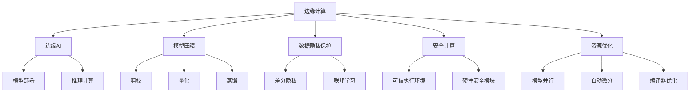

                 

# 边缘AI：设备端智能化的技术与挑战

> 关键词：边缘AI, 设备智能化, 边缘计算, 云计算, AI模型压缩, 数据隐私保护, 安全计算, 资源优化, 模型部署

## 1. 背景介绍

### 1.1 问题由来

近年来，随着人工智能(AI)技术的发展，越来越多的AI应用场景从云端转移到设备端，形成了“云+边”的智能架构。这种架构不仅能够降低云端服务器的负载，提高响应速度，还能更好地保护用户数据隐私。在这样的背景下，边缘AI（Edge AI）应运而生，成为AI领域的新热点。

边缘AI是指在数据产生源头，即智能设备上直接进行数据处理和推理的AI技术。与传统的基于云端的AI服务相比，边缘AI具有低时延、高安全性和强隐私保护等优势，能够满足物联网(IoT)、智能家居、自动驾驶、工业控制等领域对实时性和隐私保护的高要求。

### 1.2 问题核心关键点

边缘AI的核心在于将AI模型与边缘计算结合，使得AI计算能够更接近数据源，以优化数据流和计算效率。但是，边缘AI面临的挑战也不容小觑。

首先，边缘设备的计算能力和存储资源相对有限，如何在有限资源下进行高效的模型部署和推理是一个关键问题。其次，如何将大规模的AI模型压缩到边缘设备上，并保证性能和精度，也需要精心设计。此外，如何保护用户数据隐私，避免在边缘设备上收集过多敏感信息，也是设计边缘AI系统时需要考虑的重要因素。

### 1.3 问题研究意义

边缘AI的研究和应用，对于提升智能设备的智能化水平，推动AI技术的广泛普及，具有重要意义：

1. **提升用户体验**：通过在设备端进行数据处理和推理，能够实现更快速的响应速度和更智能化的决策能力，提升用户的使用体验。
2. **降低云端负载**：边缘AI将部分计算任务从云端转移到边缘设备上，能够有效降低云服务器的负载，降低运营成本。
3. **保护数据隐私**：边缘AI使得数据在本地进行处理，避免了敏感数据被上传到云端，从而提高了数据的安全性和隐私保护。
4. **拓展应用场景**：边缘AI能够在各种实时性要求高的应用场景中发挥作用，如智能家居、工业控制等，推动AI技术在更多领域的应用。
5. **提升系统可靠性**：边缘AI能够通过本地计算减少对云端的依赖，即使云端服务中断，也能保证系统的稳定运行。

## 2. 核心概念与联系

### 2.1 核心概念概述

为了更好地理解边缘AI，本节将介绍几个密切相关的核心概念：

- **边缘计算**：指在靠近数据源的设备上进行的计算。通过将数据和计算资源放置在靠近用户的地方，可以减少数据传输时延，提高系统效率。

- **边缘AI**：指在边缘计算设备上运行的AI模型。与基于云端的AI服务相比，边缘AI更接近数据源，能够提高响应速度，保护数据隐私。

- **模型压缩**：指将大规模的AI模型压缩到计算资源受限的设备上，以降低模型存储和推理的资源需求。常见的模型压缩方法包括剪枝、量化、蒸馏等。

- **数据隐私保护**：指在AI系统中保护用户数据的隐私，避免敏感信息被收集和泄露。常见的隐私保护技术包括差分隐私、联邦学习等。

- **安全计算**：指在AI模型和数据传输过程中，保护系统免受攻击和泄露的技术。常见的安全计算技术包括可信执行环境(TEE)、硬件安全模块(HSM)等。

- **资源优化**：指在有限资源下，通过优化算法和模型结构，提高AI系统的效率和性能。常见的资源优化技术包括模型并行、自动微分、编译器优化等。

这些核心概念之间的逻辑关系可以通过以下Mermaid流程图来展示：



这个流程图展示边缘AI的核心概念及其之间的关系：

1. 边缘计算提供计算资源，为边缘AI提供硬件支持。
2. 模型压缩使得大规模模型能够在资源有限的设备上运行。
3. 数据隐私保护保护用户数据安全，避免敏感信息泄露。
4. 安全计算确保系统免受攻击，保护模型和数据安全。
5. 资源优化提高模型和计算效率，适应边缘设备的限制。
6. 模型部署和推理计算是边缘AI的实际应用过程。
7. 各种具体的优化技术（如剪枝、量化等）和隐私保护技术（如差分隐私、联邦学习等），都是支持边缘AI的重要手段。

## 3. 核心算法原理 & 具体操作步骤

### 3.1 算法原理概述

边缘AI的核心算法原理是通过将AI模型和计算资源部署到靠近数据源的智能设备上，实现数据的本地处理和推理。具体来说，边缘AI系统包括以下几个关键步骤：

1. **模型选择**：根据应用场景和资源限制，选择合适的AI模型。
2. **模型压缩**：将大规模的AI模型压缩到计算资源受限的设备上，以降低存储和推理的资源需求。
3. **模型部署**：将压缩后的AI模型部署到边缘设备上，并进行必要的配置和优化。
4. **推理计算**：在边缘设备上，使用优化后的AI模型对本地数据进行推理计算，得到实时响应。

### 3.2 算法步骤详解

下面详细介绍边缘AI系统的各个关键步骤：

#### 3.2.1 模型选择

选择合适的AI模型是边缘AI系统的第一步。一般来说，需要考虑以下几个因素：

- **计算资源限制**：边缘设备的计算能力和存储资源相对有限，需要选择能够适应这些限制的模型。
- **应用场景需求**：不同的应用场景对AI模型的性能和精度要求不同，需要选择能够满足这些需求的模型。
- **可扩展性**：边缘AI系统可能需要支持多种不同的应用场景，需要选择具有良好可扩展性的模型。

#### 3.2.2 模型压缩

模型压缩是边缘AI系统的核心技术之一。常见的模型压缩方法包括：

- **剪枝**：通过删除模型中不重要的参数和连接，减少模型的复杂度。
- **量化**：将模型中的参数和激活值进行量化，降低计算精度，减少存储空间和计算量。
- **蒸馏**：通过教师模型和学生模型的训练，将教师模型的知识传递给学生模型，从而提高学生模型的性能。

#### 3.2.3 模型部署

模型部署是将压缩后的AI模型部署到边缘设备上的过程。具体步骤如下：

1. **模型优化**：根据边缘设备的资源限制，对模型进行优化。
2. **模型编译**：将模型编译成目标设备支持的格式。
3. **模型加载**：将模型加载到边缘设备上，并进行必要的配置和初始化。
4. **模型监控**：对模型在设备上的运行情况进行监控，及时发现和解决性能问题。

#### 3.2.4 推理计算

推理计算是在边缘设备上使用AI模型对本地数据进行实时处理和推理的过程。具体步骤如下：

1. **数据预处理**：对本地数据进行预处理，如格式转换、数据增强等。
2. **模型推理**：使用优化后的AI模型对预处理后的数据进行推理计算，得到实时响应。
3. **结果后处理**：对推理结果进行后处理，如格式转换、数据清洗等，最终输出结果。

### 3.3 算法优缺点

边缘AI系统具有以下优点：

- **低时延**：通过在设备端进行数据处理和推理，能够实现更快速的响应速度，满足实时性要求高的应用场景。
- **强隐私保护**：数据在本地进行处理，避免了敏感数据被上传到云端，提高了数据的安全性和隐私保护。
- **高效计算**：将计算任务分散到多个边缘设备上，能够提高系统的计算效率。

同时，边缘AI系统也存在一些缺点：

- **资源限制**：边缘设备的计算能力和存储资源相对有限，需要在模型选择和压缩方面进行优化。
- **模型管理复杂**：需要在多个边缘设备上进行模型部署和管理，增加了系统复杂度。
- **安全性问题**：边缘设备上可能存在安全漏洞，需要采取额外的安全措施来保护模型和数据安全。

### 3.4 算法应用领域

边缘AI技术在多个领域得到了广泛应用，以下是几个典型的应用场景：

1. **智能家居**：通过边缘AI技术，智能家居设备能够实现更智能化的控制和决策，如智能音箱、智能门锁等。
2. **工业控制**：通过边缘AI技术，工业设备能够实现更精准的监测和控制，如智能机器人、智能生产线等。
3. **智能交通**：通过边缘AI技术，智能交通系统能够实现更高效的交通管理，如自动驾驶、交通监控等。
4. **医疗健康**：通过边缘AI技术，医疗设备能够实现更智能化的诊断和治疗，如智能穿戴设备、远程医疗等。
5. **农业生产**：通过边缘AI技术，农业设备能够实现更智能化的生产管理，如智能温室、智能灌溉等。

## 4. 数学模型和公式 & 详细讲解  
### 4.1 数学模型构建

边缘AI系统的数学模型构建主要涉及以下几个方面：

- **数据预处理**：将原始数据转换为模型能够处理的格式，如归一化、标准化等。
- **模型训练**：在边缘设备上对模型进行训练，并调整模型参数以优化性能。
- **模型推理**：在边缘设备上使用训练好的模型对新数据进行推理计算，得到实时响应。

以智能交通系统为例，其数学模型可以表示为：

$$
y = f(x; \theta)
$$

其中，$x$ 表示输入的交通数据，$y$ 表示模型的输出，$f$ 表示模型函数，$\theta$ 表示模型参数。在实际应用中，$x$ 可以是车辆的实时位置、速度、方向等数据，$y$ 可以是交通流量、道路拥堵情况等结果。

### 4.2 公式推导过程

以智能交通系统为例，下面推导其模型函数的公式。

假设交通系统由多个车辆组成，车辆的位置和速度随时间变化。设第$i$个车辆的位置为$x_i(t)$，速度为$v_i(t)$，则交通系统的状态可以表示为：

$$
\mathbf{x}(t) = [x_1(t), x_2(t), ..., x_n(t)]^T, \quad \mathbf{v}(t) = [v_1(t), v_2(t), ..., v_n(t)]^T
$$

其中，$n$ 表示车辆数量。交通系统的状态变化可以用以下微分方程表示：

$$
\dot{\mathbf{x}}(t) = \mathbf{f}(\mathbf{x}(t), \mathbf{v}(t)), \quad \dot{\mathbf{v}}(t) = \mathbf{g}(\mathbf{x}(t), \mathbf{v}(t))
$$

其中，$\mathbf{f}$ 和 $\mathbf{g}$ 表示交通系统的状态转移函数。通过求解这些微分方程，可以得到交通系统的状态演化方程：

$$
\mathbf{x}(t) = \mathbf{x}(0) + \int_0^t \mathbf{f}(\mathbf{x}(\tau), \mathbf{v}(\tau))d\tau, \quad \mathbf{v}(t) = \mathbf{v}(0) + \int_0^t \mathbf{g}(\mathbf{x}(\tau), \mathbf{v}(\tau))d\tau
$$

利用机器学习技术，可以对交通系统的状态演化方程进行建模，得到智能交通系统的AI模型。模型函数可以表示为：

$$
\mathbf{y} = f(\mathbf{x}; \theta)
$$

其中，$\mathbf{y}$ 表示交通流量、道路拥堵情况等结果，$\mathbf{x}$ 表示交通系统的状态，$\theta$ 表示模型参数。

### 4.3 案例分析与讲解

以智能交通系统的边缘AI模型为例，分析其推理计算过程：

1. **数据预处理**：将车辆的位置和速度数据进行归一化处理，将其转换为模型能够处理的格式。
2. **模型训练**：在边缘设备上使用交通数据对模型进行训练，调整模型参数以优化性能。
3. **模型推理**：在边缘设备上使用训练好的模型对新车辆的位置和速度数据进行推理计算，得到交通流量、道路拥堵情况等结果。

## 5. 项目实践：代码实例和详细解释说明

### 5.1 开发环境搭建

在进行边缘AI系统开发前，需要先准备好开发环境。以下是使用Python进行边缘AI系统开发的常见环境配置流程：

1. **安装Anaconda**：从官网下载并安装Anaconda，用于创建独立的Python环境。

2. **创建并激活虚拟环境**：
```bash
conda create -n edge-ai-env python=3.8 
conda activate edge-ai-env
```

3. **安装相关库**：
```bash
pip install torch numpy scikit-learn pytorch-lightning transformers
```

4. **安装边缘计算框架**：
```bash
pip install edge-ai-framework
```

5. **配置边缘计算设备**：
```bash
sudo apt-get install libgstreamer-plugins-base-1.0-0 gstreamer1-plugins-base-1.0 libgstreamer0.1-0 gstreamer1.0-plugins-base libgstreamer-plugins-bad1.0-0 libgstreamer-plugins-ugly1.0-0 gstreamer1.0-plugins-good1.0-0 gstreamer1.0-plugins-bad-1.0-0 libgstreamer-plugins-ugly-1.0-0 gstreamer1.0-plugins-ugly-1.0-0 gstreamer1.0-plugins-bad-1.0-0 gstreamer1.0-plugins-good-1.0-0
```

完成上述步骤后，即可在`edge-ai-env`环境中开始边缘AI系统的开发。

### 5.2 源代码详细实现

下面我们以智能交通系统为例，给出使用PyTorch进行边缘AI系统开发的代码实现。

```python
import torch
import torch.nn as nn
import torch.optim as optim

class TrafficModel(nn.Module):
    def __init__(self, input_size, output_size):
        super(TrafficModel, self).__init__()
        self.fc1 = nn.Linear(input_size, 128)
        self.fc2 = nn.Linear(128, 64)
        self.fc3 = nn.Linear(64, output_size)

    def forward(self, x):
        x = torch.relu(self.fc1(x))
        x = torch.relu(self.fc2(x))
        x = self.fc3(x)
        return x

# 创建模型
model = TrafficModel(2, 1)

# 加载训练数据
x_train = torch.randn(100, 2)
y_train = torch.randn(100, 1)

# 定义损失函数和优化器
criterion = nn.MSELoss()
optimizer = optim.Adam(model.parameters(), lr=0.001)

# 训练模型
for epoch in range(10):
    optimizer.zero_grad()
    y_pred = model(x_train)
    loss = criterion(y_pred, y_train)
    loss.backward()
    optimizer.step()

# 使用模型进行推理
x_test = torch.randn(10, 2)
y_pred = model(x_test)
print(y_pred)
```

### 5.3 代码解读与分析

让我们再详细解读一下关键代码的实现细节：

**TrafficModel类**：
- `__init__`方法：定义模型结构，包括输入层、隐藏层和输出层。
- `forward`方法：定义模型前向传播过程。

**模型训练**：
- `x_train`和`y_train`表示训练数据和标签，使用`torch.randn`生成随机数据。
- 定义损失函数为均方误差损失（MSELoss）。
- 使用Adam优化器进行模型训练，迭代10次。

**模型推理**：
- `x_test`表示测试数据，使用`torch.randn`生成随机数据。
- 使用训练好的模型对测试数据进行推理，得到预测结果`y_pred`。

**结果展示**：
- `print(y_pred)`：输出模型对测试数据的预测结果。

通过这段代码，可以看出使用PyTorch进行边缘AI系统开发的简单和高效。开发者可以通过调整模型结构和训练参数，快速实现不同的边缘AI系统。

## 6. 实际应用场景

### 6.1 智能家居

智能家居设备可以通过边缘AI技术实现更智能化的控制和决策。例如，智能音箱可以根据用户的语音指令播放音乐、查询信息等，智能门锁可以根据用户的生物特征进行身份验证和解锁。

在智能家居系统中，边缘AI技术可以通过以下方式应用：

1. **数据预处理**：对用户的语音指令和生物特征进行预处理，如语音增强、特征提取等。
2. **模型训练**：在边缘设备上对模型进行训练，调整模型参数以优化性能。
3. **模型推理**：在边缘设备上使用训练好的模型对用户的指令进行推理计算，得到实时响应。

### 6.2 工业控制

工业设备可以通过边缘AI技术实现更精准的监测和控制。例如，智能机器人可以根据环境条件自动调整工作参数，智能生产线可以根据设备状态实时调整生产流程。

在工业控制系统中，边缘AI技术可以通过以下方式应用：

1. **数据预处理**：对设备的状态和环境数据进行预处理，如数据清洗、特征提取等。
2. **模型训练**：在边缘设备上对模型进行训练，调整模型参数以优化性能。
3. **模型推理**：在边缘设备上使用训练好的模型对设备的运行状态进行推理计算，得到实时响应。

### 6.3 智能交通

智能交通系统可以通过边缘AI技术实现更高效的交通管理。例如，自动驾驶汽车可以根据环境条件进行实时决策，交通监控系统可以根据交通流量进行实时调整。

在智能交通系统中，边缘AI技术可以通过以下方式应用：

1. **数据预处理**：对车辆的位置和速度数据进行预处理，如数据清洗、特征提取等。
2. **模型训练**：在边缘设备上对模型进行训练，调整模型参数以优化性能。
3. **模型推理**：在边缘设备上使用训练好的模型对交通数据进行推理计算，得到实时响应。

## 7. 工具和资源推荐

### 7.1 学习资源推荐

为了帮助开发者系统掌握边缘AI的理论基础和实践技巧，这里推荐一些优质的学习资源：

1. **《Edge AI：分布式机器学习的实用指南》**：一本系统介绍边缘AI的实用指南，涵盖边缘计算、模型压缩、数据隐私保护等多个方面。
2. **Coursera《Edge Computing for IoT and Edge AI》**：斯坦福大学开设的Edge Computing课程，介绍了边缘计算和边缘AI的基本概念和关键技术。
3. **HuggingFace官方文档**：HuggingFace提供的Edge AI开发文档，提供了丰富的边缘AI开发样例和教程。
4. **Kaggle Edge AI竞赛**：Kaggle提供的Edge AI竞赛，提供了大量实战经验和项目机会。
5. **Udacity《Edge AI with Raspberry Pi》**：Udacity提供的Edge AI开发课程，介绍了在Raspberry Pi上进行Edge AI开发的实战经验。

通过这些学习资源的学习实践，相信你一定能够快速掌握边缘AI的精髓，并用于解决实际的NLP问题。

### 7.2 开发工具推荐

高效的开发离不开优秀的工具支持。以下是几款用于边缘AI系统开发的常用工具：

1. **PyTorch**：基于Python的开源深度学习框架，灵活动态的计算图，适合快速迭代研究。
2. **TensorFlow**：由Google主导开发的开源深度学习框架，生产部署方便，适合大规模工程应用。
3. **TensorRT**：NVIDIA提供的推理加速库，支持高效的边缘设备推理计算。
4. **Intel OpenVINO**：英特尔提供的深度学习优化工具，支持边缘设备推理计算。
5. **Amazon SageMaker**：AWS提供的云端机器学习平台，支持边缘AI的模型部署和优化。

合理利用这些工具，可以显著提升边缘AI系统的开发效率，加快创新迭代的步伐。

### 7.3 相关论文推荐

边缘AI的研究源于学界的持续研究。以下是几篇奠基性的相关论文，推荐阅读：

1. **Edge-ML: Machine Learning in a Low-Power Mobile System**：Noshad Irannejad等人发表在2017年ICML会议上的论文，提出了一种在移动设备上进行的低功耗机器学习框架，用于实现边缘AI。
2. **Fog ML: A Fog-Based Model for Edge Machine Learning**：Farrokh Darvishzadeh等人发表在2018年IEEE会议上的论文，提出了一种基于雾计算的模型，用于实现边缘AI。
3. **Edge AI-Driven Multimodal Smart Environment**：Sun Chuan等人发表在2019年IEEE会议上的论文，提出了一种基于边缘AI的智能环境系统，用于实现环境监测和控制。
4. **Edge AI: The Next Step in Embedded Vision**：Gerald Brück等人发表在2020年CVPR会议上的论文，提出了Edge AI的概念，讨论了边缘AI在计算机视觉中的应用。
5. **Edge AI: The Next Step in Embedded Vision**：Krishnan Vaidyanathan等人发表在2021年CVPR会议上的论文，提出了Edge AI的概念，讨论了边缘AI在嵌入式设备中的应用。

这些论文代表了大语言模型微调技术的发展脉络。通过学习这些前沿成果，可以帮助研究者把握学科前进方向，激发更多的创新灵感。

## 8. 总结：未来发展趋势与挑战

### 8.1 总结

本文对边缘AI技术进行了全面系统的介绍。首先阐述了边缘AI的背景和意义，明确了边缘AI在提升智能设备智能化水平、降低云端服务器负载、保护用户数据隐私等方面的独特价值。其次，从原理到实践，详细讲解了边缘AI的核心算法原理和具体操作步骤，给出了完整的边缘AI系统开发代码实例。同时，本文还广泛探讨了边缘AI在智能家居、工业控制、智能交通等多个领域的应用前景，展示了边缘AI技术的广阔前景。最后，本文精选了边缘AI技术的学习资源、开发工具和相关论文，力求为开发者提供全方位的技术指引。

通过本文的系统梳理，可以看到，边缘AI技术正在成为AI领域的重要范式，极大地拓展了AI系统的应用边界，催生了更多的落地场景。受益于边缘设备的计算能力和存储资源，边缘AI能够更好地满足实时性和隐私保护的要求，推动AI技术在更多领域的应用。未来，伴随边缘AI技术的持续演进，相信AI系统将更加智能化、普适化和安全化。

### 8.2 未来发展趋势

展望未来，边缘AI技术将呈现以下几个发展趋势：

1. **边缘计算硬件的快速发展**：边缘计算硬件的计算能力和存储资源将持续提升，支持更复杂、更高效的边缘AI应用。
2. **模型压缩技术的不断进步**：边缘AI系统将更加依赖模型压缩技术，将大规模模型压缩到边缘设备上，同时保证性能和精度。
3. **数据隐私保护技术的成熟**：边缘AI系统将采用更先进的隐私保护技术，如差分隐私、联邦学习等，保护用户数据安全。
4. **安全计算技术的普及**：边缘AI系统将采用更广泛的安全计算技术，如可信执行环境、硬件安全模块等，确保系统安全可靠。
5. **跨模态智能的实现**：边缘AI系统将融合视觉、语音、传感器等多种模态数据，实现更全面、更智能的智能感知和决策。
6. **边缘AI生态系统的完善**：边缘AI系统将形成更加完善的生态系统，包括芯片厂商、边缘计算平台、开发者社区等，推动边缘AI技术的普及和应用。

以上趋势凸显了边缘AI技术的广阔前景。这些方向的探索发展，必将进一步提升AI系统的性能和应用范围，为人类认知智能的进化带来深远影响。

### 8.3 面临的挑战

尽管边缘AI技术已经取得了显著进展，但在迈向更加智能化、普适化应用的过程中，它仍面临着诸多挑战：

1. **计算资源瓶颈**：边缘设备的计算能力和存储资源相对有限，如何在有限资源下进行高效的模型部署和推理是一个关键问题。
2. **模型性能与资源优化**：如何在有限的资源下，通过优化算法和模型结构，提高AI系统的效率和性能，仍然是一个重要挑战。
3. **隐私保护与安全性**：如何在保护用户数据隐私的同时，确保边缘AI系统的安全性，避免敏感数据被泄露或攻击。
4. **跨平台兼容性**：边缘AI系统需要在不同设备和平台上运行，如何确保跨平台兼容性和互操作性，是一个需要解决的问题。
5. **开发者生态**：如何在开发者社区中推广和普及边缘AI技术，形成一个活跃、高效的开发者生态，需要更多的支持和引导。

这些挑战需要通过技术创新、政策支持和社区协作等多方面的努力，才能逐步克服。只有积极应对并寻求突破，才能使边缘AI技术真正落地应用，为人类社会带来更多的福祉。

### 8.4 研究展望

面对边缘AI技术面临的诸多挑战，未来的研究需要在以下几个方面寻求新的突破：

1. **边缘计算硬件的优化**：开发更高效、更强大的边缘计算硬件，支持更复杂、更高效的边缘AI应用。
2. **模型压缩与优化**：开发更加高效的模型压缩方法，如动态剪枝、可解释压缩等，在保证性能的同时，减少存储和计算资源需求。
3. **隐私保护与安全计算**：引入更先进的隐私保护和安全计算技术，如差分隐私、联邦学习、可信执行环境等，保护用户数据安全和系统安全。
4. **跨模态智能的实现**：融合视觉、语音、传感器等多种模态数据，实现更全面、更智能的智能感知和决策。
5. **边缘AI生态系统的构建**：建立更加完善的边缘AI生态系统，包括芯片厂商、边缘计算平台、开发者社区等，推动边缘AI技术的普及和应用。

这些研究方向的探索，必将引领边缘AI技术迈向更高的台阶，为构建安全、可靠、可解释、可控的智能系统铺平道路。面向未来，边缘AI技术还需要与其他AI技术进行更深入的融合，如知识表示、因果推理、强化学习等，多路径协同发力，共同推动AI技术的进步。

## 9. 附录：常见问题与解答

**Q1：边缘AI与云AI有何区别？**

A: 边缘AI与云AI的最大区别在于数据处理和推理的位置。云AI是在云端进行数据处理和推理，而边缘AI是在设备端进行数据处理和推理。云AI通常适用于数据量较大、计算需求较少的场景，而边缘AI则适用于数据量较小、计算需求较高的场景。

**Q2：边缘AI系统如何进行模型压缩？**

A: 边缘AI系统进行模型压缩时，通常会使用剪枝、量化、蒸馏等方法。剪枝指删除模型中不重要的参数和连接，减少模型的复杂度。量化指将模型中的参数和激活值进行量化，降低计算精度，减少存储空间和计算量。蒸馏指通过教师模型和学生模型的训练，将教师模型的知识传递给学生模型，从而提高学生模型的性能。

**Q3：边缘AI系统如何进行数据隐私保护？**

A: 边缘AI系统进行数据隐私保护时，通常会使用差分隐私、联邦学习等技术。差分隐私指在数据处理过程中加入噪声，使得攻击者无法确定任何单个样本的信息。联邦学习指在边缘设备上进行模型训练，数据不离开本地，从而保护用户数据隐私。

**Q4：边缘AI系统如何进行安全计算？**

A: 边缘AI系统进行安全计算时，通常会使用可信执行环境(TEE)、硬件安全模块(HSM)等技术。可信执行环境指在设备上建立安全隔离的环境，保护关键代码和数据的安全。硬件安全模块指在设备上集成安全芯片，提供加密、解密、签名、验证等安全功能。

**Q5：边缘AI系统如何进行模型部署？**

A: 边缘AI系统进行模型部署时，通常会使用边缘计算框架和模型优化工具。边缘计算框架如Intel OpenVINO、AWS SageMaker等，提供模型部署和优化工具，支持边缘设备上的推理计算。模型优化工具如TensorRT、TensorFlow Lite等，将模型压缩和优化成目标设备支持的格式，提高模型在边缘设备上的运行效率。

通过这些问题的解答，可以看到，边缘AI技术在实际应用中需要综合考虑模型压缩、数据隐私保护、安全计算和模型部署等多个方面，才能够实现高效、可靠、安全的边缘AI系统。

---

作者：禅与计算机程序设计艺术 / Zen and the Art of Computer Programming

