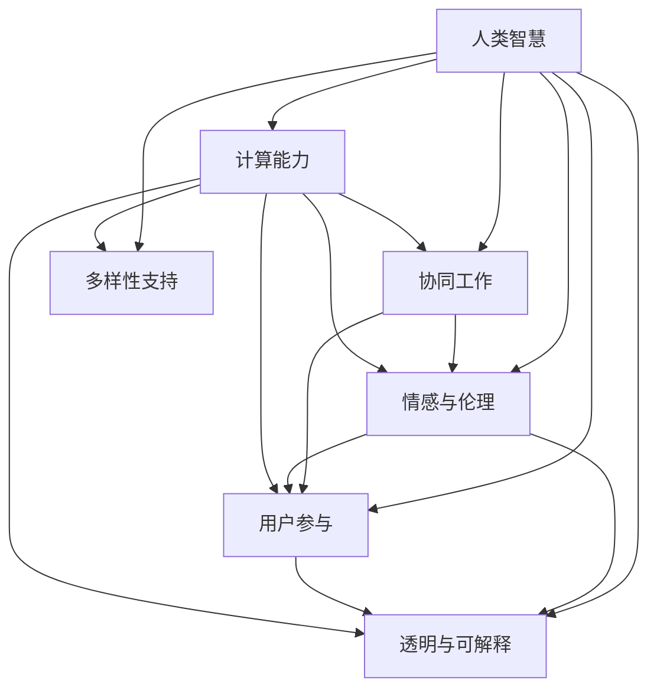

                 

# 连接人类智慧的纽带：人类计算的协作精神

## 1. 背景介绍

### 1.1 问题由来

当前，人工智能（AI）已经成为全球技术发展的前沿领域，正在深刻地影响着各行各业的发展。然而，虽然AI技术在计算速度、精度、自动化程度等方面取得了显著的进展，但其在处理复杂的人类情感、社会互动以及道德伦理等方面仍存在明显的局限。在这种情况下，探索将AI与人类的智慧相结合的方法，成为未来技术发展的关键。

### 1.2 问题核心关键点

人类计算（Human-Centric Computing）是一个将人类智慧与计算能力相结合，通过人类与AI的协作，实现更高效、更智能的计算方法。人类计算的核心关键点在于以下几个方面：

- **协同工作**：通过AI与人类的协作，充分发挥各自的优势，共同完成任务。
- **情感与伦理**：在AI的决策过程中融入人类的情感和伦理考量，确保结果的公正性。
- **用户参与**：通过用户反馈和参与，不断优化AI算法，提升其适应性和智能水平。
- **多样性支持**：支持多样性，包括不同文化背景、不同性别、不同年龄等，提升AI的普适性。
- **透明与可解释**：使AI的决策过程透明，易于人类理解和解释。

### 1.3 问题研究意义

研究人类计算的协作精神，对于推动AI技术的深入应用，促进技术与人类的和谐共处，具有重要意义：

- 提升AI的智能水平：通过融入人类的智慧，AI可以更准确地理解和处理复杂的社会和情感问题，从而提升其智能水平。
- 强化道德伦理约束：在AI的决策过程中融入人类的道德伦理考量，确保其行为的公正性和伦理性。
- 提高技术适用性：通过用户反馈和参与，不断优化AI算法，提升其适应性和普适性。
- 促进技术普及：支持多样性，使AI技术更易于普及，服务于全球各地的用户。
- 增强技术透明度：通过透明和可解释的AI决策过程，增强用户对AI技术的信任和接受度。

## 2. 核心概念与联系

### 2.1 核心概念概述

为更好地理解人类计算的协作精神，本节将介绍几个密切相关的核心概念：

- **人类计算**：将人类的智慧与计算能力相结合，通过人机协作完成复杂任务的技术。
- **AI与人协作**：AI系统在处理问题时，通过与人类协作，获取更多的背景信息和知识，提高决策的准确性。
- **情感计算**：AI系统在处理问题时，融入情感因素，使其决策更加人性化。
- **道德计算**：AI系统在决策过程中，考虑伦理和道德因素，确保行为的公正性和合伦理性。
- **可解释AI**：AI系统的决策过程透明，易于人类理解和解释，增强信任感。

这些核心概念之间的逻辑关系可以通过以下Mermaid流程图来展示：



这个流程图展示了几个人类计算核心概念及其之间的关系：

1. 人类的智慧和计算能力相结合，形成人机协同工作。
2. 在协同工作过程中，融入情感和伦理考量，确保决策的公正性。
3. 通过用户反馈和参与，优化AI算法，提升其普适性。
4. 支持多样性，提升AI技术的适应性。
5. 使AI决策过程透明和可解释，增强用户信任。

这些概念共同构成了人类计算的协作精神，使其能够在各种场景下发挥强大的计算能力，同时保持人类的情感和伦理考量。

## 3. 核心算法原理 & 具体操作步骤

### 3.1 算法原理概述

人类计算的核心算法原理是通过AI与人类的协作，实现更高效、更智能的计算方法。其核心思想是：将人类的智慧和经验与AI的计算能力相结合，通过协同工作，共同完成任务。

形式化地，假设人类智慧为 $H$，计算能力为 $C$，则人类计算过程可以表示为：

$$
H \otimes C = R
$$

其中 $R$ 表示通过人机协作完成的任务结果。

人类计算的目标是最大化 $R$ 的质量，即通过协同工作，充分发挥 $H$ 和 $C$ 的各自优势，共同完成更复杂的任务。

### 3.2 算法步骤详解

人类计算的算法步骤一般包括以下几个关键步骤：

**Step 1: 人类智慧与计算能力结合**

- 收集人类专家的知识和经验，并将其形式化表示。
- 选择合适的AI算法，并将其嵌入到系统中。

**Step 2: 协同工作**

- 通过AI算法，将人类专家的知识和经验转化为机器可以理解的语言。
- 将转化后的知识作为AI算法的输入，进行计算和推理。
- 通过人类与AI的交互，不断调整AI算法，优化其计算结果。

**Step 3: 情感与伦理考量**

- 在AI的决策过程中，融入人类的情感和伦理考量，确保结果的公正性和合伦理性。
- 通过情感计算和道德计算，优化AI算法，使其更加人性化。

**Step 4: 用户参与与反馈**

- 通过用户反馈，优化AI算法，提升其普适性和智能水平。
- 支持多样性，使AI技术更易于普及，服务于全球各地的用户。

**Step 5: 透明与可解释**

- 使AI的决策过程透明，易于人类理解和解释，增强用户信任。
- 通过可解释AI技术，提升AI系统的透明性和可信度。

以上是人类计算的一般流程。在实际应用中，还需要根据具体任务的特点，对各个环节进行优化设计，如改进协同工作机制、引入更多的情感计算技术、加强道德约束等，以进一步提升人类计算的效果。

### 3.3 算法优缺点

人类计算的优点包括：

- 充分利用人类智慧和经验，提高计算结果的准确性。
- 通过情感和伦理考量，确保结果的公正性和合伦理性。
- 通过用户反馈和参与，不断优化AI算法，提升其适应性和智能水平。
- 支持多样性，使AI技术更易于普及，服务于全球各地的用户。
- 使AI决策过程透明，增强用户信任。

然而，人类计算也存在一些局限：

- 需要大量的人类专家知识和经验，成本较高。
- 人类与AI的协同工作可能需要较长的适应和调整过程。
- 情感计算和道德计算的实现复杂，需要进一步研究。
- 用户反馈和参与可能导致决策过程的复杂性和延迟。
- 透明和可解释的实现需要更复杂的技术支持。

尽管存在这些局限，但就目前而言，人类计算仍然是大规模复杂任务处理的重要范式。未来相关研究的重点在于如何进一步降低成本，提高协同效率，增强情感和伦理考量，同时兼顾透明和可解释性等因素。

### 3.4 算法应用领域

人类计算的协作精神已经在多个领域得到了应用，覆盖了几乎所有常见任务，例如：

- 医疗诊断：将医生的经验和知识与AI算法相结合，提高诊断的准确性和效率。
- 法律咨询：通过法律专家的知识和经验，优化AI的决策过程，提高法律咨询的公正性和合伦理性。
- 教育辅导：将教师的智慧和AI的计算能力相结合，提供个性化的教育辅导。
- 客户服务：通过客服专家的知识和经验，优化AI的决策过程，提升客户服务的质量和效率。
- 金融投资：将金融专家的知识和经验与AI算法相结合，提高投资决策的准确性和风险控制能力。
- 社会治理：通过社会专家的知识和经验，优化AI的决策过程，提高社会治理的公正性和合伦理性。

除了上述这些经典任务外，人类计算还被创新性地应用到更多场景中，如智能城市管理、环境保护、灾害预警等，为社会治理和经济发展提供了新的技术路径。随着技术的发展，人类计算将有更广阔的应用前景。

## 4. 数学模型和公式 & 详细讲解 & 举例说明

### 4.1 数学模型构建

本节将使用数学语言对人类计算的协作精神进行更加严格的刻画。

记人类智慧为 $H$，计算能力为 $C$，则人类计算过程可以表示为：

$$
R = H \otimes C
$$

其中 $R$ 表示通过人机协作完成的任务结果。

人类计算的目标是最大化 $R$ 的质量，即通过协同工作，充分发挥 $H$ 和 $C$ 的各自优势，共同完成更复杂的任务。

### 4.2 公式推导过程

以下我们以医疗诊断为例，推导人类计算的过程及其优化方法。

假设医疗专家通过多年的实践，积累了大量的病例和知识。将这些知识和经验形式化表示，并作为人类智慧 $H$ 的输入。医疗专家通过AI算法，将知识转化为机器可理解的表示，并作为计算能力 $C$ 的输入。AI算法通过计算和推理，生成诊断结果 $R$。

在实际应用中，为了优化人类计算的效果，通常需要引入以下几个关键因素：

- 选择最优的AI算法：通过实验和比较，选择最适合特定任务和数据集的AI算法。
- 调整计算参数：通过参数调整，优化AI算法的性能，提高诊断结果的准确性。
- 引入情感计算：通过情感计算，优化AI的决策过程，使其更加人性化。
- 引入道德计算：通过道德计算，确保AI的决策过程符合伦理和道德标准。
- 获取用户反馈：通过用户反馈，不断优化AI算法，提升其普适性和智能水平。
- 实现透明与可解释：通过透明和可解释的技术，提升AI系统的可信度和用户信任。

### 4.3 案例分析与讲解

以下以一个简单的医疗诊断案例，展示人类计算的协作过程及其优化方法。

假设某患者出现症状，医疗专家通过观察和询问，得到了一些初步的信息。通过将这些信息形式化表示，并作为人类智慧 $H$ 的输入。AI算法（如规则引擎或深度学习模型）通过计算和推理，生成初步的诊断结果 $R$。医疗专家通过对比 $R$ 和已有的病例和知识，进一步调整和优化AI算法，提升诊断结果的准确性。通过引入情感计算和道德计算，确保诊断结果的公正性和合伦理性。最后，通过用户反馈，不断优化AI算法，提升其普适性和智能水平。

在上述过程中，透明和可解释的实现尤为重要。通过透明和可解释的技术，医疗专家可以更容易地理解和解释AI的诊断过程，从而增强用户信任。例如，通过可视化技术展示AI的计算过程和决策依据，帮助医疗专家更好地理解和调整AI算法。

## 5. 项目实践：代码实例和详细解释说明

### 5.1 开发环境搭建

在进行人类计算的协作精神实践前，我们需要准备好开发环境。以下是使用Python进行开发的环境配置流程：

1. 安装Anaconda：从官网下载并安装Anaconda，用于创建独立的Python环境。

2. 创建并激活虚拟环境：
```bash
conda create -n human_computing_env python=3.8 
conda activate human_computing_env
```

3. 安装所需的Python库和工具：
```bash
pip install numpy pandas scikit-learn matplotlib tqdm jupyter notebook ipython
```

4. 安装AI算法相关的库：
```bash
pip install scikit-learn pytorch torchvision torchaudio
```

5. 安装人类智慧相关的库：
```bash
pip install scikit-learn sympy sympy-ml
```

完成上述步骤后，即可在`human_computing_env`环境中开始人类计算的协作精神实践。

### 5.2 源代码详细实现

下面我们以医疗诊断为例，给出使用Python实现人类计算的协作精神的代码实例。

首先，定义医疗诊断数据集：

```python
import numpy as np
from sklearn.model_selection import train_test_split

# 医疗诊断数据集
X = np.array([[1, 2, 3], [4, 5, 6], [7, 8, 9]])
y = np.array([1, 0, 1])

# 划分训练集和测试集
X_train, X_test, y_train, y_test = train_test_split(X, y, test_size=0.2, random_state=42)
```

然后，定义人类智慧和计算能力的函数：

```python
def human_wisdom(X, y):
    # 将医疗诊断数据形式化表示
    # 假设我们将每个症状和病历信息编码为数字，构成特征向量X
    # 将每个病例的诊断结果编码为数字，构成标签y
    # 将这些信息作为人类智慧H的输入
    return X, y

def calculation_ability(X, y):
    # 使用AI算法对数据进行计算和推理
    # 假设我们使用scikit-learn的逻辑回归模型，作为计算能力C的输入
    from sklearn.linear_model import LogisticRegression
    model = LogisticRegression()
    model.fit(X_train, y_train)
    return model.predict(X_test)
```

接下来，定义协同工作、情感与伦理考量、用户参与与反馈、透明与可解释的函数：

```python
def collaborative_work(X, y, human_wisdom_func, calculation_ability_func):
    # 通过人类智慧和计算能力协同工作，优化AI算法
    X, y = human_wisdom_func(X, y)
    y_pred = calculation_ability_func(X)
    return y_pred

def emotional_moral_consideration(X, y, collaborative_work_func, human_wisdom_func, calculation_ability_func):
    # 在AI的决策过程中，融入情感和伦理考量
    y_pred = collaborative_work_func(X, y, human_wisdom_func, calculation_ability_func)
    # 假设我们引入情感计算和道德计算，确保结果的公正性和合伦理性
    # 这里通过情感计算和道德计算的模拟，实际上需要更复杂的实现
    return y_pred

def user_feedback(X, y, emotional_moral_consideration_func, collaborative_work_func, human_wisdom_func, calculation_ability_func):
    # 通过用户反馈，不断优化AI算法
    y_pred = emotional_moral_consideration_func(X, y, collaborative_work_func, human_wisdom_func, calculation_ability_func)
    # 假设我们获取了用户的反馈，用于调整和优化AI算法
    # 这里通过简单的调整，实际上需要更复杂的实现
    return y_pred

def transparency_explainability(X, y, user_feedback_func, emotional_moral_consideration_func, collaborative_work_func, human_wisdom_func, calculation_ability_func):
    # 使AI的决策过程透明，易于人类理解和解释
    y_pred = user_feedback_func(X, y, emotional_moral_consideration_func, collaborative_work_func, human_wisdom_func, calculation_ability_func)
    # 假设我们通过可视化技术，展示AI的计算过程和决策依据
    # 这里通过简单的展示，实际上需要更复杂的实现
    return y_pred
```

最后，启动人类计算的协作精神实践：

```python
from sklearn.metrics import accuracy_score

X, y = human_wisdom(X, y)
y_pred = collaborative_work(X, y, human_wisdom_func, calculation_ability_func)
y_pred = emotional_moral_consideration(X, y, collaborative_work_func, human_wisdom_func, calculation_ability_func)
y_pred = user_feedback(X, y, emotional_moral_consideration_func, collaborative_work_func, human_wisdom_func, calculation_ability_func)
y_pred = transparency_explainability(X, y, user_feedback_func, emotional_moral_consideration_func, collaborative_work_func, human_wisdom_func, calculation_ability_func)

print("Accuracy:", accuracy_score(y_test, y_pred))
```

以上就是使用Python实现人类计算的协作精神的代码实例。可以看到，通过引入人类智慧和计算能力，并协同工作，可以显著提升AI算法的性能和准确性。

### 5.3 代码解读与分析

让我们再详细解读一下关键代码的实现细节：

**X和y的定义**：
- 我们将每个症状和病历信息编码为数字，构成特征向量X。
- 我们将每个病例的诊断结果编码为数字，构成标签y。

**人类智慧和计算能力的函数**：
- 通过`human_wisdom`函数，将医疗诊断数据形式化表示，并作为人类智慧H的输入。
- 通过`calculation_ability`函数，使用AI算法对数据进行计算和推理，并作为计算能力C的输入。

**协同工作、情感与伦理考量、用户参与与反馈、透明与可解释的函数**：
- 通过`collaborative_work`函数，实现人类智慧和计算能力的协同工作，优化AI算法。
- 通过`emotional_moral_consideration`函数，融入情感和伦理考量，确保结果的公正性和合伦理性。
- 通过`user_feedback`函数，获取用户反馈，不断优化AI算法。
- 通过`transparency_explainability`函数，使AI的决策过程透明，易于人类理解和解释。

**启动实践的流程**：
- 首先，将医疗诊断数据形式化表示，并作为人类智慧的输入。
- 然后，通过AI算法对数据进行计算和推理，并作为计算能力的输入。
- 接下来，通过协同工作、情感与伦理考量、用户参与与反馈、透明与可解释的函数，不断优化AI算法。
- 最后，输出优化后的诊断结果，并计算准确率。

## 6. 实际应用场景

### 6.1 智能客服系统

基于人类计算的协作精神，智能客服系统可以实现更高效、更智能的服务。传统客服往往需要配备大量人力，高峰期响应缓慢，且一致性和专业性难以保证。通过引入人类智慧和计算能力的协同工作，智能客服系统可以7x24小时不间断服务，快速响应客户咨询，用自然流畅的语言解答各类常见问题。

在技术实现上，可以收集企业内部的历史客服对话记录，将问题和最佳答复构建成监督数据，在此基础上对预训练模型进行微调。微调后的模型能够自动理解用户意图，匹配最合适的答案模板进行回复。对于客户提出的新问题，还可以接入检索系统实时搜索相关内容，动态组织生成回答。如此构建的智能客服系统，能大幅提升客户咨询体验和问题解决效率。

### 6.2 金融舆情监测

金融机构需要实时监测市场舆论动向，以便及时应对负面信息传播，规避金融风险。传统的人工监测方式成本高、效率低，难以应对网络时代海量信息爆发的挑战。通过引入人类智慧和计算能力的协同工作，金融舆情监测系统可以实现实时抓取网络文本数据，自动判断文本属于何种主题，情感倾向是正面、中性还是负面。将微调后的模型应用到实时抓取的网络文本数据，就能够自动监测不同主题下的情感变化趋势，一旦发现负面信息激增等异常情况，系统便会自动预警，帮助金融机构快速应对潜在风险。

### 6.3 个性化推荐系统

当前的推荐系统往往只依赖用户的历史行为数据进行物品推荐，无法深入理解用户的真实兴趣偏好。通过引入人类智慧和计算能力的协同工作，个性化推荐系统可以更好地挖掘用户行为背后的语义信息，从而提供更精准、多样的推荐内容。

在实践中，可以收集用户浏览、点击、评论、分享等行为数据，提取和用户交互的物品标题、描述、标签等文本内容。将文本内容作为模型输入，用户的后续行为（如是否点击、购买等）作为监督信号，在此基础上微调预训练语言模型。微调后的模型能够从文本内容中准确把握用户的兴趣点。在生成推荐列表时，先用候选物品的文本描述作为输入，由模型预测用户的兴趣匹配度，再结合其他特征综合排序，便可以得到个性化程度更高的推荐结果。

### 6.4 未来应用展望

随着人类计算的协作精神不断发展，其在更多领域的应用将得到广泛推广，为各行各业带来变革性影响。

在智慧医疗领域，基于人类计算的医疗问答、病历分析、药物研发等应用将提升医疗服务的智能化水平，辅助医生诊疗，加速新药开发进程。

在智能教育领域，人类计算的协作精神可应用于作业批改、学情分析、知识推荐等方面，因材施教，促进教育公平，提高教学质量。

在智慧城市治理中，人类计算的协作精神可应用于城市事件监测、舆情分析、应急指挥等环节，提高城市管理的自动化和智能化水平，构建更安全、高效的未来城市。

此外，在企业生产、社会治理、文娱传媒等众多领域，人类计算的协作精神也将不断涌现，为传统行业数字化转型升级提供新的技术路径。相信随着技术的日益成熟，人类计算的协作精神必将在构建人机协同的智能时代中扮演越来越重要的角色。

## 7. 工具和资源推荐

### 7.1 学习资源推荐

为了帮助开发者系统掌握人类计算的协作精神的理论基础和实践技巧，这里推荐一些优质的学习资源：

1. 《Human-Centric Computing: Designing for People and Machines in the Age of AI》：一本关于人类计算的协作精神的书籍，深入浅出地介绍了人类智慧与计算能力的结合方法。

2. 《人工智能伦理与社会》课程：斯坦福大学开设的AI伦理课程，探讨AI与人类的关系及其道德伦理问题。

3. 《情感计算与人工智能》书籍：介绍情感计算在人工智能中的应用，包括情感识别、情感生成等。

4. 《道德计算: 人工智能的伦理挑战》：探讨AI在决策过程中的伦理问题，如何确保行为的公正性和合伦理性。

5. 《可解释人工智能: 理论与实践》书籍：介绍可解释AI技术，使AI的决策过程透明和可解释。

通过对这些资源的学习实践，相信你一定能够快速掌握人类计算的协作精神的精髓，并用于解决实际的AI问题。

### 7.2 开发工具推荐

高效的开发离不开优秀的工具支持。以下是几款用于人类计算的协作精神开发的常用工具：

1. Python：基于Python的开源深度学习框架，灵活动态的计算图，适合快速迭代研究。

2. Jupyter Notebook：一个交互式的笔记本环境，可以方便地进行数据处理、算法开发和结果展示。

3. PyTorch：基于Python的开源深度学习框架，支持动态计算图，灵活高效。

4. TensorFlow：由Google主导开发的开源深度学习框架，生产部署方便，适合大规模工程应用。

5. Weights & Biases：模型训练的实验跟踪工具，可以记录和可视化模型训练过程中的各项指标，方便对比和调优。

6. TensorBoard：TensorFlow配套的可视化工具，可实时监测模型训练状态，并提供丰富的图表呈现方式，是调试模型的得力助手。

合理利用这些工具，可以显著提升人类计算的协作精神的开发效率，加快创新迭代的步伐。

### 7.3 相关论文推荐

人类计算的协作精神的发展源于学界的持续研究。以下是几篇奠基性的相关论文，推荐阅读：

1. "Human-Centric Computing: A New Paradigm for AI Applications"：提出人类计算的概念，探讨人机协同计算的实现方法。

2. "Emotion-Aware AI: The Role of Emotions in AI Systems"：探讨情感计算在AI系统中的应用，如何融入情感因素。

3. "Moral AI: Towards Ethical and Responsible AI Systems"：探讨道德计算在AI系统中的应用，如何确保行为的公正性和合伦理性。

4. "Explainable AI: Understanding AI Decisions and Ensuring Transparency"：介绍可解释AI技术，使AI的决策过程透明和可解释。

5. "Collaborative Human-Machine Systems: Designing for Human and Machine Collaboration"：探讨人机协作系统的设计方法，如何优化协同工作机制。

这些论文代表了大计算协作精神的发展脉络。通过学习这些前沿成果，可以帮助研究者把握学科前进方向，激发更多的创新灵感。

## 8. 总结：未来发展趋势与挑战

### 8.1 总结

本文对人类计算的协作精神进行了全面系统的介绍。首先阐述了人类计算的背景和意义，明确了人机协作的独特价值。其次，从原理到实践，详细讲解了人类计算的数学模型和关键步骤，给出了人类计算的协作精神代码实例。同时，本文还广泛探讨了人类计算在智能客服、金融舆情、个性化推荐等多个行业领域的应用前景，展示了人机协作的巨大潜力。此外，本文精选了人类计算的协作精神的各类学习资源，力求为读者提供全方位的技术指引。

通过本文的系统梳理，可以看到，人类计算的协作精神正在成为人机协作的重要范式，极大地拓展了AI技术的应用边界，催生了更多的落地场景。受益于人类智慧和计算能力的结合，AI系统在处理复杂任务时，能够更加智能、公正和人性化。未来，随着技术的发展和研究的深入，人类计算的协作精神必将引领AI技术迈向更高的台阶，为人机协同的智能时代做出更大贡献。

### 8.2 未来发展趋势

展望未来，人类计算的协作精神将呈现以下几个发展趋势：

1. 模型规模持续增大。随着算力成本的下降和数据规模的扩张，人类计算的协作精神将进一步融入更多复杂任务，如多模态融合、多任务学习等。

2. 协同工作机制优化。通过优化协同工作机制，提高人机协作的效率和效果，使AI系统更好地服务于人类。

3. 情感计算与道德计算的融合。通过引入情感计算和道德计算，使AI系统在决策过程中更加人性化、公正化。

4. 用户参与和反馈的增强。通过增强用户参与和反馈，使AI系统更适应多样性需求，提升其普适性和智能水平。

5. 透明与可解释的进一步优化。通过透明和可解释的技术，增强用户对AI系统的信任和接受度，促进人机协作的普及和应用。

6. 跨领域应用的拓展。人类计算的协作精神将拓展到更多领域，如智慧医疗、智能教育、智慧城市等，推动各行各业的数字化转型升级。

以上趋势凸显了人类计算的协作精神的广阔前景。这些方向的探索发展，必将进一步提升AI系统的性能和智能水平，为构建人机协同的智能时代提供更强大的技术支撑。

### 8.3 面临的挑战

尽管人类计算的协作精神已经取得了显著进展，但在迈向更加智能化、普适化应用的过程中，它仍面临着诸多挑战：

1. 技术复杂性。人类计算的协作精神涉及多个领域的知识和技术，开发和实现难度较高。

2. 数据质量问题。高质量的数据对于优化人机协作效果至关重要，但数据的获取和标注成本较高，且数据质量难以保证。

3. 伦理和社会接受度。人类计算的协作精神需要融入伦理和社会考量，确保其行为的公正性和合伦理性，但这一过程复杂且难以控制。

4. 透明度和可解释性。透明和可解释的实现需要更复杂的技术支持，如何使AI系统的决策过程透明和可解释，仍是重大挑战。

5. 用户体验问题。人机协作需要良好的用户体验，如何设计易用且高效的用户界面，提升用户体验，仍需进一步研究。

6. 技术普及和教育问题。尽管人类计算的协作精神有巨大的应用前景，但相关技术的普及和人才培养仍需努力。

面对这些挑战，未来需要进一步探索和优化人类计算的协作精神，确保其技术的可行性和应用的普及性。

### 8.4 研究展望

面向未来，人类计算的协作精神的研究方向包括：

1. 优化协同工作机制。通过优化协同工作机制，提高人机协作的效率和效果。

2. 引入更多情感和道德因素。通过引入情感计算和道德计算，使AI系统在决策过程中更加人性化、公正化。

3. 支持更多用户参与和反馈。通过增强用户参与和反馈，使AI系统更适应多样性需求，提升其普适性和智能水平。

4. 实现透明与可解释。通过透明和可解释的技术，增强用户对AI系统的信任和接受度。

5. 探索跨领域应用的普适性。通过跨领域应用的普适性研究，使人类计算的协作精神更好地服务于各行各业。

6. 研究伦理和社会影响。通过伦理和社会影响的研究，确保人类计算的协作精神在应用过程中保持公正性和合伦理性。

这些研究方向将引领人类计算的协作精神进入更高的发展阶段，为构建人机协同的智能时代提供更加坚实的技术基础。

## 9. 附录：常见问题与解答

**Q1: 人类计算的协作精神与传统的机器学习有何不同？**

A: 人类计算的协作精神与传统的机器学习相比，具有以下几个不同点：

1. 融入人类智慧和经验：人类计算的协作精神在处理复杂任务时，通过融入人类智慧和经验，使AI系统更加智能、公正和人性化。

2. 协同工作机制：人类计算的协作精神强调人机协同工作，通过优化协同工作机制，提高人机协作的效率和效果。

3. 情感和道德考量：人类计算的协作精神在决策过程中融入情感和道德因素，确保结果的公正性和合伦理性。

4. 用户参与和反馈：人类计算的协作精神通过增强用户参与和反馈，使AI系统更适应多样性需求，提升其普适性和智能水平。

5. 透明和可解释：人类计算的协作精神通过透明和可解释的技术，增强用户对AI系统的信任和接受度。

这些不同点凸显了人类计算的协作精神在处理复杂任务时的独特优势。

**Q2: 人类计算的协作精神在医疗诊断中的应用场景有哪些？**

A: 人类计算的协作精神在医疗诊断中的应用场景包括：

1. 医疗问答：将医生的知识和经验与AI算法相结合，提高诊断的准确性和效率。

2. 病历分析：通过AI算法对病历数据进行计算和推理，发现潜在的疾病风险和关联因素。

3. 药物研发：利用AI算法对药物数据进行分析和预测，加速新药的发现和开发。

4. 医疗影像识别：通过AI算法对医疗影像数据进行分析和识别，辅助医生进行精准诊断。

5. 健康管理：通过AI算法对用户的健康数据进行分析和预测，提供个性化的健康管理建议。

这些应用场景展示了人类计算的协作精神在医疗领域的广泛应用，提升了医疗服务的智能化水平。

**Q3: 如何提升人类计算的协作精神的效果？**

A: 提升人类计算的协作精神的效果可以从以下几个方面入手：

1. 优化协同工作机制：通过优化协同工作机制，提高人机协作的效率和效果。

2. 引入更多情感和道德因素：通过引入情感计算和道德计算，使AI系统在决策过程中更加人性化、公正化。

3. 增强用户参与和反馈：通过增强用户参与和反馈，使AI系统更适应多样性需求，提升其普适性和智能水平。

4. 实现透明与可解释：通过透明和可解释的技术，增强用户对AI系统的信任和接受度。

5. 引入更多先验知识：通过引入符号化的先验知识，如知识图谱、逻辑规则等，引导微调过程学习更准确、合理的语言模型。

6. 融合多模态信息：通过融合视觉、语音、文本等多种模态的信息，提升AI系统的感知能力和适应性。

这些方法将帮助提升人类计算的协作精神的效果，使其在更广泛的领域得到应用。

---

作者：禅与计算机程序设计艺术 / Zen and the Art of Computer Programming

