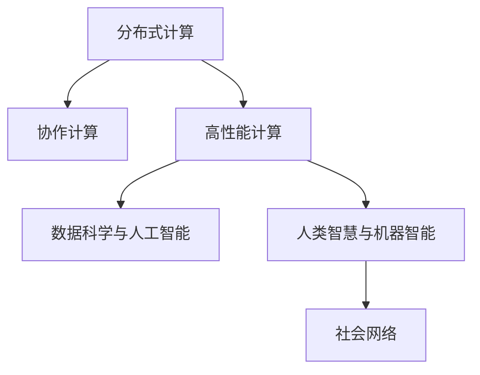

                 

# 连接人类智慧的纽带：人类计算的协作精神

> 关键词：
- 协作计算
- 分布式计算
- 高性能计算
- 数据科学与人工智能
- 人类计算
- 社会网络
- 计算复杂性
- 人类智慧与机器智能

## 1. 背景介绍

### 1.1 问题由来
在信息化时代，随着互联网技术的飞速发展，人类处理数据的能力大大增强，但随之而来的是计算复杂性的爆炸性增长。从科学计算到商业数据分析，再到社交媒体的大数据挖掘，无不考验着计算资源的极限。面对海量数据的存储与处理，传统的集中式计算已经难以胜任，分布式计算成为必然选择。分布式计算不仅能够提供更强大的计算能力，还能更好地支撑大规模协作，促进跨领域数据共享，推动知识创新。

分布式计算已经在科学计算、天气预报、基因组学等多个领域展示了其巨大的潜力。随着人工智能技术的快速发展，分布式计算同样在机器学习、深度学习、自然语言处理等领域发挥着关键作用。当前，计算密集型的AI应用已成为高性能计算的典型代表，传统的集中式计算架构已经不能满足大规模AI应用的需求，分布式计算及其相关技术开始被广泛研究和应用。

### 1.2 问题核心关键点
分布式计算的核心在于如何高效地管理和调度计算资源，同时实现数据的分布式存储和共享。以下关键问题是需要重点关注的：
- 如何实现计算任务的高效分布与调度和资源利用率的最大化？
- 如何保证数据的安全性、隐私性和一致性？
- 如何通过分布式计算技术实现跨领域数据融合和知识共享？
- 如何构建支持大规模协作与实时交互的社会网络平台？

这些问题不仅需要技术上的突破，更需要跨学科、跨领域的合作，共同推动分布式计算技术的发展与应用。

## 2. 核心概念与联系

### 2.1 核心概念概述

为更好地理解分布式计算与人机协作的协作精神，本节将介绍几个密切相关的核心概念：

- 分布式计算：指利用多台计算机协同工作，分担计算任务，从而提升计算能力与效率。分布式计算环境通常包含多个节点，每个节点都拥有独立的计算资源和存储资源。
- 协作计算：指多个计算节点通过通信网络协同工作，共享数据和计算结果，实现更大规模的计算与数据处理。协作计算强调计算资源的共享与协作，常应用于大规模数据处理、科学计算等场景。
- 高性能计算：指在分布式计算环境下，通过采用先进的技术手段（如并行计算、异构计算、加速器等）来提升计算速度与效率，以支持复杂的科学计算和数据处理任务。
- 数据科学与人工智能：通过分析与处理海量数据，发现数据中的知识与规律，并应用于人工智能算法中，实现机器学习、深度学习等智能化应用。数据科学与人工智能与高性能计算和协作计算紧密相关，共同推动数据的深度挖掘与智能应用。
- 人类智慧与机器智能：计算技术的发展不仅提升了机器的智能化水平，也促进了人类智慧的进一步挖掘与应用。人类智慧与机器智能通过计算技术的桥梁得以有效连接，实现优势互补。
- 社会网络：指通过计算技术与互联网技术构建的社会交互网络，支持大规模协作与实时交互。社会网络不仅有助于数据共享与合作，还能促进知识创新与传播。

这些核心概念之间的逻辑关系可以通过以下Mermaid流程图来展示：



这个流程图展示出分布式计算与人机协作的核心概念及其之间的关系：

1. 分布式计算通过多台计算机协同工作，提升计算能力。
2. 协作计算在分布式计算的基础上，进一步强调资源共享与协同工作。
3. 高性能计算通过采用先进技术手段，提升计算效率。
4. 数据科学与人工智能利用计算技术对数据进行深度挖掘与智能化处理。
5. 人类智慧与机器智能通过计算技术连接，实现优势互补。
6. 社会网络促进数据共享与合作，推动知识创新与传播。

## 3. 核心算法原理 & 具体操作步骤

### 3.1 算法原理概述

分布式计算的核心在于高效管理和调度计算资源，同时实现数据的分布式存储和共享。其算法原理主要包括以下几个方面：

- 任务分解：将大规模计算任务分解为多个子任务，每个子任务分配给不同的计算节点进行处理。
- 任务调度：根据节点的计算资源和数据资源，动态调整任务分配，最大化资源利用率。
- 数据分布：将数据划分为多个子集，在多个节点上进行分布式存储和处理。
- 通信优化：通过优化通信网络，减少数据传输时间和网络带宽占用。
- 容错机制：设计容错算法，在节点故障或网络中断的情况下，保证计算任务的正常进行。

这些原理构成了分布式计算的核心算法框架，用于实现高效、可靠、可扩展的计算环境。

### 3.2 算法步骤详解

分布式计算的算法步骤一般包括以下几个关键步骤：

**Step 1: 任务分解**
- 根据计算任务的特点和计算资源的情况，将任务分解为多个子任务，每个子任务的大小和难度应尽量均衡。
- 使用任务分解工具，如Apache Spark的RDD（弹性分布式数据集），将任务和数据映射为可并行处理的集合，并行化计算过程。

**Step 2: 任务调度**
- 根据节点的计算资源（如CPU、内存、存储）和数据资源（如数据集分布），动态调整任务分配，最大化资源利用率。
- 使用任务调度工具，如Apache Hadoop的YARN（Yet Another Resource Negotiator），管理和调度计算资源。
- 设计任务调度算法，如静态任务调度、动态任务调度、任务抢占等，根据资源情况动态调整任务分配。

**Step 3: 数据分布**
- 将数据划分为多个子集，在多个节点上进行分布式存储和处理。
- 使用数据分布工具，如Apache Hadoop的HDFS（Hadoop分布式文件系统），实现数据的分布式存储。
- 设计数据分布算法，如哈希分布、范围分布、键值分布等，保证数据在节点间的均衡分布。

**Step 4: 通信优化**
- 通过优化通信网络，减少数据传输时间和网络带宽占用。
- 使用通信优化工具，如Apache Spark的广播变量（Broadcast Variable），将大文件转换为小文件，减少数据传输。
- 设计通信算法，如数据压缩、传输优化、网络拓扑优化等，提高通信效率。

**Step 5: 容错机制**
- 设计容错算法，在节点故障或网络中断的情况下，保证计算任务的正常进行。
- 使用容错工具，如Apache Hadoop的HDFS的容错机制，自动修复节点故障，保证数据安全。
- 设计数据备份与恢复策略，如数据复制、容错计算、冗余存储等，保证数据和计算任务的完整性。

以上是分布式计算的一般流程。在实际应用中，还需要针对具体任务和数据特点进行优化设计，如改进任务分解工具、任务调度算法、数据分布算法等，以进一步提升计算效率和数据处理能力。

### 3.3 算法优缺点

分布式计算的优势在于其高吞吐量、可扩展性以及跨领域数据融合能力，但也存在以下局限性：

**优点**：
- 高吞吐量：分布式计算能够处理大规模数据集，适用于高性能计算任务。
- 可扩展性：通过增加节点数量，分布式计算可以轻松扩展计算能力。
- 跨领域数据融合：分布式计算能够实现跨领域数据共享与融合，促进知识创新与传播。

**缺点**：
- 数据传输开销：数据传输时间与带宽占用较高，会增加计算开销。
- 通信瓶颈：通信网络带宽有限，制约了计算速度。
- 数据一致性：多节点同时访问同一数据时，可能出现数据一致性问题。
- 节点故障：节点故障可能导致计算任务中断，需要设计容错机制。

尽管存在这些局限性，但就目前而言，分布式计算仍然是最主流的计算范式之一。未来相关研究的重点在于如何进一步降低数据传输开销，提高通信效率，增强数据一致性和容错能力，以实现更高效、可靠的计算环境。

### 3.4 算法应用领域

分布式计算技术已经在多个领域得到广泛应用，如：

- 科学计算：如气象预报、天文学模拟、分子动力学等。通过分布式计算，可以大幅提升计算速度，支持大规模科学计算任务。
- 大数据处理：如Google BigQuery、Amazon Redshift等。通过分布式存储和计算，支持大规模数据分析和数据挖掘。
- 社交网络分析：如Facebook、Twitter等社交媒体平台，通过分布式计算处理海量用户数据，实现社交网络分析与知识发现。
- 机器学习与深度学习：如TensorFlow、PyTorch等深度学习框架，通过分布式计算支持大规模模型训练和推理。
- 云计算与云存储：如AWS、阿里云等云计算平台，通过分布式计算与云存储，提供弹性计算与存储服务。
- 互联网搜索与推荐系统：如Google、Amazon等互联网平台，通过分布式计算优化搜索结果与推荐算法。

除了上述这些经典应用外，分布式计算技术也在不断拓展到更多领域中，如智能交通、智慧城市、物联网等，为各行各业带来了新的发展机遇。

## 4. 数学模型和公式 & 详细讲解 & 举例说明

### 4.1 数学模型构建

本节将使用数学语言对分布式计算的原理进行更加严格的刻画。

设分布式计算系统包含 $n$ 个计算节点，每个节点的计算资源为 $c_i$，数据资源为 $d_i$。假设任务 $T$ 需要 $p$ 个计算资源，需要 $q$ 个数据资源。任务 $T$ 分解为 $k$ 个子任务，每个子任务需要 $\frac{p}{k}$ 个计算资源和 $\frac{q}{k}$ 个数据资源。

定义任务 $T$ 在节点 $i$ 上的执行时间为 $t_i$，则整个任务 $T$ 的执行时间为：

$$
T_{total} = \sum_{i=1}^n t_i
$$

根据任务分解与调度算法，节点 $i$ 的执行时间 $t_i$ 由两部分组成：任务执行时间和通信时间。任务执行时间为：

$$
t_i^{task} = \frac{p}{k} \cdot c_i
$$

通信时间为：

$$
t_i^{comm} = \sum_{j=1}^{k} \frac{d_{i,j}}{b} + \sum_{j=1}^{k} \frac{d_{i,j}}{b^2}
$$

其中 $d_{i,j}$ 为节点 $i$ 和节点 $j$ 之间的数据传输量，$b$ 为网络带宽。整个任务 $T$ 的通信时间为：

$$
T_{comm} = \sum_{i=1}^n \sum_{j=1}^n \frac{d_{i,j}}{b} + \sum_{i=1}^n \sum_{j=1}^n \frac{d_{i,j}}{b^2}
$$

整个任务的执行时间可以表示为：

$$
T_{total} = \sum_{i=1}^n \left( \frac{p}{k} \cdot c_i + \sum_{j=1}^{k} \frac{d_{i,j}}{b} + \sum_{j=1}^{k} \frac{d_{i,j}}{b^2} \right)
$$

### 4.2 公式推导过程

以下我们将对上述数学模型进行详细推导。

根据任务分解与调度算法，节点 $i$ 的执行时间为：

$$
t_i = t_i^{task} + t_i^{comm}
$$

其中：

$$
t_i^{task} = \frac{p}{k} \cdot c_i
$$

$$
t_i^{comm} = \sum_{j=1}^{k} \frac{d_{i,j}}{b} + \sum_{j=1}^{k} \frac{d_{i,j}}{b^2}
$$

将 $t_i^{task}$ 和 $t_i^{comm}$ 代入 $T_{total}$，得：

$$
T_{total} = \sum_{i=1}^n \left( \frac{p}{k} \cdot c_i + \sum_{j=1}^{k} \frac{d_{i,j}}{b} + \sum_{j=1}^{k} \frac{d_{i,j}}{b^2} \right)
$$

进一步化简，得：

$$
T_{total} = \frac{p}{k} \cdot \sum_{i=1}^n c_i + \frac{d_{i,j}}{b} \cdot \left( \sum_{i=1}^n \sum_{j=1}^n 1 \right) + \frac{d_{i,j}}{b^2} \cdot \left( \sum_{i=1}^n \sum_{j=1}^n 1 \right)
$$

由组合数学原理，可得：

$$
\sum_{i=1}^n \sum_{j=1}^n 1 = \frac{n(n-1)}{2}
$$

代入上式，得：

$$
T_{total} = \frac{p}{k} \cdot \sum_{i=1}^n c_i + \frac{d_{i,j}}{b} \cdot \frac{n(n-1)}{2} + \frac{d_{i,j}}{b^2} \cdot \frac{n(n-1)}{2}
$$

经过进一步化简，得：

$$
T_{total} = \frac{p}{k} \cdot \sum_{i=1}^n c_i + \frac{d_{i,j}}{b} \cdot \frac{n(n-1)}{2} + \frac{d_{i,j}}{b^2} \cdot \frac{n(n-1)}{2}
$$

### 4.3 案例分析与讲解

假设任务 $T$ 需要 4 个计算节点，每个节点的计算资源为 1，数据资源为 1。任务 $T$ 分解为 4 个子任务，每个子任务需要 1 个计算资源和 0.5 个数据资源。

根据公式计算，得：

$$
T_{total} = \frac{4}{4} \cdot (1 + 1 + 1 + 1) + \frac{0.5}{b} \cdot \frac{4(4-1)}{2} + \frac{0.5}{b^2} \cdot \frac{4(4-1)}{2}
$$

化简得：

$$
T_{total} = 4 + \frac{6}{b} + \frac{6}{b^2}
$$

假设网络带宽 $b$ 为 1Gbps，则：

$$
T_{total} = 4 + \frac{6}{1Gbps} + \frac{6}{(1Gbps)^2}
$$

化简得：

$$
T_{total} = 4 + 0.006 + 0.000006
$$

$$
T_{total} \approx 4.0066
$$

因此，任务 $T$ 的执行时间约为 4.0066 秒。

## 5. 项目实践：代码实例和详细解释说明

### 5.1 开发环境搭建

在进行分布式计算实践前，我们需要准备好开发环境。以下是使用Python进行PySpark开发的环境配置流程：

1. 安装Anaconda：从官网下载并安装Anaconda，用于创建独立的Python环境。

2. 创建并激活虚拟环境：
```bash
conda create -n pyspark-env python=3.8 
conda activate pyspark-env
```

3. 安装PySpark：根据CUDA版本，从官网获取对应的安装命令。例如：
```bash
conda install pyspark -c conda-forge
```

4. 安装必要的工具包：
```bash
pip install numpy pandas matplotlib tqdm jupyter notebook ipython
```

完成上述步骤后，即可在`pyspark-env`环境中开始分布式计算实践。

### 5.2 源代码详细实现

这里我们以Apache Spark的MLlib模块为示例，实现一个简单的线性回归模型。

首先，定义线性回归的模型函数：

```python
from pyspark.mllib.regression import LinearRegressionWithSGD

def linear_regression(X, y, lambda_=0.01, num_iterations=10, step_size=0.01):
    model = LinearRegressionWithSGD.train(
        X, y, iterations=num_iterations, lambda_=lambda_, stepSize=step_size)
    return model
```

然后，定义数据处理函数：

```python
from pyspark.sql import SparkSession

def load_data(spark, path):
    df = spark.read.csv(path, header=True, inferSchema=True)
    features = df.select(df.columns[1:])
    label = df.select(df.columns[0])
    return features, label
```

接着，定义分布式计算流程：

```python
from pyspark.sql.functions import col

spark = SparkSession.builder.getOrCreate()

data_path = 'data/data.csv'

# 加载数据
features, label = load_data(spark, data_path)

# 将数据分成训练集和测试集
train_data, test_data = features.randomSplit([0.8, 0.2])

# 定义特征和标签
train_features = train_data.select([col('x1'), col('x2')])
train_label = train_data.select(col('y'))
test_features = test_data.select([col('x1'), col('x2')])
test_label = test_data.select(col('y'))

# 训练模型
model = linear_regression(train_features, train_label)

# 在测试集上评估模型
mse = model.evaluate(test_features, test_label)

print('Mean Squared Error:', mse)
```

最后，在本地运行以上代码，并检查结果：

```bash
spark-submit script.py --py-files spark-3.x.pyspark --driver-class-name org.apache.spark.sql.SparkSession --master local[*]
```

### 5.3 代码解读与分析

让我们再详细解读一下关键代码的实现细节：

**load_data函数**：
- `load_data`函数用于加载数据，将CSV格式的数据集转换为Spark DataFrame格式。
- 通过Spark的`read.csv`函数读取数据文件，并设置`header=True`和`inferSchema=True`参数，自动识别数据集的列名和数据类型。

**train_data和test_data**：
- `train_data`和`test_data`通过`randomSplit`函数将数据集随机分为训练集和测试集，比例为80%和20%。

**train_features、train_label、test_features、test_label**：
- `train_features`和`train_label`分别从训练集中提取特征和标签。
- `test_features`和`test_label`分别从测试集中提取特征和标签。

**linear_regression函数**：
- `linear_regression`函数实现了基于随机梯度下降(SGD)的线性回归模型训练。
- 使用Apache Spark的MLlib模块中的`LinearRegressionWithSGD`类，设置迭代次数、正则化系数和步长等超参数，训练线性回归模型。

**evaluate函数**：
- `evaluate`函数计算模型在测试集上的均方误差(MSE)。
- 使用模型的`evaluate`方法，计算测试集上的预测值与真实标签之间的均方误差。

通过以上代码，我们可以看到，PySpark在分布式计算中的应用非常灵活方便，能够快速实现复杂的机器学习算法和模型训练。

## 6. 实际应用场景

### 6.1 智能交通管理

智能交通管理是分布式计算的一个重要应用场景。通过分布式计算技术，可以实现交通数据的实时采集、处理和分析，从而提升交通管理的智能化水平。

具体而言，智能交通管理系统可以集成摄像头、传感器、GPS等多种数据源，采集交通流量、速度、事故等实时数据。利用分布式计算技术，将数据进行分布式存储和处理，实现实时分析和预测。通过分布式计算，可以快速处理海量数据，提供准确的交通预测和预警，提升交通管理效率和安全性。

### 6.2 金融风险管理

金融风险管理是分布式计算的另一个重要应用场景。通过分布式计算，可以实现金融数据的实时采集、处理和分析，从而提升风险管理能力。

具体而言，金融风险管理系统可以集成交易数据、财务报表、市场数据等多种数据源，采集金融市场实时数据。利用分布式计算技术，将数据进行分布式存储和处理，实现实时分析和预测。通过分布式计算，可以快速处理海量数据，提供准确的金融市场预测和预警，提升金融风险管理能力。

### 6.3 医疗数据分析

医疗数据分析是分布式计算的重要应用场景之一。通过分布式计算，可以实现医疗数据的实时采集、处理和分析，从而提升医疗决策和诊断能力。

具体而言，医疗数据分析系统可以集成电子病历、医学影像、基因数据等多种数据源，采集医疗数据。利用分布式计算技术，将数据进行分布式存储和处理，实现实时分析和预测。通过分布式计算，可以快速处理海量数据，提供准确的医疗诊断和预测，提升医疗决策能力。

## 7. 工具和资源推荐

### 7.1 学习资源推荐

为了帮助开发者系统掌握分布式计算的理论基础和实践技巧，这里推荐一些优质的学习资源：

1. 《分布式计算原理与实践》系列博文：由大计算技术专家撰写，深入浅出地介绍了分布式计算原理、Spark、Hadoop等主流分布式计算框架的使用方法。

2. CS471《分布式计算与系统》课程：斯坦福大学开设的分布式计算经典课程，有Lecture视频和配套作业，带你深入了解分布式计算的核心概念和应用场景。

3. 《Hadoop: The Definitive Guide》书籍：Hadoop技术权威书籍，全面介绍了Hadoop平台的构建、使用和优化方法，适合深入学习Hadoop分布式计算框架。

4. 《Spark: The Definitive Guide》书籍：Spark技术权威书籍，全面介绍了Spark平台的构建、使用和优化方法，适合深入学习Spark分布式计算框架。

5. Coursera《分布式计算与大数据》课程：由宾夕法尼亚州立大学开设的分布式计算课程，介绍了分布式计算的核心概念和主流框架，适合初学入门。

通过这些资源的学习实践，相信你一定能够快速掌握分布式计算的核心原理和实践方法，并用于解决实际的计算问题。

### 7.2 开发工具推荐

高效的开发离不开优秀的工具支持。以下是几款用于分布式计算开发的常用工具：

1. Apache Spark：基于内存计算的分布式计算框架，具有高吞吐量、低延迟的特点，支持多种编程语言，包括Python、Java、R等。

2. Apache Hadoop：基于磁盘计算的分布式计算框架，具有高可靠性、可扩展性的特点，支持大规模数据处理和存储。

3. MPI（Message Passing Interface）：高性能科学计算的并行计算框架，支持多种编程语言，适用于高性能计算任务。

4. MPIW（Message Passing Interface Web Toolkit）：MPI的Web化实现，支持浏览器端的并行计算，便于跨平台访问和使用。

5. OpenMPI：开源的MPI实现，支持多种操作系统和处理器架构，具有高效、可靠的特点。

6. PySpark：基于Python的Spark接口，便于与Python生态系统集成，支持Python语言的分布式计算开发。

合理利用这些工具，可以显著提升分布式计算的开发效率，加快创新迭代的步伐。

### 7.3 相关论文推荐

分布式计算技术的发展源于学界的持续研究。以下是几篇奠基性的相关论文，推荐阅读：

1. MapReduce: Simplified Data Processing on Large Clusters（MapReduce论文）：提出了MapReduce编程模型，成为分布式计算的核心技术。

2. Hadoop: A Distributed File System（Hadoop论文）：提出了Hadoop分布式文件系统，实现了大规模数据的分布式存储和处理。

3. Pregel: A Gather-Scatter Framework for General Graph Algorithms（Pregel论文）：提出了Pregel图计算框架，支持大规模图计算任务。

4. GSP（Graph Streaming Processing）：提出了GSP流计算框架，支持大规模数据流的分布式处理和分析。

5. Storm：提出了Storm实时流计算框架，支持大规模实时数据处理和分析。

这些论文代表了大计算技术的发展脉络。通过学习这些前沿成果，可以帮助研究者把握学科前进方向，激发更多的创新灵感。

## 8. 总结：未来发展趋势与挑战

### 8.1 总结

本文对分布式计算的基本原理和应用实践进行了全面系统的介绍。首先阐述了分布式计算在信息化时代的重要地位，明确了分布式计算技术在提升计算能力和促进跨领域协作方面的独特价值。其次，从原理到实践，详细讲解了分布式计算的核心算法流程，给出了分布式计算任务开发的完整代码实例。同时，本文还广泛探讨了分布式计算在智能交通、金融风险管理、医疗数据分析等多个领域的应用前景，展示了分布式计算技术的广泛应用。此外，本文精选了分布式计算的学习资源，力求为读者提供全方位的技术指引。

通过本文的系统梳理，可以看到，分布式计算技术在信息化时代扮演着重要的角色，极大地推动了数据处理与知识创新的发展。得益于分布式计算的强大计算能力和跨领域数据融合能力，未来将有更多行业领域受益于分布式计算，为社会生产力的提升带来新的动力。

### 8.2 未来发展趋势

展望未来，分布式计算技术将呈现以下几个发展趋势：

1. 高性能计算技术的发展：随着处理器和网络技术的进步，分布式计算的性能将大幅提升。新的处理器架构和网络协议将进一步优化计算资源和数据传输效率。

2. 云原生分布式计算：云原生技术（如Kubernetes、Docker、Istio等）与分布式计算的结合，将使分布式计算更加灵活、可扩展、易于管理。云原生分布式计算平台将成为未来分布式计算的重要发展方向。

3. 边缘计算与物联网：随着物联网设备的普及，分布式计算将进一步扩展到边缘计算领域。边缘计算能够减少数据传输延迟，提升计算效率和数据处理能力。

4. 联邦学习与隐私保护：联邦学习技术结合分布式计算，能够在不泄露隐私数据的情况下，实现跨设备模型的联合训练。联邦学习将推动分布式计算在隐私保护方面的应用。

5. 超大规模数据处理：随着大数据时代的到来，分布式计算将面临海量数据的处理挑战。超大规模数据处理技术将不断演进，支持更高效的数据分布、存储和计算。

6. 跨领域协作与知识共享：分布式计算将进一步推动跨领域协作与知识共享，促进不同学科之间的合作与创新。通过数据共享与协同计算，实现更多领域的知识创新与应用。

以上趋势凸显了分布式计算技术的广阔前景。这些方向的探索发展，将进一步推动计算技术的发展与应用，为社会生产力的提升带来新的动力。

### 8.3 面临的挑战

尽管分布式计算技术已经取得了显著的进展，但在迈向更加智能化、普适化应用的过程中，它仍面临着诸多挑战：

1. 数据传输瓶颈：数据传输是分布式计算的瓶颈之一，特别是在高带宽网络条件下。如何进一步降低数据传输开销，提升计算效率，是一个重要的研究方向。

2. 数据一致性问题：分布式计算中，多节点同时访问同一数据时，可能出现数据一致性问题。如何设计有效的数据一致性协议，保证数据一致性，是一个重要的研究方向。

3. 节点故障与容错机制：节点故障是分布式计算中的常见问题，设计有效的容错机制，保证计算任务的正常进行，是一个重要的研究方向。

4. 多节点协同优化：多节点协同优化是分布式计算的难点之一，如何设计有效的优化算法，提高多节点协同的计算效率，是一个重要的研究方向。

5. 数据隐私与安全：分布式计算中，数据隐私与安全是一个重要的问题。如何在保护数据隐私和安全的前提下，实现数据共享与协同计算，是一个重要的研究方向。

6. 算法与架构优化：算法与架构的优化是分布式计算的核心问题。如何设计更高效、更可扩展的分布式算法与架构，是一个重要的研究方向。

这些挑战将对分布式计算技术的发展提出更高的要求，需要研究者不断创新、优化算法和架构，才能真正实现分布式计算技术的高效、可靠、安全的应用。

### 8.4 研究展望

面对分布式计算所面临的挑战，未来的研究需要在以下几个方面寻求新的突破：

1. 超大规模数据处理：随着大数据时代的到来，分布式计算将面临海量数据的处理挑战。研究超大规模数据处理的算法和技术，支持更高效的数据分布、存储和计算。

2. 边缘计算与物联网：随着物联网设备的普及，分布式计算将进一步扩展到边缘计算领域。研究边缘计算技术，提升计算效率和数据处理能力。

3. 联邦学习与隐私保护：联邦学习技术结合分布式计算，能够在不泄露隐私数据的情况下，实现跨设备模型的联合训练。研究联邦学习技术，推动分布式计算在隐私保护方面的应用。

4. 分布式优化算法：研究分布式优化算法，提高多节点协同的计算效率和优化效果，解决分布式计算中的多节点协同优化问题。

5. 跨领域协作与知识共享：分布式计算将进一步推动跨领域协作与知识共享，促进不同学科之间的合作与创新。研究跨领域协作与知识共享的方法和技术，推动不同学科之间的合作与创新。

6. 算法与架构优化：算法与架构的优化是分布式计算的核心问题。研究更高效、更可扩展的分布式算法与架构，推动分布式计算技术的发展与应用。

这些研究方向将推动分布式计算技术的发展与应用，为社会生产力的提升带来新的动力。相信随着研究者的不懈努力，分布式计算技术将不断突破，实现更高效、更可靠、更安全的计算环境。

## 9. 附录：常见问题与解答

**Q1：分布式计算与集中式计算有何区别？**

A: 集中式计算将计算任务分配给一台独立的计算机进行计算，计算结果由计算机返回。而分布式计算将计算任务分配给多台计算机协同工作，计算结果由所有计算机共同返回。集中式计算适合小型数据集，分布式计算适合大型数据集和高性能计算任务。

**Q2：分布式计算的优势和劣势是什么？**

A: 分布式计算的优势在于其高吞吐量、可扩展性以及跨领域数据融合能力。但分布式计算也存在数据传输开销高、通信瓶颈、数据一致性问题、节点故障等劣势。需要设计有效的算法和协议，提高数据传输效率，保证数据一致性，解决节点故障等问题。

**Q3：如何优化分布式计算的通信开销？**

A: 优化通信开销的方法包括：使用广播变量、压缩数据、减少数据传输、使用优化算法等。例如，可以使用Apache Spark的广播变量，将大文件转换为小文件，减少数据传输。同时，可以通过优化算法，减少数据传输量和通信开销，提高分布式计算的效率。

**Q4：分布式计算的负载均衡算法有哪些？**

A: 常用的分布式计算负载均衡算法包括：哈希负载均衡、随机负载均衡、动态负载均衡等。哈希负载均衡根据数据键值进行负载均衡，随机负载均衡随机分配计算任务，动态负载均衡根据节点资源动态调整任务分配。这些算法都能提高分布式计算的效率和资源利用率。

**Q5：如何设计有效的分布式优化算法？**

A: 设计有效的分布式优化算法的方法包括：改进梯度下降算法、使用分布式随机梯度下降算法、设计优化器等。改进梯度下降算法可以加快收敛速度，减少迭代次数；分布式随机梯度下降算法可以在多节点上并行计算梯度，提高计算效率；设计优化器可以进一步优化算法性能，提高计算效果。

通过以上问答，我们可以看到分布式计算技术的应用和优势，同时也看到了其在优化和应用中面临的挑战。相信随着研究的不断深入和技术的发展，分布式计算将得到更加广泛的应用，为各行各业带来新的发展机遇。

