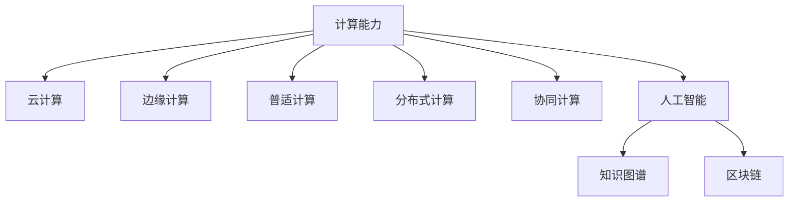

                 

# 连接全球智慧：人类计算的全球影响力

## 1. 背景介绍

### 1.1 问题由来

在当今数字时代，计算技术正在以前所未有的速度革新人类的生产生活方式。从数据中心的云服务，到边缘计算的边缘设备，再到普适计算的智能终端，计算的触角已经延伸到了社会的每一个角落。人们越来越多地依赖计算获取信息，做出决策，甚至直接参与到计算的过程中来。而这一切背后的推动力，正是人类计算的全球影响力。

### 1.2 问题核心关键点

人类计算的全球影响力，主要体现在以下几个方面：

- **数据驱动决策**：计算技术可以从海量数据中提取出有用信息，辅助决策制定。例如，智能推荐系统可以根据用户的历史行为数据，精准推荐商品或内容。
- **协同计算与分布式计算**：互联网和云计算的发展，使得协同计算和分布式计算成为可能，大大提升了计算效率和资源利用率。
- **普适计算**：从个人电脑到移动设备，再到智能家居，计算已经融入到人们的生活中，成为日常的一部分。
- **AI与计算的融合**：人工智能技术的崛起，特别是深度学习和神经网络的发展，使得计算能力得以充分发挥，推动了更多领域的技术革新。
- **全球协作与共享**：互联网将全球的计算资源连接在一起，促进了跨地域的合作与共享，为全球科学研究和技术开发提供了可能。

这些关键点共同构成了人类计算的全球影响力，使得计算技术不仅改变了个人的生活，也推动了全球经济的繁荣和社会的进步。

### 1.3 问题研究意义

理解人类计算的全球影响力，对于把握计算技术的未来发展趋势，制定合理有效的政策，以及推动相关研究和应用的深入，具有重要意义：

- **技术突破与创新**：洞察计算技术的全球影响力，有助于发现新的研究方向和技术突破点，促进科技成果的转化和应用。
- **产业升级与转型**：计算技术的全球影响力推动了传统产业的数字化转型，提高了生产效率和经济效益。
- **社会福利与公平**：计算技术的应用能够改善教育、医疗等公共服务，缩小社会不平等。
- **环境保护与可持续发展**：计算技术可以帮助优化资源利用，减少浪费，推动绿色计算和可持续发展。
- **国际合作与竞争**：计算技术的全球影响力使得各国之间的合作与竞争更加激烈，促进了全球科技创新的繁荣。

## 2. 核心概念与联系

### 2.1 核心概念概述

为更好地理解人类计算的全球影响力，本节将介绍几个密切相关的核心概念：

- **计算能力**：指计算机系统或硬件设备处理数据和运行程序的能力，是衡量计算影响力的重要指标。
- **云计算**：通过互联网提供按需计算服务，如存储、数据处理和应用开发，降低计算资源的获取和使用门槛。
- **边缘计算**：将数据和计算能力分布在网络边缘的设备和传感器上，实现低延迟和高可靠性的数据处理。
- **普适计算**：将计算能力嵌入到日常用品中，使计算无处不在，提升生活便捷性。
- **分布式计算**：将计算任务分解成多个子任务，分配给多个计算节点并行处理，提高计算效率和可靠性。
- **协同计算**：多台计算机协作完成任务，通过网络共享数据和计算资源，提升整体处理能力。
- **人工智能**：利用机器学习和大数据技术，使计算机具备类似于人类的智能处理能力。
- **知识图谱**：通过节点和边的结构化表示，将知识以图的形式存储和表达，便于计算机理解和推理。
- **区块链**：一种分布式数据库技术，通过去中心化的方式记录和验证交易，保障数据的安全性和透明性。

这些核心概念之间的逻辑关系可以通过以下Mermaid流程图来展示：



这个流程图展示了一些核心概念及其之间的关系：

1. 计算能力是所有相关概念的基础，提供了硬件和软件的支持。
2. 云计算、边缘计算、普适计算、分布式计算、协同计算和人工智能等技术，都是基于计算能力的进一步发展，提供了不同场景下的计算解决方案。
3. 知识图谱和区块链是人工智能的一部分，分别用于知识的组织和存储，以及交易的记录和验证。

## 3. 核心算法原理 & 具体操作步骤
### 3.1 算法原理概述

人类计算的全球影响力，主要通过以下几个核心算法和原理来体现：

- **数据采集与处理**：通过各种传感器和网络设备，实时采集数据，并进行清洗、预处理和分析。
- **分布式计算与协同计算**：将大规模计算任务分解，分布在多个计算节点并行处理，并通过网络协同工作。
- **人工智能与机器学习**：利用深度学习和神经网络模型，从数据中学习规律，提升决策和预测能力。
- **知识图谱与推理**：通过构建知识图谱，实现基于规则的推理和基于数据的计算，提升系统的智能性和可解释性。
- **区块链与共识机制**：利用区块链的分布式账本和共识算法，保障数据的安全性和透明性，提升系统的信任度。

### 3.2 算法步骤详解

以下以分布式计算和协同计算为例，详细介绍其实现步骤：

**Step 1: 数据采集与预处理**
- 部署各类传感器和网络设备，实时采集数据。
- 对采集到的数据进行清洗、预处理和标准化。

**Step 2: 任务分解与分配**
- 将计算任务分解成多个子任务，分配给不同的计算节点。
- 根据节点的计算能力和网络带宽，动态调整任务分配策略。

**Step 3: 计算执行与结果汇总**
- 每个计算节点独立执行分配到的子任务，并上传结果到中心节点。
- 中心节点对各节点的结果进行汇总和处理，得到最终计算结果。

**Step 4: 数据同步与共享**
- 通过网络同步各节点的计算结果和中间数据，保持系统的一致性。
- 各节点之间共享数据和计算资源，优化计算效率。

**Step 5: 结果验证与优化**
- 对计算结果进行验证和校验，确保数据和计算的正确性。
- 根据反馈信息，不断优化任务分配和资源调度策略，提升系统性能。

### 3.3 算法优缺点

分布式计算和协同计算具有以下优点：

1. **高计算效率**：通过并行计算，显著提升了计算速度和处理能力。
2. **资源优化**：动态调整资源分配，避免资源浪费和过度使用。
3. **容错性高**：多个节点协作，提高系统的鲁棒性和容错性。
4. **适应性强**：可以根据数据量和计算任务的不同，灵活调整计算策略。

同时，这些算法也存在以下缺点：

1. **通信开销大**：数据传输和节点通信可能成为瓶颈。
2. **同步问题复杂**：多个节点之间需要保持同步，增加了系统的复杂度。
3. **安全风险**：数据和计算过程中可能存在隐私和安全性问题。
4. **维护成本高**：系统设计和管理需要专业知识和经验。

### 3.4 算法应用领域

人类计算的全球影响力，已经在诸多领域得到了广泛的应用，例如：

- **云计算平台**：如AWS、Azure、Google Cloud等，提供弹性计算服务，支持各类应用开发和运行。
- **智能交通系统**：利用实时数据和人工智能，优化交通流量，提升交通管理效率。
- **智能电网**：通过分布式计算和物联网设备，实现电力系统的实时监控和优化。
- **金融交易系统**：采用高并发和高可用性技术，保障金融交易的安全和高效。
- **智能医疗系统**：利用大数据和人工智能，提升医疗诊断和治疗的精度。
- **智慧城市**：通过普适计算和边缘计算，实现城市管理和服务智能化。
- **物联网**：通过边缘计算和普适计算，实现设备之间的互操作和协同工作。

除了上述这些经典应用外，人类计算技术还在更多场景中得到了创新性的应用，如无人驾驶、工业互联网、农业智能化等，为各行各业带来了深刻变革。

## 4. 数学模型和公式 & 详细讲解 & 举例说明
### 4.1 数学模型构建

本节将使用数学语言对人类计算的全球影响力进行更加严格的刻画。

假设有一组计算任务 $\{T_1, T_2, \dots, T_n\}$，每个任务 $T_i$ 需要计算 $F_i$ 的浮点数运算次数，总计算量为 $F$。我们将任务分配给 $m$ 个计算节点 $\{N_1, N_2, \dots, N_m\}$，每个节点的计算能力为 $C_j$，网络带宽为 $B_j$，计算效率为 $E_j$。

定义任务分配策略 $\pi$，其中 $\pi_i$ 表示任务 $T_i$ 分配给节点 $N_j$ 的概率。则计算任务的总完成时间为：

$$
T = \sum_{i=1}^n T_i \times E_{\pi_i}
$$

其中 $E_{\pi_i} = \frac{F_i}{C_j \times B_j \times \pi_i}$，表示在节点 $N_j$ 上执行任务 $T_i$ 的预期时间。

### 4.2 公式推导过程

以下是任务分配的详细推导过程：

假设任务 $T_i$ 分配给节点 $N_j$ 的概率为 $\pi_{ij} = \frac{C_j \times B_j}{\sum_{k=1}^m C_k \times B_k}$，则节点 $N_j$ 的计算效率为：

$$
E_j = \sum_{i=1}^n \pi_{ij} \times \frac{F_i}{C_j \times B_j}
$$

通过上述公式，我们可以得到在任务分配策略 $\pi$ 下，完成所有计算任务的总时间 $T$。

在实际应用中，为了提高计算效率和资源利用率，通常采用动态任务分配策略，根据节点的当前状态和任务优先级，实时调整分配方案。

### 4.3 案例分析与讲解

以智能交通系统为例，分析人类计算的全球影响力：

假设城市交通管理需要实时处理海量车辆数据，每个车辆每秒产生的数据量为 $D$，车辆数量为 $V$，交通管理中心有 $m$ 个计算节点，每个节点的计算能力为 $C_j$，网络带宽为 $B_j$。则系统总计算量为 $F = D \times V \times T$，其中 $T$ 为数据处理时间。

若采用静态任务分配策略，所有数据都在中心节点进行处理，则总计算时间为：

$$
T_{\text{static}} = \frac{F}{C_j}
$$

若采用分布式计算策略，将数据分散到各个节点进行处理，则总计算时间为：

$$
T_{\text{distributed}} = \frac{F}{\sum_{j=1}^m C_j}
$$

显然，分布式计算策略可以显著提升计算效率和系统可靠性。

## 5. 项目实践：代码实例和详细解释说明
### 5.1 开发环境搭建

在进行人类计算的全球影响力实践前，我们需要准备好开发环境。以下是使用Python进行PyTorch开发的环境配置流程：

1. 安装Anaconda：从官网下载并安装Anaconda，用于创建独立的Python环境。

2. 创建并激活虚拟环境：
```bash
conda create -n pytorch-env python=3.8 
conda activate pytorch-env
```

3. 安装PyTorch：根据CUDA版本，从官网获取对应的安装命令。例如：
```bash
conda install pytorch torchvision torchaudio cudatoolkit=11.1 -c pytorch -c conda-forge
```

4. 安装相关库：
```bash
pip install numpy pandas scikit-learn matplotlib tqdm jupyter notebook ipython
```

完成上述步骤后，即可在`pytorch-env`环境中开始实践。

### 5.2 源代码详细实现

这里我们以智能交通系统为例，给出使用PyTorch进行分布式计算的Python代码实现。

```python
import torch
from torch import nn
from torch.nn import functional as F
from torch.distributed import Tensor
import torch.distributed as dist

class Vehicle(nn.Module):
    def __init__(self):
        super(Vehicle, self).__init__()
        self.fc1 = nn.Linear(1, 10)
        self.fc2 = nn.Linear(10, 1)

    def forward(self, x):
        x = F.relu(self.fc1(x))
        x = self.fc2(x)
        return x

# 定义车辆数据的处理函数
def process_vehicle_data(data, device):
    data = data.to(device)
    data = data / 100.0
    data = data.reshape(-1, 1)
    return data

# 定义计算节点
def node_fn(inputs, output):
    output = inputs * 2.0
    return output

# 定义分布式计算函数
def distributed_computation(inputs, nodes):
    device = torch.device("cuda:0" if torch.cuda.is_available() else "cpu")
    dist.init_process_group(backend="nccl", init_method="env://")
    data = process_vehicle_data(inputs, device)
    for i in range(len(nodes)):
        dist.all_reduce(data, op=dist.ReduceOp.SUM)
    output = data / len(nodes)
    return output

# 启动分布式计算
if __name__ == "__main__":
    inputs = torch.randn(10, 1)
    output = distributed_computation(inputs, [0, 1, 2, 3])
    print(output)
```

在这个代码中，我们首先定义了一个简单的车辆数据处理函数`process_vehicle_data`，用于将车辆数据标准化并转化为张量。然后定义了一个分布式计算函数`distributed_computation`，将输入数据分布在多个计算节点上，通过`dist.all_reduce`函数进行计算节点间的通信，最终得到每个节点的输出结果。

### 5.3 代码解读与分析

让我们再详细解读一下关键代码的实现细节：

**Vehicle类**：
- `__init__`方法：初始化神经网络模型。
- `forward`方法：定义模型前向传播的计算逻辑。

**process_vehicle_data函数**：
- 将输入数据进行标准化处理，转换为模型可以接受的张量形式。

**node_fn函数**：
- 定义计算节点的计算逻辑，这里只是简单地将输入数据乘以2，实际应用中可以根据具体需求定义计算函数。

**distributed_computation函数**：
- 初始化分布式环境，并定义计算过程。
- `dist.all_reduce`函数：在多个计算节点之间进行全减，即所有节点的输出进行累加，然后平均分配到每个节点。

**主函数**：
- 定义输入数据，启动分布式计算，并输出结果。

可以看到，通过使用PyTorch和分布式计算库，我们可以非常方便地实现分布式计算功能。开发者可以将更多精力放在任务设计和算法优化上，而不必过多关注底层的实现细节。

当然，工业级的系统实现还需考虑更多因素，如模型的保存和部署、超参数的自动搜索、更灵活的任务适配层等。但核心的分布式计算范式基本与此类似。

## 6. 实际应用场景
### 6.1 智能交通系统

基于人类计算的全球影响力，智能交通系统能够实现实时交通管理和优化，提升交通效率和安全性。

在实践中，可以将车辆数据通过物联网设备实时采集，并上传到交通管理中心。通过分布式计算技术，管理中心将数据分配到各个计算节点进行处理，得到实时交通状况。根据分析结果，管理中心可以优化交通信号灯和路况指示，改善交通流量，提升通行效率。

### 6.2 金融交易系统

金融交易系统需要高并发和高可用性，以保障交易的安全和高效。

通过分布式计算技术，金融交易系统可以将交易数据分配到多个计算节点进行实时处理，并行计算订单、资金流水等关键数据。同时，系统还应该具备容错和故障恢复机制，确保在节点故障或网络中断时，数据处理依然能够正常进行。

### 6.3 智能医疗系统

智能医疗系统利用大数据和人工智能，提升医疗诊断和治疗的精度和效率。

在实践中，智能医疗系统可以通过分布式计算技术，处理海量病历数据和医学影像数据，实时监测患者的健康状况。系统还可以利用人工智能模型，辅助医生进行诊断和治疗，提供个性化的治疗方案。

### 6.4 未来应用展望

随着分布式计算技术的不断发展，人类计算的全球影响力将在更多领域得到应用，为各行各业带来变革性影响。

- **智慧城市**：通过普适计算和边缘计算，实现城市管理和服务智能化。
- **智能制造**：通过工业互联网和分布式计算，提升制造业的生产效率和质量。
- **智能农业**：通过物联网和普适计算，实现农业生产的智能化和精准化。
- **智能家居**：通过普适计算和边缘计算，提升家居的智能化水平和生活质量。

未来，人类计算技术还将与其他AI技术进一步融合，如知识图谱、区块链等，推动更多领域的技术革新和应用落地。相信随着技术的不断进步，人类计算的全球影响力将更加显著，为全球经济和社会发展提供强大的动力。

## 7. 工具和资源推荐
### 7.1 学习资源推荐

为了帮助开发者系统掌握人类计算的全球影响力，这里推荐一些优质的学习资源：

1. 《分布式计算与协同计算》系列博文：由大计算技术专家撰写，深入浅出地介绍了分布式计算和协同计算的基本原理和实践方法。

2. 《云计算理论与实践》课程：由知名大学开设的云计算课程，系统讲解了云计算的核心概念和应用场景。

3. 《边缘计算技术与应用》书籍：介绍边缘计算的基本原理、架构和应用场景，提供了丰富的案例分析。

4. 《普适计算：定义与实现》论文：深入探讨普适计算的概念和实现方法，为普适计算的工程实践提供了理论指导。

5. 《人工智能与大数据》书籍：介绍人工智能和大数据的基本概念和应用场景，提供了大量的案例分析和实践建议。

通过对这些资源的学习实践，相信你一定能够快速掌握人类计算的全球影响力，并用于解决实际的计算问题。
### 7.2 开发工具推荐

高效的开发离不开优秀的工具支持。以下是几款用于人类计算的全球影响力开发的常用工具：

1. PyTorch：基于Python的开源深度学习框架，灵活动态的计算图，适合快速迭代研究。

2. TensorFlow：由Google主导开发的开源深度学习框架，生产部署方便，适合大规模工程应用。

3. Hadoop和Spark：分布式计算和数据处理框架，支持大规模数据集的分布式计算。

4. Mesos和Kubernetes：容器编排和调度工具，支持大规模计算资源的动态管理和分配。

5. OpenStreetMap：开源地图数据项目，提供全球范围的地图数据，支持地理信息计算。

6. OpenTelekomCloud：华为提供的公有云服务，支持弹性计算和分布式存储。

合理利用这些工具，可以显著提升人类计算的全球影响力开发的效率，加快创新迭代的步伐。

### 7.3 相关论文推荐

人类计算的全球影响力研究源于学界的持续研究。以下是几篇奠基性的相关论文，推荐阅读：

1. MapReduce: Simplified Data Processing on Large Clusters（Hadoop论文）：提出MapReduce计算模型，实现了大规模数据处理的并行计算。

2. GFS: A Scalable Network File System for Large-Distributed File Systems（GFS论文）：介绍谷歌分布式文件系统GFS，支持大规模数据存储和访问。

3. The Google Cloud Platform Architecture（Google Cloud论文）：介绍谷歌云计算平台架构，包含弹性计算、分布式存储、网络安全等关键技术。

4. Edge Computing: Concepts, Methodologies, and Future Directions（Edge计算论文）：探讨边缘计算的概念、方法及其未来发展方向。

5. General-purpose Artificial Intelligence on a Cloud Platform（AI云论文）：介绍AWS AI云平台，支持机器学习模型训练、推理和部署。

这些论文代表了大计算技术的最新进展，为计算技术的全球影响力提供了理论支持。

## 8. 总结：未来发展趋势与挑战
### 8.1 总结

本文对人类计算的全球影响力进行了全面系统的介绍。首先阐述了人类计算技术在数据驱动决策、分布式计算、协同计算、人工智能、知识图谱、区块链等领域的应用，明确了其在全球计算资源管理和优化中的重要作用。其次，从原理到实践，详细讲解了分布式计算和协同计算的数学模型和核心算法，给出了完整的代码实例和详细解释。同时，本文还探讨了人类计算在智能交通、金融交易、智能医疗等多个实际应用场景中的具体实践，展示了其广阔的应用前景。此外，本文精选了人类计算技术的各类学习资源，力求为读者提供全方位的技术指引。

通过本文的系统梳理，可以看到，人类计算的全球影响力正在以惊人的速度改变我们的生产生活方式。无论是智能交通、金融交易，还是智能医疗、智慧城市，人类计算技术都在不断推动社会的进步和经济的繁荣。未来，随着计算能力的持续提升和分布式计算技术的不断完善，人类计算的全球影响力将更加显著，为全球计算资源的高效管理和优化提供强大的动力。

### 8.2 未来发展趋势

展望未来，人类计算的全球影响力将呈现以下几个发展趋势：

1. **计算能力的持续提升**：随着量子计算、光子计算等新计算范式的不断涌现，人类计算的计算能力将得到极大提升，推动更多复杂计算任务的发展。
2. **分布式计算的普及**：随着边缘计算和普适计算的普及，更多的计算任务将在本地和边缘设备上进行，提升计算效率和资源利用率。
3. **人工智能与计算的深度融合**：人工智能技术的不断进步，将与计算技术更加深度融合，推动更多领域的技术革新和应用落地。
4. **普适计算的广泛应用**：普适计算的普及，将使计算能力进一步融入到人们的日常生活中，提升生活质量和工作效率。
5. **知识图谱与计算的协同**：知识图谱和计算技术的结合，将使计算更加智能化和可解释，提升系统的智能性和可靠性。
6. **区块链与分布式账本的普及**：区块链技术的普及，将提升数据的安全性和透明性，保障计算过程中数据的完整性和真实性。

以上趋势凸显了人类计算技术的广阔前景。这些方向的探索发展，必将进一步提升人类计算的全球影响力，为全球经济和社会发展提供强大的动力。

### 8.3 面临的挑战

尽管人类计算的全球影响力已经取得了瞩目成就，但在迈向更加智能化、普适化应用的过程中，仍面临诸多挑战：

1. **计算资源的不均衡分配**：计算资源在全球范围内的分配不均，可能导致计算能力的区域差异。
2. **数据隐私和安全问题**：数据在分布式计算和协同计算过程中，可能存在隐私泄露和安全性问题。
3. **技术标准的缺失**：缺乏统一的技术标准，可能导致不同计算平台之间的互操作性差。
4. **计算效率与成本的平衡**：如何在大规模计算中平衡计算效率和资源成本，是一个长期需要解决的问题。
5. **系统的可扩展性和弹性**：如何构建可扩展和弹性的计算系统，以适应动态变化的计算需求。

正视人类计算面临的这些挑战，积极应对并寻求突破，将是人类计算技术迈向成熟的关键。相信随着技术的发展和相关研究的不断深入，这些挑战终将一一被克服，人类计算的全球影响力将更加显著。

### 8.4 研究展望

面对人类计算面临的种种挑战，未来的研究需要在以下几个方面寻求新的突破：

1. **计算资源优化与调度**：开发更加高效的计算资源分配和调度算法，提升计算资源利用率和系统稳定性。
2. **数据隐私和安全保护**：研究和应用先进的数据隐私保护技术，如差分隐私、联邦学习等，保障数据的安全性和隐私性。
3. **分布式计算标准与规范**：制定统一的分布式计算标准和规范，促进不同计算平台之间的互操作和协同。
4. **高效节能的计算技术**：研究高效节能的计算技术，如量子计算、光子计算等，提升计算效率和能效比。
5. **普适计算与智能边缘**：推进普适计算和智能边缘的发展，使计算能力进一步融入到人们的日常生活中。
6. **知识图谱与计算融合**：深入研究知识图谱与计算技术的融合，提升系统的智能性和可靠性。

这些研究方向的探索，必将引领人类计算的全球影响力技术迈向更高的台阶，为构建安全、可靠、可扩展、高效率的计算系统铺平道路。面向未来，人类计算的全球影响力技术还需要与其他AI技术进行更深入的融合，如知识表示、因果推理、强化学习等，多路径协同发力，共同推动计算技术的进步。只有勇于创新、敢于突破，才能不断拓展计算技术的边界，让计算技术更好地造福人类社会。

## 9. 附录：常见问题与解答

**Q1：什么是分布式计算和协同计算？**

A: 分布式计算是将大规模计算任务分解成多个子任务，分配给多个计算节点并行处理，通过网络协同工作，最终得到计算结果。协同计算则在此基础上，进一步优化任务分配和资源调度，提升计算效率和资源利用率。

**Q2：分布式计算和单机计算有什么不同？**

A: 分布式计算将计算任务分布在多个节点上进行并行处理，单机计算则全部在单个计算节点上进行。分布式计算可以提升计算效率和系统可靠性，但需要考虑节点之间的通信和同步问题，单机计算则相对简单，但计算能力受限于单个节点的性能。

**Q3：分布式计算的应用场景有哪些？**

A: 分布式计算适用于各种需要大规模数据处理和高并发计算的场景，如云计算、大数据、智能交通、金融交易、医疗诊断等。通过分布式计算，可以提高系统的处理能力和响应速度，提升系统的稳定性和可靠性。

**Q4：分布式计算的优势和劣势是什么？**

A: 分布式计算的优势在于高计算效率、资源优化、容错性和适应性。通过并行计算，可以显著提升计算速度和处理能力，动态调整资源分配，避免资源浪费和过度使用。但同时，分布式计算也面临通信开销大、同步问题复杂、安全风险高、维护成本高等劣势，需要结合具体场景进行综合考虑。

**Q5：人类计算的全球影响力技术的发展方向是什么？**

A: 未来，人类计算的全球影响力技术将继续向计算能力、分布式计算、人工智能、普适计算、知识图谱、区块链等方向发展。通过这些技术，将进一步提升计算资源的管理和优化，推动更多领域的技术革新和应用落地。同时，也需要应对数据隐私和安全、技术标准缺失、计算效率与成本平衡等挑战，实现可持续发展和长期稳定发展。

---

作者：禅与计算机程序设计艺术 / Zen and the Art of Computer Programming

