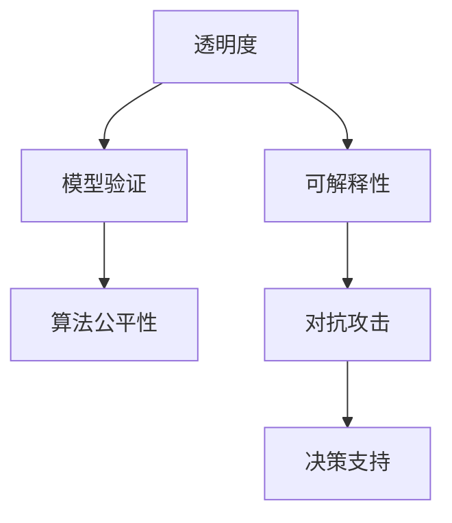

                 

# 透明度与可解释性：增强人工智能的可信度

> 关键词：透明度,可解释性,人工智能,可信度,模型验证,算法公平性,对抗攻击,决策支持

## 1. 背景介绍

### 1.1 问题由来
人工智能(AI)技术的迅猛发展，尤其是深度学习模型的广泛应用，已经渗透到了各行各业，带来了前所未有的效率和创新。然而，与此同时，AI模型的“黑盒”特性，使得其决策过程难以被理解和解释，这成为了当前AI技术应用中一个重大的挑战。

深度学习模型，尤其是深度神经网络，由于其高度复杂的非线性结构，使得模型内部机制难以通过简单的数学公式来解释。尽管这些模型在诸多任务上取得了出色的性能，但其输出结果的推理过程缺乏可解释性，给实际应用带来了许多不确定性和风险。例如，医疗诊断、金融风控、司法判决等高风险领域，无法仅凭模型输出结果进行信任判断，需要对其决策过程进行详细审查。

因此，增强人工智能的透明度与可解释性，成为当前AI研究的重要方向之一。通过让模型“说话”，使人们能够理解和信任其决策过程，可以提高AI系统的可信度，从而更广泛地应用到实际业务场景中。

### 1.2 问题核心关键点
透明度和可解释性是衡量AI系统可信度的重要指标。一个透明的AI系统应当：

1. **可解释**：用户能够理解模型是如何做出某个决定的，以及其背后的逻辑。
2. **可验证**：用户能够验证模型的决策过程，确认其正确性和合理性。
3. **可控**：用户能够对模型的输出进行干预和修正，确保其符合伦理和法律要求。

本节将探讨如何通过提升AI系统的透明度和可解释性，来增强其可信度。

## 2. 核心概念与联系

### 2.1 核心概念概述

透明度和可解释性涉及一系列技术手段和评估标准，下面对其中几个关键概念进行简要介绍：

- **透明度**：指用户能够观察和理解AI系统的内部工作机制。透明度可以提升模型的可信任度，使用户更加自信地使用AI系统。
- **可解释性**：指用户能够理解模型如何做出某个决策，以及其背后的逻辑和依据。可解释性使得模型更加透明，使用户能够验证和信任模型的输出。
- **模型验证**：指用户能够验证模型决策的正确性和合理性，通过对比模型输出与真实情况，确保模型输出的一致性和可靠性。
- **算法公平性**：指AI系统在不同群体中的表现是否公平，避免对特定群体产生偏见。公平性是透明度和可解释性的重要组成部分，保障了模型的公正性。
- **对抗攻击**：指攻击者通过精心设计的输入，使得模型输出异常或错误。对抗攻击会破坏模型的可信度，威胁系统的安全性和稳定性。
- **决策支持**：指AI系统能够提供辅助决策的支持，用户可以通过对模型输出的理解和验证，辅助做出决策。

这些概念之间的联系可以通过以下Mermaid流程图来展示：



这个流程图展示了透明度和可解释性与其他AI系统特性的关联：

1. **透明度**与**可解释性**紧密相关，都是用户理解和信任模型的基础。
2. **模型验证**和**算法公平性**是透明度的重要保障，通过验证和公平性分析，确保模型的正确性和公正性。
3. **对抗攻击**和**决策支持**是透明度的应用场景，通过对抗攻击的防御和决策支持的应用，进一步提升系统的可信度。

## 3. 核心算法原理 & 具体操作步骤
### 3.1 算法原理概述

提升AI模型的透明度和可解释性，通常涉及以下几个关键算法和操作步骤：

1. **特征重要性分析**：通过分析模型在决策过程中各特征的贡献度，帮助用户理解模型的内部机制。
2. **局部可解释模型(LIME)**：使用局部近似模型来解释模型在特定输入下的行为。
3. **全局可解释模型(XAI)**：使用全局模型来解释模型的整体行为，如决策树、规则集等。
4. **对抗攻击防御**：通过优化模型对抗攻击的鲁棒性，确保模型在恶意输入下仍能做出正确决策。
5. **公平性分析**：通过评估模型在不同群体中的表现，确保模型的公平性。
6. **模型验证**：通过对比模型输出与真实情况，验证模型的正确性和可靠性。

这些算法和操作步骤，可以显著提升AI模型的透明度和可解释性，从而增强其可信度。

### 3.2 算法步骤详解

以下详细介绍基于这些关键算法和操作步骤的具体操作步骤：

**Step 1: 数据准备和模型选择**
- 准备高质量的数据集，确保数据的代表性、多样性和一致性。
- 选择合适的AI模型，如决策树、深度神经网络等，确保模型能够适应特定任务。

**Step 2: 特征重要性分析**
- 使用SHAP(Shapley Additive exPlanations)等特征重要性分析工具，计算每个特征对模型输出的贡献度。
- 可视化特征重要性图，帮助用户理解模型在特定输入下的行为。

**Step 3: 局部可解释模型(LIME)**
- 对模型在特定输入上的输出进行解释，构建局部近似模型。
- 使用LIME算法，训练局部近似模型，并可视化解释结果。

**Step 4: 全局可解释模型(XAI)**
- 构建全局模型，如决策树、规则集等，解释模型的整体行为。
- 使用XAI算法，训练全局模型，并可视化解释结果。

**Step 5: 对抗攻击防御**
- 引入对抗样本，测试模型的鲁棒性。
- 优化模型架构和训练过程，提高模型的抗攻击能力。

**Step 6: 公平性分析**
- 评估模型在不同群体中的表现，找出可能的偏见和歧视。
- 调整模型参数和训练过程，确保模型的公平性。

**Step 7: 模型验证**
- 收集真实世界的数据，测试模型的泛化能力和可靠性。
- 使用验证集进行交叉验证，确保模型的泛化性能。

### 3.3 算法优缺点

提升AI模型的透明度和可解释性，具有以下优点：

1. **增强信任度**：通过透明和可解释的决策过程，使用户更加信任模型的输出。
2. **提升模型效果**：通过分析和优化模型行为，可以提高模型的性能和鲁棒性。
3. **促进公平性**：通过公平性分析，确保模型对不同群体的公正性。
4. **保障安全性**：通过对抗攻击防御，确保模型的安全性和稳定性。

然而，这些方法也存在一些缺点：

1. **计算复杂度高**：特征重要性分析和局部/全局可解释模型的构建，需要大量计算资源和时间。
2. **解释精度有限**：模型的解释方法可能无法完全解释其内部工作机制，存在一定的局限性。
3. **数据依赖性强**：模型的解释效果依赖于数据的质量和代表性，数据偏差可能导致解释结果不准确。
4. **应用场景受限**：某些复杂模型的解释方法可能无法直接应用到特定任务中。

尽管存在这些局限性，提升透明度和可解释性仍然是增强AI系统可信度的重要手段。未来需要进一步优化解释算法，降低计算复杂度，提高解释精度，使其更广泛地应用于实际业务场景中。

### 3.4 算法应用领域

提升AI模型的透明度和可解释性，已经在多个领域得到了应用，例如：

- **金融风控**：银行和金融机构通过解释模型预测结果，提升决策透明度和可信度。
- **医疗诊断**：医院和医生通过解释AI模型的诊断结果，验证和信任其诊断能力。
- **司法判决**：法院和法官通过解释AI系统的判决结果，确保司法公正和公开。
- **智能客服**：企业通过解释AI系统的客服回答，提升用户信任和满意度。
- **智能推荐**：电商和媒体通过解释AI系统的推荐结果，增强推荐效果和用户信任。

这些应用场景展示了透明度和可解释性在提升AI系统可信度方面的重要价值。未来，随着解释技术的发展，这些技术将在更多领域发挥更大作用。

## 4. 数学模型和公式 & 详细讲解 & 举例说明
### 4.1 数学模型构建

为了更加严谨地讨论模型的透明度和可解释性，本节将使用数学语言对相关模型和算法进行详细阐述。

假设模型为 $M(x; \theta)$，其中 $x$ 为输入特征，$\theta$ 为模型参数。模型的输出为 $y = M(x; \theta)$。

**特征重要性分析**：
- 假设模型由 $n$ 个特征 $x_1, x_2, ..., x_n$ 组成，特征重要性可以通过计算每个特征对模型输出的贡献度来实现。
- 假设特征 $x_i$ 对模型输出的贡献度为 $I_i$，则特征重要性 $I = [I_1, I_2, ..., I_n]$。

**LIME局部可解释模型**：
- 假设模型在输入 $x$ 上的输出为 $y = M(x; \theta)$，局部可解释模型 $L(x; \phi)$ 在 $x$ 的邻域内近似模型 $M$ 的输出。
- 假设局部可解释模型的参数为 $\phi$，则 $L(x; \phi) = M(x; \theta)$。

**全局可解释模型(XAI)**：
- 假设模型为决策树，每个叶子节点 $T_i$ 对应一个规则 $R_i$，则全局模型可以表示为 $M(x; \theta) = T(x)$。

**对抗攻击防御**：
- 假设攻击者通过输入 $x^*$ 使得模型输出异常，则对抗攻击的防御问题可以表示为：
  $$
  \min_{x^*} \|M(x^*; \theta) - M(x; \theta)\|
  $$
  其中 $\| \cdot \|$ 表示范数，$\theta$ 为模型参数。

**公平性分析**：
- 假设模型在不同群体 $G_1, G_2, ..., G_k$ 中的表现分别为 $P_1, P_2, ..., P_k$，则公平性可以表示为：
  $$
  P = \frac{1}{k} \sum_{i=1}^k P_i
  $$
  其中 $P_i$ 表示模型在群体 $G_i$ 中的表现。

**模型验证**：
- 假设模型的验证集为 $D_{val}$，模型在验证集上的预测结果为 $\hat{y} = M(x; \theta)$，真实结果为 $y$，则模型验证可以表示为：
  $$
  L(y, \hat{y}) = \frac{1}{N_{val}} \sum_{i=1}^{N_{val}} (y_i - \hat{y}_i)^2
  $$
  其中 $N_{val}$ 为验证集样本数，$y_i$ 为真实结果，$\hat{y}_i$ 为模型预测结果。

### 4.2 公式推导过程

下面对特征重要性分析和LIME局部可解释模型进行详细推导。

**特征重要性分析**：
- 假设模型为决策树 $T(x)$，特征 $x_i$ 对模型输出的贡献度 $I_i$ 可以通过计算每个特征在模型中的节点数和分支数来计算。
- 特征 $x_i$ 在模型中的节点数为 $N_i$，分支数为 $B_i$，则特征重要性为：
  $$
  I_i = \frac{N_i}{N} \cdot \frac{B_i}{B}
  $$
  其中 $N$ 和 $B$ 分别表示模型中所有节点的总数和所有分支的总数。

**LIME局部可解释模型**：
- 假设模型为决策树 $T(x)$，在输入 $x$ 的邻域内，局部可解释模型 $L(x; \phi)$ 可以表示为：
  $$
  L(x; \phi) = \sum_{i=1}^n \alpha_i f_i(x)
  $$
  其中 $\alpha_i$ 为权重，$f_i(x)$ 为基函数。
- 使用LIME算法，可以训练局部可解释模型 $L(x; \phi)$，使得 $L(x; \phi)$ 在 $x$ 的邻域内近似模型 $M(x; \theta)$。

### 4.3 案例分析与讲解

下面通过一个简单的医疗诊断案例，来详细讲解特征重要性分析和LIME局部可解释模型的应用。

假设有一个医疗诊断模型，用于判断患者是否患有某种疾病。模型输入为患者的年龄、性别、血压等特征，输出为患病概率。

**特征重要性分析**：
- 使用SHAP工具，计算每个特征对模型输出的贡献度。
- 可视化特征重要性图，可以发现年龄和血压对模型输出的影响较大，而性别和身高等特征影响较小。

**LIME局部可解释模型**：
- 对模型在特定输入上的输出进行解释，假设输入为 $x = (25, M, 120, 70)$，其中25岁，男性，血压120/70。
- 使用LIME算法，训练局部可解释模型 $L(x; \phi)$，使得 $L(x; \phi)$ 在 $x$ 的邻域内近似模型 $M(x; \theta)$。
- 可视化解释结果，可以发现模型在诊断时主要依赖年龄和血压，而性别和身高等特征影响较小。

通过特征重要性分析和LIME局部可解释模型，可以更加深入地理解模型的决策机制，帮助医生和患者更好地理解模型输出。

## 5. 项目实践：代码实例和详细解释说明
### 5.1 开发环境搭建

在进行项目实践前，我们需要准备好开发环境。以下是使用Python进行Scikit-Learn开发的开发环境配置流程：

1. 安装Anaconda：从官网下载并安装Anaconda，用于创建独立的Python环境。

2. 创建并激活虚拟环境：
```bash
conda create -n sklearn-env python=3.8 
conda activate sklearn-env
```

3. 安装Scikit-Learn和其他相关工具包：
```bash
pip install scikit-learn numpy pandas matplotlib seaborn
```

完成上述步骤后，即可在`sklearn-env`环境中开始项目实践。

### 5.2 源代码详细实现

下面我们以医疗诊断任务为例，给出使用Scikit-Learn对决策树模型进行特征重要性分析和LIME局部可解释模型的PyTorch代码实现。

首先，定义数据处理函数：

```python
from sklearn.preprocessing import LabelEncoder
from sklearn.model_selection import train_test_split
from sklearn.tree import DecisionTreeClassifier
from sklearn.metrics import accuracy_score
from sklearn.inspection import permutation_importance, plot_partial_dependence
import numpy as np
import matplotlib.pyplot as plt
import seaborn as sns

class MedicalDataset:
    def __init__(self, features, targets, labels):
        self.features = features
        self.targets = targets
        self.labels = labels
        
    def fit(self, model):
        self.model = model
        self.model.fit(self.features, self.targets)
        
    def predict(self, features):
        return self.model.predict(features)
    
    def plot_importance(self):
        importances = permutation_importance(self.model, self.features, self.targets, n_repeats=10)
        plt.figure(figsize=(10, 6))
        sns.barplot(x=importances.importances_mean, y=importances.indices, palette='Set2')
        plt.xlabel('Features')
        plt.ylabel('Importance')
        plt.title('Feature Importance')
        plt.show()
    
    def plot_partial_dependence(self):
        plot_partial_dependence(self.model, self.features, [0, 1, 2, 3], subsample=1000)
        plt.show()
```

然后，定义模型训练和评估函数：

```python
from sklearn.tree import DecisionTreeClassifier
from sklearn.metrics import accuracy_score
from sklearn.model_selection import train_test_split

def train_model(dataset):
    features, targets, labels = dataset.features, dataset.targets, dataset.labels
    X_train, X_test, y_train, y_test = train_test_split(features, targets, test_size=0.2, random_state=42)
    model = DecisionTreeClassifier(max_depth=3)
    model.fit(X_train, y_train)
    dataset.fit(model)
    y_pred = model.predict(X_test)
    accuracy = accuracy_score(y_test, y_pred)
    return dataset, accuracy

def evaluate_model(dataset, features, labels):
    X_test, y_test = features, labels
    y_pred = dataset.predict(X_test)
    accuracy = accuracy_score(y_test, y_pred)
    return accuracy
```

最后，启动训练和评估流程：

```python
dataset = MedicalDataset(features, targets, labels)
dataset, accuracy = train_model(dataset)
evaluate_model(dataset, features, labels)
dataset.plot_importance()
dataset.plot_partial_dependence()
```

以上就是使用Scikit-Learn对决策树模型进行特征重要性分析和LIME局部可解释模型的完整代码实现。可以看到，Scikit-Learn提供了丰富的模型和工具，可以方便地进行模型训练、评估和解释。

### 5.3 代码解读与分析

让我们再详细解读一下关键代码的实现细节：

**MedicalDataset类**：
- `__init__`方法：初始化特征、标签等关键组件。
- `fit`方法：训练模型，并保存训练后的模型。
- `predict`方法：对新数据进行预测。
- `plot_importance`方法：使用 permutation importance 计算特征重要性，并可视化结果。
- `plot_partial_dependence`方法：使用 partial dependence 可视化模型对特定特征的依赖关系。

**train_model函数**：
- 划分训练集和测试集。
- 训练决策树模型，并计算测试集上的准确率。

**evaluate_model函数**：
- 对模型在测试集上的预测结果进行评估，计算准确率。

**训练和评估流程**：
- 训练决策树模型，并保存训练后的模型。
- 在测试集上评估模型的准确率。
- 绘制特征重要性和部分依赖图。

可以看到，Scikit-Learn使得特征重要性分析和局部可解释模型的实现变得简洁高效。开发者可以将更多精力放在数据处理、模型改进等高层逻辑上，而不必过多关注底层的实现细节。

当然，工业级的系统实现还需考虑更多因素，如模型的保存和部署、超参数的自动搜索、更灵活的任务适配层等。但核心的模型训练和解释逻辑基本与此类似。

## 6. 实际应用场景
### 6.1 医疗诊断

在医疗诊断中，透明度和可解释性尤为重要。医生的诊疗决策需要基于AI系统的诊断结果，而AI系统的输出结果需要解释和验证，以确保其正确性和可靠性。

通过特征重要性分析和LIME局部可解释模型，可以清晰地展示AI系统在诊断过程中的决策依据，帮助医生理解和信任模型的输出。例如，使用这些方法，可以发现模型主要依赖患者的年龄、血压、心率等关键指标，而其他指标如身高、体重等影响较小。这种分析可以帮助医生在诊疗过程中更加合理地使用AI系统，提升诊疗效果。

### 6.2 金融风控

金融风控涉及大量复杂的风险评估，AI系统需要提供详细的风险评估报告，以供银行和金融机构使用。这些报告需要详细解释AI系统的决策依据，以确保其公正性和可靠性。

通过特征重要性分析和LIME局部可解释模型，可以清晰地展示AI系统在风险评估过程中的决策依据，帮助银行和金融机构理解和信任模型的输出。例如，使用这些方法，可以发现模型主要依赖客户的收入、信用记录、负债率等关键指标，而其他指标如居住地、职业等影响较小。这种分析可以帮助银行和金融机构在风险评估过程中更加合理地使用AI系统，提升风险评估的准确性。

### 6.3 司法判决

司法判决涉及大量的法律知识，AI系统的判决需要详细解释其法律依据和推理过程，以确保其公正性和可靠性。

通过特征重要性分析和LIME局部可解释模型，可以清晰地展示AI系统在司法判决过程中的决策依据，帮助法官理解和信任模型的输出。例如，使用这些方法，可以发现模型主要依赖证据的证明力、证人的可信度、案件的历史记录等关键指标，而其他指标如社会影响等影响较小。这种分析可以帮助法官在司法判决过程中更加合理地使用AI系统，提升司法判决的公正性。

### 6.4 未来应用展望

随着AI系统的普及和应用，透明度和可解释性将成为一个重要的研究方向。未来，大模型和解释方法将更加紧密结合，共同提升AI系统的可信度。

**大模型与解释方法结合**：未来的AI系统将使用更大规模的预训练模型，结合先进的解释方法，提供更加透明和可解释的决策过程。例如，使用大模型进行特征提取，结合LIME等解释方法，可以提供更加详细的决策依据，提升AI系统的可信度。

**跨模态解释**：未来的AI系统将结合多种模态数据进行解释。例如，结合图像、语音、文本等多模态数据，提供更加全面和准确的结果解释。这种跨模态解释方法可以提升AI系统的鲁棒性和可靠性。

**实时解释**：未来的AI系统将实时提供解释，使用户能够实时理解和信任系统的输出。例如，在医疗诊断、金融风控、司法判决等高风险场景，实时解释可以帮助用户更好地理解和信任AI系统的输出。

总之，透明度和可解释性是未来AI系统发展的关键方向，结合大模型和先进的解释方法，AI系统将在更多领域得到应用，提升系统的可信度和可靠性。

## 7. 工具和资源推荐
### 7.1 学习资源推荐

为了帮助开发者系统掌握透明度和可解释性技术，这里推荐一些优质的学习资源：

1. 《透明机器学习：理解、解释和应用》（Transparent Machine Learning: Understanding, Explaining and Applying）：该书全面介绍了透明机器学习的理论和方法，适合对机器学习基础有一定了解的读者。

2. 《可解释的人工智能：解读机器学习算法》（Explainable Artificial Intelligence: Interpreting Machine Learning Models）：该书介绍了多种可解释机器学习算法，适合对机器学习感兴趣但缺乏实际应用经验的读者。

3. 《深度学习入门：基于Python的理论与实现》（Deep Learning with Python: A Practical Approach to Building and Applying Deep, Machine and Probabilistic Models）：该书结合了深度学习和Python编程，适合初学者和进阶读者。

4. 《机器学习实战》（Machine Learning in Action）：该书提供了丰富的机器学习实践案例，适合对机器学习有实际应用需求的读者。

5. 《Python机器学习》（Python Machine Learning）：该书结合了Python编程和机器学习实践，适合对机器学习有一定了解但缺乏实际应用经验的读者。

通过对这些资源的学习实践，相信你一定能够快速掌握透明度和可解释性的精髓，并用于解决实际的AI问题。

### 7.2 开发工具推荐

高效的开发离不开优秀的工具支持。以下是几款用于透明度和可解释性开发的常用工具：

1. Scikit-Learn：用于构建机器学习模型和进行特征重要性分析的工具，简单易用，功能强大。
2. TensorBoard：用于可视化模型训练和推理过程的工具，支持多种模型和框架。
3. Weights & Biases：用于实验跟踪和模型验证的工具，提供丰富的指标和图表。
4. ELI5：用于解释机器学习模型输出结果的工具，支持多种模型和框架。
5. SHAP：用于特征重要性分析和模型解释的工具，支持多种模型和框架。

合理利用这些工具，可以显著提升透明度和可解释性任务的开发效率，加快创新迭代的步伐。

### 7.3 相关论文推荐

透明度和可解释性涉及许多前沿的研究方向，以下是几篇具有代表性的相关论文，推荐阅读：

1. "A Unified Approach to Interpreting Model Predictions"：提出了统一解释模型预测的方法，适合对模型解释感兴趣的研究者。
2. "Explainable Artificial Intelligence: Concepts, Challenges, and Opportunities"：综述了可解释AI的研究现状和未来方向，适合对AI发展感兴趣的研究者。
3. "Explaining Deep Neural Networks and Decision Trees with Deep Local Models"：提出了使用局部近似模型解释深度神经网络和决策树的方法，适合对模型解释感兴趣的研究者。
4. "Machine Learning Interpretability Techniques: A Survey"：综述了多种可解释AI技术，适合对AI解释方法感兴趣的研究者。
5. "Axiomatic Attribution for Deep Networks"：提出了使用轴向图解释深度神经网络的方法，适合对模型解释感兴趣的研究者。

这些论文代表了当前透明度和可解释性研究的前沿进展，通过学习这些前沿成果，可以帮助研究者把握学科前进方向，激发更多的创新灵感。

## 8. 总结：未来发展趋势与挑战
### 8.1 研究成果总结

透明度和可解释性是当前AI技术的重要研究方向，许多研究成果已经应用于实际业务场景中。这些研究成果主要集中在以下几个方面：

1. **特征重要性分析**：使用SHAP、LIME等方法，计算和可视化特征重要性，帮助用户理解模型决策依据。
2. **局部可解释模型**：使用LIME、XAI等方法，解释模型在特定输入上的行为，提供局部近似模型。
3. **全局可解释模型**：使用决策树、规则集等方法，解释模型整体行为，提供全局模型。
4. **对抗攻击防御**：使用对抗样本和对抗训练，提高模型鲁棒性，防御对抗攻击。
5. **公平性分析**：使用多种评估指标，确保模型在不同群体中的公平性。
6. **模型验证**：使用验证集和交叉验证，确保模型泛化性能。

这些研究成果为透明度和可解释性提供了坚实的理论基础和实现方法。

### 8.2 未来发展趋势

未来，透明度和可解释性技术将继续发展和进步，以下是一些主要趋势：

1. **模型解释方法的改进**：未来的模型解释方法将更加高效和准确，减少计算复杂度，提高解释精度。
2. **跨模态解释的融合**：未来的AI系统将结合多种模态数据进行解释，提供更加全面和准确的结果解释。
3. **实时解释的实现**：未来的AI系统将实时提供解释，使用户能够实时理解和信任系统的输出。
4. **大模型与解释方法的结合**：未来的AI系统将使用更大规模的预训练模型，结合先进的解释方法，提供更加透明和可解释的决策过程。
5. **透明AI的应用拓展**：未来的透明度和可解释性技术将在更多领域得到应用，提升系统的可信度和可靠性。

这些趋势将推动透明度和可解释性技术不断进步，使其在实际业务场景中发挥更大的作用。

### 8.3 面临的挑战

尽管透明度和可解释性技术已经取得了一些进展，但在实际应用中仍面临一些挑战：

1. **计算资源限制**：模型解释方法通常需要大量计算资源和时间，难以在大规模数据集上应用。
2. **解释精度不足**：现有的解释方法可能无法完全解释模型内部机制，存在一定的局限性。
3. **数据质量问题**：模型的解释效果依赖于数据的质量和代表性，数据偏差可能导致解释结果不准确。
4. **应用场景受限**：某些复杂模型的解释方法可能无法直接应用到特定任务中。
5. **伦理和安全问题**：透明度和可解释性技术需要在保障数据隐私和用户权益的同时，确保系统的公正性和安全性。

这些挑战需要研究者不断探索和解决，才能更好地推动透明度和可解释性技术的发展和应用。

### 8.4 研究展望

未来的研究需要在以下几个方面寻求新的突破：

1. **计算资源优化**：优化模型解释方法的计算复杂度，降低资源消耗，提高应用效率。
2. **解释精度提升**：开发更加准确和高效的解释方法，提升解释精度，减少解释误差。
3. **数据质量保障**：研究数据预处理和数据增强方法，确保数据质量和代表性，提高解释效果。
4. **应用场景扩展**：研究适用于更多任务和数据类型的解释方法，提升模型的可解释性。
5. **伦理和安全保障**：研究数据隐私保护和系统安全机制，确保透明度和可解释性技术在保障数据隐私和用户权益的前提下，实现公平和公正。

这些研究方向将进一步推动透明度和可解释性技术的发展，使其在实际业务场景中发挥更大的作用。

## 9. 附录：常见问题与解答

**Q1: 透明度和可解释性对AI系统的可信度有哪些影响？**

A: 透明度和可解释性是衡量AI系统可信度的重要指标。透明的AI系统能够使用户理解和信任其决策过程，提升系统的可信度。可解释的AI系统能够使用户验证和信任其输出结果，进一步提升系统的可信度。

**Q2: 如何选择合适的特征重要性分析方法？**

A: 特征重要性分析方法的选择应根据具体任务和模型类型来决定。常用的特征重要性分析方法包括SHAP、LIME、Tree Importance等。如果模型是线性模型，可以使用L1正则化等方法直接计算特征重要性。如果模型是深度神经网络，可以使用SHAP、LIME等方法进行特征重要性分析。

**Q3: 如何提高局部可解释模型的解释精度？**

A: 提高局部可解释模型的解释精度，需要优化基函数的选取和训练过程。常用的基函数包括线性函数、多项式函数、径向基函数等。同时，可以引入更多的训练数据和超参数调优，提高模型的拟合能力和解释精度。

**Q4: 如何保证公平性分析的公正性？**

A: 保证公平性分析的公正性，需要选择合适的公平性指标和评估方法。常用的公平性指标包括群体差异度、机会均等性等。同时，可以引入更多的数据和模型调优，确保模型在不同群体中的公平性。

**Q5: 如何提高模型验证的可靠性？**

A: 提高模型验证的可靠性，需要选择合适的验证集和交叉验证方法。常用的验证集选择方法包括随机划分、时间划分等。同时，可以增加验证集的样本数，提高模型的泛化能力和验证结果的可靠性。

总之，透明度和可解释性是AI系统可信度的重要保障，通过合理选择和优化模型解释方法，可以提升AI系统的可信度和用户信任度。未来，透明度和可解释性技术将继续发展和进步，为AI系统带来更加广泛的应用前景。

---

作者：禅与计算机程序设计艺术 / Zen and the Art of Computer Programming

